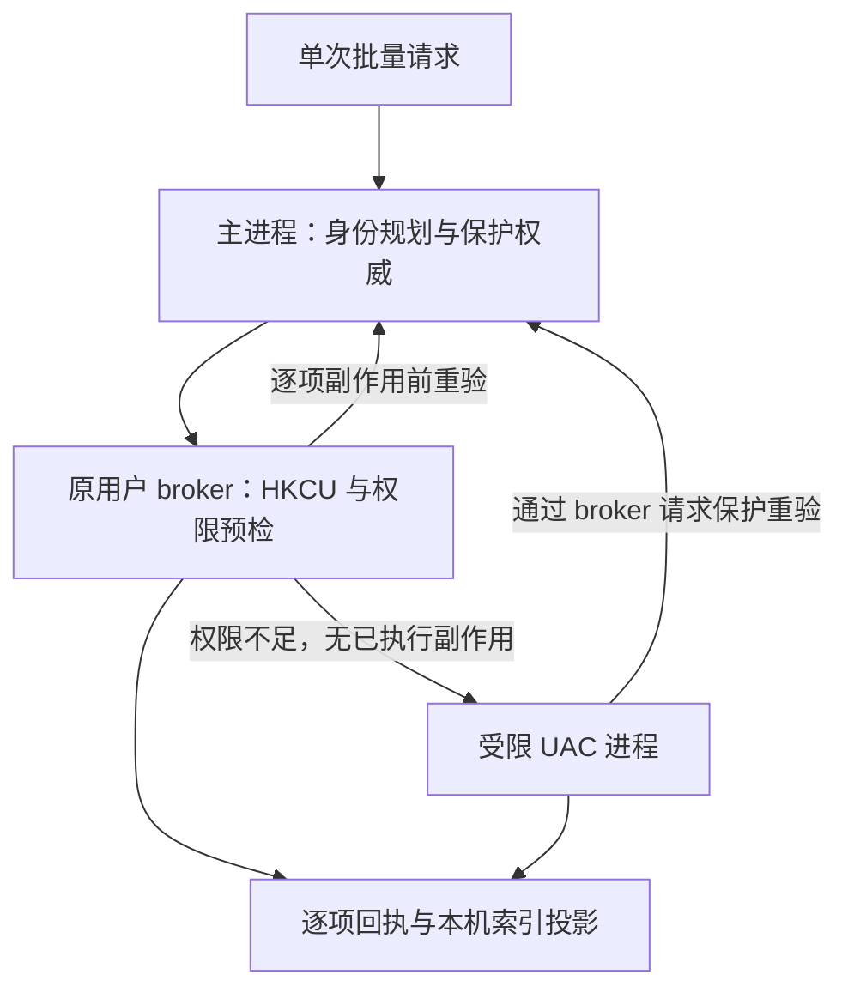
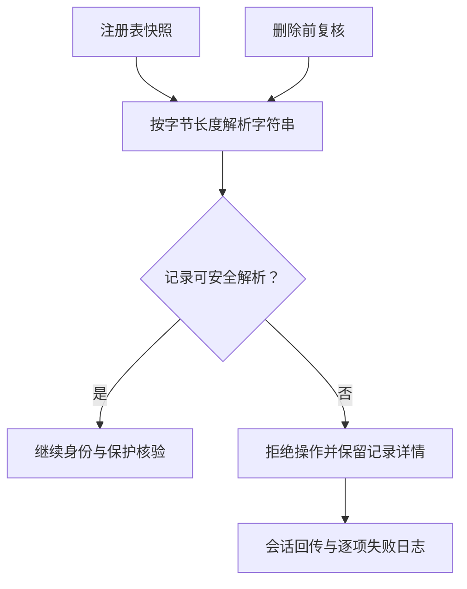
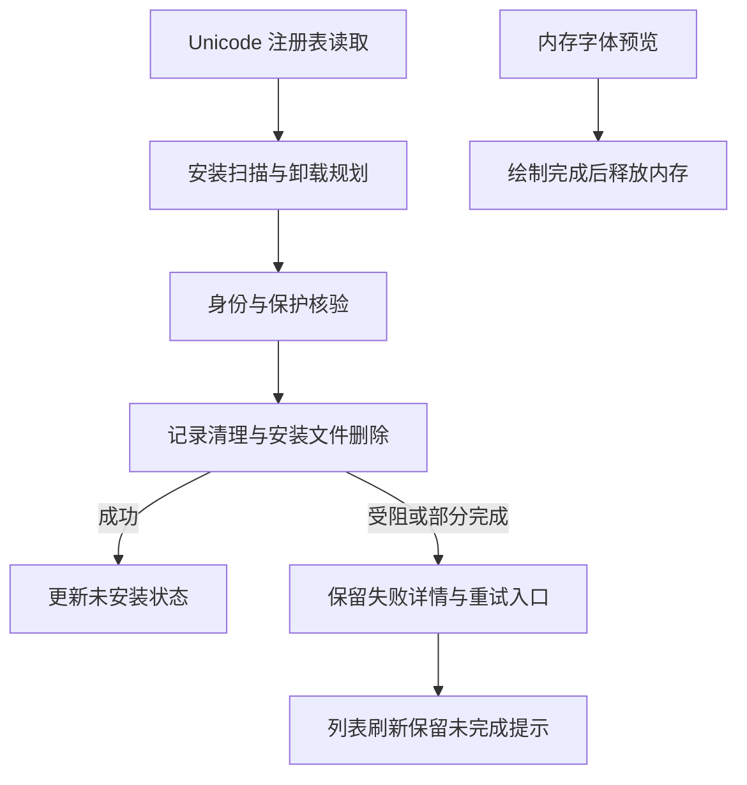
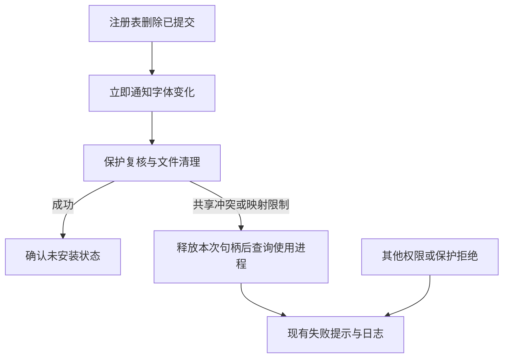
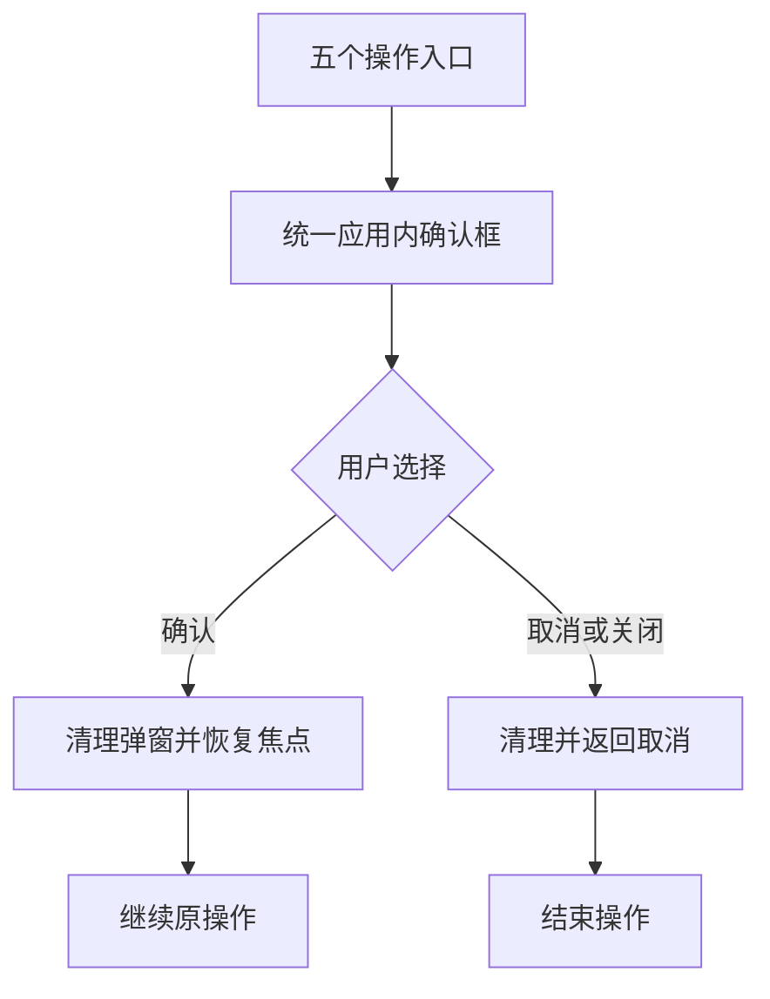

# HFM 字体身份、页面残留与卸载删除权限任务书

## 0. 范围、基线与授权

- 编制日期：2026-10-02（Asia/Shanghai）；仓库：`uniquenesssta/99`。
- 审计及文档基线：`55b5b011fbf4444418a7d1f06828eb32216c9e41`；编制前工作树干净，本地与远端一致。
- 按用户本轮“新建分支，开始 F01”指令，转为 Stage 12 专项，编号 **S12-F01～F07**（原 S11-F01～F07）；新分支 `stage/12-font-identity-permissions` 从包含任务书的 `851d0e0` 创建，源码审计基线仍为 `55b5b01`。不改动 Stage 10/11 原分支。关联入口为 [列表与网格任务书](HFM_LIST_GRID_VIEW_OPTIMIZATION_TASKBOOK.md)。
- 当前授权：按“开始修复所有出现的问题”处理最新启动日志中的全部五项计数、查询和性能问题，允许推送并启动 Windows CI。**F01 反例审计已收尾（范围及遗留项见第 8 节）；F02/F03 及本轮日志补修已通过 Windows CI `37047424903`，用户提供实机日志并确认收尾（第 15.7 节）；F04 已实机确认收尾；F05 全项 Windows CI `37134748077` 通过，用户明确此前已要求“收尾 F05、开始 F06”，F06 已按用户确认收尾（§18.17）；F07 完整 Windows CI `37205632828` 通过，用户反馈“已通过”，已交付范围收尾，真实权限待验与遗留能力保持（§19.9）。**
- 平台仅 Windows。当前审计环境为 Linux，只进行源码和文档读写；Windows 动态证据来自 GitHub Actions 的真实 Rust/Electron 运行，不把本地静态推演标成复现成功。
- UI 依据为本轮用户截图和现有组件；未指定 Figma 文件，不虚构节点或扩大到界面改版。
- 原专项已通过的历史回执保留，本任务书不将旧阶段重新判为失败，也不提前关闭 V07；本轮问题的解决状态须在最终收官前明确。

## 1. 用户目标与不变项

1. 软件保护只由用户“加入保护”决定。安装、重新安装、扫描、激活、位于 Windows Fonts 或使用 HKLM 不得自动等同于受保护。
2. 安装状态、激活状态、手动保护独立；已有手动保护不得被安装、刷新或迁移覆盖。
3. 未保护字体可发起卸载或文件删除；权限不足时按需申请 UAC，不要求整个软件长期以管理员运行。
4. 切换全部、收藏、已安装、未安装、已激活、标签、目录或搜索时，结果、数量、空态和实际卡片一致，不残留旧卡片。
5. 列表预览滑块不得覆盖或抢占右键菜单、弹窗的交互。
6. 保持单选/多选统一入口、100ms 防连击、详情返回定位、10 个实际预览并发、滚动暂停及停滚 150ms 恢复、已有共享 I/O 与退出所有权规则。
7. 不清空用户数据库或预览缓存，不重新全库扫描作为默认修复，不恢复已取消的固定次数性能验收；完整回归与封包继续分离。
8. “未保护”表示业务上允许操作，不表示绕过 Windows 访问控制、占用限制或共享服务器 ACL。不得默认接管系统文件所有权、修改整目录 ACL、停用 WRP，或将回收站失败静默改为永久删除。

## 2. 问题清单与证据等级

| 编号 | 优先级 | 事实与影响 | 证据状态 / 归属 |
| --- | --- | --- | --- |
| I-01 | P1 | 跨根文件相对路径、大小、修改时间相同会得到相同运行时 ID；数据库按根和相对路径区分记录，第一页未按运行时 ID 去重，前端字典和 React key 却只用 ID | 源码确定；截图实库是否发生碰撞待核对；F01/F02 |
| I-02 | P1 | 用户截图中收藏 0、已激活 0，空态与两张旧卡片同时存在；其他筛选仍显示同样旧卡片 | 现象确定；Windows 隔离样本已复现重复 key 残留，用户实库根因仍待核对；F01/F02 |
| I-03 | P1 | 数据库页展示优先选 `library.fonts[id]`；数据库路径仅复核顶部 installStatus，未统一复核侧栏安装条件，可能产生筛选与卡片状态矛盾 | 代码确定；不可把前端过滤当作总数/分页一致性的完整修复；F03 |
| I-04 | P2 | 滑块直接挂 body、fixed、z-index 12000；菜单 9999。可盖住菜单并接收鼠标 | 源码及截图确定；F04 |
| I-05 | P1 | 前端把 HKLM/Windows Fonts 字体视为保护，后端另有默认文件名拒绝名单；取消手动保护不能解除这些判断 | 源码确定；F05 |
| I-06 | P1 | 已安装、已激活、systemImported、非监听目录字体被文件删除直接跳过；系统卸载只检测权限，不按需提权 | 源码确定；F06 |
| I-07 | P1 | 卸载吞掉部分注册表/文件异常，以候选数量报告成功；前端成功后直接置未安装，失败原因未完整呈现 | 源码确定；F06 |
| I-08 | P1 | 卸载使用名称包含匹配；部分目录校验只做 startsWith。提权前须确认准确目标和规范路径边界 | 源码确定，未证实用户发生误删；F06 |
| I-09 | P1 | 现有保护写入依赖监听目录共享索引，系统导入等非监听字体的手动保护持久化能力不足；执行入口依赖传入对象保护状态 | 源码确定；需核对其他已有存储入口后统一权威；F05 |

优先级表示修复安排，不表示已发生数据丢失。不得声称“搜索没有问题”或“截图必定由 ID 碰撞造成”；未提供运行日志与实库记录。

## 3. 已核实代码定位

路径相对仓库根，以函数名定位，实施时复核最新提交。

| 链路 | 文件 / 符号 |
| --- | --- |
| ID 生成与行转换 | `native-src/hfm-core-worker/src/merged_index/path_utils.rs:shared_font_id`；`font_row.rs:font_from_merged_row`；`query_page.rs`；`rebuild.rs` 中 entries 主键 |
| Node/SQL 身份 | `src/main/indexing/mergedIndexRuntime.ts:sharedFontId`；`root-query/rootIndexQuerySharedSql.ts:rootIndexRuntimeFontIdExpr` |
| 页合并及前端字典 | `src/renderer/src/runtime/database/useRendererDatabasePageRuntime.ts:mergeIncrementalDatabasePage`；`library-normalize/libraryNormalizeStateRuntime.ts:libraryWithMergedFonts` |
| 查询与展示 | `src/renderer/src/fontViewRuntime.ts:buildVisibleFonts/buildVirtualLayout`；`runtime/app/useBrowseController.ts`；`useBrowseDerivedRuntime.ts`；`useAppFontDerivedRuntime.ts` |
| 卡片 key 与空态 | `src/renderer/src/components/app/FontCardRenderer.tsx`；`FontListPanel.tsx` |
| 滑块/菜单层级 | `src/renderer/src/utils/floatingScrollbars.ts`；`styles/10-floating-scrollbar.css`；`styles/04-inline-modal-preview.css` |
| 保护规则 | `src/renderer/src/fontDisplay.ts`；`fontSelectionRuntime.ts`；`src/main/install/windowsDefaultFonts.ts`；`src/main/library/sharedFontMetadataMutations.ts:setFontDeleteProtectionInIndex` |
| 卸载/删除 | `src/main/install/systemFontInstallRuntime.ts`；`systemFontInstallHelpersRuntime.ts`；`fontTrashDeleteRuntime.ts`；renderer `runtime/system/actions/fontInstallActionRuntime.ts`、`fontDeleteActionRuntime.ts` |

## 4. 执行顺序与 Atomic Task

顺序：F01 → F02 → F03 → F04 → F05 → F06 → F07。F04 技术上可独立处理；只有取得相应实施授权才可提前执行。危险操作扩权必须在 F02 身份与操作目标隔离、F05 保护权威完成后进行。

### S12-F01：Windows 复现与身份契约审计

- 在隔离的临时字体库中准备两个根目录，同一相对路径、相同文件大小、相同修改时间的测试字体副本；不操作真实系统字体。
- 比较两根数据库行、Rust/Node 页结果的 ID/path/sourceId、前端对象、渲染 key；覆盖第一页、后续页与分页交界，检查分页合并是否按碰撞 ID 丢行。
- 真实 React DOM 操作：多条重复 key 结果 → 不包含它们的非空结果 → 空结果；同时执行侧栏切换、输入/清空搜索、选中/取消、列表/网格切换。直接变为空可能走另一条清理路径，不能只测这一种。
- 验证空态、visibleFonts、virtualLayout.items、DOM 卡片数量及路径一致；记录重复 key 警告和旧卡片是否仍可点击。记录查询代次与结果拒收，不单凭截图相似断定搜索卡死。
- 核对映射盘/UNC 别名、重叠监听根、共享根复制的身份语义；区别同物理文件重复枚举与不同文件副本。
- 输出最小失败样本、实际复现结果和身份使用者清单。未能动态复现时明确记录，继续修复有充分源码依据的碰撞缺陷，但不宣布用户现象已复现。

### S12-F02：具体文件身份及兼容修复

- 明确区分具体文件身份、共享根内元数据身份、可复用预览缓存身份；不得直接将依赖共享语义的全部 ID 一刀切改成绝对路径哈希。
- 依据 F01 确定根身份及规范路径规则，跨根不同文件在运行时必须独立；同一资源的映射盘/UNC 别名按现有路径权威统一，离线时不得冒认其他根。
- 同步覆盖 Rust/Node/SQL 查询、分页、前端对象字典、React key、选择/详情、菜单/拖拽、预览结果归属及安装/激活/删除目标。不得仅换 key、用数组下标或静默去重隐藏真实文件。
- 清点旧 ID 在本地标签、收藏、保护、共享元数据、安装索引、激活恢复中的引用；使用已有 sourceId/路径信息明确映射。多义旧 ID 不得批量归给全部副本，须保留旧数据并报告无法唯一归属的记录。
- 不将新运行时 ID 原样写回所有共享根；兼容原共享缓存与元数据格式。若确需持久格式变化，先制定版本门、事务迁移、可恢复快照和旧版本读取边界。
- 验收：跨根副本可分别选择/查看，模拟操作准确命中所选路径；空结果无旧 DOM；分页无丢项；旧标签、收藏、保护和预览缓存可按明确身份恢复。
- 回退：代码与身份适配一起回退；存在数据迁移时使用迁移前快照/兼容读取，不以清库恢复。

### S12-F03：筛选、搜索及安装状态一致性

- 在 F02 后重新判定残余问题，不能预设所有筛选异常都是 ID 冲突。
- 统一页结果与卡片状态的权威和版本；覆盖安装/卸载之后的索引更新、内存合并、计数及查询失效。保留真正尚未落库的用户意图，避免旧响应覆盖新操作。
- 搜索输入、deferredSearch、请求 key、当前范围、分页 offset 及返回代次一致；旧范围结果不能应用到新范围，查询失败不能伪装成真实空结果。
- 不采用仅在页面末端过滤卡片而保留错误 total/offset 的修补；保证筛选、数量、分页与显示语义一致。
- 收藏为 0 或激活为 0 的空态应说明当前范围无结果，不一律要求更新索引。
- 验收：全部/收藏/已安装/未安装/已激活、顶部状态、标签/目录、搜索清空、快速连续切换与乱序响应；安装状态未知不冒充已确认未安装。列表/网格/家族及详情返回保持一致。
- 回退：按同一状态链回退查询和显示变更，不清除用户状态。

### S12-F04：浮动滚动条层级与事件

- 在现有浮动滚动条所有者内统一内容层与覆盖层关系，保留自隐藏、拖动、中键快速滚动和裁剪能力。
- 菜单/模态覆盖时，被遮挡的滑块不显示或位于其下且不能抢占输入；菜单关闭正常恢复。不要简单取消全局滑块或只提高一个菜单 z-index。
- 覆盖列表横向预览、主列表纵向、侧栏、详情、工具栏及弹窗自身滚动条，避免修背景滑块时禁用弹窗所需滚动。
- Windows Electron 验收重叠位置的截图及 hit-test/实际点击，含打开菜单前滑块悬停/拖动/刚滚动、关闭菜单、离屏虚拟卡片清理。
- 回退：滚动条逻辑与样式同提交回退。

### S12-F05：仅手动保护及持久化权威

- 将系统字体分类用于展示/筛选，与阻止卸载删除的保护规则分离；所有操作入口仅依据权威手动保护状态作业务保护判断。
- 去除安装位置、HKLM、默认文件名带来的隐式业务保护；原有手动保护保持，安装/扫描/状态刷新不新增或清除它。
- 梳理现有本地与共享保护存储，保留已确认共享语义；补齐系统导入、非监听文件的保护持久化，不把共享保护擅自全部改成本地。
- 主进程在规划及执行前重新核对；保护读取失败/离线不可核实时返回“保护状态未知，未执行”，不当成未保护。提权等待期间保护变化必须重新验证。
- 验收：普通/系统安装、重装、重启、跨根副本、批量混合保护、保护取消、共享离线、并发改保护；证明受保护目标无文件及注册表副作用。
- 回退：持久化变更须向后可读或有恢复方案，不重置保护数据。

### S12-F06：按需提权、准确卸载与文件删除

- 使用现有原生架构承载受限辅助进程，通过 Windows UAC 按需提升；一批目标复用一次授权。普通权限可执行的路径不提权，主 UI 保持普通权限。
- 辅助进程只接受校验过的明确操作/字体目标；核验请求来源、辅助程序完整性、规范路径/实际文件身份、注册表作用域和保护状态，防止任意命令/路径执行及检查后替换。不得暴露通用高权限执行接口。
- 不把管理员账户的 HKCU 当作原用户 HKCU；普通用户作用域由原会话处理或准确绑定来源用户。映射盘按既有规范路径处理，不假定提升后的盘符或网络权限相同。
- 卸载严格关联实际安装记录和文件，取消模糊名称包含匹配；目录判定使用路径边界/真实路径能力，不能只用 startsWith。多字体集合文件及共享安装文件先确认所有受影响成员，任一受保护成员不得被连带删除。
- 卸载清理所选字体的安装记录及安装副本；独立源文件保留。若源路径就是安装路径，必须明确其会被删除的实际含义。
- 删除源文件不再因为 installed/active/systemImported/非监听而一律跳过；先处理确实依赖该目标的激活/安装引用，再删除。不要因名称相同去卸载无关副本。
- 保持回收站语义；共享位置或权限导致无法移入回收站时明确失败，不静默永久删除。对占用、访问拒绝、UAC 取消、离线、超时和 WRP 限制分别报告。
- 去除吞错成功；记录逐项执行与核验结果、部分完成和可重试步骤。失败不能清除 UI 安装状态；已完成卸载但文件删除失败应如实展示，重试不重复损坏其他记录。
- 日志记录操作 ID、目标标识、执行阶段、原生错误和核验结果，不包含凭据。仅影响相关索引与计数，不触发无关全库刷新。
- Windows 验收：HKCU/HKLM 第三方测试字体、普通权限到 UAC、拒绝提权、批量一次授权、ACL 拒绝/占用、网络无删除权限、部分完成、重启后真实状态；用隔离测试文件验证，不删除系统必需字体。
- 2026-10-04 用户调整：上述真实字体系统操作及真实文件删除测试全部保留到用户本机，不再在 CI 执行；CI 仅保留编译、受控端口/纯逻辑与不改变系统字体安装状态的普通回归。执行入口和证据边界见 §18.10。
- 回退：停用新提权入口后回退配套协议/代码；已执行的真实删除不可靠 Git 恢复，使用回收站及操作前记录恢复可恢复项，不宣称原子回滚所有系统副作用。

### S12-F07：Windows 集成验收与收尾

- 复用现有诊断框架及 Windows Electron DOM 入口：`npm run test:font-view-layout-dom`、`npm run verify`；扩展有意义的身份、状态、保护和受限提权用例，不另造重复持续回归体系。
- Rust 身份及真实页读取验证、React 卡片增删与 key、UI 滑块 hit-test、主进程到受限辅助进程必须分别有适用证据。模拟 UAC 不能替代真实 UAC 验收。
- 先在旧实现获得反例（可行时），再用相同样本验证修复。若原用户问题未复现，明确自动化覆盖与用户实库复核的区别。
- 仅运行 Windows 验证。缺少 UAC 桌面或真实共享权限环境时标注待验；不可用普通构建成功替代完整功能验收。
- 核对封包入口仍与回归分离、原生能力版本正确、标签/本地收藏/保护及离线退出无回归；不执行无关阶段重构。
- 提交后按用户当前 CI 偏好启动即汇报，不持续轮询或自动创建定时任务；收到查询请求再检查。
- README 记结果，本文记录受测提交、CI 链接、场景、未测限制和回退依据。必需验证未通过/受阻不得写验收通过。

## 5. 状态与收尾条件

| 任务 | 实施 | Windows 验证 | 验收 |
| --- | --- | --- | --- |
| F01 复现与身份契约 | 反例审计收尾；未测项明确转交后续 | 36971207128 成功 | 限已测反例；非用户实库验收 |
| F02 身份与兼容 | 已完成并收尾 | 37047424903 全部成功，历史回执保留 | 用户实机确认收尾；证据及已知边界见 §15.7 |
| F03 筛选/搜索/状态 | 已完成并收尾 | 37039360546、37047424903 全部成功 | 用户实机确认收尾；证据及已知边界见 §15.7 |
| F04 滑块层级 | 已完成并收尾 | Windows CI 37096449972 全部通过，18 个覆盖场景，见 §16.5 | 用户实机确认收尾，见 §16.6 |
| F05 手动保护 | 全项实现并按用户确认收尾 | 37134748077 全部步骤成功，无跳过 | 用户明确收尾并启动 F06，见 §17.6 |
| F06 按需提权及卸载删除 | 按用户确认收尾；已交付范围及遗留项见 §18.17 | Windows CI 37196086048 通过；四个字体实机卸载成功 | 2026-10-04 收尾；遗留边界见 §18.17 |
| F07 集成收尾 | 已交付范围收尾，见 §19.9 | 37205632828 全部通过；165 项诊断、150 个列表/网格 DOM 场景及专项/构建 | 自动化验收通过；真实权限待验与遗留能力边界保持 |

完成标准：已确认碰撞链路修复且不破坏历史元数据；空结果无残留卡片；筛选和卡片状态一致；菜单不受滑块遮挡；保护只来自手动设置；未保护操作按需提权、目标准确、结果可核验。分别记录“实现完成”“自动化通过”“真实链路验收”，不得合并为一句全部完成。

## 6. 本轮资料与参考

- 用户截图：`image(20261002-052533).png`、`052550`、`052622` 展示筛选矛盾与滑块遮挡；`052844`、`052850`、`052853` 展示空态与旧卡片共存。截图未复制进仓库；尚无本轮运行日志或实库取证。
- [React 列表 key 规则](https://react.dev/learn/rendering-lists)；[React 18.3.1 子节点更新源码](https://github.com/facebook/react/blob/v18.3.1/packages/react-reconciler/src/ReactChildFiber.new.js)。重复 key 的实际残留行为需由 Windows DOM 反例验证。
- [Windows 按需管理员权限](https://learn.microsoft.com/en-us/windows/win32/secbp/running-with-administrator-privileges)；[Windows 资源保护](https://learn.microsoft.com/en-us/windows/win32/wfp/about-windows-file-protection)。管理员权限不是所有系统资源的无限修改权限。

## 7. S12-F01 启动记录（2026-10-02）

### 已完成的源码审计与身份使用者清单

| 使用者 | 当前身份依据 | 风险及 F02 边界 |
| --- | --- | --- |
| 合并索引 entries | `(root_path, relative_path)` 主键 | 两个根的副本是不同记录，不应被页面静默合并 |
| Rust 行转换、Node 注册 SQL 函数、SQL ID 表达式 | 相对路径优先，加大小、mtime 生成 shared ID；运行时 ID 未包含根 | 共享根内元数据身份被用成跨根文件身份；须同步审阅三处 |
| 分页合并、library.fonts | `font.id` 去重/字典键 | 碰撞可丢行或覆盖对象；只修改 React key 不充分 |
| React 卡片、选择/详情、拖拽 | key、选择集合、拖拽载荷均使用 ID | 不同文件可能共用选择与对象；需记录实际目标路径 |
| 预览结果归属 | `previewFamilies[id]`、`nativePreviewImages[id]` | 文件结果归属必须独立；可复用缓存身份不应无依据失效 |
| 安装/卸载/删除前端入口 | ID 去重、busy 集合、当前字典覆盖传入 font，按 returned ID 更新 | 进入权限扩展前须验证对象与文件目标对应；本轮不执行危险操作 |
| 本地标签/收藏 SQL | source ID、runtime ID 或路径匹配 | 历史 ID 歧义可能跨副本匹配；迁移不能无条件分发给全部副本 |
| 共享元数据与安装索引 | 原共享身份、路径与 sourceId 等引用 | 必须保留共享语义；具体迁移映射仍待 F02 设计，不在 F01 改格式 |

### 本轮新增复现入口

- `build/diagnostics/check-font-identity-reproduction.cjs`：只允许 Windows；在临时目录复制 Arial 到三个根，保持相对路径/大小/mtime 相同，构造隔离索引。调用真实 SQL builder 和 Windows Rust worker，检查不同 path 是否产生同一 ID；分别查询已安装、未安装、无匹配搜索及分页。随后运行真实页合并与字体字典函数。
- `build/diagnostics/lib/font-identity-reproduction-dom.tsx`：实际 React 18.3.1、FontListPanel、FontCardRenderer、FontCard 与虚拟布局；列表/网格分别执行“重复 ID 三项 → 新非空结果 → 收藏空结果”，记录重复 key 警告、输入清空、空态与残留卡片。仅改变样本 ID 的独立对照组应不残留。
- DOM 用例另检查实际查询构造器的 keyword 输入/清空，以及无重复 ID 时旧内存安装状态覆盖数据库页的独立反例。使用组件 props 驱动，不等同完整 App 的侧栏/输入事件与 IPC 复现。
- `.github/workflows/font-identity-audit.yml`：新分支 push 启动 Windows job；安装依赖、构建真实 Rust worker，再运行审计入口，上传 `font-identity-f01-evidence`（report.json、原生返回行及成功时的 DOM 记录）。任务上限 25 分钟。
- 此诊断是**旧缺陷反例基线**：绿色表示预期反例成立，绝不表示问题已修复。未接入常规 verify；F02/F03 修复时须把相关断言改为修复后验收，不能保留“必须有缺陷”的长期门禁。

### 当前结论与待补证据

当前只完成代码静态审阅，尚无本轮 Windows 动态结果；不能宣布残留卡片已成功复现，更不能断言用户是“卡搜索”。未在 Linux 执行构建、测试或伪装 Windows。

F01 尚待：读取 Windows CI 反例结果；补充 Node 页读取对照；完整 App 搜索/侧栏及异步乱序响应、选中/取消与残留卡片点击取证；映射盘/UNC、重叠监听根、真实共享副本核对；用户实际问题库中 ID/path/sourceId 核对。临时索引样本不替代真实扫描、用户实库及网络路径证据。F01 保持进行中。

Context7 已查 React v18 官方 key 规则：同级 key 须唯一且稳定；具体残留数量以本项目锁定版本的 Windows DOM 运行结果为准，文档规则不充当复现证据。

### 发布授权记录

本地 F01 提交 `2aa43f7` 已完成，静态差异检查通过。推送 `uniquenesssta/99` 的新分支被自动审批拒绝：审核认为本轮“新建分支，开始 F01”未明确授权向该远端发布源码、诊断、工作流及任务书。未绕过审批，远端分支与 Windows CI 尚未建立/启动；等待用户明确授权该目的仓库和分支的发布后再推送。

用户随后明确“授权并允许推送”，已授权将本分支任务书、诊断脚本与工作流发布到 `uniquenesssta/99` 并启动 Windows CI；前述授权阻塞解除。动态验证结果仍待 CI，不提前标记验收通过。

## 8. S12-F01 反例审计收尾（2026-10-02）

受测提交 `d6ed8c6d07eeb49a16633a44d76a47b10c2bc8bc`，[Windows CI 36971207128](https://github.com/uniquenesssta/99/actions/runs/36971207128) 全部步骤成功。已读取 job `110725365993` 的实际输出：

- Rust 查询三个不同根的同相对路径/大小/mtime 文件得到一个运行时 ID；分页合并由三项减少为一项，字体字典仅余一项，相关断言通过。
- 真实列表、网格组件均在“重复 ID 三项 → 新非空项 → 空结果”之后剩两张旧卡片，同时存在空态且搜索输入为空。
- 唯一 ID 对照组在两种布局中都无残留；React 输出四次重复 key 警告。
- 不含重复 ID 的独立样本仍复现：旧内存已安装状态覆盖数据库未安装结果。归 F03；不能用身份修复代替状态修复。

按用户要求收尾 F01，收尾范围为已测反例及身份使用者审计；未测项不标为通过。Node 页读取对照、选择/操作目标及重叠根交 F02；完整 App 搜索/侧栏与请求代次交 F03；真实 UNC/映射盘及用户实库核对保留在 F07。不得据此断言用户所有页面异常只有一种原因。

## 9. S12-F02 首批实现与兼容切换条件（进行中）

### 首批已实现，Windows CI 已通过（仅首批范围）

- 新增 `src/main/fonts/fontFileIdentity.ts:fileRuntimeFontId` 与 Rust `merged_index/path_utils.rs:file_runtime_font_id`：用规范绝对文件路径、大小和修改时间计算带 `file-v2:` 前缀的具体文件身份，保留现有 shared ID 算法。
- 同一路径的大小写、分隔符、设备路径前缀统一；跨目录文件副本独立。映射盘须先由现有路径权威转换，计算器不自行做网络 I/O，也不猜离线映射。拒绝相对路径、未消解的点路径和无效 stat。
- 共用固定向量检查 TypeScript/Rust 结果一致，覆盖中文 UNC、设备路径、跨根副本、负半毫秒舍入；Rust 测试只在 Windows CI 执行。
- 沿用 F01 诊断入口，将真实 Rust 页结果克隆后应用候选 ID，检查分页保留三项、字典保留三项，sourceId 不变；候选数据交实际卡片组件验证独立选择/取消及回调目标路径。该操作是隔离样本对照，不调用系统字体操作。
- 原始查询仍作为旧缺陷反例，候选 ID 对照不再使用任意 `control-N`。报告明确 `productionEnabled: false`。本提交**尚未切换生产 ID**，页面缺陷尚未修复。

### 生产切换前必须完成的兼容适配

| 引用链 | 本轮确定的适配要求 | 当前状态 |
| --- | --- | --- |
| Rust/Node/SQL 页与 ID 查询、扫描返回 | 统一使用具体文件身份，并保留 sourceId/共享身份；不能只改一条查询链 | 待接入 |
| 本地标签 Rust/Node 读写与 SQL 筛选 | 有路径记录以路径为准；禁止 sourceId OR 匹配跨副本；新增记录避免为每个共享别名重复写入 | 待适配 |
| 本地收藏 | 路径记录不得再因 ID 回退串到其他路径；清除别名不得删除其他路径的收藏 | 待适配 |
| 历史无路径标签/收藏 | 只有能唯一归属时映射；否则保留原行并报告待归属，不按当前页是否唯一作判断 | 待实现 |
| 共享标签/保护写入 | `sharedMetadataMutationRuntime` 使用匹配索引条目的共享 ID；synthetic 分支不可把 file-v2 ID 写入共享表 | 待补防护与验证 |
| 安装状态索引 | 写入按 item.id，根索引及 Rust rebuild 却按 font_json.id 关联；须同步设计兼容关联及旧签名核验 | 待适配 |
| 激活恢复、预览缓存 | 保留磁盘缓存与恢复记录原身份，通过明确文件路径适配返回归属 | 待验证 |
| 选择/详情/菜单/拖拽 | 候选 ID 的 DOM 对照已编写；完整应用回归与操作请求精确目标仍待验证 | 进行中 |

上述持久引用尚未闭合，不能仅因为候选对照成功就宣布 F02 完成或启用一半的生产身份。下一步在同一分支继续适配，然后把原反例入口转为修复验收。F03～F07 未开始；不清库、不清缓存、不要求全库重扫。

## 10. F02 收尾核对及 F03 独立修复（2026-10-02）

用户要求“收尾 F02 开始 F03”。核对结果：[CI 36972176374](https://github.com/uniquenesssta/99/actions/runs/36972176374) 在提交 `8499789d5cd42aee2078947882072186bbeaa832` 成功，证明类型检查、Rust 身份向量和隔离 DOM/分页对照通过；**第 9 节生产身份切换及持久引用适配仍未实现，因此 F02 整项不能标记收尾**。按本轮授权启动 F03 可独立部分，F02 缺口不删除、不隐式移交 F07，也不宣称残留卡片问题已经修复。

### 本轮实际修改

- `fontViewRuntime.ts`：接受的数据库行决定 `systemInstalled/installStatusKnown/systemInstallMatches`，不再被 `library.fonts[id]` 的旧安装状态覆盖。仅在 ID 和规范路径均对应同一文件时保留内存中的其他状态，避免同 ID 的另一路径对象替换当前行。未额外在页末按侧栏条件丢弃行，因此没有通过减少卡片掩盖 total/offset 不一致。
- `useRendererDatabasePageRuntime.ts`：进入收藏补页及应用响应前检查请求代次、用户意图修订；响应 queryKey 的筛选范围和 offset 须与请求相符。收藏补页逐页执行同样校验，不匹配进入已有失败处理，不写入当前页或字体字典。
- `FontListPanel.tsx`：收藏、激活和搜索空态说明当前范围无匹配项，不再一律要求更新索引。
- 沿用 `check-user-intent-consistency.cjs`：增加旧安装状态/未知状态/跨路径对象反例，以及实际查询 hook 对当前响应、用户操作后迟到响应、错误范围、错误 offset、已清理请求的行为验证；保留原收藏/激活/写队列检查，并新增两个可被测试捕获的回归变体。
- F01 DOM 入口中的旧内存安装状态断言已转为 **F03 修复验收**。跨根重复 ID 原反例暂时保留，因为 F02 生产身份尚未切换；不得将整套绿色解读为全部缺陷已修复。

### 未完成边界

本轮只完成源码静态审阅和差异检查；Windows 验证由新 CI 执行。F03 仍需完整 App 连续搜索/侧栏切换、安装/卸载后的索引更新与总数/分页一致性、查询失败与加载空态、家族/详情返回回归。现有 hook 用例控制异步响应和 effect 生命周期，不等同完整桌面操作。F02 未完成的生产 ID 碰撞仍可造成残留；当前同路径保护也不能替代全部身份适配。

## 11. F02 本地状态路径归属适配（2026-10-02，未收尾）

已核对 F03 提交 `caee8743050f999f70a30c067c3b3eafc85ab6e4` 的 [Windows CI 36973967531](https://github.com/uniquenesssta/99/actions/runs/36973967531) 成功。F03 完整交互验收仍保留，第 10 节未完成边界不变。

本批推进第 9 节的本地状态兼容前置，尚未切换生产运行时 ID：

- 有 `font_path` 的标签与收藏记录，以路径为唯一归属依据，不能再通过旧 runtime/source ID 匹配另一份文件。同步修改 Node 本地读取、查询 worker、Rust 本地/合并页读取与生成 SQL。
- 本地写入使用 `local-path:<既有规范路径>` 存储键，保留原表结构与路径列；标签不再为同一文件重复写共享别名。收藏批处理按路径去重，保留显式 false，清理只影响当前路径；标签清理不删除其他有路径记录。
- 标签统计从仅 ID 查询改为携带完整字体路径读取，避免路径存储键启用后统计缺失。
- 按访问时更新，不清库、不重扫、不迁移共享库。旧版本已有路径读取能力；未修改的历史行保留。代码回退后不承诺旧版本具备本批跨路径隔离能力。
- 无路径历史行的兼容回退仍保留；全库唯一归属和歧义处理尚未实现，旧运行时 ID 碰撞也未解除。不能把本批的有路径隔离等同于整个身份修复完成。没有将此缺口转移给 F07。

验证扩展复用现有入口：`check-local-user-state.cjs --case=identity` 覆盖有路径旧 ID 读取、同 ID 不同路径批量收藏/取消、标签写入/取消、真实查询 worker hydration、生成 SQL 和标签计数；原收藏事务回归继续运行。Node 标签事务/适配器回归同步调整到新存储语义，Rust 增加路径读隔离与写入保留另一副本用例。只将有意修改的四个函数从旧拆分指纹锁转换为行为断言，其余函数和事务锁保留；不通过重写全部指纹隐藏变化。

本地仅静态审阅及 `git diff --check`；Windows CI 待推送启动。本批不宣称 F02/F03 已完成。下一步仍需无路径记录全库归属、安装索引/共享写入/激活预览引用适配，再统一切换 Rust/Node/SQL/扫描生产 ID，最后联合验收页面残留与筛选。

### 本批 CI 失败修正

提交 `9ed499174a4ea3d88661270cdb63de264d4bf0bd` 的 [CI 36982036999](https://github.com/uniquenesssta/99/actions/runs/36982036999) 失败。实际日志有三项验证问题：

1. Node 身份样本把 `hfm_shared_font_id` 注册为零参数，实际 SQL 传三个参数，报参数数量错误；改为显式三参数，继续执行原 SQL 断言。
2. Rust 集成用例的第二项故障触发器仍匹配旧 `font_id=b`，新路径存储键下没有触发；改按 `font_path=b.ttf` 注入，保留整事务回滚与无 commit 信号断言。删除结果检查采用实际持久键，并增加真实 worker 按原 itemId 与路径读回标签，区分存储键和运行时回执。
3. PowerShell 同一步的四条 Node 命令，第一条失败被末条成功退出码掩盖；改成四个独立 Actions 步骤，任一步失败立即阻断后续验证。

该次类型检查、F03 用例、Node 标签事务与适配器，以及六个 Rust 标签单元测试通过；不能把显示绿色的组合 Node 步骤当作全部通过。Rust 集成两项失败，后续身份向量、release 构建和 DOM 未运行。本次只修正上述验证入口与契约，未推进新的功能阶段，重新推送后等待 Windows CI。

### 本批 Windows CI 确认通过

受测提交 `1a0b13fcf5b6b634c93ad8103ffee35f8286d0df`，[CI 36984371273](https://github.com/uniquenesssta/99/actions/runs/36984371273) 的全部步骤成功（job `110765916271`）：类型检查、F03 用户意图/查询回归、四个独立 Node 本地状态步骤、Rust 标签读写与身份向量、Windows release 构建及 Electron 反例/候选对照。

本批有路径本地状态适配及验证入口修正可记录为自动化通过。最后一步仍含旧生产 ID 碰撞反例，绿色不表示生产身份已修复；F02 的无路径历史归属、持久引用兼容和生产 ID 切换继续保留未完成，F03 完整交互验收也未收尾。本次仅登记验证结果，不启动 F04 或扩大实现范围。

## 12. F02 历史无路径本地状态归属（2026-10-02，本批 Windows CI 已通过）

本批接通本地库打开、查询/指标入口与 Rust 标签读写前置准备。首次遇到无路径标签或收藏时，在同一事务中把完整原行 JSON 保存到 `local_font_legacy_state`，再移出活动表，防止历史共享 ID 在不同文件之间传播。归档不是丢弃数据：原 ID、标签名、完整原行及归属状态持续保留；本批不提供一键恢复工具，也不在运行时自动回退到旧 ID 绑定。

归属依据为当前所有监听根的本地合并索引快照，不使用当前分页结果。根集合不一致、来源缺失/待快照、解析失败或等待期间根变化时暂缓。对同一实际路径去重；只有唯一候选才恢复路径绑定，多义和无匹配记录保留档案供索引变化后重试。此处完整是指已存在的本地快照，不代表重新扫描或证明离线共享目录实时完整；映射盘/UNC 真实环境核对仍待完成。

用户的新操作优先：Node 与 Rust 标签写入都在原事务内记录路径决策，清空标签同样留痕；删除标签会把对应未归属档案标记为 dismissed；明确收藏/取消收藏覆盖后续历史归属。相互冲突的历史收藏值保持隔离。已有本地收藏历史或归属档案时，不再从旧共享快照导入收藏，避免覆盖本机决定。

新增 Windows 专项诊断覆盖原行保留、唯一与多义归属、完整根范围、重叠根、根变化、损坏记录、收藏冲突、用户清空优先、旧快照不覆盖、归档及恢复事务回滚。扩展 Node/Rust 原事务回滚断言，包含路径决策和档案状态。变更的删除事务冻结哈希由对应行为验证替代，其余函数及两个事务冻结约束保留。上述为已编写用例，不是执行通过记录；Linux 编辑环境仅静态审阅及 `git diff --check`，执行交给 Windows CI。

F02 仍进行中：安装索引、共享元数据及其他持久引用兼容，随后才切换 TypeScript/Rust/SQL 生产 ID 并把旧碰撞反例改为修复验收。本批未切换生产 ID，不宣称页面残留已修复。F03 独立自动化通过状态不变，完整交互验收未收尾；F04～F07 未开始。

### 12.1 Windows CI 验证回执

受测提交 `b838d94412c9c3694fe4ea15c2a93923e3326a56`，[CI 36997605163](https://github.com/uniquenesssta/99/actions/runs/36997605163) 已完成且全部步骤成功，job `110807810302`。已核对类型检查、历史状态归属、路径隔离、收藏、Node 标签事务及 Rust 适配器、Rust 标签读写与身份向量、Windows release 构建、F03 查询回归和 Electron 反例/候选对照。

本批历史归属实现可登记为自动化通过，原记录保留、歧义隔离、用户操作优先及事务回滚用例均通过。末尾反例诊断仍验证旧生产 ID 碰撞，不是生产修复验收。F02 保持进行中，下一步为安装索引、共享元数据及其他持久引用兼容，再切换生产 ID；F03 完整交互验收和真实映射盘/UNC 验证仍待完成。本次只更新验证记录，不修改源码。

## 13. F02 剩余项整体实施与生产切换（2026-10-02，待 Windows CI）

用户本轮授权“把 F02 未收尾的全部开始”，本批覆盖所有剩余实施项，不再停留在候选 ID 对照。代码实施完成不等于验收通过；本节取代前文“生产身份尚未切换”的当前状态，历史回执保留。

| 链路 | 本批处理 | 验证入口 |
| --- | --- | --- |
| 运行时身份 | `fontItemFromPath`、缓存转运行时、Node 查询 Worker、Rust 行转换及 SQL ID 查询均使用 `file-v2:` 具体路径/大小/修改时间身份 | 共享向量、真实 Rust page/ids、Node/SQLite 对照 |
| 根内共享身份 | 缓存写入保留原相对路径共享 ID；sourceId 只作兼容来源；共享元数据按路径匹配，合成条目重新计算根内 ID | 共享缓存往返、冲突 ID 与合成元数据用例 |
| 安装索引 | 历史 ID 必须同时通过包含具体路径的旧签名校验；本地事务复制到新 ID，完整原行及迁移回执保留；读取时按具体项目补充迁移；未归属原行保留并记录日志 | 同 ID 跨根历史安装只归属一个路径、回滚、删除后不复活 |
| 查询与安装投影 | 根查询、Node/Rust 合并重建和局部状态更新统一新 ID；派生合并库版本 6→7，sourcesKey 失效期间禁止将旧投影视作可用快照；从已有根索引重建，不清库、不重新扫描字体文件 | 安装筛选矩阵、离线本地投影回归、Rust release |
| 激活恢复与停用 | 单项/批量按源路径匹配旧会话；同路径不同新版本阻止误判已激活；后台清理按实际源文件属性回写新身份；无法读取源文件时日志暂缓 | 激活事务回归、停用回归及碰撞旧记录的目标断言 |
| 名称与后台任务 | Windows 安装/激活文件名去除 ID 命名空间冒号；旧任务有路径时以路径定位，无路径旧 ID 不再命中首个副本 | 合法文件名、独立副本目标验证与源代码链路审阅 |
| 标签、收藏与保护 | 复用前两批路径归属及档案；修正 UNC 旧本地标签路径在 SQL/Node/Rust 读取的一致性；共享保护仍通过根内路径覆盖读取 | 历史归属、路径隔离、收藏、标签事务、UNC 标签样本 |
| 预览 | 磁盘缓存身份和已有键格式不变，批量缓存响应使用新的具体文件 ID；WebFont family 原有净化继续适用 | 真实缓存分组旧/新 ID 同键但结果 ID 独立 |
| 前端与操作目标 | 实际生产返回值进入分页合并、对象字典、React key、选择、详情、菜单和拖拽；测试不再替换 ID 制造独立对照 | Windows Electron 列表/网格清空零残留、独立选中/取消、详情菜单拖拽、受控停用与回收站目标 |

### 13.1 数据兼容与回退边界

共享缓存、共享标签/保护元数据、预览缓存格式不变；本地安装库新增 `install_identity_migrations`，旧安装行保留，原始 JSON 和旧签名随事务保存。已有新 ID 行优先，迁移回执防止已删除新行被旧行恢复。不得把无法通过路径签名验证的旧安装状态同时分配给不同副本。

派生合并索引仅更新版本与来源签名，必要时从现有根缓存重建。代码回退须连同身份适配回退；共享原数据和旧安装行可被旧版读取，但新版本运行后产生的本地新状态不能假定旧版自动理解。原档案/迁移回执可用于受控恢复，不提供自动降级或清库恢复，不支持新旧版本同时写同一本地状态库。

映射盘/UNC 继续使用现有路径权威：已确认映射可归一，映射解析失败不猜测共享根。本批添加受控映射成功/离线失败用例与 UNC 标签兼容检查；真实网络共享盘、用户实库及完整应用系统安装/删除交互仍需目标 Windows 环境验收，临时样本不能替代这些证据。删除/卸载提权、保护规则放宽和滑块层级属于 F04～F06，本批未扩大到这些功能。

### 13.2 本批验证状态

Linux 编辑环境只读写源码和静态复核；`git diff --check` 通过，未运行 Node/Rust 测试、类型检查或构建。Windows 专项 CI 新增身份兼容、操作目标、激活/停用回归、安装筛选及离线投影步骤；原 F01 反例入口现已改为 F02 生产修复验收，要求真实 Rust 查询输出三个独立 ID、分页及对象字典保留三项、实际 Electron 无重复 key 警告且空结果无旧卡片，并核对详情、菜单、拖拽回调。任务状态为“剩余实施项全部已提交验证，待 CI”，通过前不宣布 F02 收尾。

### 13.3 CI 失败核对与验收入口修正（2026-10-02）

核对 [CI 37019118368](https://github.com/uniquenesssta/99/actions/runs/37019118368)：提交 `d982630caf678b34835932059f003fc45fd3b78d`、Windows job `110877321567` 的实际结论为 `failure`。类型检查和查询/用户意图回归通过；身份兼容步骤报 `TypeError: batch.runDeactivationBatch is not a function`。其后激活/停用、状态迁移、Rust 及 Electron DOM 步骤均跳过，不能记录为通过。

新增兼容脚本误用闭包内部函数名，本次改为工厂实际导出的 `deactivateFontSessionsBatch`，经正式入口执行相同的路径隔离断言。静态复核同时发现回收站测试沿用 `deleteProtected: true` 样本，现先断言保护样本被跳过且没有文件调用，再用显式未保护副本断言只删除选中路径及返回对应生产 ID；没有改变生产保护规则，也没有跳过兼容步骤。

本轮仅修改验收脚本及状态文档，Linux 不运行测试或构建；差异静态检查后推送重新启动 Windows 专项 CI。F02 保持未收尾，实际用户库、真实网络路径和完整 App 验收边界不变。

### 13.4 删除验收样本修正（2026-10-02）

提交 `706727213690cb57f313b0da15b8ad6cdc1b6ab1` 的 [CI 37020913441](https://github.com/uniquenesssta/99/actions/runs/37020913441) 与 [CI 37020942238](https://github.com/uniquenesssta/99/actions/runs/37020942238) 均失败于兼容脚本第 110 行：`skippedProtected` 实际为 0、期望为 1。此次正式批量停用入口及其路径隔离断言已经通过；失败后的回归与 Rust/DOM 验收仍被跳过。

上一节对删除样本“沿用保护标记”的判断错误：最初的 `deleteProtected: true` 已被 `sanitizeCachedFont` 明确重置为 false，`cachedFontForRuntime` 没有恢复此标记。错误来自验收样本构造，不据此推断生产保护失效。本次在删除用例边界显式创建保护 true/false、未安装且未激活的两个同路径样本，分别验证保护跳过且无文件调用、未保护项只删除选中路径并返回相应 ID；失败断言附带完整删除回执。生产缓存清洗与保护规则均不修改。

静态复核已追踪样本清洗、运行时转换、停用和回收站分支；本地仅执行差异检查，重新推送 Windows 验证。F02 仍未通过完整验收，不提前收尾。

### 13.5 实机启动回归修复（2026-10-02，待 Windows 验证）

先前提交 `f878ec2` 的 Windows CI `37024248910`（job `110894731318`）全部成功，包含生产身份及真实 Electron DOM；实机日志 `startup-2026-10-02_15-43-06-811-37232.log` 随后暴露组合生命周期缺口，F02 实机验收未通过。

- 数据库：身份准备新增异步等待后，目录监听重启仍关闭全局字体库，导致已关闭句柄及 `null.prepare`。监听重启现在只保留原预览/任务句柄关闭行为；全局字体库由其自身生命周期管理。首次和缓存连接的准备共用在途 Promise；显式关闭递增代次并立即撤下公开连接，准备结束后关闭旧句柄、拒绝旧请求，不能重新发布失效句柄；失败可重试。
- 预览：预取排队后可能已有前台生成的本地图片，原路径未复查就访问共享目录。现先读取并验证本地完整 PNG（含 CRC），以 `local-hit` 单独统计，跳过共享探测、图片占用和共享 touch；损坏/缺失本地图片仍允许原共享回填路径。缓存键、预览 10 并发及停滚 150ms 不变。
- 回归：扩展现有字体库句柄诊断，以实际 SQLite 连接和受控迁移等待验证首次/缓存连接关闭、并发合并、无旧连接复活、失败恢复；扩展既有缓存结果诊断验证本地有效/损坏 PNG、共享不可用时的本地复用及零共享索引/touch。同步监听关闭边界的既有组合断言及反例，Windows 专项 CI 加入这些回归和预览复用矩阵。

日志的 417 次共享 I/O 启动、13 次共享图片缺失是本次会话观测，不据此宣称所有缓存失效或每次网络访问均由 F02 引起。此补丁针对确定的连接竞态及延迟预取重复读取；整体速度恢复仍需同库实机复验。本地只做源码/静态差异复核；不清库、不清缓存，不改变依赖共享布局，F04～F07 未启动。

### 13.6 启动组合基准补齐（2026-10-03）

[CI 37030753789](https://github.com/uniquenesssta/99/actions/runs/37030753789)，提交 `2773a2f`、job `110916673455`：类型检查、查询回归、实际 SQLite 连接迁移生命周期及延迟预览本地命中用例均成功。启动组合比较失败的唯一打印差异为新增 `createLocalFontLegacyIdentityRuntime` 构造一次；该组件已在 F02 历史迁移提交中接入，但旧 AT-4.1 固定基准未同步。

本次仅补齐已核对的组件构造记录，不过滤实际输出、不移除完整比较或变异检查，不改生产逻辑。后续步骤上次被跳过，完整 Windows CI 重新执行前仍不标记通过。Linux 只做静态差异检查。

### 13.7 预览矩阵异步场景隔离（2026-10-03）

[CI 37031407714](https://github.com/uniquenesssta/99/actions/runs/37031407714)，提交 `e432f1d`、job `110918881964`：类型检查、查询回归、连接迁移生命周期、本地预览命中及启动/操作组合检查全部成功；预览复用矩阵报 `local hit probed shared tier: 1 !== 0`。

该矩阵的冷读会立即派发异步预取，但原测试未等待就写入本地样本并记录共享访问计数。新增本地异步文件复查使旧预取更容易在热读断言期间继续执行。现在明确等待前场景预取完成后建立热读基线；关闭/重建 SQLite 连接前排空后台预取，finally 也等待所有剩余任务再删除临时目录。零共享访问、同键去重、重启/离线恢复及布局变异断言保持不变；延迟任务遇到已有本地 PNG 的生产路径由已通过的缓存结果用例继续验证。

本次只改测试及文档，生产实现不变，后续完整门禁仍待 Windows CI；Linux 不执行测试。

### 13.8 连接与预览补修 Windows CI 回执

受测提交 `d3dcdbe2f888417d94817f4b5072e53ab17a483e`，[CI 37031932304](https://github.com/uniquenesssta/99/actions/runs/37031932304)，Windows job `110920640116`：已核对全部步骤成功，没有跳过步骤。

通过范围包含类型检查、查询/用户意图、实际 SQLite 迁移连接生命周期、延迟预览本地命中、启动与操作组合、预览复用矩阵、生产身份兼容与操作目标、激活/停用、离线投影与安装筛选、历史状态归属、路径隔离、收藏、Node/Rust 标签事务、Rust 身份向量与 release worker 构建、真实生产分页及 Electron DOM 验收。前两轮失败的组合基准和异步矩阵也已完整通过。

本批连接竞态与预取补修登记为自动化通过。CI 不替代原 Windows/NAS 字体库的性能复验：更新分支后保留现有数据库与缓存，重启开发应用，复做原启动、筛选/搜索、滚动预览操作，并核对新启动日志中连接错误及共享读取表现；尚无本轮实机日志，不宣称整体速度已经恢复。F02 整项和 F03 完整交互仍待实机验收；F04～F07 未开始。本次仅登记回执，不修改生产或测试代码。

## 14. F03 全页面搜索与可观测性补修（2026-10-03，Windows CI 通过，实机待验）

### 14.1 本次实机与源码证据

用户提供 `startup-2026-10-02_16-20-34-079-41504.log`，指出不能只修主页面几个筛选。本次日志 2125 行、约 133 秒：上轮关闭数据库/null.prepare 错误未再出现；55 次 Rust 页查询 47～163ms。标签查询有零结果，但旧 `mergeOptimisticTagPageFonts` 无条件补入所有带标签内存对象，仅复核安装条件，遗漏关键词、时间与真实待提交标志；数据库总数和卡片/滚动范围可因此分离。此前搜索反例主要覆盖收藏和 library，验收覆盖不足。

本次还确认家族视图独立加载器缺少响应范围/起点校验，并在搜索范围改变时继续展示旧分组。按用户明确选择的范围一起修复，不将先前绿色 CI 视作全局搜索验收。

### 14.2 修复内容与数据边界

- 搜索：把现有分类与搜索文本实现移至 `src/shared/fontSearchCategory.ts`、`fontSearchText.ts`，原主进程模块保留兼容导出。Node 内存、renderer 和 Node 索引复用相同字段/标签词；Rust 索引同步移除易失效的安装/保护状态词。SQL 在查询时读取本地标签与当前安装/激活/保护状态，页、计数、ID 查询使用同一谓词；旧根索引不具备完整搜索字段时明确回退至同规则的已补齐状态内存查询。
- 索引：本地派生合并索引版本 7→8，按已有根索引快照重建搜索投影；保留字体、标签、收藏、安装历史及预览缓存，不做物理字体全库扫描，不修改共享持久格式。首次更新可能发生一次派生索引重建。关键词查询同时受本地/共享标签版本失效约束，避免标签改动后接受旧搜索结果。
- 结果：数据库行拥有已确认元数据；仅覆盖有明确用户意图的收藏/激活/标签状态。普通带标签缓存不能补回被查询排除的字体。只有已完整载入的查询允许补入符合当前所有条件的待提交成员；部分分页暂缓插入未知排序位置的成员，由写入刷新确认。原数据库 offset 不变，显示总数和滚动高度按同一结果差额更新；无待提交排序变化时保留服务端顺序。
- 家族：复用卡片查询的范围/起点校验，检查重复项、分页总数变化及不前进的页；结果/错误与查询范围、刷新代次绑定，切换搜索不展示旧分组。现有标签与收藏页面不提供家族模式的产品规则保持。
- 不变项：预览 10 并发、滚动停止 150ms、单击防连击及依赖布局不变。未开始 F04～F07。

### 14.3 默认日志

不需要额外开启调试开关，查询开始、完成、拒收及视图合并证据通过 renderer 和主进程两层日志策略保留。记录搜索词（最多 160 字符及原长度）、范围、分页、请求序号、引擎、数据库总数、已加载/实际显示/显示总数、补入/移除数、重复 ID 数和有限 ID 样本；相同视图结果去重，不随每次滚动或预览完成重复输出。家族日志记录总字体、已加载、分组数、被分组规则隐藏的数量及截断情况；失败明确原因。正常快速诊断用 info，不伪造性能警告或延长用户活动窗口。

内存慢路径日志加入页面、筛选、关键词与回退原因；预取 failed 保留旧统计兼容，但明确其包含未命中与取消。本次日志 46 次 failed 实际为 23 miss＋23 hydrationCancelled，timeout/error 为 0；12 次预取 localHit 是上轮本地复查生效证据，不能与另一层命中统计相加。

### 14.4 验证与遗留

扩展现有安装筛选矩阵：六个页面/筛选范围对照 renderer、后台内存、真实 SQLite 页/计数/分页；覆盖本地标签、语言、当前安装/激活、未知状态、无匹配以及 LIKE 字面转义。覆盖待提交标签搜索、创建/修改/自定义排序、完整与部分分页、列表/网格布局、家族范围切换/错误响应。真实 Windows Rust 入口增加本地标签与安装状态搜索，Electron DOM 增加五页面列表/网格从有数据到搜索空结果的残留验收。日志策略诊断验证快速查询证据穿透两层策略且不触发用户活动。原用户意图变异测试的安装状态锚点更新，待提交样本使用真实意图标记，保留反例断言。

Linux 仅源码/静态审阅与 `git diff --check`；未执行 Node/Rust、类型检查、构建或测试，全部动态结论待本次 Windows CI。原派生包装器冻结尾部及查询调用边界保持，不自动刷新测试哈希。CI 通过后仍需用户在原库复验搜索、快速切换与字体状态变化，不把受控样本当作真实 NAS 证据。

本次选定修复范围外的性能项保持待办：已激活查询两次全量加载 4068 条后返回空，耗时 1153/1106ms；759 次共享 I/O 子进程启动、24 次共享 PNG 缺失读取（同一键 3 次）仍需后续优化。新增日志先明确暴露查询原因，本次不声称已消除全量加载或共享发布开销。

### 14.5 时间排序回归用例修正（2026-10-03）

受测提交 `55d6d01425c3a5570d2077db5189272b56a001af`，[CI 37038128881](https://github.com/uniquenesssta/99/actions/runs/37038128881)，Windows job `110941278242`：类型检查、用户意图/查询响应校验、搜索证据日志、连接生命周期、预览复用、身份目标、激活/停用及离线投影全部通过。安装筛选矩阵在新增搜索用例报 `pending tag bypassed time: 1 !== 0`，后续历史状态、标签、Rust 和 Electron DOM 步骤跳过，完整 CI 未通过。

原因是新增 CJS 测试传入 `today` 并要求排除旧字体，误把历史 SQL 时间范围能力当作当前前端功能。实际 `TimeSortMode` 为 `created | modified | custom`，前端时间范围过滤已停用，当前行为是排序；CJS 样本未受 TypeScript 类型检查约束。此前第 14.4 节的“时间约束”验收描述已纠正为真实排序范围。

本次将矩阵默认时间模式从无效的 `all` 改为 `created`，在本地/共享标签用例中以创建时间与修改时间顺序相反的两条待提交字体，分别断言创建、修改、自定义排序的精确顺序及显示总数 2。保留不匹配搜索、普通缓存不得补回、部分分页不得插入、列表/网格、家族及原四个变异断言。不新增“今天”筛选，不修改生产逻辑或放宽原搜索验收。

Linux 只做源码和静态差异复核；重新推送 Windows 专项 CI，动态结果待回执，F02/F03 不提前收尾。

### 14.6 全页面搜索与诊断 Windows CI 回执（2026-10-03）

受测提交 `ad68d4a27553233b3e7909a91f5efd52e8e1fe30`，[CI 37039360546](https://github.com/uniquenesssta/99/actions/runs/37039360546)，Windows job `110945368179`：已核对全部步骤成功，没有跳过步骤。

通过范围包括类型检查、查询响应与用户意图、默认搜索证据日志、连接生命周期、预览缓存与复用、身份兼容和操作目标、激活/停用、离线投影、安装筛选与全页面搜索矩阵、历史本地状态、收藏及 Node/Rust 标签事务、Rust 身份向量与真实 release worker、生产分页和实际 Electron DOM。第 14.5 节修正的时间排序用例也已通过。

本批修复登记为自动化通过。实机复验仍使用原 Windows/NAS 字体库、保留数据库与缓存，以 `npm run dev` 启动；在主页、本地/共享标签、目录与高级筛选中输入有匹配/无匹配关键词、清空搜索并快速切换页面，核对列表/网格及可用家族视图的卡片、空态、计数和分页；再检查字体状态变化及详情返回。提供本轮新启动日志核对查询与实际显示证据。CI 不替代用户实库交互和性能验收，F02/F03 整项暂不关闭，F04～F07 未开始；激活慢查询与共享预览读取性能待办不变。

本次仅登记回执和同步文档状态，生产与测试文件未改，不重复触发同一源码的 CI。

## 15. 最新启动日志的计数与性能补修（2026-10-03）

用户在日志复核后授权“开始修复所有出现的问题”。本轮以 `32bfc7d` 为基线，覆盖此次日志暴露的五条 F02/F03 链路；保留先前 CI 通过回执，不将历史绿色结果当成本次修改已通过。

### 15.1 日志证据与修改

日志 `startup-2026-10-02_17-29-43-854-12296.log` 共 1242 行，覆盖约 59.4 秒。

| 问题 | 证据 | 本轮处理 |
| --- | --- | --- |
| 未知状态被算成未安装 | Rust 为 4068 总数、702 已安装、3364 未安装、2 未知；主进程随后将未知置零、未安装改为 3366 | 删除少量未知直接“完成”分支，保留未知并让已有后台刷新确认；回退快照须总数完全相同、状态全部已知且分项和一致，不能用数量漂移补齐 |
| 已激活搜索绕过索引 | 两次 `momo` 激活查询加载全库 4068 条后返回 0，分别 1175/1091ms | 从激活写入队列反馈待提交/在途状态；落库并完成投影后页和 ID 走 Rust 索引，写入期间继续使用当前状态；读取期间发生新意图时拒收旧索引结果 |
| 首次索引准备竞态 | 合并索引 7→8 后不可用重试失败，内存查询 2627ms、首次 IPC 3109ms、计数 2897ms；稍后 Rust 从现有索引重建只需 486ms | 首页、ID、计数共用按根集合合并的准备请求，等待已调度的初次重建；失败释放请求且允许重试，有效本地快照保持快速读取；显式关闭 stale-first 时仍允许验证后 Rust 查询 |
| 重复共享预览 I/O | 390 次共享子进程启动；10 次 PNG 缺失涉及 9 个键，同一键约 6.1 秒后再次读取；多次目录/manifest 准备和 PNG 回读 | 确认缺失默认记忆 30 秒，位于根探测/持久 presence 查询之前；根代次、到期、重启或新成功发布可恢复读取。取消、超时、校验失败不记成缺失，索引故障后的旧缓存缺失不抑制恢复。队列和在途发布按根代次及预览键合并；新发布只读一次本地完整 PNG，同一字节用于临时写入、校验值和验证。根 manifest 合同字段相同则不重写，删除/损坏/旧版本仍重建 |
| 旧安装记录重复尝试且原因不明 | 迁移 0、未唯一匹配 100，日志重复三次 | 兼容同规范路径、大小、修改时间下的历史显示文件名签名；分类无当前身份候选、签名不一致及候选歧义。迁移重试以候选身份摘要与安装数据库版本为依据，避免无关标签/索引时间戳更新重复迁移。完整报告只扫描启动安装历史，按页兼容入口仍限定候选 ID |

保留原安装行和精确迁移收据，不猜测这 100 条记录属于当前哪个字体。日志没有其原始签名/路径，不能承诺自动恢复全部；新日志的原因分类用于确认剩余归属，不将其解释为字体或历史记录已丢失。

第二次后台重建发生在根/状态签名变化后，仍由现有验证协议决定；本轮不删除内容签名中的安全校验、不承诺后台验证或共享子进程归零。性能改善须以同一实库新日志确认。

### 15.2 默认诊断与回归

默认日志增加索引等待耗时与是否共用验证、未知状态保留、激活读后拒收/待提交回退原因、发布合并数，以及旧记录未匹配原因。既有查询开始/完成/拒收、视图实际数量和预取 typed outcome 日志保持。

扩展现有脚本，不新建重复诊断体系、不刷新冻结哈希：

- 查询协议执行真实计数 owner，复现 4068/702/3364/2，拒绝数量漂移、分项错误、未完成快照，确认真实补齐后才改计数。
- 安装筛选矩阵增加已激活范围及真实激活保存队列，覆盖落库空结果不读全库、待提交/在途写入、完成后索引，以及页/ID 读取期间变更。原搜索、排序、分页、界面和变异断言保留。
- 合并索引门验证初次准备的并发等待、一次重建、热读取、失败重试、显式验证模式和连接关闭；原写入序列化/监听代次门保持。
- 缓存 outcome 门以真实缺失 PNG 验证零重复共享访问、TTL、根代次、重启、新发布、索引故障恢复和持续校验失败分类；原取消/超时重试和预取统计保持。
- 发布门用真实 PNG、真实文件句柄和真实校验元数据验证队列/在途合并、稳定字节、零新共享 PNG 回读、无效本地图片拒绝及临时锁清理；根 manifest 重复调用不写，缺失 identity、损坏/旧版/删除 manifest 均修复。隔离 IO 端口受控，真实 NAS/原生共享进程所有权继续由既有门覆盖。
- 身份兼容门增加历史显示名签名、分类报告、原行保留以及标签变化不改身份摘要、文件变化允许重试；原跨根隔离、事务回滚、收据和禁止复活断言保留。

Windows 专项工作流加入上述计数、首次准备、在途代次及发布门，并继续执行原类型检查、查询/界面、身份、激活/停用、离线投影、标签、Rust release worker 与 Electron DOM。Linux 本轮只做源码编辑、调用边界/差异和 YAML 静态复核、`git diff --check`；未执行 Node/Rust、类型检查、构建或动态测试。本轮推送后结果待 Windows CI，不提前登记通过。

### 15.3 实库复验

拉取本轮修改后在原 Windows 分支运行 `npm run dev`，保留数据库和预览缓存。启动后核对安装计数未知状态是否被真实刷新确认；输入 `momo` 并快速切换已激活/全部、清空搜索，再执行激活/停用观察成员与计数。日志应显示已落库的激活空查询来自 Rust，只有待提交状态或明确索引失败才回退。

同一字体范围切换列表/网格并重复浏览，观察确认缺失后的 `sharedNegativeHit`、发布 `coalesced` 与共享物理读取数量；未知/校验失败不得混为正常缺失。核对初次准备等待和旧迁移分类。真实 NAS 速度、这 100 条历史记录的最终归属及全部实库交互仍待回执；F02/F03 整项不提前关闭。

### 15.4 预览缺失缓存回归入口修正（2026-10-03）

受测提交 `014521be225a9ab03f285d74d345637eac2a9d0f`，[CI 37045145052](https://github.com/uniquenesssta/99/actions/runs/37045145052)，Windows job `110964599395`：类型检查、查询/用户意图、日志策略及连接迁移生命周期通过。预览缓存原有结果分类、同键重试和合并场景已输出 PASS，新增缺失缓存场景第一处调用报 `TypeError: cached.hydratePreviewCacheOutcome is not a function`；后续查询协议、发布、身份、Rust 与 Electron 等步骤跳过，完整 CI 未通过。

原因是新增 CJS 诊断误把运行时内部函数当作返回对象的公开方法；生产返回对象仅公开单行布尔接口和批量接口，CJS 诊断调用未受 TypeScript 类型检查约束。这次失败定位到测试入口，不能据此宣称后续生产链路已经通过或存在运行故障。

本次只修改现有 `check-preview-cache-outcomes.cjs`，通过公开 `hydratePreviewCacheRows` 的报告回调取得结果分类，逐行确认回调对象、恰好一个结果、返回 ID 与分类一致且无额外成员。原缺失零重复 I/O、30 秒到期、根代次、运行时重启、索引故障恢复、新发布覆盖缺失及校验损坏连续返回错误的断言全部保留；原分类、取消/超时重试、同键合并和预取统计场景保持。未为测试新增生产导出，未删除或放宽断言，未改 CI 门禁顺序。

Linux 仅源码、公开调用边界和差异静态复核及 `git diff --check`，不执行 Node/Rust、类型检查、构建或测试。重新推送同一 Windows 专项工作流，全部动态结论待新回执；保留数据库和缓存，F02/F03 不提前收尾，F04～F07 未开始。

### 15.5 已激活查询回归夹具协议修正（2026-10-03）

受测提交 `3fe3365324f55a374aab8e0ff70d9602ab1714c9`，[CI 37046497571](https://github.com/uniquenesssta/99/actions/runs/37046497571)，Windows job `110969124378`：第 5～20 步全部成功，包括上轮修正的预览缺失缓存、未知计数、首次索引准备合并、在途代次、发布与 manifest、启动/操作组合、预览复用、身份兼容、激活/停用和离线投影。第 21 步安装筛选诊断在新增 `activeFacade` 的 `momo` 空搜索报 `TypeError: options.hydrateLocalTagsForFonts is not a function`；后续历史状态、标签、Rust 与 Electron 检查跳过，完整 CI 未通过。

测试夹具有两处遗漏：模拟索引搜索返回值未携带标签版本回执，关键词查询被既有协议正确拒收并进入内存回退；查询 facade 又未接入必需的本地标签回调，回退时报错。仅补回调仍会违反“有效索引的空搜索不加载全库”断言，因此一起按真实接口补齐：使用现有标签版本 owner，查询前捕获请求快照，页与 ID 回包携带对应 `tagRevision.requested`，补齐查询键、分页及查询引擎字段，并接入夹具中已有标签数据的回调。

保留已落库的激活空搜索零内存加载、真实保存队列待提交/在途回退、完成后恢复索引、页与 ID 读取期间新意图拒收等全部断言。另在同一场景中故意省略版本，要求明确拒收并回退，再恢复版本确认空结果重新使用索引；不放宽生产协议。仅修改现有 `check-install-status-filter.cjs` 与文档，生产实现、工作流门禁顺序及原四个变异检查保持。

本轮 Linux 仅源码与差异静态审阅、`git diff --check`；未执行 Node/Rust、类型检查、构建或测试。推送后等待完整 Windows CI 回执，原库性能与交互仍需实机确认；保留数据库和缓存，F02/F03 整项不收尾，F04～F07 未开始。

### 15.6 计数与性能补修 Windows CI 回执（2026-10-03）

受测提交 `9e6b4e0e15d4ff9829964d78e55900d026417fd1`，[CI 37047424903](https://github.com/uniquenesssta/99/actions/runs/37047424903)，Windows job `110972190973`：已核对全部步骤成功，没有跳过步骤。

通过范围包含类型检查、查询/用户意图与默认日志、连接生命周期、预览缺失缓存及结果分类、未知安装计数、首次索引准备合并、在途代次、预览发布及 manifest 复用、启动/操作组合、预览复用矩阵、身份兼容与操作目标、激活/停用及离线投影、安装筛选与激活索引/内存切换、历史状态与路径隔离、收藏及 Node/Rust 标签事务、Rust 身份向量、真实 Windows release worker 和生产分页/Electron DOM。第 15.4、15.5 节两处测试夹具修正均已完整通过。

本批补修登记为自动化通过。下一步按第 15.3 节在原 Windows/NAS 字体库运行 `npm run dev`，保留数据库和缓存，复验启动计数、`momo` 激活搜索、激活/停用、列表/网格切换和重复浏览，并提供新启动日志。CI 不能确认真实 NAS 提速幅度及 100 条旧安装记录的最终归属；F02/F03 整项仍待实机验收，F04～F07 未开始。本次仅同步通过回执和文档状态，不修改生产或测试代码，不重复触发同一源码的 CI。

### 15.7 F02/F03 实机验收与收尾（2026-10-03）

用户提供 `startup-2026-10-02_18-35-14-546-44244.log` 并明确“OK 可以收尾”。结合第 15.6 节完整 Windows CI，将 F02 身份与兼容、F03 筛选/搜索/状态及本轮日志补修登记为验收收尾。此前各节“待验”保留为历史过程，以本节及第 5 节当前状态为准。

日志共 1675 行，覆盖约 77 秒，Windows 开发模式、原 NAS 字体库。核对结果：

- 已激活空查询 3 次均走 Rust 索引，耗时 58/50/62ms；未出现 `memory fallback`，此前约 1.1 秒加载全库的路径本次未出现。
- `momo` 全部字体查询总数和显示数均为 5；无匹配搜索显示 0。80 条视图记录的重复 ID 均为 0；36 条数据库就绪记录的数据库总数与显示总数一致。加载中的内存暂态不作为已完成分页结果统计。
- 起始 4068 总数、702 已安装、3364 未安装，2 项未知被明确保留；后续 Rust 刷新为 703/3365，合计 4068，未将未知直接归入未安装。
- 批量激活 7 项、取消激活 7 项均成功，失败为 0。预取汇总的 timeout/error/unavailable/unclassified 均为 0；failed 为正常缺失和取消，缺失缓存命中记录为 2。6 条物理 PNG 缺失记录涉及不同键，不把这些缺失记为损坏。
- 退出记录 persistenceComplete/localCleanupComplete/processExitClean 均为 true，cleanupRemaining=0、cleanupTimedOut=false、forced=false。未发现显式 status=error 或 severity=error 事件。

收尾边界：用户确认本轮实机体验通过，日志不代表每个页面、家族视图和所有历史迁移场景都在这 77 秒中执行；对应自动化证据仍以既有完整 CI 为准。本次没有旧安装迁移报告，不能将此前 100 条未唯一归属历史记录写成已全部恢复，原行保留和精确匹配约束继续有效；其最终归属与原已列明的多根/UNC 集成边界在 F07 汇总核对。共享子进程累计启动/关闭各 505 次，没有同操作序列的前后基准，不能据此承诺整体 NAS I/O 降幅或共享访问归零。

本次仅更新收尾文档，保留数据和缓存，不改生产代码、不重复运行同源码 CI。F04 滑块层级为下一项，F04～F07 均未开始，等待后续阶段指令。

## 16. S12-F04 浮动滚动条层级与事件（2026-10-03，待验收）

用户授权“开始 F04”，沿用 `stage/12-font-identity-permissions`，远端基线 `1d2230047df624fc9cdde3dfdf3ec786586f460d`。F02/F03 收尾状态保持，F05～F07 未开始。

### 16.1 原因与实现

原滑块以 fixed/z-index 12000 挂在 body，菜单/模态在 `.app` 的 isolate/contain 层叠上下文中；仅比较菜单 9999/模态 10000 与滑块数字不能解决跨上下文遮挡。正在拖动的滑块还可能继续持有 pointer capture，单改显示层级无法停止背景滚动。

在现有 `floatingScrollbars.ts` 内识别当前可见模态及菜单（右键、缓存、工具栏和标签建议），模态优先于背景菜单。覆盖层外的滚动条隐藏、退出 Tab 顺序并释放鼠标捕获；键盘及指针入口再次检查覆盖状态，阻止覆盖期间旧拖动或键盘操作改变背景。关闭覆盖层后按当前悬停/焦点恢复。弹窗卡片及菜单滚动容器由同一所有者管理，模态内容限制为视口高度并支持自身溢出滚动。

保留原 900ms 自隐藏、拖动/键盘导航、祖先裁剪及虚拟卡片解绑；新增属性变化观察以跟随显示/隐藏，忽略自身滑块的样式、ARIA、class 和节点变化，避免自触发帧循环。没有修改中键滚动业务、页面预览并发或停滚策略，没有抬高菜单层级或取消全局滑块。

### 16.2 Windows 验收与证据

扩展既有 `view-feedback-dom.tsx` 与 Electron 驱动，不建立新的诊断体系。720/1600 两种宽度共 18 个覆盖场景，包含列表横向预览、主纵向列表、侧栏、详情、工具栏、font-list/font-waterfall，悬停/刚滚动/原生拖动中打开菜单，菜单重叠处 hit-test 与原生点击、拖动捕获释放、被屏蔽的键盘输入、关闭恢复、模态自有滑块原生拖动，以及离屏/删除宿主清理。继续执行原快速分页及原生拖动/自隐藏场景。

Windows 专项 CI 调用现有 `check-font-view-layout.cjs --dom-feedback`；checkout 获取历史以满足该诊断原有 `6012cb6` 布局基线读取，未改冻结基线。重叠截图写入 `artifacts/font-identity-f04`，与既有身份材料一起上传。截图、hit-test 和原生事件断言均待这次 Windows 执行，不把 Linux 静态复核登记为实际 Electron 验收。

本轮仅源码编辑、接口与事件生命周期静态审阅、工作流和 `git diff --check`。推送启动 CI 后停止轮询，待回执；CI 通过后在 Windows 列表预览滑块位置打开右键菜单，并检查拖动中打开弹窗、关闭后恢复，确认后才能收尾 F04。

### 16.3 首轮 CI 失败与分页夹具修正（2026-10-03）

受测提交 `6f8c798b7ed48fb7e856341301b80279cfd4683d`，[CI 37093207147](https://github.com/uniquenesssta/99/actions/runs/37093207147)，Windows job `111117743295`：前 30 步成功；第 31 步浮动滚动条诊断在 `check-font-view-layout.cjs` 的前置 geometry behavior 报 `TypeError: Cannot read properties of undefined (reading 'length')`，尚未进入 Electron 滑块场景，不能登记层级或原生输入通过。

原因是旧诊断的偏移页及补页高度场景只提供 offset/total，没有提供 F03 计数逻辑必需的原始 items。补齐两处夹具，使原始页成员与该场景 visibleFonts 一致；保留补页高度稳定断言，并增加按查询总数计算高度的精确断言，避免仅比较相等掩盖无效高度。静态检查同链路 DOM 与 renderCase 夹具已携带 items，无需修改。生产分页、滚动条实现和全部门禁保持不变。

本轮只做源码与差异静态审阅、`git diff --check`，未在 Linux 执行 Node/Rust、类型检查、构建或测试。推送后由 Windows CI 动态验证，启动后停止轮询等待回执；F04 仍待 CI 与实机验收，F02/F03 保持收尾，F05～F07 未开始。

### 16.4 工具栏覆盖夹具修正（2026-10-03）

提交 `ebd5014def1ea88d4503d500521a3e4afdc7155d` 的 [Windows CI 37095102251](https://github.com/uniquenesssta/99/actions/runs/37095102251)，job `111123310300`：前 30 步成功；第 31 步前置几何、分页、锚点、两个变异检查均通过，720 宽 Electron 快速分页、原生拖动/自隐藏/清理以及前四个覆盖场景通过。第五个 toolbar-left/cache-menu 场景准备时报 `F04 host has no visible track: toolbar-left`，后续场景及 1600 宽尚未验证。

生产 toolbar-left 为 flex 容器，测试中仅指定 1400px 宽的子内容仍会收缩，未形成所需横向溢出。为夹具内容设置 flex:none，保留真实宿主 CSS；同时按横/纵轴设置最近滚动，并断言确实滚动到 100，修正横向场景此前误操作 scrollTop。轨道缺失日志补充宿主类型、活动、轴、客户区/滚动尺寸与位置。全部原生输入、覆盖命中、恢复、清理断言保留，生产代码不变。

仅源码静态复核及 git diff --check，动态验证交给 Windows CI；启动后停止轮询。F04 待 CI 和实机验收，其余阶段状态保持。

### 16.5 完整 Windows CI 通过（2026-10-03）

已核对提交 `20ab8f1dabf3fba99b1e982a95f922882d642f24` 的 [CI 37096449972](https://github.com/uniquenesssta/99/actions/runs/37096449972)，Windows job `111127264192`：全部步骤成功，无跳过。第 31 步前置布局与变异检查、真实分页、原生拖动/自隐藏/清理通过；720 和 1600 宽各 9 个覆盖场景，共 18 个全部通过，包括菜单原生点击、背景捕获释放、关闭恢复、模态自有拖动以及离屏/删除清理。证据上传步骤成功。

F04 登记为自动化通过，当前用户“已通过”对应 CI 回执，尚无本轮原应用实机反馈。更新分支后运行 npm run dev，保留原数据库和缓存，复验列表横向滑块处打开右键菜单能够正常点击，拖动中打开弹窗后背景停止响应且弹窗可滚动，关闭后滑块恢复及离开后隐藏。实机确认后收尾 F04；F05～F07 未开始。此次仅登记回执，不修改生产/诊断代码，不重复触发相同源码 CI。

### 16.6 F04 实机收尾（2026-10-03）

用户明确“OK没问题 收尾F04 开始F05”。结合 §16.5 全部 Windows 自动化通过，F04 登记实机验收完成并收尾，继续同一 Stage12 分支实施 F05。

## 17. S12-F05 手动保护权威（进行中）

审计确认：安装代码没有自动写入 deleteProtected=true；自动保护来自 renderer 的 isFontDeleteProtected/详情文案、主进程卸载/删除及底层系统字体默认分类拦截。现有共享保护写入拒绝非监听字体；卸载/删除又信任传入快照，缺少独立权威读取。不能仅删自动保护条件后宣称完整实现。

### 17.1 首批：非监听字体持久化

新增职责独立的 localFontProtectionRuntime，在已有本机库新增 local_font_protection 表，按规范路径保存明确的 true/false，不按名称或易变 ID 复用；不迁移或清空现有共享元数据，不由安装状态产生保护。主进程以持久化监听根选择存储：监听内沿用共享元数据，监听外保存本机保护。监听状态发生变化时，本机 false 不清除共享 true；共享保护操作成功后清理该路径旧本机覆盖，避免取消后残留。

系统字体导入与现有本地状态回填入口读此表，读取异常向调用方传播，不伪造 false。显式取消可覆盖非监听字体的旧扫描快照。写入使用 SQLite 事务；添加表不会破坏旧客户端读取，但回退旧版本不能声称仍能识别新增本机保护，必须保留数据库并恢复本版本后再处理这些目标。

复用 check-local-user-state.cjs，新增 protection 场景和 Windows 工作流步骤：安装标记不自动保护、运行时重建、身份变化、跨路径副本、取消后陈旧扫描、共享优先、存储归属切换、失败写入回滚、空路径拒绝及读取故障。尚未执行 Windows，不以静态审阅代替通过回执。首批不触碰卸载/删除规则，不提前启动 F06。

### 17.2 必须继续完成的 F05 项

- 规划和每个实际副作用前读取保护权威，处理未知/离线/并发改变，证明受保护目标没有文件或注册表副作用。
- 核验安装副本、集合共享文件的关联成员保护；不能仅检查界面源字体。
- 接入权威核验后，一起替换 UI、主进程及底层默认字体隐式业务保护；保留系统分类展示。
- 补齐混合批量、共享离线、并发取消/加入、重新安装与重启真实链路验收。提权等待期间重验接口与 F06 对接。

本轮只进行源码、差异与接口静态审阅和 git diff --check，Windows 动态验证交由 CI。首批推送启动即停止轮询，F05 整项保持进行中，不标完成；F06/F07 未开始。

### 17.3 首批启动组合清单修正（2026-10-03）

提交 `e220504d4be488df456744b9c96bef4b4598df21` 的 [CI 37128989993](https://github.com/uniquenesssta/99/actions/runs/37128989993)，Windows job `111220098227`：类型检查及第 6～13 步通过，第 14 步启动组合门禁报 `AT-4.1 composition behavior changed`。实际新增 createLocalFontProtectionRuntime 单一 owner，冻结夹具未登记；后续步骤跳过，包括 protection SQLite 场景，不能记为已验证。

本次只在预期 owner 清单添加该模块，保留已有注册、构造副作用、流程、资源生命周期、类型和变异检查；额外核对保护模块使用既有 library.open 连接入口、持久化 appWatchedFolders，以及 set/clear 接口由 DataStorage 原样透传到 Data。生产实现不改，不重录或屏蔽其他基线差异。

Linux 仅源码和差异静态复核及 git diff --check，Windows 动态结果待新 CI。F04 保持收尾，F05 首批待验，§17.2 未完成项保持，F06/F07 未开始。

### 17.4 首批完整 Windows CI 通过（2026-10-03）

已核对提交 `a3bd379aa03e27c068e99ad9181fae21241dc93b` 的 [CI 37130329280](https://github.com/uniquenesssta/99/actions/runs/37130329280)，Windows job `111223990094` 全部步骤成功，无跳过。启动组合清单与新增存储归属断言通过；第 24 步真实 SQLite 保护场景通过：显式设置、运行时重建后读取、路径身份、跨路径隔离、共享优先、取消保护、事务失败回滚及读取错误。其余身份、搜索/安装状态、标签/收藏、Rust worker 与 Electron/滑块回归均通过。

仅将 F05 首批登记为自动化通过；运行时重建测试不等于原 Windows 应用重启实机验收。§17.2 的执行前权威重验、离线/并发、关联副本保护、移除隐式规则及对应实机验收尚未完成。F05 保持进行中，下一步继续上述权威核验；F04 保持收尾，F06/F07 未开始。此次仅更新回执文档，不修改生产代码、不重复运行相同源码 CI。

### 17.5 F05 剩余范围连续实施（2026-10-03，待验收）

用户指出此前擅自分批不符合阶段推进要求，并授权“开始F05剩余的”。本次连续完成 §17.2 的实现与适用自动化场景后才推送；不再将中间步骤作为交付等待点。此前首批通过只作为历史证据，不替代本轮整项验证。

**实现与保护来源**

- 新的 fontProtectionAuthorityRuntime 属于既有主进程 mutation composition：不信任界面 deleteProtected 快照；本机明确路径保护、共享元数据相对路径/绝对路径共同提供权威。共享集合文件同路径任一行保护即阻止；无路径旧保护无法归属时返回未知，不冒认未保护。缺少库、离线、读失败、非法保护值、未确认的旧数据导入均阻止执行。
- 规划卸载前核验源文件，计划完成后检查源文件与每个候选安装文件；实际 HKCU/HKLM 注册表删除、每个文件删除及回收站调用前重读全部受影响目标。安装覆盖检查目标文件和被覆盖注册表原来指向的文件；安装/重新扫描不写入保护。权限检查等待之后再次核验；F06 的 UAC 等待必须沿用此检查回调，不能直接复用等待前的结果。
- 本机保护修改和危险操作共用串行队列；新的保护修改请求立即推进代次，使等待中的操作在下一副作用前停止，再提交保护，避免排队的保护意图被忽略。共享保护写入与执行共用 metadata 资源租约，拒绝禁用锁的配置。120 秒租约下检查耗时达 90 秒即停止，避免拿即将失效的检查继续下一步骤。读取使用实时共享快照；租约前后范围变化拒收。锁覆盖的是使用该协议的客户端，不能宣称能阻止旧客户端或外部工具绕过协议直接改库/文件。
- 本机库保存已观察到的保护根，移除监听不会直接把原共享字体解释为无保护；历史根不可读仍返回未知。新增保护表和根表保留，不重置旧元数据；升级前已经移除且无记录的根无法凭空恢复，须恢复该根并读入元数据后核验。
- UI/主进程/底层卸载删除不再按默认字体名称、Windows 路径或 HKLM 分类自动判为受保护，系统分类仍用于展示/筛选。安装、卸载、删除先等待保护写入队列，失败则停止；早期扫描不会用 true 覆盖明确 false，后台失败原因不再只显示失败数量。
- 原 HKCU 清理和 HKLM 注册表删除吞错路径改为失败传播，以免保护重验/执行错误被继续执行或登记成功；中途停止报告已完成步骤数，不宣称已执行步骤可回滚。

**验证与范围边界**

复用 check-local-user-state.cjs 的 protection 场景：真实 SQLite 共享多成员、路径隔离、非法/缺失状态，本机数据库关闭重开后保护及取消仍在；执行 owner 的离线、并发队列先后、等待后状态/范围变化、失败后队列恢复；生产 install/uninstall/trash 配合受控 OS 端口验证受保护源、安装副本、批量混合项没有文件/注册表副作用，HKLM 权限检查后重验及默认字体分类不再业务拦截。复用 check-font-command-entry.cjs 检查保存失败阻止操作和默认分类与手动保护分离；其进入专项 Windows CI。启动组合清单仅增加新 owner，继续原资源、流程、类型和变异门禁。

本轮 Linux 仅源码静态审阅及 git diff --check，没有执行 Node/Rust、类型检查、构建或测试。Windows CI 启动后停止轮询。上述原生端口受控测试不等同真实 Windows 卸载或 UAC；实机需用隔离第三方测试字体复验普通/系统导入、重装/重启、混合保护、取消保护、共享离线和保护变更。不得拿系统必需字体做破坏性验收。

F06 保留原范围：按需 UAC、替换模糊安装记录匹配、真实文件身份/权限核验、解除 installed/active/非监听源删除限制、占用/WRP/共享回收站与逐项恢复等。本次只取消隐式“保护”，没有把这些尚未实现的能力登记完成。F05 全项实现待新 CI 和实机确认，不提前收尾；F06/F07 未开始。

### 17.6 F05 全项回执与用户收尾确认（2026-10-04）

受测提交 `e0e5ffd9df7b3de5d54937d7c60f22e3d2d8284b`，[Windows CI 37134748077](https://github.com/uniquenesssta/99/actions/runs/37134748077)，job `111236889346` 全部步骤成功，无跳过；北京时间 2026-10-03 23:57 结束。含手动保护命令屏障、SQLite 持久化、身份/状态与激活回归、真实 Windows Rust worker、Electron DOM 和滑块覆盖验证。

用户于本轮明确纠正“F05我不是让收尾了 开始F06了？”，随后指令“开始后续”。据此登记 F05 收尾并恢复 F06 已有授权，不再以文档未更新为由要求重复确认。用户确认不扩写为未提供的逐项实机日志；§17.5 的受控 OS 端口证据边界保持。本轮不改 F01～F04 和其他阶段分支。

## 18. S12-F06 执行与续接（2026-10-04，已按用户确认收尾）

仓库 `uniquenesssta/99`，沿用 `stage/12-font-identity-permissions`，起点 `e0e5ffd`。完整分支取回后工作区干净；前一超时会话未推送内容无法核实，没有覆盖任何已发现的用户改动。没有新增生产依赖。

### 18.1 本轮实现

- `fontUninstallPlanRuntime` 以真实路径和 SHA-256 内容核对源文件与安装副本。文件名和既有匹配列表仅缩小候选，不授权删除；取消名称包含匹配。同内容对应多个安装文件而无精确路径时拒绝猜测。目录使用现有边界判定，文件清理仅直接安装目录成员；独立源文件保留。
- 原生 `font_mutation` 属于现有 Rust worker 的专用短生命周期入口，不挂到通用 daemon。主进程校验构建摘要，打包模式还执行既有签名清单校验；broker 和提权进程固定自身映像文件，命名管道禁止远程客户端，双向校验实际 PID 和映像路径。普通权限预检失败且没有产生副作用时才调用 `ShellExecuteExW(runas)`，同批复用提权进程；取消后不重复请求授权。
- HKCU 只由原用户 broker 处理。提权端不提供 HKCU、任意命令、ACL 修改、接管所有权或任意目录删除接口；原用户字体目录通过已认证 broker 的进程令牌取得，不使用管理员账户目录。提升端仅处理固定字体注册表 HKLM 作用域及 Windows/原用户字体目录中的明确字体目标。
- 原生端重新检查字体签名、SHA-256、卷/文件 ID、大小/修改时间、真实路径、重解析点、硬链接及 WRP。持有不允许其他写入/替换的文件句柄，以句柄删除安装副本。字体注册表使用 Unicode API 读取，错误不冒充空结果；删除值前使用事务重读原值，拒绝并发替换。每个副作用前回调现有保护权威；UAC 等待后仍重读，90 秒保护租约边界保持。
- 同一 renderer 批量卸载发一个 IPC 请求，每项独立回执；失败不清空该项安装标记。已确认卸载沿用现有本机安装状态保存/索引投影队列，只投影相关字体，不重新扫描全库。
- 源文件删除不再依据 installed/active/systemImported/非监听目录直接跳过；先规划实际指向该源文件的安装引用并检查关联保护，按持久化源路径清理临时激活。另一路径中的独立安装副本不会因为内容相同而随源文件删除。随后重验源身份与保护，使用现有隔离回收站操作；原路径确认消失才登记成功。操作 ID、目标、阶段、原生错误及部分完成情况写入原日志。

### 18.2 验证安排与本轮证据

本轮仅源码/接口/生命周期/差异静态审阅和 `git diff --check`；没有在 Linux 执行 Node、Rust、类型检查、构建或测试，不能将本节实现描述视为动态通过。

复用现有诊断：

- `check-font-command-entry.cjs` 覆盖两个 preload 的单次批量请求、逐项成功/失败保留及既有保护保存屏障。
- `check-local-user-state.cjs --case=protection` 保留源/副本保护、共享离线、等待期间保护变化、混合批量零受保护副作用断言，更新原生端口夹具以表达新协议。
- `--case=uninstall` 覆盖同名不同内容、多副本歧义、目录前缀兄弟路径、模糊名称拒绝和临时引用。
- `--case=uninstall-native` 在 Windows 仅复制系统字体到唯一测试文件，创建唯一 HKCU 测试记录；原系统字体只读，不删除。运行真实 broker，检查 Unicode 快照、拒绝执行、内容变化、注册表值变化、真实注册表/文件移除、部分完成和剩余文件重试，以及未认证提权入口拒绝。清理只限该测试命名的文件和值。
- 原有专项 CI 门禁保持；原生构建步骤使用项目既有构建入口，同时生成摘要，随后执行上述真实 Windows 原生场景。推送启动后不持续轮询，收到查询请求再读取结果。

### 18.3 首批边界与遗留记录（当前收尾结论见 §18.17）

1. 本次代码尚无 Windows 编译和执行回执；必须先处理新 CI 的真实结果，不能进入 F07。
2. 非交互 CI 不能证明真实 UAC 同意/取消、凭据切换、HKLM 第三方测试字体、ACL/占用及真实 NAS 权限行为。仍须按原 F06 验收要求核实。
3. **需要提权的源文件回收尚未完成**：当前源文件回收使用原用户、无自动提权的隔离回收站入口；访问拒绝明确失败。不能直接使用 Electron 自主 UAC 或提升进程账户的回收站，因为前者不能保证授权等待后保护重验，后者可能写入错误用户的回收站。下一步必须在 Windows 验证带保护重验的原用户回收方案，不能以永久删除替代；本项属于 F06 未完成实施，不能用“自动化通过”抹去。
4. 原生提升端不扩展到安装目录外的任意本地/网络文件；涉及这类 HKLM 字体注册路径时会明确拒绝，须核实并完成对应受限权限路径后才可声称原 F06 全范围实现。未知/缺失/非 REG_SZ 注册信息均拒绝危险操作，不按名称猜测。
5. 尚需核对中途失败后的原应用状态回填、别名/关联成员索引一致性，以及应用退出时回收/提权在途操作的最终状态。回执和日志区分已执行与未确认，未实现跨注册表/文件原子回滚，不声称 Git 能恢复已删除安装文件。

回退：整体回退本轮主进程、renderer 批量协议、Rust 入口、摘要生成与配套诊断，恢复前重新构建 worker；保护数据表保留。已产生的系统副作用只能按逐项记录、原源文件及回收站恢复，不能依赖代码回退。下一次从本节和本次 CI 继续 F06，不重新询问启动授权，不开始 F07。

Windows API 依据：[ShellExecuteEx](https://learn.microsoft.com/en-us/windows/win32/shell/launch)、[命名管道进程识别](https://learn.microsoft.com/en-us/windows/win32/api/winbase/nf-winbase-getnamedpipeclientprocessid)、[事务注册表](https://learn.microsoft.com/en-us/windows/win32/api/winreg/nf-winreg-regopenkeytransactedw)。

### 18.4 首轮 Windows 回执与只读预检修正（2026-10-04）

受测提交 `01ce44645f21a2ebc9be27f25a29d0a471ddf435`，CI [37170789335](https://github.com/uniquenesssta/99/actions/runs/37170789335)，job `111343155668`。类型检查、第 6～31 步诊断和 Rust 测试、第 32 步真实 Windows worker 构建通过。第 33 步 `uninstall-native` 在首次预期成功删除处失败：回执已确认 HKCU registry effect，随后返回 Windows error 5；后两项 Electron 验收跳过，整项未通过。

测试原先通过 copyFile 复制系统 arial.ttf，未控制继承的文件属性；只读属性是与该失败位置一致的待复验原因，原日志没有属性快照，不能将其记为已实机证实。现将普通成功夹具改为从字体字节独占创建可写副本，保留原系统文件只读访问；新增显式只读场景，要求拒绝、零副作用、注册表及文件保留，再恢复测试副本可写属性并执行原有成功/部分失败/重试断言，不删除或放宽原断言。

生产原生入口在取得文件句柄后，对包含文件删除的请求在任何注册表副作用前检查只读属性，明确拒绝而不自动清除属性、不以 UAC 重放该失败。仅调整 F06 路径；未修改 ACL、所有权或原系统字体。Linux 环境只完成源码静态审阅及 `git diff --check`，新 Windows 回执待执行；如果普通可写副本仍失败，继续根据新回执定位，不冒认修复通过。原编译中的 FFI 重声明警告不属于本次失败的判定依据。§18.3 剩余范围保持，F06 不收尾、F07 不开始。

### 18.5 剩余文件重试诊断（2026-10-04，未修复确认）

提交 `f49f36faec1520b198592b9ac1084eb8c3850e6f` 的 [CI 37171589731](https://github.com/uniquenesssta/99/actions/runs/37171589731)，job `111345447405`，第 5～32 步继续通过。第 33 步已通过只读零副作用、首次真实 registry/file 删除、边界拒绝和部分完成保留文件断言，随后在 `check-local-user-state.cjs:605` 的 remaining-file retry 返回 false；原断言遗漏回执，仅输出 `false !== true`，无法确定原生失败原因。后两项 Electron 验收仍跳过。

本轮补齐该断言的完整回执、保护关卡决策、测试文件存在/模式及 stderr，并要求成功重试只能产生一个 file effect。原生 execute 记录失败所在步骤（打开、只读/身份/注册表预检、保护关卡、注册表删除、文件 disposition、删除确认），保留原始 OS 错误对象和 code；只向 stderr 写失败日志，避免 stdout 写入被 broker 当作 prepared 而改变按需提权条件。无自动重试、延时、忽略失败或权限放宽。属于补证诊断提交，不能记为重试故障已修复。

仅静态审阅和 `git diff --check`；Windows CI 启动后停止轮询。下一次根据新的原生 message/code/stage 定位并修复 remaining-file retry，保留 §18.3 未完成范围；F06 仍进行中，不进入 F07。

### 18.6 文件 disposition 失败修正（2026-10-04，待 Windows 回执）

提交 `abbec2c46993dcb4717adac2008b0dc89ef47982` 的 [CI 37172238492](https://github.com/uniquenesssta/99/actions/runs/37172238492)，job `111347390234`：失败重新出现在首次成功删除断言，第 33 步日志明确为 `stage=file-disposition`、`code=5`；打开 DELETE 句柄、只读预检、身份校验及两个保护关卡通过，已执行 registry effect。不能再把只读属性当作本次根因；也不能将它限定为仅剩余文件重试问题。第 5～32 步通过，Electron 两项跳过。

已确认实现缺口：F06 只调用一次 RemoveFontResourceExW，未处理字体多次加载引用及最终 disposition 的短暂拒绝；项目既有 font_resource 已有最多 8 次释放处理。按 [微软 RemoveFontResourceExW 文档](https://learn.microsoft.com/en-us/windows/win32/api/wingdi/nf-wingdi-removefontresourceexw) 的引用计数说明，本轮补齐最多 8 次资源释放，每次副作用前重新保护核验。最终 disposition 对错误 5/32 采用最多 5 次尝试，间隔 50/100/200/400ms；同一 DELETE 句柄贯穿，重试不重开路径、不重放注册表、不转提权、不改 ACL/只读属性，每轮核验保护及身份，最终删除前再次核验。上限后原错误仍失败传播，不用等待或重试冒充成功。日志未识别具体占用进程，因此资源引用/短暂占用属于有依据的修复方向，效果仍待真实 Windows 验证。

新增 Windows Rust 定向单测覆盖暂时失败后成功、持续拒绝次数上限和原错误保留、等待后保护拒绝、其他错误不重试；原生真实场景增加资源释放期间第二次保护关卡拒绝时零文件删除断言，保留全部既有成功、部分完成和剩余文件重试断言。CI 保留原有门禁并加入上述单测。Linux 仅静态审阅及 `git diff --check`，未本地运行测试。推送启动 Windows CI 后停止轮询，F06 尚未验收，§18.3 遗留项保持。

### 18.7 删除 API 语义修正与真实句柄验证（2026-10-04，待验证）

提交 `bc16685700b325ef2fdb56a7386ef2a9be60c5aa` 的 [CI 37172905900](https://github.com/uniquenesssta/99/actions/runs/37172905900)，job `111349364652`：第 5～33 步通过，其中新增 4 项只是重试控制逻辑测试，不能替代内核验证。第 34 步首次删除在第 5 次尝试成功，剩余文件重试仍在 5 次尝试后返回 `file-disposition/code=5`；文件模式为 33206（普通可写文件），文件存在、无 file effect。后续 Electron 两项跳过。增加等待/释放次数未解决本问题，本轮不再增加重试预算。

复查 Win32 SDK 声明、libuv Windows unlink 和 Rust 1.98 Windows 删除实现，确认 F06 始终使用旧 FileDispositionInfo，与 Node 最终清理使用的扩展删除接口不同；原生失败后测试清理成功不能证明旧接口实现正确。替换为同一个已验证 DELETE 句柄上的 FileDispositionInfoEx（Win32 类 21），标志 DELETE | POSIX_SEMANTICS | FORCE_IMAGE_SECTION_CHECK。不使用 IGNORE_READONLY，不改变 ACL、所有权、WRP、共享模式或重新按路径删除。POSIX 语义允许已同意 delete-sharing 的读者继续使用已有数据句柄，但安装文件名在删除句柄关闭后移除；不允许 delete-sharing 的占用仍在打开阶段拒绝，映像检查保留。仅错误 1/50/87 表示 API/文件系统不支持时回退旧接口，错误 5/32 不触发接口回退；旧有重试上限保持。

新增 5 项真实 Windows 文件 API 验证：同一 DELETE 句柄删除及写入/换名拦截、只读文件保持、无 DELETE 权限拒绝、不允许删除共享的读者拒绝、允许删除共享的读者存活时路径已移除且已有数据仍可读取。这些使用唯一临时内核文件夹具，不充当真实字体测试；原有 HKCU/真实字体/保护关卡/部分完成/剩余文件重试断言全部保留。扩展接口失败日志标明 API 与只读属性，避免再次只看裸 error 5 猜测。

当前只能确认失败位置和接口差异，尚不能确认具体外部占用者，也不能提前声称该改动已经解决真实字体失败。Linux 只做源码和差异静态复核及 `git diff --check`，Windows CI 启动后按用户要求停止轮询。F06 未收尾，§18.3 剩余实施和实机验收要求仍有效。

同时将删除后的路径检查从 `exists()` 改为 `try_exists()?`：访问拒绝等查询错误必须传播，不能被布尔 false 冒充文件已移除；不增加删除副作用、不扩大操作目标。

依据：[微软 FILE_DISPOSITION_INFORMATION_EX 语义](https://learn.microsoft.com/en-us/windows-hardware/drivers/ddi/ntddk/ns-ntddk-_file_disposition_information_ex)、[Win32 SDK WinBase.h](https://github.com/microsoft/win32metadata/blob/main/generation/WinSDK/RecompiledIdlHeaders/um/WinBase.h)、[libuv Windows fs.c](https://github.com/libuv/libuv/blob/v1.x/src/win/fs.c)、[Rust 1.98 Windows fs](https://github.com/rust-lang/rust/blob/1.98.0/library/std/src/sys/fs/windows.rs)。

### 18.8 Windows 句柄测试路径修正（2026-10-04，待回执）

提交 `17c97af0c11cb42040e790fa335765b6013a09e3` 的 [CI 37178421797](https://github.com/uniquenesssta/99/actions/runs/37178421797)，job `111365822654`：第 5～32 步通过，第 33 步 9 项测试中 5 项通过、4 项失败；四项均在 open_font 路径核验处返回 `font path resolves through an alias/reparse point; resolve before planning`，尚未执行待测删除 API。真实字体 mutation 和后续两项 Electron 验收均跳过，不能据此判断扩展删除接口成功或失败。

根因是新增 Fixture 直接使用 temp_dir 拼接路径，遗漏生产规划已有的 realpath 前置步骤。本次仅在测试文件写入并关闭后执行 `std::fs::canonicalize`，所有打开、检查及清理均使用该真实规范路径。不修改生产路径校验、删除策略、重试预算或任何断言，也不新增测试替代现有失败场景。静态差异审阅及 `git diff --check` 通过；Linux 未执行测试，Windows 验证待新 CI。按用户要求推送启动后停止轮询。原错误 5 是否已解决仍须真实字体场景证明，F06 不收尾，§18.3 遗留项保持。

### 18.9 路径修正回执与底层拒绝取证（2026-10-04，未确认修复）

提交 `69d9f47247a09573f705f0d666759dac108809cb` 的 [CI 37179357897](https://github.com/uniquenesssta/99/actions/runs/37179357897)，job `111368587581`：第 5～33 步成功，包括全部 9 项 Windows 句柄/重试测试。第 34 步首次真实字体删除仍在五次 disposition 尝试后返回 error 5，readonly=false，只有 registry effect；Electron 两项跳过。路径夹具缺陷已修正，原真实字体删除问题没有解决。现有日志不能区分权限拒绝、映射文件不可删除等底层状态，也不能证明哪个进程占用；此前接口替换及重试方向均不能登记为根因修复。

本轮补证，不放宽成功条件：

- 扩展 disposition 使用 `NtSetInformationFile(FileDispositionInformationEx=64)` 执行与 Win32 class 21 相同的请求，保持同一同步 DELETE 句柄、flags=7、旧接口回退条件和全部保护/身份检查。直接记录返回的 NTSTATUS，再用 `RtlNtStatusToDosError` 保留原 Win32 错误协议；避免不同底层拒绝被 error 5 抹平。记录每轮 `RemoveFontResourceExW` 成功释放数，不把返回 0 当成已证明卸载。
- 原 `uninstall-native` 任一断言失败时保存原错误和 broker stderr，并启动仅限该次唯一 `HFM_F06_TEST_<UUID>_中文.ttf` 副本的 PowerShell/C# 对照。对照验证用户字体直接目录、规范物理路径、单硬链接、非重解析点、非只读和 SHA-256；取得与生产相同访问/共享模式的句柄后先试 flags=7，仅失败时再试 flags=3，输出各次原始状态。对照不接入生产回退，不修改 ACL、不提权、不触及原 Arial。即使对照删除成功，原断言仍抛出，CI 仍失败。对照发生在原失败后重新打开句柄，结果只能与时间/句柄生命周期差异一并解释，不能把后来的成功冒认原操作成功。
- 失败证据写入 `artifacts/font-identity-f06/disposition-failure.json` 并纳入现有 always 上传步骤；未删除或跳过任何原测试。新文件 `font-disposition-probe.ps1` 单独承载测试侧 Windows API 对照，不加入生产入口。

下一次依据原始 NTSTATUS、释放计数和同一对照句柄的 7/3 结果确定修改方向；如为实际权限拒绝，不再增加等待；如为映射限制，须用对照证明具体语义影响后再改生产策略。当前没有声称根因已查明或删除已修复。Linux 仅源码与差异静态审阅、`git diff --check`；Windows 执行待本次 CI，启动后停止轮询。F06 不收尾，§18.3 遗留实施保持。

依据：[微软 FileDispositionInformationEx 标志及状态](https://learn.microsoft.com/en-us/openspecs/windows_protocols/ms-fscc/2e860264-018a-47b3-8555-565a13b35a45)、[IO_STATUS_BLOCK 布局](https://learn.microsoft.com/en-us/windows-hardware/drivers/ddi/wdm/ns-wdm-_io_status_block)、[libuv 原生调用及错误映射](https://github.com/libuv/libuv/blob/v1.x/src/win/fs.c)。Context7 已查询，精确 disposition 依据以微软文档和 libuv 源码为准。Create State 未找到 HFM 对应项目，未写入其他项目；续接以本节和 Git 为准。

### 18.10 真实字体系统验收转本机（2026-10-04，用户明确调整）

用户要求真实字体测试保留到本机，不在 CI 执行，并询问当前是否需要本机测试。结论：需要，先跑本节隔离验收，再验证已实现的应用操作；改变执行地点不等同修复已通过，也不证明此前失败仅由 CI 环境造成。本节覆盖此前关于 F06 真实系统变更纳入 CI 的安排，历史回执原样保留。

最新受测提交 `a6d1be0efb05202e83c5db2d9ef8b01a4407e8b7`，[CI 37180217149](https://github.com/uniquenesssta/99/actions/runs/37180217149)，job `111371104636`：第 5～33 步通过，9 项句柄/重试测试全部成功。第 34 步真实字体首次删除失败，五次均为 `NTSTATUS=0xC0000121 (STATUS_CANNOT_DELETE)`、flags=7、readonly=false，每轮资源释放数为 0。约四秒后测试侧重新打开同一副本，使用 flags=7 删除成功，flags=3 未执行。该证据支持继续核实瞬时占用/句柄生命周期，不能认定 flags=7 错误、ACL 拒绝或 CI 独有故障。原断言仍失败，后两项 Electron 回归跳过。

**执行分工**

- 5 项真实 Windows 文件句柄测试保留所有断言，标为本机显式执行；默认 cargo test 不运行它们，夹具创建前拒绝 CI 环境。原 4 项纯重试逻辑测试继续在 CI 执行，忽略的 5 项不得计作通过。
- `uninstall-native` 的真实 HKCU/字体目录操作、只读/保护/部分完成/剩余文件重试及失败参数对照全部从 CI 移出；直接入口要求 `--local` 且拒绝 CI。代码与断言保留，无 continue-on-error 或成功替代。
- 新增 `npm run test:font-system-local` 本机入口，先拒绝非 Windows/CI，再依次重建 worker、用 `--include-ignored` 执行全部 9 项原测试、运行 `uninstall-native --local`。统一保存完整 stdout/stderr 和受测提交到 `artifacts/font-identity-f06/local-acceptance.log`，任一失败停止并返回非零；原失败 JSON 仍保留。未接入默认诊断、构建或 `npm run dev`，不自动在用户开发过程中卸载测试字体。
- CI 保留 Rust 构建、类型检查、受控保护/卸载规划、状态/数据库回归，以及不改系统字体安装状态的 Electron DOM/滑块回归；临时 SQLite 或 UI 隔离数据回归不属于真实系统字体安装/卸载。F01 字体副本仅供身份查询/展示，不写系统字体注册表。没有取消 F01～F05 已有验收标准。

**本机执行与回传**

1. 更新 `stage/12-font-identity-permissions`，使用已有开发环境的普通用户终端（不以管理员启动整个应用），运行 `npm run test:font-system-local`。无需封包或 build:win；入口自动更新 Rust 二进制和摘要。
2. 若失败，回传 `artifacts/font-identity-f06/local-acceptance.log`；若存在本次生成的 `disposition-failure.json`，一并回传。此时先定位，不用真实业务字体重复试删。只出现 PowerShell/工具缺失时，应区分环境失败与字体业务失败。
3. 自动项通过后，运行 `npm run dev`，使用可丢弃的第三方字体副本验证安装→卸载、独立源文件保留、手动保护拒绝、单项/批量回执及失败后的状态显示，回传本次 startup 日志和失败操作。不要以系统必需字体作破坏性验收。
4. 真实 UAC 同意/取消、HKLM、凭据切换、网络权限、回收站及重启状态仍按原 F06 任务验收；其中 §18.3 未完成实施不因本次调整标为可验收完成。当前先收集隔离自动项与已实现路径回执，不要求用户测试尚未完成的提权源回收能力。

本次只调整执行入口、CI 分工和说明，没有进一步修改生产删除策略或扩大重试预算。静态差异复核与 `git diff --check` 通过；Linux 未执行 Node/Rust/Windows 测试。本机尚未执行，普通 CI 启动后停止轮询。F06 保持进行中，F07 不开始。Create State 前次未找到 HFM 项目，续接继续以 Git 和本任务书为准。

### 18.11 本机快照失败与注册表解析修正（2026-10-04，待复验）

本机回执对应 `c84b5021583cdb688514c3e2e659cb016eba941b`：Windows 10 19045、Cargo 1.97.1，worker 构建和 9 项句柄/重试测试通过；真实字体场景在首次 `snapshot.ok` 断言失败，尚未进入待测卸载。原断言遗漏原生 message，所以不能确定本机具体哪条记录、哪种类型失败。随后通用 catch 运行的参数对照返回 flags=7 / NTSTATUS C0000121 / Win32 5、flags=3 / C0000043 / Win32 32；这是失败后的额外探针，不是主测试已执行文件删除的证据。两份 startup 日志记录两次安装成功、四次卸载失败，但只记录批次摘要，缺少逐项原因；两个会话正常退出。预览取消/旧代次日志不属于本次修复范围。

**已确认的源码缺陷与修正**

- Windows 的 RegEnumValueW / RegQueryValueExW 不保证 REG_SZ 返回数据自带终止空字符；原快照与删除前复核都强制要求最后一个 UTF-16 单元为零，会拒绝可以有界读取的字符串。新增 `font_mutation/registry_value.rs` 专门解析返回字节范围，两处统一使用，支持缺失终止符和末尾空字符填充，严格验证 UTF-16，不再使用有损转换进行删除前比较。
- 空 REG_SZ 与空默认 REG_NONE 不含文件引用，跳过；非空/命名 REG_NONE、REG_EXPAND_SZ、REG_MULTI_SZ 等未知类型仍拒绝。奇数字节、长度越界、异常 UTF-16、空字符后仍有非零内容均拒绝，不能把无法解析的引用当作不存在。快照错误带作用域、索引、记录名、类型和字节数；打开/枚举失败记录对应阶段及原始错误码。
- `fontMutationProcessRuntime.ts` 将快照原始原因向上传递，记录原生 stderr 与执行失败；`systemFontInstallRuntime.ts` 保留逐项 ID、路径、失败阶段和已确认步骤。错误 5 的描述不再直接断言是 ACL 问题。没有改变删除 flags、权限策略、保护/身份关卡、重试预算或 UI 返回协议。
- `check-local-user-state.cjs` 在创建测试字体前先验证系统快照，断言输出完整回执；失败证据包含最后的实际操作回执，只有已允许文件关卡且返回错误 5 才执行副本参数对照。清理失败不覆盖原断言，未创建副本时不尝试清理注册表。原有成功、拒绝、部分完成及重试断言保留。

**验证和续接**

新增 4 项纯解析测试，覆盖有/无终止符、尾部填充、返回长度之外的数据、空记录、未知类型和损坏数据；现有保护诊断增加真实卸载 owner 的快照异常回传、阶段日志和零副作用断言。普通 Windows CI 执行 4 项解析与 4 项纯重试测试，5 项真实句柄测试保持 ignored；本机入口执行全部 13 项后再运行真实 HKCU 字体验收。没有把真实字体操作重新加入 CI。

本轮仅做源码静态审阅和 `git diff --check`，非 Windows 环境未执行 Node/Rust 编译或测试。推送启动普通 CI 后停止轮询；本机更新同一分支后仍使用 `npm run test:font-system-local`，回传本轮 `local-acceptance.log` 和失败 JSON。若快照仍失败，日志应直接指出失败记录，届时据实处理；不能提前认定本机就是缺失终止符，也不能宣称后续真实 disposition 错误已修复。自动项通过后再测试应用界面并回传 startup 日志。F06 继续进行中，§18.3 的提权源回收等剩余范围保持，F07 未开始。

已查询 Context7 并核对微软 [RegEnumValueW](https://learn.microsoft.com/en-us/windows/win32/api/winreg/nf-winreg-regenumvaluew)、[RegQueryValueExW](https://learn.microsoft.com/en-us/windows/win32/api/winreg/nf-winreg-regqueryvalueexw)；Mermaid Chart 已绘制本节真实链路。Create State 未找到 HFM 项目，未写入其他项目，续接状态保存在本任务书与 Git。

### 18.12 整数元数据阻塞全部卸载（2026-10-04，根因已定位、待本机复验）

用户提供 `粘贴的文本 (1)(10).txt`、`startup-2026-10-04_07-31-22-450-24136.log` 和 `startup-2026-10-04_07-34-06-411-29492.log`。更新后的 worker 构建与全部 13 项 Rust 测试通过；真实验收的初始快照明确返回 `scope=HKCU, index=110, name="sdk_init_timestamp", type=4, bytes=4`，原因是仅接受 REG_SZ。两份应用日志中的三次卸载及一次删除源文件均在同一快照记录失败，`completedSteps=0`；两次安装成功，两个会话正常退出。因此本次阻塞是非路径整数值导致全量快照失败，尚未进入真实文件删除；不能再归因于 CI、字体占用或未构建 Rust。上一轮终止符修正没有命中这个本机根因，保留为 API 兼容修正，不记作卸载已解决。不推断该元数据由哪个软件写入，也不要求用户清理系统注册表。

修改限定在既有 `registry_value.rs`：通过类型和固定宽度识别 REG_DWORD / REG_DWORD_BIG_ENDIAN（4 字节）、REG_QWORD（8 字节），将其判为无字体路径引用。不要按 `sdk_init_timestamp` 名称写特例；同名 REG_SZ 仍按路径读取。数字宽度错误、缓冲越界、未知/二进制/未支持字符串类型继续拒绝，既有字符串边界检查保持。原生快照跳过此类无路径数据而不修改注册表；删除前复核仍要求实际路径与计划精确相等，因此记录改为整数必须拒绝删除。

在现有模块新增一项纯测试，覆盖本次记录的类型/长度、其他名称、全部合法整数宽度、异常长度和同名字符串保留；旧零长度 DWORD 拒绝断言移入整数异常长度测试，没有取消拒绝要求。本机 `uninstall-native --local` 增加唯一命名 DWORD 元数据夹具，验证快照保留字体引用、排除整数引用且不改变元数据，完整卸载后整数值仍在；另在注册表关卡将本次测试字体记录改为 DWORD，要求失败、零副作用及文件和值保留，然后恢复测试记录继续原有验收。finally 只清理本次唯一夹具。真实 `sdk_init_timestamp` 从不作为写入/删除目标。

普通 CI 沿用现有入口执行 5 项纯解析和 4 项纯重试，5 项真实句柄测试继续忽略；本机同一命令执行全部 14 项及真实字体场景。非 Windows 编辑环境只做静态审阅和 `git diff --check`，未运行编译或测试。推送启动普通 CI 后停止轮询。用户拉取当前分支后先运行 `npm run test:font-system-local`；自动项通过再用 `npm run dev` 验证应用，失败回传完整本轮日志。此前真实 disposition 拒绝和 §18.3 未完成范围仍待验证/实施，F06 不收尾、F07 不开始。

已查询 Context7，结合微软 [Registry value types](https://learn.microsoft.com/en-us/windows/win32/sysinfo/registry-value-types) 核对整数与字符串定义；生产仅修改现有解析模块，无架构改动，沿用 §18.11 图。Create State 前次未找到 HFM 项目，本轮续接继续保存在 Git 与任务书。

### 18.13 中文读取、占用生命周期与卸载未完成状态（2026-10-04，待本机验证）

基线 `130b1afb662602212cd69263bf1027d41e79d13f`。用户回传 `startup-2026-10-04_08-56-13-844-28720.log` 和 `粘贴的文本 (1)(20261004-085707).txt`：14 项单测全部通过，整数元数据阻塞已解除。应用中梦源宋体注册表和文件清理均成功；阿里巴巴字体注册表移除后，文件打开返回 error 32，第二次仍失败；华康钢笔体因安装路径中文变成替换字符，在 realpath 阶段 ENOENT，两次均零副作用。真实隔离测试仍在首次文件 disposition 失败，五次返回 C0000121 / Win32 5，随后独立探针重新打开同一文件、使用相同 flags=7 成功。三类失败不得混为一个原因，不能以 14 项通过或一个字体成功宣布 F06 通过。

**读取与模块边界**

原 `system_fonts/registry.rs` 对 reg.exe 输出执行 from_utf8_lossy，常规安装扫描产生乱码；卸载规划混合正常快照和错误扫描路径后，在候选身份读取失败。将原生注册表枚举和原 `font_mutation/registry_value.rs` 解析职责迁入共享 `font_registry/{mod,windows,value}.rs`；扫描和卸载复用 RegEnumValueW、严格 UTF-16 与相同数值类型排除规则，保留原路径解析边界。文件迁移用于消除双 owner，不保留重复实现。原生读取失败必须返回失败，两个主进程读取 owner 不再在已配置原生端口失败时退回 reg.exe；原生成功返回空数组也是有效结果。无数据库迁移或外部依赖变更。

**预览与文件句柄**

- Rust 私有文件预览原先调用 GdipPrivateAddFontFile；创建 collection 后加载失败时未建立 RAII owner，存在异常释放缺口。改为最多读取 256 MiB 字节，文件句柄在 GDI+ 加载前关闭；collection 持有缓冲区，font/family/绘图对象在 collection 前释放，collection 在缓冲区前释放。加载失败也释放 collection。原有系统字体 family 分支保持，本修正不能证明实际 error 32 的占用者就是 HFM，也不承诺释放其他程序的字体引用。
- 仅对没有待删注册记录的文件清理计划，在申请 DELETE 句柄返回 error 32 时，先用禁止写入/替换的只读句柄核对文件编号、摘要和只读属性，每次资源释放前走原用户引用快照及保护关卡，最多 8 次当前会话资源释放。关闭读句柄后重新申请 DELETE，重新核对身份/摘要；不放宽共享模式、不强制关闭外部进程句柄。该路径在可能释放资源前标记 prepared，后续失败不得自动 UAC 重放。
- 本机与此前 CI 对照都显示原句柄拒绝、稍后重新打开却成功，尚不足以认定具体占用者。针对明确的 NTSTATUS C0000121，在原 5 次 / 50、100、200、400ms 尝试预算内允许**仅一次**关闭旧 DELETE 句柄并重开。新句柄须通过原目录/WRP/硬链接检查、同一卷与文件编号、修改标记、大小及 SHA-256 比较，再经每次保护与引用核验才可删除。重开失败立即停止并保留原错误码；不同对象即使内容相同也拒绝。此条明确替代历史“整个重试永不重开句柄”实现约束，安全依据改为每次副作用都绑定已核实的同一文件对象。没有新增删除尝试、提高重试预算、移除映像检查或使用 IGNORE_READONLY。

**部分完成反馈**

`InstallResult` 增加可选卸载详情（已确认步骤、剩余安装路径、失败阶段），不改原 ok/message 或批量结果字段。纯注册表子计划成功只提示记录已移除，不再声称文件也已删除。renderer 复用既有会话 intent owner 保存卸载失败提示，卡片/详情显示“卸载未完成”，详情保留具体原因和剩余路径；数据库页面刷新合并仍保留提示，确认成功卸载/重新安装后清除。该提示不经 JSON/IPC 持久化，不伪造系统已卸载事实；重启后的持久残留任务仍属于 §18.3 后续范围。

**验收与续接**

- 沿用既有诊断：安装缓存验证原生空结果/错误不退回旧文本读取；主进程验证跨子计划部分完成与剩余路径；renderer 验证混合成功失败、刷新后提示保留、成功后清除与不写入 JSON。普通 CI 执行原有回归、5 项纯注册表解析与 4 项纯重试逻辑。
- 本机入口保留原所有断言，增加常规扫描与卸载快照同时正确返回唯一中文测试记录；新增真实共享冲突拒绝、句柄重开中同内容替换拒绝、私有字体加载后移除源副本仍可绘制三项。总计 17 项 Rust 测试后运行原 HKCU 字体场景。新增三项均 ignored 且拒绝 CI，真实字体操作未重入 CI。
- 本轮完成静态源码与差异复核、`git diff --check`；未在非 Windows 环境运行 Node/Rust 编译或测试。推送后只启动普通 Windows CI，不轮询。用户更新后先关闭旧开发实例，再运行 `npm run test:font-system-local`；通过后 `npm run dev` 验证中文字体、阿里巴巴剩余文件重试及未完成反馈。旧进程可能仍保有上一版资源，关闭重开属于本轮生命周期修正的必要更新步骤。
- 根因已确认范围：错误解码、私有 collection 失败释放缺口、共享冲突时释放步骤不可达、失败状态反馈缺失。具体外部占用者及 C0000121 的运行时成因仍未确认，句柄调整效果必须由新本机回执证明。F06 不收尾，§18.3 未完成范围仍有效，F07 不开始。

已查询 Context7 和微软 [AddMemoryFont](https://learn.microsoft.com/en-us/windows/win32/api/gdiplusheaders/nf-gdiplusheaders-privatefontcollection-addmemoryfont)、[RemoveFontResourceEx](https://learn.microsoft.com/en-us/windows/win32/api/wingdi/nf-wingdi-removefontresourceexw)，Mermaid Chart 已绘制本轮真实链路。Create State 前次未找到 HFM 项目，本轮续接记录保存在 Git 与本任务书，不写入其他项目。

### 18.14 实机成功回执、卸载通知顺序及占用诊断（2026-10-04）

基线 `76c943a5d7901415e314be9aea1a57464f0cba50`；[普通 Windows CI 37191425077](https://github.com/uniquenesssta/99/actions/runs/37191425077) 已全部通过（job `111404239358`）。用户明确更正“突然卸载失败”为“突然卸载成功”。`09-23-57` 日志中 Alibaba 安装文件删除成功，华康注册表删除成功但文件两次 error 32；`startup-2026-10-04_09-27-15-242-22668.log` 新会话中，华康于 09:27:26Z 完成 file effect、逐项 ok=true，批量结果也为 true。两次记录说明卸载结果已变化，不能据此认定占用者是谁，也不再将本次成功描述为新失败。

同批 `粘贴的文本 (1)(20261004-092458).txt` 的 17 项 Rust 测试成功，但真实 HKCU 副本首次删除仍 C0000121，后续探针 flags=7 成功。上一轮句柄重开并未使该测试通过，具体映射持有者仍未查明。**只处理这条卸载故障链，不推进 F07 或 §18.3 的其他能力，不增加猜测性重试/延时，也不要求用户反复重造失败。**

**本轮修正**

- 明确的通知顺序缺口：原先只有全部文件删除成功后才调用主进程强刷新；已提交注册表删除但文件仍占用时，其他字体使用者收不到本次变化通知。原生卸载现在复用现有 font_resource 的非阻塞 WM_FONTCHANGE 通知，在已提交记录之后、文件清理之前发送；后续记录/保护关卡失败时也通知此前已提交的变化。实际资源引用释放后同样通知。失败前零副作用不发送；不等待所有窗口，也不把通知已发送当作文件已删除。
- 原生回执增加可选 `stage` / `ntstatus`，保留 Win32 原错误码、既有 prepared/UAC 判定与逐项完成语义。每轮删除尝试清空上一轮状态，保护拒绝/重开失败不能沿用旧 C0000121。主进程只在 error 32 或明确 C0000121 时查询文件使用进程；普通权限拒绝不冒称占用。
- 独立职责 `font_mutation/file_usage.rs` 实现只读 Restart Manager 查询，`fontFileUsageRuntime.ts` 负责独立子进程、三秒超时、结果校验和提示格式。查询在本次删除句柄释放后运行；限定单目标、最多 128 个结果、最多 4 次列表扩容，RAII 结束会话，父进程退出时诊断子进程随之退出。查询不调用 RmShutdown/RmRestart、不终止使用者、不提升权限、不自动重试删除。
- 现有卸载失败提示直接附加程序名、PID 和服务名，完整可见结果进入现有启动日志。列出的是 Windows 报告的文件使用者，不能单凭此列表断言每个进程均阻止删除；空结果明确为“未识别”，不冒称没有占用，系统映射和短暂占用仍可能不可见。没有新增 UI 页面、后台轮询、数据库表或依赖。

**验证与剩余证据**

沿用 `check-local-user-state.cjs --case=uninstall`，通过受控进程端口覆盖实际生产 transport 的错误 32、提权 C0000121、权限拒绝、查询超时、成功不查询、原错误及部分步骤保留；补充查询目标/PID 校验。Rust 增加纯 SDK 结构布局检查。真实本机入口保留原全部断言，增加通知发生在已提交 registry effect 与 file gate 之间、部分完成不漏通知的断言；失败时先自动记录进程查询，再执行原临时副本参数探针，查询/探针成功不改变原失败结论。真实字体仍仅本机执行，普通 CI 不变。

本轮仅静态源码/差异审阅和 `git diff --check`，没有在非 Windows 环境执行 Node/Rust 编译或测试。新 CI 启动即交付，不轮询。现有实际卸载成功证据有效；新增通知能否解除隔离测试中的具体映射尚未验证，不宣布 C0000121 或 F06 全部解决。正常开发使用保持 `npm run dev`；不要求用户现在再跑一轮专项验收，若正常使用自然复发，新日志会自动携带占用信息。

已查询 Context7、微软 [RmGetList](https://learn.microsoft.com/en-us/windows/win32/api/restartmanager/nf-restartmanager-rmgetlist)、[RM_PROCESS_INFO](https://learn.microsoft.com/en-us/windows/win32/api/restartmanager/ns-restartmanager-rm_process_info)、[FILE_DISPOSITION_INFORMATION_EX](https://learn.microsoft.com/en-us/windows-hardware/drivers/ddi/ntddk/ns-ntddk-_file_disposition_information_ex)。Mermaid Chart 已绘制本轮实际链路。Create State 再次只返回 Markdown/足球项目，没有 HFM，未向其他项目写入；续接依据为本节和 Git。

### 18.15 Win32 声明统一与只读安装副本（2026-10-04）

基线 `cf7f59a3c9ce844f20f7a9d16db64ad45b11016c`；用户确认上一轮 CI 已通过。本轮 `startup-2026-10-04_10-21-00-853-26968.log` 中梦源宋体 W8/W20、字魂字体均完成删除；老報宋.ttf 在 10:21:57、10:22:07、10:22:25、10:22:31 四次失败于 `readonly-preflight`，不是错误 32 或 C0000121。首次注册记录已在前一计划删除，说明原只读检查虽位于单计划记录删除之前，却位于整个卸载的记录删除之后。编译签名警告与这次只读拒绝是两个独立问题。

- 新增 `windows_ffi` 作为共享 Win32 ABI 唯一声明位置，统一文件信息结构、句柄类型及 GetFileInformationByHandle / SetFileInformationByHandle / RegOpenKeyExW / RegDeleteValueW / RegCloseKey；相关模块引用同一声明。Rust 入口启用 `deny(clashing_extern_declarations)`，不屏蔽警告，不新增依赖。
- 卸载计划增加默认关闭的 `preflight_file` / `allow_readonly_copy`。记录计划先检查待清理安装文件的只读属性，避免本次已定位的“记录已删、只读文件留下”。文件权限、映射在后续仍可变化，这不是跨注册表与文件系统的原子事务；原部分完成语义保留。
- 对本次用户明确要求修复的独立安装副本调整旧只读策略：仅当真实路径不同于所选源文件、且位于当前用户字体目录的直属文件时授权解除只读。原生端再次校验目录、实体文件身份、内容哈希、硬链接/重解析点/WRP；只读副本才申请 FILE_WRITE_ATTRIBUTES，在保护关卡通过后调用已核验 File 句柄的 set_permissions，保留其他属性。不要改成路径 chmod、IGNORE_READONLY、ACL 接管或任意目录放行。
- 解除只读是本次卸载副本的持久属性调整；后续记录或文件删除失败时不恢复只读，以便剩余步骤按原身份重新规划重试，日志明确记录这一步。它不表示文件已删除；文件完成仍由原 file effect 和路径核验判定。源文件、Windows 字体目录以及源删除回收站流程不授权此调整。已经只剩文件的计划同样支持该独立副本策略。
- 普通 Windows 纯逻辑诊断增加源文件/系统目录拒绝及副本计划属性检查；现有真实本机入口保留全部断言，追加记录计划只读拒绝、属性关卡拒绝、授权副本的属性处理先于记录删除、只读剩余文件清理场景。所有真实字体与属性修改依旧只在 `test:font-system-local`，不加入 CI。

完成源码与差异静态复核、`git diff --check`；非 Windows 编辑环境未运行 Node/Rust 编译和测试。普通 Windows CI 推送后启动，不轮询完成。不要求用户立即重复整套真实验收；本轮代码尚不等于新实机成功回执，不宣布此前映射故障或 F06 全项解决。

Context7 已查询 SetFileInformationByHandle / FILE_BASIC_INFO，Rust 官方 File::set_permissions 文档确认 Windows 使用句柄接口。Mermaid Chart 已绘制真实预检链路。Create State 仍仅返回 Markdown/足球项目，未向无关项目写入；续接状态保存在 Git 与本节。

### 18.16 编译遗漏与旧 worker 混用（2026-10-04）

`56e7ecd` 的 Windows CI `37195625495` / job `111416762304`：类型检查及卸载计划诊断通过，首次 Rust 编译报 E0308，`font_resource/windows.rs:177` 在 Hkey 改为指针后仍使用 `key == 0`。这是上一轮修改遗漏，不是只读处理或真实字体测试失败。修正为 `key.is_null()`，复核该模块所有 Hkey 初始化及判断。

用户新日志 `startup-2026-10-04_10-37-29-206-31452.log` 三次报 `unknown field allow_readonly_copy`，完成步骤均为 0：新主进程启动了不支持新增字段的旧原生 worker，尚未执行解除只读。开发入口原 `--optional` 会在 Rust 构建失败时返回成功并保留旧二进制；本轮仅将 `dev` / `dev:debug` 改为已有 `--required` 模式，阻止这条失败链，复用现有构建门诊断约束。不修改其他卸载策略或增加重试，真实字体测试继续本机专用。

完成静态差异检查；本环境不运行 Node/Rust 测试，Windows 编译结果交给新 CI。Context7 核对 RegCreateKeyExW 的输出句柄与返回状态；本轮没有新增架构，不需绘图。Create State 前轮已确认没有 HFM 项目，状态继续保存在 Git 和任务书。推送后启动 CI 即交付，不轮询完成，不将尚未验证的实机卸载声明为通过。

### 18.17 F06 用户确认收尾（2026-10-04）

用户明确指令“收尾F06”。据此将当前已交付范围登记收尾，停止重复修改或要求重测已通过的卸载链路；此前各节“进行中/不收尾”属于历史过程，当前状态以本节和第 5 节为准。F07 未开始，本次仅更新文档。

**已核实证据**

- 受测提交 `f233d2ea7e0c259fa79a81baaa758911b91596bf` 的 [Windows CI 37196086048](https://github.com/uniquenesssta/99/actions/runs/37196086048) 已完成，结论 success。
- 用户终端 `粘贴的文本 (1)(20261004-104840).txt` 显示更新到该提交后，Rust release 编译耗时 44.15 秒，成功复制 worker 并启动；本次构建无此前三项 FFI 警告。末尾 PowerShell ParserError 来源于旧日志文本被当成命令输入，不是新编译失败。
- `startup-2026-10-04_10-46-53-393-26216.log`：北京时间 18:47:13 解除老報宋.ttf 安装副本只读，18:47:14 文件删除并 verified ok=true；modernline_bold.otf、didot.ttf、amalfi_coast.ttf 随后均完成注册表及文件删除，批量结果 ok=true。didot 和 amalfi_coast 同样记录先解除只读。这确认了本轮只读故障修复及剩余文件重试路径的实机效果。

**保留的证据与能力边界**

收尾不将未执行场景伪记通过：真实 UAC 同意/取消、凭据切换、HKLM、NAS 权限及退出在途操作等仍保留 §18.3 的验收边界；需要提权的原用户源文件回收、安装目录外 HKLM 字体目标处理仍属未完成能力，现有实现明确拒绝，不以永久删除替代。此前隔离测试 C0000121 没有新的整套通过回执，不用这四个字体成功抹去历史失败。这些作为阶段遗留项保留，后续实施需明确安排；本次不自动扩大 F07 范围。

真实字体测试入口保留为本机专用，不进 CI；用户无需为此次文档收尾重复验收。只更新 README 和任务书，完成 git diff --check，不重复启动相同源码 CI。Create State 前次已确认无 HFM 项目，未向其他项目写入，续接以 Git 和本节为准。

## 19. S12-F07 Windows 集成验收（2026-10-04，已交付范围收尾）

用户授权“开始F07”。基线为 F06 收尾提交 `1e1332f7602b8dd233d0dd355e26802054724bd2`，沿用 `stage/12-font-identity-permissions`，不新建分支。F06 最后生产提交 `f233d2e` 的普通 Windows CI 与四个字体实机成功回执作为既有证据保留，本阶段不重复修改已通过的卸载逻辑。

### 19.1 本轮集成工作

- 原专项工作流从挑选部分 Node 诊断改为调用现有 `npm run verify`（类型检查及当前 165 项 diagnostics），已包含的独立步骤去重；保留不在默认入口覆盖的准确卸载通信、身份兼容、原生 Rust 与生产页读取检查。不新建持续回归框架。
- 原生 worker 必需构建先于完整诊断，保证摘要/能力握手以及离线 Cargo 诊断有已构建依赖。新增既有 `npm run test:font-view-layout-dom` 完整列表/网格几何及旧缺陷反例；保留 `--dom-feedback` 的原生输入与覆盖层检查。最后编译应用 bundles，封包和签名仍不与回归耦合。
- 复用 `check-local-user-state.cjs` 的实际生产 transport 与受控子进程端口：初始保护拒绝不发送请求；attributes/before-uac/registry/file 四类关卡再次读取保护、拒绝时发送 allow=false；UAC 取消保留 1223 且不重放请求；已删记录后的保护拒绝保留部分完成并不登记文件删除。拒绝路径不误触发占用查询。这些是通信层证据，不冒充真实提权桌面验收。
- 工作流仍只运行 Windows，完整诊断的总超时上限调整为 55 分钟，单项诊断仍沿用原超时。证据包统一为 font-identity-f07-evidence，收集现有身份、滑块及列表/网格输出。没有生产代码、数据库、权限策略或依赖变更。

### 19.2 验收证据对应

| 范围 | 本轮入口/证据 | 当前结论 |
| --- | --- | --- |
| 身份、查询、状态及本地/共享元数据 | npm run verify、身份兼容及原生 identity vectors | CI 37205632828 通过 |
| 标签、本地收藏、保护、离线退出 | 既有完整 diagnostics 与 SQLite/受控端口场景 | CI 37205632828 通过；不替代真实 NAS 权限 |
| Rust 实际页读取、React key 与卡片增删 | check-font-identity-reproduction.cjs | CI 37205632828 通过 |
| 列表/网格与滑块 hit-test | test:font-view-layout-dom、--dom-feedback | CI 37205632828 通过 |
| 主进程卸载通信与保护拒绝 | check-local-user-state.cjs --case=uninstall | CI 37205632828 通过；受控 OS 端口 |
| 原生声明、能力及应用构建 | 必需 worker 构建、握手、bundle 构建及 release-build-gate | CI 37205632828 通过 |
| 实际安装副本卸载及只读处理 | §18.17 的四个字体用户日志 | 已取得实机成功证据，本轮不要求重复 |
| UAC 桌面、HKLM、NAS 权限及遗留能力 | §18.3 / §18.17 | 未补充新实机证据或实现，不登记通过 |

### 19.3 交付与后续判定

仅做源码和差异静态审阅、git diff --check；本非 Windows 编辑环境不执行 Node/Rust 测试。推送启动 Windows CI 后即交付，收到查询再读取结果，不轮询。CI 待结果期间 F07 保持进行中；即使普通 CI 通过，也不能把未完成的提权源文件回收、安装目录外 HKLM 能力或未执行的真实权限验收写成通过，不自动扩大阶段实施范围。

本轮仅工作流与既有诊断变化，回退这两处及配套文档即可恢复 F06 的验证入口；不涉及用户数据或安装字体回滚。没有新增 API 或架构，不需要 Context7/架构绘图。Create State 已确认没有 HFM 项目，续接记录仍存 Git 与本任务书，不写入无关项目。

### 19.4 首轮完整诊断夹具修正（2026-10-04）

提交 `04402127a37d192be177a84e5e73990387da027d` 的 [CI 37196843394](https://github.com/uniquenesssta/99/actions/runs/37196843394)，job `111420395688`：原生 worker 构建通过；第 6 步完整 verify 在 diagnostics:activation-entry 失败，`buildVisibleFonts` 读取缺失 deferredSearch 时调用 trim 报 TypeError。后续验证未执行，不能登记 F07 通过。

旧夹具依赖数据库分页分支直接返回列表，没有传完整 VisibleFontsOptions；生产分页链路如今会重新检查筛选，夹具必须提供同样的有效输入。本次只补齐该调用的空搜索、筛选默认值、计算索引和完整分页元数据。保留真实 1400 项 LRU、1499 项分页数据、被淘汰 a/b/c 的选择与批量激活断言；不修改生产函数默认值，不跳过诊断或删除原断言。静态检查其他直接调用，未发现第二处同类 deferredSearch 缺失。

完成源码/差异静态复核及 git diff --check，非 Windows 环境未运行 Node/Rust。推送后沿用完整 F07 Windows CI，启动即交付；F07 待新回执。本次仅夹具输入修正，无 API 或架构变化，Create State 仍沿用先前无 HFM 项目的结论，状态保存在 Git 与本节。

### 19.5 启动清理身份回写夹具修正（2026-10-04）

`2c63e37` 的 CI `37198349289` / job `111424741196`：Rust 构建及上一轮 activation-entry 已通过，完整 verify 停在 active-view-consistency 的 restartPolicy，预期 status 回写未发生。生产清理在回写前通过 sharedFileSystem.stat 核对源文件并生成 file-v2 身份；旧夹具只提供本机恢复文件端口，没有提供该源读取端口，并仍要求写入历史 ID a。

本次在原受控端口夹具补齐源 stat 成功回执，断言实际回写具体 file-v2 身份而非历史 ID；新增 source-offline 场景明确抛出离线错误，断言本机资源/注册表/队列清理仍完成、恢复记录已清空、未写入未经核实的状态，并记录暂缓原因。原所有权拒绝、注册表拒绝/缺失回执、队列拒绝、持久阶段恢复及变异断言保留。没有修改生产清理或卸载代码，没有实际访问 NAS。

完成静态差异审阅及 git diff --check；Windows 动态验证由新完整 CI 执行，非 Windows 环境不运行测试。F07 仍待通过，启动 CI 后不轮询。无新 API/架构，状态沿用 Git 与任务书保存。

### 19.6 活跃视图分页依赖修正（2026-10-04）

`5a9ef6b` 的 CI `37200530449` / job `111431124282`：Rust 构建、activation-entry 及 restartPolicy 已通过，active-view-consistency 后续 viewScopeMatrix 报 normalizeFontPathForCompare is not a function。其局部 libraryNormalize 模拟只有文件夹规范化和坏文件判断两项，没有提供分页身份核对新增使用的函数；上一轮未完整核对该文件后续依赖。

本轮将该场景的模拟导出替换为实际 libraryNormalizeBase 模块，避免逐个补模拟函数造成同类遗漏；字体样本补齐有效 fileSize，分页与筛选输入按现有接口提供。静态核对该场景的真实模块运行时导入，以及其他诊断中 libraryNormalize 模拟的直接用途；保留原活跃过滤、收藏页停用状态、系统安装及全局计数断言，不修改生产代码、不删除诊断或改变失败标准。

完成 git diff --check 和静态差异审阅；Windows 执行仍交由完整 F07 CI，非 Windows 环境不运行 Node/Rust。F07 尚未通过验收，推送启动后不轮询。无新 API 或架构，Git 和任务书继续保存状态。

### 19.7 集中修正过期验收契约与首错遮蔽（2026-10-04）

用户要求“未通过，一次性解决问题”。已读取 `b9256e6` 的 CI `37202394858` / job `111436569165`：Rust 构建、activation-entry、active-view-consistency 已通过；本轮停止于 app-root-view-contracts 的 App 生命周期前缀哈希。前几轮只处理首个报错，未充分检查后续契约；原 diagnostics:all 首错退出，使其他问题持续被遮蔽。本轮不继续逐个等待同类快照报错，集中静态检查并修正已确认影响。

**冻结证据迁移（共 9 个哈希）**

- App 生命周期前缀及 decomposition 的 App token：对照 `55d6d01`，仅新增 visibleFontResultTotal 引用并把显示总数计算移到 visibleFonts 就绪后。AppRootView 内容、六组 UI 接线、Hook 顺序及原生命周期反例保持。
- decomposition 中三个本地标签模块：对照 F02 已交付源码，差异为 prepareIdentity、路径优先读写、历史状态决策和 Rust aliases；函数清单、所有者、导出及返回接口未变。仅更新 tokenHash，既有 SQLite 事务/回滚与 Rust 适配器行为门保留。
- decomposition 的 useFontOperationsController、React domain 的 fontWriteQueueRuntime，以及 React controllers 的 fontSelectionRuntime：对照 `e0e5ffd`，记录破坏性操作前 flushProtectionWrites 接线，以及人工保护标志作为 UI 权威；原状态所有权、生命周期及保护行为门保留。
- decomposition 的 fontSystemIpcHandlers：对照 `01ce446`，卸载入口类型扩展为单项或数组；频道和入口所有权未变。

另对照 App/浏览器/React 组合、Rust worker 类型、本地标签函数与预览路由冻结源；没有依据的快照不更新。使用源码 AST/Token 静态清单比对，没有执行生产模块、项目测试、类型检查或构建；这不代表 Windows 动态验收通过。

**夹具与完整失败报告**

- preview-work-lifetime 的旧 prefetch 用例缺失 useRef，并断言没有任何 effect；F03 已新增 font-query-view 日志 effect。本轮补齐 Hook/日志端口和查询输入，实际执行所有普通 effect 后要求预览请求仍为零，同时核验查询日志。加入强制预览请求反例，保证新断言能拒绝预取回归；原三个生命周期反例保留。
- batch-favorites 补齐同类 VisibleFontsOptions 与分页 total/offset/limit，保留取消收藏后旧页不得使 a/b 回弹的断言。
- 复用 run-all：每个独立诊断仍在单独子进程串行执行，普通非零退出、启动失败或已清理的超时均记录后继续，最后统一列出失败名并退出 1。子进程树清理失败则停止并列明未运行数；保持原时限，不把失败降为警告。现有 execution-lifecycle 增加成功、多项失败、启动错误、超时和清理失败五类受控 runner 场景。
- F07 工作流以必需 Rust worker 成功为前提，让后续独立专项、DOM 与 bundle 构建在其他验证失败后仍执行；取消时停止。没有 continue-on-error，任何步骤失败仍判 job 失败；安装依赖或 worker 构建失败时不运行这些检查。

生产代码、用户数据库与字体卸载策略没有改动；真实字体系统操作仍本机专用，不要求用户重复 F06 实机验收。完成静态差异复核及 git diff --check，动态回执待新 Windows CI；F07 仍未通过，不承诺未执行的全部诊断已成功。按既有偏好推送启动后交付，不轮询完成。

Context7 已核对 GitHub Actions 状态条件覆盖默认 success() 的语义，保留原 checkout/setup-node/upload-artifact v4，无版本升级。未改生产模块或架构，不新增架构图。Create State 再次仅返回 Markdown/足球项目，没有 HFM，未写入无关项目；续接记录保存于 Git 和本节。

### 19.8 完整失败清单修复与源删除刷新时机（2026-10-04）

用户反馈“依然未通过”。读取 `bc7a0b3` 的完整 CI `37203531475` / job `111439890066`：Rust worker 构建和类型检查通过；165 项诊断全部运行，158 通过、7 失败、0 未运行。后续身份/目标兼容、激活事务、精确卸载计划、Node/Rust 本地标签、Rust 身份向量、Unicode 注册表、有限重试、真实 Rust 分页/Electron DOM、列表网格 DOM、滑块输入及 bundle 构建均通过。本轮按七项完整清单修复，不将失败门改为可选。

1. **physical-mutation-index：生产刷新时机回归。** F06 在源文件回收后增加无条件 `refreshDatabaseDerivedState()`，但 `refreshIndexesAfterPhysicalMutation()` 只等待后台根刷新被安排，未等待索引完成，立即查询可能重新读出已删除记录。改为有实际删除时保留 UI 移除结果，交由现有根索引变更通知刷新；没有删除成功时仍刷新，核对回收失败前可能已完成的卸载状态。原禁止调用字符串断言改为真实命令/动作/预加载受控链路，覆盖零删除、部分删除、全删除及根刷新安排失败，并用恢复无条件查询的变异证明断言可拒绝回归。未修改字体系统卸载、只读权限或 Rust 原生逻辑。
2. **batch-favorites：旧 ID 回滚触发器。** 持久收藏 ID 已为 `local-path:`，以 `NEW.font_id='b'` 注入失败已不命中。改用规范化具体源路径注入事务失败，保留原回滚、UI、计数与重试断言。
3. **local-tag-hydration：具体路径身份已扩展 aliases。** 1001 项现有运行时 ID 与 local-path 别名共 2002 项，ID 查询应为五批，路径仍为三批；断言完整参数序列及 Rust aliases。SQLite 受控读取同时遵守生产 SQL 的“仅无路径旧记录走 ID 匹配”约束，保留路径隔离与变异断言。
4. **preview-cache-progress：发布夹具仍模拟 copyFile。** 生产已读取并校验本地完整 PNG，写入同一字节快照，再发布元数据。夹具使用已有有效 PNG、受控文件系统/应用存活/根世代端口，核验 read/write/rename/meta/manifest/index 顺序及元数据复用相同字节；验证状态使用实际 `ok`，准备失败仍不得写共享文件。
5. **preview-input-boundary：Cargo 离线缓存位置不一致。** C++ 与 PowerShell 各 68 场景已通过，Rust 子命令离线读取默认 Cargo home，找不到 worker 构建已下载在统一缓存的 rusqlite。复用 `dependencyCacheEnv(root)`，保持 `--offline` 并加 `--locked`；不增加依赖、不跳过 Rust 边界测试。
6. **tag-intent-lifecycle：分页回执缺失查询身份。** 使用实际 query-cache-key 模块，捕获请求并返回对应 queryKey、offset、limit；保留已接受空页确认标签意图及过期页不得确认断言，不放宽生产查询范围核验。
7. **watcher-activation-baseline：两处冻结源码未迁移。** 对照基线 `35a2f92`：会话归属已由历史 ID 匹配改为必须存在且规范化相同的源路径；活动视图路由已增加 pending activation 判断。仅迁移这两处 SHA-256，函数/导出清单及行为/变异门保留，其他九处源码哈希逐项静态核对一致。

完成改动文件的静态语法解析、源码/夹具逐项审阅和 `git diff --check`；没有在非 Windows 编辑环境执行项目测试、类型检查或构建。这些静态结果不能替代 Windows 动态回执，F07 仍未通过验收；提交后启动完整 Windows CI，按用户偏好只查询启动链接，不轮询完成。F06 已确认的实机卸载结果保留，本轮不要求用户重复真实字体系统测试。

Context7 已核对 Cargo 的 `CARGO_HOME` 缓存与 `--offline` 语义并结合现有构建入口确认；无依赖升级。仅修改一个生产动作模块，无架构调整。Create State 本轮仍只列出 Markdown/足球项目，未向无关项目写入；HFM 续接状态保存在 Git、README 与本节。下一步只按本次新 CI 回执处理剩余实际失败，不提前登记成功。

### 19.9 F07 自动化通过与已交付范围收尾（2026-10-04）

用户反馈“已通过”。核实受测提交 `1f722e895c9e1ec6f65ecc346d64a2036db3b50f` 的 [Windows CI 37205632828](https://github.com/uniquenesssta/99/actions/runs/37205632828)，job `111446119104` 全部步骤成功，于北京时间 21:42 完成。当前结论以本节、第 5 节及 §19.2 为准，前文失败和待验记录保留为历史过程。

- 必需 Rust worker 构建、能力检查、TypeScript 检查和全部 165 项诊断成功；§19.8 的七项失败全部消除，包括删除刷新时机的行为回归与旧逻辑变异拒绝。
- 身份兼容/操作目标、激活事务、准确卸载通信、Node/Rust 本地标签、Rust 身份向量、Unicode 注册表及有限重试全部通过。
- 真实 Rust 页读取与 Electron 卡片 DOM、150 个列表/网格 DOM 场景及历史缺陷反例、原生输入滑块反馈全部通过；应用 bundle 构建和证据上传成功。
- F07 已交付范围据此收尾；F06 四个字体实机卸载成功证据沿用 §18.17，本轮不要求重复测试。真实 UAC 同意/取消、凭据切换、HKLM、NAS 权限及退出在途操作仍无新增实机证据；提权源文件回收、安装目录外 HKLM 目标仍是明确保留的未完成能力。CI 成功不代表这些边界已通过或全部产品功能无缺陷。
- 本次只更新 README 和任务书，未改生产代码或验证入口；`git diff --check` 通过。文档提交使用 `[skip ci]`，避免对同一源码重复运行。后续工作另按用户安排，不自动推进其他专项；若需撤销 §19.8 的源删除修复，应同时回退对应行为诊断并重新执行 Windows 验证，不更改用户字体或数据库。

Create State 本轮查询仍只有 Markdown/足球项目，没有 HFM，未写入无关项目；续接记录已保存在仓库。没有 API、依赖或架构变更。

## 20. 全局确认框与标签输入焦点补修（2026-10-05，Windows 动态待验）

用户报告详情区本地/共享两个标签输入框偶发无法点击进入，不知道触发步骤，并要求全局处理。只修复确认弹窗和焦点链路；F07 已交付收尾状态、F06 实机卸载成功证据保留，不重新要求真实字体系统验收。

### 20.1 证据与范围

本地标签输入没有 disabled 限制；共享标签另有共享位置可用性门，不能用共享离线解释两个输入同时失去焦点。源码发现五个 window.confirm：卸载字体、回收源文件、清理全部缓存、共享元数据孤儿归档清理、共享索引快照维护。旧受控诊断只模拟确认回执，没有关闭真实弹窗后再点击输入框的验证。

Electron Windows 已有类似原生 JavaScript 对话框后输入失焦报告：[41602](https://github.com/electron/electron/issues/41602)、[50647](https://github.com/electron/electron/issues/50647)。这支持排查方向，但不是 HFM Electron 42.11.3 下原始故障的复现证明。当前不宣称所有“不能点击”原因均已消除；共享位置离线时共享输入禁用策略仍有效。正式版顶部 selection-command-status 会显示操作状态，不能把底部开发状态栏隐藏误记为全部失败提示隐藏。

### 20.2 实际变更

- 新增唯一 `confirmationDialogRuntime.ts` 所有者，五个入口全部 await 同一 Promise。使用 HTML dialog.showModal 的浏览器顶层模态层，后台控件 inert；不再使用 Windows 原生 JavaScript 消息框的焦点交接。
- 默认聚焦取消；确认、取消、Escape、外部关闭统一清理并在原控件仍连接且文档有焦点时恢复焦点；页面退出取消在途确认。消息使用 textContent，重复确认直接返回 false，不排队执行破坏性操作。
- 卸载/源文件删除在等待选择前预占目标，finally 释放；取消不调用后端，也不额外刷新数据库。字体卸载实现、只读权限、Rust、标签持久化与共享离线策略未变。
- 样式复用现有 modal-card；与现有浮动滚动条遮挡识别共用 modal-backdrop。没有新增依赖、预加载 API 或 IPC。

### 20.3 验证与后续

沿用既有 Windows 完整 CI，不增设真实字体系统测试。font-command-entry 增加等待确认期间重复请求、接受/取消、目标释放及取消不刷新场景，并禁止渲染源码重新出现 window.confirm/alert/prompt。原命令、保护、部分失败、删除刷新及标签行为断言保留。

既有 font-view-layout Electron 门新增真实 FontDetailPanel、标签动作所有者及统一确认框夹具：720/1600 两档视口各六轮，确认/取消/Escape/默认 Enter/连续弹窗；关闭后不调用窗口 refocus，用 Electron 原生鼠标事件点击两个输入框、键盘字符输入，分别通过添加按钮和 Enter 提交到受控持久化端口。检查实际 activeElement、受控输入值、标签更新和请求次数；同时覆盖重复确认、背景 inert、原输入焦点恢复、触发控件移除、外部 close、pagehide 清理，以及拒绝失去焦点的输入反例。证据截图随既有 artifacts/font-identity-f04 上传。夹具不安装、卸载或删除任何真实字体，不访问 NAS。

本次只完成改动文件的静态语法解析、导入/调用及差异审阅、git diff --check；非 Windows 环境没有执行项目模块、诊断、类型检查或构建。Windows 回执待本次提交，不能提前登记通过。按既有约定推送后只查询一次 CI 启动链接，不轮询完成；后续按新回执处理实际失败。正式安装包需在通过后重新构建以包含新的渲染代码，本轮无需改动或专门重编 Rust。

Context7 已查询 Electron 输入/焦点 API，并结合官方 webContents 文档与 MDN showModal 顶层/inert 语义审阅；Electron 42.11.3、React 18.3.1 未升级。Mermaid Chart 已创建本次确认链路图。Create State 再查仍只有 Markdown/足球项目，没有 HFM，未写入无关项目；续接状态保存在 Git、README 与本节。

### 20.4 窄窗口标签隐藏与 DOM 失败证据补修（2026-10-05）

用户反馈未通过。已读取提交 `ca6ebeb` 的 [CI 37224340714](https://github.com/uniquenesssta/99/actions/runs/37224340714)，job `111500774731` 完整日志：类型检查、165 项诊断（包含异步确认的重复请求/取消门）、Rust 构建及全部独立专项、生产身份 Electron DOM 和应用 bundle 构建成功。两个 font-view-layout DOM 步骤均在 720 像素、既有九组滑块遮挡场景成功之后失败，只有 Electron 的通用 Script failed to execute，没有保留新标签回归的内部断言；1600 像素场景未运行。不能把该日志推断为卸载或 Rust 失败，也不能证明以下问题是全部失败的唯一原因。

静态核对完整生产样式发现：studio-interface-04.css 的 max-width:1080px 规则本应折叠侧栏，但使用无范围的 `.inline-create { display:none!important }`，同时命中 FontDetailPanel 两个 `.inline-create.detail-create`。这会让 720 像素夹具的真实标签输入没有布局尺寸，也影响应用实际窄窗口中的详情区；此前只核对 disabled/焦点，漏审了该 CSS 断点。

本次仅把该隐藏选择器收窄为 `.sidebar .inline-create`，保留侧栏紧凑模式；确认框、卸载、Rust 和标签保存实现不变。真实详情 DOM 在弹窗测试前明确检查两个输入具有布局尺寸；窄窗口注入原错误选择器，要求同一断言拒绝，再移除并继续全部原生点击/输入/提交验证。未跳过窄窗口场景、放宽成功标准或用程序 focus 掩盖点击失败。

Electron runner 将页面检查的原始异常消息、堆栈、执行表达式、窗口宽度、焦点及输入布局/禁用状态作为普通数据带回主进程，失败仍退出 1；同时保存对应 JSON/截图至既有证据目录，并区分 full/feedback，防止第二个步骤覆盖首个失败。确认轮次输出选择和索引，后续若仍失败可直接定位断言。

完成两个改动脚本及嵌入页面表达式的静态语法解析、样式选择器/调用差异审阅、git diff --check；非 Windows 环境未执行项目诊断、类型检查或构建。动态结果仍待新 Windows CI，推送后只查询一次启动链接，不轮询完成；F06 已通过的实机卸载不重复测试。

Context7 已核对 Electron executeJavaScript 的 Promise/异常跨进程语义，无依赖或接口版本变更。本次是一个 CSS 选择器及原有验证入口补修，不调整生产架构，沿用 §20.2 图。Create State 再查仍无 HFM 项目，续接记录保存在 Git、README 与本节。

### 20.5 默认回车确认用例的原生事件补齐（2026-10-05）

用户反馈仍失败。读取 `205921a` 的 [CI 37257922911](https://github.com/uniquenesssta/99/actions/runs/37257922911)，job `111598850934`：类型检查、165 项诊断、Rust 及各独立专项、生产身份 DOM 与应用构建全部成功；两个布局 DOM 门均在 720 像素第 4 轮 Enter 的 `checkConfirmationClosed(false,1)` 失败。

新失败证据显示 document.hasFocus 为 true，activeElement 仍是模态框取消按钮；两个输入均已显示为 grid、具有 514×34 布局尺寸、没有 disabled。前三轮 accept/cancel/Escape 和每轮随后两个标签输入的真实点击、字符输入、按钮/Enter 添加已顺序通过。因此窄窗口隐藏问题已获该场景回执，这次阻塞定位在测试注入默认按钮回车动作；1600 像素及第 4 轮之后的场景未获通过证据。

Context7 查询后，对照项目固定 Electron 42.11.3 的官方源码核实：`SendInputEvent` 将 keyDown 转为 kRawKeyDown 后直接转发，不补字符事件；blink_converter 把 char 的 keyCode 文本放入事件文本，keyboard_util 明确把 0x0D 映射为 VKEY_RETURN。旧测试只有 keyDown/keyUp，缺少触发 HTML 按钮默认动作的回车字符。本次只在现有 key 帮助函数的 Enter 分支补入 `type:'char', keyCode:'\r'`，保持 Escape 序列、原生点击/输入、所有结果断言及失败退出条件；不改应用确认框、样式、Rust 或卸载实现，也不使用程序 click/focus 代替键盘行为。

核对来源：Electron v42.11.3 的 [electron_api_web_contents.cc](https://github.com/electron/electron/blob/v42.11.3/shell/browser/api/electron_api_web_contents.cc)、[blink_converter.cc](https://github.com/electron/electron/blob/v42.11.3/shell/common/gin_converters/blink_converter.cc)、[keyboard_util.cc](https://github.com/electron/electron/blob/v42.11.3/shell/common/keyboard_util.cc) 及 sendInputEvent 官方规格测试。版本与依赖不变。

改动脚本静态语法解析及 git diff --check 完成；非 Windows 环境未执行项目诊断、类型检查或构建。新 Windows CI 待回执，推送后只查询一次启动，不轮询完成。本轮无需用户重测真实字体。单一测试入口补修，无生产架构变更；Create State 仍无 HFM 项目，记录保存在 Git、README 和本节。

### 20.6 已通过回执（2026-10-05）

用户确认“已通过”。已核对 `45412cc89d23809f0fd0d9da38edbeaabc6d3500` 的 [Windows CI 37260975081](https://github.com/uniquenesssta/99/actions/runs/37260975081)，job `111607944033` 各步骤全部成功：Rust required、类型检查与 165 项诊断、原生/身份专项、完整列表网格与滑块焦点输入 DOM、应用 bundle。§20 阶段收尾，真实字体卸载成功回执不重开。

## 21. 标签缺失文件保留与恢复（2026-10-05）

### 21.1 用户范围与根因

用户要求文件移走后标签页仍显示字体，在原“已安装/未安装”徽标显示“文件丢失”；标签右键添加重新索引监听文件夹、重新链接文件；选定新位置后，同目录可匹配的自动恢复，其余逐个选择。截图中本地“梦源”计数 26、内容为空，顶部同时显示写入队列 Illegal invocation。

源码确认标签关联保存在 local_font_tags / 共享 font_metadata，而列表以当前有效索引 entries 为起点；已删除的索引条目无法被联接出来，关联存在却没有卡片。应用 library DB 不保存完整字体清单，不能靠恢复 library.fonts 解决。定时器被以 options 对象的方法调用，但传入 window.setTimeout/clearTimeout 未绑定 window，可导致截图中的 Illegal invocation；本轮仅修正相关写入队列与派生刷新入口。

### 21.2 实现及数据边界

- tagFontQueryRuntime 以既有标签权威关联补齐当前索引缺项，统一过滤、排序、分页与总数；默认字体库仍走原查询。标签完整结果短暂缓存，跟随原查询缓存失效代次清除，最多并发 8 个路径检查。
- tag_font_snapshots 只保存显示/匹配所需的历史 FontItem 元数据，不作为标签成员权威。本地/共享标签写入前以及有效标签查询时记录；兼容已有丢失记录：优先读快照或根索引墓碑，否则用原路径/文件名保留占位。删除标签不会被快照重新带回。共享关联的本机快照仅供根不可达时恢复元数据读取，既有共享离线准入仍保留。
- FontItem.fileAvailability 区分 available/missing/unavailable。确定 ENOENT 且监听根或磁盘/共享卷可达才显示“文件丢失”；整个本地监听文件夹改名且磁盘在线也属于 missing。权限错误/断网不推断为删除。列表与详情沿用 installLabel 徽标；禁止对缺失项执行安装、激活、源文件删除，保留标签操作。
- 两套 preload 同步 fonts:recoverTagFiles；标签上下文菜单接入同一恢复服务。重新索引复用已有手动刷新，但显式等待实际后台任务完成，失败被保留并报告，未把“已调度”当作扫描成功。
- 自动匹配要求文件名、大小、PostScript 名、样式、格式一致，且来源和目标双方唯一；这属于可用字体元数据匹配，不宣称字节级校验。历史信息不足、同名冲突或多候选不猜测，保留逐个手动选择。手动选择先检查字体签名，再检查新目录中原目录其他缺失项；取消停止本次选择，已成功项保留，剩余关联不删。
- 每次写入前重新读关联，防止长时间打开选择框后使用旧标签集合。本地通过既有 Rust 批量标签事务合并目标全部标签、清空旧路径；共享通过既有 add/remove 意图先确认全部目标标签写入，再清理旧记录，沿用共享准入、提交回执与缓存/通知协议。跨根共享操作不宣称原子事务，失败有明确信息并保留未完成关联。旧共享缺失项保留 sourceId，避免清理时创建新的错误元数据 ID。
- 只更新关联，不移动、覆盖或删除原始字体文件；不修改安装、卸载、提权协议。手动共享目标须处于监听根内，本地标签允许链接已选取的其他位置。主进程对这类明确选择的文件保留 realpath/大小/修改时间授权凭据，且必须仍有本地标签关联、文件未变化才允许读取；普通渲染器标签数据不能扩展读取权限。凭据随应用库持久化，不扩大整个目录的权限。

实际链路图已通过 Mermaid Chart 绘制：标签权威 → 当前字体/历史信息与可访问性 → 卡片状态 → 重新索引等待 / 手动选取与同目录匹配 → 目标提交确认 → 旧关联清理及刷新。

### 21.3 验证与续接

新增 diagnostics:tag-font-recovery，交由既有 Windows diagnostics:all 自动发现执行。覆盖 SQLite 标签与元数据快照、缺失本地/共享行、分页搜索、删除关联不复活、磁盘离线/目录移走、损坏文件不清空列表、匹配冲突/信息不足、同目录联动、取消、写入失败、目标标签合并、共享目标写入失败不清理原记录、独立路径授权凭据与后台扫描完成/失败等待。沿用原诊断及 DOM 门，不安装或卸载真实系统字体。

明确迁移四份静态冻结清单中与新增入口、缺失文件动作约束、定时器绑定及刷新等待有关的 10 个源文件哈希/接口快照；新增主进程可信链接能力同步到三份原有注册/编排清单，并记录新增查询/匹配/授权 owner 及缓存失效调用；保留行为断言，不以删除失败用例或放宽断言掩盖变化。新诊断尚未执行，不能登记通过。

当前非 Windows 环境只进行源码审阅、改动文件静态语法解析、导入/调用核对及 git diff --check，没有运行项目诊断、类型检查、构建或生产模块。推送后只查一次 Windows CI 启动，不轮询完成。应用主进程和渲染代码均变化，CI 通过后需重新封包；Rust 源码未变，不新增真实字体操作验收要求。

Context7 已核对 Electron 异步文件选择框及取消回执 API，保持当前 Electron/React/依赖版本。Mermaid Chart 已生成实际链路。Create State 查询仍仅有 Markdown/足球项目，未将 HFM 写入无关项目；续接状态保存在本任务书与 Git。
