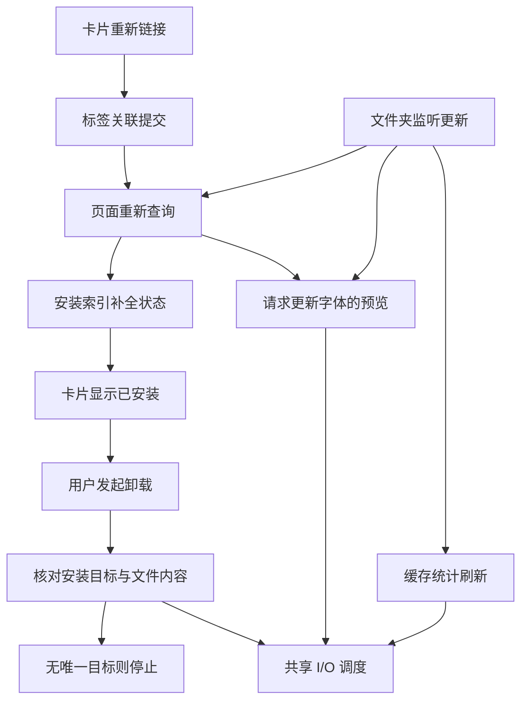

# HFM 缺失字体恢复、匹配与关联状态全链路任务书

## 0. 执行入口与当前状态

- 编制日期：2026-10-05（Asia/Shanghai）；仓库：`uniquenesssta/99`。
- 源码与审计基线：`9a4f22519ba0923e162d83bc4fb658f2c5aadb64`；编制前工作树干净，本地与远端一致。
- 唯一实施分支：`stage/12-font-identity-permissions`。本专项承接 Stage 12，编号 **S12-F08～F14**，不创建第二条分支、不重编号已有任务。
- 编制时用户授权为“创建任务书”，文档基线提交为 `3e94afb`。2026-10-05 用户授权“开始 F08”：本轮只实现 F08，推送并启动既有 Windows CI；F09～F14 未开始。实现、自动化通过和最终本机验收分别登记。
- 历史依据：[身份与权限任务书](HFM_FONT_IDENTITY_PERMISSIONS_TASKBOOK.md) §18～§19、§21～§22；[列表与网格任务书](HFM_LIST_GRID_VIEW_OPTIMIZATION_TASKBOOK.md) §1 的并发、滚动和退出约束继续有效。旧回执保留，不把本次新问题写成旧阶段从未通过，也不以旧 CI 代替本专项验收。
- 用户补充要求：重新审计此前缺失字体显示、路径识别、自动/手动/同目录匹配及关联功能，建立可用性清单，不能只将最近反馈转抄为任务。§2.1～§2.3 是源码、既有回归和实机证据对照。
- 本文是这批问题的唯一实施与验收入口。原任务书只保留引用，根 README 记录变更结果；不再把同一问题分散成多套补修清单。

## 1. 要解决的问题与范围

目标：先让用户能清楚知道各项功能的已证实能力、失败边界和未验范围，再完成修复。字体移走后仍保留标签卡片；重新链接只恢复关联，安装状态有可靠依据；卸载准确处理安装登记和独立安装副本，原始文件不受损；监听与预览工作能结束，前台操作不被无关后台 I/O 挤占。

本专项覆盖：卡片重新链接 → 标签/页面更新 → 安装状态补全 → 卸载规划与执行 → 结果回写；以及监听事件 → 索引差异 → 页面/预览/缓存统计 → 共享 I/O 调度这两条相关链路。

不包含：界面改版、新授权系统、依赖升级、无关全库重构、新的跨平台适配、清理用户字体库、改写所有历史阶段。支持性改动必须能对应本文问题编号；发现范围外问题只登记，不夹带实施。

### 必须保持的行为

1. **禁止在本专项恢复、安装状态修复或卸载中删除、移动、覆盖原始字体文件，禁止修改原始字体的只读属性或 ACL。** 只可清理经确认的独立安装副本及其精确登记。登记指向原始文件、来源角色不明或目标与来源为同一物理文件时，文件保留；可验证的登记按权限和引用规则解除。不得把卸载失败转交“删除源文件”入口。
2. 名称、家族名、文件名只是候选线索，不能赋予删除权限。安装目录位置也不能单独证明是可删除副本；保留真实路径、文件身份、内容、保护状态、引用和写前复核。
3. 本地标签事务与共享标签“目标写入确认后再解除旧关联”的边界保留；缺失/暂不可访问区分、源和目标已有标签并集、手动保护与本地收藏不得丢失。未经确切归属不得迁移旧安装记录。
4. 标签右键负责重新索引；单文件选择仍在字体卡片右键，多选时以实际右键卡片为锚点。只弹一次选择框，同目录可唯一匹配的缺失项一并恢复，其余保留供逐项手动选择。标签重索引继续优先旧路径所属监听根，全部找到即停止扩大范围。
5. 保留实际前台预览并发上限 10、滚动期间暂停、停滚 150ms 恢复可见需求、旧代次结果拒收和真实完成后释放槽位。不得为消除错误禁用监听、预览、取消或退出能力。
6. 保留共享目录别名互斥、写入所有权、按需受限 UAC、原用户 HKCU、手动保护及退出清理。禁止全局关闭锁、无界并发、循环重试、任意终止占用进程或接管整目录权限。
7. 仅 Windows 执行验证。非 Windows 环境只编辑和静态审阅；不运行项目测试、类型检查、构建或转译后的生产模块。CI 使用受控文件系统/注册表端口；真实字体安装卸载、占用及 UAC 只留本机最终验收。
8. 不清库、不删缓存作为修复，不重建一套回归体系，不恢复用户已取消的固定卡片数、冷热重复次数或每阶段人工字体测试。

## 2. 本轮证据与不能提前下的结论

资料：`startup-2026-10-05_08-48-37-560-31120.log` 与 `粘贴的文本 (1)(20261005-085123).txt`。控制台确认已拉取至 `9a4f225`，Rust worker 构建/复制和 Vite 开发编译成功。原始日志不提交仓库；以下时间为日志 UTC，上海时间加 8 小时。

| 编号 | 已确认事实 | 待核实部分与归属 |
| --- | --- | --- |
| E01 重新链接 | 08:48:53.841 开始，08:48:56.427 选择框返回；08:49:06.039 完成，linked=23、remaining=0、failures=0。未见之后再次执行恢复 | 选择框停留包含用户操作，不能全算程序延迟；选择返回后约 9.6 秒仍需分段归因。F08/F09/F13 |
| E02 状态矛盾 | 本日志无 `fonts:installSystem` 调用；恢复源码无安装调用。安装比较允许名称候选，卸载还要求安装文件内容匹配 | 不能声称新安装了两个字体，也不能未读对应证据就断定两项都是误报。须查清 W7/W20 显示依据及卸载候选被拒原因。F10 |
| E03 卸载阻断 | W7/W20 多次在 `uninstall-plan` 停止，`completedSteps=0`，信息为未找到可以唯一关联的安装记录 | 本次未进入清只读/删除步骤，不能归因为已证实的文件锁或只读；最后一次在退出时收到 `Shared I/O stopping`，须区分取消与执行失败。F10/F11/F13 |
| E04 旧安装索引 | 两次报告迁移 0、未唯一匹配 94，其中无身份候选 87、签名不一致 7，原行保留 | 尚不能将这 94 行直接等同于 W7/W20，也不能直接删除或复制到新路径。F10 |
| E05 刷新放大 | 08:50:27.175，`O:\字体` 一次监听事件产生 394 条 upsert。接收端会刷新派生查询、为更新字体请求预览并刷新统计 | 日志缺少具体事件路径及差异原因，不能断言 394 项全部不必要或存在无限循环。随后其他字体的预览超时证明工作已超出当前“梦源”标签。F12 |
| E06 I/O 压力 | 约 155 秒、7,702 行日志；3,152 个任务开始/结束占 6,304 行。readFile=1,039、stat=918；已启动任务中 289 个排队超过 1 秒，最大约 2.83 秒；另有 6 个预览队列超时 | 这是混合会话观察值，不是标准性能基准，不能都归给重新链接。降低日志量不等于降低实际 I/O。F13 |
| E07 退出 | 退出日志 persistenceComplete、localCleanupComplete、processExitClean 均为 true，未强退 | 退出时取消的预览不能混算为运行期间队列超时；保留成功退出能力。F11～F14 |

### 2.1 逐项功能可用性清单

状态含义：“实机部分确认”只证明日志中的具体场景；“已有实现/受控覆盖”说明代码和现有测试包含该路径，不代表真实边界全部通过；“确认缺口”为可从源码直接判定的限制/错误；“待验风险”必须补证据，不能当作已发生的数据损坏。

已核对 `9a4f225` 的 [Windows CI 37283308553](https://github.com/uniquenesssta/99/actions/runs/37283308553)，job `111676215941` 全部步骤成功，包含完整诊断、准确卸载规划、标签读写、DOM 与 bundle。这与最新实机仍出现问题并不矛盾：已有受控场景没有覆盖下表全部边界。本次只读取回执，没有重新运行测试。

| 功能 | 当前实际行为与证据 | 当前判断 | 对应阶段 |
| --- | --- | --- | --- |
| 本地标签保留缺失字体 | `tagFontQueryRuntime` 从路径关联、历史快照/索引补卡片；没有元数据时用文件名兜底。既有缺失/分页/搜索用例，用户先前确认通过 | 已有实现/受控覆盖；无历史快照与大标签边界继续验 | F08 |
| 共享标签保留缺失字体 | 从共享元数据与本地共享快照恢复；不可达根可显示离线快照，但根可达而元数据读取失败会抛错 | 有实现；共享错误时页面能否保持旧卡片不能仅由单测推断 | F08 |
| “文件丢失”徽标与缺失预览 | `installLabel` 优先缺失/不可访问；列表/网格均有提示，多个预览入口已阻止缺失请求 | 已有实现/受控覆盖；恢复后的状态清除、详情/筛选/重开需整链验 | F08/F12 |
| 区分文件丢失与根离线 | `ENOENT` 后检查所属根/盘；其他错误视作 unavailable，避免离线冒充删除 | 有受控覆盖；断开映射盘/UNC别名、权限拒绝保留待验 | F08 |
| 按旧路径选择监听根 | `owner` 按路径包含和最长根优先；根扫描完成后匹配，找齐即停止，缺项才扩展 | 已有实现/受控覆盖；此处仅字符串路径包含，不能宣称已覆盖物理别名 | F08 |
| 自动重新索引及等候 | 恢复调用 `refreshWatchedFolder(root, root, true)`，已有完成等待/抛错用例 | 完成等待已实现；非抛错的扫描部分错误未完整返回恢复结果，见 A03 | F08 |
| 自动匹配同一字体 | 要求文件名忽略大小写相同，大小、PostScript名、style、format相同，并在当前候选集合双向唯一 | 确认限制：改名、历史元数据缺失时不能自动匹配；不是任意位置的内容识别 | F09 |
| 跨根与重复候选 | 每个根独立形成候选并立即匹配；多候选/多来源争同目标时跳过 | 当前候选集合内有歧义保护；跨根同内容副本、重叠根/别名及优先策略待验 | F08/F09 |
| 卡片右键单文件选择 | 菜单已放在缺失字体卡上；传被右键卡片路径，原生选择框一次选一个文件 | 有受控入口覆盖；旧提示仍指向标签菜单，确认文案缺陷 A07 | F08 |
| 同目录批量匹配 | 用原目录缺失项与所选文件新目录匹配，只处理同名候选；本地一次事务 | 实机部分确认：本次 23 项成功；不等于改名、集合字体、所有共享路径均通过 | F09 |
| 手动指定不同名称/内容的文件 | 锚点只验证文件可解析，没有执行 `sameRecoveryFont`；其他项仍用自动匹配规则 | 当前允许手动替代；必须明示锚点与自动匹配不同，不能传播替代文件的安装/保护身份 | F09/F10 |
| 单文件同时有本地/共享标签 | 入口根据页面和现有标签选一个 scope；恢复只写所选 scope | 确认行为边界：另一范围不会随本次操作恢复，不得称整张字体所有关联完成 | F09 |
| 目标已有标签与失败保留 | 本地合并后事务写入；共享先逐标签加到目标，再逐标签删来源 | 常规与目标写失败已有覆盖；并发改标签、共享中途断开/部分删后重试待验 | F09 |
| 收藏、保护、激活随恢复的关系 | 恢复服务未调用收藏/保护/激活迁移；标签快照保存除标签数组外的其他字段 | 不能宣称这些状态已自动正确跟随；须明确同文件迁移与手动替代的不同归属 | F09/F10 |
| 监听目录外的手动链接 | 本地保存文件真实路径/大小/时间授权，重开可读取；共享要求目标在监听根 | 已有授权/重开受控覆盖；文件变化后的重新授权入口存在确认缺口 A06 | F08/F09 |
| 重复点击、取消、恢复互斥 | 前端稳定对象 WeakSet，主进程运行标记 finally 释放；busy 不抛异常，取消不刷新 | 有跨菜单重建/取消受控覆盖；关闭窗口/切页期间返回继续整链验 | F08/F12 |
| 重新链接后安装状态与卸载 | 展示名称候选与卸载内容验证标准不同，实机 W7/W20 计划为空 | 确认有待解决问题 E02/E03；两字体真实安装来源仍待补证据 | F10/F11 |
| 持续刷新、日志与 I/O | 监听更新带出预览/统计；实际 394 项更新与 6 个队列超时 | 确认性能/工作量问题；尚未证明无限循环 | F12/F13 |

### 2.2 新增源码审计发现

这些是对之前实现的重新核查，不是用户原话的转写。定位以函数名为准，实施前用 Windows 受控反例验证影响。

| 编号 | 源码事实与影响 | 处理与验收归属 |
| --- | --- | --- |
| A01 匹配过度依赖文件名 | `sameRecoveryFont` 强制相同文件名，手动同目录候选还先按同名过滤；仅改名便不会自动找到 | F09 增加可靠身份候选层级，不能只删名字判断；旧信息不足明确转手动 |
| A02 匹配强度和新鲜度有限 | 自动匹配使用元数据组合，没有内容摘要；候选读后提交前只复查可访问性。大小/时间不变时可复用索引 | F09 区分候选线索与确认依据；补同名同大小不同内容、索引陈旧、准备后目标替换反例。尚无实机误链接证据 |
| A03 扫描部分失败未完整回传 | `runWatchedFolderRefreshJob` 有 errors 计数；调度回调只 await，不保存结果，`waitForRefresh` 是 Promise<void>；等待后仍返回 errors=0 的 backgroundResult，恢复也未检查返回结果 | F08 让完成等待携带实际结果，区分全部完成/部分失败/取消；失败根不制造“全部恢复”结论 |
| A04 恢复事务仍有一致性待验点 | `readAll` 校验 total/tagRevision；tagBindingsOnly 跳过 live 后没有实际 tagRevision，等量变更不一定发现；`linkPairs` 读取后有异步步骤再写 | F09 审计权威修订与写前冲突检查，验证并发增删标签不会被旧并集覆盖；不是要求每文件重新全量读 |
| A05 页面限定不等于数据库限定 | 本地关联 SELECT 仍取所有带路径标签行后在 JS 过滤；每个 collect 重做收集，分页恢复可能重复；普通查询还有快照写入和有效字体解析 | F13 量化真实读取/解析/写入范围，按相关目录或关联筛选并复用；不能沿用“请求带目录所以完全定向”的结论 |
| A06 根外变化文件无法按现入口重新授权 | `tagRelinkAuthorization.contains` 拒绝大小/时间变化；查询将其标 unavailable；菜单和前端仅接受 missing，服务也拒绝非missing锚点 | F08/F09 区分离线与需重新授权，提供有效的卡片重选/确认路径，不放宽任意文件访问 |
| A07 提示与操作入口不一致 | `fontCommandRuntime` 仍提示“标签右键菜单中重新链接”，实际菜单已经移到字体卡 | F08 同时修文案、菜单可达性和用户动作回执，不能只改按钮位置 |
| A08 关联范围与身份字段混杂 | 恢复只操作一个标签 scope；快照保留安装/激活等非标签字段，不能将快照当这些状态的权威 | F09/F10 明确各关联的所有者、迁移/保留/重算策略；不让手动替代继承不属于它的系统权限或状态 |
| A09 长路径/别名的匹配范围待验 | 恢复 `owner`、目录相等和候选去重主要用字符串路径；底层授权另有实际路径能力 | F08/F09 用现有权威规范化比对，覆盖映射盘/UNC和重叠根；不重造全局路径系统 |
| A10 源文件不存在时卸载被前置读取挡住 | `uninstallOne` 和 planner 都先读取原路径身份；即使真实安装副本仍在，缺失来源可能在规划前失败 | F10/F11 在有可靠安装所有权证据时定位独立副本；信息不足明确说明，不能按名字猜删 |

### 2.3 必须补齐的覆盖范围

- 路径：同目录、移动到兄弟/其他监听目录、监听根自身改名、移到根外、大小写、映射盘/UNC别名、重叠根、根离线与权限拒绝。
- 文件身份：仅移动、仅改名、同名不同内容、同内容多个副本、不同字重、TTC/OTC集合、缺少历史元数据、目标在准备和提交间变化。
- 关联：多个本地标签、多个共享标签、两者同时存在、目标已有标签、本地收藏、手动保护、已有安装/临时激活；每种状态须明确保持/重新计算/可证明迁移，不能一律复制旧卡片。
- 操作：单卡/多选中的右键锚点、同目录部分匹配、未匹配逐个手选、取消/重复点击、写失败/部分提交/重试、并发改标签、关闭窗口/重启。
- 页面：本地/共享标签、侧栏计数、筛选/搜索/分页、列表/网格、详情往返、更新后可见预览。只测服务返回 linked 数量不算完成。
- 上一轮全局确认框/标签输入已通过的回执保留；本专项仅回归上述入口涉及的焦点、菜单和输入，不重开无关 UI 功能改版。

## 3. 已核实链路与责任位置

以下是当前实现关系，不表示计划中的修复已经实现。架构图已通过 Mermaid Chart 展示，仓库保留同义源码。

路径相对仓库根。下表为责任入口，不代表全部文件都必须修改。

| 责任 | 主要文件/目录 |
| --- | --- |
| 重新链接、标签快照与恢复读取 | `src/main/library/tagFontRecoveryRuntime.ts`、`tagFontQueryRuntime.ts`、`tagFontSnapshotRuntime.ts`；`src/renderer/src/fontDialogContextActionsRuntime.ts` |
| 安装状态查询、匹配与旧身份迁移 | `src/main/library/fontQueryFacadeRuntime.ts`；`src/main/install/fontInstallCompare.ts`、`status/`、`refresh/`；`native-src/hfm-core-worker/src/install_status/` |
| 卸载计划、执行和占用信息 | `src/main/install/fontUninstallPlanRuntime.ts`、`systemFontInstallRuntime.ts`、`fontMutationProcessRuntime.ts`、`fontFileUsageRuntime.ts`；`native-src/hfm-core-worker/src/font_mutation/` |
| 监听差异与界面消费 | `src/main/watcher/folderWatcherRuntime.ts` 及实际差异生成者；`src/renderer/src/runtime/app/effects/useFontIndexChangedEventRuntime.ts` |
| 预览和缓存请求生命周期 | `src/renderer/src/runtime/preview/`；`src/main/preview/` 与实际缓存统计入口 |
| 共享 I/O 与文件读取 | `src/main/path/sharedIoProcessRuntime.ts`、`sharedFileSystemRuntime.ts`；`src/main/rust-core/rustSharedIoCommandRuntime.ts` |

## 4. 实施顺序与阶段验收

顺序：**F08 → F09 → F10 → F11 → F12 → F13 → F14**。先稳定缺失记录与路径范围，再完善匹配/关联，随后统一安装身份和卸载目标，再收敛刷新和 I/O，最后整链验收。一个问题只在一个阶段拥有完成状态，后续阶段引用前置结果。

### S12-F08：缺失记录、恢复入口与路径范围

对应 §2.1 缺失展示/菜单/根识别及 A03/A06/A07/A09。先稳定用户能看到什么、从哪里恢复、扫描了哪里、结果是否完整。

- 复核标签绑定为权威、快照只补展示的原则；文件移走、根改名、离线、访问失败和缺少历史元数据时均保留有依据的关联，不能被页面查询/筛选/计数静默漏掉；主动删除标签后不能靠快照复活。
- 同步检查本地与共享标签、侧栏数量、搜索分页、列表/网格/详情，不把只有服务层 26 行通过当 UI 全部通过。
- 用已有路径权威识别最长所属根、重叠根与别名。明确自动重索引的实际根、搜索顺序和扩大范围原因；找齐停止，无依据时不默认扫所有磁盘。
- 修复等待扫描只得到后台启动回执的问题，返回真实完成/部分失败/取消信息；部分结果可继续匹配，未完成项保留并报告。
- 修复卡片入口提示和根外文件需要重新授权却无入口的缺口；网络离线不冒称需重新授权。保留一次选择框与多选中的右键锚点，不恢复标签上的单文件选择。

通过条件：§2.3 路径/入口受控场景均能解释卡片状态、目标根及恢复结果；缺失仍显示、离线不丢关联；索引成功/部分失败/取消不混用；卡片可完成必要重选，提示位置正确；已有菜单/输入焦点不退化。

### S12-F09：自动匹配、同目录匹配与关联完整性

对应 A01/A02/A04/A06/A08/A09，依赖 F08。用户要求的是自动找到缺失文件并保留可单独手选的路径，不能将当前严格同名规则当作需求已经全部满足。

- 明确自动匹配的候选与确认两层：先利用所属根、相对目录、文件名和字体元数据缩小范围，再用已有可靠文件身份/内容依据确认。改名但确为同一字体时应能恢复；历史无强证据时明确“信息不足，需手选”，不猜配或全库读取内容。
- 区分同文件别名、相同内容的独立副本、同家族不同字重、集合文件多个字面；依据既有身份契约处理。对当前候选范围内多义项不选择遍历顺序第一项；跨根优先范围在结果中说明，不宣称搜索了未扫描的根。
- 手动锚点与自动同目录匹配分别验：一次文件选择只代表用户指定锚点的替代文件，其他项仍须独立通过自动规则；所选目录里的无关文件不被关联。未匹配项保留原卡片并说明无候选/歧义/信息不足/读取失败。
- 定义关联处理表：本地标签、共享标签、收藏、保护、安装、激活、预览分别由哪个现有模块负责，何时保留/重新计算/可证明迁移。同一字体仅移动时避免关联丢失；用户手选另一字体时不得冒认旧安装或保护身份。标签恢复不触发安装/激活。
- 同时有本地和共享标签时，不让一范围完成被呈现成全部关联完成；明确本次处理范围与其他范围的待处理状态，并保证用户能从对应入口继续。不能为方便而绕过共享授权或离线只读边界。
- 本地合并/清旧在同事务验证当前权威关联；共享部分写入保留可重试结果，目标标签全部确认前不删除来源。并发编辑、取消/退出、已准备目标被替换时不能用陈旧信息覆盖新状态。
- 结果按实际迁移项计数；成功、保留、失败与原因可追溯。根外授权随文件实际身份验证和关联存在性生效，重启可用，文件变化能安全重新确认。

通过条件：§2.3 文件身份/关联/操作矩阵覆盖；同目录移走保持一次选择、一次本地批量提交；改名可在有可靠依据时自动恢复；无依据有明确手动路径；多关联和目标既存状态不丢失；部分失败可重试且不重复破坏；前后源/目标字体内容均不因链接操作改变。

### S12-F10：安装状态、重链接身份与卸载候选统一

对应 E01～E04，依赖 F08/F09 的恢复身份契约。首先复核真实调用链，不把“显示已安装”直接改成“未安装”来掩盖问题。

- 梳理卡片、详情、已安装筛选和计数的同一状态来源；审计旧快照携带的安装字段、新路径 ID、安装索引签名、查询缓存和临时操作状态之间的覆盖顺序。
- 分清“有相似名称候选”“确认有关联安装”“安装目标当前不可访问/状态未知”。展示可以说明候选，不能把名称命中当作精确文件已安装的证据。避免对每张卡片每次查询重新读完整字体做哈希。
- 卸载候选从主进程当前权威记录构建；渲染器提示只作线索。记录候选数、匹配依据、拒绝原因以及来源/安装目标关系，使空计划能说明是无候选、内容不符、歧义、旧数据还是访问失败。
- 查明 W7/W20 对应的状态来源；旧 94 行仅对可证明归属的项修复，未知项保留并明确状态，不清空安装表、不按家族名批量迁移。
- 重链接完成时只刷新受影响状态；禁止调用安装/激活或复制字体到系统目录。旧路径安装状态不直接赋给用户选中的任意替代文件。

通过条件：受控场景中，未安装文件重链接前后安装记录与安装目录文件数不变；相同名称不同内容不误授卸载目标；已验证副本可精确定位；未知/歧义有明确原因；页结果、卡片、筛选、计数一致。原文件丢失时仍能显示卡片，可靠既存安装证据可用于后续卸载，不要求为了读原文件而制造或删除源文件。

交付必须列出 W7/W20 根因证据是否闭合。若缺少本机登记快照，先用现有信息及受控反例解决已确认缺陷，将尚未证实部分列为最终本机核对项，不声称已定位全部真实原因。

### S12-F11：安装副本限定卸载与失败后可恢复

对应 E03/E07，依赖 F10 的目标依据。审计并复用现有只读处理、原生资源释放和精确注册表操作，不另造 PowerShell 通用强删通道。

- 按主进程确认的目标执行：核对来源/安装副本角色、保护和引用 → 预检权限/句柄及允许处理的副本只读属性 → 解除目标字体资源与精确登记 → 删除独立安装副本 → 通知并复核实际结果。具体顺序以现有原生安全边界和失败恢复能力确定，不能机械先删登记而丢掉重试依据。
- 对注册表值同时确认作用域、名称和原值，执行前再核对。登记直接指向原始文件时只解除允许解除的登记，原文件及属性保留；路径别名/硬链接或角色不确定不能按路径字符串不同就允许删除。
- 独立安装副本为只读时限定该文件处理；权限不足沿用受限提权，不改变整个应用权限。集合字体、多条引用、其他受保护成员和临时激活引用按既有所有权规则处理。
- 若已经解除登记但文件尚未删除，保留经过验证的未完成目标和完成步骤；重试再次核验目标身份，不因登记已不存在而永远无法重试，也不得把后续同路径新文件当残留删掉。
- 文件占用时复用现有查询能力，报告能确认的进程名/PID及查询失败原因；查不到不能虚构占用者。仅释放应用自身资源，不自动杀进程。退出取消和操作失败分开显示，部分成功不能写成全部成功。
- 成功后刷新真实安装状态；失败保留有效标签与来源文件，不靠强制显示“未安装”结束流程。

通过条件：普通副本、只读副本、源路径登记、多个引用、保护变化、权限失败、占用、部分完成后重试、目标被替换、退出取消均有对应结果；每种路径均证明原始文件内容、路径和属性未变。卸载不触达源文件删除入口，无目标时零副作用。

### S12-F12：监听差异与预览刷新收敛

对应 E05/E07。先补清一次事件扩展为 394 项的具体原因，再确定应保留的目录级扫描范围。

- 在现有日志记录事件类型/路径、所属根、是否目录级、扩展原因，以及实际新增/变化/未变数量；避免逐字体重复刷屏。
- 对文件级事件做定向差异，目录级事件允许必要枚举；只有真实变化进入更新通知。重复事件、仅缓存/元数据写入不得循环触发字体扫描和预览重建；源字体真的变化必须及时更新。
- 页面刷新、缓存统计和预览需求按职责合并。安装标记或标签变化不能自动等同于字体图像内容变化；预览只因有效预览键改变而失效。
- 当前可见字体优先；后台索引更新不把全部 upsert 无条件变成前台预览需求。保留既有明确后台预览任务，但必须去重、可取消和让路，不伪装成用户可见需求。
- 同一键/代次的工作共用，晚返回的旧结果不能重新提交或覆盖；取消、缺失、离线与普通失败分别终止/冷却，事件结束后不自我重复触发。

通过条件：受控重放重复文件事件、目录移动、缓存写入、标签更新时，未变化字体没有新增渲染任务；事件队列和当前需求处理完毕后，无新的自触发查询/渲染。真实变化仍更新；切换标签、列表/网格、详情和快速滚动不回弹、不残留旧预览；后台不生成与当前可见范围无关的前台任务。

### S12-F13：I/O 工作量、前台等待与日志治理

对应 E01/E06/E07，基于 F12 消除重复工作的结果实施，不以增加超时或隐藏错误作为修复。

- 沿一次恢复、一次卸载、一次监听批次记录关联操作 ID、队列等待、实际执行、子进程启动、读取次数/字节数及结果；补足当前只有请求号、无法定位具体子步骤的问题。
- 同目录元数据检查、候选索引、安装快照和标签权威读取按有效范围合并；减少同一操作中的重复读取、哈希和零碎进程启动，避免每个字体重新读取整个目录或整库。写前必要安全复核不能被性能缓存替代。
- 文件选择框打开前只做必要的目标/授权检查，不等待无关根扫描或安装/预览补全；分别计量前置准备、选择框停留、候选处理、提交及页面更新，不把用户停留算作慢调用。
- 前台恢复/卸载/可见预览应有有界调度机会；统计和维护让路。只在证明根与文件实际关系后优化冲突范围；保持映射盘/UNC、重叠根、写锁、取消及进程回收约束。不预先承诺常驻进程重构。
- 普通日志按操作/批次汇总量与延迟；保留错误、慢任务、未完成目标和异常原因。逐请求起止明细保留于详细模式，关闭日志后仍应观察到真实工作量减少。

通过条件与比较办法：复用现有 Windows 受控场景，在相同夹具、可见范围和操作序列下比较基线与修改后结果，列出任务数、进程启动数、读取字节、等待 p95/最大值、渲染数、超时数。受影响的重复读取/启动必须减少、前台等待不退化，固定负载下无前台被后台饿死导致的排队超时。不得拿整份混合日志总数直接宣称百分比提速。

实现开始前将受测负载与具体计数预算登记在该阶段记录中：未变化项不重新渲染；同操作同键只保留一份在途读；批量读取随涉及目录/文件增长，不随文件数乘以整库查询增长。时间阈值基于同环境基线设定，不臆造用户硬盘必须达到的毫秒值，不新增人工固定重复次数要求。

### S12-F14：既有回归中的整链验收与收尾

只负责集成证据和收尾，不成为延后所有验证的理由。F08～F13 各自补充对应反例，F14 串起整条流程。

- 复用现有诊断、DOM、Rust 与 Windows CI：缺失文件仍可见 → 卡片选择新文件 → 同目录匹配 → 安装状态/筛选一致 → 预览稳定 → 卸载独立副本 → 来源和标签保留 → 重开后结果一致。
- 同链覆盖取消选择、重复点击、共享暂不可访问、同名不同内容、旧记录、多个副本、部分失败重试和退出，不新增平行验收框架。
- 先收集同次 CI 的完整失败清单，按实际受影响契约修正；不能删除断言、跳过失败场景或把成功日志文案当功能证据。受控测试不等于真实系统操作通过。
- 真实 Windows 字体操作仅在用户本机最终核实，优先利用已有真实日志/回执；只补本轮变更影响的未验项，不重新要求制造已证实的旧故障。准备一个连贯验收清单与结果采集后再交付，不能每阶段让用户试错。
- 记录受测提交、CI 链接、整链结果、性能前后对照及仍未验边界；实现完成、自动化通过、本机验收分别记状态。真实占用/权限无法保证解除时，应是明确可处理的失败，不能承诺任何字体永远可强制卸载。

## 5. 复用的验证入口与场景映射

| 场景 | 现有入口/责任 | 本轮必需补充 |
| --- | --- | --- |
| 缺失展示、根与扫描回执 | `check-tag-font-recovery.cjs`、`check-watcher-index-consistency.cjs` 及现有 DOM 门 | 离线/缺失、根改名/别名、部分扫描失败、菜单提示、根外重新授权 |
| 卡片重链接与标签事务 | `build/diagnostics/check-tag-font-recovery.cjs`、`check-font-command-entry.cjs` | 安装副作用为零、旧/新路径状态、一次选择、同目录与歧义、取消/忙碌无刷新 |
| 匹配与多种关联 | 同一恢复门、标签持久化门及身份兼容门 | 改名、元数据不足、同名不同内容、双 scope、并发编辑、部分失败重试、收藏/保护归属 |
| 安装状态与目标身份 | `check-install-status-filter.cjs`、`check-font-identity-compatibility.cjs` 及现有 F06 受控门 | 候选与确认依据区别、旧记录、安装副本定位、缺失来源、名称相同内容不同 |
| 卸载与原始文件保留 | 现有 F06 受控端口/原生门；`run-font-system-local.cjs` 仅本机 | 只读副本、源登记、别名同文件、失败重试、替换目标与每步零源删除 |
| 监听与预览收敛 | `check-watcher-index-consistency.cjs`、`check-watcher-activation-baseline.cjs`、`check-preview-failure-cooldown.cjs` | 重复/目录事件、缓存反馈、可见范围、过期结果与静止后任务归零 |
| I/O 与关闭 | `check-shared-io-process.cjs`、`check-shared-io-integration.cjs`、`check-offline-settlement-watcher.cjs` | 工作量计数、前后台调度、别名互斥、取消回收及退出中未完成结果 |

表内省略目录的脚本均位于 `build/diagnostics/`。实际脚本与运行门在各阶段开工时复核；若当前门不能表达某场景，先扩展既有测试职责，不创建重复的全新专项体系。真实注册表写入、字体安装/卸载、原生占用实验不得放进 CI 或默认开发启动。

## 6. 数据、失败与回退

- 不重置库。修改数据结构前先明确版本、旧行兼容、事务和可恢复快照；没有必要就不做结构迁移。
- 标签事务失败保持旧关联；共享跨根部分成功继续遵守先确认目标再解除旧关联，清楚显示未完成项。
- 安装状态缓存失效只针对受影响项；不能把离线、访问失败或未匹配直接写成“未安装”。旧身份迁移必须有唯一依据。
- 代码回退以阶段提交为边界，并同步回退相关读写契约；已执行的系统卸载不由代码回退自动恢复，更不能通过复制/删除原文件补偿。
- 性能优化回退恢复既有准入/队列语义，不删除用户数据或放宽保护；失败证据仍保留。

## 7. 状态表与执行记录要求

| 任务 | 状态 | 自动化 | 本机与证据 |
| --- | --- | --- | --- |
| 文档与审计基线 | 已编制，仅文档交付 | 链接、范围和差异静态复核 | §2 为已有实机证据，不是修复通过 |
| F08 缺失、入口与路径 | 实现完成，等待 Windows 自动化 | 静态语法/导入/差异及契约复核通过；受控回归已补，动态待 CI | 无新增实机通过回执；本轮无需重复测试真实字体 |
| F09 匹配与关联完整性 | 未开始，依赖 F08 | 未运行 | 23 项同目录成功仅证明部分场景 |
| F10 状态与目标依据 | 未开始，依赖 F09 | 未运行 | W7/W20 精确原因待补证据 |
| F11 副本限定卸载 | 未开始，依赖 F10 | 未运行 | 真实占用/权限仅最终本机核实 |
| F12 监听与预览收敛 | 未开始，按 F11 后推进 | 未运行 | 394 项扩展原因待核实 |
| F13 I/O 与日志 | 未开始，依赖 F12 | 未运行 | 尚无标准化前后对照 |
| F14 整链验收 | 未开始，依赖 F08～F13 | 未运行 | 不沿用旧 CI 宣布通过 |

每阶段在本文追加一份简明执行记录：实际根因及证据、修改责任、受测提交/Windows 回执、源文件不变证据、性能对照（涉及性能时）、未验证边界和下一步。不新建修复日志；根 README 保留唯一变更记录。

编制提交为纯文档并使用 `[skip ci]`。F08 实施已获推送和 CI 授权；非 Windows 编辑环境仅做源码读写、语法/AST、哈希和差异静态复核，不运行项目测试/类型检查/构建。推送后查询一次 Windows CI 启动入口，不长时间轮询；CI 通过与最终实机完成分别登记。真实字体操作仍集中到最终本机验收。

工具续接：本轮无新增 API 或依赖功能，不触发 Context7 查询；Mermaid Chart 展示的是现有链路。Create State 查询仍仅有 Markdown/足球项目，无 HFM 项目，未写入无关项目；续接状态保存在本任务书、Git 与根 README。

## 8. F08 执行记录（2026-10-05）

实施起点：文档提交 `3e94afb1e7bf24caae435ae53c1c851159f6ddaa`，应用源码基线 `9a4f225`，沿用原分支。F08 实现完成，Windows 动态回执待本次推送；不使用基线 CI 的成功替代本轮结果。

根因与改动：

- `waitForRefresh` 原先只等待 `Promise<void>`，调用方随后返回背景启动回执；扫描错误数和取消状态因此未进入恢复结果。现在共用真实完成回执，包含错误、文件数量及取消；部分扫描保留已确认候选并报告未完成，取消停止后续恢复且不发布完整重建快照。非等待调用仍保持原有后台启动语义。
- 标签查询原先在共享根可访问但元数据读取失败时直接抛错。抽出 `tagFontBindingRuntime.ts` 统一读取权威关联及共享历史；失败根仅显示只读历史，不交给实时索引查询或重链接写入。侧栏共享数量采用同一关联来源，缺失仍计数；没有历史的失败根不能凭空补卡片或声明数量为零。
- 快照和旧索引页都不能授予标签成员资格。展示前核对当前路径绑定，删除关联后即使实时页仍带旧标签也不能复活；旧版 ID-only 绑定保留现有在线查询兼容。缺少展示快照时使用绑定路径生成卡片，搜索和分页继续包含它。
- `tagRecoveryPathRuntime.ts` 复用现有异步映射盘表和绝对路径边界。按最长已确认根确定归属、去重映射盘/UNC 等价根，兼容扩展路径及旧共享快照根键；记录优先根、后备根和每次实际扫描结果，找齐后停止。映射未知或缺失文件无法确认的物理别名不猜测，未扫描的后备根不写成已经扫描。
- 根外手选文件变化后，旧凭据失效且只有“missing”允许菜单，导致无法重选。授权读取现在区分有效、已变化、无法确认；仅当前主进程确认的已变化状态或真实缺失卡片开放重新链接。离线/无权限以及共享历史只读状态不开放该入口。原路径指向新的真实目标也需重新确认，不能自动授予读取权限；确认成功时事务替换该路径的旧目标凭据。
- 列表、网格、详情统一显示文件丢失/暂不可访问/文件已变化/共享标签暂不可读取；缺失或需确认的卡片提示右键链接，保留单次原生选择框及多选右键锚点。允许同路径显式重新确认时只合并标签，不能随后清空同一条路径。

责任与验证：

| 责任 | 本轮变更 | 回归入口 |
| --- | --- | --- |
| 标签权威、缺失展示与数量 | 绑定/查询、数据查询组合、快照展示兼容 | `check-tag-font-recovery.cjs`：本地/共享缺失、无展示历史、搜索分页、旧页删除不复活、只读历史与健康根隔离、共享缺失计数 |
| 根和扫描回执 | 路径范围、恢复服务、手动刷新及 IPC 返回类型 | 同一恢复门：最长映射根优先、别名去重、未知映射拒绝猜测、完整/部分/取消/失败、并发等待同一实际回执、取消不发布完整快照 |
| 必要重新确认与 UI | 根外授权、卡片/详情/菜单和提示 | 恢复门验证凭据变化/真实目标变化/离线/关联删除与同路径续授权；`check-font-command-entry.cjs` 两种 preload/右键锚点/只读阻挡/详情；`check-preview-layout-contract.cjs` 列表与网格徽标、提示及无旧图/无限加载 |
| 冻结契约 | 两份既有 fixture 的三处源码哈希 | 先核对父提交旧哈希、确认导出/函数和 Hook/组合输入未改，再显式迁移；既有反例断言与负向变异门保留 |

已完成静态语法、相对导入解析、差异及冻结边界复核。项目类型检查、受控测试、Electron DOM 与构建由既有 Windows workflow 执行，当前不得写成已通过。真实文件副作用证据：本轮没有安装/激活/卸载/源文件删除代码变更；恢复只读取文件状态/元数据并写已有关联/授权/索引，受控门提供的文件接口不包含删除或属性修改。尚未取得本轮真实 Windows 字体文件内容/属性回执，最终验收继续保留。

F08 不提出 I/O 提速百分比；保留目录检查和并发分页合并的原有回归，批量/队列性能计量依 F13。匹配算法、多范围关联与并发事务（F09）、安装/卸载（F10/F11）、持续刷新（F12）没有在本轮宣称解决。下一步先取得本次 Windows CI 回执，修正受影响契约；F09 继续按任务书授权后推进。

工具记录：Mermaid Chart 已展示实际 F08 查询/恢复/扫描结果链路；无新增第三方依赖或系统 API，未触发 Context7。Create State 仍仅有无关 Markdown/足球项目，未向其写入 HFM；本轮续接状态保存在 Git、根 README 和本文。
