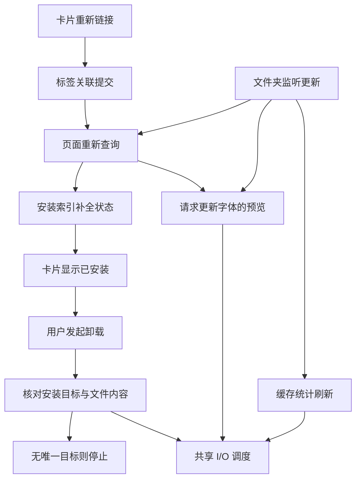
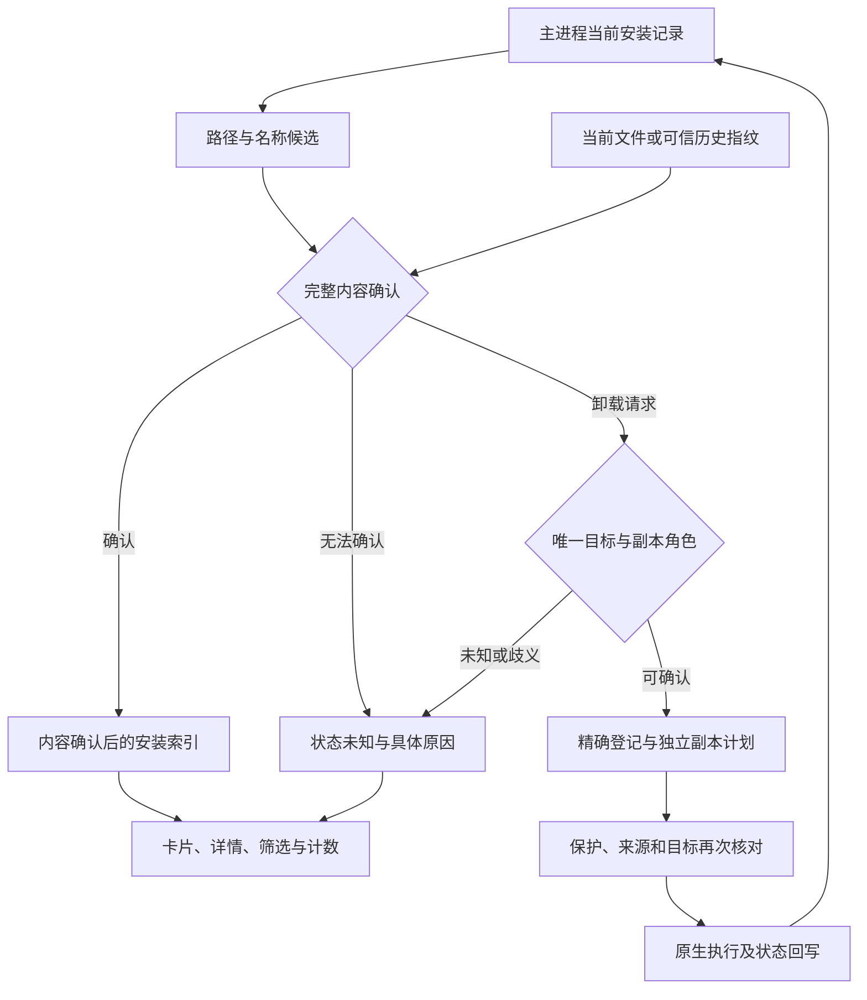
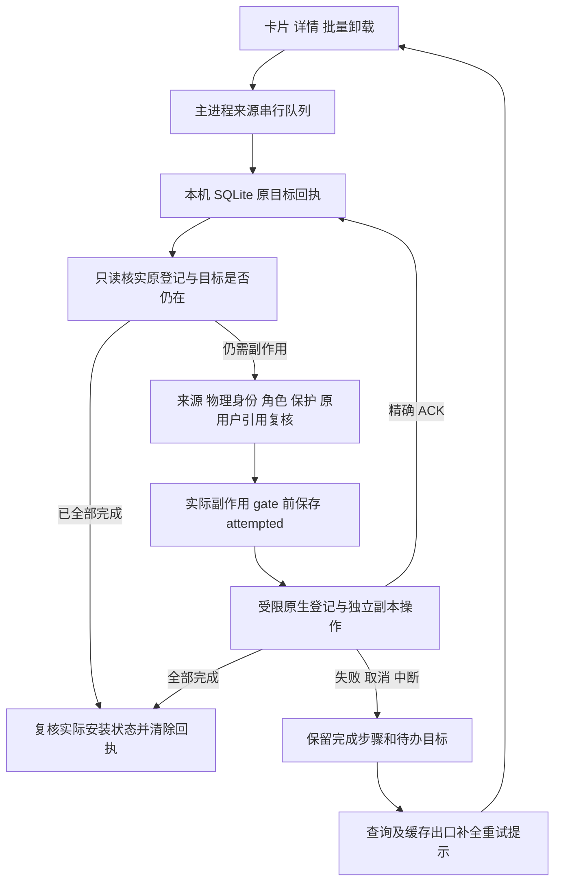
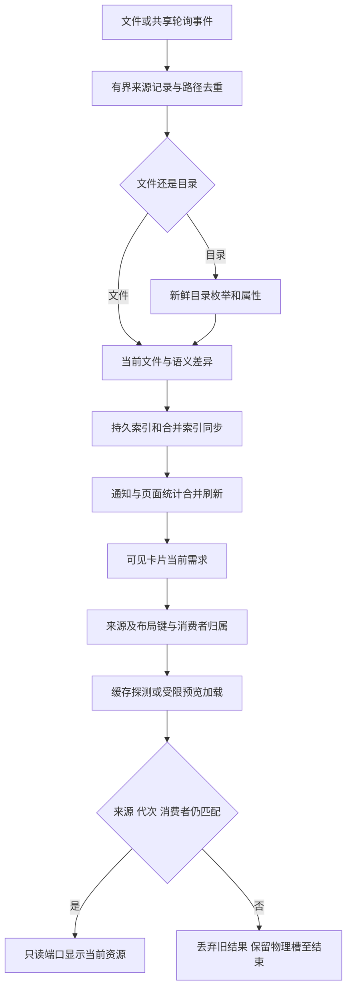
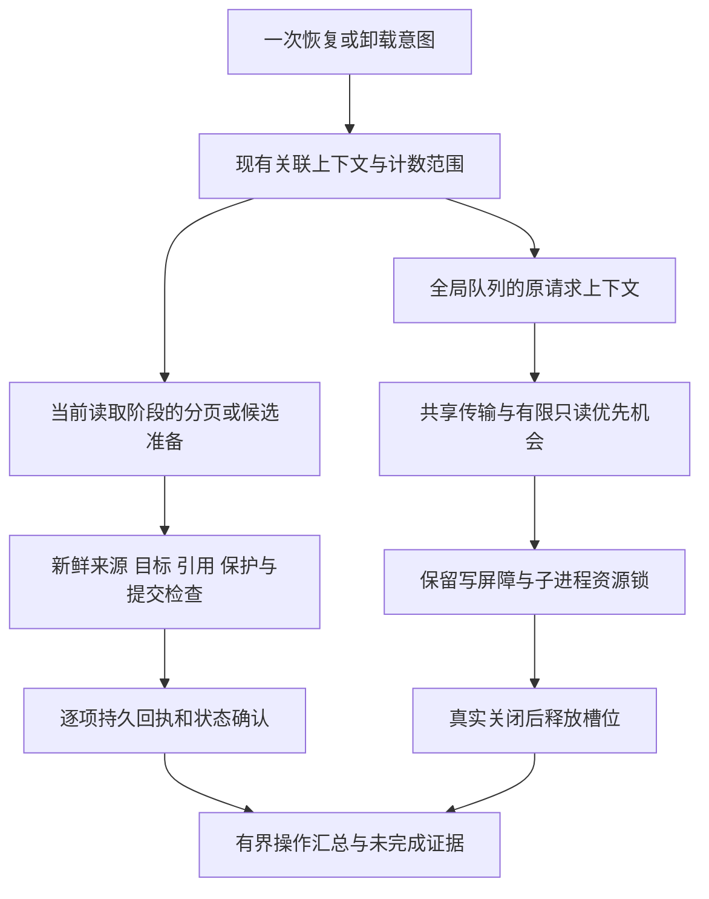
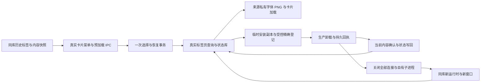

# HFM 缺失字体恢复、匹配与关联状态全链路任务书

## 0. 执行入口与当前状态

- 编制日期：2026-10-05（Asia/Shanghai）；仓库：`uniquenesssta/99`。
- 源码与审计基线：`9a4f22519ba0923e162d83bc4fb658f2c5aadb64`；编制前工作树干净，本地与远端一致。
- 唯一实施分支：`stage/12-font-identity-permissions`。本专项承接 Stage 12，编号 **S12-F08～F14**，不创建第二条分支、不重编号已有任务。
- 编制时用户授权为“创建任务书”，文档基线提交为 `3e94afb`。2026-10-05 用户授权“开始 F08”；2026-10-06 用户确认“已通过，收尾并开始 F09”，首轮失败补修后再次确认“已通过”。F08/F09 均已核对完整 Windows 自动化并按用户确认收尾。2026-10-06 用户授权“开始 F10”，随后授权连续完成 F10～F14 开发和自动化验证；F10 安装确认与卸载目标统一及首轮补修已通过完整 Windows 自动化，见 §10.7；F11～F13 也已完成开发与完整 Windows 自动化，分别见 §11.5、§12.6、§13.4；F14 已实现同状态整链和半失败回查补修，等待本次完整 Windows CI，见 §14。实现、自动化通过和最终本机验收分别登记。
- 历史依据：[身份与权限任务书](HFM_FONT_IDENTITY_PERMISSIONS_TASKBOOK.md) §18～§19、§21～§22；[列表与网格任务书](HFM_LIST_GRID_VIEW_OPTIMIZATION_TASKBOOK.md) §1 的并发、滚动和退出约束继续有效。旧回执保留，不把本次新问题写成旧阶段从未通过，也不以旧 CI 代替本专项验收。
- 用户补充要求：重新审计此前缺失字体显示、路径识别、自动/手动/同目录匹配及关联功能，建立可用性清单，不能只将最近反馈转抄为任务。§2.1～§2.3 是源码、既有回归和实机证据对照。
- 本文是这批问题的唯一实施与验收入口。原任务书只保留引用，根 README 记录变更结果；不再把同一问题分散成多套补修清单。
- 当前回执：F08 补修提交 `36df4d4` 的 Windows CI `37298565129` 全部成功，按用户确认收尾，见 §8.2。F09 补修 `f4facb0` 的 CI `37408378955` 全部成功：166/166 项诊断、恢复全部 16 组、原生本地标签 8/8、类型契约及其余专项/DOM/构建通过，按用户确认收尾，见 §9.7；首轮两处失败和补修证据保留在 §9.6。F10 补修 `0911cf8` 的 Windows CI `37414300868` 全部成功，自动化收尾见 §10.7；F11 `c0daaa4` / CI `37418747610`、F12 `e4eec49` / CI `37428694400`、F13 `a66c73d` / CI `37438281091` 均完整成功。F14 接续同状态整链验收，真实字体与共享权限仍留最终本机。

## 1. 要解决的问题与范围

目标：先让用户能清楚知道各项功能的已证实能力、失败边界和未验范围，再完成修复。字体移走后仍保留标签卡片；重新链接只恢复关联，安装状态有可靠依据；卸载准确处理安装登记和独立安装副本，原始文件不受损；监听与预览工作能结束，前台操作不被无关后台 I/O 挤占。

本专项覆盖：卡片重新链接 → 标签/页面更新 → 安装状态补全 → 卸载规划与执行 → 结果回写；以及监听事件 → 索引差异 → 页面/预览/缓存统计 → 共享 I/O 调度这两条相关链路。

不包含：界面改版、新授权系统、依赖升级、无关全库重构、新的跨平台适配、清理用户字体库、改写所有历史阶段。支持性改动必须能对应本文问题编号；发现范围外问题只登记，不夹带实施。

### 必须保持的行为

1. **禁止在本专项恢复、安装状态修复或卸载中删除、移动、覆盖原始字体文件，禁止修改原始字体的只读属性或 ACL。** 只可清理经确认的独立安装副本及其精确登记。登记指向原始文件、来源角色不明或目标与来源为同一物理文件时，文件保留；可验证的登记按权限和引用规则解除。不得把卸载失败转交“删除源文件”入口。
2. 名称、家族名、文件名只是候选线索，不能赋予删除权限。安装目录位置也不能单独证明是可删除副本；保留真实路径、文件身份、内容、保护状态、引用和写前复核。
3. 本地标签事务与共享标签“目标写入确认后再解除旧关联”的边界保留；缺失/暂不可访问区分、源和目标已有标签并集、手动保护与本地收藏不得丢失。未经确切归属不得迁移旧安装记录。
4. 标签右键负责重新索引；单文件选择仍在字体卡片右键，多选时以实际右键卡片为锚点。只弹一次选择框，同目录可唯一匹配的缺失项一并恢复，其余保留供逐项手动选择。标签重索引继续优先旧路径所属监听根，全部找到即停止扩大范围。
5. 保留实际前台预览并发上限 10、滚动期间暂停、停滚 150ms 恢复可见需求、旧代次结果拒收和真实完成后释放槽位。不得为消除错误禁用监听、预览、取消或退出能力。
6. 保留共享目录别名互斥、写入所有权、按需受限 UAC、原用户 HKCU、手动保护及退出清理。禁止全局关闭锁、无界并发、循环重试、任意终止占用进程或接管整目录权限。
7. 仅 Windows 执行验证。非 Windows 环境只编辑和静态审阅；不运行项目测试、类型检查、构建或转译后的生产模块。CI 使用受控文件系统/注册表端口；真实字体安装卸载、占用及 UAC 只留本机最终验收。
8. 不清库、不删缓存作为修复，不重建一套回归体系，不恢复用户已取消的固定卡片数、冷热重复次数或每阶段人工字体测试。

## 2. 本轮证据与不能提前下的结论

资料：`startup-2026-10-05_08-48-37-560-31120.log` 与 `粘贴的文本 (1)(20261005-085123).txt`。控制台确认已拉取至 `9a4f225`，Rust worker 构建/复制和 Vite 开发编译成功。原始日志不提交仓库；以下时间为日志 UTC，上海时间加 8 小时。

| 编号 | 已确认事实 | 待核实部分与归属 |
| --- | --- | --- |
| E01 重新链接 | 08:48:53.841 开始，08:48:56.427 选择框返回；08:49:06.039 完成，linked=23、remaining=0、failures=0。未见之后再次执行恢复 | 选择框停留包含用户操作，不能全算程序延迟；选择返回后约 9.6 秒仍需分段归因。F08/F09/F13 |
| E02 状态矛盾 | 本日志无 `fonts:installSystem` 调用；恢复源码无安装调用。安装比较允许名称候选，卸载还要求安装文件内容匹配 | 不能声称新安装了两个字体，也不能未读对应证据就断定两项都是误报。须查清 W7/W20 显示依据及卸载候选被拒原因。F10 |
| E03 卸载阻断 | W7/W20 多次在 `uninstall-plan` 停止，`completedSteps=0`，信息为未找到可以唯一关联的安装记录 | 本次未进入清只读/删除步骤，不能归因为已证实的文件锁或只读；最后一次在退出时收到 `Shared I/O stopping`，须区分取消与执行失败。F10/F11/F13 |
| E04 旧安装索引 | 两次报告迁移 0、未唯一匹配 94，其中无身份候选 87、签名不一致 7，原行保留 | 尚不能将这 94 行直接等同于 W7/W20，也不能直接删除或复制到新路径。F10 |
| E05 刷新放大 | 08:50:27.175，`O:\字体` 一次监听事件产生 394 条 upsert。接收端会刷新派生查询、为更新字体请求预览并刷新统计 | 日志缺少具体事件路径及差异原因，不能断言 394 项全部不必要或存在无限循环。随后其他字体的预览超时证明工作已超出当前“梦源”标签。F12 |
| E06 I/O 压力 | 约 155 秒、7,702 行日志；3,152 个任务开始/结束占 6,304 行。readFile=1,039、stat=918；已启动任务中 289 个排队超过 1 秒，最大约 2.83 秒；另有 6 个预览队列超时 | 这是混合会话观察值，不是标准性能基准，不能都归给重新链接。降低日志量不等于降低实际 I/O。F13 |
| E07 退出 | 退出日志 persistenceComplete、localCleanupComplete、processExitClean 均为 true，未强退 | 退出时取消的预览不能混算为运行期间队列超时；保留成功退出能力。F11～F14 |

### 2.1 逐项功能可用性清单

状态含义：“实机部分确认”只证明日志中的具体场景；“已有实现/受控覆盖”说明代码和现有测试包含该路径，不代表真实边界全部通过；“确认缺口”为可从源码直接判定的限制/错误；“待验风险”必须补证据，不能当作已发生的数据损坏。

已核对 `9a4f225` 的 [Windows CI 37283308553](https://github.com/uniquenesssta/99/actions/runs/37283308553)，job `111676215941` 全部步骤成功，包含完整诊断、准确卸载规划、标签读写、DOM 与 bundle。这与最新实机仍出现问题并不矛盾：已有受控场景没有覆盖下表全部边界。本次只读取回执，没有重新运行测试。

| 功能 | 当前实际行为与证据 | 当前判断 | 对应阶段 |
| --- | --- | --- | --- |
| 本地标签保留缺失字体 | `tagFontQueryRuntime` 从路径关联、历史快照/索引补卡片；没有元数据时用文件名兜底。既有缺失/分页/搜索用例，用户先前确认通过 | 已有实现/受控覆盖；无历史快照与大标签边界继续验 | F08 |
| 共享标签保留缺失字体 | 从共享元数据与本地共享快照恢复；不可达根可显示离线快照，但根可达而元数据读取失败会抛错 | 有实现；共享错误时页面能否保持旧卡片不能仅由单测推断 | F08 |
| “文件丢失”徽标与缺失预览 | `installLabel` 优先缺失/不可访问；列表/网格均有提示，多个预览入口已阻止缺失请求 | 已有实现/受控覆盖；恢复后的状态清除、详情/筛选/重开需整链验 | F08/F12 |
| 区分文件丢失与根离线 | `ENOENT` 后检查所属根/盘；其他错误视作 unavailable，避免离线冒充删除 | 有受控覆盖；断开映射盘/UNC别名、权限拒绝保留待验 | F08 |
| 按旧路径选择监听根 | `owner` 按路径包含和最长根优先；根扫描完成后匹配，找齐即停止，缺项才扩展 | 已有实现/受控覆盖；此处仅字符串路径包含，不能宣称已覆盖物理别名 | F08 |
| 自动重新索引及等候 | 恢复调用 `refreshWatchedFolder(root, root, true)`，已有完成等待/抛错用例 | 完成等待已实现；非抛错的扫描部分错误未完整返回恢复结果，见 A03 | F08 |
| 自动匹配同一字体 | 要求文件名忽略大小写相同，大小、PostScript名、style、format相同，并在当前候选集合双向唯一 | 确认限制：改名、历史元数据缺失时不能自动匹配；不是任意位置的内容识别 | F09 |
| 跨根与重复候选 | 每个根独立形成候选并立即匹配；多候选/多来源争同目标时跳过 | 当前候选集合内有歧义保护；跨根同内容副本、重叠根/别名及优先策略待验 | F08/F09 |
| 卡片右键单文件选择 | 菜单已放在缺失字体卡上；传被右键卡片路径，原生选择框一次选一个文件 | 有受控入口覆盖；旧提示仍指向标签菜单，确认文案缺陷 A07 | F08 |
| 同目录批量匹配 | 用原目录缺失项与所选文件新目录匹配，只处理同名候选；本地一次事务 | 实机部分确认：本次 23 项成功；不等于改名、集合字体、所有共享路径均通过 | F09 |
| 手动指定不同名称/内容的文件 | 锚点只验证文件可解析，没有执行 `sameRecoveryFont`；其他项仍用自动匹配规则 | 当前允许手动替代；必须明示锚点与自动匹配不同，不能传播替代文件的安装/保护身份 | F09/F10 |
| 单文件同时有本地/共享标签 | 入口根据页面和现有标签选一个 scope；恢复只写所选 scope | 确认行为边界：另一范围不会随本次操作恢复，不得称整张字体所有关联完成 | F09 |
| 目标已有标签与失败保留 | 本地合并后事务写入；共享先逐标签加到目标，再逐标签删来源 | 常规与目标写失败已有覆盖；并发改标签、共享中途断开/部分删后重试待验 | F09 |
| 收藏、保护、激活随恢复的关系 | 恢复服务未调用收藏/保护/激活迁移；标签快照保存除标签数组外的其他字段 | 不能宣称这些状态已自动正确跟随；须明确同文件迁移与手动替代的不同归属 | F09/F10 |
| 监听目录外的手动链接 | 本地保存文件真实路径/大小/时间授权，重开可读取；共享要求目标在监听根 | 已有授权/重开受控覆盖；文件变化后的重新授权入口存在确认缺口 A06 | F08/F09 |
| 重复点击、取消、恢复互斥 | 前端稳定对象 WeakSet，主进程运行标记 finally 释放；busy 不抛异常，取消不刷新 | 有跨菜单重建/取消受控覆盖；关闭窗口/切页期间返回继续整链验 | F08/F12 |
| 重新链接后安装状态与卸载 | 展示名称候选与卸载内容验证标准不同，实机 W7/W20 计划为空 | 确认有待解决问题 E02/E03；两字体真实安装来源仍待补证据 | F10/F11 |
| 持续刷新、日志与 I/O | 监听更新带出预览/统计；实际 394 项更新与 6 个队列超时 | 确认性能/工作量问题；尚未证明无限循环 | F12/F13 |

### 2.2 新增源码审计发现

这些是对之前实现的重新核查，不是用户原话的转写。定位以函数名为准，实施前用 Windows 受控反例验证影响。

| 编号 | 源码事实与影响 | 处理与验收归属 |
| --- | --- | --- |
| A01 匹配过度依赖文件名 | `sameRecoveryFont` 强制相同文件名，手动同目录候选还先按同名过滤；仅改名便不会自动找到 | F09 增加可靠身份候选层级，不能只删名字判断；旧信息不足明确转手动 |
| A02 匹配强度和新鲜度有限 | 自动匹配使用元数据组合，没有内容摘要；候选读后提交前只复查可访问性。大小/时间不变时可复用索引 | F09 区分候选线索与确认依据；补同名同大小不同内容、索引陈旧、准备后目标替换反例。尚无实机误链接证据 |
| A03 扫描部分失败未完整回传 | `runWatchedFolderRefreshJob` 有 errors 计数；调度回调只 await，不保存结果，`waitForRefresh` 是 Promise<void>；等待后仍返回 errors=0 的 backgroundResult，恢复也未检查返回结果 | F08 让完成等待携带实际结果，区分全部完成/部分失败/取消；失败根不制造“全部恢复”结论 |
| A04 恢复事务仍有一致性待验点 | `readAll` 校验 total/tagRevision；tagBindingsOnly 跳过 live 后没有实际 tagRevision，等量变更不一定发现；`linkPairs` 读取后有异步步骤再写 | F09 审计权威修订与写前冲突检查，验证并发增删标签不会被旧并集覆盖；不是要求每文件重新全量读 |
| A05 页面限定不等于数据库限定 | 本地关联 SELECT 仍取所有带路径标签行后在 JS 过滤；每个 collect 重做收集，分页恢复可能重复；普通查询还有快照写入和有效字体解析 | F13 量化真实读取/解析/写入范围，按相关目录或关联筛选并复用；不能沿用“请求带目录所以完全定向”的结论 |
| A06 根外变化文件无法按现入口重新授权 | `tagRelinkAuthorization.contains` 拒绝大小/时间变化；查询将其标 unavailable；菜单和前端仅接受 missing，服务也拒绝非missing锚点 | F08/F09 区分离线与需重新授权，提供有效的卡片重选/确认路径，不放宽任意文件访问 |
| A07 提示与操作入口不一致 | `fontCommandRuntime` 仍提示“标签右键菜单中重新链接”，实际菜单已经移到字体卡 | F08 同时修文案、菜单可达性和用户动作回执，不能只改按钮位置 |
| A08 关联范围与身份字段混杂 | 恢复只操作一个标签 scope；快照保留安装/激活等非标签字段，不能将快照当这些状态的权威 | F09/F10 明确各关联的所有者、迁移/保留/重算策略；不让手动替代继承不属于它的系统权限或状态 |
| A09 长路径/别名的匹配范围待验 | 恢复 `owner`、目录相等和候选去重主要用字符串路径；底层授权另有实际路径能力 | F08/F09 用现有权威规范化比对，覆盖映射盘/UNC和重叠根；不重造全局路径系统 |
| A10 源文件不存在时卸载被前置读取挡住 | `uninstallOne` 和 planner 都先读取原路径身份；即使真实安装副本仍在，缺失来源可能在规划前失败 | F10/F11 在有可靠安装所有权证据时定位独立副本；信息不足明确说明，不能按名字猜删 |

### 2.3 必须补齐的覆盖范围

- 路径：同目录、移动到兄弟/其他监听目录、监听根自身改名、移到根外、大小写、映射盘/UNC别名、重叠根、根离线与权限拒绝。
- 文件身份：仅移动、仅改名、同名不同内容、同内容多个副本、不同字重、TTC/OTC集合、缺少历史元数据、目标在准备和提交间变化。
- 关联：多个本地标签、多个共享标签、两者同时存在、目标已有标签、本地收藏、手动保护、已有安装/临时激活；每种状态须明确保持/重新计算/可证明迁移，不能一律复制旧卡片。
- 操作：单卡/多选中的右键锚点、同目录部分匹配、未匹配逐个手选、取消/重复点击、写失败/部分提交/重试、并发改标签、关闭窗口/重启。
- 页面：本地/共享标签、侧栏计数、筛选/搜索/分页、列表/网格、详情往返、更新后可见预览。只测服务返回 linked 数量不算完成。
- 上一轮全局确认框/标签输入已通过的回执保留；本专项仅回归上述入口涉及的焦点、菜单和输入，不重开无关 UI 功能改版。

## 3. 已核实链路与责任位置

以下是当前实现关系，不表示计划中的修复已经实现。架构图已通过 Mermaid Chart 展示，仓库保留同义源码。



路径相对仓库根。下表为责任入口，不代表全部文件都必须修改。

| 责任 | 主要文件/目录 |
| --- | --- |
| 重新链接、标签快照与恢复读取 | `src/main/library/tagFontRecoveryRuntime.ts`、`tagFontQueryRuntime.ts`、`tagFontSnapshotRuntime.ts`；`src/renderer/src/fontDialogContextActionsRuntime.ts` |
| 安装状态查询、匹配与旧身份迁移 | `src/main/library/fontQueryFacadeRuntime.ts`；`src/main/install/fontInstallCompare.ts`、`status/`、`refresh/`；`native-src/hfm-core-worker/src/install_status/` |
| 卸载计划、执行和占用信息 | `src/main/install/fontUninstallPlanRuntime.ts`、`systemFontInstallRuntime.ts`、`fontMutationProcessRuntime.ts`、`fontFileUsageRuntime.ts`；`native-src/hfm-core-worker/src/font_mutation/` |
| 监听差异与界面消费 | `src/main/watcher/folderWatcherRuntime.ts` 及实际差异生成者；`src/renderer/src/runtime/app/effects/useFontIndexChangedEventRuntime.ts` |
| 预览和缓存请求生命周期 | `src/renderer/src/runtime/preview/`；`src/main/preview/` 与实际缓存统计入口 |
| 共享 I/O 与文件读取 | `src/main/path/sharedIoProcessRuntime.ts`、`sharedFileSystemRuntime.ts`；`src/main/rust-core/rustSharedIoCommandRuntime.ts` |

## 4. 实施顺序与阶段验收

顺序：**F08 → F09 → F10 → F11 → F12 → F13 → F14**。先稳定缺失记录与路径范围，再完善匹配/关联，随后统一安装身份和卸载目标，再收敛刷新和 I/O，最后整链验收。一个问题只在一个阶段拥有完成状态，后续阶段引用前置结果。

### S12-F08：缺失记录、恢复入口与路径范围

对应 §2.1 缺失展示/菜单/根识别及 A03/A06/A07/A09。先稳定用户能看到什么、从哪里恢复、扫描了哪里、结果是否完整。

- 复核标签绑定为权威、快照只补展示的原则；文件移走、根改名、离线、访问失败和缺少历史元数据时均保留有依据的关联，不能被页面查询/筛选/计数静默漏掉；主动删除标签后不能靠快照复活。
- 同步检查本地与共享标签、侧栏数量、搜索分页、列表/网格/详情，不把只有服务层 26 行通过当 UI 全部通过。
- 用已有路径权威识别最长所属根、重叠根与别名。明确自动重索引的实际根、搜索顺序和扩大范围原因；找齐停止，无依据时不默认扫所有磁盘。
- 修复等待扫描只得到后台启动回执的问题，返回真实完成/部分失败/取消信息；部分结果可继续匹配，未完成项保留并报告。
- 修复卡片入口提示和根外文件需要重新授权却无入口的缺口；网络离线不冒称需重新授权。保留一次选择框与多选中的右键锚点，不恢复标签上的单文件选择。

通过条件：§2.3 路径/入口受控场景均能解释卡片状态、目标根及恢复结果；缺失仍显示、离线不丢关联；索引成功/部分失败/取消不混用；卡片可完成必要重选，提示位置正确；已有菜单/输入焦点不退化。

### S12-F09：自动匹配、同目录匹配与关联完整性

对应 A01/A02/A04/A06/A08/A09，依赖 F08。用户要求的是自动找到缺失文件并保留可单独手选的路径，不能将当前严格同名规则当作需求已经全部满足。

- 明确自动匹配的候选与确认两层：先利用所属根、相对目录、文件名和字体元数据缩小范围，再用已有可靠文件身份/内容依据确认。改名但确为同一字体时应能恢复；历史无强证据时明确“信息不足，需手选”，不猜配或全库读取内容。
- 区分同文件别名、相同内容的独立副本、同家族不同字重、集合文件多个字面；依据既有身份契约处理。对当前候选范围内多义项不选择遍历顺序第一项；跨根优先范围在结果中说明，不宣称搜索了未扫描的根。
- 手动锚点与自动同目录匹配分别验：一次文件选择只代表用户指定锚点的替代文件，其他项仍须独立通过自动规则；所选目录里的无关文件不被关联。未匹配项保留原卡片并说明无候选/歧义/信息不足/读取失败。
- 定义关联处理表：本地标签、共享标签、收藏、保护、安装、激活、预览分别由哪个现有模块负责，何时保留/重新计算/可证明迁移。同一字体仅移动时避免关联丢失；用户手选另一字体时不得冒认旧安装或保护身份。标签恢复不触发安装/激活。
- 同时有本地和共享标签时，不让一范围完成被呈现成全部关联完成；明确本次处理范围与其他范围的待处理状态，并保证用户能从对应入口继续。不能为方便而绕过共享授权或离线只读边界。
- 本地合并/清旧在同事务验证当前权威关联；共享部分写入保留可重试结果，目标标签全部确认前不删除来源。并发编辑、取消/退出、已准备目标被替换时不能用陈旧信息覆盖新状态。
- 结果按实际迁移项计数；成功、保留、失败与原因可追溯。根外授权随文件实际身份验证和关联存在性生效，重启可用，文件变化能安全重新确认。

通过条件：§2.3 文件身份/关联/操作矩阵覆盖；同目录移走保持一次选择、一次本地批量提交；改名可在有可靠依据时自动恢复；无依据有明确手动路径；多关联和目标既存状态不丢失；部分失败可重试且不重复破坏；前后源/目标字体内容均不因链接操作改变。

### S12-F10：安装状态、重链接身份与卸载候选统一

对应 E01～E04，依赖 F08/F09 的恢复身份契约。首先复核真实调用链，不把“显示已安装”直接改成“未安装”来掩盖问题。

- 梳理卡片、详情、已安装筛选和计数的同一状态来源；审计旧快照携带的安装字段、新路径 ID、安装索引签名、查询缓存和临时操作状态之间的覆盖顺序。
- 分清“有相似名称候选”“确认有关联安装”“安装目标当前不可访问/状态未知”。展示可以说明候选，不能把名称命中当作精确文件已安装的证据。避免对每张卡片每次查询重新读完整字体做哈希。
- 卸载候选从主进程当前权威记录构建；渲染器提示只作线索。记录候选数、匹配依据、拒绝原因以及来源/安装目标关系，使空计划能说明是无候选、内容不符、歧义、旧数据还是访问失败。
- 查明 W7/W20 对应的状态来源；旧 94 行仅对可证明归属的项修复，未知项保留并明确状态，不清空安装表、不按家族名批量迁移。
- 重链接完成时只刷新受影响状态；禁止调用安装/激活或复制字体到系统目录。旧路径安装状态不直接赋给用户选中的任意替代文件。

通过条件：受控场景中，未安装文件重链接前后安装记录与安装目录文件数不变；相同名称不同内容不误授卸载目标；已验证副本可精确定位；未知/歧义有明确原因；页结果、卡片、筛选、计数一致。原文件丢失时仍能显示卡片，可靠既存安装证据可用于后续卸载，不要求为了读原文件而制造或删除源文件。

交付必须列出 W7/W20 根因证据是否闭合。若缺少本机登记快照，先用现有信息及受控反例解决已确认缺陷，将尚未证实部分列为最终本机核对项，不声称已定位全部真实原因。

### S12-F11：安装副本限定卸载与失败后可恢复

对应 E03/E07，依赖 F10 的目标依据。审计并复用现有只读处理、原生资源释放和精确注册表操作，不另造 PowerShell 通用强删通道。

- 按主进程确认的目标执行：核对来源/安装副本角色、保护和引用 → 预检权限/句柄及允许处理的副本只读属性 → 解除目标字体资源与精确登记 → 删除独立安装副本 → 通知并复核实际结果。具体顺序以现有原生安全边界和失败恢复能力确定，不能机械先删登记而丢掉重试依据。
- 对注册表值同时确认作用域、名称和原值，执行前再核对。登记直接指向原始文件时只解除允许解除的登记，原文件及属性保留；路径别名/硬链接或角色不确定不能按路径字符串不同就允许删除。
- 独立安装副本为只读时限定该文件处理；权限不足沿用受限提权，不改变整个应用权限。集合字体、多条引用、其他受保护成员和临时激活引用按既有所有权规则处理。
- 若已经解除登记但文件尚未删除，保留经过验证的未完成目标和完成步骤；重试再次核验目标身份，不因登记已不存在而永远无法重试，也不得把后续同路径新文件当残留删掉。
- 文件占用时复用现有查询能力，报告能确认的进程名/PID及查询失败原因；查不到不能虚构占用者。仅释放应用自身资源，不自动杀进程。退出取消和操作失败分开显示，部分成功不能写成全部成功。
- 成功后刷新真实安装状态；失败保留有效标签与来源文件，不靠强制显示“未安装”结束流程。

通过条件：普通副本、只读副本、源路径登记、多个引用、保护变化、权限失败、占用、部分完成后重试、目标被替换、退出取消均有对应结果；每种路径均证明原始文件内容、路径和属性未变。卸载不触达源文件删除入口，无目标时零副作用。

### S12-F12：监听差异与预览刷新收敛

对应 E05/E07。先补清一次事件扩展为 394 项的具体原因，再确定应保留的目录级扫描范围。

- 在现有日志记录事件类型/路径、所属根、是否目录级、扩展原因，以及实际新增/变化/未变数量；避免逐字体重复刷屏。
- 对文件级事件做定向差异，目录级事件允许必要枚举；只有真实变化进入更新通知。重复事件、仅缓存/元数据写入不得循环触发字体扫描和预览重建；源字体真的变化必须及时更新。
- 页面刷新、缓存统计和预览需求按职责合并。安装标记或标签变化不能自动等同于字体图像内容变化；预览只因有效预览键改变而失效。
- 当前可见字体优先；后台索引更新不把全部 upsert 无条件变成前台预览需求。保留既有明确后台预览任务，但必须去重、可取消和让路，不伪装成用户可见需求。
- 同一键/代次的工作共用，晚返回的旧结果不能重新提交或覆盖；取消、缺失、离线与普通失败分别终止/冷却，事件结束后不自我重复触发。

通过条件：受控重放重复文件事件、目录移动、缓存写入、标签更新时，未变化字体没有新增渲染任务；事件队列和当前需求处理完毕后，无新的自触发查询/渲染。真实变化仍更新；切换标签、列表/网格、详情和快速滚动不回弹、不残留旧预览；后台不生成与当前可见范围无关的前台任务。

### S12-F13：I/O 工作量、前台等待与日志治理

对应 E01/E06/E07，基于 F12 消除重复工作的结果实施，不以增加超时或隐藏错误作为修复。

- 沿一次恢复、一次卸载、一次监听批次记录关联操作 ID、队列等待、实际执行、子进程启动、读取次数/字节数及结果；补足当前只有请求号、无法定位具体子步骤的问题。
- 同目录元数据检查、候选索引、安装快照和标签权威读取按有效范围合并；减少同一操作中的重复读取、哈希和零碎进程启动，避免每个字体重新读取整个目录或整库。写前必要安全复核不能被性能缓存替代。
- 文件选择框打开前只做必要的目标/授权检查，不等待无关根扫描或安装/预览补全；分别计量前置准备、选择框停留、候选处理、提交及页面更新，不把用户停留算作慢调用。
- 前台恢复/卸载/可见预览应有有界调度机会；统计和维护让路。只在证明根与文件实际关系后优化冲突范围；保持映射盘/UNC、重叠根、写锁、取消及进程回收约束。不预先承诺常驻进程重构。
- 普通日志按操作/批次汇总量与延迟；保留错误、慢任务、未完成目标和异常原因。逐请求起止明细保留于详细模式，关闭日志后仍应观察到真实工作量减少。

通过条件与比较办法：复用现有 Windows 受控场景，在相同夹具、可见范围和操作序列下比较基线与修改后结果，列出任务数、进程启动数、读取字节、等待 p95/最大值、渲染数、超时数。受影响的重复读取/启动必须减少、前台等待不退化，固定负载下无前台被后台饿死导致的排队超时。不得拿整份混合日志总数直接宣称百分比提速。

实现开始前将受测负载与具体计数预算登记在该阶段记录中：未变化项不重新渲染；同操作同键只保留一份在途读；批量读取随涉及目录/文件增长，不随文件数乘以整库查询增长。时间阈值基于同环境基线设定，不臆造用户硬盘必须达到的毫秒值，不新增人工固定重复次数要求。

### S12-F14：既有回归中的整链验收与收尾

只负责集成证据和收尾，不成为延后所有验证的理由。F08～F13 各自补充对应反例，F14 串起整条流程。

- 复用现有诊断、DOM、Rust 与 Windows CI：缺失文件仍可见 → 卡片选择新文件 → 同目录匹配 → 安装状态/筛选一致 → 预览稳定 → 卸载独立副本 → 来源和标签保留 → 重开后结果一致。
- 同链覆盖取消选择、重复点击、共享暂不可访问、同名不同内容、旧记录、多个副本、部分失败重试和退出，不新增平行验收框架。
- 先收集同次 CI 的完整失败清单，按实际受影响契约修正；不能删除断言、跳过失败场景或把成功日志文案当功能证据。受控测试不等于真实系统操作通过。
- 真实 Windows 字体操作仅在用户本机最终核实，优先利用已有真实日志/回执；只补本轮变更影响的未验项，不重新要求制造已证实的旧故障。准备一个连贯验收清单与结果采集后再交付，不能每阶段让用户试错。
- 记录受测提交、CI 链接、整链结果、性能前后对照及仍未验边界；实现完成、自动化通过、本机验收分别记状态。真实占用/权限无法保证解除时，应是明确可处理的失败，不能承诺任何字体永远可强制卸载。

## 5. 复用的验证入口与场景映射

| 场景 | 现有入口/责任 | 本轮必需补充 |
| --- | --- | --- |
| 缺失展示、根与扫描回执 | `check-tag-font-recovery.cjs`、`check-watcher-index-consistency.cjs` 及现有 DOM 门 | 离线/缺失、根改名/别名、部分扫描失败、菜单提示、根外重新授权 |
| 卡片重链接与标签事务 | `build/diagnostics/check-tag-font-recovery.cjs`、`check-font-command-entry.cjs` | 安装副作用为零、旧/新路径状态、一次选择、同目录与歧义、取消/忙碌无刷新 |
| 匹配与多种关联 | 同一恢复门、标签持久化门及身份兼容门 | 改名、元数据不足、同名不同内容、双 scope、并发编辑、部分失败重试、收藏/保护归属 |
| 安装状态与目标身份 | `check-install-status-filter.cjs`、`check-font-identity-compatibility.cjs` 及现有 F06 受控门 | 候选与确认依据区别、旧记录、安装副本定位、缺失来源、名称相同内容不同 |
| 卸载与原始文件保留 | 现有 F06 受控端口/原生门；`run-font-system-local.cjs` 仅本机 | 只读副本、源登记、别名同文件、失败重试、替换目标与每步零源删除 |
| 监听与预览收敛 | `check-watcher-index-consistency.cjs`、`check-watcher-activation-baseline.cjs`、`check-preview-failure-cooldown.cjs` | 重复/目录事件、缓存反馈、可见范围、过期结果与静止后任务归零 |
| I/O 与关闭 | `check-shared-io-process.cjs`、`check-shared-io-integration.cjs`、`check-offline-settlement-watcher.cjs` | 工作量计数、前后台调度、别名互斥、取消回收及退出中未完成结果 |

表内省略目录的脚本均位于 `build/diagnostics/`。实际脚本与运行门在各阶段开工时复核；若当前门不能表达某场景，先扩展既有测试职责，不创建重复的全新专项体系。真实注册表写入、字体安装/卸载、原生占用实验不得放进 CI 或默认开发启动。

## 6. 数据、失败与回退

- 不重置库。修改数据结构前先明确版本、旧行兼容、事务和可恢复快照；没有必要就不做结构迁移。
- 标签事务失败保持旧关联；共享跨根部分成功继续遵守先确认目标再解除旧关联，清楚显示未完成项。
- 安装状态缓存失效只针对受影响项；不能把离线、访问失败或未匹配直接写成“未安装”。旧身份迁移必须有唯一依据。
- 代码回退以阶段提交为边界，并同步回退相关读写契约；已执行的系统卸载不由代码回退自动恢复，更不能通过复制/删除原文件补偿。
- 性能优化回退恢复既有准入/队列语义，不删除用户数据或放宽保护；失败证据仍保留。

## 7. 状态表与执行记录要求

| 任务 | 状态 | 自动化 | 本机与证据 |
| --- | --- | --- | --- |
| 文档与审计基线 | 已编制，仅文档交付 | 链接、范围和差异静态复核 | §2 为已有实机证据，不是修复通过 |
| F08 缺失、入口与路径 | 已按用户确认收尾 | CI `37298565129` 完整成功：166 项诊断、恢复全部 11 组、Rust 专项、Electron/列表网格 DOM、滚动输入及构建通过 | 自动化收尾；真实字体、权限与共享环境仍留最终本机验收，本轮不追加人工重复测试 |
| F09 匹配与关联完整性 | 已按用户确认收尾 | 补修 `f4facb0` 的 CI `37408378955` 完整成功：166 项诊断、恢复 16 组、原生本地标签 8/8、类型契约及其余专项/DOM/构建通过，见 §9.7 | 旧项无强证据保留手选，共享跨根为可重试逐标签提交；真实字体、权限与性能仍留 F14，本轮不追加人工重复测试 |
| F10 状态与目标依据 | 实现及完整 Windows 自动化完成，见 §10.7 | 补修 `0911cf8` 的 CI `37414300868` 全部通过，含 166 项诊断、准确卸载及独立专项/DOM/构建；首轮失败保留 §10.6 | W7/W20 缺当时登记快照，真实来源仍留 F14；本轮无需重复本机测试 |
| F11 副本限定卸载 | 实现与完整 Windows 自动化完成，见 §11.5 | `c0daaa4` / CI `37418747610` 全部成功；42 项恢复、166 项诊断及原生/DOM/构建 | 真实占用/权限仅最终本机核实 |
| F12 监听与预览收敛 | 实现与完整 Windows 自动化完成，见 §12.6 | `e4eec49` / CI `37428694400`，166 项诊断及独立原生/DOM/构建通过 | 历史 394 项具体原因仍缺原始证据；新批次可解释 |
| F13 I/O 与日志 | 实现、标准化比较与完整 Windows 自动化完成，见 §13.4 | `a66c73d` / CI `37438281091`，166 项诊断、A–B–B–A 和真实 PNG→decode 通过 | 逻辑读取/等待改善有实测；物理磁盘/NAS、恢复→页面浏览器整链留 F14 |
| F14 整链验收 | 已实现同状态集成与半失败状态回查，见 §14 | 等待本次完整 Windows CI | 最终本机清单见 §14.4；用户实机未执行 |

每阶段在本文追加一份简明执行记录：实际根因及证据、修改责任、受测提交/Windows 回执、源文件不变证据、性能对照（涉及性能时）、未验证边界和下一步。不新建修复日志；根 README 保留唯一变更记录。

编制提交为纯文档并使用 `[skip ci]`。F08/F09/F10 实施已获推送和 CI 授权；非 Windows 编辑环境仅做源码读写、语法/AST、哈希和差异静态复核，不运行项目测试/类型检查/构建。推送后查询一次 Windows CI 启动入口，不长时间轮询；CI 通过与最终实机完成分别登记。真实字体操作仍集中到最终本机验收。

工具续接：本轮无新增 API 或依赖功能，不触发 Context7 查询；Mermaid Chart 展示的是现有链路。Create State 查询仍仅有 Markdown/足球项目，无 HFM 项目，未写入无关项目；续接状态保存在本任务书、Git 与根 README。


## 8. F08 执行记录（2026-10-05）

实施起点：文档提交 `3e94afb1e7bf24caae435ae53c1c851159f6ddaa`，应用源码基线 `9a4f225`，沿用原分支。F08 实现提交 `3a69ef4ca83687a9037226e351a000a4f7738a68` 已推送；[Windows CI 37294928354](https://github.com/uniquenesssta/99/actions/runs/37294928354) 于 2026-10-05 18:11（Asia/Shanghai）启动，首次查询为 `in_progress`。用户反馈“未通过”后取得完整失败回执，见 §8.1；不使用基线 CI 的成功替代本轮结果。

根因与改动：

- `waitForRefresh` 原先只等待 `Promise<void>`，调用方随后返回背景启动回执；扫描错误数和取消状态因此未进入恢复结果。现在共用真实完成回执，包含错误、文件数量及取消；部分扫描保留已确认候选并报告未完成，取消停止后续恢复且不发布完整重建快照。非等待调用仍保持原有后台启动语义。
- 标签查询原先在共享根可访问但元数据读取失败时直接抛错。抽出 `tagFontBindingRuntime.ts` 统一读取权威关联及共享历史；失败根仅显示只读历史，不交给实时索引查询或重链接写入。侧栏共享数量采用同一关联来源，缺失仍计数；没有历史的失败根不能凭空补卡片或声明数量为零。
- 快照和旧索引页都不能授予标签成员资格。展示前核对当前路径绑定，删除关联后即使实时页仍带旧标签也不能复活；旧版 ID-only 绑定保留现有在线查询兼容。缺少展示快照时使用绑定路径生成卡片，搜索和分页继续包含它。
- `tagRecoveryPathRuntime.ts` 复用现有异步映射盘表和绝对路径边界。按最长已确认根确定归属、去重映射盘/UNC 等价根，兼容扩展路径及旧共享快照根键；记录优先根、后备根和每次实际扫描结果，找齐后停止。映射未知或缺失文件无法确认的物理别名不猜测，未扫描的后备根不写成已经扫描。
- 根外手选文件变化后，旧凭据失效且只有“missing”允许菜单，导致无法重选。授权读取现在区分有效、已变化、无法确认；仅当前主进程确认的已变化状态或真实缺失卡片开放重新链接。离线/无权限以及共享历史只读状态不开放该入口。原路径指向新的真实目标也需重新确认，不能自动授予读取权限；确认成功时事务替换该路径的旧目标凭据。
- 列表、网格、详情统一显示文件丢失/暂不可访问/文件已变化/共享标签暂不可读取；缺失或需确认的卡片提示右键链接，保留单次原生选择框及多选右键锚点。允许同路径显式重新确认时只合并标签，不能随后清空同一条路径。

责任与验证：

| 责任 | 本轮变更 | 回归入口 |
| --- | --- | --- |
| 标签权威、缺失展示与数量 | 绑定/查询、数据查询组合、快照展示兼容 | `check-tag-font-recovery.cjs`：本地/共享缺失、无展示历史、搜索分页、旧页删除不复活、只读历史与健康根隔离、共享缺失计数 |
| 根和扫描回执 | 路径范围、恢复服务、手动刷新及 IPC 返回类型 | 同一恢复门：最长映射根优先、别名去重、未知映射拒绝猜测、完整/部分/取消/失败、并发等待同一实际回执、取消不发布完整快照 |
| 必要重新确认与 UI | 根外授权、卡片/详情/菜单和提示 | 恢复门验证凭据变化/真实目标变化/离线/关联删除与同路径续授权；`check-font-command-entry.cjs` 两种 preload/右键锚点/只读阻挡/详情；`check-preview-layout-contract.cjs` 列表与网格徽标、提示及无旧图/无限加载 |
| 冻结契约 | 两份既有 fixture 的三处源码哈希 | 先核对父提交旧哈希、确认导出/函数和 Hook/组合输入未改，再显式迁移；既有反例断言与负向变异门保留 |

已完成静态语法、相对导入解析、差异及冻结边界复核。项目类型检查、受控测试、Electron DOM 与构建由既有 Windows workflow 执行；首轮动态回执及未执行边界见 §8.1，F08 不能据部分通过收尾。真实文件副作用证据：本轮没有安装/激活/卸载/源文件删除代码变更；恢复只读取文件状态/元数据并写已有关联/授权/索引，受控门提供的文件接口不包含删除或属性修改。尚未取得本轮真实 Windows 字体文件内容/属性回执，最终验收继续保留。

F08 不提出 I/O 提速百分比；保留目录检查和并发分页合并的原有回归，批量/队列性能计量依 F13。匹配算法、多范围关联与并发事务（F09）、安装/卸载（F10/F11）、持续刷新（F12）没有在本轮宣称解决。下一步取得补修 Windows CI 回执，核实尾部用例；F09 继续按任务书授权后推进。

工具记录：Mermaid Chart 已展示实际 F08 查询/恢复/扫描结果链路；无新增第三方依赖或系统 API，未触发 Context7。Create State 仍仅有无关 Markdown/足球项目，未向其写入 HFM；本轮续接状态保存在 Git、根 README 和本文。

### 8.1 F08 首轮 CI 失败补修（2026-10-05）

完整回执：run `37294928354` / job `111713786936`，18:11:04～18:26:18（Asia/Shanghai），约 15 分 14 秒。类型检查通过；166 项诊断全部运行，165 项通过，唯一失败为 `diagnostics:tag-font-recovery`。Rust worker/身份/激活/准确卸载/标签专项、Electron DOM、列表与网格 DOM、滚动输入及应用构建均通过。恢复诊断内部在旧关联不复活的断言处停止，其后的混合共享根、历史别名、扫描结果和同路径确认用例不能算已通过。

根因证据：该断言实际与期望均为 `['old-Legacy']`。实际 `page.items` 来自执行生产模块的 VM，直接 `.map` 保留 VM 的数组原型；`node:assert/strict` 的 `deepEqual` 因两侧原型不同而失败。实际查询已排除删除的路径关联并保留 ID-only 旧成员，本次回执没有证明生产逻辑错误。

修改限定在既有 `check-tag-font-recovery.cjs`：复用文件内 `plain` 将返回数据转为当前环境，再作原有严格比较，不修改期望值、不删除断言。各组独立用例串行执行、收集错误，最后仍以非零退出报告失败，避免查询组失败遮住后面的恢复与刷新组；各组自有的 SQLite/授权状态保持隔离并原样关闭。核对全部深比较来源及未执行的 F08 尾部用例，未发现第二处同类比较问题。

验证边界：静态语法/AST与差异复核通过，确认原有 150 条断言全部保留，仅增加 1 条失败汇总断言，11 组用例及其执行顺序不变。未在非 Windows 编辑环境执行项目测试、类型检查或构建；新 CI 必须执行失败位置后的用例，动态结果待回执。应用源码、原生源码、冻结 fixture、工作流及依赖均未改；没有原始字体文件操作。F09～F14 未开始，本轮无需用户重复测试真实字体。

补修提交 `36df4d41810c904bb9a412f54ada41e7b22a1ca4` 已推送；[Windows CI 37298565129](https://github.com/uniquenesssta/99/actions/runs/37298565129) 于 2026-10-05 18:45:08（Asia/Shanghai）启动，唯一启动查询为 `in_progress`，结果待回执。以首轮耗时估计约 15～20 分钟；启动查询后不轮询完成。后续启动登记为纯文档 `[skip ci]` 提交，不改变受测代码树。

工具续接：本次为诊断脚本内的数据比较与错误汇总，不涉及新 API、版本错误或复杂架构，未触发 Context7/Mermaid Chart。结束前 Create State 查询仍只有 Markdown/足球两个项目，无 HFM 项目，未写入无关项目；任务状态以本文、根 README 和 Git 保留。


### 8.2 F08 自动化收尾（2026-10-06）

用户确认“已通过，收尾并开始 F09”。已取得完整 [Windows CI 37298565129](https://github.com/uniquenesssta/99/actions/runs/37298565129) / job `111725556428` 回执：受测代码为 `36df4d41810c904bb9a412f54ada41e7b22a1ca4`，2026-10-05 18:45:08～19:01:48（Asia/Shanghai），约 16 分 40 秒，全部步骤成功。166/166 项诊断通过；恢复诊断原有 11 组均完成，包括首轮异常之后的 F08 共享读取、历史别名、根外确认与刷新结果场景。Rust worker、身份/激活/准确卸载、Node/Rust 标签、Unicode 登记、受限重试、实际 Electron DOM、完整列表网格 DOM、滚动输入和应用构建均通过。

F08 的功能及自动化范围按用户确认收尾。此回执没有执行真实用户字体安装/卸载、UAC/HKLM 或 NAS 权限操作，不代替最终本机验收，也不解除 F09～F14 已登记的问题。

## 9. F09 执行记录（2026-10-06）

实施起点 `034391cb3acdd6a1430e4f5c3b5b912d9f964608`，原分支和工作流保持不变。用户授权本阶段实施及推送 CI；F10～F14 未实施。下文保留初始实现、失败和补修记录；完整 Windows 自动化与用户确认收尾见 §9.7，最终本机验收边界继续保留。

### 9.1 匹配证据与实际结果

A01/A02 的根因是文件名作为最终条件、元数据近似匹配没有内容证明，以及索引复用后没有提交保护。现在文件大小/格式、PostScript 名称和字重只筛选候选，自动确认必须使用主进程曾完整读取保存的 SHA-256，并与目标当前完整内容一致；改名不阻断同内容匹配。既有快哈希不冒充 SHA-256。历史记录缺少证据时，原卡片保留并说明“历史内容证据不足，请手选”，不会为补证据读取整个字体库。

`fontContentIdentityRuntime` 统一只读证据读取，核对实际路径、大小、时间、dev/ino/ctime 与字体签名，读后再次核对；卸载规划只改为复用同一读取模块，未改变其候选/权限算法。`tagFontSnapshotRuntime.capture` 在标签写入或已带标签字体查询时保存实际证据；同文件状态戳未变化可复用，变化则重读。渲染器传入的 hash/stamp 不被接受为证明，缺失文件保留最后可信证据。

候选按已确认映射盘/UNC、实际路径及可用文件身份去重。同一物理文件别名可合并，内容相同的独立副本仍是多个候选；同字族不同字重或集合格式不混配，TTC/OTC 以完整集合文件内容确认，不凭单个字面近似匹配。多候选或多个来源争用同一目标不会选择遍历第一项。最长监听根优先及已找到即停止的 F08 范围规则保留，日志只宣称实际扫描过的根。

手选只代表所点卡片的替代锚点。同目录兄弟项独立确认，改名也能匹配；锚点已占用的物理文件不会再分配给兄弟卡片。仅一个文件选择框、一个本地批量事务；目录读取失败也不阻止有效锚点提交。无关文件不会取得标签。未完成项分别返回证据不足、无候选、歧义或读取失败原因。

### 9.2 关联处理表

| 关联 | 现有权威所有者 | 同内容移动/重新链接 | 手选不同内容及失败边界 |
| --- | --- | --- | --- |
| 本地标签 | `local_font_tags` / 原有 Node、Rust 标签事务 | 目标当前标签与来源当前标签取并集，来源清空和目标写入在同一事务；来源/目标 tag 集不符则整批回滚 | 手选锚点可明确替代标签文件；兄弟项仍须同内容证明 |
| 共享标签 | 监听根共享 metadata / 现有逐标签写协议 | 先确认所有目标标签，再读回当前来源/目标并核对文件，然后逐标签解除来源；保持目标原有标签 | 跨根不提供分布式原子事务；失败保留尚未解除的来源，已添加目标标签可在重试中复用，不伪报完成 |
| 其他标签范围 | 对应本地/共享标签页 | 只改请求 scope；返回本次范围及另一范围仍留原路径的待处理信息，对应旧卡片仍可重选 | 不因本地完成宣称共享完成，不绕过共享授权/离线只读 |
| 本地收藏 | `local_font_favorites` | 仅可靠同内容时复制当前数据库决策，目标已有任何明确收藏/取消决策优先；来源保留供另一范围和重试 | 不从旧快照或手选不同内容继承；共享恢复中状态保留失败则不解除来源标签 |
| 本地手动保护 | `local_font_protection` | 仅同内容复制当前正向保护，目标正向保护不被清除，来源保护保留 | 不凭名称、快照或手选替代继承保护 |
| 监听库/共享保护 | 原共享 metadata 保护记录 | 原记录保留；结果提示从目标卡片确认保护，本阶段不将该记录当作本地保护静默迁移 | 不解除原保护或将不同字体冒认受保护身份；跨根策略和真权限仍留后续整链验收 |
| 安装、激活 | 安装状态库/系统登记及原有资源生命周期 | 恢复不调用安装/激活、不迁移旧安装所有权；由目标自身当前权威状态补全 | 快照没有安装/卸载权限；状态统一在 F10，准确卸载在 F11 |
| 预览与派生页面 | 现有预览缓存、需求代次和查询更新链 | 继续依现有恢复完成更新入口，以目标卡片请求预览 | 不迁移原生资源引用；刷新收敛和性能在 F12/F13，不以本阶段暗示已解决 |

### 9.3 提交保护、兼容和授权

A04 的等量分页变更现在由实际绑定/legacy tag 集修订签名识别。本地事务取得写锁后核对来源和目标当前标签、旧路径仍缺失且根在线；目标实际路径/完整内容需再次确认。Windows Rust worker 以只读且禁止写/删共享的文件句柄核对目标并持有至事务完成，防止准备后替换或排队期间内容改变。只有主进程恢复服务可传入私有 recovery 选项，标签 IPC 不提供此参数。发生冲突不以旧并集覆盖新编辑。

共享仍沿用现有带所有权/按标签 add/remove 协议。目标全量添加确认之后再次读回来源标签和目标标签，验证目标内容与旧路径状态；已证明的本地收藏/保护需成功保留才解除来源。退出代次在各次提交前检查。跨多个共享文件的完成窗口不具备整体原子性；本阶段保证可确认的增量和失败后的剩余关联可重试，不声称跨根并发编辑完全原子。共享锁协议没有被放宽。

现有快照 JSON 增加可选 `recoveryContentHash/recoveryFileStamp`；已有表和数据不重建。`tag_relinked_files` 仅增加 nullable `content_sha256` 列，写授权时核对选中文件实际内容；重开必须同时有当前本地标签成员资格、有效实际路径/大小/时间/内容证据。大小和时间不变但字节改变也需重选，旧无 digest 凭据保留记录并转为需重新确认，不清库、不自动授权。离线/访问失败仍是不可确认。

Rust payload 增加可选的 expected tag 集、missing source/file guard 和可证明状态 move；普通标签调用继续使用原接口。恢复专用提交要求 worker capability `local-tags-recovery-guard`，旧 worker 拒绝该操作并提示重新编译，不静默降级。既有 Windows 构建入口会重建并复制 worker，无新增依赖、版本升级或配置迁移。

### 9.4 验证与待验范围

扩展既有 `check-tag-font-recovery.cjs`，保留全部 F08 组，增加改名、集合格式、弱/快哈希、同名不同内容、多副本歧义、字重、映射盘/UNC、一次锚点/同目录批量、来源/目标并发编辑、目标同大小同时间替换、原路径重现、收藏/保护保留、手选替代不继承、共享读回未确认/部分失败重试/其他范围入口、主进程证据与授权重开场景。所有组继续汇总失败，任一失败使既有门失败。

Node 实际 SQLite 门新增事务冲突整批回滚；Rust adapter 门验证 expected tag 集和私有 recovery 选项、零标签行的状态提交；worker 客户端门验证旧 capability 提交前拒绝和已支持 worker 正常提交。Rust 原生标签事务测试验证并发 tag 集冲突回滚、目标既有收藏优先、保护同事务保留；Windows 临时合成文件测试验证句柄持有期间写入被阻止、相同大小内容变化被拒绝。合成临时文件不安装、不写注册表，不触碰用户真实字体。

显式迁移既有冻结契约：三处 local tag owner tokenHash、两个 fixture 的同一 private Rust adapter function body、本地批量 transaction index 1、worker 客户端 `runRustLocalTagsSet` whole function hash。迁移前核对 HEAD 旧证据，所有未变化 owner/export/surface、普通单项/删除事务、其他函数锁保留；不更新行为期望或删原断言来通过。

本编辑环境仅完成 CJS 语法、TS AST/相对导入、冻结 hash、差异静态复核；没有运行项目测试、类型检查、构建或转译生产模块。Windows workflow 将执行既有完整门，本轮动态结果尚待回执。恢复生产路径仅只读字体并写关联数据库，不安装/删除/覆盖字体、不改属性或 ACL；真实源/目标字节、原生选择框、共享权限与性能仍留最终本机整链验收。本阶段不报告提速百分比，后台持续刷新和 I/O 问题仍属 F12/F13。

工具记录：Mermaid Chart 已展示实际 F09 链路；无新依赖/API 选型或版本变化，未触发 Context7。Create State 本轮查询仅返回无关 Markdown/足球项目，无 HFM 项目，未写入无关项目。后续状态保存在本节、根 README 和 Git。


### 9.5 F09 推送与 CI 启动回执

实现提交 `9fcac9b55018e1fb3cbfed01d8f9a7ae3b0dc3c6` 已推送，源码树为 `e12168655ecc584dfeced3d435a8e8a28ac4206c`；[Windows CI 37357997212](https://github.com/uniquenesssta/99/actions/runs/37357997212) 于 2026-10-06 02:42:41（Asia/Shanghai）启动。唯一启动查询为 `in_progress`，当时尚无成功/失败结论；参考 F08 完整门约 16 分 40 秒，估计 15～20 分钟。启动记录之后没有轮询完成；本轮收到用户失败反馈后取得完整回执，见 §9.6。该启动登记为纯文档 `[skip ci]` 提交，不改变受测源码树。

最终静态回执：6 个 CJS 语法检查、20 个 TS AST 解析及 135 个相对导入定位、4 个 fixture JSON 解析和冻结契约迁移复核、`git diff --check` 完成；依赖/工作流无变更。Windows 动态验证与最终实机验收未在此处提前记为通过。

### 9.6 F09 首轮完整失败回执与补修（2026-10-06）

用户反馈“未通过”后，读取 CI `37357997212` 的运行元数据、所有步骤和完整日志。受测提交仍为 `9fcac9b`；运行于上海时间 02:42:41 启动、03:00:02 完成，结论 `failure`，约 17 分 21 秒。以下是同次运行的完整失败清单，不以最后一条异常代替其他失败。

| 失败位置 | 原始证据与根因 | 本轮处理 |
| --- | --- | --- |
| `diagnostics:rust-worker-contracts` | 全部 166 门执行完毕，仅该门失败。`RustLocalTagsSetRow shape changed`：F09 增加可选 `expectedTagNames`，冻结 fixture 仍是旧形状；逐一静态核对 93 个公开/38 个私有类型，还发现同根遗漏的 `RustLocalTagsSetInput` 恢复字段快照 | 仅迁移这两个预期形状并记录旧/新 SHA，其余 129 个类型形状、导出集合和依赖身份保持。现有编译门增加旧输入合法、带恢复证明输入合法、三项非法字段拒绝，反例声明由 41 增为 44；增加将可选恢复字段改为必填的退化反例 |
| Rust 本地标签原生门 | 7 项通过、1 项失败；`recovery_target_is_pinned_and_changed_content_is_rejected` 在首次成功 pin 的 `unwrap()` 被通用身份/内容错误阻断。夹具把逻辑 TEMP 路径同时当作 `expected_physical`，未像生产证据读取和已有 Windows 文件夹具那样解析实际路径；Windows TEMP 可含短名/别名。静态独立复算已确认合成字节 SHA 正确 | 夹具用 `std::fs::canonicalize` 提供实际路径，以逻辑别名打开验证实际证明；保留相同大小内容变化拒绝、句柄持有期间写入拒绝，并增加不同实际目标拒绝与重命名拒绝。生产判断不放宽，只把类型/大小、实际路径及内容失败分开报告；补修 CI 将重新核实成功 pin |

其余回执：165 项诊断通过，包括恢复全部 16 组、Node 实际标签事务、Rust adapter 与 worker capability 门；Rust release 构建、身份/操作目标、激活、卸载规划、Node 标签专项、Rust 身份向量、Unicode、非真实操作的有界重试、Electron 验收、完整列表/网格及滚动输入、应用 bundle 全部成功。类型冻结门在首个形状错误处停止，后续编译/擦除/边界和退化反例未执行；失败的原生测试也未执行写入/内容反例。不能用其余成功门替代这两处未验结果。

本轮静态复核：CJS 语法检查；93/38 类型 AST、形状、导出及具名类型依赖核对，LF/CRLF 一致；虚拟编译源只作 AST 解析并核对 44 个拒绝声明，未运行编译；确认两个迁移的旧形状来自实施前基线，扫描原生保护的相关冻结引用并复核 Rust 差异。非 Windows 编辑环境没有执行项目测试、类型检查、构建或转译生产模块。

影响与后续：本轮只修复上述 F09 契约/原生夹具及错误归因，不改变匹配策略、文件共享模式、保护权限、数据库格式或依赖。合成临时文件是测试专用数据，不安装字体、不写注册表；真实字体操作继续只留本机最终验收，本轮不要求用户重复测试。F09 保持未收尾，等待补修 Windows CI；F10～F14 未开始。

工具记录：Context7 已查询 Rust 标准库的 Windows `canonicalize` 文档，结合现有 Cargo 1.97.1/edition 2021 和 `GetFinalPathNameByHandleW` 实现复核实际路径含义（[官方文档](https://doc.rust-lang.org/stable/std/fs/fn.canonicalize.html)）。本轮没有架构或数据流调整，沿用 §9 的已展示 Mermaid 图。Create State 查询仍无 HFM 项目，未写入无关 Markdown/足球项目；续接状态保存在本节、README 与 Git。

补修推送回执：`f4facb04df357f558bf98d39c019be9bccfa559b`，受测 Git 树 `7915b2e9d1737c01c3ea0a2dda41e010c8478e04`，远端六个文件 blob 与本地审阅树逐一一致。[Windows CI 37408378955](https://github.com/uniquenesssta/99/actions/runs/37408378955) 于上海时间 2026-10-06 11:18:44 启动，唯一启动查询为 `in_progress`，受测 SHA 与补修提交一致。参照首轮 17 分 21 秒，预计 15～20 分钟；不轮询完成，不提前登记成功。启动回执使用纯文档 `[skip ci]` 提交，不改变受测应用或回归源码。`git diff --check` 已完成，工作流和依赖未改。

### 9.7 F09 自动化收尾（2026-10-06）

用户于上海时间 11:38 确认“已通过”。已取得 [Windows CI 37408378955](https://github.com/uniquenesssta/99/actions/runs/37408378955) / job `112090986609` 的完整运行与日志回执：受测代码为 `f4facb04df357f558bf98d39c019be9bccfa559b`，11:18:44～11:34:20（Asia/Shanghai），约 15 分 36 秒，结论 `success`，全部步骤成功。分支头 `5c86ea1` 仅为该代码的启动文档回执，无额外应用/回归变更。

- 完整 Windows 验证：TypeScript 与 166/166 项诊断通过，恢复原有及 F09 全部 16 组完成；Rust worker release、身份/操作目标、激活、准确卸载规划、Node/Rust 标签、Rust 身份向量、Unicode、有界重试、实际 Electron 验收、完整列表/网格 DOM、滚动输入和应用 bundle 全部成功。
- 首轮类型门已通过完整后续检查：93 个公开/38 个私有形状、44 项编译拒绝、旧输入与恢复输入兼容、类型擦除、依赖边界/环、10 项退化反例和 CRLF 全部完成；两处快照迁移未隐藏原断言。
- 首轮原生 pin 失败已消除：本地标签原生 8/8，通过实际路径证明后的成功 pin、不同目标拒绝、持有期间写入/重命名阻止及相同大小内容变化拒绝。临时合成文件未安装字体或写注册表，CI 中真实系统操作仍保持 local-only 排除。

F09 功能及自动化范围按用户确认收尾。历史证据不足的字体仍需手选；共享跨根维持可确认增量和剩余关联重试，未提供整体分布式原子事务；本机真实字体、选择框体验、UAC/NAS 权限和性能仍留 F14 最终整链验收。安装状态与卸载目标依据在 F10、副本限定卸载在 F11、刷新与 I/O 在 F12/F13；本次成功不提前关闭这些任务。本轮仅更新 README 与本文，使用 `[skip ci]`，不重跑 CI，不要求本机重复测试，F10～F14 保持未开始。

工具续接：GitHub 已核对本次完整成功回执；仅文档收尾，无新 API 或架构变化，不触发 Context7/Mermaid Chart。Create State 再次查询仍只有无关 Markdown/足球项目，无 HFM 项目，未写入无关项目；状态保存在本文、README 和 Git。


## 10. F10 安装确认与卸载目标统一（2026-10-06）

用户授权“开始 F10”。本轮只实施安装状态、关联证据、候选与结果回写链路；F11 的残留恢复/资源处理、F12 的刷新收敛、F13 的共享 I/O 优化仍保留各自阶段。F10 当前为“已实施，Windows 自动化待回执”，不是自动化或实机收尾。

### 10.1 本轮已定位的源码缺陷与真实证据边界

| 已确认缺陷 | 原行为与矛盾 | 修复后依据 |
| --- | --- | --- |
| 名称候选直接成为已安装 | TS/Rust 比较用文件名、登记名和家族候选授予安装状态；卸载却要求完整内容一致 | 两端比较明确返回未确认候选，主进程只读完整 SHA-256 确认后才能写权威安装状态；同名不同内容不是安装匹配 |
| 旧展示字段覆盖未知状态 | 查询缺行仍保留旧 `systemInstalled/matches/active`；SQL 回退 `font_json`/结构化旧字段；渲染器用旧布尔值绕过显式未知 | 主进程、Node worker、Rust 行映射和渲染器一致清除过期展示字段，保留字体及标签；未知既不计已安装也不计未安装 |
| 身份迁移误等于内容证明 | 索引行仅按字体 ID 连接，旧迁移结果也会被当成确认安装 | 安装签名增加 `content-v1:`；旧行和迁移收据不删除、不改成确认。未知写入 `unknown:content-v1:`，读取/SQL 均不接受；合并索引派生签名升级 |
| 原文件必读且候选依赖界面提示 | 原路径丢失先在读取源文件处失败；改名安装副本依赖 renderer matches 才能发现 | 用主进程当前登记/枚举生成候选；有同内容证据时可发现改名副本。源文件丢失可读取主进程本地历史指纹，忽略请求携带的 hash |
| 安装目录被当作副本许可 | 原计划仅按目录决定永久删除，字符串路径不同便允许处理只读 | 内容、真实路径和设备/文件身份共同判断独立副本；所选原文件、物理别名与硬链接不授删除/属性修改。仍复用原生单链接、保护、权限及引用门 |
| 状态存在旁路 | 激活读取可相信传入 UI 快照，取消激活/后台补查直接保存名称比较；卸载回写直接写未安装 | 各入口复用同一内容确认者；激活只读主进程确认索引，未知不继续激活；取消激活保留单次枚举；卸载重新核对系统记录并返回实际状态，UI 使用该回执 |

W7/W20 **真实安装来源仍未闭合**：现有日志只证明计划为空、完成步骤为 0；没有这两项当时的登记作用域、原值和安装文件快照。上述源码缺陷及受控反例可以闭合，不能因此声称两个字体都确实新安装或都只是误报。旧 94 行继续保留未知归属；身份可唯一迁移的旧行也不能仅凭旧名称比较自动升级为内容确认。F14 最终本机核对实际登记与副本，不要求用户在本轮重复测试。

### 10.2 实现与安全/性能边界

- `fontInstallEvidenceRuntime.ts` 是主进程只读内容确认者。显式刷新、比较或操作创建一个会话，源/候选相同路径的完整读取在该会话复用；卡片/分页/计数只读安装索引，不逐查询做字体全量哈希。不扫描整个字体目录寻找任意内容副本，名称/路径仍是有界候选发现线索；完全无命名/路径线索的副本保留未知关联。
- 缺失来源仅接受 `tag_font_snapshots` 已捕获的完整 SHA-256 与五项文件 stamp，核对路径、字体 ID、大小和修改时间，并确认盘根在线。ENOENT 与访问拒绝/离线分别处理；无历史证明、不同 ID、原文件重新出现/变化、安装候选访问失败或多副本歧义均停止，不制造源文件、不猜删。
- 原生共享文件端口的设备/文件编号为十进制字符串，本地 `fs.Stats` 为数值；当前读取、历史 stamp 和效果前核对统一转换后比较。大编号数值精度碰撞时只能保守拒绝独立副本权限，不能因两种表示不同而允许删除原文件或硬链接。
- 卸载计划日志记录候选数、路径/作用域/登记名、确认目标、来源为当前文件或主进程历史、独立副本关系及拒绝原因。空计划区分无候选、内容不符、确认但无可解除登记/独立副本；未知与歧义单独失败。每次原生效果前再次检查来源与安装目标身份；目标替换、保护或引用变化停止后续操作。
- 永久删除和副本只读处理仍限原有安装目录的可确认独立安装副本。原文件及属性保留，包括用户从安装目录选中的文件；确认文案同步。原生进程的精确登记原值、权限、单链接限制及目标哈希不放宽。普通卸载不会调用源文件删除入口，也不会取消临时激活。
- 安装签名不改变数据库表结构，也不清空安装表。确认索引、未知行与旧行明确区分；合并派生索引按现有签名失效/重建机制更新。恢复服务没有新增安装、激活或系统目录复制调用，重链接不会搬用旧路径的系统安装字段。
- 卸载结果回写重新枚举当前系统记录，并用现有临时会话确认临时记录归属；返回可选 `InstallResult.installCompare`，界面不用成功布尔值推断全部安装均消失。取消激活保存队列的未知标志、去重、待写覆盖和合并同步也纳入同一规则。强制刷新/后台补查额外读取现有主进程临时会话，与当前 HKCU 登记的名称和路径双重对应后再确认内容；不会因永久候选比较排除临时记录而清掉有效激活，也不从 renderer managed 字段授予临时所有权。

真实链路已用 Mermaid Chart 展示，落库版本如下：



### 10.3 回归与契约迁移

沿用现有 Windows 诊断入口，不新增并行测试框架。新增代码/夹具仅静态审阅，动态结论必须由本次 Windows CI 回执给出。

| 现有入口 | 本轮覆盖 |
| --- | --- |
| `check-local-user-state.cjs --case=uninstall` | 同名不同内容、名称候选未确认、单会话源/目标各一次完整读取、改名同内容/不同内容、忽略 renderer hints、独立副本/系统目录边界、选择原文件/别名/硬链接、原生字符串与本地数值混用、字符串历史 stamp、临时引用拒绝、不可访问、可信缺失历史/无历史/错 ID/权限/离线、缺失源实际规划执行、源重新出现或同内容目标替换前零副作用、强制比较保留可信临时激活/拒绝错误会话归属 |
| `check-install-status-filter.cjs` | 保留七个范围/三状态的真实 SQLite 行、计数、ID、分页和现有退化断言；增加旧 bool/matches 与无确认/未知签名的冲突、无安装 DB、主进程缓存缺行、详情比较未知、UI 快照不越权、未知写入保留行并不授安装状态、确认行可重新接入 |
| `check-font-command-entry.cjs` | 保留菜单/详情/两种 preload 与批量逐项失败；增加卸载成功后沿用主进程仍安装/状态未知回执，确认文案保留原文件 |
| `check-deactivation-refresh.cjs` | 现有单次枚举、40 项批量与临时/永久混合和回归反例仍保留；受控只读字体端口提供内容确认所需文件信息，未绕过生产确认者 |
| `check-font-activation-transaction.cjs` | 保留事务及回滚门；自定义加载器接入新增证据模块和受控只读字节端口，执行实际生产内容确认逻辑，不以固定结果代替 |
| `check-font-identity-compatibility.cjs` | 旧身份迁移使用真实旧签名，明确迁移不能获得 `content-v1:` 确认；原行/收据/不可唯一归属、回滚和防复活断言保留 |

`InstallCompareResult` 增加可选 `known/reason`，旧合法调用仍兼容；Rust 候选输出 `known=false`，确认索引读取输出 `known=true`。`InstallResult.installCompare` 为可选结果回执，不改变原有 `ok/message/results`。未改工作流、依赖、IPC 名称、匹配恢复协议或预览并发/滚动参数。

只迁移 W-01 两处实际改变的冻结源码哈希，导出与函数集合完全保持；其余冻结项保持。新行为均有原入口反例，不以刷新哈希替代回归。

| W-01 文件 | 旧 SHA-256 | 新 SHA-256 |
| --- | --- | --- |
| `fontActivationInstallStatusRuntime.ts` | `7004e33130f1d1b2f0fe51a07c24e9cb0a708867cac1b1aaa3f40d522d7a35cd` | `97aad61efb4a29a98caf559ea7c33a6b390442b4de699b8e8cb6c120bf0c741a` |
| `fontInstallStateRuntime.ts` | `bff7faac2a786f0f695f62e7d7fb41cdae03c7baee27c21841aeb5ca4492e530` | `e1399e46779a1304ace46e27d3aa7f880b475d762ce65ad8fedd362858938f9d` |

### 10.4 验证与工具状态

非 Windows 编辑环境只做源码编辑、CJS 语法、TS AST/相对导入、冻结快照/CRLF 和差异静态复核；没有运行项目诊断、类型检查、Rust/Electron 构建或转译执行生产模块。推送后启动沿用分支上的 Windows 全量门，只查询一次启动状态，完成结论待用户回执。

最终静态回执：51 个变更文件，37 个 TS 文件的 LF/CRLF AST、196 个相对导入定位、6 个 CJS 语法检查、1 个变更 fixture JSON、11 个 W-01 owner 的导出/函数/源码哈希及 `git diff --check` 全部完成。仅两项已记录的源码哈希迁移，其余冻结项保持；此回执不替代 Windows 动态验证。

Context7 按项目 `Node >=22.12.0` 与现有文件读写端口，查询 Node 22.17.0 `fs.Stats` 的设备/文件身份、硬链接及 ENOENT 与权限错误的区别；结合既有真实路径读取和原生单链接限制使用，没有新增通用强删 API。Mermaid Chart 已展示实际跨模块链路。Create State 查询只有无关 Markdown/足球项目，无 HFM 项目，未写入错误项目；续接保存在本文、README 与 Git。

F11～F14 未启动。W7/W20 的实际登记来源、真实字体卸载/权限及整链性能仍留最终本机验收；本轮不要求用户重复本机测试。

### 10.5 F10 推送与 CI 启动回执

实现提交 `f0b4d854b5d1a76c7af4cba5e95dd5456e8b1cf7` 已推送到原分支 `stage/12-font-identity-permissions`，源码树 `896f9ab7090d8b425417cc7622d2c42ef817a84e` 与静态复核的本地树完全一致；51 个上传 blob 均逐一比对 Git SHA。没有合并其他分支或更换工作流。

[Windows CI 37413234669](https://github.com/uniquenesssta/99/actions/runs/37413234669) 于 2026-10-06 12:20:23（Asia/Shanghai）因 push 启动，受测提交为上述实现提交。唯一启动查询返回 `in_progress`、`conclusion=null`；参考 F09 完整门 15 分 36 秒，估计 15～20 分钟。启动确认后不继续轮询完成，不提前记为通过或收尾。启动回执以纯文档 `[skip ci]` 提交登记，不改变本次受测源码；本机真实字体测试继续留 F14。


### 10.6 F10 首轮失败补修与连续执行授权（2026-10-06）

用户已将 F10～F14 修复、开发和自动化验证连续交付，并明确“可以做到 F14 完成，然后告诉我需要实机完成哪些验证”。本次按实际 Windows 回执继续下一阶段，采用稀疏状态查询，不沿用先前仅确认 CI 启动后等待用户反馈的单轮流程；不改变平台限制、阶段通过条件或最终本机验收边界。

首轮完整回执：[CI 37413234669](https://github.com/uniquenesssta/99/actions/runs/37413234669) / job `112106111784`，受测提交 `f0b4d854b5d1a76c7af4cba5e95dd5456e8b1cf7`，2026-10-06 12:20:25～12:25:44（Asia/Shanghai）。失败为：

1. `npm run verify` 在类型检查遇到 `fontUninstallPlanRuntime.ts:28` 和 `systemFontInstallRuntime.ts:133` 的 TS2339；其后的 `diagnostics:all` 没有运行。两处 `source` 由当前文件身份与带可选 `historical` 的安装来源身份推断出较窄公共类型。显式标注既有 `InstallSourceIdentity`，保留当前文件/可信历史的共同契约，不增加断言或放宽类型检查。
2. 准确卸载门新增运行时用例虽然注入了受控 `createMutationSession`，模块加载时仍沿默认导入读取 `fontMutationProcessRuntime → electron`；通用加载器正确拒绝未模拟端口。仅在该规划用例注册默认原生会话的拒绝式端口，保证误走默认入口即失败。真实规划、内容确认、写前复核及注入受控执行仍执行；独立 `uninstallTransport` 继续使用真实传输实现和受控 OS 端口。没有让 Electron/注册表/真实字体写入进入 CI。

首轮其余独立门（Rust worker、身份、激活事务、Node/Rust 标签、原生身份、Unicode 登记、受限重试、Electron/列表网格/输入 DOM、应用 bundle）成功，但不能代替全量诊断及失败位置后的准确卸载断言。本轮保留原有全部断言及期待值。

本次只在 Linux 编辑环境做 CJS 语法、TypeScript AST/导入及差异静态复核；未运行项目测试、类型检查、构建或转译后的生产代码。源码改动仅两处类型标注，不改变运行时算法；未操作真实源字体。Context7 已核对锁文件 TypeScript 5.9.3 的条件表达式推断/属性访问契约。新 Windows CI 仍须完整运行既有门；F10 未通过前不开始 F11 实施。

补修静态结果：TypeScript 5.9.3 解析两处改动文件的 LF/CRLF 共 4 次，32 个相对导入定位成功；CJS 语法及 `git diff --check` 通过。对比修前/修后诊断 AST，原有 326 条断言文本完全一致。Create State 仍无对应 HFM 项目，未写入无关项目；状态保存于本任务书与 Git。


### 10.7 F10 Windows 自动化收尾（2026-10-06）

补修提交 [`0911cf81391c2863b19deb5fb1cc5043f4fd0c31`](https://github.com/uniquenesssta/99/commit/0911cf81391c2863b19deb5fb1cc5043f4fd0c31) 已在原分支核实；[Windows CI 37414300868](https://github.com/uniquenesssta/99/actions/runs/37414300868) / job `112109393548` 于 2026-10-06 12:33:50～12:50:19（Asia/Shanghai）完成，历时 16 分 29 秒，全部步骤成功。

- `npm run verify` 的类型检查及 166/166 项诊断成功；首轮未运行的全量门已补齐。
- 准确卸载门完成完整内容状态/规划、改名候选、访问未知、可信缺失来源、写前源/目标替换阻断、独立副本、别名/硬链接及源文件保留反例；原生传输受控门也通过。
- 独立身份兼容、激活事务 8 项行为锁、Node 本地标签、Rust 本地标签 8/8、原生身份/Unicode 登记/受限重试成功。7 项真实字体变更测试仍按既有规则不在 CI 执行，留本机入口。
- 实际 Electron 身份页面、列表/网格 150 个 DOM 场景、原生输入/浮动滚动条及应用 bundle 成功。

F10 实现与自动化范围完成。W7/W20 当时具体登记来源仍缺历史快照，不能据受控反例声称全部真实根因闭合；真实字体、UAC/HKLM、占用、共享权限及整链体验仍统一留 F14 本机验收。下一步按已获授权实施 F11 的未完成目标持久化和安全重试，保持单一来源/安装副本权限边界。此收尾提交只更新文档并跳过 CI，不改变受测源码树。


## 11. F11 安装副本限定卸载与持久恢复（2026-10-06）

实施基线为 F10 文档收尾 `23d45fe53ccd4fad5fc82e9a817c85fc215d599a`；对应受测源码 `0911cf8` 已通过 §10.7 的完整 Windows CI。继续使用原分支。最终补修 `c0daaa4` 已通过完整 Windows CI `37418747610`，F11 实现与自动化范围完成，见 §11.5；真实字体、UAC/HKLM、NAS 权限或占用体验仍未列为已验收。

### 11.1 实现边界与数据归属

- `fontUninstallReceiptRuntime` 在现有本机 library SQLite 连接使用独立 `font_uninstall_receipts` 表；不使用会被设置保存清空的 `app_state`，不改共享标签/收藏/保护表。记录精确来源证据、原目标物理身份/完整指纹、scope/name/value 与每个登记/文件步骤。首次存储失败时零字体副作用；后续更新/清理使用 revision CAS，不覆盖其他写入。
- `fontUninstallRecoveryRuntime` 是普通卸载唯一恢复编排；同来源请求从读取、规划到写入串行。登记拆为单值步骤，同批仍共享一个原生 broker/提权会话。实际 registry/file gate 在允许副作用前落盘 attempted，收到对应 effect 才完成；普通预检拒绝/UAC 取消保持可重试。
- 原生 `until_receipted` 覆盖“提交到 effect ACK”及“提权发送到 child done”窗口，异常明确传出 uncertain。中断后原登记名仍存在时不自动重放，避免同 scope/name/value 被重新使用后误删。若原登记和安装文件已经不存在，先只读核实并收尾，不为清理本地回执要求来源继续可读；单项收尾失败仍返回逐项结果并继续批次。
- 重试只使用原回执目标，不重新按名称扩展授权。再次核对完整内容、精确设备/文件 ID、来源/副本角色、安装目录、保护、临时激活与新引用。登记原值变更、已完成名称复用、新路径别名引用及同内容的新物理文件均停止；未知访问不当作不存在。回执本身可提供未打标签来源的可信历史，来源丢失/别名消失时保持原物理归属。
- 原用户登记快照现在随属性、登记、文件和提权等待 gate 重新提供；提权 broker 用原用户快照替换子进程账户快照。新引用通过每个快照内去重、最多 8 并发的只读 realpath 核对，避免别名逃逸，不把新引用加入原计划。不可确认的引用阻止文件/属性清理；不修改 ACL、不递归删除、不杀占用应用。
- 安装来源证据保留普通 Stats 小数时间，同时用 bigint/十进制保存精确文件 ID，避免超过 2^53 的相邻 ID 合并。共享 stat 补齐已有原生文件 ID；无法提供 ctime 时明确保存 null，不拿创建时间代替。历史不安全数字不能授予副本删除权限；快照采集复用同一 stamp 编码，保留旧字段和小数时间兼容。
- 普通卸载不进入源文件回收站入口。原有明确“删除字体文件”路径保留独立语义。来源安装指向本身时只解除精确登记，不改原文件/只读属性；独立当前用户安装副本的只读处理仍受原生单文件 gate 限制。
- 卸载捕获现有 applicationWorkEpoch，每个副作用复核；退出及退出后恢复窗口不放行旧操作。只关闭自有 broker，回执留待重开核验；退出期间的恢复保存失败交给既有关闭协调器报告。

### 11.2 页面与缓存链

`pendingUninstall` 是主进程生成的可选展示提示，不能授权卸载或改变 installed/unknown、筛选、计数。普通查询、标签查询和完整库加载补全提示；分页缓存返回后再次补全，旧缓存不能隐藏新残留或复活已清除提示。卡片菜单、详情及批量入口在 installed=false/unknown 时仍可“重试卸载”。主进程明确清除回执时移除渲染 Symbol 的旧失败提示；取消与失败单独计数，失败不强制写成未安装。存在未完成卸载时普通重新安装先拒绝，避免覆盖原目标再沿旧授权重试。

实际链路：



### 11.3 验证、迁移与限制

保留既有所有断言，扩展 `check-local-user-state --case=uninstall` 运行专用 `check-font-uninstall-recovery.cjs`：真实 SQLite 关闭/重开及设置保存、精确大 ID 替换、普通/只读副本、来源登记、多引用/集合成员去重、保护和访问变化、首次/中途/ACK/清理存储失败、丢失及别名来源、UAC/退出后恢复、登记复用/原值变化/临时与别名引用、lost ACK、无目标及并发串行。各受控操作检查来源字节、路径、只读/时间属性及标签保持，源文件删除端口拒绝调用。旧模拟原生端口补齐真实登记移除反映，没有放松原断言。

现有传输用例增加 gate 阶段及 broker uncertain 传播；原生内存故障单测模拟提交后 ACK 中断和 child EOF，验证实际 `until_receipted` 窗口不被误判为可重放。它不替代真实提权子进程断连或真实注册表事务故障注入。新增 Windows shared-file 身份门检查真实临时文件的 stat/lstat 精确 ID 与替换；原本仅本机运行的真实字体/登记变更测试继续禁止在 CI 执行。

渲染入口用例覆盖 installed=false/unknown 的上下文/详情重试与取消计数；组合根用例覆盖已缓存页面在回执新建/清除后的出口提示；安装状态不被提示伪造。Windows workflow 保持完整原门并增加共享文件身份测试，不改依赖/锁文件或平台范围。

本阶段数据迁移是独立表的惰性创建，无清库、无现有记录重写。没有旧版持久回执可自动迁入；旧版失败只能按新操作当前证据规划。旧程序不理解此表，有未完成回执时不应降级后继续原卸载。含不明结果或替换目标的回执保留并明确阻断，不通过重新建计划自动“修好”。

Linux 编辑环境仅做 TS AST/相对导入/LF-CRLF、CJS 语法、Git diff/断言保存静态复核；未运行项目测试、类型检查、构建或转译生产模块。动态检查全部通过 Windows CI 完成。Context7 核对 Node 24 bigint Stat 行为及 better-sqlite3 同步事务/changes API（后者为主线文档，结合锁定 12.11.1 与既有项目接口核对）。Mermaid/状态插件未找到 HFM 对应项目，未写入其他项目；实际图与续接记录保存在本文和 Git。最终精确提交的完整 Windows 回执见 §11.5；F12～F14 尚未由本阶段实施，按既有授权顺序交接。

本次发布前静态回执：28 个变更文件，17 个 TS 文件 LF/CRLF 共 34 次 AST 解析及相对导入定位通过；5 个 CJS 文件语法通过；492 条既有断言原文全部保留；工作流 YAML 与 Git 差异检查通过。动态门尚未在本编辑环境运行，等待 Windows。


### 11.4 首次候选发布与临时归属补修（2026-10-06）

首次候选 [`a481ea859ea0fbffa10a907bc7f728d8165c32a3`](https://github.com/uniquenesssta/99/commit/a481ea859ea0fbffa10a907bc7f728d8165c32a3) 已核实 28 个远端 blob 与本地一致；[Windows CI 37417967536](https://github.com/uniquenesssta/99/actions/runs/37417967536) 于 05:19:37 UTC 启动，于 05:36:43 UTC 全部成功，包含 166 项诊断与首批 32 项 F11 恢复反例。此候选不作为 F11 最终通过依据；以下补修已在新精确提交完整重跑并成功，见 §11.5。

发布后对现有激活恢复记录作针对性核查，确认前缀判断存在历史归属缺口：当前创建器采用固定 ACTIVE 名称，但本机恢复文件合法接受旧/自定义登记名与安装路径，清理失败会保留这些记录；F10 安装证据已按精确 HKCU 名称+路径识别它们，普通卸载却未读该归属。

补修增加主进程 `readUninstallActivationClaims`，使用既有 `loadTemporaryActiveFonts`；初次规划和每个副作用 gate 重新读精确 HKCU 名称+安装路径归属，与既有前缀保护并用。恢复库不可读/格式不明即停止，渲染提示不能制造归属。针对 file/preflight_file，file-pending 记录即使登记已不存在仍持有其精确安装副本，按每个快照的物理路径核对作删除/属性修改否决；不扩展家族/目录/名称猜测，不替代取消激活。来源登记仅解除时继续按精确元组核对。

新反例覆盖非前缀历史记录+元数据候选、从已安装页面选择该文件、规划后在登记/属性/文件 gate 新增归属、登记已不存在的 file-pending、读库失败与独立路径的不匹配归属。保留首次候选的所有断言和 Windows 门。


### 11.5 F11 Windows 自动化收尾（2026-10-06）

最终受测提交 [`c0daaa433e0a8aa3e38a4a91e29b47e55ab78634`](https://github.com/uniquenesssta/99/commit/c0daaa433e0a8aa3e38a4a91e29b47e55ab78634) 已核实远端和本地一致；[Windows CI 37418747610](https://github.com/uniquenesssta/99/actions/runs/37418747610) / job `112123144549` 于 2026-10-06 05:28:59～05:46:13 UTC 完成（Asia/Shanghai 13:28:59～13:46:13），历时 17 分 14 秒，全部步骤成功。

- `npm run verify`：TypeScript 类型检查及 166/166 项既有诊断成功；65 项统一命令入口用例通过，组合根的 119 个注册、14 条基线链、528 个类型操作及 6 个退化反例通过。
- 精确卸载门：F10 完整内容/可信历史/目标规划/传输回归全部成功；F11 42 项真实临时 SQLite 与受控文件/原生端口场景成功，包含本次追加的旧临时归属、无登记残留、副作用 gate 新增归属及恢复库不可读。
- 原生门：登记解码、身份与本地标签等专项成功；字体变更组 6 项通过、7 项真实变更按规则忽略，包含纯内存 ACK 中断/child EOF 窗口反例；shared-file 组 7 项通过，包含真实临时文件精确设备/文件 ID 与同内容替换。未用这些用例代替真实注册表/UAC/占用操作。
- 实际 Electron 身份页面、列表/网格 150 项 DOM、浮动滚动条原生输入、应用 bundle 与证据上传全部成功。

两次候选 CI 均成功；第二次新增修复来自主动代码核查，并非掩盖首轮失败。首次候选和最终补修的验证范围分别保留在 §11.4 与本节。最终源码无额外未验证改动；本收尾只更新 README、文档索引和本文，使用 `[skip ci]`。

F11 开发和自动化范围收尾，后续按授权交接 F12。原来源内容/路径/属性不变、真实 HKLM/UAC 拒绝与取消、占用进程报告、NAS/映射盘权限、实际重开恢复和 W7/W20 历史归属仍集中留 F14 用户本机验收。丢失 ACK 且原登记名仍在或目标已被替换时，保留回执并停止自动重放是既定安全结果；不借后续性能优化放宽。真实提权子进程在提交窗口断连仍未做故障注入。

## 12. F12 监听差异与预览刷新收敛（2026-10-06）

实施基线为 F11 收尾 `2770afd519b1c2930c0a0a62eebb9e5364be779b`，其源码 `c0daaa4` 已通过完整 Windows CI `37418747610`。仍使用原分支。F12 已完成实现和完整 Windows 自动化，最终精确回执见 §12.6；F13/F14 尚未实施，真实系统字体/注册表、UAC、占用与 NAS 权限仍留用户最终本机验收。

### 12.1 事件扩展依据与索引差异

历史日志只保存了批次扩展至 394 个 upsert 的结果，缺少原事件路径、类型、来源和恢复标记。现有证据不能证明当时是未命名根事件、共享首次轮询、目录变化、重建还是失败恢复，更不能将 394 项全部认定为重复。保留此历史限制，不回填未经观察的归因。

现有 watcher 增加有界批次证据：根、合并后事件/目标数、去重数、最多 8 个路径/类型/原始类型/来源样本、被省略的样本数、根级或目录级展开原因，以及 examined/added/changed/unchanged/deleted/replayed/invalidated/errors 数量。恢复明确标记，`events` 是当前防抖批次收到的记录数，不冒充原始 OS 回调总数。普通重复文件事件只比较该文件；目录事件允许必要枚举，不再用父目录时间/数量证明子文件未变。

- TS/Rust preflight 对目录信号返回需要枚举；文件快路仍比较当前文件签名，并在生产调用提供 scriptDetectionVersion 后核验缓存字体的脚本/版本完整性。输入字段为可选兼容扩展，不更改命令名或 IPC 名称。
- watcher 的目录列表明确要求新鲜名称/属性，绕过 `rootDirectoryCacheRuntime` 的旧直接文件列表和读取失败后的旧属性兜底。部分枚举、权限、离线和属性读取错误保留原索引，不据不完整结果删除；其他扫描调用继续保留原缓存策略。
- 合并重复/重叠路径，较弱 change 不覆盖 rename/rescan，目录失败不遮蔽后续具体文件事件。语义比较忽略 cachedAt，保留签名、内容、脚本版本及错误状态差异。无变化普通行不重新写库或发送 upsert，恢复保留有界未变行重放。
- 有效字体变成坏签名时保留坏行证据，并撤销旧合并行；恢复或明确手动刷新仍能补发该撤销。这里只失效索引，未删除来源文件或标签。手动刷新与普通 watcher 均在合并索引同步后通知界面。
- Rust 共享树轮询不进入既有 `.hfm`、`.hfm-cache`、`.hfm-preview-cache`、`.hanfontmanager`、`.hfm-locks` 目录，大小写一致处理；没有新增忽略普通字体目录的规则。

### 12.2 渲染需求与生命周期

索引事件不再调用前台预览入口。可见卡片继续是前台需求所有者，明确后台缓存任务保持独立。空/纯错误或不属于当前根的事件不触发库写入、统计或预览；有权威行变化但不在当前 hydration window 内的删除/恢复事件仍合并刷新数据库页和计数。相同本地投影避免重复提交/滚动恢复，不能以此丢掉主进程的刷新通知。

页面/统计刷新合并同批请求，库保存仍交给原 shell persistence owner，并始终取最新已提交库。保存失败不继续查询统计。统计请求状态由稳定 Operations controller ref 持有，不随每次动作工厂重建；只保留一个物理请求，过期结果不覆盖新结果，取消关闭后新的明确请求可在旧物理请求结束后继续。

预览加载器保存资源值、来源及有效键：字体 ID、规范化路径、大小/修改时间、已有恢复内容证据、最后已知根代次/状态，以及图片布局键。最后已知根信息仅用于资源归属，未将过期快照当作访问许可；真实访问仍走主进程校验。安装、激活、收藏、标签等展示字段不参与图像内容键。已加载相同来源的 WebFont 可继续使用，新的来源不能沿旧 ID 复用图片、失败状态或已附加 FontFace。React 展示提交尚未完成时，已完成工作仍由同一 owner 判定，避免同键重入；接纳规则继续由原预览状态模块统一判断。

同键当前消费者共用工作，队列更新保留最新 FontItem；改变来源建立新逻辑所有者。原生结果、缓存命中、缓存队列裁剪及 finally 清理都核对精确所有者，不能以相同 ID 授权旧结果或撤销新请求。卡片和详情只通过只读资源查询端口取当前来源；调整窗口大小的冻结画面也带来源键。删除/重加撤销旧需求和资源归属，清除已加载字体；所有者证据保持有界。

取消的单项缓存读、批量缓存读、后台状态探测、WebFont 和原生渲染均终止本次尝试，不转成普通失败冷却或额外渲染；缺失/不可访问/失败继续保留分类与受限冷却，冷却与缓存未命中键包含来源身份。后台同键在途工作复用，输入去重，新代次仅接受当前结果。物理缓存读、原生请求、FontFace 和后台生成的槽位继续保留至真正完成；并发 10、滚动期间不接新任务及停止 150ms 后恢复当前可见需求的规则未放宽。



### 12.3 回归与契约迁移

扩展现有 `check-watcher-index-consistency`、`check-watcher-activation-baseline`、`check-incremental-metadata-refresh`、`check-preview-work-lifetime`、`check-preview-failure-cooldown` 和 controller 门。覆盖 394 未变行零普通 upsert、单项变化、目录父签名未变、等数量改名、新鲜属性失败、重叠事件、坏行撤销与恢复、窗口外删除、已相同投影的恢复刷新、最新保存/统计及取消关闭、同 ID 队列/缓存/在途/已就绪替换、多消费者、元数据不重绘、删除重加及取消探测不降级。原有物理并发、WebFont 超时与真正完成、150ms 滚动、背景取消和恢复门继续保留。

Windows workflow 保留所有既有步骤，并补充 `cargo test ... watcher::` 执行真实临时文件/SQLite preflight 反例；已有 shared_file_io 组覆盖全部内部目录排除。本机真实字体变更测试仍保持忽略，未新增 Linux 运行或依赖。

冻结迁移仅覆盖实际改动：W-01 watcher/手动通知顺序、AT-6.3 五处预览 owner/组合、D-01 App/Operations/Preview controller 组合、只读详情端口和 browse 选中预览派生、Operations 新增统计 ref、RustWatcherPreflightInput 可选版本字段。原导出/行为锁未受影响部分保持，新增行为有现有门的反例；不靠更新哈希替代功能验证。Operations 原 22 个 hook 槽的相对顺序保持，并新增一个统计 owner，原 hook 状态初值不改。

非 Windows 编辑环境仅做 TS AST/相对导入、LF/CRLF 和冻结快照静态检查、CJS 语法与 Git diff；没有运行项目诊断、类型检查、Rust/Electron 构建或生产模块。Node 24 官方 Context7 文档确认 `util.isDeepStrictEqual` 对普通对象属性无序深比较；仅用兼容旧版本的两参数调用。Mermaid/状态插件仅发现其他项目，未创建或修改无关项目；当前实际图和状态保存于本文、README 与 Git。完整 Windows 受测提交和结果将在收到实际回执后补记。

发布前静态回执：54 个变更文件，30 个 TS/TSX 的 LF/CRLF 共 60 次 AST 解析、236 个相对/共享导入定位、9 个 CJS 语法和 7 个 JSON 快照解析完成，Git diff 与 Windows workflow YAML 检查完成。首批受影响诊断中 533 条既有断言均保留，仅显式加强数据库刷新断言并将新增稳定统计 ref 对应的 hook 数量从 22 改为 23；后续类型门增加可选版本输入及非法字符串反例。此静态回执不替代 Windows 动态验证。

### 12.4 首轮完整 Windows 回执与补修（2026-10-06）

首次候选 [`3cc1624b610b3e4f3ffdccb19736506f36d511fc`](https://github.com/uniquenesssta/99/commit/3cc1624b610b3e4f3ffdccb19736506f36d511fc) 的 [Windows CI 37423730647](https://github.com/uniquenesssta/99/actions/runs/37423730647) / job `112138594415` 于 06:26:23 UTC 启动，06:38:03 UTC 完成。类型检查成功，166 项诊断全部执行，其中 163 项成功、3 项失败；独立 Rust 本地标签门另有一个临时夹具冲突。没有以部分通过收尾 F12。

1. App root-view 门遗漏 F12 的只读预览查询端口/移除索引预览调用对应的规范化前缀迁移。静态重现 F11 基线前缀 `8ba6cc…` 后，迁移为本次 Windows 实际报告的 `b33c93…`；保留关闭 owner、四个 controller/卡片传递、无消费者详情、视图边界和渲染快照断言，追加只读预览端口与索引无前台需求的断言。
2. 新增事件收敛夹具的真实 normalization 链经 DEFAULT_PREVIEW 读取 renderer environment，CommonJS VM 无法执行 import.meta。明确注入测试环境常量端口；库合并、事件保存、页刷新和统计逻辑仍使用生产实现，不改断言或期待值。此前隔离 deferred-install 模块未覆盖这条独立加载链，本轮补齐。
3. 既有双 preload/列表网格桥接门发现，首次绑定来源时未经 provenance 确认的原始 CSS family 仍留在展示 map。现在清除未确认的原始 family/image；已确认同来源的 WebFont 继续复用。旧 WebFont 失败标志仅可作为本次原生重读的路由提示，不能当已加载图像或文件授权。保留既有“原生路径不残留旧 family”断言，以及 F12 已验证来源复用/晚返回隔离的反例。
4. Rust `local_tags::read_state` 的并行测试以 PID+墙上时钟纳秒文本命名，实际出现 `table local_font_tags already exists`。Windows 时钟精度不能保证并发唯一。只修改 cfg(test) 夹具：加入原子序号并通过 create_new 原子保留独立文件，独占创建成功后才授予清理所有权，增加已有文件拒绝后字节不变，以及 12 个并行数据库的路径、表内容及释放后清理断言；没有改生产标签行为，也没有使用 IF NOT EXISTS、串行化全部测试或忽略失败来绕过隔离。

首轮已通过的新 watcher Rust preflight、shared-file 内部目录排除、F12 来源/缓存/取消/迟提交/物理槽位回归、150 项实际列表网格 DOM、原生输入和 bundle 结果仍保留。F10/F11 身份/卸载与持久恢复专项通过。补修随后按 §12.5 继续验证，最终完整通过见 §12.6；本机真实系统变更边界不变。

### 12.5 第二轮回执与可选字段语义补修（2026-10-06）

补修提交 [`87483d44ea06f32962840b611674b31f40e5810e`](https://github.com/uniquenesssta/99/commit/87483d44ea06f32962840b611674b31f40e5810e) 的 [Windows CI 37426184197](https://github.com/uniquenesssta/99/actions/runs/37426184197) / job `112146253028` 于 06:52:03 UTC 启动并完成：类型检查、165/166 项诊断以及所有独立身份/卸载、Rust、Electron DOM/原生输入、bundle 和上传步骤成功。首轮四个问题均已在 Windows 消除；Rust 标签夹具新增独占保留拒绝及并发隔离反例通过。

唯一失败为事件收敛反例要求相同库投影不重复保存，但实际保存次数为 2 而非 1。真实 watcher 合并补充了原先不存在的可选字段（值为 undefined），旧比较器按 own-key 数量认为这是实质变化。修复为对字段集合逐值比较，缺省与显式 undefined 等价；使用 Reflect.ownKeys 纳入私有 intent Symbol，避免 JSON 投影相同却遗漏“卸载问题已清除”等会话状态变化。保留原失败期待值，并增加真实 intent owner 的清除反例；相同本地投影伴随的部分读取错误仍显示，不能被无变化早返回吞掉。没有删除刷新、保存失败或页外删除的断言。该补修已在 §12.6 的精确提交完成完整 Windows 验证。

本阶段的预览证据为受控生产队列/缓存/IPC 布局及资源生命周期测试，另有当前 workflow 的实际 Electron DOM 和原生输入门；尚未执行独立的真实 Rust PNG→解码预览性能/像素链。该链由 F13 的显式 Windows 门继续验证，不能把上述受控或 DOM 结果当作该链的性能/像素验收。


### 12.6 F12 Windows 自动化收尾（2026-10-06）

最终受测提交 [`e4eec49133ac01e60b7ef481f6106590a7018056`](https://github.com/uniquenesssta/99/commit/e4eec49133ac01e60b7ef481f6106590a7018056)，源码树 `b9db1e421f10caa94160881e262b506ec941c250`，已逐文件核实本地与远端一致。[Windows CI 37428694400](https://github.com/uniquenesssta/99/actions/runs/37428694400) / job `112154183507` 于 07:16:58 UTC 启动，07:29:15 UTC 的最终状态为 success，全部步骤成功。

- TypeScript 类型检查及 166/166 项诊断成功。App 生命周期/视图门、双 preload 的 16 条列表/网格预览桥接路径与原生路由旧 family 清理断言成功。
- 事件/元数据门共 39 项成功：394 行不创建前台需求、批次合并、相同投影/页外删除仍刷新权威查询、缺省字段等价、私有 intent 清除、保存失败、最新统计与取消关闭后恢复均覆盖。
- watcher 门完成 394 未变行零普通 upsert、单项变化、目录同数量改名/新鲜属性与失败保留、重叠事件、坏行撤销/恢复、持久化失败和多根隔离；原 4096 行恢复收敛与 11 项退化反例保留。Rust preflight 真实临时文件/SQLite 用例 1/1 成功，shared-file 组 7/7 成功，包含内部目录排除。
- 预览 owner 的来源/缓存/队列/原生晚返回、多个消费者、删除重加、React 延迟提交、完整 reset 与滚动/关闭差异、取消缓存探测、后台同键共用、失败冷却反例成功。既有 10 并发物理槽位与 150ms 滚动恢复门成功，没有降低并发或把未完成物理工作当作结束。
- Rust 本地标签组 10/10 成功，包括独占保留失败不删除他人文件及 12 线程夹具隔离/清理。生产标签逻辑未改。身份、Unicode、激活、本机标签、F10 精确卸载及 F11 42 项持久恢复反例成功；字体变更原生组 6 项成功，7 项真实变更继续按规则忽略。
- 实际 Electron 身份页面、150 项列表/网格 DOM、真实 WebFont DOM 加载、浮动滚动条原生输入、应用 bundle 和证据上传全部成功。

F12 实现及其自动化范围收尾。上述布局/桥接/受控预览与 DOM 证据不等于真实 Rust PNG→浏览器解码性能/像素链，也不等于用户本机真实字体/注册表、UAC、占用和 NAS 验收；真实像素/性能链由 F13 显式接入，最终实机清单留 F14。历史“394 项”那次事件的具体触发仍缺原始记录，新增证据用于以后真实复现，不声称历史归因已经闭合。

本收尾仅更新 README、文档索引及本节，采用 `[skip ci]`；不改变本次受测源码、测试、原生、依赖或 workflow。后续从该精确受测源码作为 F13 不可变基线，不能把 F12 已实现的去重收益再计入 F13 增益。


## 13. F13 I/O 工作量、前台等待与日志治理（2026-10-06）

### 13.1 实施前登记：受测负载与预算

本节在 F13 优化源码前登记。不可变基线为完整 Windows CI `37428694400` 已通过的 `e4eec49133ac01e60b7ef481f6106590a7018056`；F12 收尾 `b617ddd3b45a4eb32f83835c2923fd267fc061ec` 仅改文档，源码相同。继续原分支，真实字体/注册表/UAC/占用/NAS 权限仍留 F14 本机验收。登记时状态：F13 实施中，动态结果未取得；最终回执见 §13.4。

复用现有 operation-chain 加载器、恢复/卸载诊断及 preview-chain Electron/DOM 入口。Windows 同一 job 用相同驱动分别加载不可变基线与候选源码，不手写旧实现、不注入性能延迟。原有 400ms 共享计数历史回归单独保留，不作为本阶段 before。当前 stage/12 工作流显式运行新比较一次；不把普通 DOM/模拟预览通过当作已运行真实 PNG→decode。

固定负载：
- 从 runner 的 Windows 字体目录只读选择 8 个不同 SHA-256 的真实字体，复制到临时目录；恢复一个锚点及 7 个未索引同目录兄弟项。字体解析与整文件内容确认执行真实代码。
- 独立分页范围有 1,001 个路径绑定，以 500/500/1 读取；另有 512 个无关根路径绑定。缺失记录可只存在 SQLite，无须复制 1,513 个文件。
- 5 个不同来源的独立临时安装副本，注册表与原生变更会话为受控端口；每次副作用仍调用真实源/目标/引用/保护安全门，真实 SQLite 保存回执。绝不操作系统字体目录或注册表。
- 12 个可见字体，先 6 后 6，按真实 installed-family 后端键去重（不是每个 ID 都强制渲染），列表/网格相同文字、尺寸及冷/磁盘热/内存热序列；实际 renderer queue、preload、IPC、SQLite、Rust PNG 与浏览器 decode。
- 受控 runner-local isolated root 上 8 个后台与 6 个前台真实读取，保留 configured-root 的保守资源屏障；不伪造 UNC 映射，不称为 NAS 实测。
- F12 的 394 未变项零普通 upsert/零前台任务作为既有 watcher 门的保持项，不重复归为 F13 收益。比较驱动另重放 8 个真实临时文件的 16 个重复文件事件与一次真实内容变化，仅计 targeted watcher/index/cache；renderer 事件保持项由原门覆盖。

确定性预算：
1. 单次恢复分页有效阶段只收集 1 次绑定；新的写前/提交后阶段必须重新读取。范围内 1,001 行不按三页重复收集，无关 512 路径行不进入本次绑定结果；旧 ID-only 行另保兼容。
2. 8 个不同候选的准备内容哈希最多 8 次；link-time 和 transaction-time 逐文件新鲜验证单独计数，不计入可取消的冗余。候选目录枚举/索引收集每准备阶段最多一次。
3. 5 个卸载目标共用一次初始安装候选快照、一个原生会话；保留 5 次逐项投影与持久回执结算，并保留所有每副作用新鲜 gate。不得为一个最终投影指标削弱 F11。
4. 每个不同有效预览键冷态最多一次 native render；同键热态零额外 render；未变化事件零额外前台预览。源改变后的旧结果不能被采纳。
5. 固定健康负载零前台排队超时、零未预期失败、退出后零遗留子进程。旧写屏障、活动进程资源锁、映射别名、取消/回收继续执行；前台只可越过较低优先级排队只读任务，不越过写任务。
6. 常规成功只保留操作/批次终结汇总；逐请求起止进详细模式，错误/慢任务/未完成目标继续记录。测量在日志过滤前的真实入口/回执进行，关闭详细日志不改变工作数。

每轮记录实际 task/process/source-read-byte/transfer-byte/cache-byte、前台 queue p95/max/sample-count、执行时间、native renders、decode、超时、退出状态。字节是实际 Node 读取返回量/原生传输有效负载量，不冒充物理磁盘流量；SQLite 页读取、DirectWrite 内部字体读取与 OS 缓存命中未完整计量。SQLite 记录查询与返回行数，不伪造其磁盘字节。所有总数由同次实测产生，不从源码猜总进程数或宣称固定百分比。

对照顺序为 A–B–B–A，每轮使用相同夹具 manifest、来源版本、依赖锁、native binary hash、运行时版本和操作序列，冷态使用独立 DB/cache，仅该轮定义的热阶段共享其状态。native 源码/锁文件未变才允许共用同一已构建 worker；否则各自构建。时间只用同环境基线解释：争用前台等待 p95/max 的参照为两轮基线较大值加基线差值及实际计时分辨率；超出时须调查并如实记录未满足/不确定，不事后提高阈值。无争用短阶段分辨率不足时保留原始数值与不确定性，不编造硬盘毫秒承诺。恢复区分准备、picker 停留、候选、提交，用户停留不计为慢执行。


### 13.2 实现与验证边界

- 标签恢复每次 `readAll` 建立 main-only 分页范围，代次变化即拒绝；新阶段不会继承旧快照。本地 SQL 按经过同一映射表确认的路径前缀分组，保留 ID-only/Unicode/设备路径/点段兼容后再由原路径边界核验；只宣称返回行减少，不把 SQLite 引擎扫描称为物理字节节省。
- 候选准备复用到 `linkPairs` 入口即结束；精确物理身份复用既有 `fontPhysicalKey`，避免 64 位文件 ID 的 Number 舍入把两个独立副本折成唯一候选。提交前两层内容核验保留。
- 卸载初始候选快照由 batch session 懒读取，已收到文件删除 ACK 的路径从该快照移除；未知外部变化仍按新鲜身份/登记/临时归属/保护 gate 拒绝，不据缓存把新同路径文件当残留。逐项真实投影确认和 durable receipt 清理不合并。
- 原 global/shared owners 传播优先级与异步请求上下文；前台只读可越过低优先级排队读取，旧写入和活动资源屏障不变。每四次越过给老只读任务一个机会，覆盖资源冲突和同 lane 容量争用。日志关闭不更改这些行为。
- 既有 trace context 增加有界操作汇总，含实际读取有效负载、scheduler admissions、进程起止及准备/picker/候选/提交时间。调用已返回但进程未 close 时明确列 `pendingProcessCloses`，不能以调用完成冒充物理回收。详细模式保持逐请求关联，常规错误/慢请求和未完成目标保留。
- 比较入口为 `node build/diagnostics/check-preview-chain-performance.cjs --work-comparison`，当前 Windows workflow 显式调用一次；产物 `artifacts/list-preview/work/comparison.json` 及 A1/B1/B2/A2 子目录报告/日志由原 always-upload 收集。单一驱动固定源码根，renderer bundler 与 main loader 均核对来源，native tree/build 配置/依赖锁一致才复用 binary。
- 顺序为分页→恢复→卸载→targeted watcher→共享池读取争用→列表/网格冷/热 PNG。争用测量是实际共享进程池；额外原入口回归证明 global priority→AsyncLocalStorage→transport→pool 的传播。可见预览阶段不是与该争用阶段并发，不能把其结果宣传为 NAS/后台负载下的可见延迟。PNG 使用 runner 已存在字体的 installed-family 路径；不冒充恢复文件的 FontFace/原始字节端到端验收，后者由 F14 接续。



本次仅在非 Windows 环境执行源码、AST/导入、CJS 语法和 Git 差异静态复核。Node 24 官方文档确认 AsyncLocalStorage 的异步范围语义；现有应用支持 Node ≥22.12，未增加依赖。Mermaid/状态插件仍无 HFM 对应项目，未写其他项目，图和续接以本文/Git 为准。Windows 动态结果待实际回执后登记。


### 13.3 首轮 Windows 回执与补修

首轮候选 `d36479e1d6d5f767a37908b1025015247c560c1e`，源码树 `c2458fb7de83cdd01cd46c4848d49a24444a3f3d`，[Windows CI 37434644141](https://github.com/uniquenesssta/99/actions/runs/37434644141) / job `112173362977` 失败，未提前进入 F14。

- 类型检查成功，166 项诊断全部执行，162 通过、4 失败：merged-index-mutation/tag-font-recovery 的旧自定义加载器未接入新增 trace/log 依赖；preview-shared-admission/root-availability-evidence 仍在普通模式要求逐请求明细。补齐实际模块端口，并让原有明细断言明确在 debug 模式运行，断言和物理进程约束保留。preview-shared-admission 的 stopping 是断言失败后的清理报错，不据此修改取消策略。
- 独立身份、激活、F10/F11 准确卸载与 42 项恢复、Node/Rust 标签、Rust 身份/登记/变更/共享文件/watcher、实际 DOM/输入和 bundle 均成功；7 项真实变更继续忽略。
- ABBA 只完成 A1 的主进程操作和读取争用，不能称前后比较通过：基线分页 3 次集合/4,563 返回行，恢复 23 次内容身份读取、10,755,160 逻辑源字节，卸载 5 次规划快照/5 次逐项结算/1 个受控 broker 会话，14 个真实读取子进程全部关闭，前台 6 个等待样本 p95/max 均 244ms。真实 watcher 重复批次 0 upsert、内容变化 1 upsert。以上仅为该失败 job 的基线证据，最终比较必须重跑同环境完整 A–B–B–A。
- 首个 PNG 范围因既有 preload 在 log-off 时关闭图像 trace，夹具拒绝无来源 trace 的有效结果并开始清理；尚未形成任何完整 PNG 阶段回执。补修仅在主进程工作量/争用结束后，为原有 PNG 关联回执开启 debug。没有延长超时、禁用真实 transport 或重新接入直接 exec。主进程工作量继续在详细日志关闭时测量。
- 主动复核另修正共享读取计数归属：同一底层在途读取的多个订阅者只计一次源读取/有效负载，保持每个订阅者独立字节与代次检查。原 shared-filesystem 门新增双订阅反例。
- 补足恢复页面阶段：沿既有可选 operation trace、数据库请求序号及被接纳结果建立弱关联；既有 React effect 在 membership 日志去重前记录“已接纳页面在 React commit 后被观察”。未变化成员也可完成；新导航/刷新、拒绝、失败、无查询、关闭/卸载终止观察，迟到旧请求不能结束新观察。这里不是浏览器 paint 或用户看到屏幕的承诺，未改变刷新返回类型、状态所有权、查询接纳或预览需求。实际页面阶段的持续测量由此进入现有详细回执，整链真实 UI 证据留 F14。

新增页面观察回归继续放入 operation-refresh-scope、preview-work-lifetime、font-command-entry：涵盖真实 query hook 接纳与 effect 观察分离、未变化成员、所有终止分支及双 preload 传递。仅按实际源码变化迁移 Library controller token inventory 与 dialog source hash，不增加状态/ref owner，不删改原有安全断言。补修动态结果待下一次完整 Windows 回执。


### 13.4 最终完整 Windows 通过与实测对照（2026-10-06）

最终受测源码 **`a66c73db780f26e448fae1b0ebf7dda8fa5a04ed`**，源码树 `c181a8dd5086a6da613ecb822213495f0a3805c6`；[Windows CI 37438281091](https://github.com/uniquenesssta/99/actions/runs/37438281091) / job `112185401655` 全部成功。job 日志为 08:45:45～09:03:58 UTC（16:45:45～17:03:58 Asia/Shanghai）。完整类型检查、166/166 诊断、身份/激活/F10/F11 准确卸载及 42 项恢复、Node/Rust 标签、原生专项、实际 Electron 身份/150 项列表网格 DOM/原生输入、应用 bundle 和证据上传均通过。7 项真实系统变更继续按规则忽略。

实际 A–B–B–A 的 A 为不可变 F12 `e4eec49133ac01e60b7ef481f6106590a7018056`，B 为本节最终源码，均在同一个 Windows job。Electron `42.11.3` 内 Node `24.19.0`，外部诊断 Node `24.21.0`；native tree `a1fd49a092912c29e5b6cf5722283c4ff675e7ab`、build/rust tree 与依赖锁均比较相同，worker SHA-256 为 `41e144be1c606de89650462dbc48dcadc722e290af8972491f6168795e770d91`。依赖锁 Git blob `d366f887bca0566f1f7ca3fcc7529861dcdf2888`。原始 comparison JSON SHA-256：`dd6228551b816c75d3ada0596a69e3a44cf1adcd553745847e70cd9190f03ed1`。

证据位于上述 run 的 `font-identity-f07-evidence` artifact（ID `11400608762`，保留至 2026-10-20）：`list-preview/work/comparison.json`、A1/B1/B2/A2 的 report/log，包含完整夹具字体 hash/尺寸、所有原始样本和每阶段回执。没有使用历史 400ms source-transform before。主要确定性结果在两轮 A、两轮 B 分别完全一致：

| 负载/计数 | F12 A | F13 B | 解释 |
| --- | ---: | ---: | --- |
| 1,001 绑定三页：集合/返回行 | 3 / 4,563 | 1 / 1,001 | 无关 512 行不再每页返回；新的安全阶段仍另读 |
| 上述分页实际目录/文件系统调用 | 3 | 1 | 没有原生子进程；不等同 SQLite 磁盘页 |
| 8 项恢复：文件系统调用/读取返回 | 227 / 47 | 178 / 40 | 实际入口计数，非文本日志数 |
| 恢复：内容身份哈希 | 23 | 16 | B 为 8 准备 + 8 新鲜 link；另 8 transaction 验证保留 |
| 恢复：逻辑源读取字节 | 10,755,160 | 8,797,744 | 减少 7 次重复候选内容读取；含真实签名/解析/事务返回量 |
| 恢复权威集合/返回绑定行 | 3 / 4,563 | 3 / 16 | 阶段次数保留，按路径范围缩小返回行 |
| 5 项卸载：规划快照/逐项结算/broker 会话 | 5 / 5 / 1 | 1 / 5 / 1 | broker 是受控会话，不冒充实际 OS 进程 |
| 卸载：文件系统调用/内容读取/源字节 | 587 / 76 / 18,040,728 | 583 / 76 / 18,040,728 | 必要安全读取不减少；来源路径/内容/属性与标签实证不变 |
| 8 后台 + 6 前台：请求/真实进程 start/close | 14 / 14 / 14 | 14 / 14 / 14 | 启动数未减少，只改善已有前台机会，不捏造进程节省 |
| 争用读取：源有效负载/transfer 再读字节 | 3,388,168 / 3,388,168 | 3,388,168 / 3,388,168 | 两类分别列出，不把 transfer 当第二次源读取 |
| 重复 watcher / 一处真实变化 upsert | 0 / 1 | 0 / 1 | 保持 F12 收益；16/2 个 global 调度任务，两边相同 |
| 每布局 cold native renders / decode | 8 / 12 | 8 / 12 | 12 个可见 ID 对应 8 个实际 installed-family 键 |
| 每布局 disk-hot / memory-hot 新 native renders | 0 / 0 | 0 / 0 | disk-hot 每次 12 个 PNG 读；memory-hot 零文件读 |
| 超时 / 最终遗留进程 | 0 / 0 | 0 / 0 | 四轮均完成真实 drain；不存在借提高超时通过 |

争用前台队列等待（每轮 6 样本；六样本的 p95 恰为最大值）：

| 轮次 | 原始前台等待 ms | p95 / max ms |
| --- | --- | --- |
| A1 | 196, 221, 245, 269, 293, 317 | 317 / 317 |
| B1 | 23, 49, 73, 98, 146, 171 | 171 / 171 |
| B2 | 28, 57, 86, 114, 171, 200 | 200 / 200 |
| A2 | 241, 273, 304, 332, 360, 392 | 392 / 392 |

本次实际 Date.now 分辨率 1ms，登记规则的比较上限为 `392 + (392 - 317) + 1 = 468ms`；两轮 B 均满足，而且低于两轮 A。没有加大既有 3,000ms queue timeout。前台在 root/写入/物理回收约束下获得机会，不能外推为用户 NAS 的毫秒保证。

操作总时长仅作观察（ms）：分页 A1/B1/B2/A2 为 183.918 / 67.841 / 100.550 / 225.495；恢复为 150.441 / 101.244 / 117.960 / 156.796；卸载为 176.867 / 178.569 / 203.936 / 198.480。**没有证据据此宣称卸载整体耗时提速。** B1/B2 恢复细分：准备 9.305 / 9.930，受控 picker 0.028 / 0.033，8 个候选处理累计 32.945 / 38.554，提交 43.632 / 52.914。picker 是立即返回的测试端口，未模拟用户停留。

24 个 list/grid × cold/disk-hot/memory-hot × 4 轮真实 PNG 阶段全部通过，共 288 次 decode。每轮每布局 cold 为 8 个 global 预览任务；cold 的 3 次实际进程启动含 worker 诊断与 daemon，阶段快照中 daemon 尚活着，关闭后逐一确认零遗留。disk-hot 为 2 个诊断进程、memory-hot 为 0；这些开销两边相同。列表/网格每次 cold/disk-hot 逻辑 PNG 返回量分别为 51,723 / 48,991 字节，memory-hot 为 0。cold global admission p95/max 约 0.068～0.120ms、每阶段 8 样本，其微小差异不足以宣称整体 PNG 延迟改善；原始首图/完成时间保留在报告。此预览阶段与共享池争用阶段顺序执行，仍不是并发 NAS 压力下的可见延迟实验。

F13 的开发、计数预算、受控等待比较与完整 Windows 自动化收尾；该收尾只改 README、索引和本文，源码不再追加未验证修改。F14 接续同一真实持久夹具的恢复→状态→页面/预览→受控卸载→重开整链；恢复页面观察已有生产接线与受控 query/effect 反例，尚不把它写成 ABBA 实际浏览器恢复→页面时长。物理磁盘字节、SQLite/DirectWrite 内部读取、真实系统字体/登记、UAC/HKLM、占用、NAS 权限、历史 W7/W20 与历史 394 项归因继续保留明确本机/历史证据边界。

## 14. F14 同状态整链与最终本机验收（2026-10-06）

实施基线为 F13 收尾 `bf16cb619ebf4c5ac3d07cf22bbf2fa46769ea81`，对应受测源码 `a66c73d` 与完整 Windows 回执见 §13.4。仍使用原分支。**本节初次发布状态为已实现、静态审阅完成、等待本次完整 Windows CI；用户本机验收尚未执行。** 不将此前分立成功门拼成整链已通过。

### 14.1 真实状态链与控制边界

在既有 `check-preview-chain-performance.cjs` 增加 `--recovery-chain` 模式，并在当前 Windows workflow 显式执行；不新增 npm 门、依赖或平行框架。复用 F13 的字体 manifest、文件/SQLite owner、生产模块加载器、runtime preload、preview runtime 与真实 Rust PNG transport；F13 的不可变 before、A–B–B–A 和预算保持不变，完整 workflow 继续运行比较。

- 同一批 8 个实际字体的测试副本：保存历史内容证据/本地标签→移动到新目录→生产 React FontCard/菜单点击→双端生产 IPC 与恢复事务→一个 picker/同目录恢复→权威安装状态/筛选→真实预览→安装/卸载→来源、收藏/保护与另一标签范围保留→关闭全部 DB/子进程→同文件重开、新模块 loader 与新窗口。
- 安装状态使用生产内容确认、`createMainActivationInstallStatusSaveRuntime` schedule/flush、真实签名和 Rust install-status read/save；页面使用实际 tag binding query、生产 matcher、安装/本地状态 hydrate、page cache 和缓存后 receipt hydrate。验证同页行、IDs、count 与 all/installed/notInstalled 三筛选。此集成选择生产标签页路径，不声称覆盖合并索引投影或完整 App 启动；相应既有专项继续保留。
- 字体登记端口使用受控 reg 查询输出；生产 parser、临时安装目录枚举与元数据合并真实运行，因此残留安装副本可以继续被内容确认。精确 registry gate 则只看真实受控登记列表，不把目录候选伪作可删除登记。安装函数实际复制到夹具独占安装目录；原生变更 launcher 一旦调用即失败，副作用端口只允许该临时目录的精确目标，不访问真实 Windows Fonts/注册表/NAS。
- 私有源预览顺序为：恢复后的真实未安装查询行→显式受控 WebFont 已失败提示→生产 native fallback→Rust 私有内存字体 PNG→实际 FontCard 图片加载；断言 native `fontPath` 为本次恢复路径、`preferSystemFont=false`、当前内容 hash、真实 transport stdout 中的 backend 与图像尺寸，并保存列表/网格截图；客户端现有归一化 engine 标签另记，不冒充底层 receipt。安装后的 family route 不被当作私有源像素证据。再次卸载及重开后同来源继续可读；纯 metadata 重复需求不新增 render。
- 取消 picker/重复点击、确认框取消、半失败/精确物理文件替换拒绝与原目标重试、多独立副本歧义、一物理文件多个登记、同名不同内容、旧 name-only 行、共享快照离线保留和退出旧代次分别断言。共享端口是持久的受控远端快照，不冒充 NAS 真实权限测试。
- 恢复请求沿既有 trace→生产 refresh helper→真实 query hook 的接受结果→React effect 关联，采集 `page-view-observed`。终点是 React commit 后观察，不是浏览器 paint；PNG decode/实际卡片加载独立计量，不能把二者混写成同一延迟。



### 14.2 整链发现的半失败状态补修

`fontUninstallRecoveryRuntime` 之前只在全部目标完成的 `settle()` 调用 `persistUninstallResult`。登记已解除而后续文件步骤失败时，持久 pending 回执正确保留，但安装索引及渲染回执没有同步当前证据。不能据“登记已删”直接推断未安装：当前安装目录残留、另一独立副本或不可访问候选分别可能得到 installed、notInstalled 或 unknown。

现在 durable 失败先保存原步骤/错误，仅在已有明确完成步骤或 attempted/done 不确定副作用、且原 application epoch 仍有效时调用同一生产权威回查/写回，并随失败回执返回实际 `installCompare`；失败仍为失败，原目标与 pending 回执不清除、不扩展、不重新规划。来源/登记/文件/保护安全检查不减少。原失败阶段已是结果持久化或回执清理时不隐式重试同一写入；回查本身失败追加说明，不伪造比较结果。组合入口在状态读取、当前枚举、内容确认与持久化边界核对调用方 epoch，退出后不发起新阶段，不接受晚返回证据。

现有 F11 门新增 8 条：真实结果为未安装、仍有其他安装、unknown、回查写入失败、回查中退出、零副作用身份拒绝/取消不写状态、零完成计数但 attempted 的不确定结果仍回查；保留原 42 条断言与场景。真实整链另验证目录残留仍被确认、失败回执更换为当前 matches、同库重开保持提示与精确重试。

### 14.3 自动化入口与结果登记

本轮 Windows 入口：`node build/diagnostics/check-preview-chain-performance.cjs --recovery-chain`。完整工作流 `.github/workflows/font-identity-audit.yml` 仍包括 `npm run verify`、身份/激活/卸载、Node/Rust 标签与原生专项、身份 DOM、150 项列表/网格 DOM、原生输入、F13 A–B–B–A、应用 bundle 与 always artifacts。7 项真实字体变更仍不在 CI 执行。

F14 产物为 `artifacts/list-preview/recovery-chain/report.json`、`operation-chain.log` 与阶段截图；失败也写 report/error。报告保留精确 SHA、runtime/worker hash、真实字体 manifest、逐阶段 DB 行/IDs/count、状态/回执、来源前后属性、受控 effects、native 请求路径/模式与实际卡片解码证据、关闭后 child 数。F13 比较仍为 `artifacts/list-preview/work/comparison.json`，历史结果见 §13.4。

本次 Linux 编辑环境只作源码读写、AST/导入、CJS 语法及 Git 差异检查，未执行项目诊断、类型检查、构建或生产模块。没有新增依赖/API 选型。状态插件未找到 HFM 对应项目，未写入无关项目；当前图与续接记录以本文/Git 为准。精确受测提交、完整 Windows 结果和失败修复记录在实际取得后补记。

### 14.4 一次性用户 Windows 验收清单

以下只在最终自动化通过后执行；本机结果单独登记，不由 CI 代填。保留同一业务 profile 与现有历史数据，不清库/清缓存来制造通过。

#### 准备与安全条件

1. 正常关闭旧 HFM/开发进程，更新原分支到本节最终交付提交。保留本地改动，不用 `reset --hard`。保留所有数据库、缓存、监听根、旧记录，以及已有 `HFM_DATA_DIR`、`HFM_ELECTRON_USER_DATA_DIR`。普通用户终端即可，不把整个应用以管理员身份启动。
2. 使用专属可丢弃目录中的第三方字体副本，另留主文件只读对照；至少两份内容不同，方便同目录匹配。不要用 Windows 必需字体、业务原件或 W7/W20 制造故障。真实安装前还必须排除内部 family/full/PostScript 名称、实际 HKCU/HKLM/临时激活登记名，以及用户 Fonts 目标 basename 冲突。仅给文件加前缀不会改变内部字体名；当前安装存在覆盖同登记/文件名目标的行为。无法确认无碰撞时，停在非破坏性恢复/预览，不做安装卸载。
3. 记录 commit、时间和主文件的路径、长度、SHA-256、LastWriteTimeUtc、CreationTimeUtc、Attributes。后续移动/重新链接完成后，**再为实际恢复的来源文件记录一份卸载前 manifest**；比较卸载前后同一路径的内容/属性，不能只核对从未被选中的备份，也不把已授权移动造成的路径/时间变化误报为卸载破坏。

#### 先运行已有本机专用入口

在仓库普通 PowerShell：

```powershell
git rev-parse HEAD
npm run test:font-system-local
```

此脚本仅 Windows、拒绝 CI，先构建必需 Rust worker。它运行真实测试副本的句柄/内存预览/HKCU 验证：用户 Fonts/HKCU 使用 `HFM_F06_TEST_<UUID>_中文` 唯一名称；Rust 句柄及内存字体另使用 `%TEMP%\hfm-disposition-*`、`hfm-memory-font-*`。Arial 原件仅读取，不修改业务库/缓存。它不代表 UAC/HKLM/NAS 全部通过。

结果位于 `artifacts/font-identity-f06/local-acceptance.log`；入口会覆盖该 log，先按需要归档旧证据。`disposition-failure.json` 仅特定失败会写入，旧文件不会自动清除；只在时间/回执确认属于本次失败时一并回传，不能凭存在认作本次失败。若失败，保存完整回执并暂停真实系统卸载项，不用业务字体补测；非破坏性页面观察仍可做。

#### 打开应用，连续走完同一条链

已有依赖/工具链可用时，使用当前入口；它同样会构建/更新 Rust worker，不需要本轮另行打安装包：

```powershell
$previousLogDetail = $env:HFM_LOG_DETAIL
$env:HFM_LOG_DETAIL = 'debug'
try { npm run dev } finally {
  if ($null -eq $previousLogDetail) { Remove-Item Env:HFM_LOG_DETAIL -ErrorAction SilentlyContinue }
  else { $env:HFM_LOG_DETAIL = $previousLogDetail }
}
```

4. 启动后先导入临时 `old` 目录，为测试副本加本地标签/收藏并确认已保存，再把这些副本移到临时 `new` 目录；主文件不动。保护测试另用一个副本，别混入应当允许卸载的成功主线。
5. 标签页仍显示原缺失卡片。先重新链接并取消，再从同一卡片只选择一个新文件；同目录中有充分内容证据的兄弟项应一起恢复，不能连续弹多个 picker。快速重复点击不应形成并行操作。记录实际 linked/remaining；歧义或旧证据不足项应留下，不要求强行自动成功。
6. 核对新路径、标签、收藏/保护，以及详情与 all/已安装/未安装筛选；恢复本身不安装字体，unknown 不冒充未安装。列表/网格应显示当前来源，滚动/切页/普通标签改变后不闪回旧图、不无限重复加载；停止操作后工作应收敛。记录实际时间点，不额外要求固定重复次数或用户硬盘毫秒指标。
7. 只有满足第 2 项无碰撞条件的专属未安装测试字体，才通过应用正常安装并从来源卡片卸载；核对确认框说明保留来源，**不要点“删除字体文件”**。核对精确安装副本/登记，卸载前后实际来源 hash/路径/属性、本地标签/收藏及其他标签范围保持。多个独立同内容副本或目标不能唯一证明时，安全拒绝是正常结果，不手改登记或强删目录。
8. 正常退出，重开同一 profile。来源/标签/状态应一致；有未完成卸载时仍可见“重试卸载”。真实占用/权限自然导致半失败时，记录 stage/code/NTSTATUS、完成步骤和剩余路径；关闭自己明确知道的占用应用后，从同一项重试。目录残留可能仍被确认 installed；关键是当前证据一致且 pending 可见，不一律要求 false。没有出现自然半失败就记未观察，不补造全机故障、杀未知进程、改 ACL 或循环强删。

#### 单独记录真实边界

9. UAC/HKLM：只对已有安全、可丢弃的专属测试安装核对。先取消一次，验证明确取消、零越权副作用与可重试提示；需要同意时由用户自行处理 UAC，再核对精确目标。无安全夹具就记未执行，不新建 HKLM 脚本或以管理员启动整个 HFM。
10. NAS/映射盘：只在已有允许测试的独立目录观察本地/映射盘/UNC 一致性和当前权限。暂不可访问应保留旧关联并标 unavailable，恢复可用后再继续。不要改 NAS ACL、断开整机网络或删共享元数据制造故障；无安全测试条件记未执行。runner-local 隔离路由结果不能代替 NAS 性能。
11. W7/W20：只读记录当前状态、来源及登记/文件证据；不要求重新卸载或重造历史失败。旧日志仅证明 uninstall-plan、completedSteps=0，缺当时 scope/name/value/文件快照；不能据当前快照声称两者都新安装、都误报或属于旧 94 行。历史未知仍是未知。

可选只读取证（脚本更新 worker 后）：

```powershell
$evidence = Join-Path $PWD 'artifacts\font-identity-f06'
New-Item -ItemType Directory -Force -Path $evidence | Out-Null
& .\build\native\hfm-core-worker.exe --system-installed-fonts --windows-fonts-dir "$env:WINDIR\Fonts" --current-user-fonts-dir "$env:LOCALAPPDATA\Microsoft\Windows\Fonts" --extensions 'ttf,otf,ttc,otc' --include-name-candidates 2> (Join-Path $evidence 'installed-current.stderr.txt') | Set-Content -Encoding utf8 (Join-Path $evidence 'installed-current.json')
$workerExitCode = $LASTEXITCODE
"exit=$workerExitCode" | Set-Content -Encoding utf8 (Join-Path $evidence 'installed-current.exit.txt')
```

可在测试前后分别保存 before/after 文件。此 CLI 合并登记与目录候选，没有完成内容身份确认；目录读取失败可能被跳过，所以 `ok:true` 时的缺项仍不能直接证明未安装，count 也不是已确认安装总数。按实际来源路径、内部名称和登记值交叉核对，不只搜索 W7/W20 字样。

#### 日志与一次回传

- 开发模式菜单“帮助 → 打开本次启动日志”会在资源管理器定位本次日志，优先用它确认路径。默认业务根 `%LOCALAPPDATA%\字体管理器`，日志为 `logs\startup-<时间>-<pid>.log`；若已有 `HFM_DATA_DIR` 则继续该根。
- 本地 app DB 为业务根 `data\app.sqlite`；fallback 预览 DB 为 `cache\preview\preview-fallback.sqlite`，图片在 `cache\preview\images`。另有根级共享数据/缓存，不删除任何一类；不改 Electron 的独立 userData 根。
- 一次回传：精确 commit、专用本机 log/属于本次的 failure JSON、每次启动的完整 startup log、最简操作顺序/时间、截图、实际来源卸载前后 manifest，以及可选只读登记快照。各项写明通过、失败、未执行；UAC/HKLM/NAS/自然占用和历史 W7/W20 分别说明。无须重复运行已完成的每阶段 CI。

### 14.5 首轮完整 Windows 回执与夹具补修（2026-10-06）

首轮受测 `4ac5d59371f03255f1a3ccc4dc9dd95c23410188` 的 [Windows CI 37445380323](https://github.com/uniquenesssta/99/actions/runs/37445380323) / job `112208795213` 已完整执行并失败。类型检查及 166/166 诊断、F13 A–B–B–A/24 个 PNG 阶段、其余原生/DOM/构建全部成功；两项失败如下，未用部分成功收尾：

1. 准确卸载独立门在原有“来源重新出现/身份替换→零副作用”断言看到新增 `persist`。原回查条件只要求 durable，早于任何 effect 的持久计划也进入状态写入。现在必须已有 completedSteps 或 attempted/done 状态才回查；纯身份拒绝/UAC 取消保持零状态持久化，不削弱原断言。不确定 ACK 即使 completedSteps=0 仍回查真实证据。新增三个明确反例，补修 CI 将执行本轮全部 8 条新增反例与原有 42 条。
2. F14 浏览器已完成缺失/取消/同目录恢复和真实列表源 PNG，但网格卡片等待使用了原始 PNG URI；生产网格会先按实际像素裁剪，卡片合法使用裁剪后的 URI，因此该断言在 15 秒后失败。失败 cleanup 销毁最后窗口后 Electron 默认退出，在异步 drain/report 完成前结束，外层只看到缺 report。现在沿生产 `gridPreviewPostprocess` 取得原 PNG 对应裁剪结果，严格核对真实目标卡片 src/实际尺寸与原图高度，不放宽为任意图片；引入现有生产 CSS。测试 runner 显式拥有无窗口重开/清理期间生命周期，异常先落 report/log/截图，watchdog 仍非零退出，完整关闭并写报告后才交回既有 runner。

首轮产物 `font-identity-f07-evidence` / artifact `11404515888` 保留真实列表截图、两张源 PNG、SQLite 与成功 F13 比较；没有终态 F14 report，不宣称后续安装/卸载/重开场景已运行。补修后的精确完整 Windows 回执另行登记。

### 14.6 第二轮回执与界面可用性接线（2026-10-06）

补修 `0c13ab549d3f95b9393053663488ecfed23b8dc2` 的 [Windows CI 37448648281](https://github.com/uniquenesssta/99/actions/runs/37448648281) / job `112219492451` 已完整执行。类型检查/166 项诊断、准确卸载和全部 50 条持久恢复反例、其余 Rust/身份/150 DOM/构建与 F13 A–B–B–A 全部成功。F14 实际缺失/取消/恢复、私有源 list/grid PNG、真实卡片裁剪显示及双 daemon 关闭也已执行；后续安装前停止，未宣称整链通过。

剩余失败是小型 React 集成夹具未装配生产 `SharedAvailabilityProvider`，其 Context 为 null，生产 `fontSharedActionBlocked` 正确按未知可用性禁用了“安装”；不是安装操作已经失败。现在复用既有 provider、生产本地根可用性 reader 与完整生产 IPC 注册根（含 shared admission/退出 guards），先实际验证临时根在线，再允许真实命令按钮。F14 整链门移到完整 verify 之后，其余独立门保持原 !cancelled/worker-success 条件继续收集，不跳过后续失败。没有把策略改为默认放行、手改 disabled 或绕过命令入口。报告记录实际可用性快照，异常仍保存 report/log/截图并非零退出。产物 `11407091139` 保留第二轮完整证据，补修继续完整 Windows 验证。

### 14.7 第三轮回执与原生路径边界补修（2026-10-06）

`047b15d60fff7e43f1f5fc5e30537a8ebd5e34e6` 的 [Windows CI 37451802192](https://github.com/uniquenesssta/99/actions/runs/37451802192) / job `112229873612` 已完整失败，仅 F14 集成门失败；166 诊断、50 卸载恢复反例、全部其他专项/DOM/构建和 F13 ABBA 成功。整链已通过真实可用性/完整 IPC admission、缺失/取消/恢复、list/grid 私有源图像、安装及三态筛选；首次卸载时，受控副作用端口用原始 dirname 字符串比较，把 Rust 返回的 Windows extended-length canonical 路径与普通盘符路径误判为不同目录。

原卸载安全逻辑没有放行其他路径：登记已解除、文件端口拒绝，pending 和实际残留目录候选状态被正确保存/回传。现只修夹具白名单：用生产规范化 key 比较直接父目录，并再比较 `realpathSync` 的物理父目录，仍限本次专属安装目录。新增实际来源路径、相似前缀 sibling 目录拒绝，以及同目录 extended-length spelling 接受断言；不关闭隔离路由，不退回模拟文件身份，不改生产权限、目标规划或超时。命令驱动同时先核对真实逐项主进程回执与本分支期待结果，再等页面刷新，取消确认要求零新增 IPC；不再仅靠最终页面等待暴露前一步拒绝。第三轮 artifact `11408675832` 保留了完整失败回执/日志/SQLite/截图；后续重开与剩余分支仍待完整成功回执。

### 14.8 第四轮回执与原生物理路径读取（2026-10-06）

`eb88944440094d88586a1d64f4e8477ac9de9084` 的 [Windows CI 37454656753](https://github.com/uniquenesssta/99/actions/runs/37454656753) / job `112239188228` 已完整执行；其余全部门及 F13 ABBA 成功，F14 在新增 extended-length 正向边界断言进入主流程前失败。Electron 内普通 `fs.realpathSync` 的 JS 路径展开在 drive prefix 处抛 `EISDIR: lstat D:`，并非专属安装目录越界。

物理父目录读取改为项目现有 Windows startup probe / watched-folder canonicalizer 已使用的 `fs.realpathSync.native`；Node 24 官方文档确认其使用 native 实现。保留规范化直接父目录与实际物理父目录双比较、source/sibling 负例、namespace 正例及精确登记三元组；不把异常当成功，不放宽删除目标，不改生产源码或 timeout。此轮未重新跑到安装/卸载，之前运行证据仍单列，等待最终完整通过。
