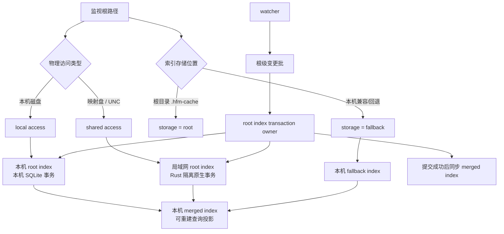

# HFM 索引访问、共享 I/O、激活清理与退出一致性修复任务书

## 0. 文档状态与执行入口

- 文档版本：1.3；制定日期：2026-09-19；更新日期：2026-09-21；软件版本：3.0.0。
- 仓库：`uniquenesssta/99`；制定分支：`stage/09-preview-tags-app`；制定基线：`8fe6db1335e16287062c23bf7de1d66853545f59`。
- 状态：**C-08.1 验证修复进行中；复审确认 C-04 传输层遗漏，需补修后重新验收**。C-00～C-07、C-08.0 的历史记录保留其当时覆盖范围，不表示新反例已通过；O-07 继续暂停，C-09 未开始。最新入口见 §10。
- 本书是 [共享离线与本地退出任务书](HFM_SHARED_OFFLINE_LOCAL_EXIT_TASKBOOK.md) 在真实 Windows/NAS 验收中发现的新一轮正确性修复入口；O-07 继续暂停，先完成本书 P0/P1 修复再决定是否恢复 O-07。
- 不新建阶段分支；继续沿用当前阶段唯一分支。除非用户明确要求，不创建并行修复分支。
- 上级约束继续来自 [总任务书](HFM_REMEDIATION_MASTER_TASKBOOK.md)、[全链路一致性修复任务书](HFM_CHAIN_CONSISTENCY_REPAIR_TASKBOOK.md)、Stage 1 激活事务、Stage 2 路径授权、Stage 5 Rust 边界、Stage 6 React 所有权及 Stage 7 IPC 安全任务书。
- 当前用户要求：先明确“本地索引”和“局域网索引”的职责，修复不得继续混用“共享”概念；其余已确认问题按现有 docs 同等级别的范围冻结、能力约束、失败门、自动验证和 Windows/NAS 实机验收执行。

## 1. 必须先统一的索引术语

### 1.1 四个维度不能再混为一个布尔值

当前代码里至少存在四个不同概念：

| 维度 | 正确含义 | 当前实现事实 | 禁止误解 |
| --- | --- | --- | --- |
| Root Index 存储位置 | 索引文件放在监视根自己的 `.hfm-cache`，还是本机兼容/回退位置 | `RootIndexStorage = 'root' | 'fallback'` | `storage='root'` **不等于局域网/共享** |
| 物理访问类型 | 文件实际位于本机磁盘，还是映射盘/UNC/网络提供者 | 由路径和 `sharedIoResourceKeys(...)` 等运行时判断 | 不能用 `storage` 推断 local/shared |
| Root Index 权威性 | 每个监视根自己的字体事实索引 | 每个 root 有自己的 root index | 不能等同本机 merged index |
| Merged Index | 本机聚合查询投影，用于跨 root 页查询/统计 | 本机生成，可重建 | 不能把 merged index 当共享根数据库写回 |

### 1.2 本地索引和局域网索引的软件实际上“能分辨”，但写路径选错了维度

现状不是“所有索引都被当共享”。底层 `rootIndexDatabaseRuntime.openRootIndexDb()` 会调用 `sharedIoResourceKeys([filePath])`，因此：

- 本机磁盘上的 root index：返回无共享资源，可走本机 SQLite；
- 映射盘/UNC 上的 root index：返回共享资源，主进程直接写会被 `main-write-denied` 拒绝；
- 本机 merged index：仍是本机投影，不应进入共享写事务。

真正错误发生在更上层：`rootIndexRuntime.saveRootIndexSqliteChanges()` 先判断 `storage === 'root'`，默认直接进入 `saveRootIndexSqliteChangesAtomicSnapshot()`，而不是先判断该 root index 的**物理访问类型**。但 `ensureRootScanCacheStorage()` 对“索引放在监视根自身”统一返回 `storage: 'root'`，无论该监视根是本机目录、映射盘还是 UNC。

因此当前错误链是：

```text
storage = root
  ↓
直接选择 atomic snapshot 主进程写路径
  ↓
局域网 root index 真正 open 时才被 sharedIoResourceKeys 识别为 shared
  ↓
main-write-denied
```

结论：**识别能力在，但路由决策使用了错误的字段。** 本书把“存储位置”和“访问类型”永久拆成两个独立契约。

## 2. 本次实机日志已确认的事实

证据日志：`startup-2026-09-19_12-40-52-744-38500.log`，Windows 开发模式，Rust worker 0.42.0 / protocol 42 / `shared-file-io-v1` 已加载。

1. 两个根均成功加载：`O:\字体` 1499 项，`\\192.168.4.38\14t共享盘\字体\字体-小薇` 4068 项；两根 polling 同时启动，merged query 初始总数 5567。此前 `identity-changed` 修复没有复发。
2. `O:\字体` watcher 在真实增量提交时失败：`共享根索引写入必须使用隔离的原生事务。`；后续 recovery 再次失败并 `recovery exhausted`。
3. UNC 根也在同一写边界上失败；同时一次 500ms root probe 超时会把根转为 offline，并使旧读取产生 `stale-generation`。
4. 一次 Shared I/O 超时会触发整个共享根 30 秒不可用，随后多个预览和字体协议请求一起失败。
5. 约 425 秒内产生 9960 次 Shared I/O one-shot，随后 recovery 耗尽后速率明显下降；说明 watcher rescan/recovery 与细粒度隔离调用存在放大关系。
6. 临时激活本身成功：本机托管副本、注册表、FontResource 全部提交；但取消激活和退出清理均被 Rust 拒绝为 `unsafe registry ownership request`。
7. 退出允许残留并按 O-06 预算完成，但 `remaining=1` 时仍写出 `clean=true`，没有区分“进程正常退出”和“本地清理完整”。
8. 上轮 renderer shutdown 噪声修复在本次实机日志中仍未通过：freeze 后仍出现 `cache:getArchitecture`、`tasks:getSchedulerStatus`、`sharedMetadata:getDiagnostics`、`tasks:list`。

## 3. 修复目标与非目标

### 3.1 必须完成

| ID | 级别 | 目标 |
| --- | --- | --- |
| C-01 | P0 | 索引“存储位置”与“物理访问类型”彻底分离，本机 root index 永远不因 `storage='root'` 被当共享；局域网 root index 永远不进入主进程 SQLite 写 |
| C-02 | P0 | 修复共享 root index full/incremental/watcher 写入路由，网络根使用隔离原生事务，watcher 可以真实提交 |
| C-03 | P0 | watcher rescan/recovery 收敛：结构性写错误不能触发反复全根扫描/逐字体 I/O 风暴 |
| C-04 | P0 | 单个 Shared I/O 超时不再直接等价“整个根离线”；根 offline 必须有专用根健康证据 |
| C-05 | P0 | 修复临时激活清理的 JS/Rust 所有权合同，成功激活的本机托管副本必须可单项、批量、退出、启动恢复清理 |
| C-06 | P1 | 退出结果分离“进程生命周期干净”与“临时字体清理完整”，有持久残留允许退出但不得冒充全部清空 |
| C-07 | P1 | renderer 使用明确的 closing 生命周期信号停止诊断/轮询，不再以 scheduler stopping 作为间接代理 |
| C-08 | P1 | 在 C-01～C-07 正确性完成后，再降低 Shared I/O one-shot 数量；保留 killable isolation，不把 NAS I/O 搬回主线程 |
| C-09 | 验收 | Windows + 映射盘 + UNC + 本机 root + 临时激活 + 断网/恢复/退出全链路实机验收 |

### 3.2 明确不做

- 不合并本机 root index、局域网 root index 和本机 merged index。
- 不把局域网 root index 复制成第二套长期“本地权威索引”来绕开共享事务。
- 不重新引入共享 root 的本机 fallback 写入；网络根写失败必须保留原索引并明确失败。
- 不用拉长所有 timeout、降低错误级别、吞掉 `stale-generation` 或关掉 watcher 掩盖问题。
- 不为性能删除进程隔离、把 UNC SQLite 重新放进 Electron 主进程、或取消 root generation 保护。
- 不因清理合同错误放宽到“按任意注册表名称/任意用户字体路径删除”。
- 不新增离线同步、标签 outbox、全量 NAS 镜像或新的生产依赖。
- 不改变用户现有本地标签、收藏、保护、共享标签、永久安装/卸载语义。

## 4. 不可破坏的不变量

| 编号 | 不变量 |
| --- | --- |
| INV-C01 | `RootIndexStorage` 只描述**存储位置策略**，不得承担网络/本地分类 |
| INV-C02 | 物理 local/shared 分类必须来自主进程可信路径/资源解析，renderer 不能传 `isShared` 绕过 |
| INV-C03 | 本机 root index 可用本机 SQLite；局域网 root index 所有写必须在可终止隔离原生事务中完成 |
| INV-C04 | 本机 merged index 是可重建投影；共享 root index 是各 root 的事实来源，二者不能反向覆盖 |
| INV-C05 | 网络根写失败不能切换到本机 fallback 假装提交成功 |
| INV-C06 | watcher 只有在持久索引提交成功后才能发布对应 upsert/delete；失败恢复不能无限全根 rescan |
| INV-C07 | 单项请求 timeout 是“操作结果未知/失败”证据，不自动等价“根离线” |
| INV-C08 | 根 offline/recovering 只由根健康 owner 变更；队列等待、预览缓存失败、单文件慢读不直接拥有根状态 |
| INV-C09 | generation 只表示根身份/可用状态 epoch；普通健康复检、队列延迟不能制造代次抖动 |
| INV-C10 | 成功激活的托管记录必须包含足够的本机路径、session、registryName、file identity；取消后不需要访问 NAS 源 |
| INV-C11 | 注册表清理安全证明由“持久记录 + 精确 registryName + registry value 指向受管 installPath + 受管文件身份”组成，不要求 registryName 伪装成文件名前缀 |
| INV-C12 | 有残留可以退出，但进程干净、保存完整、字体清理完整是不同事实，日志/marker 不得用一个 `clean` 含混覆盖 |
| INV-C13 | renderer closing 必须是显式生命周期，收到后停止非保存必需请求；主进程 freeze 仍保持 fail closed |
| INV-C14 | Shared I/O 性能优化只能减少调用/创建成本，不弱化 killable isolation、提交回执或 root generation |
| INV-C15 | 每个 Atomic Task 失败立即停止；不得用后续任务掩盖前一项硬门失败 |

## 5. 目标职责与数据流



职责边界：

- **Root index storage owner**：决定 root/fallback 文件放在哪里，不决定网络访问方式。
- **Root index access owner**：从可信路径判断 local/shared，选择本机事务或隔离 Rust 事务。
- **Root index transaction owner**：唯一决定 full/incremental/snapshot 的提交协议；watcher 不直接打开 SQLite。
- **Watcher owner**：只做事件合并、预检、提交请求、成功后通知和有界恢复，不拥有索引数据库写算法。
- **Availability owner**：只根据根级探测证据变更 online/offline/recovering；预览、扫描、单文件 I/O 只能上报失败证据。
- **Activation cleanup owner**：只按本机 durable record 清理资源、registry、文件；网络源路径只作展示/关联。
- **Shutdown owner**：维护 processExitClean、persistenceComplete、localCleanupComplete 三类事实；renderer closing 是其生命周期事件。
- **Shared I/O transport owner**：负责隔离执行、deadline、真实 close、限流和后续批处理；不拥有业务 offline 判定。

## 6. Atomic Task 执行顺序

### C-00 基线与可执行反例

状态：**完成**。执行基线 `515f2103106db1dc2a200b43fd3e8304d1ed780e`；最终验证分支提交 `954a2ec56d498c18e216f2a683375b46a8622e41`。

范围：只新增/扩展诊断、测试夹具和任务书记录，不改生产行为。

必须建立以下可重复反例：

1. 本机目录 root index：`storage='root'`，`sharedIoResourceKeys=0`，本机增量写成功。
2. UNC/mapped root index：`storage='root'`，当前 atomic snapshot 路径触发 `main-write-denied`。
3. watcher 首次 rescan -> 索引提交失败 -> recovery -> repeated rescan 的调用计数。
4. 单文件/索引 I/O timeout 触发整根 offline 的旧行为。
5. 激活成功后，现有 registryName + managed path 在 Rust inspect/cleanup 上触发 `unsafe registry ownership request`。
6. `remaining=1` 仍 `clean=true` 的退出事实。
7. freeze 后 renderer 仍触发四项 developer IPC 的实机/受控事件链。

硬门禁：反例必须在当前生产代码上真实失败；不得只做源字符串匹配。C-00 未完成禁止改 C-01。

#### C-00.1 实际观察与长期基线

- 新增 `build/diagnostics/check-index-io-activation-shutdown-baseline.cjs`。默认固定读取 C-00 制定基线源码；`--current` 复核当前源码，`--crlf` 验证 Windows 换行，`--strict` 在当前缺陷仍存在时必须非零退出。默认 observer 进入 `diagnostics:all`，但“成功复现已知缺陷”不等于业务通过。
- JS observer 实际得到 **5 项 KNOWN_DEFECT + 3 项 CONTROL_PASS**：本机 `storage=root` 写入正常；shared `storage=root` 在进入 Rust apply 前先走 atomic snapshot 并触发 `main-write-denied`；结构性 watcher 提交失败触发第二次 root-level rescan recovery；单个 `stat` timeout 将整个 root 标为 offline 并推进 generation；普通 ENOENT 不会误判 root offline；真实激活命名产生 `字体管理器_ACTIVE_` 托管文件但 registryName 为真实字体名 + session；`remaining=1` 仍 `terminate(clean=true)`；close flush 后晚到后台事件仍可触发四项 developer IPC。
- 新增 Windows 原生 observer `native-src/hfm-core-worker/tests/c00_activation_cleanup_contract.rs`，真实启动 `hfm-core-worker --font-activation-files`，用生产形态 registryName + 受管本机文件路径复现 `unsafe registry ownership request`。该测试只在 Windows 执行，不用 Linux stub 冒充 Windows registry 证据。
- C-00 增加的并行原生测试暴露三个既有测试夹具临时目录名只依赖 PID+时间戳，Windows 并行 Cargo 下可能重名；仅在 `local_tags_atomicity.rs`、`preview_cache_atomicity.rs`、`shared_metadata_atomicity.rs` 增加进程内原子序号，不改变生产 Rust。
- 全量 JS 门发现 `rendererDeveloperStatusRuntime.ts` 的冻结 hash 仍停留在上一轮退出修复前；仅更新 `react-composition-domain-controllers.fixture.json` 对应摘要，使夹具与已存在的生产源码一致，未修改 renderer 生产文件。

#### C-00.2 验证结果

- GitHub Actions 首轮稳定验证 `35452094709` 为 success；将同一 C-00 文件集落到正式阶段提交 `cb7ca4068d237a9720a8880d9f85331524fab8f7` 后，又以验证提交 `ccbbc39cba3f5fabc261792703f58c336459df3b` 对正式阶段树执行最终复核，Actions `35454844919` **全部 success**。
- JS/Linux：默认 pinned observer、`--current`、`--crlf` 均成功；`--current --strict` 按预期非零；`npm run verify` 通过，当前 **140/140 diagnostics**。
- Windows native：定向 C-00 原生 observer、全部 Cargo 测试与 release build 通过；Linux native：全部 Cargo 测试与 release build 通过。
- 本轮未修改任何 `src/main`、`src/renderer`、`src/preload` 或 Rust 生产模块，不改 IPC、数据库 schema、索引格式、恢复文件、依赖版本和用户行为。
- C-00 只证明问题可稳定重放，**不表示 C-01～C-07 已修复**。下一执行入口为 C-01。


### C-01 分离 Root Index 存储位置与物理访问类型

状态：**完成**。实现提交随本节同批正式落到 `stage/09-preview-tags-app`；验证候选 `4cac27cd2c7ca0e81effd9cfa4a0e8cad5c86e81`，最终 CI `35484776935`。

候选生产范围：

- `src/main/indexing/root-index/rootIndexTypes.ts`
- `src/main/indexing/rootIndexRuntime.ts`
- `src/main/indexing/root-index/rootIndexDatabaseRuntime.ts`
- `src/main/cache/scan-storage/rootIndexStorageRuntime.ts`
- 必要的窄路径/访问分类 owner；不在 watcher 里复制 locality 判断。

实现约束：

- 保留 `RootIndexStorage='root'|'fallback'` 兼容，不把它重命名成 local/shared。
- 新访问决策必须显式表达 local/shared，来源只能是可信 root/file path 分类。
- 本机 `storage='root'` 不能触发 Shared I/O；映射盘/UNC `storage='root'` 必须进入 shared route。
- 分类失败时 fail closed；不得默认“本地”后直接 SQLite 网络路径。
- 不修改 DB schema、rootId、manifest 兼容字段，除非 C-00 证明无法实现；若必须修改，先停下补迁移方案。

硬门禁：同一个 `storage='root'` 用本机路径和 UNC 路径得到不同 access route；四组合 `root/local`、`root/shared`、`fallback/local`、非法 fallback/shared 均有测试。

#### C-01.1 实际实现

- 新增 `src/main/indexing/root-index/rootIndexAccessRuntime.ts` 作为唯一 Root Index 物理访问分类 owner；新增 `RootIndexAccessKind = 'local' | 'shared'`。分类只依赖现有可信 `sharedIoResourceKeys([filePath])`，不把 renderer 输入、`storage`、文件名或 manifest 字段当网络身份。
- `RootIndexStorage = 'root' | 'fallback'` 保持原语义和原类型：只描述索引存放在监视根自身还是本机 fallback，**不再参与 local/shared 身份推断**。
- `rootIndexDatabaseRuntime` 改为统一调用 access owner：
  - local 路径直接打开本机 SQLite；
  - shared 只读继续通过本地 SQLite snapshot；
  - shared + `touchMeta=true` 仍拒绝主进程写，保留 `main-write-denied` 防线；
  - `fallback/shared` 在进入数据库前以 `invalid-root-index-access` fail closed。
- `rootIndexRuntime.saveRootIndexSqliteChanges()` 先解析 access kind：
  - `root/local` 保留现有 atomic snapshot；
  - `root/shared` 不再错误进入 Node atomic snapshot，而是进入现有 `runRustRootIndexApplyChanges` 隔离原生增量路由；
  - shared 原生增量能力不可用时在 Node fallback 之前明确拒绝 `shared-root-index-native-write-unavailable`，不重新打开网络 SQLite。
- `saveRootIndexSqliteFile()` 的 shared full write 在 C-01 阶段明确以 `shared-root-index-full-write-unavailable` fail closed，防止再次落回主进程 SQLite。**这不是 C-02 的 full transaction 实现**；C-02 继续负责 full rebuild/snapshot/latest/manifest 的完整原生事务。
- 本轮没有修改 `rootIndexStorageRuntime`：它继续只负责 root/fallback 存储位置，避免把 access 分类再次塞回存储 owner。
- 不改 root index/merged index/shared metadata schema、rootId、manifest 格式、IPC、Rust 协议、依赖或用户配置。

#### C-01.2 回归与验证

- 新增长期门 `diagnostics:root-index-access-routing`：
  - 四组合 `root/local`、`root/shared`、`fallback/local`、非法 `fallback/shared`；
  - local root 增量必须生成本机 snapshot 且 Rust apply=0；
  - shared root 增量必须 Rust apply=1 且主进程 SQLite open=0；
  - shared full write 在 C-02 前必须明确 fail closed；
  - CRLF 通过；把路由退化回 `storage === 'root'` 的 mutant 和移除 fallback/shared 拒绝的 mutant 均被拒绝。
- C-00 `--current` 从 **5 KNOWN_DEFECT / 3 CONTROL_PASS** 变为 **4 KNOWN_DEFECT / 4 CONTROL_PASS**；原 `C00-B01` 已转为 control：shared `storage=root` 现在到达 Rust route，`rustCalls=1`，不再复现 `main-write-denied`。其余 watcher recovery、timeout→offline、remaining=1→clean=true、renderer closing 四项仍保持已知缺陷，未被本轮掩盖。
- 最终 CI：GitHub Actions `35484776935`，全部 success。
  - Linux JS：新定向门、C-00 current observer、`npm run verify` **141/141 diagnostics**、Electron/Vite build、混淆 3/3 全部通过；
  - Windows JS：新定向门和 TypeScript 通过；
  - Windows/Linux：Cargo 全测试及 release build 通过；本轮未修改 Rust 生产源码。
- 首轮验证 `35484602596` 的 JS 全量门在既有 `preview-input-boundary` 内因 runner 未预取 crates、`cargo --offline` 找不到 `rusqlite` 停止；定向 C-01、Windows JS、Linux native 均已通过。验证工作流补 `cargo fetch --locked` 后，同一候选代码在 `35484776935` 全绿；没有修改或弱化生产测试。
- C-01 完成只关闭“storage/access 混用”的路由缺陷；shared full transaction、watcher 提交全链和 manifest/latest 发布仍属于 C-02，不提前宣称完成。


### C-02 修复局域网 Root Index 原生事务

状态：已完成（2026-09-20）。

必须审计全部 root index 写入口，而不只修 watcher 当前报错：

- full write/rebuild；
- incremental upsert/delete；
- atomic snapshot/latest pointer/manifest；
- shared metadata merge 前置读取；
- maintenance/snapshot cleanup；
- legacy migration；
- manual refresh 和 watcher 写。

实现要求：

- 局域网 root index 写统一使用现有 Rust/daemon sequenced write lane；若现有 `root-index-sqlite-apply-changes` 只覆盖增量，full rebuild 必须增加同 owner 的原生原子提交能力，不能回到 Node SQLite UNC。
- 已提交 Rust 写失败/超时遵守结果未知协议，不切 Node fallback 重写。
- 本机 root index 可继续使用本机 atomic snapshot，但不能走 Shared I/O one-shot。
- manifest/latest 指针的发布顺序必须在数据库候选验证后，且网络根发布也处于同一可结算事务边界或明确的恢复协议内。
- 共享数据库旧文件不能因新写失败被删除/清空。

硬门禁：本机和 UNC 各做 full + incremental + delete；Rust commit 前失败、commit 后响应丢失、manifest 发布失败均不得产生假成功或双写。

#### C-02.1 实施结果

- Rust worker 新增 `--root-index-replace` 与能力 `root-index-sqlite-replace-v1`；shared root full rebuild 不再回到 Node SQLite UNC，而是通过现有 Rust 写入 owner 执行 `mode=replace`。
- shared incremental upsert/delete 与目录签名写入统一进入同一 Rust root-index 事务入口；`rootDirectoryCacheRuntime` 不再直接打开共享 SQLite。local root 保留本机 atomic snapshot 路径，不走 Shared I/O one-shot。
- 原生 full replace 使用 SQLite `IMMEDIATE` transaction 清理旧 entries/directories、写入完整候选、核对有效行数与 meta 后提交并 checkpoint；提交失败由 SQLite 回滚保护旧数据库，不先删除或清空已提交版本。
- 已提交 Rust 写若回执丢失继续按 submitted-write 语义返回 `outcome=unknown`，禁止 Node fallback 双写；数据库已提交但 manifest/latest 发布失败时记录 `committed_publication_pending`，不把已提交事务伪装成失败，下一次 `ensureRootScanCacheStorage` 会依据 active DB 重建 manifest。
- full write 前继续合并已有 shared metadata；未修改 root index/merged index/shared metadata schema、rootId、manifest 格式、IPC、用户配置或生产依赖。

#### C-02.2 回归与验证

- 新增 `diagnostics:root-index-native-transactions`：覆盖 local/shared full、incremental、delete，Rust commit 前失败、commit 后响应丢失、manifest 发布失败、空根 manifest 顺序、CRLF，并拒绝 Node shared-full 回退与 publication 误失败两个因果 mutant。
- `diagnostics:root-index-access-routing` 从 C-01 的 shared full fail-closed 门推进为原生 full replace 门；Rust 增加 `root_index_replace_atomicity` 定向原子性测试。
- 最终候选 `39703fcbe77f56db24c7e8a42977a6b0f1a5cb61` 在 GitHub Actions `35493225636` 全绿：`js-windows`、`js-linux`、`native (windows-latest)`、`native (ubuntu-latest)` 全部 success。
- Linux 全量 `npm run verify` 为 **142/142 diagnostics**；Electron/Vite build 与混淆 **3/3** 通过；Windows/Linux 均通过 `root_index_replace_atomicity`、Cargo 全测试及 release build。
- C-02 关闭 shared root index 原生事务与提交后发布恢复边界；watcher 扫描风暴/恢复放大仍属于 C-03，不在本任务提前处理。

### C-03 Watcher 收敛与恢复去放大

状态：已完成（2026-09-20）。

候选范围：

- `src/main/watcher/folderWatcherRuntime.ts`
- `src/main/watcher/watchedFolderIndexRuntime.ts`
- watcher preflight/root diff 相关窄模块；
- 不把数据库事务逻辑复制进 watcher。

要求：

- 首次 shared polling 可以做一次 root diff，但相同 root/generation 不能因结构性持久化错误无限重排全根 rescan。
- recovery 只重读受影响项；只有“事件无文件名/根签名确实变化且无法定位”才允许 root-level rescan。
- 同一 root 同一 generation 至多一个 root rescan in-flight；后续相同信号合并。
- 持久提交失败时保留旧索引，不发布假的 `font-index:changed`。
- `recovery exhausted` 后进入明确待人工/下次健康事件状态，不以毫秒级 one-shot 自旋。
- 一个根恢复失败不能停止另一个根 watcher。

硬门禁：4000+ 文件受控夹具下，结构性写失败不会产生与文件数同阶的重复子进程/重扫；恢复后只执行一个必要重放并能成功提交。

#### C-03.1 实施结果

- `watchedFolderIndexRuntime` 将索引持久化阶段失败标记为 `watcherRecoveryDisposition=defer`；工作缓存只有在持久化成功后才回写 source cache，因此结构性写失败继续保留旧索引，也不会发布假的 `font-index:changed`。
- `folderWatcherRuntime` 新增按 root、当前 watcher generation 生命周期持有的 deferred recovery：普通文件读取/解析错误仍保留一次有界重读；持久化失败和 recovery exhausted 不再立即 one-shot 自旋，而是保存受影响路径，等待下一条具体文件事件或人工刷新。
- deferred 状态下重复的“无文件名/root diff”信号被抑制，不会再次安排全根 rescan；下一条具体事件只释放一次待重放批次。原始信号若能定位到文件/目录，仅重读受影响路径；只有原本就是无法定位的 root-level 信号才保留根级重放语义。
- 同根同 generation 的重复事件继续通过 pending/recovery map 合并，watcher restart 会清空旧 generation 的 deferred 状态；一个 root 的失败在批次内被独立结算，不阻塞另一个 root 的成功提交与通知。
- 数据库事务仍完全由 C-02 的 root-index owner 负责；C-03 没有把 SQLite/manifest 事务复制进 watcher，也没有修改 Shared I/O timeout/offline 判定。

#### C-03.2 回归与验证

- 扩展 `diagnostics:watcher-index-consistency`：加入持久化 deferred recovery、**4096 文件**结构性失败收敛、重复 root-diff 抑制、下一具体事件单次重放、多 root 隔离，并保留 grace/restart、删除证据、manual refresh 与字段 authority 旧门；共拒绝 **11 个**因果 mutant。
- C-00 `--current` 从 **4 KNOWN_DEFECT / 4 CONTROL_PASS** 变为 **3 KNOWN_DEFECT / 5 CONTROL_PASS**；`C00-B02` 现只出现首次 `rescan "."`，不再自动产生第二次 recovery root rescan。剩余 timeout→offline、shutdown residual clean、renderer closing 三项仍保持已知缺陷，分别留给 C-04/C-06/C-07。
- 最终候选 `62492c79384ae051d356e7fb79f9a7aa304dbba5` 在 GitHub Actions `35502445436` 四个 job 全部 success：Linux/Windows watcher 定向门与 TypeScript 通过；Linux `npm run verify` **142/142 diagnostics**、Electron/Vite build、混淆 **3/3**、`git diff --check` 通过；Windows/Linux Cargo 全测试及 release build 通过。
- 首轮候选只因新增测试夹具未注入 VM timer 而在断言前失败；补齐测试环境后同一生产实现通过完整门禁，没有删除、跳过或弱化任何测试。
- C-03 完成只关闭 watcher 恢复放大；单文件 timeout 误标根 offline 的 `C00-B03` 仍属于 C-04，不在本任务用阈值或吞错掩盖。

### C-04 Root availability 证据与 timeout 语义

状态：已完成（2026-09-20）。

验收平台：Windows 10/11 x64；本地固定盘、UNC、映射盘与 NAS。Linux/macOS 不作为本阶段验收条件。

候选范围：

- `src/main/path/startupPathAvailabilityRuntime.ts`
- `src/main/path/sharedFileSystemRuntime.ts`
- `src/main/path/sharedPathProbeRuntime.ts`
- `src/main/path/ioDeadlineRuntime.ts`
- `src/main/preview/runtime/previewCacheRootAvailabilityRuntime.ts`
- 必要的 Shared I/O 结果类型。

要求：

- 单文件/缓存/索引命令 timeout 只标记该操作失败或结果未知，不能直接 `markStartupPathRootUnavailable`。
- offline 必须来自专用根探测、明确 OS unreachable/not-found/connection 类错误，或有记录的连续根级失败策略。
- queue wait 与 actual execution 分开计时；因本机 executor 排队导致的超时不能算网络根不可达。
- 500ms 现值不得直接“调大了事”；C-00 先记录真实 root probe elapsed/queue，再决定阈值。
- 根探测拥有保留执行能力，不能被批量预览/scan one-shot 完全饿死。
- online 健康复检不变 generation；confirmed offline/recovering/identity change 才推进 epoch。
- 预览缓存 circuit breaker 只关闭共享 preview tier，不拥有整个字体 root offline 状态。

硬门禁：慢单文件 + 根可读时根仍 online；真实断网时有限时间转 offline；重连只恢复同一身份；旧代次结果仍被丢弃。

#### C-04.1 实施结果

- `sharedFileSystemRuntime` 不再把普通请求 `timeout` 升级成整个 root offline；单文件/缓存/索引命令超时只结算该请求。明确 `ENETUNREACH` 等网络不可达证据仍可推进 root unavailable。
- `sharedIoProcessRuntime` 增加独立 `root-probe` lane：普通 Shared I/O 继续最多两个 default slot，根探测拥有保留执行能力；同根写入仍与 probe 互斥，避免探测读取未结算写状态。进程结果及错误均记录 `queuedMs` 与 `executionMs`。
- 根探测继续保持 **500ms execution budget**，没有通过“调大 timeout”掩盖问题；新增独立 **3000ms queue budget**，排队超时/队列满/关闭/取消属于 inconclusive，不再等价于网络根不可达。
- `startupPathAvailabilityRuntime` 成为 root online/offline/recovering 的单一状态 owner：online 健康复检保持 generation；confirmed offline、recovering 与 identity change 才推进 epoch；旧 generation 结果继续丢弃。
- 修复 Windows 本地固定盘被误登记为 isolated root 的真实缺陷：普通 `C:\...` 本地 root 不再进入 Shared I/O 路由；映射盘仅在远端映射已确认后登记物理身份，UNC/映射根成功 probe 后继续登记已验证共享身份。
- `previewCacheRootAvailabilityRuntime` 不再自行 `stat(root)` 决定整个字体 root offline，而是消费中央 Root availability；Preview circuit breaker 只关闭共享 preview tier。中央 probe 仅“不确定”时不会把 preview root 永久缓存为 unavailable。
- shared watcher polling 的单次 snapshot/read 失败不再直接调用 `markStartupPathRootUnavailable`；旧 baseline 保留，root offline 由专用根证据链负责。
- 未修改数据库 schema、Root Index/Shared Metadata 协议、IPC、用户配置或生产依赖。

#### C-04.2 回归与验证

- 新增 `diagnostics:root-availability-evidence`：覆盖单请求 timeout 不改 root、明确网络不可达、root-probe 保留 lane、queue/execution 分离、online generation 稳定、offline/recovering epoch、本地固定盘不进入 Shared I/O、Preview 只消费中央 owner。
- 相关既有门同步升级但未弱化：`io-deadline`、`startup-nas-deadline`、`preview-cache-root`、`preview-storage-routing`、`shared-filesystem`、`shared-io-process`、`shared-io-integration`、`offline-settlement-watcher`、`shared-root-retention`、watcher/root-index 门均验证新合同；Windows 测试夹具补齐结构化 probe receipt、显式 SQLite close 与受控本地盘身份。
- C-00 `--current` 从 **3 KNOWN_DEFECT / 5 CONTROL_PASS** 变为 **2 KNOWN_DEFECT / 6 CONTROL_PASS**；`C00-B03` 已转为 control：单文件 `stat` timeout 后 root 仍为 `online`，generation 不因该请求变化。剩余 shutdown residual clean 与 renderer closing 留给 C-06/C-07。
- Windows C-04 影响链 CI `35514640345` 最终 **success**：TypeScript、Root availability、deadline/NAS、Preview、Shared I/O、offline/watcher、shared-root retention、Root Index、Electron/Vite build、混淆、`git diff --check`、Cargo 全测试与 release build 全部通过。
- C-04 验收仅以 Windows 10/11 x64 目标平台为准；Linux/macOS 不作为本阶段验收条件。
- 完整 Windows `npm run verify` 另暴露既有 `diagnostics:activation-entry` 在 Node VM 中加载 `import.meta.env` 的测试框架兼容问题；该项与 C-04 Root availability 无关，本任务没有修改 renderer/activation 生产代码或通过弱化测试掩盖它。
- C-04 关闭 timeout→root offline、probe 饥饿、排队/执行混淆及 Preview root owner 重复问题；下一项进入 C-05 临时激活清理所有权合同。

### C-05 修复临时激活清理所有权合同

状态：已完成（2026-09-21）；同日激活入口回归与 C-05R sharing violation 回收已完成。Windows 实机日志已确认“激活 → 取消激活 → 再激活 → 再取消激活”成功，C-05/C-05R 实机闭环通过。

候选范围：

- `src/main/activation/runtime/managedActivationIdentityRuntime.ts`
- `fontActivationCleanupRuntime.ts`
- `fontDeactivationSettlementRuntime.ts`
- `fontDeactivationBatchRuntime.ts`
- `fontActivationTransactionRuntime.ts`
- `native-src/hfm-core-worker/src/font_resource/activation_files.rs`
- 相关 Rust/TS 类型与原有诊断。

根因约束：

- JS 持久记录的 `registryName` 是真实字体注册名 + session 信息，不以 `字体管理器_ACTIVE_` 开头；
- Rust 当前把 `registryExpectations` 的“注册表 value name”也要求使用文件所有权前缀，和真实 Windows Fonts 注册命名语义冲突。

修复要求：

- **不能**简单删除 Rust 安全检查。
- 文件所有权仍要求：精确 `currentUserFontsDir`、文件名前缀、非 UNC、真实文件 identity。
- registry 所有权改为：请求来自 durable record；registryName 精确等于该 record；当前 registry value 必须精确指向 record.installPath；installPath 必须通过受管路径/身份验证。
- 删除 registry 前再次 native 核验；不允许传任意 registryName + 任意 path。
- 单项、批量、退出 cleanup、启动 recovery 使用同一验证函数/协议。
- 清理仍不访问 NAS sourcePath。

硬门禁：真实命名形态（中文字体名、TrueType/OpenType、session）均可成功清理；伪造 registryName、同名指向外部文件、受管路径相邻文件、替换 inode、旧 record 全部拒绝。

#### C-05.1 实施结果

- durable activation record 现在以精确 `registryName`、`installPath`、`sessionId` 与真实文件 identity 组成 native ownership claim；真实 Windows Fonts 注册名无需伪装成文件所有权前缀。单项停用、批量停用、退出 cleanup 与启动 recovery 复用同一验证协议，清理路径不读取 NAS `sourcePath`。
- Rust `activation_files` 保留并加强 fail-closed：legacy `registryExpectations` 明确拒绝；受管文件必须位于精确 Current User Fonts 目录、满足 managed 文件名前缀、非 UNC 且 identity 匹配；registry value 必须精确等于 durable record 的 `registryName` 并精确指向 `installPath`，删除前再次 native 核验。
- 文件被替换、相邻文件、外部路径、伪造 registryName、旧记录缺 identity、copy lease 未结算等场景全部拒绝；资源/registry/file 的 compensation 与 batch settlement 保留 durable retry state，不把未完成清理伪报成功。
- Windows C-05 verification `35567035211` 全绿：TypeScript、managed activation recovery 10 cases、C-05 batch settlement、A2～A8 activation transaction/compensation、save queue durability、Rust contracts/clients/transport、orchestration contracts、`c00_activation_cleanup_contract`、Cargo 全测试、Electron/Vite build、混淆、diff check 与 release build 全部通过。
- transport fixture 仅在 non-trace outcome 完全不变的前提下刷新 C-05 导致的 8 个 activation trace 与 2 个 lifecycle sequence trace；未重录无关基线，也未弱化 mutant/ownership 门。
- `local-activation-baseline` 继续以 observer 身份报告旧基线中的 5 observed defects / 4 controls；其中跨阶段剩余项不在 C-05 冒充已修。C-05 只正式关闭临时激活清理所有权合同，C-06 退出结果语义为下一项。

#### C-05.2 实机回归：stale install state 截断激活入口

- 当前 Windows 实机日志已确认 C-05 v2 worker 正常加载，停用时 ownership registry claim、`RemoveFontResourceEx` 与 registry settlement 能执行；另有两个受管字体文件因 Windows `os error 32` 长时间占用而无法物理删除，该问题独立保留，不与本次入口修复混合。
- 实机“点击激活但主进程无 copy / registry write / AddFontResourceEx”根因位于 Renderer admission：统一菜单显示“激活”，但 `activateFontsBatch()` 又调用 `batchActivationCandidates()`，把 `isInstalled=true` 的未激活字体提前过滤为 0 target。取消激活后 install-status 可能短暂保留旧提示，因此按钮可见但 `fonts:activateFonts` IPC 根本不会发送。
- 修复后 Renderer 的 install state 只作为提示，不再拥有激活 admission。Renderer 只排除明确 `active`、Windows 默认受保护字体和 busy 项；所有其余未激活字体都发送到 main，永久安装与否由 main 的 `activateFontSessionTransaction()` 依据权威 install-status 决定，仍保留 `already-installed` 安全分支。
- `diagnostics:activation-entry` 新增 stale `systemInstalled=true` 正例：未激活字体必须仍发送到 main；重新加入 Renderer `!isInstalled(font)` 过滤的 mutant 必须失败。诊断同时直接兼容 Windows 路径，不依赖运行前改写测试文件。
- Windows regression CI `35590647591` 全绿：TypeScript、activation-entry、font-command-entry、managed activation recovery、C-05 deactivation settlement scope、Electron/Vite build、混淆及 `git diff --check` 全部通过。生产 Rust/C-05 ownership 协议未改。
- 本项仍要求用户在 Windows 实机重新执行“激活 → 取消激活 → 再激活”确认。实机回执前 **C-06 继续暂停**；`os error 32` 临时字体文件占用作为下一独立原子修复处理。

#### C-05.2 C-05R：Windows 占用文件退避回收

状态：自动门完成（2026-09-21）；Windows 实机最终观察保留，C-06 暂不推进。

- 实机根因不是 C-05 ownership 失败，而是 Windows 已释放 resource/registry 后，受管临时字体文件仍可能短时间被其他进程持有，Rust 删除返回 `os error 32`；旧队列在后续 flush 中会持续再次触碰同一文件，形成无收益的重复删除与日志噪声。
- `pending-temporary-font-deletes.json` 记录新增 `blockedBySharing` / `nextRetryAt`；sharing violation 自动退避固定为 5 秒 → 15 秒 → 60 秒 → 5 分钟 → 15 分钟封顶。冷却窗口内普通自动 flush 只保留记录，不再次调用 native delete。
- `startup` 与用户显式“重试清理”属于 force retry，可绕过当前 backoff；成功删除后 durable record 正常移除。非 sharing 错误不伪装成占用错误，继续保留原失败语义。
- 每次真正删除前仍执行 C-05 的 managed path、session record 与 file identity 核验；未放宽 registry/file ownership，未改 Renderer stale-installed 激活入口修复，也未引入管理员权限或 `MOVEFILE_DELAY_UNTIL_REBOOT` 依赖。
- Windows C-05R locked-file verification `35591586994` 全绿：TypeScript、activation-entry、managed recovery（新增 sharing violation durable backoff / repeated flush / user retry / startup recovery 场景）、C-05 batch settlement、Electron/Vite build、混淆与 diff check 均通过。
- 本项自动门收口后仍保留实机观察项：执行“激活 → 取消激活 → 再激活”，并确认被 Windows 暂时占用的 `*_ACTIVE_*` 文件不会形成快速重试风暴，释放占用后可由后台/启动/用户重试最终回收。

### C-06 退出结果三轴语义

状态：已完成（2026-09-22）。

目标事实至少分开：

- `processExitClean`：退出编排按预算正常走完；
- `persistenceComplete`：必须落盘的本地状态/恢复意图可靠保存；
- `localCleanupComplete`：临时字体资源/registry/file 是否全部清完。

实现要求：

- `remaining>0` 且 durable recovery 已确认时允许进程退出，但日志必须明确 `localCleanupComplete=false`。
- 不把“允许退出”写成“所有清理完成”。
- 现有 previous shutdown marker 若必须扩字段，使用向后兼容可选字段；旧 reader 仍能识别 process-level clean，不能把正常有残留退出误判为崩溃。
- durable record 保存失败时不能写出 process clean 成功而掩盖恢复事实丢失。
- 下一次启动必须能区分 crash recovery 与 planned residual cleanup。

硬门禁：0 残留、1 残留已持久化、持久化失败、清理超时、强制退出五种结果不可混淆。

#### C-06.1 实施结果

- `shutdownCoordinatorRuntime.ts` 不再用单一 `clean:boolean` 表示全部退出事实，改为结构化 `ShutdownOutcome`：`processExitClean`、`persistenceComplete`、`localCleanupComplete`、`cleanupRemaining`、`cleanupTimedOut`、`forced` 与 `reason`。
- planned residual cleanup（例如 C-05R 中被 Windows 暂时占用的字体文件）现在允许 `processExitClean=true`、`persistenceComplete=true`，同时明确 `localCleanupComplete=false`；不会再把“允许退出”冒充“清理已全部完成”。
- `temporaryFontDeleteQueue` 的 flush 现在返回真实 `remaining`；主生命周期把 activation/compensation 残留与 pending temporary-font delete 残留合并进 shutdown cleanup outcome。修正了实机日志里 delete queue 仍 `remaining=1`，coordinator 却错误记录 `remaining=0` 的语义缺口。
- `last-shutdown.json` 保留 legacy `clean` 字段，并新增可选三轴字段。正常 planned residual 对旧 reader 仍保持 `clean:true`；新 reader 会记录并识别 `localCleanupComplete=false`。恢复意图/本地状态持久化失败时不会写出 legacy `clean:true`。
- 下一次启动日志可区分 `previous shutdown marker: clean with planned residual cleanup` 与真正的 `previous shutdown was unclean`，避免把正常有残留退出误判为 crash recovery。
- `diagnostics:bounded-local-exit` 已锁定 0 残留、1 残留已持久化、持久化失败、cleanup timeout、强制退出五类 outcome；`diagnostics:shutdown-log-durability` 锁定三轴 marker 与 legacy 兼容。
- C-00 current 从 2 个缺陷 / 6 个对照降为 **1 个缺陷 / 7 个对照**；`C00-B04` 已转为 `CONTROL_PASS`。当前唯一剩余缺陷为 `C00-B05` renderer closing admission，对应 C-07。
- Windows C-06 verification `35630687836` 全绿：TypeScript、C00 current、bounded-local-exit、shutdown-log-durability、window-close-flush、main application/composition contracts、Electron/Vite build、混淆与 `git diff --check` 全部通过。首轮 `35623591752` 仅因 VM 对象原型差异导致测试深比较失败，后续只在测试端进行 JSON 规范化，生产语义未改。

### C-07 Renderer 显式 closing 生命周期

状态：已完成（2026-09-22）。

现有 `scheduler stopping` 只能是后台调度事实，不能继续充当 renderer closing 的代理。

要求：

- 复用现有 `app-window:flush-before-close` 或增加职责明确的关闭生命周期事件；不得新增第二套互相竞争的退出协议。
- renderer 一收到 closing 即：
  - 停止 developer diagnostics refresh；
  - 停止 shared metadata foreground refresh；
  - 停止非必要 metrics/task list polling；
  - 清除相关 timer；
  - 只保留允许的本地 flush。
- preload 暴露最窄订阅；不允许 renderer 自报“我已 closing”影响主进程准入。
- 已在途请求收到 shutdown rejection 属正常结算，不继续触发后续串行查询。
- 主进程 `assertApplicationOpen` 不放宽。

硬门禁：真实 close request 触发后四个已知 IPC 调用计数为 0；正常运行 developer page 功能保持。

#### C-07.1 实施结果

- 新增 renderer 内部唯一 `rendererClosingLifecycleRuntime`，由现有 `app-window:flush-before-close` main→renderer 事件进入 closing；Renderer 只消费该状态，不提供 renderer→main 的“自报 closing”能力。
- 保存失败/超时且用户选择“返回软件”时，main 通过同一 `app-window` 协议发送窄 `app-window:close-cancelled` 通知；preload 只暴露订阅，renderer lifecycle 随即 resume。没有增加第二套退出协议。
- closing 后 developer diagnostics、background-task late event、shared metadata foreground idle/timeout/interval、非必要 database metrics 与 install-status 后续 metrics timer 均停止；允许的 font-write/library persistence 本地 flush 保留。
- developer diagnostics 的串行调用在每个 await 边界再次检查 closing；已在途请求即使返回，也不会继续派生后续 IPC。
- shared metadata in-flight 结果在 closing 后不再触发数据库刷新、状态提示或下一轮 foreground 调度。
- 原 `scheduler stopping` 只保留为 scheduler-domain 事件，不再承担 renderer closing admission。
- `main assertApplicationOpen` 与 C-06 shutdown coordinator 准入规则未放宽。
- C00-B05 已由缺陷反例转为 `CONTROL_PASS`：正常运行时 4 个 developer diagnostics IPC 可用；真实 close request 后 4 个已知 IPC 调用计数为 0，shared foreground 调用增量为 0；close cancelled 后两者恢复。C00 current 现为 **0 缺陷 / 8 对照**。
- Stage 6 controller/source freeze、App hook order、root-view legacy lifecycle freeze 均保留并更新为显式 closing owner/wiring 行为锁；Windows CRLF mutant 必须先确认实际命中源码，再验证门禁拒绝，未删除或弱化既有门禁。
- Windows C-07 verification `35737665904` 全绿：TypeScript、C00 current、window-close-flush、bounded-local-exit、React composition controllers/domain controllers、app interaction composition、app-root-view contracts、Electron/Vite build、混淆与 `git diff --check` 全部通过。

### C-08 Shared I/O 批处理与执行者复用

状态：**进行中**。C-08.0 可观测性基线已完成；下一 Atomic Task 为 **C-08.1 network `list-font-files` 批处理优化**。

优化顺序：

1. 先统计修复后 idle/首次 watcher rescan/预览滚动的 request 数；
2. 优先使用已有 Rust `list-font-files`、`directory-signatures`、`font-signature-probe`、`watcher-batch-preflight`、`root-index-sqlite-apply-changes` 合并 per-file stat/readdir；
3. 仍有进程创建热点时，再评估有界 worker 复用或每根有限隔离执行者；
4. 保留 kill/timeout/parent-death 语义，不引入常驻无界进程。

硬门禁：

- 稳态 60 秒无变更时不得出现逐字体 I/O；只允许周期性根健康/poll；
- 一个 root 的批量任务不能占满本地字体清理通道；
- 断网后进程数、队列长度和 PID 最终回到有界稳定值；
- 性能提升不得以降低正确性测试或扩大 timeout 获得。

#### C-08.0 Shared I/O 可观测性基线

状态：**完成**。验证候选 `b0eddb45b80d265a8b947bd3f1065130399753f0`；Windows run `35742653243` 为 SUCCESS。正式提交不保留临时验证 workflow。

范围与结果：

- `SharedIoProcessRequest` 增加可选 `label`，Shared I/O runtime 按总量与 label 记录 `requests / accepted / started / completed / failed / closed`；状态快照同时保留 active、queued、PID，便于直接判断请求来源与子进程是否收敛。
- Rust transport 为普通 one-shot 使用命令名作为 label；对 `shared-file-io` 从现有临时 JSON 输入读取 `operation`，形成 `shared-file-io:<operation>`，不新增业务协议，也不让 renderer 提供网络身份。
- Shared I/O start/close 日志加入 label；close 日志附带 `startedTotal / closedTotal`。诊断日志失败仍不改变任务结算。
- 既有队列容量、default/root-probe lane、timeout、SIGTERM/SIGKILL、真实 child close 后释放 slot、root generation、offline owner 和写入准入均未修改；C-08.0 只建立性能计数与命令归因，不提前实施 worker 复用。
- `check-shared-io-process.cjs` 锁定单命令 metrics 计数与最终 `started === closed`、active=0、queued=0、PID=0；`check-shared-io-integration.cjs` 锁定 production client → transport → isolated child 的 command label 可观察。
- Windows `35742653243`：TypeScript、Shared I/O process、Shared I/O integration、shared filesystem、Rust worker transport、C00 current、Electron/Vite build、混淆、`git diff --check` 全部通过。没有新增依赖、数据库/IPC/schema 迁移或用户数据变更。
- 临时 `.github/workflows/native-offline-verification.yml` 仅用于候选验证，正式原子提交中删除；候选本身不作为最终阶段提交。

C-08.0 的数据只解决“能准确计数并定位 one-shot 来源”。真实 NAS 的 idle/首次 watcher rescan/预览滚动基准仍需在 C-08.1/C-09 的 Windows/NAS 运行中记录，不能用 CI 进程计数代替实机性能结论。

#### C-08.1 network `list-font-files` 批处理优化

状态：**进行中，验证未收口**。

目标：先处理共享根扫描中可由已有 Rust `list-font-files` 一次完成的目录枚举/字体文件信息读取，减少等价的 network `readdir/stat` one-shot；不改变 Root Index 权威性、watcher 提交顺序或根 availability 证据。

实施前硬约束：

- 必须先定位现有 `list-font-files` 的真实调用链、输入/输出和 shared routing，不复制第二套目录扫描算法；
- 只合并同一可信 root/generation 下可等价批处理的读取；任一批次回执仍需经过 generation 校验，旧代次结果必须丢弃；
- 不把 local root 强制送入 Shared I/O，不把 NAS I/O 搬回 Electron 主线程；
- 不改变文件筛选、扩展名、相对路径、mtime/size/identity 等既有索引语义；若批量结果缺少现有调用方必须字段，先补协议/行为锁，禁止猜测填充；
- 批处理失败保持现有 fail-closed/有界恢复，不新增 `catch { return [] }` 或 Node 网络 fallback；
- C-08.1 独立验证通过前不得进入 worker 复用评估。

#### C-08.1 验证接续（2026-09-24）

- 当前生产候选保留已有 network list-font-files 批处理；本次只修正验证夹具及记录，不改生产模块。
- 前置 Windows 运行 `35754472600`：network batching、scan fallback、Shared I/O process/integration、Rust clients/transport 和 TypeScript 通过；全量 verify 在 active-view-consistency 的 restartPolicy 失败，后续 build/混淆未执行。此前 old-success 模块实例问题已越过，本次失败为旧 identity 替身缺少 deleteRegistry。
- 启动恢复夹具改用真实 JS ownership/cleanup/reconciliation/recovery-file 链路和合法 session/file identity，原生系统与删除队列仅作为受控端口。新增成功、ownership 拒绝、registry 拒绝/缺失回执、queue 拒绝、阶段持久化与重启重试检查；不以这些受控场景替代 Windows/NAS 实机验收。
- 保留 favorite/idle/batch/metrics 四个退化反例，增加跳过 registry settlement、忽略 queue rejection 两个因果反例；原断言与 npm run verify 均未删除或跳过。
- Windows `35949497524`（实际验证候选 `33f0538d8105185fdfa14292c0c09785b3752f6c`）已通过 active-view-consistency 与六个因果反例、network batching、scan fallback、Shared I/O、Rust 边界、TypeScript 及 C00 current（0 缺陷/8 对照）；全量 verify 随后在 deactivation-refresh 的反例预期检查失败，后续 build/混淆未执行。不得据此标为 C-08.1 完成。
- deactivation-refresh 的 Windows CRLF 反例只替换 generation，未替换 in-flight reset，导致预期 post-mutation read joined 与实际 stale snapshot 失败点不同。现使用唯一命中断言并保留源换行格式，LF/CRLF 分别运行同一个原失败断言；生产源码不变。
- Windows `35949931927`（实际验证候选 `fd0803aca3b601cc84dc04d120af10a7df31c3f1`）已通过 deactivation-refresh（含 LF/CRLF 双反例）、active-view-consistency、network batching、scan fallback、Shared I/O process/integration、Rust clients/transport、TypeScript 与 C00 current（0 缺陷/8 对照）；完整 `npm run verify` 继续执行后停在 `diagnostics:decomposition-baseline`。失败只表现为 `src/renderer/src/App.tsx` 的 tokenHash 从 `e25d0d...` 变为 `e67ad0...`，functions/owners/exports/viewGroups 均一致；后续 build/混淆未执行。\n- Git 历史核对确认 `App.tsx` 自上次 D-01 冻结迁移后唯一新增生产提交是 C-07 `40fa79c03d832bc18266f2241065d6cd98355901`：新增唯一 renderer closing lifecycle owner，并向 Library/Operations/Developer 三个 close-sensitive controller 传递窄 `closingLifecycle`。C-07 已由 app-root-view contracts、React domain controller、C00-B05 及 Windows `35737665904` 独立锁定；本轮仅把 D-01 的 App tokenHash 更新到当前已验行为，不修改 `App.tsx` 或任何生产模块，也不放宽 functions/owners/viewGroups 结构断言。\n- 下一轮 Windows 验证必须先通过 `diagnostics:decomposition-baseline`，再继续完整 verify、Electron/Vite build、混淆与 diff check；失败继续停在 C-08.1，不推进 worker 复用、C-09 或 O-07。
- Windows 35963112437 在迁移 App tokenHash 后，diagnostics:decomposition-baseline 首个剩余命中为 useDeveloperController.ts；后续步骤因 fail-fast 均未执行，不能计为通过。
- 全量 D-01/C-07 交叉核对确认 C-07 修改且被 D-01 冻结的文件恰为 App.tsx、useDeveloperController.ts、useFontOperationsController.ts、useLibraryController.ts。后三个 controller 的最近生产修改均为 C-07 40fa79c03d832bc18266f2241065d6cd98355901。
- 本轮迁移脚本要求后三个 controller 的 functions/owners/exports/surfaces/viewGroups/ipcChannels 与 D-01 旧证据完全一致，只允许 tokenHash 变化；同时要求 App 当前 inventory 已与前一迁移匹配。任一额外差异 fail closed，不自动刷新证据。
- 同一 Windows 候选在迁移后立即重跑 decomposition、C-08 定向门、typecheck、C00 current、完整 verify、build/混淆和 diff check；全绿前 C-08.1 仍为验证未收口。
- Windows `35969337307` 的迁移步骤成功生成实际候选 `2323d84e6ad627293c8152615592ed315fe29a90`；D-01 decomposition、deactivation-refresh、active-view、network batching、scan fallback、Shared I/O process/integration、Rust clients/transport、TypeScript 与 C00 current 均通过。
- 同一运行的完整 `npm run verify` 继续到 `diagnostics:font-physical-path-authorization` 后在 P6 停止：合法 watched-root 子目录创建完成，但旧断言把返回的授权 real `ioPath` 与 `path.join(watchedRoot, name)` 做词法字符串全等比较。该检查在 Windows 临时目录存在真实路径规范化/别名时比生产合同更严格。
- 本轮只在诊断中增加 `existingPathIdentity/sameExistingPath`，以现有对象的 `realpath` + 平台大小写规则比较身份；应用到合法创建返回路径、post-verify committed destination、reconcile watched-root 三处等价身份判断，并加入不同目录不得折叠的反断言。越界、symlink escape、lock-time reauthorization、源保留、目标发布与 reconciliation 次数要求保持原强度。
- 复核 `c8d57728014357a19e005f32f688a35d4b137dff` 的 Windows `35973246480` 后确认，前一轮已修正合法创建返回路径，但 P6 仍残留一处 `reconciledRoots.includes(watchedRoot)` 的词法等值断言；该断言在 Windows realpath 规范化下可误判已经发生的 root reconciliation。本轮仅将该处改为 `sameExistingPath(...)`，其余 P6/P7 断言与生产代码保持不变。
- 新验证必须先通过 PHYSICAL 定向门，再跑完整 verify、Electron/Vite build、混淆和 diff check；生产 `physicalFolders.ts`、路径授权和 Shared I/O 不修改。
- Windows `35977991956` 已通过 PHYSICAL、D-01、deactivation-refresh、active-view、network batching、scan fallback、Shared I/O、Rust clients/transport、TypeScript 与 C00 current；完整 verify 随后在 `incremental-metadata-refresh` 的首个 1/1499 断言失败，build/混淆未执行。
- 根因不是生产全量同步：U-05 在 `deb0abd58cdd54baeaeb4e75fc3ad96a05c2f42c` 新增该诊断时即把 metadata 根写成 POSIX `'/fonts'`/`'/other'`，且当时 README 明确 Windows 实机待验；生产 locator 采用平台 `node:path.resolve()`。Windows runner 将相对 metadata path 解析成带盘符绝对路径，测试的 identity normalizer 又不做规范化，于是合法 changed id 被诊断误判 `changed-id-path-outside-root` 并进入 snapshot fallback，得到 1499 而不是 1。
- 本轮只把诊断虚拟根改为基于仓库根的 platform-native absolute path；单项 1 行、批量 2 行、多根精确定位、unknown locator snapshot、根外 relative_path snapshot、增量失败 fallback 和原 root-snapshot mutant 全部保留。`sharedMetadataMergedIndexSyncRuntime.ts` 与 `sharedFontMetadataMutations.ts` 不修改。
- Windows workflow 增加 `diagnostics:incremental-metadata-refresh` 前置定向门；通过后才继续 C-08.1 其他门、完整 verify、build、混淆和 diff check。
- Windows `35989601682` 已不再出现 1499/1 metadata locator 误判；新的首个失败是 U-05 renderer 夹具未传 C-07 `closingLifecycle`，导致 `undefined.isClosing`。本轮只补与 C-07 控制器诊断一致的非 closing 生命周期窄替身，不修改 Library controller、renderer closing owner 或共享元数据生产链；新 Windows 验证继续先跑 `diagnostics:incremental-metadata-refresh`，通过后再执行完整 C-08.1 门禁。
- 后续仍需完整 Windows verify、构建/混淆和真实 NAS 请求计数/首屏延迟记录；临时 workflow 在最终收口时删除，不能把定向门通过写成整阶段完成。

### C-09 Windows/NAS 总验收

状态：未开始。

至少覆盖：

1. 本机普通监视目录 + 映射盘 + UNC 三根同时存在；
2. 本机 root index full/incremental/watcher；
3. 映射盘与 UNC root index full/incremental/watcher；
4. NAS 正常、瞬时慢、拔网、共享服务停止、映射改指另一 share、恢复同一 share；
5. 预览滚动、搜索、分页、metrics、标签读取期间断网；
6. NAS 字体临时激活后立即断网，单项取消；
7. NAS 字体临时激活后退出软件自动清理；
8. registry/file 被占用、ACL 拒绝、残留持久化、重启后恢复；
9. 退出时 Developer 页打开/关闭两种情况；
10. 至少一次运行 10 分钟，确认无 request 风暴、重复 watcher、代次抖动或残留子进程。

硬验收结果必须来自日志和实际系统状态；不能用 Node mock 代替 Windows registry、FontResource、映射盘/NAS。

## 7. 验证矩阵与统一门禁

每个 Atomic Task：

1. `git status --short`，确认用户改动并冻结文件范围；
2. 先执行对应旧反例；
3. 修改后跑定向诊断；
4. `npm run typecheck`；
5. `npm run verify`；
6. Electron/Vite build + 混淆；
7. 涉及 Rust 时 Windows/Linux `cargo test --locked` + release build；
8. `git diff --check` 与 final diff 审查；
9. 更新 README 与本任务书执行卡；
10. 硬门失败立即停止下一 Atomic Task。

禁止：

- 删除/跳过已有诊断；
- 把真实 Rust/Windows 必验链替换成 mock 后宣称通过；
- 用环境变量关闭错误路径后算修复；
- 用重建全部索引、删除 `.hfm-cache`、清空恢复记录作为常规修复步骤；
- 用 `catch { return [] }`、silent fallback 或日志降级掩盖数据错误；
- 新增生产依赖，除非先单独说明用途、许可证、体积、运行成本、替代方案和风险并获得用户决定。

## 8. 兼容、迁移与回滚

- 默认不改 root index schema、merged index schema、shared metadata schema、IPC channel、恢复文件 version 1。
- C-01 若仅增加运行时 access kind，不持久化到 DB/manifest；重启每次重新可信分类。
- C-02 不迁移现有索引内容；正确原生事务必须能直接继续使用现有 `.hfm-cache`。
- C-05 不批量改写现有 registry name；旧 durable record 按相同验证协议读取。若旧 record 不足以证明所有权，保留并进入人工残留面板，不能猜测删除。
- C-06 若扩 shutdown marker，只加向后兼容字段；回滚旧版仍能读取 process-level clean。
- C-08 性能优化可单独回退，不影响 C-01～C-07 正确性。
- 每个 Atomic Task 一个可逆提交；用户现有工作区修改受保护，不允许 reset/checkout 覆盖。

## 9. 当前结论与下一执行入口

C-00～C-07 已完成；C-05/C-05R 的 Windows 实机激活链与 C-06/C-07 Windows 自动门均已通过。本书整体仍然**不代表问题已全部修复**。

当前执行顺序固定为：

```text
C-00 基线（完成）
→ C-01 索引 storage/access 分离（完成）
→ C-02 局域网 root index 原生事务（完成）
→ C-03 watcher 收敛（完成）
→ C-04 offline 证据（完成）
→ C-05 激活清理合同（完成；实机通过）
→ C-05R Windows 临时字体占用退避回收（完成；实机链通过）
→ C-06 退出结果三轴语义（完成）
→ C-07 renderer closing（完成）
→ C-08 Shared I/O 性能（C-08.0 完成，C-08.1 验证中）
→ C-09 Windows/NAS 总验收
```

C-07 已关闭最后一个 C00 已知缺陷，C00 current 现为 **0 缺陷 / 8 对照**。**当前执行入口为 C-08.1 验证收口**；C-09 仍须等 C-08 硬门通过后再推进，O-07 继续暂停。

## 10. 2026-09-25 复审修复接续

复审代码基线 `afa39f09c478728278f54d1bf95ed9880288dfbf`，同一 `stage/09-preview-tags-app` 分支接续。用户已授权按下列顺序实施；不新建阶段分支，不改依赖或用户数据。每项独立提交、受影响门及完整 Windows verify/build/混淆通过后才进入下一项。旧节中的“下一项”以本节为准。

| Atomic Task | 范围 | 硬门与当前状态 |
| --- | --- | --- |
| C-08.1-V 验证链修复 | C-00 observer、诊断执行生命周期、全量 runner、现有 CI 与记录 | 实现已提交，验收阻塞：本地 LF/CRLF 完整 146 项与构建/混淆通过；Windows 真实 CIM 查询触发现有 1500ms deadline，完整 Windows verify/build/混淆未通过 |
| C-04R 传输超时语义补修 | Rust transport 与 root availability 受影响测试 | 2026-09-26 实机故障后用户重新授权优先补修，候选 aaefee3 已实现，Windows 专项通过，完整门仍被独立 CIM 超时阻塞；单次操作 timeout 不改 online/generation，根探测失败仍判离线；保留取消、隔离、写入未知结果及旧代次拒绝 |
| C-08.1-P 首批返回 | scan listing 与 indexing client 的批次交付边界 | 待 C-04R 通过；本地根不等全部网络根，完成批次及时交付；不重复发布，不改变索引字段、错误与 generation 语义 |
| C-09 实机验收 | Windows 开发模式、本机/映射盘/UNC、断网/退出/恢复 | 以上门禁通过后执行；真实 NAS 首批、可见预览、总扫描耗时及进程数分别记录；O-07 继续暂停 |

### 10.1 已确认反例及覆盖缺口

- Windows `36141281909` 的定向检查及 typecheck 已通过；完整 verify 在默认 C-00 historical observer 第 340 行失败。该模式加载 `515f210` 旧源码，但断言要求 C-07 才加入的 closing state。失败后 foreground interval 未清理，外层 watchdog 又被清除，直到 55 分钟工作流 deadline 才取消；build/混淆未执行。本地同一反例亦失败且不退出，外部 25 秒超时终止；`--current --strict` 独立通过 0/8。
- C-04 的 shared filesystem 测试替换了 transport executor；生产 `rustCoreWorkerTransportRuntime` 仍把普通 timeout 升级为 root offline。真实子进程加受控健康探测复现 online→offline，无新增根不可达证据。C00 current 0/8 不能覆盖该遗漏。
- C-08.1 在早显示模式下先 await 全部 network roots，才交付首批及处理 local roots；受控等待中即使 local root 排第一，localCalls=0、visible=0。NAS 实际耗时尚未测量，不把进程减少当成首屏加速。

### 10.2 C-08.1-V 实施与验收

- 历史 observer 保留旧源码与明确 5 缺陷/3 对照断言；C-07 closing/resume 正确性仅在 current 模式验收。新增独立 `diagnostics:index-io-activation-shutdown-current`，带 `--current --strict`，进入完整 verify；未删除历史门。
- renderer observer 的 effects/断言全路径由 finally 清理；临时目录清理完成后才释放 observer watchdog。全量诊断使用独立进程执行 owner：普通单项 5 分钟，包含冷态原生编译的 preview-input-boundary 10 分钟；超时显式失败，Windows taskkill tree/POSIX process group 终止后再结算，不重试或跳过失败项。
- 新 `diagnostics:execution-lifecycle` 验证历史/当前 LF/CRLF、严格失败、在 interval 活动时抛错的退出、真实父子进程 deadline、启动失败和非零退出。现有 Windows workflow 先执行此门与 current strict，再完整 verify/build/混淆；为原有 cargo offline fixture 预取 lockfile 中的 crates，不改变 Rust/生产依赖。
- 本地完整 verify 在 main-operations 发现既有夹具未提供 pending-delete 返回值且预期停留在单轴 clean 结果。只补 mock 返回契约及四场景中已由 C-06 实现的三轴结果/日志，其他预期保持不变；新增丢失 pending-delete 调用和丢失 outcome 参数两个 mutant，九场景与七个 mutation 均通过。
- 全量 verify 随后抵达 watcher-activation-baseline：两个指纹仍为 C-03 时源码。逐文件核对 `289226b` 的 watcher snapshot 错误不判整根离线、`f6ad3f8` 的 renderer 过期 installed hint 不阻断激活；限定迁移这两项 hash 并记录来源提交，保留另外九项指纹及全部行为/mutation 门。
- 本地 `npm run verify` 通过（typecheck + 146 项诊断），execution-lifecycle/九场景七 mutant/十 watcher mutant 均通过；electron-vite build、3/3 混淆、git diff --check 通过。preview-input-boundary 的 C++ 68 案例/JS 190 案例已执行；本机缺少 PowerShell/Rust，诊断明确报告外部必验，不能视作原生链通过。Windows 全量门待回执。Create State 连接要求重新认证，本次状态保存在 README/本任务书。未通过完整门禁前不得推进 C-04R、C-08.1-P、C-09 或 O-07。

- Windows `36166165139`（`35a2f92`）已通过新增执行生命周期、全部前置专项、typecheck/current strict；完整 verify 在 local-tag-rust-atomicity 的 CRLF mutation 漏匹配处及时失败，build/混淆未执行。检查发现 shared-metadata 同根问题（原文未归一化、LF 转 CRLF 可能叠加回车）；两脚本统一先归一化，再对正常/每个实际生效的 mutant 执行 LF/CRLF 检查，交易顺序、算法 hash 与业务检查不变。本地原始 LF 与注入 CRLF 的真实源码读取均通过；新 Windows 全量门待回执。

- 对 TypeScript/Rust 源码读取统一注入 CRLF 后，完整诊断另定位 startup-database-health 与 tag-commit-query 的多行 mutation 漏匹配；两者先验证样本实际改变源码，再在 LF/CRLF 分别执行三项反例。修复点和后续八项诊断通过；没有把首次失败的全量命令记为通过。
- Windows `36166890452`（`834f2ea`）已通过原失败点，随后在 managed-font-uninstall-authorization P8 失败：断言把授权 real ioPath 和临时目录的词法输入全等比较。夹具现在使用带 `.` 的等价输入，独立真实路径身份确认目标且排除外部同名文件，再精确比较 unlink/注册表补偿与授权返回 ioPath；十二场景本地通过。生产授权、删除与补偿代码未改；第三轮 Windows 全量门待回执。

- 本地对当前全部源码读取注入 CRLF 的 `npm run verify` 已完整通过 146 项。第三轮 Windows `36167830579`（`151e260`）通过 P8，继而 mapped-drive-unicode 的真实 CIM 断言失败；尚无底层退出证据，不能直接判定超时或放宽门禁。诊断只包装实际 execFile 记录耗时、原 timeout、code/signal/killed、stderr 和输出字节数，不改执行参数/返回值；workflow 前置这项原有严格门以尽早取得实机证据。其余完整 verify/build/混淆保留，当前任务仍进行中。

- 当前明确阻塞：前置 Windows `36168691760`（代码 `a79f557`）真实查询耗时 1537ms，原 timeout=1500ms，signal=SIGKILL，killed=true，stdoutBytes=0，stderr 为空。只能确定执行预算内没有返回有效结果，尚不能区分 PowerShell 启动耗时与 CIM 查询耗时，更不能当作网络根不可达。诊断仍失败，无自动重试、延长期限、接受 null 或跳过 Windows 门。当前验证脚本修复已提交，但 C-08.1-V 未验收；下一推进前需先为映射盘发现的真实执行超时建立独立修复范围和证据，C-04R/C-08.1-P/C-09/O-07 保持未推进。

### 10.3 2026-09-26 实机故障与 C-04R 补修

用户提供 `startup-2026-09-26_02-11-51-283-23124.log`，并在故障说明后明确“开始修复”。本轮优先交付已在实机复现的 C-04R 候选；此前 C-08.1-V 的 CIM 硬门仍未通过，不把此次授权或专项通过写成完整 Windows 验收通过。后续性能原子任务仍遵守失败门。

实机事实（北京时间）：

- 10:12:17–10:12:47，`list-font-files` 请求 433 执行约 30 秒后超时；`fonts:scanFolders` 在 35.7 秒失败，随即由 `isolated-io-timeout` 标记整根不可用。
- 全会话 12953 次 `shared-file-io:stat` 子进程，其中 12285 次在正式扫描失败后发生；NAS watcher 批次直到 10:20:22 才完成（42 upserts）。10:20:48 又由 2 秒 sqliteSnapshot 超时触发整根不可用及预览拒绝。日志没有逐条 stat 路径，不能把全部次数认定为同一文件重复访问。
- 启动 polling 首次基线会发 root rescan；`watchedFolderIndexRuntime.processDirectory` 先列目录，再经 `upsertFontIndexEntry` 对每个文件重新 stat。目录缓存返回的 stat 可能是历史值，后续优化不能直接当作当前文件事实复用。现有 native readdir 仅提供名字/类型，缺少 size/mtime/birthtime；不允许为了省调用猜补字段。
- renderer `rescan()` 的 await 链无 catch/finally；重建分支虽有 catch，也未显式结束 indexingActive。此项尚未修改，需要覆盖当前任务失败与旧任务失败不得覆盖新任务状态。

C-04R 本轮范围：

- 仅删除 transport catch 中 timeout→markStartupPathRootUnavailable 的越权状态写及无用 import。timeout 仍原样抛出，不改任何生产 deadline、并发、隔离、取消、关闭回收、写入未知结果、日志错误或 stale-generation 拒绝。
- 原十个集成场景保留；新增真实 child / 生产 transport / 生产 availability owner 串联的读写超时场景，外部根健康端口仅受控返回结果。健康根保持 online/原 generation；专用探测确认非目录仍进入 offline，新 generation 使正在返回的旧读取被拒绝。增加重新引入 timeout→offline 的 mutation，LF/CRLF 均执行正常链。
- 正常健康根的诊断启动预算从 250ms 改为 2000ms，仅影响受控测试；另显式断言其必须在坏根结算前完成，比仅检查最终返回更精确。生产 deadline 不变。修正测试子进程无 --input 时误把命令名当文件路径的解析。
- Windows workflow 把既有 Shared I/O integration 门移到 CIM 门前以获得本项回执；CIM、完整 verify、build、混淆均保留且依然失败即阻断后续步骤。
- 修改前新增反例实际失败：`operation timeout offlined healthy root`。修改后 12 个场景、LF/CRLF、路由与超时误判两个 mutation 通过，最终存活子进程为 0。完整本地 verify 运行中；Electron/Vite build 与 3/3 混淆通过。真实 Windows/NAS 验收未完成。
- Create State 在本次实机诊断时返回 UNAUTHORIZED/要求重新认证，不能保存插件状态；此执行卡与 Git 是接续记录。

- Windows `36212749920`，候选 `aaefee327113fe05f6364e7ae0571c4f3ee48265`：Shared I/O integration 12 场景、LF/CRLF、两个 mutation 均通过，最终子进程为 0。随后原有 mapped-drive-unicode 门失败，真实查询 elapsedMs=1546 / timeoutMs=1500 / SIGKILL / killed=true / stdoutBytes=0 / stderr 为空；完整 Windows verify/build/混淆未执行。因此 C-04R 仅专项验证通过，阶段未验收；停止下一性能原子任务，先解决映射发现的独立执行预算问题，禁止略过 CIM、拉长生产 timeout 或降低根身份验证。

- 本地首次完整 verify 在第 114 项 shared-filesystem 的 `assert(running())` 失败，独立重跑同样失败；已实测当前执行容器 `process.pid=2`，`readlink('/proc/self')=53831`，`/proc/2` 不存在。旧诊断把信号命名空间 PID 当作 procfs 挂载命名空间 PID，误判阻塞 child 已死亡。测试现在由实际 child 在进入阻塞前同时写入自身 PID 与 procfs self identity，先核对 ready 回执 PID，再以该 procfs identity 判断 Linux zombie；仍执行真实 parent SIGKILL，并要求 child 最终退出。独立场景通过，生产 probe/隔离代码未改，完整 verify 重跑中。Windows 增加此受影响专项前置门，CIM 与全部原门保持强制。
