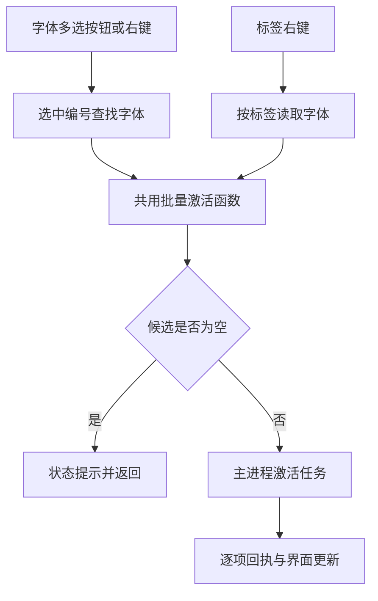

# HFM 操作一致性与刷新优化任务书

## 1. 状态与范围

- 制定日期：2026-09-18。
- 仓库：`uniquenesssta/99`；分支：`stage/09-preview-tags-app`。
- 代码基线：`3bc1e387ebeb5298d5bd4060aaec5c9a0a2c7d93`。
- 状态：**U-00 诊断、U-01 选择/命令链修复、U-02 统一操作入口、U-03 本机集合收藏及 U-04 跨页安装筛选已实施，证据见 §10～§14；Windows 实机验收待回执。U-05～U-09 尚未实施。** 初次规划交付记录保留于 §9。
- 输入：`startup-2026-09-18_02-59-25-870-21044.log`（813 行，UTC 02:59:25.872～03:01:28.978）及用户随后五点反馈、入口差异补充。原始日志不提交到 Git。
- 与前任务衔接：[链路一致性任务书](HFM_CHAIN_CONSISTENCY_REPAIR_TASKBOOK.md) §25 已交付本地收藏、标签目录同步与停用核对。本任务保留这些修复，处理后续真实交互问题和性能问题，不重开 R-01～R-07。
- 既有基线证据：上一提交通过 TypeScript、115/115 诊断、Electron/Vite 367/1/196 模块构建和混淆 3/3。这是历史自动验证结果，**不能替代本任务的字体多选入口和 Windows 实机验收**。

## 2. 已知事实、待证假设与证据缺口

| 编号 | 用户反馈或日志观察 | 当前结论 | 后续任务 |
| --- | --- | --- | --- |
| F-01 | 多选字体文件后批量激活完全无反应；标签右键批量激活有反应 | 用户确认的入口故障。代码已有按钮绑定，两个入口最终调用同一批量函数；具体断点未复现，不能认定“没写代码” | U-00、U-01 |
| F-02 | 其他页面没有未安装筛选 | 已确认：公共列表工具栏未提供安装状态入口，底层有相关筛选状态与查询能力 | U-04 |
| F-03 | 多选没有收藏及取消收藏 | 已确认：多选操作栏和右键菜单缺少对应操作；现有收藏动作是单项切换 | U-03 |
| F-04 | 单选、多选被拆成不同操作入口，按钮冗余 | 已确认：列表操作栏、单项右键、多项右键分别维护操作，能力不一致 | U-02 |
| F-05 | 修改一个字体或标签，是否必须刷新整个库 | 不必。日志显示共享标签单项写入仍进行 1499 行快照同步；其他类型修改应分别测量，不能一概取消刷新 | U-05 |
| L-01 | 单个停用 536/532/511ms，批量停用 873ms | 已确认耗时；单次系统安装读取约 478～499ms。此前加入新鲜系统核对保证正确性，不能直接删掉 | U-06 |
| L-02 | 37 次单独记录的 React 慢更新为 37～56ms；长任务最高 101ms | 已确认这些样本；不等于全部 render 都慢，也尚未定位到具体组件 | U-08 |
| L-03 | 一次统计请求端到端 423ms，返回的 worker 计算约 34ms | 等待、失效重读或调度开销需要拆分；不能把全部时间算作 SQL 时间 | U-05、U-08 |
| L-04 | events/hash 缺文件，启动维护 ok=false | 失败已确认；需核实是首次创建顺序/惰性数据库误报，还是应初始化而未初始化 | U-07 |
| L-05 | 预览 25 次生成耗时 9～63ms，汇总 localHit/sharedHit 都为 0 | 本次新建索引、冷缓存，尚不能判定缓存损坏；要比较相同键的重复访问 | U-08 |

证据解释边界：

1. 本次扫描得到 1499 项、解析错误 0；安装状态补齐后为已安装 295、未安装 1204。扫描期间未知状态不能当作未安装。
2. 收藏与取消收藏各 4 次，接口成功且注明仅本机，写入 0～1ms；本日志未覆盖重启和第二台机器。
3. 本地标签“1-2”“11”和共享标签“32”删除后，相应查询为 0；最后一个共享标签的目录也为 0。
4. 日志确有一次 3 项批量激活成功，但没有证据证明来自字体多选入口。用户补充后必须分别记录入口，不能用标签入口的成功给字体多选入口验收。
5. 停用后标签查询仍为 3，查询条件是 `page=tags, activeFilter=all`，不应据此判定停用失败；日志未给出最终侧栏 activeCount 和独立已激活页面结果。
6. `db-metrics-rejected: user-intent-changed` 是旧结果保护；`decision=duplicate` 是提交去重，不直接当错误。打开文件夹对话框耗时 5241ms 包含用户选择时间，不当作程序卡顿。
7. 本次没有崩溃记录。单次约两分钟运行不足以证明无内存泄漏、长期缓存稳定或 NAS 多机一致。

## 3. 用户交互契约

### 3.1 一套动作，按明确目标集合执行

- 字体列表的操作栏、字体右键、详情及卡片中属于同一字体操作的入口，使用同一套动作语义和目标解析规则；后端仍可保留单个/批量优化实现。
- 单选作用于 1 项，多选作用于当前选中集合。按钮使用“激活”“取消激活”“收藏”“取消收藏”“卸载字体”“删除字体文件”“设置本地标签”“设置共享标签”“加入保护”“取消保护”等名称，不另设一套带“批量”前缀的重复菜单。
- “已选择 N 项”明确展示作用范围；无有效目标时禁用或说明原因。点击前解析目标并形成该次请求的稳定快照，执行中改变选择不能把请求转移到另一批字体。
- 右键选中集合内字体时保留集合；右键未选中字体时按既有行为切换为该字体，并明确呈现新范围。详情显示单个字体不能暗中改变多选命令的目标。
- 标签节点入口继续表示该标签下的字体，并明确标签名称和数量；文件夹/标签节点的重命名、删除是容器操作，不能套用字体多选语义而误删源文件。
- “卸载字体”与“删除字体文件”保持不同动作。沿用确认与保护规则，确认中列出数量和范围。
- 混合状态采用明确设置：收藏令目标变为 true，取消收藏变为 false；激活跳过已激活/不适用项，取消激活保留永久安装；保护同理。不得对混合集合逐项 toggle。
- 标签混合编辑只应用用户明确添加/移除的标签，不用一项字体的整套标签覆盖所有目标的原有标签。保留本地/共享存储域边界。
- 正在执行、成功、部分失败、无可执行项，都应在普通界面可见；开发者状态日志只提供详情，不能成为唯一反馈入口。避免每项一个弹窗。

### 3.2 公共安装状态筛选

- 字体库（含收藏）、文件夹、本地标签、共享标签等实际展示字体列表的页面提供“全部／已安装／未安装”。开发者、维护等非字体列表页面不强行加入。
- 当前页面范围、搜索、标签、文件夹和安装状态取交集，不跳回整个字体库。保持项目现有“永久安装”与“临时激活”的区别，不改成互相冒充。
- 未知安装状态保持未知，可显示同步提示；不得混入已知未安装结果。互相冲突的筛选明确为空或给出一致解释，不能悄悄忽略条件。
- 复用既有 PageToolbarState 和查询键；按原页面状态保存约定恢复，不新增第二份筛选状态。

### 3.3 局部修改与刷新边界

| 操作 | 必要更新 | 正常情况下不应发生 |
| --- | --- | --- |
| 单项/多项收藏 | 本机事务、对应卡片、收藏数；当前收藏筛选/智能排序必要重查 | NAS 收藏写入、全根扫描、无关预览重置 |
| 本地标签增删 | 受影响绑定、本地目录和相关计数；相关列表必要重查 | 全库重新扫描、覆盖共享字段 |
| 共享标签增删 | 共享权威提交、受影响字体的合并索引增量、完整目录确认与通知 | 已知只改 1 项仍无条件同步 1499 行 |
| 激活/停用 | 系统资源与原状态队列、对应字体、相关筛选和计数 | 每项重复整库同步、用旧 active 值冒充系统事实 |
| 修改预览文字（若用户所指是预览文本） | 按新文字使对应预览键失效，重算可见/必要预取预览 | 字体扫描或元数据整库重建 |

“当前页重查”“计数校准”“目录回读”“整根快照同步”“字体重新扫描”须分别计数，不混称“刷新库”。若本次修改影响筛选或排序，允许必要查询；删除当前页项目后应合理补页。保留有效选择和滚动锚点，不保留已真实删除的字体。

## 4. 当前代码链路与责任边界

以下是现有实现，非已实施的优化：



- 入口：`src/renderer/src/components/app/FontListPanel.tsx`、`src/renderer/src/components/app/AppOverlays.tsx`。
- 字体右键目标：`src/renderer/src/fontContextActionRuntime.ts`、`src/renderer/src/fontContextMenuRuntime.ts`。
- 标签目标：`src/renderer/src/fontDialogContextActionsRuntime.ts` → `src/renderer/src/runtime/system/actions/fontSystemStateRuntime.ts`。
- 多选/水合：`src/renderer/src/fontSelectionEventRuntime.ts`、`src/renderer/src/fontSelectionRuntime.ts`、`src/renderer/src/runtime/app/fontSelectionHydrationRuntime.ts`、`src/renderer/src/runtime/app/useFontDetailSelectionEffectsRuntime.ts`。
- 共用动作：`src/renderer/src/runtime/system/actions/fontActivationActionRuntime.ts`。调用前会排除已安装、已激活、系统字体和处理中项目；目标为空会提前返回。
- 已见风险：多选入口从 library.fonts 查找后直接丢弃未命中项；选择集合随该数据集变化裁剪。标签入口同样读取 library.fonts，只是选取规则不同；不能因此断言标签入口使用了另一份完整数据库。
- 既有本机收藏 owner：`src/main/library/runtime/localFontFavoritesRuntime.ts`；写队列继续复用 `src/renderer/src/fontWriteQueue.ts` 与 `src/renderer/src/fontWriteQueueRuntime.ts`。
- 共享同步 owner：`src/main/library/sharedFontMetadataMutations.ts`、`src/main/library/sharedMetadataMergedIndexSyncRuntime.ts`；目录与提交通知继续由既有 owner 管理。

## 5. 执行纪律与不可破坏项

1. 每项开始前记录实际 HEAD、工作树和精确文件白名单。下节路径是调查/修改候选，不代表全部都应改；新增关联文件先记录证据与职责。禁止借机重构整个 App 或迁移所有协议。
2. 先建立原故障复现，再修改完整受影响路径。入口测试必须从真实组件事件开始，不能只调用后端批量函数；冻结源码摘要不是行为验收。
3. 收藏保持本地唯一权威；一次性迁移、false 决策、重启与身份别名规则保持。本地标签、共享标签、收藏、删除保护互不覆盖。
4. 保留最后标签删除、空标签目录、跨根目录、部分失败、R-05 意图保护、R-06 去重，以及旧分页/ID/统计 generation 拒绝机制。
5. 保留激活事务回滚、原待保存状态覆盖、退出 flush、永久安装识别与只清理本应用拥有的临时资源。不能为速度取消真实性核对或先报成功再悄悄失败。
6. 不新增平行字体库/选择状态/收藏状态 owner。必要的在途请求快照有明确生命周期，完成即释放；不引入无界 Map 或轮询。
7. 共享增量同步使用提交后的权威字段/记录，不能把渲染器旧对象整行覆盖其他机器的新数据。回读失败、索引失败和写入已提交分别报告。
8. 保持原 IPC、两套 preload、数据格式和依赖兼容；确需调整先说明迁移与回滚。测试故障只作用于临时库或专用测试根。
9. 每项形成可审查的提交并更新 README 和本任务书；旧夹具只按已证实行为差异定向迁移，不批量重录来消除失败。
10. Context7 用于实际遇到的新 API/版本疑问；Mermaid 只记录真实代码关系；Create State 不替代 Git 和任务书，也不绑定其他项目。

## 6. 实施顺序与任务卡

优先顺序：U-00 → U-01 → U-02 → U-03 → U-04 → U-05 → U-06 → U-07 → U-08 → U-09。先解决操作可达性和正确性，再优化成本。U-00 状态见 §10；U-01 实现与自动验证见 §11；U-02 见 §12；U-03 见 §13；U-04 见 §14；U-05～U-09 为“待开始”。

### U-00：建立入口证据和复现基线

**目的：** 把“字体多选完全无反应”定位到具体阶段。

步骤：

1. 用同一组可临时激活字体，分别覆盖操作栏、字体右键、标签右键；记录列表/卡片视图、Ctrl/Shift/框选、所在页面及是否跨页。
2. 复用现有 operation trace，关联入口、选中数、解析数、缺失数、过滤原因、请求目标、逐项回执和界面结果。若入口尚未发 IPC，也应留下可见的失败/跳过原因。禁止记录整套字体对象或大量路径。
3. 核对点击前后选择是否变化、分页对象是否已水合、菜单关闭时机、旧闭包、候选过滤、处理中标记；分别验证，不预设原因。
4. 以真实组件事件复现；Windows 问题暂不可复现时标为“根因待证”，提供最小诊断步骤，不能将假设写成已修复。

候选：上述 §4 入口/选择模块，`src/renderer/src/components/app/AppRootView.tsx`、`src/renderer/src/App.tsx`、`src/renderer/src/fontOperationTrace.ts`。

验收：能明确指出失败请求在哪一步停止，或明确缺少哪段证据；标签成功不能替代多选成功。区分 0 目标、全部跳过、部分失败和真实任务成功。

### U-01：修复字体选择到命令目标的完整链路

依赖 U-00。

步骤：

1. 按复现证据修复选择、分页数据与目标解析。复用现有水合/身份能力；缺记录须补取或明确报缺失，不静默少执行。
2. 单选、多选、右键、标签入口向原动作传递完整且去重的目标快照；不得只取第一项。
3. 列表刷新不因缓存暂未加载而误判字体被删除；真实删除、切换范围和取消选择仍有明确清理规则。
4. 每项结果独立处理；过滤原因和部分失败普通界面可见，失败回滚只影响该请求及该字体。

候选：§4 选择/动作模块、`src/renderer/src/runtime/app/useSelectionController.ts`、`src/renderer/src/runtime/app/useAppFontDerivedRuntime.ts`、`src/renderer/src/runtime/app/useFontOperationsController.ts`。

验收：选中 N 项等于解析 N 项或有明确缺失清单；请求只包含本次符合条件的所选项。1/2/3/跨页多项、不同页面和选择方式均验证。必须覆盖真实按钮点击→动作→IPC→逐项结果→界面，不能只测数组函数。

### U-02：统一单选和多选操作入口及反馈

依赖 U-01。

步骤：

1. 建立动作能力对照表，按 §3.1 统一入口。现有函数职责能承载则复用；确需新的目标解析职责才单独建模块，避免把规则塞进 JSX。
2. 移除重复的“批量……”菜单结构，按目标数量自动执行。统一安装、卸载、删除、激活、停用、保护、标签及收藏入口的目标规则。
3. 保留标签/文件夹容器动作的范围区别。混合保护/安装状态明确跳过；全跳过也有反馈。
4. 普通界面提供非阻塞的过程和结果反馈，含成功/跳过/失败数；继承原危险操作确认。键盘操作与鼠标操作一致。

候选：`src/renderer/src/components/app/FontListPanel.tsx`、`src/renderer/src/components/app/FontListPanelTypes.ts`、`src/renderer/src/components/app/AppOverlays.tsx`、`src/renderer/src/components/app/FontDetailPanel.tsx`、`src/renderer/src/components/app/AppRootView.tsx`、`src/renderer/src/fontContextActionRuntime.ts`、`src/renderer/src/runtime/system/actions/fontInstallActionRuntime.ts`、`src/renderer/src/runtime/system/actions/fontDeleteActionRuntime.ts`、App 组合接线。

验收：同一动作不出现单项/批量两套重复入口；多选时安装/卸载等不会退化为只处理第一项；菜单作用数量与实际目标一致；删除和卸载依然有不同语义和确认。

### U-03：补齐多选收藏与取消收藏

依赖 U-01、U-02。

步骤：

1. 提供目标集合的明确 true/false 设置，混合收藏状态不逐项反转；未变化项幂等跳过。
2. 复用原意图、队列和本机事务，合并一组操作的界面更新与计数变化，避免每项一次完整刷新。
3. 失败仅恢复仍属于该请求的意图，较新反向操作不被旧回执覆盖；取消后重启不复活。
4. 当前收藏筛选里取消收藏会正确移除目标并补页，保留其他有效选择与滚动位置。

候选：`src/renderer/src/runtime/system/actions/fontFavoriteActionRuntime.ts`、`src/renderer/src/runtime/system/actions/fontSystemActionTypes.ts`、`src/renderer/src/fontUserIntentRuntime.ts`、两项写队列模块、`src/main/library/runtime/localFontFavoritesRuntime.ts`、U-02 入口及必要接线。

验收：全未收藏、全已收藏、混合状态、多次反向操作、磁盘失败、重启、A/B 机器隔离；本地/共享标签与保护字段保持。不得向共享元数据写收藏，不以循环 toggle 实现批量设置。

### U-04：补齐跨页面安装状态筛选

依赖 U-02；与 U-03 的组合需回归。

步骤：

1. 复用 `INSTALL_STATUS_OPTIONS`、PageToolbarState 和既有过滤器，在公共字体列表工具栏增加入口。
2. 将选项贯通组件参数、请求、SQL/内存回退、查询键、分页及总数；不只修改 UI。
3. 验证页面内范围交集、未知状态、切换后旧请求回流、页面状态恢复和空结果。

候选：`src/renderer/src/components/app/FontListToolbarControls.tsx`、`src/renderer/src/components/app/FontListPanel.tsx`、`src/renderer/src/components/app/FontListPanelTypes.ts`、`src/renderer/src/constants/filterConstants.ts`、`src/renderer/src/constants/toolbarStateRuntime.ts`、`src/renderer/src/fontToolbarFilterRuntime.ts`、`src/renderer/src/runtime/app/useBrowseDerivedRuntime.ts`、`src/main/indexing/root-query/mergedIndexPageQuerySql.ts`、必要 App 接线。

验收：字体库/收藏/文件夹/本地标签/共享标签逐页覆盖三个状态；SQL 与内存路径结果一致，数量与列表一致，筛选不扩大范围；临时激活不擅自改变永久安装定义。

### U-05：将单项修改收敛到必要的增量更新

依赖 U-01～U-04 正确性闭环。

步骤：

1. 分别测量收藏、本地标签、共享标签、保护、激活操作造成的写行数、通知数、索引同步行数、分页与统计请求、预览失效次数。
2. 共享标签以提交后的 changedIds/权威字段定位受影响记录，利用已有增量 owner 更新；标签目录删除/重命名须覆盖该标签所有实际绑定，不能机械限制为 1 行。
3. 完整目录确认继续保留，含空数组和跨根；区分目录回读与字体全量加载。字段合并不覆盖并发收藏、本地标签或保护。
4. 渲染器按受影响字段更新卡片；只有影响当前筛选/排序/计数的部分重查。既有在途合并与 generation 拒绝保留，不以取消保护门换取快响应。
5. 未知变化集合、根变化、缺失/不兼容快照或增量失败时，才允许有原因日志的保守回退；已提交写入不能因同步失败被重复写入。

候选：`src/main/library/sharedFontMetadataMutations.ts`、`src/main/library/sharedMetadataMergedIndexSyncRuntime.ts`、`src/main/library/sharedKnownTagsRuntime.ts`、`src/main/library/tagMutationWriteProtocolRuntime.ts`、`src/main/library/tagMutationStateSignalRuntime.ts`、`src/main/library/fontPageQueryCacheRuntime.ts`、`src/main/library/fontMetricsRequestCoalescerRuntime.ts`、`src/main/library/fontQueryFacadeRuntime.ts`、`src/renderer/src/databaseDerivedStateRuntime.ts`、`src/renderer/src/sharedMetadataSyncRuntime.ts`、相关提交信号监听与写队列。

验收：稳定索引中明确只改 1 个字体的共享标签，正常路径不再全根同步 1499 行；N 项操作与实际受影响项成比例。无关预览键/其他字段不变。最后一个标签、空目录、多根、部分失败、外部更新和迟到查询都不回退。

### U-06：降低停用的前台等待，保留系统真实性

依赖 U-01、U-05。

步骤：

1. 分拆资源移除、注册表删除、文件后台清理、系统枚举、状态比较、保存与 UI 确认时间。
2. 在同一次批量操作内共用合适的新鲜系统快照；检查连续操作可否安全合并读取。任何跨操作复用必须定义“读取开始时刻与变更序号”的有效性，拒绝发生在删除之前的结果。
3. 可从确认移除结果更新临时状态的部分与必须重新核对永久安装的部分分别处理；没有足够证据时仍核对，不用缓存假设成功。
4. 系统读取失败、外部安装变化、永久与临时并存、缺临时记录、资源移除失败均保留真实结果及可见反馈。

候选：`src/main/activation/runtime/fontActivationInstallStatusRuntime.ts`、`src/main/activation/runtime/fontActivationSessionRuntime.ts`、`src/main/activation/runtime/fontDeactivationBatchRuntime.ts`、`src/main/activation/runtime/fontDeactivationSettlementRuntime.ts`、`src/main/activation/runtime/fontActivationCleanupRuntime.ts`；系统枚举 owner 仅在确认必要后补白名单。

验收：比较同机、同字体、同流程前后多次耗时和枚举次数；不得让 N 项停用变成 N 次完整枚举。本次 0.5s/0.873s 是观察值，不是无条件承诺的性能目标。无法安全提速的步骤保留并记录原因；已激活页、侧栏数、系统资源与重启结果一致。

### U-07：修复首次启动数据库维护的误判或初始化缺口

步骤：

1. 查明 events/hash 数据库职责、创建时机与必需性；分别复现全新数据目录和已有数据目录。
2. 必需库应由既有 owner 按顺序初始化；合法惰性库允许未创建。只忽略确认为预期不存在的情况。
3. 权限拒绝、损坏、锁冲突、真实 I/O 错误仍报告，不能把所有错误改成成功；不为消除告警创建空库覆盖历史数据。

候选：`src/main/maintenance/applicationDatabaseMaintenanceRuntime.ts`、`src/main/maintenance/databaseMaintenance.ts`、`src/main/maintenance/databaseMaintenanceHelpers.ts`、既有启动接线（按定位补白名单）。

验收：新安装正常维护，不因合法未创建而 ok=false；已有库、损坏、只读、锁冲突场景报告正确，备份/修复行为不退化。

### U-08：验证并优化界面、统计等待与预览复用

步骤：

1. 在实际 React 环境记录 commit、长任务、请求发起到绘制、统计排队与重读；区分开发模式开销、必要更新与重复计算。
2. 对真实热点减少无关对象重建、重复全表派生和无关卡片更新；有证据才改，不给所有组件机械添加 memo。
3. 预览按同一字体、文字、尺寸等完整键测试冷访问、重复进入、切页返回、激活/停用与重启；分别观察内存、本地、共享层。不能要求新文字命中旧缓存。
4. 验证之前预览 runtime 生命周期修复仍成立：在途合并、卸载/重置拒绝旧结果、失败可重试；若重复访问正常，将冷缓存 0 命中记录为正常观察，不制造修复。
5. 统计慢请求必须拆出调度、IPC、SQL、失效重读及渲染耗时，再处理已确认的放大点。

候选：`src/renderer/src/runtime/app/useAppFontDerivedRuntime.ts`、`src/renderer/src/runtime/app/useBrowseDerivedRuntime.ts`、`src/renderer/src/runtime/app/usePreviewController.ts`、`src/renderer/src/runtime/preview/fontPreviewQueueRuntime.ts`、相关 queue owner、`src/main/library/fontMetricsRuntime.ts`、`src/main/library/fontMetricsRequestCoalescerRuntime.ts`；按实际热点缩小白名单。

验收：相同机器/字体集/操作序列对比中位数与 P95，并报告样本数、缓存冷热和运行模式；不跨条件比较。单项修改不会重复生成无关预览。无证据的问题可结案为观察项，但须附复测结果。

### U-09：综合回归、发布与 Windows 回执

依赖全部前置项有明确结果。

1. 执行下节矩阵；全量 `npm run verify`，构建可用的三端代码。变更涉及 Rust 时必须执行对应原生测试/重建，不能把源码门当原生通过。
2. 验证当前待提交 tree，与运行验证的内容一致；README 记录结果和实际限制，不把自动门通过写成实机通过。
3. 提交并推送现有阶段分支，非强制更新；回执区记录最终 SHA、测试命令、结果和未完成项。
4. Windows 仍使用开发方式，拉取后 `npm run dev`。用实际字体多选和标签入口分别验收，必要时验证 Photoshop 等目标软件读取到字体。
5. 自动验证和 Windows 验收状态分开。未完成的明确失败项不能标为整体完成；回滚按本任务相关提交逆序执行，不删除字体库或用户数据库。

## 7. 必须覆盖的验收矩阵

| 场景 | 必须检查的结果 |
| --- | --- |
| 字体多选与标签入口 | 两种入口分别成功；操作栏/右键真实点击到 IPC，不漏项、不只处理第一项 |
| 选择方式与分页 | Ctrl、Shift、框选；卡片/列表；刷新与跨页按已定义范围保留，缺对象不静默丢弃 |
| 混合状态 | 已安装、已激活、未安装、系统字体、保护、忙碌；成功/跳过/失败逐项可解释 |
| 操作执行中改变选择 | 已发请求目标固定，新选择不被旧结果误改，旧失败不覆盖新意图 |
| 批量收藏 | true/false 明确设置、幂等、混合值、快速反向、失败回滚、重启与 A/B 隔离 |
| 各页面筛选 | 库/收藏/文件夹/本地标签/共享标签 × 全部/已安装/未安装，列表和总数一致 |
| 单项字段修改 | 其他三个用户字段保持；无无条件全根同步；相关筛选必要刷新不丢 |
| 标签目录 | 最后删除、零绑定空目录、重命名、部分失败、多根离线和恢复、外部提交 |
| 激活与停用 | 单项、多项、缺记录、永久与临时并存、系统读取失败、退出重开 |
| 预览 | 冷/热同键、新文字、切页返回、激活后返回、失败重试、重启本地复用 |
| 数据库维护 | 新目录、合法缺库、已有库、权限拒绝、损坏、锁冲突，结果区分正确 |
| 关闭与保存 | 操作后立即正常关闭再打开，队列 flush，收藏/标签保持，临时资源按既有退出策略清理 |

验证资产优先扩展已有 `build/diagnostics/check-app-interaction-composition.cjs`、`check-local-user-state.cjs`、`check-font-activation-transaction.cjs`、`check-query-cache-invalidation-generation.cjs`、`check-tag-consistency.cjs`、`check-database-maintenance-serialization.cjs`、`check-react-render-performance.cjs` 和预览相关诊断。真实组件事件能力不足时再新增专用入口验证器；仅 spy 一个动作函数不能证明点击目标正确。新增冻结项须有旧行为反例和业务断言，避免测试只照抄实现。

## 8. 执行记录模板与交付标准

每项完成时填入：

| 字段 | 内容 |
| --- | --- |
| 任务编号/状态 | 待开始、定位中、实施中、自动通过待实机、完成、阻塞 |
| 起点与最终提交 | 真实 commit SHA，不用前一阶段结果替代 |
| 复现 | 页面、入口、选择方式、目标数、缓存条件、实际/期望结果 |
| 根因证据 | 真实断点与相关日志/测试；没有证据时保持待证 |
| 精确改动范围 | 路径、职责与同根影响链；必要接口/迁移说明 |
| 自动验证 | 命令、结果、原代码反例、失败边界、回归范围 |
| Windows/NAS 回执 | 界面、系统结果和持久化分别记录；未测写未测 |
| 性能对照 | 同条件样本数、中位数/P95、写行/查询/枚举/渲染次数 |
| 回滚与未完成项 | 对应提交和数据兼容边界、下一步 |

任务交付需同时满足：用户五项需求有逐项证据；原三项修复不退化；日志中的明确维护问题有处理结果；性能疑点有测量结论；普通界面可理解失败和跳过；README、任务状态与实际提交一致。

## 9. 本次文档交付记录

- 已核对基线工作树、入口/选择/动作/筛选/同步/维护相关现有代码及上述日志与用户补充。
- 本次只新增本任务书、更新 README 的任务入口和变更记录，未修改生产代码或测试。
- 本次文档验证：文件路径与链接检查、任务覆盖检查、`git diff --check`；未重跑生产代码测试，不新增“115/115”通过声明。
- Mermaid Chart 已绘制现有两种激活入口的真实调用关系。当前不涉及新第三方 API，无需 Context7 查询。
- 后续从 U-00 开始；不得先把猜测的多选根因当结论，也不得仅删“批量”文字而保留分裂的执行逻辑。

## 10. U-00 执行卡

- 起点：`90adfa6c4332fca553db56acc370f886a763b1d4`，工作树干净；本轮仅诊断取证，不实施 U-01 目标补取/选择保留或后续菜单调整。
- 状态：**自动通过待实机**。诊断实现和受控复现完成，Windows 原故障根因待证。已确认缓存缺失可使入口停止或少执行；本轮没有修复目标解析或裁剪逻辑。
- 精确白名单：
  - `src/renderer/src/fontOperationTrace.ts`：复用 trace 身份生成。
  - `src/renderer/src/fontActivationTrace.ts`（新增）：激活入口、计数、目标摘要与有界逐项诊断；只保存请求数组的弱关联，不保存业务状态。
  - `src/renderer/src/components/app/FontListPanel.tsx`、`src/renderer/src/fontContextActionRuntime.ts`、`src/renderer/src/fontDialogContextActionsRuntime.ts`：三入口取证。
  - `src/renderer/src/runtime/system/actions/fontActivationActionRuntime.ts`：候选、派发、回执和状态回写诊断，不改候选及执行算法。
  - `src/preload/index.ts`、`src/main/preload/runtimePreloadSource.ts`、`src/main/ipc/ipcTraceRuntime.ts`：激活批量请求复用既有可选 trace 信封；旧调用无 trace 继续兼容，主进程业务参数不变。
  - `build/diagnostics/check-activation-entry.cjs`（新增）、`package.json`：真实组件回调及实际动作/preload/IPC 边界的可重复诊断；原生端口受控，不冒充 Windows GUI。
  - `build/diagnostics/fixtures/app-interaction-composition.fixture.json`：只迁移上述两个入口文件的源码摘要；原行为断言保留。
  - `README.md`、本任务书：结果、证据缺口和最小实机步骤。
- 验证计划：完整缓存三入口对照；空/部分缓存；全跳过/处理中/部分回执失败/请求拒绝；选择水合与裁剪；日志失败不影响原动作；两套 preload 的 trace 关联。类型、全量诊断及可执行前端构建。
- 环境边界：当前 Linux 没有 Windows 字体系统或浏览器二进制。真实 TSX 回调取证不能代替浏览器事件传播、真实分页竞态或 Windows 系统激活验收；实机根因保持待证。

- 白名单补充：`build/diagnostics/fixtures/watcher-activation-baseline.fixture.json` 仅更新 `fontActivationActionRuntime.ts` 的规范化源码摘要；导出名、函数名及全部旧回滚断言不变。原因是新增诊断调用触发既有摘要门禁。


### 10.1 复现结论与解释边界

| 条件/入口 | 实际结果 | 定位 |
| --- | --- | --- |
| 同一组 a/b/c，完整缓存，Ctrl 多选后操作栏/字体右键/标签右键 | 三入口均派发 a/b/c，逐项回执后激活数为 3，busy 清空 | 按钮和共用动作已接线；不是普遍“没写代码” |
| 3 个可见字体不在对象缓存，真实列表框选回调→操作栏 | 选中 3，解析 0，IPC 0；写“没有字体”状态 | `.map(library.fonts[id]).filter(Boolean)` 丢光目标，动作提前返回 |
| 分两批水合 1499 项，使用真实 `libraryWithMergedFonts` 与 `buildVisibleFonts` | 对象缓存 1400，分页可见数据仍为 1499；被淘汰的 a/b/c 可见且可框选，但操作栏不派发 | 明确可达的缓存/分页边界缺陷；不是手工把按钮断开制造的反例 |
| 空缓存，点击 a，再 Shift 点击 c | 一度选择 a/b/c，只水合 a/c；真实选择 effect 后只余 a/c，请求 2 项 | Shift 中间项没有水合，缓存有效 ID 裁剪进一步缩小选择 |
| 字体右键，选中 3 项均缺缓存 | 菜单呈现单项动作，点击激活后 0 请求且菜单未关闭 | `targets[0]` 为空的提前返回；日志记录 `route=zero-targets` |
| 已安装/已激活/处理中混合，全部不可执行 | IPC 0，分别记录过滤计数和 `all-skipped` | 区别于解析失败；过滤计数沿用原口径，条件可能重叠，不能相加当唯一跳过总数 |
| 三项中一项失败；整个请求拒绝 | 分别回滚 1 项/3 项、清 busy，记录部分失败/结果未知及状态回写 | 保留原回滚与统计行为，没有用日志成功代替业务成功 |

必须保留的反证和未证实项：

- 正常分页完成时，`useRendererDatabasePageRuntime` **已经**把该批字体合并到 library.fonts，并保护当时选中 ID。因此“框选没有单独水合”本身不足以解释任意一次失败；确认缺陷需要旧分页记录、缓存淘汰或其他缺记录条件。
- 1499 是本轮受控数据规模，也与旧日志扫描总数相同；**规模相同不证明用户当时触发了 1400 缓存边界**。旧日志没有入口/选择/解析计数，无法将该反例直接归因到那次操作。
- 标签入口同样从 library.fonts 筛选；它不是全库权威查询。不能用它成功推断字体多选的目标完整性。
- 右键动作先计算 targets 后关菜单；菜单点击 stopPropagation，关闭监听为 click/blur。受控回调正常可派发；尚无浏览器事件传播证据证明实机不存在关闭时序问题。
- `FontCardRenderer` 使用 latestOptionsRef；当前回调重建后的选择测试通过，但 React DOM 提交期/分页竞态仍需实机或真实浏览器验证。
- 开发模式 `AppRootView` 仍有状态栏；正式模式不显示该 footer。不能笼统说所有普通页面都完全没有反馈。U-02 继续处理统一可见反馈。

### 10.2 新日志如何判读

使用既有 `operation-chain`，domain 为 `font-activation`，按 `trace.operationId` 关联：

1. `entry.reason`：`selection-toolbar`、`font-context`、`tag-context`；操作栏 `outcome` 记录页面与实际视图，标签记录 local/shared。
2. `resolved.reason`：selected/resolved/missing；标签的 selected 是缓存中该标签匹配数，**不是数据库标签总数**。
3. `targets`：过滤后数量和 ID 集合摘要；`filter`：installed/system/active/busy。
4. `preflight`：zero-targets/all-skipped；字体右键 `route`：zero-targets/missing-context/single-action。
5. `dispatch → ipc-start → ipc-result`：两套 preload 都支持可选 trace 信封，主进程业务 handler 仍只收到字体数组。
6. `item-result`：最多 16 项的 ID 摘要与 activated/unconfirmed/not-temporary；`operation-result` 提供全量计数，`omitted` 明示未展开项数。
7. `view-apply`：原状态回写函数已执行或已回滚；**不是 DOM 已绘制或 Windows 已验证的证明**。

请求数组用 WeakMap 临时关联 trace，动作接收时释放；日志继续使用原 256 在途上限和 dropped 计数。无整套对象、字体路径或标签名称新增日志。旧调用可省略 trace，无数据迁移、无新依赖。取消激活/收藏/删除流程未修改。

诊断边界：字体右键解析到 1 项仍走原单项函数，`single-action` 之后不提供本轮新增的批量 IPC 关联；旧 preload 缺 batch 方法时记录 `legacy-single` 和汇总结果，不假称具备批量 IPC 链。选择方式和跨页过程由复现记录补充，本轮未新增逐次选择日志或全局选择状态。

### 10.3 自动验证与实机最小步骤

- `node build/diagnostics/check-activation-entry.cjs --baseline`：直接读取起点 commit 的四个入口/动作源码，5 项原代码反例/对照通过。该命令需 Git 中保留起点提交，不加入默认门禁。
- 默认新增诊断从真实 FontCard / FontListPanel / AppOverlays TSX 回调出发，接实际选择、动作、两套 preload 和 IPC trace 接收器；原生激活结果、DOM 几何和 React Hook 调度是受控端口。覆盖卡片/列表，library/folders/tags，Ctrl/Shift/框选，跨可见页选择，空/部分缓存，1400 边界，失败/拒绝、日志故障、逐项上限，以及移除真实按钮回调的退化反例。
- 这不是浏览器挂载测试，没有测量操作系统字体可用性、真实滚动、DOM 冒泡或 React 并发调度。不会将“真实 TSX 回调”写成“Windows 实机点击通过”。
- 最终验证：`npm run verify` 通过（TypeScript + 116/116 诊断）；其中新增入口诊断 52 个受控场景通过。`electron-vite build` 三端 367/1/197 模块通过，`node build/obfuscate-dist.cjs` 成功（工具输出 4/14 files）；`git diff --check` 通过。未运行 Windows 原生字体激活或 Rust 构建，本轮无 Rust 改动。

Windows 复验（沿用现有开发启动，不清库、不重建数据）：

```powershell
$env:HFM_LOG_DETAIL = 'debug'
npm run dev
```

1. 取同一组 3 个已知未安装且未激活的字体，记下页面、卡片/列表视图和选择方式。分别从操作栏、字体右键、对应标签右键激活；每轮检查系统结果并取消激活后再下一轮，避免“已激活”干扰。
2. 首先重做曾经无反应的操作，并记录大致时间、点击前选中数量、点击后是否消失/减少、开发状态提示。若没有对应 `entry`，重点查事件触发；有 entry 后按上述阶段找断点。
3. 再分别试 Ctrl/Shift/框选和跨页返回。若正常小样本都成功，滚动加载超过 1400 项再回到较早记录框选，复查 resolved/missing；无需删除或移动字体文件。
4. 提供此次 startup 日志和出现问题的入口/时间。U-01 可依据本轮确定缺陷修复，但原 Windows 故障仍须通过同入口日志与系统结果闭环，不能拿标签成功代验。

### 10.4 交付与接续

- 下一项 U-01：修复已证实的分页可见字体/对象缓存目标解析不一致和错误选择裁剪；审计单项水合保留整个选中集合的边界，并保留本轮反例。不得单纯扩大缓存或取消所有有效删除清理。
- 回滚：回退本轮 U-00 提交即可；只有诊断与向后兼容的可选 trace 参数，无持久化数据变更。
- Mermaid Chart 已更新实际选择/水合/缓存/IPC 链。无新增第三方 API，未触发 Context7。
- Create State 查询只返回“markdown”“足球”两个其他项目模型，未向它们写入 HFM 状态；本任务书与 Git 保留交接依据。

## 11. U-01 执行卡

- 起点：`c41f410ea19de901af0df9e1d64ff60d0b8a58c5`，工作树干净。状态：实现完成，自动验证与实机边界见下文。
- 方案：命令解析统一去重、完整性检查、固定请求快照；partial 库可使用可见分页记录补齐，完整权威库缺项按删除处理。选择水合保护整个选择，partial 缺缓存不裁剪；范围变化和明确删除保留清理。标签命令按原分页查询获取完整范围，拒绝不完整/变化结果。保留原系统过滤、事务与回滚。
- U-02 的按钮命名合并、U-03 收藏扩展不提前实施。本轮仅完善既有操作的目标完整性及激活/停用结果反馈。
- 精确生产白名单：
  - 新增 `src/renderer/src/fontCommandTargetsRuntime.ts`：选择/标签命令目标解析、完整性检查及快照。
  - `src/renderer/src/components/app/FontListPanel.tsx`、`FontListPanelTypes.ts`、`AppRootView.tsx`：操作栏完整目标与普通页面状态反馈，透传已有 setStatus。
  - `src/renderer/src/fontContextMenuRuntime.ts`、`fontContextActionRuntime.ts`、`fontDialogContextActionsRuntime.ts`：右键/标签目标，避免缺项静默退化单项。
  - `src/renderer/src/runtime/app/useSelectionController.ts`、`createAppDetailSelectionRuntime.ts`、`fontSelectionHydrationRuntime.ts`、`useFontDetailSelectionEffectsRuntime.ts`、`useAppFontDerivedRuntime.ts`、`src/renderer/src/App.tsx`：水合、范围清理和可见记录接线。
  - `src/renderer/src/runtime/system/actions/fontActivationActionRuntime.ts`：执行前水合缺项、读取当前状态、缺回执按项回滚并显示计数。
- 验证白名单：`build/diagnostics/check-activation-entry.cjs`；如现有冻结门因上述已声明行为变化失败，仅定向迁移 `check-app-interaction-composition.cjs`、`check-app-root-view-contracts.cjs`、`check-react-composition-controllers.cjs`、`check-react-composition-domain-controllers.cjs`、`check-react-render-performance.cjs` 与其同名/关联 `fixtures/app-interaction-composition.fixture.json`、`app-root-view-wiring.fixture.json`、`app-view-composition.fixture.json`、`react-composition-controllers.fixture.json`、`react-composition-domain-controllers.fixture.json`、`react-render-performance.fixture.json`、`watcher-activation-baseline.fixture.json` 的受影响输入/摘要；不得批量重录。
- 文档白名单：README、本任务书。无新依赖，无 IPC/数据库格式迁移。
- 验收：U-00 原反例变为完整派发；1/2/3 项、跨页、1400 边界、部分缺失、完整库删除、范围切换、取消选择、请求中改变选择、重复点击 busy、部分失败/缺回执、标签超过一页与查询失败。继续明确受控回调测试不能替代 Windows GUI/系统字体结果。
- 白名单补充：`src/renderer/src/runtime/app/useFontOperationsController.ts` 与 `src/renderer/src/components/app/AppOverlays.tsx`。审查发现保护动作仍按旧缓存过滤 ID，属于相同缺记录问题；让既有保护入口传入已完整解析字体，缺项停止，保持原字段写队列。`build/diagnostics/fixtures/browse-controller.fixture.json` 仅迁移已修改 `useAppFontDerivedRuntime.ts` 的摘要，不改变查询/筛选算法基线。
- 冻结基线补充：`build/diagnostics/fixtures/decomposition-baseline.fixture.json` 仅更新 App.tsx 的 tokenHash；逐项确认 functions、owners、exports、surfaces、viewGroups、ipcChannels 均未改变后迁移。
- 同一 decomposition 基线的后续逐文件核对：`useFontOperationsController.ts`、`createAppDetailSelectionRuntime.ts` 仅 tokenHash；`useSelectionController.ts` 仅 tokenHash 及新增用于范围隔离的 previousScopeRef，原 17 项 owner、函数、导出和返回接口不变。

### 11.1 已落实行为与原因

- 操作栏和字体右键共用完整目标解析：按编号去重并固定本次字体快照；当前缓存优先，只有部分库允许用可见分页记录补齐。仍缺记录则整次停止并显示缺失数量和最多 8 个编号，不静默少执行或退化成单项。
- 缓存暂缺不等于删除。partial 库保留所选编号并补入已选可见字体；单项水合保护整个选择集合。完整库的删除裁剪、明确删除事件与手动取消继续有效。
- 页面、目录、标签、搜索或筛选范围改变时清理选择和上下文菜单；旧范围的框选收尾不得把选择写回。分页、刷新、普通排序/视图切换不作为范围变化。
- 标签激活/停用先等待现有标签写队列，再用原 queryFontPage 每页 500 项读取完整标签范围；重复页、数量/标签版本变化、查询失败、无进展或最终截断都停止。超过 100000 项明确提示分组，不截断执行。该检查不是跨页数据库事务或 NAS 原子快照。
- 激活动作在原状态 owner 中补入缺失记录，沿用原资格过滤和 busy 保护；回执按字体处理，缺回执只回滚对应目标，汇总明确显示已确认、未确认及过滤计数。普通页面使用原 status 状态显示结果。
- 删除、卸载和保护的现有入口也使用完整目标；保护补齐仅更新 deleteProtected，沿用原字段写队列。右键 install/remove 不再只执行首项。未新增批量收藏、筛选功能或改按钮名称，这些继续由 U-02～U-04 承接。

### 11.2 验证证据与边界

- `node build/diagnostics/check-activation-entry.cjs --baseline`：读取起点 c41f410 的原始源码，5 项旧行为对照通过；保留缓存缺项不派发与 Shift 中间项丢失的原反例。
- 当前入口诊断 72 个受控场景通过：真实 TSX 回调、实际选择/动作及两套 preload/IPC trace 链；覆盖三入口、卡片/列表、library/folders/tags、Ctrl/Shift/框选、1/2/3 项、1499 可见记录与 1400 缓存边界、跨页、重复编号、缺项阻断、显式删除/取消、范围切换及旧框选收尾、在途变更选择、busy 重入、部分失败/缺回执、缺缓存单项停用的成功和失败回滚、标签 503 项两页及失败/变更/重复页。
- 真实保护控制器另验证 partial 补齐、去重、缺项整次阻断、完整库不恢复已删除记录，以及收藏和本地/共享标签字段保持不变。
- 冻结基线按白名单逐字段迁移。AppRootView 四种开发/折叠快照在去掉新增 setStatus 透传后与旧基线完全相同；decomposition 的函数/导出/返回接口保持不变，选择 owner 仅新增 previousScopeRef。
- 最终 `npm run verify` 通过（TypeScript + 116/116 诊断，入口场景 72 项）；起点源码对照 5 项通过；`npx electron-vite build` 三端 367/1/198 模块通过，`node build/obfuscate-dist.cjs` 最终输出 3/3 files，`git diff --check` 通过。真实浏览器 DOM 冒泡、React 并发提交、Windows 原生激活及 NAS 多机并发未执行。受控端口成功不代表系统字体已可用，不以标签成功代替字体多选复验。

### 11.3 Windows 开发模式复验

在 `F:\Electron+Rust\HanFontManager_Electron_rust` 更新本阶段分支，沿用 `npm run dev`（可保留 §10 的 debug 日志设置）。

1. 同一组 3 个未安装、未激活字体，分别用 Ctrl、Shift、框选，从操作栏和字体右键激活；检查系统可用性、选中数量、提示与逐项日志，取消激活后再试下一入口。
2. 滚动加载超过 1400 项后返回早期记录，多选激活；切换范围应清空选择，正常刷新不应因缓存缺项缩减选择。
3. 标签超过一页时检查全部匹配项；断网/缺记录应有明确失败提示，不能只处理已加载项。
4. 在途切换选择及部分字体失败时，确认原请求目标不变、成功项保留、失败项回滚；核对永久安装字体不会误作临时字体。
5. 回传 startup 日志、入口、操作时间及实际系统结果。现阶段仍不承诺原 Windows 无反应的唯一原因已证实。

### 11.4 接续与回滚

- 下一项 U-02：统一单选/多选操作入口及命名，复用本轮完整目标和原业务事务。U-03 收藏及 U-04 筛选仍待实施。
- 回滚本轮提交即可恢复原实现；无依赖、数据库/IPC 格式、Rust 或持久化数据迁移。
- Mermaid Chart 已按本轮实际链路更新；未使用新第三方 API，未触发 Context7。
- Create State 本轮查询仍仅返回“markdown”“足球”两个其他模型，未向不匹配项目写入。任务书与 Git 保存交接依据；项目状态插件同步未完成。

## 12. U-02 执行卡

- 起点：dd3966d6d4e90c375fc96a71b0f0ad9329ec8607，干净工作树。状态：实现完成，验证与实机边界见下文。
- Create State：按用户授权创建 HFM 项目，服务返回 World Model Limit Reached（2/2）；本轮放弃同步，不修改已有其他项目。
- 方案：共用一套命令描述、目标解析/派发和按钮；操作栏支持单选，右键取消单项/批量分叉，详情命令保留当前选择范围。继续使用 U-01 完整性检查与既有本机事务。安装/卸载汇总反馈及一次确认；标签按指定标签增删，不覆盖混合字段。收藏明确单项能力，混合/多项禁用并说明，U-03 再开放集合写入。
- 生产白名单：新增 `src/renderer/src/fontCommandRuntime.ts`、`src/renderer/src/components/app/FontCommandButtons.tsx`；修改 `src/renderer/src/fontContextActionRuntime.ts`、`fontDialogRuntime.ts`、`fontDialogTagActionsRuntime.ts`、`fontDetailPanelRuntime.ts`、`App.tsx`；`components/app/FontListPanel.tsx`、`FontListPanelTypes.ts`、`AppOverlays.tsx`、`FontDetailPanel.tsx`、`AppRootView.tsx`；`runtime/app/useFontOperationsController.ts`、`runtime/system/actions/fontInstallActionRuntime.ts`、`fontDeleteActionRuntime.ts`、`fontSystemActionTypes.ts`。如具体门禁发现必要接线，先补卡再改。
- 验证白名单：`build/diagnostics/check-activation-entry.cjs`；新增 `build/diagnostics/check-font-command-entry.cjs`；对应 `package.json` 默认诊断注册；既有交互/根视图/控制器/decomposition/watcher-activation 冻结门仅定向迁移受影响参数、接口及摘要，不移除行为断言。具体文件在迁移前补记。
- 文档：本任务书、README。无依赖升级、数据迁移或新增 IPC。

| 动作 | 单项 / 多项 | 资格及确认 | 结果 |
| --- | --- | --- | --- |
| 安装 | 同一入口，逐项系统能力 | 跳过已安装/处理中 | 成功、跳过、未确认计数 |
| 卸载字体 | 同一入口，一次确认 | 跳过保护/未安装/处理中；与取消激活分离 | 逐项成功/失败与跳过数 |
| 删除字体文件 | 同一入口，一次回收站确认 | 保留原后端安全过滤 | 删除/跳过/失败与索引回写 |
| 激活 / 取消激活 | 共用原集合事务 | 安装/激活/busy 按原规则过滤 | 原逐项回执与回滚 |
| 加入保护 / 取消保护 | 显式 true / false | 完整目标，不逐项反转 | 原字段队列，显示提交及跳过 |
| 本地 / 共享标签 | 同一详情编辑区作用于当前集合 | 仅显式增删的标签，域隔离 | 原意图/写队列，不能冒称持久化成功 |
| 收藏 / 取消收藏 | 本轮单项；多项明确禁用 | 集合写入由 U-03 负责 | 保持本机收藏，不能退化成首项 |
| 标签/文件夹容器 | 保持容器范围 | 标签激活完整查询，重命名/删除不删源字体 | 明确容器名称与读取后数量 |
- 白名单补充：`runtime/system/actions/fontFavoriteActionRuntime.ts` 的单项接口增加可选明确目标值，读取当前记录并补齐缺缓存；仅保证新入口的“收藏/取消收藏”不因旧闭包反向切换，不实现 U-03 集合收藏。
- 布局白名单补充：`src/renderer/src/styles/11-selection-context.css`。统一按钮增加后允许操作栏换行；状态与工具栏合为同一顶部网格单元，避免占用选择栏/列表的固定网格行。
- 冻结验证迁移清单：`fixtures/app-interaction-composition.fixture.json` 仅 context/dialog 新接线与改动的 context/tag 源码摘要；`app-view-composition.fixture.json` 的 App 前缀及根视图摘要；`app-root-view-wiring.fixture.json` 的新增命令/数量/选择绑定和四种视图快照；`decomposition-baseline.fixture.json` 仅 App 摘要、operations 摘要及新增 installFontsBatch 返回能力，所有原 owner/函数/导出不变。上述 fixtures 均位于 build/diagnostics；迁移前核对实际差异，旧行为断言保留。
- 门禁补充：`build/diagnostics/fixtures/orchestration-contracts.fixture.json` 中 detail.requiredProps 与 detail flow 将旧四个单项回调替换为 runFontCommand / selectedFontIds；保留其他 UI、主进程、IPC、Rust 合约不变。删除与安装/卸载共用现有 activeOperationFontIds，回归覆盖互斥与仅释放本请求目标。


### 12.1 已实现的交互

- `FontCommandButtons` 为操作栏、字体右键、详情共用唯一的动作名称清单；不存在按单项/多项分别维护的菜单 JSX。单选也出现操作栏；原内部集合事务方法名保留，不影响按钮一致性。
- `fontCommandRuntime` 用 U-01 解析器在点击时检查完整目标，去重并固定请求快照。所有字体入口的安装、卸载、删除、激活、停用和保护均经此处派发；缺项整次停止并提示。右键集合外字体仍先切为该项，右键集合内保留原选择；详情显示哪个字体不改当前多选命令范围。
- 激活/停用统一使用既有集合事务，1 项也保留过滤、日志及逐项确认。安装逐项核对系统安装结果并汇总；卸载过滤保护/未安装/处理中项后只确认一次，明确可执行及选中总数。卸载不再隐式取消临时激活，用户使用“取消激活”。
- 安装、卸载、激活和删除复用同一个处理中编号集合；删除跳过已在途目标，并在 finally 只释放本请求占用。删除继续回收站语义、安全过滤、实际已删项选择清理与受影响根索引刷新。
- 收藏/取消收藏统一为明确单项 true/false，使用当前记录并保留原本机意图及写队列；未变化不重复提交。多选收藏按钮禁用并说明，直接调用同样拒绝，不能隐式只改详情字体。集合收藏尚未实施，留给 U-03。
- 设置本地/共享标签打开同一详情编辑区并聚焦对应输入框，详情显示操作范围。添加/移除只改指定标签，保留每个字体原有的其他标签、收藏及保护；共享写入继续携带 add/remove 增量意图。鼠标按钮、建议项及 Enter 使用同一目标集合，输入法组合中 Enter 不提交。
- 保护明确设置 true/false 并跳过未变化项；标签和收藏显示“提交/后台保存”而不把入队视为持久化成功。实际失败仍由原写队列反馈。
- 标签节点显示本地/共享名称及完整范围，执行继续由 U-01 分页读取后给出数量。文件夹及标签目录删除、重命名保持原容器语义。
- 普通页面沿用非阻塞 status 区。状态和工具栏同处顶部网格单元，选择栏可换行，避免新按钮或状态行挤占字体列表。

### 12.2 验证与迁移证据

- 新增 `diagnostics:font-command-entry`，36 个受控场景通过：实际共同按钮与操作栏/右键/详情 TSX，单项/3 项、两套 preload、完整安装目标、混合状态卸载和一次确认、取消操作、回收站删除、在途互斥、部分安装失败、旧选择请求快照、缺项阻断、单项本机收藏幂等及多选拒绝、保护明确值、本地/共享标签鼠标/Enter/IME/增量域隔离；把真实安装派发改成仅首项的退化反例被拒绝。
- U-01 激活入口 72 个受控场景继续通过；原始起点 c41f410 的 5 项对照通过。新增按钮渲染会执行真实 FontCommandButtons，未以手工复制的按钮逻辑代验。
- 旧冻结基线仅按已声明输入/视图/返回能力迁移；原 Hooks 和 owner 不变，operations 只增加 installFontsBatch。orchestration 的详情合约改锁定 runFontCommand / selectedFontIds，主进程、IPC、Rust 合约保持。
- 最终 `npm run verify` 通过（TypeScript + 117/117 诊断，其中新命令 36 项、原激活入口 72 项）；旧源码对照 5 项通过。`npx electron-vite build` 三端 367/1/200 模块通过，`node build/obfuscate-dist.cjs` 输出 3/3 files，`git diff --check` 通过。Windows 原生字体可用性、真实浏览器焦点/布局/事件冒泡以及 NAS 多机并发未在本环境验证。受控端口测试不等于实机验收。

### 12.3 实机复验与接续

在原 Windows 项目目录更新阶段分支后使用 `npm run dev`。

1. 单选与多选打开操作栏、右键和详情，确认同名动作只有一套，数量与选中范围相符；右键集合外字体只操作该项。
2. 多选未安装字体“安装”；混合已安装/未安装/保护字体“卸载字体”，检查一次确认、跳过理由和系统结果；临时激活字体应使用“取消激活”。
3. 多选编辑本地/共享标签，分别用鼠标和 Enter 添加，再移除一个指定标签；核对各字体其他标签及收藏不变。
4. 窄窗口、列表/卡片视图检查操作栏换行、列表滚动和普通状态提示；键盘 Tab/Enter 操作按钮与鼠标一致。
5. 单项收藏/取消收藏正常；多选收藏本轮明确不可用。下一项 U-03 才开放明确 true/false 的集合收藏，并验证写入失败、反向意图和重启行为。

回滚本轮提交即可；无数据/IPC 迁移、依赖升级或 Rust 改动。Mermaid Chart 已按实际共同命令链更新；无新第三方 API，未触发 Context7。Create State 因 2/2 项目容量上限创建失败，按用户指示放弃，本任务书与 Git 保存交接状态。

## 13. U-03 执行卡

- 起点：b7a37bf8e2fed09f80ba637dab306e498f868a60，干净工作树。状态：实现及自动验证通过，Windows 实机待验。
- 方案：明确 true/false 集合设置，未变化项跳过；一次乐观更新、一次计数变更、整组入原队列并立即排空。现有本机 SQLite 集合事务不变。收藏意图共享最近确认值，但每次请求 token 独立；成功确认更新持久值，耗尽前台重试后仅撤销本批仍拥有的失败条目并按最近确认值回滚，较新操作不被覆盖。
- 生产白名单：`src/renderer/src/runtime/system/actions/fontFavoriteActionRuntime.ts`、`fontSystemActionTypes.ts`；`src/renderer/src/fontUserIntentRuntime.ts`、`fontWriteQueueRuntime.ts`、`fontWriteQueue.ts`、`fontCommandRuntime.ts`、`components/app/FontCommandButtons.tsx`、`runtime/app/useFontOperationsController.ts`、`runtime/app/useFontDetailSelectionEffectsRuntime.ts`、`runtime/database/useRendererDatabasePageRuntime.ts`、`App.tsx`。不修改主进程本机/共享存储域、IPC 格式或 Rust。
- 验证白名单：新增 `build/diagnostics/check-batch-favorites.cjs` 并注册 package.json；迁移 U-02 `check-font-command-entry.cjs` 的收藏禁用预期为集合写入；必要时复用/扩展 `check-local-user-state.cjs` 的真实 SQLite 重启、A/B 机器、事务失败门。冻结 fixture 只按新能力/接线/摘要逐项迁移，改前补记。
- 文档：README、本任务书。Create State 前次创建已因 2/2 上限失败，按用户指示继续放弃，不反复创建。
- 验收：全未收藏/全已收藏/混合、去重、幂等、缺记录、批量失败/部分失败、旧失败遇新反向操作、连续 true/false/true、队列重试取消、普通反馈、一次集合 IPC、无共享写入、收藏页移除及补页保留其他有效选择与滚动。自动测试与 Windows 实机边界分别记录。

- 冻结门迁移白名单：`app-interaction-composition.fixture.json` 的收藏回调改为 setFontsFavorite；`react-composition-controllers.fixture.json` 的详情选择效果摘要与 favoritesOnly 接线；`react-composition-domain-controllers.fixture.json` 的写队列摘要；`decomposition-baseline.fixture.json` 的 App/operations 摘要、输入端口及 setFontsFavorite 返回能力；`app-view-composition.fixture.json` 的 App 生命周期前缀摘要。只更新 U-03 已实现差异，不改其他 owner、Hooks、主进程、IPC 或 Rust 基线。


### 13.1 已实现的行为

- 操作栏、字体右键、详情共用的“收藏 / 取消收藏”现已支持 1 项或多项。沿用 U-01 完整目标检查与 U-02 命令派发；明确设置 true/false，目标去重、未变化项跳过，混合收藏状态不逐项反转。
- 一组请求只合并一次乐观字体更新和计数变化，整组进入原写队列；同值目标一次集合 IPC，复用已有本机 SQLite 事务。单项包装也走同一集合动作。收藏仍只属于本机，未改主进程/共享存储、IPC 或数据库结构，其他标签、保护及激活字段保留。
- 成功必须取得 updatedIds 的逐项确认；缺回执不算成功。前台重试耗尽后，取消本请求仍拥有的重试项，防止后台稍后把已回退操作重新写入；原标签/保护队列耐久策略不变。
- 每次收藏意图有独立归属，共享最近成功确认值。旧请求失败不会回退新操作；较早写入已成功而较新取消失败时，恢复真实已保存值，避免回到另一个未保存的乐观值。普通状态区汇总成功、失败回退、未变化及已替代数量。
- 收藏页立即过滤取消项；成功后只清理已确认不再收藏的选择，保留其他选择及部分缓存中的缺项。刷新同一收藏筛选时分段补齐先前加载窗口后一次发布，避免突然缩成 100 项；范围切换或新意图会拒绝旧补页结果。回滚刷新也保留原分页快照。若剩余总量小于原窗口，按实际总量收缩。

### 13.2 验证与边界

- 新增 `diagnostics:batch-favorites`：37 个场景通过。使用实际操作栏/字体右键/详情 TSX、共同命令、收藏动作、写队列、两套 preload 和真实本机 SQLite；仅 React 时序、DOM 及 IPC 宿主端口受控。
- 覆盖全未收藏、全已收藏、混合、重复目标与重复点击、缺记录整次拒绝；抛错、缺成功回执、SQLite 事务回滚、部分失败仅重试失败项、暂时失败恢复；旧成功/失败与新反向成功/失败的四种组合、true/false/true，期间其他字段修改保留，失败后没有残留收藏重试。重启取消不复活、A/B 数据库隔离通过。
- 覆盖收藏页旧数据不恢复取消项、失败尚未确认时保留选择、成功只移除取消项、部分缓存缺项不裁剪；同范围原 300 项删除前 30 项后按 100 项分段补足 300，换范围不复用旧窗口，新意图拒绝迟到补页。故意恢复“只操作首项”和“回退到未确认乐观值”的两个生产代码退化均被拒绝。
- U-02 36 项入口测试迁移原多选禁用预期，继续覆盖其他动作；U-01 72 项激活入口测试保持通过。冻结 fixture 仅迁移执行卡白名单中的接口/接线/摘要，原 owner、Hooks 顺序及其他行为断言保留。
- TypeScript 已通过；Electron/Vite 主进程/preload/renderer 367/1/200 模块构建通过，混淆处理本次 3 个输出并跳过 2 个已有标记文件（输出 3/5），通过。`npm run verify` 通过：TypeScript + 118/118 诊断；新增收藏诊断补齐到 37 项后单独复跑通过，`git diff --check` 通过。
- 当前环境未执行 Windows GUI、真实滚动锚点/键盘焦点或多机 NAS 实机验收；受控 Hook/DOM 和独立 SQLite 不等同于这些实测。无依赖升级、原生或 Rust 代码变化。

### 13.3 实机复验与接续

在 Windows 原项目目录更新阶段分支后运行 `npm run dev`：

1. 选择几个收藏状态不同的字体，分别从操作栏、字体右键、详情点击“收藏”，确认全部收藏；重复点击应跳过，再点“取消收藏”全部取消。
2. 在收藏页向下加载数页，选中一部分取消收藏：目标立即消失，其他有效选择保留，列表补齐且不突然缩为第一页；滚动位置与键盘焦点请实机核对。
3. 连续收藏 → 取消 → 收藏，确认最后一次选择生效；关闭重开后保持。取消收藏后重启应仍未收藏，另一台机器不跟随变化。
4. 检查上述操作没有改动本地/共享标签、保护和激活状态；遇到实际写入失败时，状态区应显示失败回退，并以本机已保存值恢复。

下一项 U-04：补齐跨页面安装状态筛选，本轮不提前实施。回滚本轮提交即可，无数据/配置迁移。Mermaid Chart 已更新实际集合收藏及回滚/补页链；无新第三方 API，未触发 Context7。Create State 前次创建因 2/2 容量上限失败，按用户要求放弃，本任务书和 Git 保存接续信息。

## 14. U-04 执行卡

- 起点：1ca99c178b19aee6170c4bf5c3570c9bae7e95d3，干净工作树。状态：实现及自动验证通过，Windows 实机待验。
- 核对发现：公共工具栏缺少入口；PageToolbarState、查询键、分页重置、选择范围和滚动重置已携带 installStatus。合并索引、根索引、本机 SQL、主进程内存及渲染回退均跳过 library 页的安装筛选；渲染回退还会把未知状态列入未安装。数据库标签页的乐观补入也需与安装条件求交集。
- 方案：复用三项 INSTALL_STATUS_OPTIONS 与现有按页状态，仅加公共入口/接线；所有现存查询路径应用同一个安装条件交集，未安装排除未知。永久安装定义保持：临时 managed 激活不算永久安装，both 仍算；Rust/Node 查询共用 TypeScript 生成 SQL，不另改 Rust。
- 生产白名单：`src/renderer/src/components/app/FontListToolbarControls.tsx`、`FontListPanel.tsx`、`FontListPanelTypes.ts`、`AppRootView.tsx`；`src/renderer/src/App.tsx`、`fontViewRuntime.ts`；`src/main/indexing/root-query/mergedIndexPageQuerySql.ts`、`rootIndexPageQuerySql.ts`；`src/main/library/fontMemoryQueryMatcherRuntime.ts`、`query-sql/fontQueryClausesRuntime.ts`。保留查询状态 owner、缓存键、IPC、数据库结构与依赖。
- 验证白名单：新增 `build/diagnostics/check-install-status-filter.cjs` 并注册 package.json；冻结 fixture 仅按新增 content.installStatus 接线与 App/root view 摘要迁移（改前逐项补记）。文档 README、本任务书。
- 验收：字体库/收藏/文件夹/本地标签/共享标签/高级筛选三个状态，实际组件事件、按页恢复、永久/临时/未知、范围交集、空结果、SQL/内存一致、分页/计数/查询键、旧请求拒绝、多选及收藏组合。自动测试与 Windows GUI 边界分别记录。
- Create State 前次创建因 2/2 容量上限失败，按用户指示放弃，不重复创建或修改其他项目。

- 冻结迁移白名单补充：`build/diagnostics/fixtures/app-view-composition.fixture.json` 只改 AppRootView 摘要（新增 content.installStatus）；`decomposition-baseline.fixture.json` 只改 App tokenHash（新增 contentViewProps.installStatus），原 owner、Hooks 与生命周期前缀不变。

- 冻结迁移补充：`app-root-view-wiring.fixture.json` 增加 installStatus 绑定及四种开发/折叠模式的视图快照摘要。先用 U-03 原源码确认四项旧快照仍匹配，再按唯一新增参数迁移，原错误接线/生命周期反例不变。

- 未知状态边界：受控复现 installStatusKnown=false 但残留 systemInstallMatches 时，旧渲染判断误纳入“未安装”；本轮工具栏筛选严格使用当前确认标记，与 SQL/main memory 一致。保留原状态探测流程及其他安装定义。


### 14.1 实现结果

- 字体库（含收藏）、文件夹、本地标签、共享标签和高级筛选页面的公共字体工具栏，统一显示“全部状态 / 已安装 / 未安装”。复用已有选项、工具栏样式和按页状态；网格、列表、允许使用的家族视图都使用同一入口。筛选后空结果提示可切回“全部状态”。
- 移除原 SQL 与内存路径跳过 library 安装条件的分支。合并索引页/ID/计数、根索引和已有本机 SQL 查询均与页面范围求交集；Rust/Node 使用同一 TypeScript SQL 生成器，未新增查询协议或存储。
- 渲染内存回退同样应用安装条件，未安装要求当前 installStatusKnown=true，旧 systemInstallMatches 不能把未知候选重新带入。数据库列表叠加本机状态以及标签乐观补入后，再限制安装条件，避免扩大结果范围。
- 永久安装语义不变：managed 仅临时激活，属于已确认未永久安装；both 含永久安装，归入已安装。已有页面状态、前后端缓存键、分页重置、家族查询范围键、选择范围及滚动重置已携带 installStatus，本轮复用并验证，没有新增状态 owner。
- 未改收藏存储、激活/安装事务、标签数据、依赖、数据库结构、IPC 签名或 Rust 源码。U-05 单项修改刷新优化未提前实施。

### 14.2 验证与限制

- 新增 `diagnostics:install-status-filter`，43 个场景通过。真实组件事件接到 useBrowseController，再生成真实请求；六类范围 × 三状态在合并索引、根索引（支持的范围）、本机 SQL、主进程内存和渲染路径对照，实际执行 SQLite 列表/ID/总数/分段分页查询。Windows 路径通过 Node 的 win32 路径适配器执行；这不是 Windows GUI 实测。
- 数据含永久安装、明确未安装、managed 临时激活、both、未知且残留旧匹配记录，以及范围外字体。覆盖空交集、标签乐观补入不放宽安装条件、按页状态恢复、三种卡片显示模式的筛选入口、前后端查询键一致及状态区分、迟到分页结果拒绝、滚动重置。
- 未安装筛选下通过 U-02 实际命令执行收藏/取消收藏，只修改符合条件的选择；收藏范围同步移除取消项，已安装及未知字体不被改动。切换范围清理旧选择，U-03 原独立事务/失败回滚诊断继续保留。
- 四个生产代码退化被拒绝：恢复合并索引忽略 library 条件、根索引忽略 library 条件、主进程内存忽略 library 条件，以及渲染未安装重新纳入未知。先复现“残留旧匹配记录”误分类，再修正并重新验证。
- 冻结迁移仅限 installStatus 新参数、三个已声明 fixture；四个旧视图快照先用 U-03 源码对照通过，原 owner、Hooks、生命周期以及其他错误接线断言不变。
- `npm run verify` 通过：TypeScript + 119/119 诊断，含 U-04 的 43 项专项、U-03 的 37 项收藏、U-02 的 36 项命令及 U-01 的 72 项激活入口场景。三端 367/1/200 模块构建、混淆 3/3 及 `git diff --check` 通过。
- Windows 的窄窗口/详情展开布局、下拉框键盘操作及真实字体探测时序仍待实机；本环境的受控 Hooks、IPC 宿主和 SQLite 测试不替代这些验收。测试过程中遇到的旧视图摘要/绑定缺项已按白名单迁移，未删除旧行为检查。

### 14.3 实机复验与接续

在原 Windows 项目目录更新 `stage/09-preview-tags-app` 后运行 `npm run dev`：

1. 逐个打开字体库、收藏、文件夹、本地标签、共享标签，选择“全部状态 / 已安装 / 未安装”，确认范围内列表变化，标签或文件夹外字体不会混入；未知状态不应列在“未安装”。
2. 用仅临时激活的字体验证：它仍可在“未安装”中出现；已经永久安装的字体临时激活或停用，不应被误归类为未安装。
3. 各页面选择不同状态，切换回来核对恢复；在已滚动多页后切换筛选，确认回到首段、清理旧选择，没有迟到结果跳回。
4. 在收藏 + 未安装范围内多选取消收藏，确认目标消失，范围外字体保持；切回“全部状态”核对收藏、标签、保护和激活状态。
5. 网格/列表/家族视图（允许的页面）、展开详情、窄窗口检查控件布局；用 Tab/方向键操作下拉框。

下一项 U-05。回滚本轮提交即可，无数据迁移。Mermaid Chart 已更新实际工具栏、状态、SQL/内存及分页链；无新第三方 API，未触发 Context7。Create State 按前次 2/2 容量上限及用户要求继续跳过，交接由任务书和 Git 保留。

## 15. U-05 执行卡

### 15.1 起点与修改边界

- 起点：`fcd65cf88a086b3a4abf4ece19d8bdc64d412edd`，工作区干净。
- 已定位：共享标签 set/batch/rename/delete 无条件根快照；标签过期通知仍清页；保护更新走物理字体通知并请求预览；队列把所有字段刷新合并为同一 page/metrics token。
- 方案：提交 ID 定位已有元数据行，沿用原增量索引 owner 从权威库读取；缺定位/增量失败记录原因再回退，提交后的读失败不重复写。保留完整标签目录回读。渲染端保持页快照，按字段和当前筛选调度；保护只合并保护字段，不刷新预览。需要权威标签字段确认时保留读回与 generation/intent 屏障。
- 生产白名单：`src/main/library/sharedFontMetadataMutations.ts`、`sharedMetadataMergedIndexSyncRuntime.ts`；`src/main/bootstrap/mainMutationCompositionRuntime.ts`；`src/shared/types/scanTypes.ts`；`src/renderer/src/databaseDerivedStateRuntime.ts`、`fontWriteQueueRuntime.ts`、`fontTagStateAuthorityRuntime.ts`、`library-normalize/libraryIndexChangeRuntime.ts`、`runtime/app/useLibraryController.ts`、`runtime/app/useFontOperationsController.ts`、`runtime/app/effects/useFontTagStateSignalEventRuntime.ts`、`useFontIndexChangedEventRuntime.ts`、`runtime/database/useRendererDatabasePageRuntime.ts`、`runtime/system/actions/fontSystemActionTypes.ts`、`fontActivationActionRuntime.ts`、`App.tsx`。不改 Rust、Windows 系统事务、数据库格式、依赖或收藏存储域。
- 验证白名单：新增 `build/diagnostics/check-incremental-metadata-refresh.cjs` 并注册 package.json；扩展 `check-operation-refresh-scope.cjs`。必要冻结迁移限实际修改的端口/摘要，迁移前记录具体字段。README 与本任务书记录执行结果和仍需实机的项目。

- 冻结门迁移补充：`app-view-composition.fixture.json` 仅 App 生命周期前缀；`decomposition-baseline.fixture.json` 仅本轮修改文件的 tokenHash 和 library 返回的 metrics token；`react-composition-domain-controllers.fixture.json` 仅 databaseDerivedState/writeQueue 摘要，以及 Library owner 新增的 metrics token、待刷新范围、当前筛选引用。`check-react-composition-domain-controllers.cjs` 保留原 42 个 owner 的历史基线单独校验，另外校验这 3 个 owner 的初始化和归属，不重写历史基线。若检查发现其余实际契约变化，先补记再迁移。
- `browse-controller.fixture.json` 只迁移 App 的 `useRendererDatabasePageRuntime` 调用摘要，增加独立 metrics token；其他分页、查询键、排序和选择契约保持原值。对外旧 `setDatabaseRefreshToken` 保留同时刷新 page/metrics 的语义，避免目录和安装状态通知遗漏统计。
- 旧反例诊断迁移：`check-shared-tag-conflicts.cjs` 和 `check-diagnostic-line-endings.cjs` 的“零变更不触发同步”锚点改为 `syncCommittedTags` 的空 ID 拦截；保留原 LF/CRLF 正例与破坏该拦截的负例。新专项另用执行级反例拦截恢复无条件根快照。

### 15.2 实现结果与刷新边界

- set/batch/rename/delete 根据已提交 `updatedIds` 分块查询 `font_metadata` 的 ID/相对路径，沿用 `syncMergedIndexForRootIncremental` 从数据库读取权威行；不把调用方旧收藏、本地标签或保护值写入合并索引。零 ID 不同步；目录删除和重命名按全部实际绑定 ID 同步。定位不全、路径不属于根、读取失败会记录 cause 后回退；源根、物理索引或安装快照不兼容仍由既有同步 owner 保守重建，未削弱来源检查。
- 完整共享目录回读独立保留，包括空数组、多根和部分失败的保留规则。已提交后的同步/目录读取失败不再变成可重试写入失败；不伪造空目录，结果提示目录尚未确认。持续离线时目录仍需恢复后重新读取，不能把提示当作目录已确认。
- 标签通知拒绝旧 revision 后立即返回；有效通知与写队列使用同一延迟合并。目录不变时复用标签数组引用；零绑定 `catalogCommit` 只更新目录，由既有目录依赖和选择清理处理，不额外重查字体页。
- Library owner 单独维护页面与统计刷新 token，累计待刷新范围，避免后来的窄刷新覆盖已请求的宽刷新。收藏/激活在对应筛选页面重查成员，其他页面保留当前页并更新计数；没有页快照时补读。旧公共刷新 setter 仍更新两个域，目录、安装状态和索引刷新兼容。
- 保护索引通知增加可选 `metadataFields: ['deleteProtected']`，只合并已有卡片保护字段；不重建目录树、不保存整库、不查询缓存统计、不触发字体预览请求。其他字段和未受影响卡片引用保持。旧通知缺少该字段时仍使用完整处理路径；IPC 名称、方法参数和数据存储格式不变。
- 本地/共享标签的逐字体权威值尚不在标签广播中，故保留现有分页读回用于标签 intent 确认和字段更新，并同时核对统计；这不是物理整库加载。未知字段的后端元数据广播也保留保守读回。未承诺每次操作都零查询或每种时序都只发一次通知；超过合并窗口的通知仍可能触发额外读回。激活的系统枚举/通知等待属于 U-06，本轮未调整。

### 15.3 验证与计数证据

新增 `diagnostics:incremental-metadata-refresh`，31 项受控检查：真实 SQLite 1499 行的 ID 定位、1/N/目录绑定、两根分组、空集、不完整 ID、越界路径、失败回退、已提交读失败不重写；真实渲染写队列字段路由、Library controller token/合并/旧 setter、无页快照补读、旧通知/零绑定目录、保护字段及预览隔离。另恢复旧根快照路径作为执行级负例；主链 LF/CRLF 都执行。SQLite 定位是真实读取，系统写入/原生增量执行为受控替身，不能据此声称实机耗时已测。

| 操作/环节 | 本轮检查结果 | 保留的必要工作 |
| --- | --- | --- |
| 一个已提交共享标签 ID（1499 行样本） | 定位 1 行、增量入参 1 行，根快照 0 | 完整标签目录回读、页面权威字段确认及计数 |
| 两个已提交 ID | 定位/增量入参 2 行 | 实际受影响根同步 |
| 删除/重命名含 3 个绑定的标签 | 增量入参 3 行 | 确认完整目录，包括删除最后标签的空数组 |
| 本机收藏（有页快照的普通库页） | 写队列携带 favorite 范围；page token 不变，metrics +1 | 收藏筛选页补页/成员与计数核对；本机事务由既有 U-03 门覆盖 |
| 本地标签 | 写队列携带 localTags 范围；与共享标签连续回执合并 | 原标签读回、外部修改和在途 intent 屏障 |
| 保护字段通知 | 1 个受影响卡片，预览请求/整库保存/缓存统计查询均 0 | 缺字段的旧后端广播保守读回；主写入仍使用原字段 merge policy |
| 激活/停用集合收尾 | 携带 activation 范围；与标签待刷新范围取并集 | 原系统事务/逐项回滚/统计核对，U-06 再处理等待耗时 |

主进程既有缓存合并与 generation 失效保护未修改；`operation-refresh-scope` 的 60 项真实同步路由、`query-cache-invalidation-generation`、`local-user-state`、`tag-intent-lifecycle`、U-01～U-04 回归继续作为发布门。发布门已通过：`npm run verify`（TypeScript + 120/120 诊断，含本轮 31 项专项）；三端构建 367/1/200 模块，混淆 3/3，`git diff --check` 无问题。Windows GUI、NAS 时序和原生执行耗时仍待上述实机验收。

### 15.4 Windows 开发模式验收

1. `npm run dev` 启动，稳定索引后分别改单字体共享标签、收藏、本地标签、保护；日志比对 changed/rows 与 db-query/db-metrics 次数。单 ID 正常共享标签路径应为 changed=1/rows=1，不能无理由 rows=1499；目录回读日志不算字体全量加载。
2. 共享标签多选增删、含多绑定标签的重命名/最后删除、零绑定标签；跨两个监听根及部分离线后恢复检查完整目录。
3. 普通字体页、收藏页、已激活页操作，保留滚动和其他选择；收藏连续取消需补齐分页。启动页未读回时操作也不能一直空白。
4. 先快速修改收藏/本地标签，再收到保护回执，其他字段不能被旧快照覆盖；保持预览文字不变，未受影响卡片不重新请求预览。
5. 共享目录读取失败后检查“目录尚未确认”提示；确认主写入未重复提交。恢复后重新读取，并重启核对收藏仍为本机独立数据。

回滚本轮提交即可，无数据迁移。Mermaid Chart 已更新真实同步/回读/刷新链路；无新第三方 API，未触发 Context7。Create State 按此前 2/2 容量上限和用户要求继续跳过，由 Git 与本任务书保存状态。下一项 U-06。
- 收尾冻结迁移：`watcher-activation-baseline.fixture.json` 仅 `fontActivationActionRuntime.ts` 原文摘要，实际差异为 3 处集合收尾增加 activation 刷新范围；激活事务、逐项回滚、watcher、导出和函数集合不变。原执行级反例继续运行。
