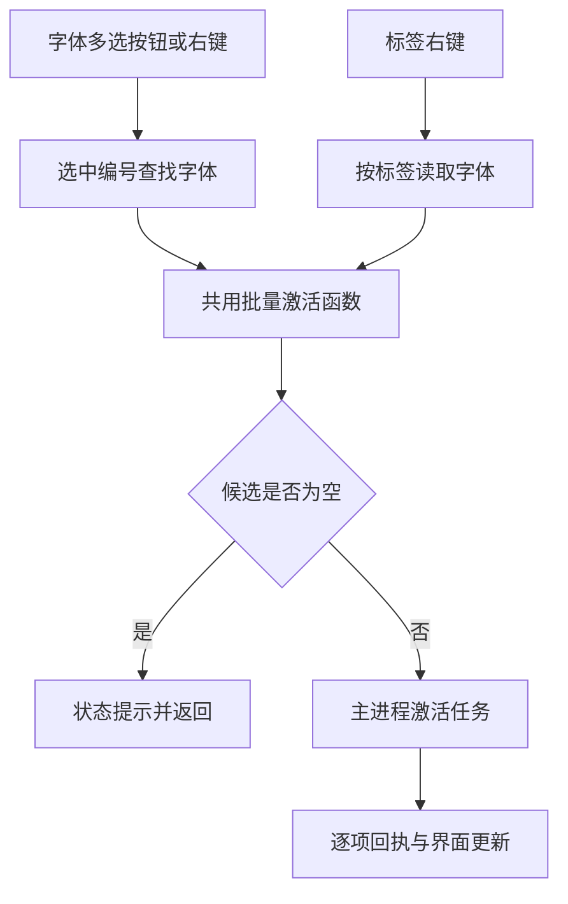

# HFM 操作一致性与刷新优化任务书

## 1. 状态与范围

- 制定日期：2026-09-18。
- 仓库：`uniquenesssta/99`；分支：`stage/09-preview-tags-app`。
- 代码基线：`3bc1e387ebeb5298d5bd4060aaec5c9a0a2c7d93`。
- 状态：**任务规划完成，U-00～U-09 均未实施、未验收。** 本次只提交本文及 README 入口和变更记录。
- 输入：`startup-2026-09-18_02-59-25-870-21044.log`（813 行，UTC 02:59:25.872～03:01:28.978）及用户随后五点反馈、入口差异补充。原始日志不提交到 Git。
- 与前任务衔接：[链路一致性任务书](HFM_CHAIN_CONSISTENCY_REPAIR_TASKBOOK.md) §25 已交付本地收藏、标签目录同步与停用核对。本任务保留这些修复，处理后续真实交互问题和性能问题，不重开 R-01～R-07。
- 既有基线证据：上一提交通过 TypeScript、115/115 诊断、Electron/Vite 367/1/196 模块构建和混淆 3/3。这是历史自动验证结果，**不能替代本任务的字体多选入口和 Windows 实机验收**。

## 2. 已知事实、待证假设与证据缺口

| 编号 | 用户反馈或日志观察 | 当前结论 | 后续任务 |
| --- | --- | --- | --- |
| F-01 | 多选字体文件后批量激活完全无反应；标签右键批量激活有反应 | 用户确认的入口故障。代码已有按钮绑定，两个入口最终调用同一批量函数；具体断点未复现，不能认定“没写代码” | U-00、U-01 |
| F-02 | 其他页面没有未安装筛选 | 已确认：公共列表工具栏未提供安装状态入口，底层有相关筛选状态与查询能力 | U-04 |
| F-03 | 多选没有收藏及取消收藏 | 已确认：多选操作栏和右键菜单缺少对应操作；现有收藏动作是单项切换 | U-03 |
| F-04 | 单选、多选被拆成不同操作入口，按钮冗余 | 已确认：列表操作栏、单项右键、多项右键分别维护操作，能力不一致 | U-02 |
| F-05 | 修改一个字体或标签，是否必须刷新整个库 | 不必。日志显示共享标签单项写入仍进行 1499 行快照同步；其他类型修改应分别测量，不能一概取消刷新 | U-05 |
| L-01 | 单个停用 536/532/511ms，批量停用 873ms | 已确认耗时；单次系统安装读取约 478～499ms。此前加入新鲜系统核对保证正确性，不能直接删掉 | U-06 |
| L-02 | 37 次单独记录的 React 慢更新为 37～56ms；长任务最高 101ms | 已确认这些样本；不等于全部 render 都慢，也尚未定位到具体组件 | U-08 |
| L-03 | 一次统计请求端到端 423ms，返回的 worker 计算约 34ms | 等待、失效重读或调度开销需要拆分；不能把全部时间算作 SQL 时间 | U-05、U-08 |
| L-04 | events/hash 缺文件，启动维护 ok=false | 失败已确认；需核实是首次创建顺序/惰性数据库误报，还是应初始化而未初始化 | U-07 |
| L-05 | 预览 25 次生成耗时 9～63ms，汇总 localHit/sharedHit 都为 0 | 本次新建索引、冷缓存，尚不能判定缓存损坏；要比较相同键的重复访问 | U-08 |

证据解释边界：

1. 本次扫描得到 1499 项、解析错误 0；安装状态补齐后为已安装 295、未安装 1204。扫描期间未知状态不能当作未安装。
2. 收藏与取消收藏各 4 次，接口成功且注明仅本机，写入 0～1ms；本日志未覆盖重启和第二台机器。
3. 本地标签“1-2”“11”和共享标签“32”删除后，相应查询为 0；最后一个共享标签的目录也为 0。
4. 日志确有一次 3 项批量激活成功，但没有证据证明来自字体多选入口。用户补充后必须分别记录入口，不能用标签入口的成功给字体多选入口验收。
5. 停用后标签查询仍为 3，查询条件是 `page=tags, activeFilter=all`，不应据此判定停用失败；日志未给出最终侧栏 activeCount 和独立已激活页面结果。
6. `db-metrics-rejected: user-intent-changed` 是旧结果保护；`decision=duplicate` 是提交去重，不直接当错误。打开文件夹对话框耗时 5241ms 包含用户选择时间，不当作程序卡顿。
7. 本次没有崩溃记录。单次约两分钟运行不足以证明无内存泄漏、长期缓存稳定或 NAS 多机一致。

## 3. 用户交互契约

### 3.1 一套动作，按明确目标集合执行

- 字体列表的操作栏、字体右键、详情及卡片中属于同一字体操作的入口，使用同一套动作语义和目标解析规则；后端仍可保留单个/批量优化实现。
- 单选作用于 1 项，多选作用于当前选中集合。按钮使用“激活”“取消激活”“收藏”“取消收藏”“卸载字体”“删除字体文件”“设置本地标签”“设置共享标签”“加入保护”“取消保护”等名称，不另设一套带“批量”前缀的重复菜单。
- “已选择 N 项”明确展示作用范围；无有效目标时禁用或说明原因。点击前解析目标并形成该次请求的稳定快照，执行中改变选择不能把请求转移到另一批字体。
- 右键选中集合内字体时保留集合；右键未选中字体时按既有行为切换为该字体，并明确呈现新范围。详情显示单个字体不能暗中改变多选命令的目标。
- 标签节点入口继续表示该标签下的字体，并明确标签名称和数量；文件夹/标签节点的重命名、删除是容器操作，不能套用字体多选语义而误删源文件。
- “卸载字体”与“删除字体文件”保持不同动作。沿用确认与保护规则，确认中列出数量和范围。
- 混合状态采用明确设置：收藏令目标变为 true，取消收藏变为 false；激活跳过已激活/不适用项，取消激活保留永久安装；保护同理。不得对混合集合逐项 toggle。
- 标签混合编辑只应用用户明确添加/移除的标签，不用一项字体的整套标签覆盖所有目标的原有标签。保留本地/共享存储域边界。
- 正在执行、成功、部分失败、无可执行项，都应在普通界面可见；开发者状态日志只提供详情，不能成为唯一反馈入口。避免每项一个弹窗。

### 3.2 公共安装状态筛选

- 字体库（含收藏）、文件夹、本地标签、共享标签等实际展示字体列表的页面提供“全部／已安装／未安装”。开发者、维护等非字体列表页面不强行加入。
- 当前页面范围、搜索、标签、文件夹和安装状态取交集，不跳回整个字体库。保持项目现有“永久安装”与“临时激活”的区别，不改成互相冒充。
- 未知安装状态保持未知，可显示同步提示；不得混入已知未安装结果。互相冲突的筛选明确为空或给出一致解释，不能悄悄忽略条件。
- 复用既有 PageToolbarState 和查询键；按原页面状态保存约定恢复，不新增第二份筛选状态。

### 3.3 局部修改与刷新边界

| 操作 | 必要更新 | 正常情况下不应发生 |
| --- | --- | --- |
| 单项/多项收藏 | 本机事务、对应卡片、收藏数；当前收藏筛选/智能排序必要重查 | NAS 收藏写入、全根扫描、无关预览重置 |
| 本地标签增删 | 受影响绑定、本地目录和相关计数；相关列表必要重查 | 全库重新扫描、覆盖共享字段 |
| 共享标签增删 | 共享权威提交、受影响字体的合并索引增量、完整目录确认与通知 | 已知只改 1 项仍无条件同步 1499 行 |
| 激活/停用 | 系统资源与原状态队列、对应字体、相关筛选和计数 | 每项重复整库同步、用旧 active 值冒充系统事实 |
| 修改预览文字（若用户所指是预览文本） | 按新文字使对应预览键失效，重算可见/必要预取预览 | 字体扫描或元数据整库重建 |

“当前页重查”“计数校准”“目录回读”“整根快照同步”“字体重新扫描”须分别计数，不混称“刷新库”。若本次修改影响筛选或排序，允许必要查询；删除当前页项目后应合理补页。保留有效选择和滚动锚点，不保留已真实删除的字体。

## 4. 当前代码链路与责任边界

以下是现有实现，非已实施的优化：

- 入口：`src/renderer/src/components/app/FontListPanel.tsx`、`src/renderer/src/components/app/AppOverlays.tsx`。
- 字体右键目标：`src/renderer/src/fontContextActionRuntime.ts`、`src/renderer/src/fontContextMenuRuntime.ts`。
- 标签目标：`src/renderer/src/fontDialogContextActionsRuntime.ts` → `src/renderer/src/runtime/system/actions/fontSystemStateRuntime.ts`。
- 多选/水合：`src/renderer/src/fontSelectionEventRuntime.ts`、`src/renderer/src/fontSelectionRuntime.ts`、`src/renderer/src/runtime/app/fontSelectionHydrationRuntime.ts`、`src/renderer/src/runtime/app/useFontDetailSelectionEffectsRuntime.ts`。
- 共用动作：`src/renderer/src/runtime/system/actions/fontActivationActionRuntime.ts`。调用前会排除已安装、已激活、系统字体和处理中项目；目标为空会提前返回。
- 已见风险：多选入口从 library.fonts 查找后直接丢弃未命中项；选择集合随该数据集变化裁剪。标签入口同样读取 library.fonts，只是选取规则不同；不能因此断言标签入口使用了另一份完整数据库。
- 既有本机收藏 owner：`src/main/library/runtime/localFontFavoritesRuntime.ts`；写队列继续复用 `src/renderer/src/fontWriteQueue.ts` 与 `src/renderer/src/fontWriteQueueRuntime.ts`。
- 共享同步 owner：`src/main/library/sharedFontMetadataMutations.ts`、`src/main/library/sharedMetadataMergedIndexSyncRuntime.ts`；目录与提交通知继续由既有 owner 管理。

## 5. 执行纪律与不可破坏项

1. 每项开始前记录实际 HEAD、工作树和精确文件白名单。下节路径是调查/修改候选，不代表全部都应改；新增关联文件先记录证据与职责。禁止借机重构整个 App 或迁移所有协议。
2. 先建立原故障复现，再修改完整受影响路径。入口测试必须从真实组件事件开始，不能只调用后端批量函数；冻结源码摘要不是行为验收。
3. 收藏保持本地唯一权威；一次性迁移、false 决策、重启与身份别名规则保持。本地标签、共享标签、收藏、删除保护互不覆盖。
4. 保留最后标签删除、空标签目录、跨根目录、部分失败、R-05 意图保护、R-06 去重，以及旧分页/ID/统计 generation 拒绝机制。
5. 保留激活事务回滚、原待保存状态覆盖、退出 flush、永久安装识别与只清理本应用拥有的临时资源。不能为速度取消真实性核对或先报成功再悄悄失败。
6. 不新增平行字体库/选择状态/收藏状态 owner。必要的在途请求快照有明确生命周期，完成即释放；不引入无界 Map 或轮询。
7. 共享增量同步使用提交后的权威字段/记录，不能把渲染器旧对象整行覆盖其他机器的新数据。回读失败、索引失败和写入已提交分别报告。
8. 保持原 IPC、两套 preload、数据格式和依赖兼容；确需调整先说明迁移与回滚。测试故障只作用于临时库或专用测试根。
9. 每项形成可审查的提交并更新 README 和本任务书；旧夹具只按已证实行为差异定向迁移，不批量重录来消除失败。
10. Context7 用于实际遇到的新 API/版本疑问；Mermaid 只记录真实代码关系；Create State 不替代 Git 和任务书，也不绑定其他项目。

## 6. 实施顺序与任务卡

优先顺序：U-00 → U-01 → U-02 → U-03 → U-04 → U-05 → U-06 → U-07 → U-08 → U-09。先解决操作可达性和正确性，再优化成本。所有状态当前均为“待开始”。

### U-00：建立入口证据和复现基线

**目的：** 把“字体多选完全无反应”定位到具体阶段。

步骤：

1. 用同一组可临时激活字体，分别覆盖操作栏、字体右键、标签右键；记录列表/卡片视图、Ctrl/Shift/框选、所在页面及是否跨页。
2. 复用现有 operation trace，关联入口、选中数、解析数、缺失数、过滤原因、请求目标、逐项回执和界面结果。若入口尚未发 IPC，也应留下可见的失败/跳过原因。禁止记录整套字体对象或大量路径。
3. 核对点击前后选择是否变化、分页对象是否已水合、菜单关闭时机、旧闭包、候选过滤、处理中标记；分别验证，不预设原因。
4. 以真实组件事件复现；Windows 问题暂不可复现时标为“根因待证”，提供最小诊断步骤，不能将假设写成已修复。

候选：上述 §4 入口/选择模块，`src/renderer/src/components/app/AppRootView.tsx`、`src/renderer/src/App.tsx`、`src/renderer/src/fontOperationTrace.ts`。

验收：能明确指出失败请求在哪一步停止，或明确缺少哪段证据；标签成功不能替代多选成功。区分 0 目标、全部跳过、部分失败和真实任务成功。

### U-01：修复字体选择到命令目标的完整链路

依赖 U-00。

步骤：

1. 按复现证据修复选择、分页数据与目标解析。复用现有水合/身份能力；缺记录须补取或明确报缺失，不静默少执行。
2. 单选、多选、右键、标签入口向原动作传递完整且去重的目标快照；不得只取第一项。
3. 列表刷新不因缓存暂未加载而误判字体被删除；真实删除、切换范围和取消选择仍有明确清理规则。
4. 每项结果独立处理；过滤原因和部分失败普通界面可见，失败回滚只影响该请求及该字体。

候选：§4 选择/动作模块、`src/renderer/src/runtime/app/useSelectionController.ts`、`src/renderer/src/runtime/app/useAppFontDerivedRuntime.ts`、`src/renderer/src/runtime/app/useFontOperationsController.ts`。

验收：选中 N 项等于解析 N 项或有明确缺失清单；请求只包含本次符合条件的所选项。1/2/3/跨页多项、不同页面和选择方式均验证。必须覆盖真实按钮点击→动作→IPC→逐项结果→界面，不能只测数组函数。

### U-02：统一单选和多选操作入口及反馈

依赖 U-01。

步骤：

1. 建立动作能力对照表，按 §3.1 统一入口。现有函数职责能承载则复用；确需新的目标解析职责才单独建模块，避免把规则塞进 JSX。
2. 移除重复的“批量……”菜单结构，按目标数量自动执行。统一安装、卸载、删除、激活、停用、保护、标签及收藏入口的目标规则。
3. 保留标签/文件夹容器动作的范围区别。混合保护/安装状态明确跳过；全跳过也有反馈。
4. 普通界面提供非阻塞的过程和结果反馈，含成功/跳过/失败数；继承原危险操作确认。键盘操作与鼠标操作一致。

候选：`src/renderer/src/components/app/FontListPanel.tsx`、`src/renderer/src/components/app/FontListPanelTypes.ts`、`src/renderer/src/components/app/AppOverlays.tsx`、`src/renderer/src/components/app/FontDetailPanel.tsx`、`src/renderer/src/components/app/AppRootView.tsx`、`src/renderer/src/fontContextActionRuntime.ts`、`src/renderer/src/runtime/system/actions/fontInstallActionRuntime.ts`、`src/renderer/src/runtime/system/actions/fontDeleteActionRuntime.ts`、App 组合接线。

验收：同一动作不出现单项/批量两套重复入口；多选时安装/卸载等不会退化为只处理第一项；菜单作用数量与实际目标一致；删除和卸载依然有不同语义和确认。

### U-03：补齐多选收藏与取消收藏

依赖 U-01、U-02。

步骤：

1. 提供目标集合的明确 true/false 设置，混合收藏状态不逐项反转；未变化项幂等跳过。
2. 复用原意图、队列和本机事务，合并一组操作的界面更新与计数变化，避免每项一次完整刷新。
3. 失败仅恢复仍属于该请求的意图，较新反向操作不被旧回执覆盖；取消后重启不复活。
4. 当前收藏筛选里取消收藏会正确移除目标并补页，保留其他有效选择与滚动位置。

候选：`src/renderer/src/runtime/system/actions/fontFavoriteActionRuntime.ts`、`src/renderer/src/runtime/system/actions/fontSystemActionTypes.ts`、`src/renderer/src/fontUserIntentRuntime.ts`、两项写队列模块、`src/main/library/runtime/localFontFavoritesRuntime.ts`、U-02 入口及必要接线。

验收：全未收藏、全已收藏、混合状态、多次反向操作、磁盘失败、重启、A/B 机器隔离；本地/共享标签与保护字段保持。不得向共享元数据写收藏，不以循环 toggle 实现批量设置。

### U-04：补齐跨页面安装状态筛选

依赖 U-02；与 U-03 的组合需回归。

步骤：

1. 复用 `INSTALL_STATUS_OPTIONS`、PageToolbarState 和既有过滤器，在公共字体列表工具栏增加入口。
2. 将选项贯通组件参数、请求、SQL/内存回退、查询键、分页及总数；不只修改 UI。
3. 验证页面内范围交集、未知状态、切换后旧请求回流、页面状态恢复和空结果。

候选：`src/renderer/src/components/app/FontListToolbarControls.tsx`、`src/renderer/src/components/app/FontListPanel.tsx`、`src/renderer/src/components/app/FontListPanelTypes.ts`、`src/renderer/src/constants/filterConstants.ts`、`src/renderer/src/constants/toolbarStateRuntime.ts`、`src/renderer/src/fontToolbarFilterRuntime.ts`、`src/renderer/src/runtime/app/useBrowseDerivedRuntime.ts`、`src/main/indexing/root-query/mergedIndexPageQuerySql.ts`、必要 App 接线。

验收：字体库/收藏/文件夹/本地标签/共享标签逐页覆盖三个状态；SQL 与内存路径结果一致，数量与列表一致，筛选不扩大范围；临时激活不擅自改变永久安装定义。

### U-05：将单项修改收敛到必要的增量更新

依赖 U-01～U-04 正确性闭环。

步骤：

1. 分别测量收藏、本地标签、共享标签、保护、激活操作造成的写行数、通知数、索引同步行数、分页与统计请求、预览失效次数。
2. 共享标签以提交后的 changedIds/权威字段定位受影响记录，利用已有增量 owner 更新；标签目录删除/重命名须覆盖该标签所有实际绑定，不能机械限制为 1 行。
3. 完整目录确认继续保留，含空数组和跨根；区分目录回读与字体全量加载。字段合并不覆盖并发收藏、本地标签或保护。
4. 渲染器按受影响字段更新卡片；只有影响当前筛选/排序/计数的部分重查。既有在途合并与 generation 拒绝保留，不以取消保护门换取快响应。
5. 未知变化集合、根变化、缺失/不兼容快照或增量失败时，才允许有原因日志的保守回退；已提交写入不能因同步失败被重复写入。

候选：`src/main/library/sharedFontMetadataMutations.ts`、`src/main/library/sharedMetadataMergedIndexSyncRuntime.ts`、`src/main/library/sharedKnownTagsRuntime.ts`、`src/main/library/tagMutationWriteProtocolRuntime.ts`、`src/main/library/tagMutationStateSignalRuntime.ts`、`src/main/library/fontPageQueryCacheRuntime.ts`、`src/main/library/fontMetricsRequestCoalescerRuntime.ts`、`src/main/library/fontQueryFacadeRuntime.ts`、`src/renderer/src/databaseDerivedStateRuntime.ts`、`src/renderer/src/sharedMetadataSyncRuntime.ts`、相关提交信号监听与写队列。

验收：稳定索引中明确只改 1 个字体的共享标签，正常路径不再全根同步 1499 行；N 项操作与实际受影响项成比例。无关预览键/其他字段不变。最后一个标签、空目录、多根、部分失败、外部更新和迟到查询都不回退。

### U-06：降低停用的前台等待，保留系统真实性

依赖 U-01、U-05。

步骤：

1. 分拆资源移除、注册表删除、文件后台清理、系统枚举、状态比较、保存与 UI 确认时间。
2. 在同一次批量操作内共用合适的新鲜系统快照；检查连续操作可否安全合并读取。任何跨操作复用必须定义“读取开始时刻与变更序号”的有效性，拒绝发生在删除之前的结果。
3. 可从确认移除结果更新临时状态的部分与必须重新核对永久安装的部分分别处理；没有足够证据时仍核对，不用缓存假设成功。
4. 系统读取失败、外部安装变化、永久与临时并存、缺临时记录、资源移除失败均保留真实结果及可见反馈。

候选：`src/main/activation/runtime/fontActivationInstallStatusRuntime.ts`、`src/main/activation/runtime/fontActivationSessionRuntime.ts`、`src/main/activation/runtime/fontDeactivationBatchRuntime.ts`、`src/main/activation/runtime/fontDeactivationSettlementRuntime.ts`、`src/main/activation/runtime/fontActivationCleanupRuntime.ts`；系统枚举 owner 仅在确认必要后补白名单。

验收：比较同机、同字体、同流程前后多次耗时和枚举次数；不得让 N 项停用变成 N 次完整枚举。本次 0.5s/0.873s 是观察值，不是无条件承诺的性能目标。无法安全提速的步骤保留并记录原因；已激活页、侧栏数、系统资源与重启结果一致。

### U-07：修复首次启动数据库维护的误判或初始化缺口

步骤：

1. 查明 events/hash 数据库职责、创建时机与必需性；分别复现全新数据目录和已有数据目录。
2. 必需库应由既有 owner 按顺序初始化；合法惰性库允许未创建。只忽略确认为预期不存在的情况。
3. 权限拒绝、损坏、锁冲突、真实 I/O 错误仍报告，不能把所有错误改成成功；不为消除告警创建空库覆盖历史数据。

候选：`src/main/maintenance/applicationDatabaseMaintenanceRuntime.ts`、`src/main/maintenance/databaseMaintenance.ts`、`src/main/maintenance/databaseMaintenanceHelpers.ts`、既有启动接线（按定位补白名单）。

验收：新安装正常维护，不因合法未创建而 ok=false；已有库、损坏、只读、锁冲突场景报告正确，备份/修复行为不退化。

### U-08：验证并优化界面、统计等待与预览复用

步骤：

1. 在实际 React 环境记录 commit、长任务、请求发起到绘制、统计排队与重读；区分开发模式开销、必要更新与重复计算。
2. 对真实热点减少无关对象重建、重复全表派生和无关卡片更新；有证据才改，不给所有组件机械添加 memo。
3. 预览按同一字体、文字、尺寸等完整键测试冷访问、重复进入、切页返回、激活/停用与重启；分别观察内存、本地、共享层。不能要求新文字命中旧缓存。
4. 验证之前预览 runtime 生命周期修复仍成立：在途合并、卸载/重置拒绝旧结果、失败可重试；若重复访问正常，将冷缓存 0 命中记录为正常观察，不制造修复。
5. 统计慢请求必须拆出调度、IPC、SQL、失效重读及渲染耗时，再处理已确认的放大点。

候选：`src/renderer/src/runtime/app/useAppFontDerivedRuntime.ts`、`src/renderer/src/runtime/app/useBrowseDerivedRuntime.ts`、`src/renderer/src/runtime/app/usePreviewController.ts`、`src/renderer/src/runtime/preview/fontPreviewQueueRuntime.ts`、相关 queue owner、`src/main/library/fontMetricsRuntime.ts`、`src/main/library/fontMetricsRequestCoalescerRuntime.ts`；按实际热点缩小白名单。

验收：相同机器/字体集/操作序列对比中位数与 P95，并报告样本数、缓存冷热和运行模式；不跨条件比较。单项修改不会重复生成无关预览。无证据的问题可结案为观察项，但须附复测结果。

### U-09：综合回归、发布与 Windows 回执

依赖全部前置项有明确结果。

1. 执行下节矩阵；全量 `npm run verify`，构建可用的三端代码。变更涉及 Rust 时必须执行对应原生测试/重建，不能把源码门当原生通过。
2. 验证当前待提交 tree，与运行验证的内容一致；README 记录结果和实际限制，不把自动门通过写成实机通过。
3. 提交并推送现有阶段分支，非强制更新；回执区记录最终 SHA、测试命令、结果和未完成项。
4. Windows 仍使用开发方式，拉取后 `npm run dev`。用实际字体多选和标签入口分别验收，必要时验证 Photoshop 等目标软件读取到字体。
5. 自动验证和 Windows 验收状态分开。未完成的明确失败项不能标为整体完成；回滚按本任务相关提交逆序执行，不删除字体库或用户数据库。

## 7. 必须覆盖的验收矩阵

| 场景 | 必须检查的结果 |
| --- | --- |
| 字体多选与标签入口 | 两种入口分别成功；操作栏/右键真实点击到 IPC，不漏项、不只处理第一项 |
| 选择方式与分页 | Ctrl、Shift、框选；卡片/列表；刷新与跨页按已定义范围保留，缺对象不静默丢弃 |
| 混合状态 | 已安装、已激活、未安装、系统字体、保护、忙碌；成功/跳过/失败逐项可解释 |
| 操作执行中改变选择 | 已发请求目标固定，新选择不被旧结果误改，旧失败不覆盖新意图 |
| 批量收藏 | true/false 明确设置、幂等、混合值、快速反向、失败回滚、重启与 A/B 隔离 |
| 各页面筛选 | 库/收藏/文件夹/本地标签/共享标签 × 全部/已安装/未安装，列表和总数一致 |
| 单项字段修改 | 其他三个用户字段保持；无无条件全根同步；相关筛选必要刷新不丢 |
| 标签目录 | 最后删除、零绑定空目录、重命名、部分失败、多根离线和恢复、外部提交 |
| 激活与停用 | 单项、多项、缺记录、永久与临时并存、系统读取失败、退出重开 |
| 预览 | 冷/热同键、新文字、切页返回、激活后返回、失败重试、重启本地复用 |
| 数据库维护 | 新目录、合法缺库、已有库、权限拒绝、损坏、锁冲突，结果区分正确 |
| 关闭与保存 | 操作后立即正常关闭再打开，队列 flush，收藏/标签保持，临时资源按既有退出策略清理 |

验证资产优先扩展已有 `build/diagnostics/check-app-interaction-composition.cjs`、`check-local-user-state.cjs`、`check-font-activation-transaction.cjs`、`check-query-cache-invalidation-generation.cjs`、`check-tag-consistency.cjs`、`check-database-maintenance-serialization.cjs`、`check-react-render-performance.cjs` 和预览相关诊断。真实组件事件能力不足时再新增专用入口验证器；仅 spy 一个动作函数不能证明点击目标正确。新增冻结项须有旧行为反例和业务断言，避免测试只照抄实现。

## 8. 执行记录模板与交付标准

每项完成时填入：

| 字段 | 内容 |
| --- | --- |
| 任务编号/状态 | 待开始、定位中、实施中、自动通过待实机、完成、阻塞 |
| 起点与最终提交 | 真实 commit SHA，不用前一阶段结果替代 |
| 复现 | 页面、入口、选择方式、目标数、缓存条件、实际/期望结果 |
| 根因证据 | 真实断点与相关日志/测试；没有证据时保持待证 |
| 精确改动范围 | 路径、职责与同根影响链；必要接口/迁移说明 |
| 自动验证 | 命令、结果、原代码反例、失败边界、回归范围 |
| Windows/NAS 回执 | 界面、系统结果和持久化分别记录；未测写未测 |
| 性能对照 | 同条件样本数、中位数/P95、写行/查询/枚举/渲染次数 |
| 回滚与未完成项 | 对应提交和数据兼容边界、下一步 |

任务交付需同时满足：用户五项需求有逐项证据；原三项修复不退化；日志中的明确维护问题有处理结果；性能疑点有测量结论；普通界面可理解失败和跳过；README、任务状态与实际提交一致。

## 9. 本次文档交付记录

- 已核对基线工作树、入口/选择/动作/筛选/同步/维护相关现有代码及上述日志与用户补充。
- 本次只新增本任务书、更新 README 的任务入口和变更记录，未修改生产代码或测试。
- 本次文档验证：文件路径与链接检查、任务覆盖检查、`git diff --check`；未重跑生产代码测试，不新增“115/115”通过声明。
- Mermaid Chart 已绘制现有两种激活入口的真实调用关系。当前不涉及新第三方 API，无需 Context7 查询。
- 后续从 U-00 开始；不得先把猜测的多选根因当结论，也不得仅删“批量”文字而保留分裂的执行逻辑。
