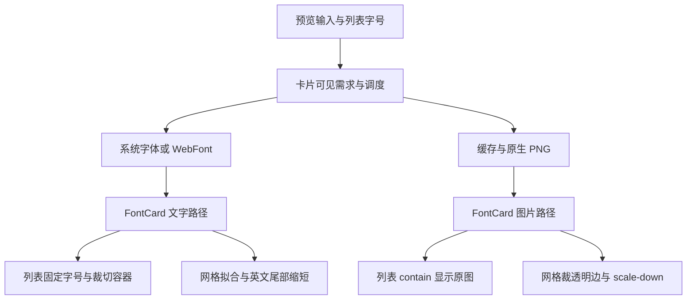
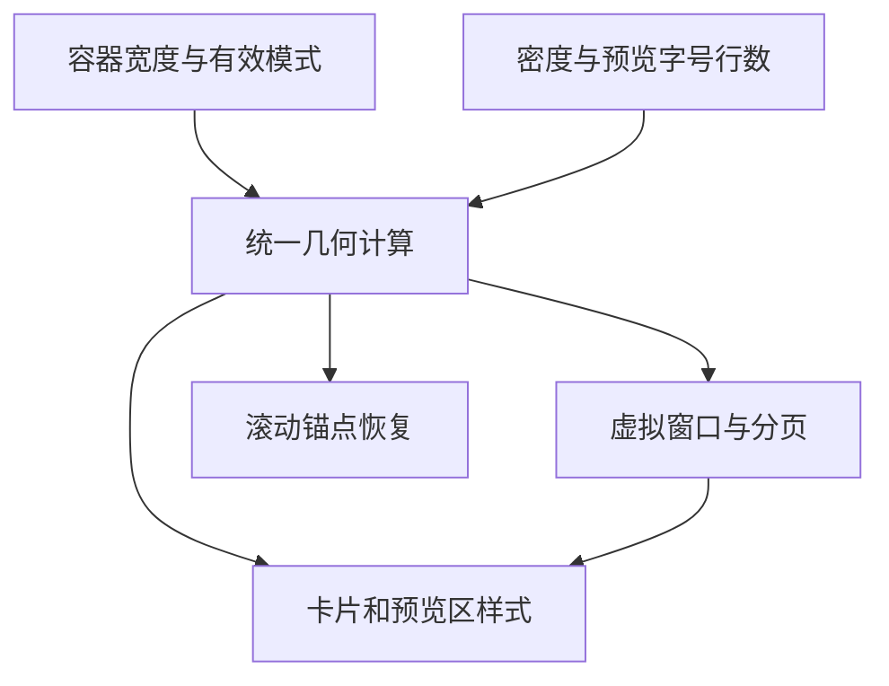

# HFM 列表与网格视图审计及优化任务书

## 0. 执行入口与授权

- 建立日期：2026-09-27（Asia/Shanghai）。审计基线：`85825261b5aa6319cb9d98e188368c55862e88b3`；仓库 `uniquenesssta/99`，工作区初始干净，远端与本地一致。
- 用户本次要求：审计列表视图、网格视图，给出优化任务书，将原 docs 旧任务放入 `docs/old task`。
- V00 审计、计划和旧任务归档已于 `6012cb6` 完成。用户随后授权开始 V01，并明确要求新专项使用新分支、不得改动 Stage 10。自 V01 起使用 **`stage/11-list-grid-view`**，分支基线为 `6012cb6c18fc52c9db181a2251dd54a235ac6e81`；Stage 10 本地/远端引用保持在该基线，不向其提交或推送。
- 新专项实施编号调整为 **S11-V01～S11-V07**（简称 V01～V07），与初版同序号 S10-V01～V07 一一对应；S10-V00 保留为已完成的历史审计编号。
- S10-06 工程核查既有结论保留，参见[旧 Stage 10 §19.1](../old%20task/HFM_STAGE_10_PREVIEW_PERFORMANCE_TASKBOOK.md#191-用户取消专项人工验收并推进-s10-062026-09-27)。本专项不是重开 05.5，也不把历史未验收事项自动判定完成。
- 当前 **S11-V01 已获用户授权，实施与验证进行中**。授权单项只执行该项；授权整个专项后按依赖推进，不逐项索要重复许可。
- 本次没有用户指定或任务书引用的 Figma 文件/节点，未据此虚构设计基准；沿现有应用风格提出下述方案。如后续明确指定 Figma，再核对相关节点。
- 项目文档总入口：[docs/README.md](../README.md)；原总任务书及 15 份旧专项/阶段任务全部归档，旧任务状态与回执保留。

## 1. 目标、边界与不变项

目标：列表适合逐行比较，网格适合快速浏览；两种模式展示同一份样本文字，文字与 PNG 的字号、换行和溢出含义一致；虚拟滚动定位正确；消除没有显示收益的裁图和重复请求。

范围包括字体卡片展示、行/卡片几何、可见范围与滚动锚点、原生预览请求的布局契约及其直接受影响的缓存/代次。共享组件的家族视图和详情视图只做受影响路径回归，不借此改版。

必须保留：

1. 前台实际并发上限 10；滚动期间暂停新预览和旧结果提交；连续停滚 150ms 后服务全部当前可见项；不可取消工作按真实完成释放槽位。不恢复 18 项预取。
2. 05.5 共享范围准入、可选缓存让路、只读查询能力门、文件/锁所有权、根离线和恢复、退出/取消退出边界。
3. 单选/多选、100ms 防连击、选择取消、详情联动、右键和拖拽含义；本地收藏、不共享收藏、激活和停用的既有规则。不增加重复操作按钮。
4. 不扫描整库来计算字形边界，不因调整显示重建索引，不清空用户数据库/缓存，不改变标签、文件夹或字体文件。
5. 默认不新增生产依赖，不引入常驻 DirectWrite 试验，不把 GDI 实现因日志含 directwrite 就当成 DirectWrite 后端。
6. 用户已取消的固定 24 卡片、冷热各至少 5 次及专项人工操作序列，不作为本专项关闭门或欠账重新引入。保留与实际改动相关的自动化和必要真实显示核实，次数不设硬指标，未测量不得宣称量化提速。

## 2. 已核实的当前链路

图为现状，不表示优化已实现。布局另一条链为 `useAppFontShellDerivedRuntime → useAppFontDerivedRuntime/buildVirtualLayout → FontListPanel → CSS`，滚动锚点复用 `fontScrollRuntime`。入口 `App.tsx` 将 `cardPoolViewLayout` 同时交给虚拟计算和列表展示。

关键源码（路径均相对仓库根，定位以函数名为准）：

| 职责 | 文件/符号 |
| --- | --- |
| 卡片、列表/网格接线 | `src/renderer/src/components/FontCard.tsx`、`components/app/FontCardRenderer.tsx`、`components/app/FontListPanel.tsx` |
| 几何与虚拟定位 | `src/renderer/src/runtime/app/useAppFontShellDerivedRuntime.ts`、`useAppFontDerivedRuntime.ts`、`src/renderer/src/fontViewRuntime.ts:buildVirtualLayout`、`fontScrollRuntime.ts`、`constants/layoutConstants.ts` |
| 文字契约 | `src/shared/preview-layout/previewLayoutConfig.ts`、`previewTextFitRuntime.ts` |
| renderer 请求/代次 | `runtime/preview/queue/fontPreviewLoadRuntime.ts:currentCardPreviewLayout`、`runtime/app/usePreviewController.ts`、`runtime/app/effects/usePreviewTextResetRuntime.ts`（均在 renderer/src 下） |
| 显示尺寸与拟合 | `runtime/preview/listPreviewSizeRuntime.ts`、`gridPreviewVisualFitRuntime.ts`、`gridNativePreviewImageTrimRuntime.ts`、`fontPreviewCssFamilyRuntime.ts` |
| 样式装载和覆盖 | `src/renderer/src/styles.css`；`styles/05-virtual-list.css`、`styles/13-studio-interface.css`、`styles/14-simple-wide-font-list.css` 及它们导入的文件 |
| 原生实现与后备 | `native-src/hfm-core-worker/src/preview_render/windows.rs`、`native-src/preview-renderer/hfm-preview-renderer.cpp`、`src/main/preview/runtime/nativePreviewScriptRuntime.ts`、`src/main/preview/native-renderer/previewNativeRendererRuntime.ts` |
| 缓存身份 | `src/main/preview/runtime/previewCacheKeyRuntime.ts`、`previewRequestSchedulerRuntime.ts`、`cachedPreviewReadCoalescerRuntime.ts`、`cachedPreviewImageDataUriCacheRuntime.ts` |

## 3. 审计发现与证据边界

P1 表示显示内容/定位正确性或明确浪费，P2 表示体验及验证可靠性。本轮没有确认新增安全/数据破坏型 P0。

| ID / 优先级 | 已核实事实、影响 | 处理任务 |
| --- | --- | --- |
| V-01 / P1 | `buildVirtualLayout` 把 rowHeight 作为相邻行步长；列表 CSS 又把同值用作卡片高度，外层另有 12px gap（窄窗规则为 10px）。DOM 步长与虚拟切片/总高度不一致，存在换页偏移、底部定位和框选坐标偏差风险。网格 comfortable 的 328px 卡片 + 14px gap = 342px 与常量一致，不应错误地给网格重复加 gap。 | V01 |
| V-02 / P1 | 列表高度分档根据 scroller 的 `virtualViewport.width`（720/1180），CSS 堆叠根据窗口 media（720/980/1080/1280）；侧栏/详情占宽时两者并非同一宽度。窄窗旧 studio 样式 `grid-template-rows` 仍可能参与简单列表，必须按最终 cascade 核实；不能只修改末尾固定高度。 | V01 |
| V-03 / P1 | DOM `previewTextLines(text,2)` 会 trim 每行、删除空行并只取前两行；原生请求 `normalizePreviewText` 仍携带三行及中间空行。原生画布高度却仍按最多两行计算。受控函数执行确认第三行只在原生请求存在，显示内容不一致。 | V02、V03 |
| V-04 / P1 | 列表 CSS 最终为 nowrap；Rust/C++ 仅在全文无换行时设置 NoWrap，有显式换行时不设置。PowerShell 使用 LineLimit/EllipsisCharacter，语义也不同。长多行 PNG 具有额外折行/截断风险。截图里的三行不能直接归因于 DOM 自动折行，更不能断言已还原用户当时后端。 | V02、V03 |
| V-05 / P1 | 原生卡片请求固定用 list 模式、760px 宽与列表字号（默认 44），网格文字用 26～42px，且 grid 配置 maxLines=1、卡片实际最多显示两行。列表 PNG contain、网格 PNG trim+scale-down，字号并不等于最终显示尺度；隐藏的列表字号也会影响网格 PNG。 | V02、V03、V04 |
| V-06 / P1 | `buildGridPreviewVisualFitCandidates` 遇到中英混合尾部会生成 `安盛aaaa → 安盛aaa → 安盛aa → 安盛a → 安盛`。溢出后网格文字会删内容，PNG 不走这套删字逻辑。候选与 effect 未按字体加载、容器宽度变化完整重测，可能保留过时缩短结果；后者实机影响未量化。 | V02、V04 |
| V-07 / P1 | `FontCard` 在 `compact` 列表返回前无条件调用 grid trim Hook，判定只看 image/family、不看 compact。因此列表图片也进入完整解码、getImageData 像素遍历和 toDataURL，列表 img 最终仍用原图。缓存上限是 240 项而非字节；卸载只阻止 setState，不停止已开始转换。明确有无效工作，耗时/内存收益待测。 | V05 |
| V-08 / P2 | 列表和网格均居中；列表超长行的 max-content 在 contain/overflow 容器裁切，没有完整文本的横向查看机制。不同字体起点不一致，不利于比较。改左对齐/溢出提示属于本任务书的拟议体验方案，未实施。 | V03、V04 |
| V-09 / P2 | 当前 grid size / clip-safe / visual-fit 三项诊断合计 20 个断言通过，但大多为源码字符串和夹具检查；其中“only in grid”未检查 compact，无法发现 V-07。不能把通过等同于没有裁字、尺寸一致或真实 GUI 通过。 | V01～V06 |
| V-10 / 待核实 | 已安装 CSS family 最终带 serif，WebFont 缺字也可能回退；元数据 script 标签不是逐字符覆盖证明。不能仅凭中文看起来相同断言指定字体缺字，更不宜本轮默认增加逐字体字符扫描。 | V06 观察；必要时单列后续 |

其他边界：`usePreviewHardFitRuntime.ts` 当前搜索仅有定义、没有卡片调用，不能把它的像素测量成本算进当前列表热路径，也不为了“优化”重新接入。原生实现中的 GDI+ 对齐/边距与 C++ ink-box 处理不同；本轮只根据源码确认契约差异，未在 Linux 环境执行 Windows 绘制。原会话截图未作为本轮可直接检查的图像提供，本文不伪造新的视觉复现。

## 4. 拟议显示契约

此节为后续实施的设计目标；批准执行专项时按此落地，不把本轮文档提交当作用户已试用认可。

| 项目 | 列表 | 网格 |
| --- | --- | --- |
| 用途 | 按固定起点比较字形 | 快速浏览、看清字体差异 |
| 文本内容 | 保留用户输入及显式换行，禁止为了适配删字 | 使用同一规范化源，不再缩短英文尾部 |
| 卡片可见行 | 保持现有最多两行的紧凑展示，但 DOM/PNG 都只取相同两行；空行/空格保留；超过两行明确提示“仅展示前两行”，原输入不截断不改写 | 同左，修正 config 与实际显示的行数矛盾 |
| 空白输入 | 沿用默认样本的产品行为，两路径共用同一判定 | 同左 |
| 字号 | 18～72 用户字号为 CSS px 的权威值，保留现有存储键；不按字体墨迹面积归一化 | 保留现有网格默认大小区间；按统一样本策略确定，不能被隐藏列表字号改变；不增加网格字号滑块 |
| 水平起点 | 文字与原生字形均左对齐、统一内边距，不只把 img 元素左移而保留 PNG 内部居中 | 保留现有居中布局风格，文字/PNG 相同策略 |
| 超长行 | 不自动折行、不缩字；提供预览区域的横向查看，选择/拖拽/键盘事件明确隔离 | 不删字；在限定区域做统一有下限的整块等比适配，仍放不下时显示溢出提示并可打开现有详情 |
| 垂直安全 | 行距和上下安全边界由统一布局结果决定，不用截图特例增加随意常数 | 保留卡片总体尺寸，必要的缩放按整个样本而非逐字体归一化；飘逸字形不得无提示截断 |
| PNG 显示 | 显式区分渲染尺寸、显示尺寸和像素倍率；同参数 CSS/PNG 字号语义一致，允许栅格化细微差异 | 同左；避免固定大画布 contain 导致不必要缩小 |

采用有界画布和已有输入限额。长文本超出原生最大画布时给出可理解的显示边界提示，不无限增大 bitmap；横向查看只承诺契约允许的渲染范围。准确字形外扩范围在真实后端验证，不能拿一个统一极小行高覆盖所有字体。

## 5. 职责与兼容方案

1. `src/shared/preview-layout` 拥有规范化、可见行、字号/对齐/换行策略与布局标识。扩展现有模块，只有确有独立几何职责才增加命名明确的模块；不创建一函数一文件或转发壳。
2. renderer 的布局 owner 输出 cardHeight、rowGap、rowStride、padding、previewBox 和列数；虚拟布局、CSS、锚点、框选/分页消费者共用。`App.tsx` 只接线，`FontCard` 只组合展示和轻量事件。
3. renderer 请求 owner 负责把有效视图及样本布局身份带入需求和过期结果校验；DOM 的瞬时宽度不能无约束地生成持久缓存键。视图切换保留字体身份对应的选择、锚点与可复用 WebFont。
4. 原生适配器拥有布局参数到 Rust/C++/PowerShell 的翻译。优先使用现有通道；若新增可选协议字段，旧调用保留默认，扩展校验/类型/能力检测，缺能力时按现有策略退化或明确不可用，禁止未知字段被旧 worker 静默忽略后假成功。
5. 布局语义变化必须进入所有图片身份：renderer token、内存键、批次合并键、main request key、磁盘/共享 cache key 与 rendererVersion。当前 legacy 与 strict 两种键均须覆盖；不能只修 strict 开关路径。不把新图写到旧键，不清库作迁移；旧图保留但语义不兼容时不命中新请求。
6. 同参数、同策略的图片可以复用；只有会改变像素的布局差异才分键。视图切换不无条件重新读取字体、不重建库，不为每次 CSS resize 写一份磁盘图片。
7. 图片裁边与测量优先复用已有能力，按“模式启用—可见需求—有界资源—过期结果丢弃”管理。不能用 CSS 隐藏或不 setState 冒充计算已取消。

## 6. Atomic Task 总表

| 任务 | 目的 | 依赖 | 当前状态 |
| --- | --- | --- | --- |
| S10-V00 | 基线审计、任务书、旧任务归档 | 用户本次请求 | 已完成审计与文档；验证/交付见 §9 |
| S11-V01 | 统一列表/网格几何与滚动定位 | V00、实施授权 | 实施与验证中 |
| S11-V02 | 统一样本文本和模式布局契约 | V01 | 未开始 |
| S11-V03 | 列表字号、对齐、换行及原生链路 | V02 | 未开始 |
| S11-V04 | 网格完整内容与图片/文字一致性 | V03 | 未开始 |
| S11-V05 | 图片后处理及视图切换资源优化 | V04 | 未开始 |
| S11-V06 | 相关回归与目标环境显示核实 | V01～V05 | 未开始 |
| S11-V07 | 清理、兼容复核与工程收尾 | V06 必需门通过 | 未开始 |

每项独立提交并填写开始/结束 SHA、实际修改、通过/失败/未执行验证和恢复方式。后项依赖不满足时不冒进；同项可继续不依赖环境阻塞的工作。

### S11-V01：统一几何与滚动

- 输入/范围：V-01、V-02；布局派生、FontListPanel、fontView/fontScroll、相关 CSS，以及实际消费虚拟坐标的框选和查询分页。
- 动作：明确高度与步长的不同含义；统一容器宽度断点；计算并下发卡片高度、gap 与 stride。网格既有正确的高度+间距关系保持。列表窄屏信息/预览上下排布要扣除信息区与内边距，不再用整行高度减固定值代替可用预览空间。
- 同步改动：核对字号、模式、详情开合、resize 后的锚点；核对有效视图 fallback（如不允许 family 时）与原始状态分支；不重写查询系统。
- 验证：真实 DOM 测量相邻卡片 top 差等于 stride；首部/中段/末尾切片和数据库分页偏移不漏项；窄/宽容器及详情开合坐标正确。旧代码的 gap 不一致必须触发回归断言，不仅匹配字符串。
- 通过条件：虚拟总高度、DOM、锚点和可见项坐标一致，无窗口/容器断点错配。恢复：回退本项几何、消费者和样式整体；不只退 CSS。

### S11-V02：样本和布局契约

- 输入/范围：V-03～V-06；shared preview-layout、输入显示派生、队列布局选择及需求身份。
- 动作：建立唯一源文本与卡片可见样本，统一显式行、空行、空格、默认值和超过两行提示；列表/grid 两种布局独立于隐藏控件。全量用户文本继续保存在原状态，派生展示不能回写截断输入。
- 设计落点：记录 CSS px、行距、安全 padding、换行/溢出策略、画布边界、布局版本；确定 V03/V04 的具体原生接口与缓存迁移方式后实施。不得先单改文本 key 而留下其他身份旧语义。
- 验证：纯中文/西文/混合、换行 CRLF/LF、空行/空格、三行及输入上限；DOM 与原生收到相同卡片样本；改模式/字号只影响对应布局。若需要分步接入，默认行为仍使用旧完整路径，不能中间态混用协议。
- 通过条件：规范化结果与各消费者一致，旧输入和调用兼容；恢复：整体回退契约与接线，保留用户原输入。

### S11-V03：列表完整显示

- 输入/范围：V-03～V-05、V-08；列表 JSX/CSS、list size、原生布局/请求/缓存及适用后备路径。
- 动作：固定左侧基准；显式两行不额外自动折行；让用户字号成为实际显示字号；提供预览横向查看。若 preview 区成为独立滚动/键盘交互区域，评估卡片 button 的合法结构，避免嵌套交互控件；用现有选择 owner 保持操作语义。
- 原生链路：Rust 为默认验收对象；C++ 和 PowerShell 仅在允许后备的环境验证，不打开禁用策略。统一对齐/换行/留白与版本隔离，处理旧 worker 能力不足，不掩盖原生失败为可缓存占位图。
- 验证：代表性 CJK/西文/装饰字、18/44/72 字号、长行/两行，系统/WebFont/PNG 同内容；横向查看不触发卡片切换、框选或字体拖拽；旧参数调用和新缓存键不会混淆。
- 通过条件：明确显示范围内无额外折行和无提示裁字；字号意义一致，旧结果不覆盖。恢复：显示、协议、版本键、能力门整体回退；保留旧缓存，不删用户文件。

### S11-V04：网格一致性

- 输入/范围：V-05、V-06、V-08；网格分支、grid fit/trim、共享布局及模式请求。
- 动作：去掉为适配删英文尾部的算法，使用同内容的有界适配和溢出提示；两行契约与字号计算一致；PNG 不读取隐藏列表字号。字体就绪/容器尺寸变化后按最终字体与有效布局更新，不保留过时测量。
- 验证：`安盛aaaa` 的 DOM 文本和原生输入都保留全部字母；宽度改变、WebFont 迟到、文字与 PNG 路由切换后内容一致；长字形、小卡片及不同密度显示可解释。家族视图复用卡片不退化。
- 通过条件：相同样本不再因渲染路径改变字符；适配不会偷偷改变用户文本，视觉差异不来自隐藏列表字号。恢复：网格策略、身份及对应诊断一起回退，禁止留下新旧策略共用一个键。

### S11-V05：移除无收益计算并约束资源

- 输入/范围：V-07；图片后处理、卡片模式接线、相关缓存与生命周期，必要时调整 V04 的测量调度。
- 动作：先阻止列表执行 grid trim；只对有效网格 PNG 需求调度后处理；复用同源进行中任务；根据实际尺寸/字节约束缓存和并行工作，设上限但不随意降低前台原生 10 并发。过期/卸载/退出的队列任务取消；已经开始的同步像素扫描不能声称可立即中断。
- 优先路径：先消除多余工作和重复解码。仅在测量证明仍需 off-main-thread 时，才提出 Worker/OffscreenCanvas 的兼容和生命周期设计，不能默认引入第二套渲染系统。
- 验证：真实 Hook/组件列表挂载不触发裁图，网格有效请求可复用，卸载/换源后迟到结果不应用；反复切换不累积无界图像和对象 URL；关闭/取消关闭恢复，保留真实槽位计数。
- 通过条件：无效处理次数归零，资源有界且不影响显示；性能改善只报告实际观测数据。恢复：后处理 owner 与调用接线一起回退，不能只删除清理逻辑。

### S11-V06：相关回归

- 输入：V01～V05 已实现并各自验证；变更记录和行为反例齐全。
- 自动化：补有意义的 DOM 几何/组件生命周期/实际请求参数检查，迁移旧“删尾部才算成功”等行为断言，保留其防止溢出/错图的原意。已改变的源码快照可随行为测试更新，不能为绿灯直接删除失败门。
- 目标环境：Windows `npm run dev` 核对改动涉及的列表/网格显示、正常模式切换和正确字体；本地/共享、已安装/WebFont/PNG 的有关回归按已有测试和代表性实际路径提供证据，不要求用户跑固定人工次数或完整排列组合。涉及 GDI 字形边界的结论需实际 Windows 图像，不能用 Linux/Mock 替代。
- 继续保持已有滚动准入、失败恢复、离线根和退出回归；不恢复已取消的 24 卡片或冷热五次门。V-10 只检查现有证据能否确认回退，不在无证据时新增“不支持字符”提示。
- 通过条件：新增反例能捕获原缺陷，修复后通过；必需目标验证缺失则明确“实现完成、相关显示待验”，不能直接转 V07 全面关闭。
- 恢复：发现缺陷回到所属任务修复，不能回滚测试掩盖生产问题。

### S11-V07：收尾

- 范围：仅清理本专项替代掉的规则/无调用导入/临时诊断；无关旧死代码不动，特别是未调用的 hard-fit 文件不能仅因本次读到就删除。
- 验证：按实际修改跑 `npm run verify`、`npm run build` 及受影响的 Windows/Linux 原生 CI；无原生改动不机械重编所有原生模块。检查每个新协议/缓存键的旧调用、降级和回退。
- 交付：README、任务状态、最终基线、未量化项、必要用户操作；当前分支提交和推送。阶段关闭不等于自动获准下一阶段或合并 main。
- 恢复：按 Atomic Task 依赖逆序 revert，跨原生/协议/缓存的修改整体撤销；不 reset 用户工作区、不强推、不删库。

## 7. 验证矩阵与现有入口

以下是按影响选择的覆盖维度，不是强制人工全排列或重复次数指标。

| 风险 | 对应证据 | 现有可复用入口 |
| --- | --- | --- |
| 几何、切片和选择位置 | DOM 实际尺寸与 virtual/anchor 输出比较，点击/键盘/框选行为 | 新增行为回归；`diagnostics:app-root-view-contracts`、`diagnostics:active-view-consistency` |
| 文字不一致/隐藏字号影响 | 真实纯函数、渲染分支与捕获的请求参数 | `diagnostics:grid-preview-size`、`diagnostics:grid-preview-clip-safe`、`diagnostics:grid-preview-visual-fit`（需升级行为验证） |
| 切换/改字迟到回填 | 挂载保持、旧代次拒绝、可见需求重排 | `diagnostics:preview-visible-requeue`、`diagnostics:preview-work-lifetime`、`diagnostics:preview-reuse-matrix` |
| 并发与滚动不回退 | 真实队列/底层生命周期 | `diagnostics:preview-scroll-admission`、`diagnostics:preview-render-concurrency` |
| 错图、输入与兼容 | 新旧参数、legacy/strict 键和版本隔离 | `diagnostics:preview-input-boundary`、`diagnostics:preview-cache-key-policy`、`diagnostics:preview-cache-generation`、`diagnostics:preview-image-ownership` |
| 共享缓存和离线退出 | 延迟、取消、根代次、读取/发布所有权 | `diagnostics:preview-resource-admission`、`diagnostics:preview-optional-cache`、`diagnostics:preview-recovery` |
| 原生字形正确性 | 当前默认 Windows 后端真实输出及实际 Electron 显示 | Windows 开发模式及受影响原生 CI；本轮未执行 |

全量验证从 package.json 读取，不发明脚本名。若测性能，记录机器/字体来源/样本/路由/缓存状态及真实可见完成，而不是把 native 渲染毫秒当整屏时间；没有数据就只报告消除的工作与正确性变化。

## 8. 旧任务归档规则

- 原 `docs/plans` 16 份任务书（含原总任务书及 Stage 10）移动到 `docs/old task`，文件名和历史章节锚点保留，不保留活动目录副本。
- 归档文件顶部增加历史说明，声明其中“当前”“下一项”仅为当时记录；本次归档不改变原验收状态，不将未完成任务自动关项或复活。
- README 当前任务区统一指向本任务书和 docs 索引；历史变更记录只修复目标路径，不重写历史结论。审计报告引用同步改为归档位置。
- `docs/audits` 的审计报告、只读观察脚本和样本不属于旧任务书，留在原位置，避免破坏既有诊断引用。
- 旧目录中相互引用按实际路径修复；含空格的 Markdown 目标使用 `%20`。归档验证包括文件映射、内容保留、旧路径残留、链接目标及 diff；不为文档搬迁跑无关生产构建。

## 9. 本轮审计回执与续接

- 已执行：核对远端仅有 main/Stage 10；核对本地干净且与 `8582526` 一致；读取规则入口及关联规则、附件、主/阶段任务书、相关 renderer/main/native 源码和样式装载顺序。
- 受控执行：通过项目 TypeScript 转译直接执行当前纯函数；三行输入 DOM 仅前两行而 native 文本三行；混合尾部生成五级删字候选；两行 PNG 在 44/72 字号的请求高度分别为 144/196；grid 默认字号 42，而通用原生卡片按 list 字号请求。这些是函数证据，不是 Windows GUI 复现。
- 已通过：`diagnostics:grid-preview-size` 6 项、`diagnostics:grid-preview-clip-safe` 7 项、`diagnostics:grid-preview-visual-fit` 7 项。它们证明旧策略接线存在，不能否定 §3 缺陷。
- 未执行：新显示方案、Windows GUI/原生绘制、性能比较、全量 verify/build（本轮没有生产/依赖/诊断代码改动，不把既有 CI 当作新方案通过）。
- 文档验证：16 份归档正文与原 HEAD 比较一致（仅增加归档说明及修正路径/命令引用）；198 个本地 Markdown 链接目标存在；活动目录仅保留本任务书；git diff --check 通过。变更仅涉及 README 和 docs，生产、依赖、诊断代码未修改。最终交付 SHA 以包含本文件的 Git 提交为准。
- Create State 仅返回两个不匹配 HFM 仓库的项目，未写入其他项目；续接状态以本任务书和 Git 为准。
- V00 交付时实施未开始；后续用户已授权 V01，按 §0 的新分支约定继续。V02～V07 尚未实施。

## 10. S11-V01 实施记录

### 10.1 分支与范围

用户在 V01 开始后明确修正分支约定：新专项必须在新分支实施，不改 Stage 10。所有尚未提交的 V01 修改已转至 `stage/11-list-grid-view`，基线 `6012cb6`。本节与代码仅在新分支更新，历史任务归档及 Stage 10 引用保留。

### 10.2 已实施链路

- `fontViewLayoutRuntime` 统一输出卡片高度、外部 gap、行步长、列数、内外边距及窄列表信息区/预览区高度。保留网格三档既有步长 266/342/386；列表步长明确为卡片高度加 gap。
- 列表断点只使用 scroller 的 `clientWidth`（720/1180）；样式消费同一布局对象。不再由窗口 media 独立修改虚拟卡片几何。家族展开卡片保留原几何规则，与虚拟列表规则隔离。
- 虚拟窗口末尾按完整行对齐，移除总高度尾部多余 gap；非零数据库分页 offset 保留首张卡片的实际列位置。增量加载继续按 100 项、已加载项高度推进。
- 滚动快照使用已提交的列数；字号、密度、容器/详情宽度变化后按字体 ID 和可见偏移恢复。过滤/排序切换仍由原有重置逻辑负责；非零独立数据库分页不启用自动锚点恢复。
- ResizeObserver 随实际视图节点切换重新绑定，保留 1px 跨断点变化。家族视图在标签/收藏场景回退后的有效模式同时驱动布局与显示。

### 10.3 验证记录（进行中）

- 类型检查、构建及混淆已通过；完整 `npm run verify` 运行中。
- 新增 `diagnostics:font-view-layout`：三档密度、六档容器宽度、三档字号、单双行、首中尾切片、分页 offset、滚动锚点、1px 断点、观察器重绑及有效模式回退。旧 gap 算法和尾部非整行切片两个变异均被行为断言拒绝。
- 新增 `test:font-view-layout-dom`：真实 FontListPanel/FontCard 静态 JSX 与完整实际 CSS，由 Electron Chromium 测量行距、卡片与预览区、首中尾/分页位置及真实矩形框选；另以 `6012cb6` 样式核对家族展开卡片，注入旧 gap 错误必须失败。预览服务和无关维护组件隔离，不能据此宣称原生字体渲染或整机 GUI 人工验收完成。
- 本地没有可运行 Chromium/Electron；Playwright 浏览器下载返回无效 ZIP，未将 DOM 验证记为通过。Windows CI 已加入新分支触发和上述必需 DOM 检查，结果待回收。
- 三份既有组成层夹具仅更新本次授权变化的 observer/shell 参数、虚拟布局依赖、新增锚点 Hook 顺序和 App 前缀指纹；其余控制器、选择算法、UI 端口及负向变异断言保留。
- V02～V07 未实施；样本文字、原生图片字号及网格裁字/裁图问题仍按后续任务处理。开发验证入口继续使用 `npm run dev`。
