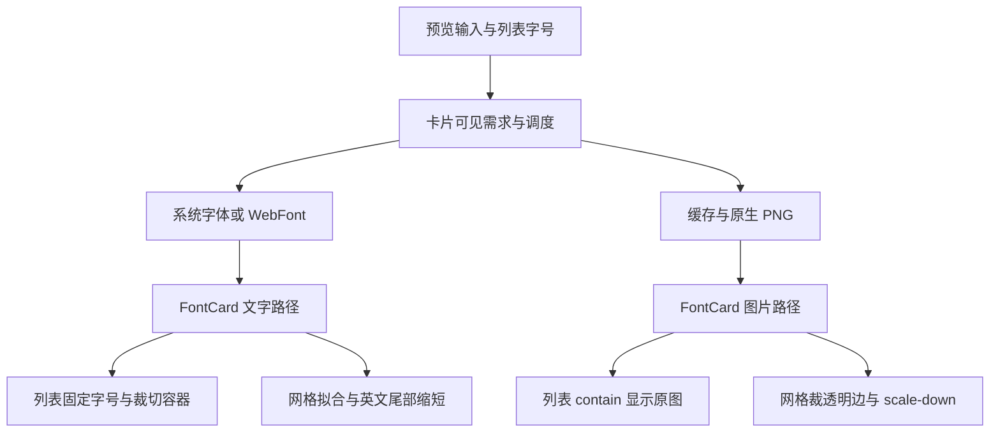
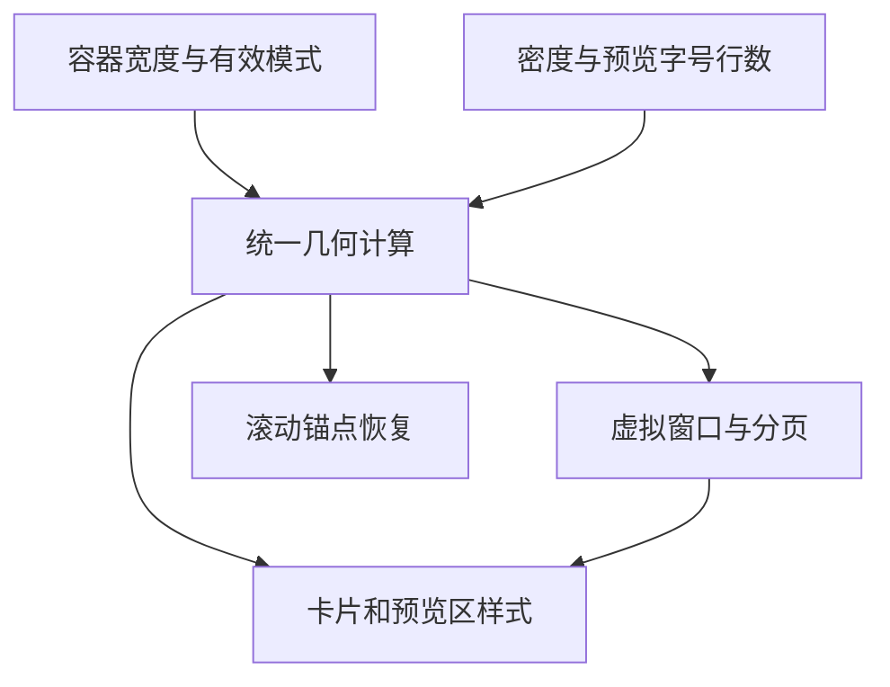
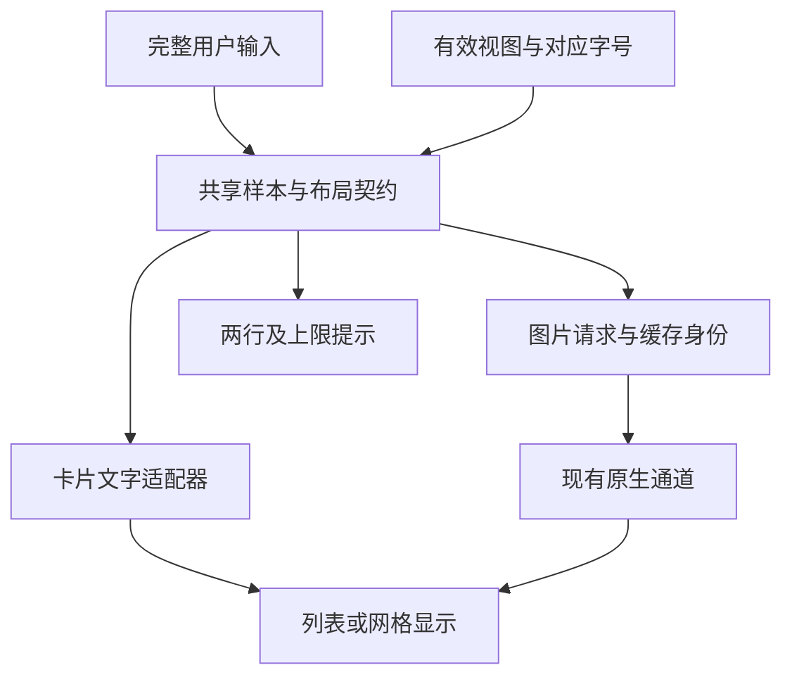
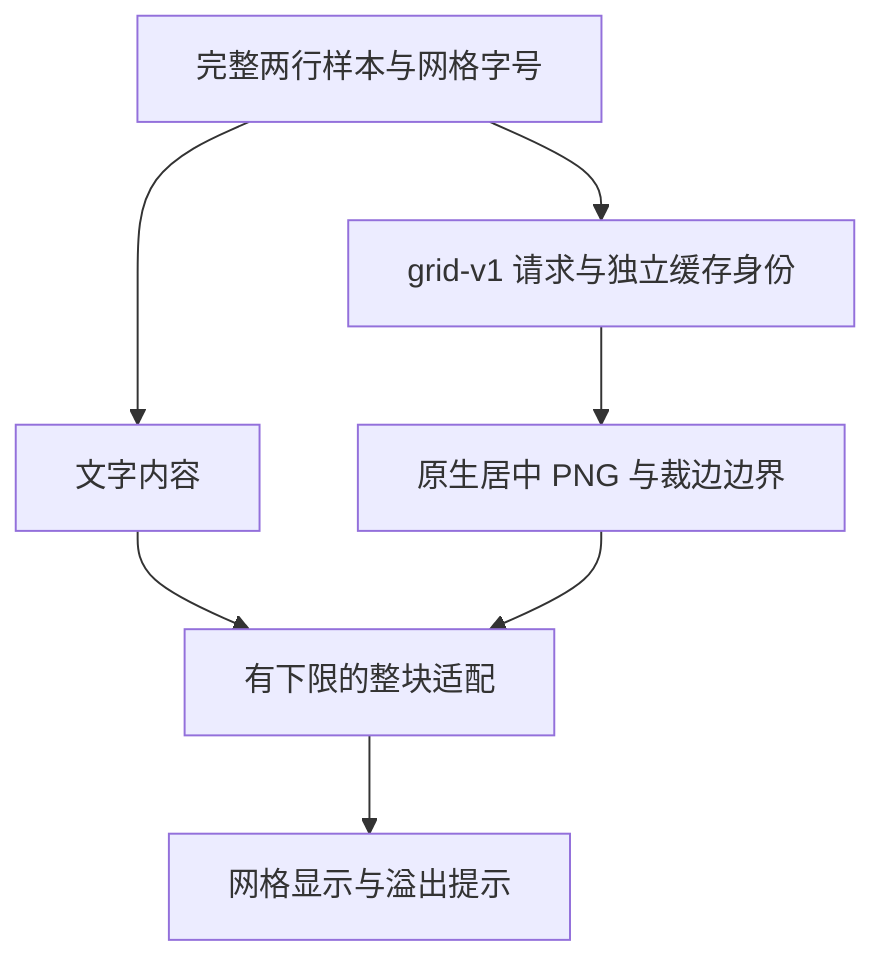

# HFM 列表与网格视图审计及优化任务书

## 0. 执行入口与授权

- 建立日期：2026-09-27（Asia/Shanghai）。审计基线：`85825261b5aa6319cb9d98e188368c55862e88b3`；仓库 `uniquenesssta/99`，工作区初始干净，远端与本地一致。
- 用户本次要求：审计列表视图、网格视图，给出优化任务书，将原 docs 旧任务放入 `docs/old task`。
- V00 审计、计划和旧任务归档已于 `6012cb6` 完成。用户随后授权开始 V01，并明确要求新专项使用新分支、不得改动 Stage 10。自 V01 起使用 **`stage/11-list-grid-view`**，分支基线为 `6012cb6c18fc52c9db181a2251dd54a235ac6e81`；Stage 10 本地/远端引用保持在该基线，不向其提交或推送。
- 新专项实施编号调整为 **S11-V01～S11-V07**（简称 V01～V07），与初版同序号 S10-V01～V07 一一对应；S10-V00 保留为已完成的历史审计编号。
- S10-06 工程核查既有结论保留，参见[旧 Stage 10 §19.1](../old%20task/HFM_STAGE_10_PREVIEW_PERFORMANCE_TASKBOOK.md#191-用户取消专项人工验收并推进-s10-062026-09-27)。本专项不是重开 05.5，也不把历史未验收事项自动判定完成。
- V03 初始显示和详情开合修复已通过自动化复验，用户本机显示待确认，见 §12.4～§12.5。用户随后明确授权推进 V04 并允许提交；V04 实现与自动化验证已完成，见 §14；用户已再次授权推进 V05，当前实施与验证中，见 §15。授权单项只执行该项；授权整个专项后按依赖推进，不逐项索要重复许可。
- 2026-09-28 用户要求核对预览链路优化归属，缺项则补为最终收官前的最后优化，并授权推进 V05。新增 **S11-V06.5**，放在 V06 后、V07 前；本次仅授权该项任务编制，不提前实施。当时 V05 因 V04 未开始而等待，历史核查见 §13；现 V04 自动化前置已满足，V05 按新授权推进，见 §15。
- 本次没有用户指定或任务书引用的 Figma 文件/节点，未据此虚构设计基准；沿现有应用风格提出下述方案。如后续明确指定 Figma，再核对相关节点。
- 项目文档总入口：[docs/README.md](../README.md)；原总任务书及 15 份旧专项/阶段任务全部归档，旧任务状态与回执保留。

## 1. 目标、边界与不变项

目标：列表适合逐行比较，网格适合快速浏览；两种模式展示同一份样本文字，文字与 PNG 的字号、换行和溢出含义一致；虚拟滚动定位正确；消除没有显示收益的裁图和重复请求。

范围包括字体卡片展示、行/卡片几何、可见范围与滚动锚点、原生预览请求的布局契约及其直接受影响的缓存/代次。共享组件的家族视图和详情视图只做受影响路径回归，不借此改版。

必须保留：

1. 前台实际并发上限 10；滚动期间暂停新预览和旧结果提交；连续停滚 150ms 后服务全部当前可见项；不可取消工作按真实完成释放槽位。不恢复 18 项预取。
2. 05.5 共享范围准入、可选缓存让路、只读查询能力门、文件/锁所有权、根离线和恢复、退出/取消退出边界。
3. 单选/多选、100ms 防连击、选择取消、详情联动、右键和拖拽含义；本地收藏、不共享收藏、激活和停用的既有规则。不增加重复操作按钮。
4. 不扫描整库来计算字形边界，不因调整显示重建索引，不清空用户数据库/缓存，不改变标签、文件夹或字体文件。
5. 默认不新增生产依赖，不引入常驻 DirectWrite 试验，不把 GDI 实现因日志含 directwrite 就当成 DirectWrite 后端。
6. 用户已取消的固定 24 卡片、冷热各至少 5 次及专项人工操作序列，不作为本专项关闭门或欠账重新引入。保留与实际改动相关的自动化和必要真实显示核实，次数不设硬指标，未测量不得宣称量化提速。

## 2. 已核实的当前链路

图为现状，不表示优化已实现。布局另一条链为 `useAppFontShellDerivedRuntime → useAppFontDerivedRuntime/buildVirtualLayout → FontListPanel → CSS`，滚动锚点复用 `fontScrollRuntime`。入口 `App.tsx` 将 `cardPoolViewLayout` 同时交给虚拟计算和列表展示。

关键源码（路径均相对仓库根，定位以函数名为准）：

| 职责 | 文件/符号 |
| --- | --- |
| 卡片、列表/网格接线 | `src/renderer/src/components/FontCard.tsx`、`components/app/FontCardRenderer.tsx`、`components/app/FontListPanel.tsx` |
| 几何与虚拟定位 | `src/renderer/src/runtime/app/useAppFontShellDerivedRuntime.ts`、`useAppFontDerivedRuntime.ts`、`src/renderer/src/fontViewRuntime.ts:buildVirtualLayout`、`fontScrollRuntime.ts`、`constants/layoutConstants.ts` |
| 文字契约 | `src/shared/preview-layout/previewLayoutConfig.ts`、`previewTextFitRuntime.ts` |
| renderer 请求/代次 | `runtime/preview/queue/fontPreviewLoadRuntime.ts:currentCardPreviewLayout`、`runtime/app/usePreviewController.ts`、`runtime/app/effects/usePreviewTextResetRuntime.ts`（均在 renderer/src 下） |
| 显示尺寸与拟合 | `runtime/preview/listPreviewSizeRuntime.ts`、`gridPreviewVisualFitRuntime.ts`、`gridNativePreviewImageTrimRuntime.ts`、`fontPreviewCssFamilyRuntime.ts` |
| 样式装载和覆盖 | `src/renderer/src/styles.css`；`styles/05-virtual-list.css`、`styles/13-studio-interface.css`、`styles/14-simple-wide-font-list.css` 及它们导入的文件 |
| 原生实现与后备 | `native-src/hfm-core-worker/src/preview_render/windows.rs`、`native-src/preview-renderer/hfm-preview-renderer.cpp`、`src/main/preview/runtime/nativePreviewScriptRuntime.ts`、`src/main/preview/native-renderer/previewNativeRendererRuntime.ts` |
| 缓存身份 | `src/main/preview/runtime/previewCacheKeyRuntime.ts`、`previewRequestSchedulerRuntime.ts`、`cachedPreviewReadCoalescerRuntime.ts`、`cachedPreviewImageDataUriCacheRuntime.ts` |

## 3. 审计发现与证据边界

P1 表示显示内容/定位正确性或明确浪费，P2 表示体验及验证可靠性。本轮没有确认新增安全/数据破坏型 P0。

| ID / 优先级 | 已核实事实、影响 | 处理任务 |
| --- | --- | --- |
| V-01 / P1 | `buildVirtualLayout` 把 rowHeight 作为相邻行步长；列表 CSS 又把同值用作卡片高度，外层另有 12px gap（窄窗规则为 10px）。DOM 步长与虚拟切片/总高度不一致，存在换页偏移、底部定位和框选坐标偏差风险。网格 comfortable 的 328px 卡片 + 14px gap = 342px 与常量一致，不应错误地给网格重复加 gap。 | V01 |
| V-02 / P1 | 列表高度分档根据 scroller 的 `virtualViewport.width`（720/1180），CSS 堆叠根据窗口 media（720/980/1080/1280）；侧栏/详情占宽时两者并非同一宽度。窄窗旧 studio 样式 `grid-template-rows` 仍可能参与简单列表，必须按最终 cascade 核实；不能只修改末尾固定高度。 | V01 |
| V-03 / P1 | DOM `previewTextLines(text,2)` 会 trim 每行、删除空行并只取前两行；原生请求 `normalizePreviewText` 仍携带三行及中间空行。原生画布高度却仍按最多两行计算。受控函数执行确认第三行只在原生请求存在，显示内容不一致。 | V02、V03 |
| V-04 / P1 | 列表 CSS 最终为 nowrap；Rust/C++ 仅在全文无换行时设置 NoWrap，有显式换行时不设置。PowerShell 使用 LineLimit/EllipsisCharacter，语义也不同。长多行 PNG 具有额外折行/截断风险。截图里的三行不能直接归因于 DOM 自动折行，更不能断言已还原用户当时后端。 | V02、V03 |
| V-05 / P1 | 原生卡片请求固定用 list 模式、760px 宽与列表字号（默认 44），网格文字用 26～42px，且 grid 配置 maxLines=1、卡片实际最多显示两行。列表 PNG contain、网格 PNG trim+scale-down，字号并不等于最终显示尺度；隐藏的列表字号也会影响网格 PNG。 | V02、V03、V04 |
| V-06 / P1 | `buildGridPreviewVisualFitCandidates` 遇到中英混合尾部会生成 `安盛aaaa → 安盛aaa → 安盛aa → 安盛a → 安盛`。溢出后网格文字会删内容，PNG 不走这套删字逻辑。候选与 effect 未按字体加载、容器宽度变化完整重测，可能保留过时缩短结果；后者实机影响未量化。 | V02、V04 |
| V-07 / P1 | `FontCard` 在 `compact` 列表返回前无条件调用 grid trim Hook，判定只看 image/family、不看 compact。因此列表图片也进入完整解码、getImageData 像素遍历和 toDataURL，列表 img 最终仍用原图。缓存上限是 240 项而非字节；卸载只阻止 setState，不停止已开始转换。明确有无效工作，耗时/内存收益待测。 | V05 |
| V-08 / P2 | 列表和网格均居中；列表超长行的 max-content 在 contain/overflow 容器裁切，没有完整文本的横向查看机制。不同字体起点不一致，不利于比较。改左对齐/溢出提示属于本任务书的拟议体验方案，未实施。 | V03、V04 |
| V-09 / P2 | 当前 grid size / clip-safe / visual-fit 三项诊断合计 20 个断言通过，但大多为源码字符串和夹具检查；其中“only in grid”未检查 compact，无法发现 V-07。不能把通过等同于没有裁字、尺寸一致或真实 GUI 通过。 | V01～V06 |
| V-10 / 待核实 | 已安装 CSS family 最终带 serif，WebFont 缺字也可能回退；元数据 script 标签不是逐字符覆盖证明。不能仅凭中文看起来相同断言指定字体缺字，更不宜本轮默认增加逐字体字符扫描。 | V06 观察；必要时单列后续 |
| V-11 / P2、根因待定位 | 2026-09-28 实机日志有两次缓存调度读取超过 2000ms 被取消；30 条预览慢请求耗时 1691～3261ms，48 次原生 worker 绘制耗时 9～112ms。现有日志未逐请求关联这些样本，不能相减算出精确 I/O 开销。预取未取得缓存也计入 failed，不能把该计数直接当缓存损坏。当前 V05 不覆盖主进程缓存读取和共享 I/O 等完整链路。 | V06.5 |

其他边界：`usePreviewHardFitRuntime.ts` 当前搜索仅有定义、没有卡片调用，不能把它的像素测量成本算进当前列表热路径，也不为了“优化”重新接入。原生实现中的 GDI+ 对齐/边距与 C++ ink-box 处理不同；本轮只根据源码确认契约差异，未在 Linux 环境执行 Windows 绘制。原会话截图未作为本轮可直接检查的图像提供，本文不伪造新的视觉复现。

## 4. 拟议显示契约

此节为后续实施的设计目标；批准执行专项时按此落地，不把本轮文档提交当作用户已试用认可。

| 项目 | 列表 | 网格 |
| --- | --- | --- |
| 用途 | 按固定起点比较字形 | 快速浏览、看清字体差异 |
| 文本内容 | 保留用户输入及显式换行，禁止为了适配删字 | 使用同一规范化源，不再缩短英文尾部 |
| 卡片可见行 | 保持现有最多两行的紧凑展示，但 DOM/PNG 都只取相同两行；空行/空格保留；超过两行明确提示“仅展示前两行”，原输入不截断不改写 | 同左，修正 config 与实际显示的行数矛盾 |
| 空白输入 | 沿用默认样本的产品行为，两路径共用同一判定 | 同左 |
| 字号 | 18～72 用户字号为 CSS px 的权威值，保留现有存储键；不按字体墨迹面积归一化 | 保留现有网格默认大小区间；按统一样本策略确定，不能被隐藏列表字号改变；不增加网格字号滑块 |
| 水平起点 | 文字与原生字形均左对齐、统一内边距，不只把 img 元素左移而保留 PNG 内部居中 | 保留现有居中布局风格，文字/PNG 相同策略 |
| 超长行 | 不自动折行、不缩字；提供预览区域的横向查看，选择/拖拽/键盘事件明确隔离 | 不删字；在限定区域做统一有下限的整块等比适配，仍放不下时显示溢出提示并可打开现有详情 |
| 垂直安全 | 行距和上下安全边界由统一布局结果决定，不用截图特例增加随意常数 | 保留卡片总体尺寸，必要的缩放按整个样本而非逐字体归一化；飘逸字形不得无提示截断 |
| PNG 显示 | 显式区分渲染尺寸、显示尺寸和像素倍率；同参数 CSS/PNG 字号语义一致，允许栅格化细微差异 | 同左；避免固定大画布 contain 导致不必要缩小 |

采用有界画布和已有输入限额。长文本超出原生最大画布时给出可理解的显示边界提示，不无限增大 bitmap；横向查看只承诺契约允许的渲染范围。准确字形外扩范围在真实后端验证，不能拿一个统一极小行高覆盖所有字体。

## 5. 职责与兼容方案

1. `src/shared/preview-layout` 拥有规范化、可见行、字号/对齐/换行策略与布局标识。扩展现有模块，只有确有独立几何职责才增加命名明确的模块；不创建一函数一文件或转发壳。
2. renderer 的布局 owner 输出 cardHeight、rowGap、rowStride、padding、previewBox 和列数；虚拟布局、CSS、锚点、框选/分页消费者共用。`App.tsx` 只接线，`FontCard` 只组合展示和轻量事件。
3. renderer 请求 owner 负责把有效视图及样本布局身份带入需求和过期结果校验；DOM 的瞬时宽度不能无约束地生成持久缓存键。视图切换保留字体身份对应的选择、锚点与可复用 WebFont。
4. 原生适配器拥有布局参数到 Rust/C++/PowerShell 的翻译。优先使用现有通道；若新增可选协议字段，旧调用保留默认，扩展校验/类型/能力检测，缺能力时按现有策略退化或明确不可用，禁止未知字段被旧 worker 静默忽略后假成功。
5. 布局语义变化必须进入所有图片身份：renderer token、内存键、批次合并键、main request key、磁盘/共享 cache key 与 rendererVersion。当前 legacy 与 strict 两种键均须覆盖；不能只修 strict 开关路径。不把新图写到旧键，不清库作迁移；旧图保留但语义不兼容时不命中新请求。
6. 同参数、同策略的图片可以复用；只有会改变像素的布局差异才分键。视图切换不无条件重新读取字体、不重建库，不为每次 CSS resize 写一份磁盘图片。
7. 图片裁边与测量优先复用已有能力，按“模式启用—可见需求—有界资源—过期结果丢弃”管理。不能用 CSS 隐藏或不 setState 冒充计算已取消。

## 6. Atomic Task 总表

| 任务 | 目的 | 依赖 | 当前状态 |
| --- | --- | --- | --- |
| S10-V00 | 基线审计、任务书、旧任务归档 | 用户本次请求 | 已完成审计与文档；验证/交付见 §9 |
| S11-V01 | 统一列表/网格几何与滚动定位 | V00、实施授权 | 已完成；159 项诊断、300 次 DOM 场景及 CI 通过，见 §10 |
| S11-V02 | 统一样本文本和模式布局契约 | V01 | 已完成；160 项诊断、320 次 DOM 场景及 CI 通过，见 §11 |
| S11-V03 | 列表字号、对齐、换行及原生链路 | V02 | 初始显示及详情开合修复通过自动化复验，用户本机显示待确认；见 §12.4～§12.5 |
| S11-V04 | 网格完整内容与图片/文字一致性 | V03 | 实现与自动化验证已完成；161 项诊断、54 张网格 PNG、140 次网格 DOM 场景及 CI 通过，见 §14 |
| S11-V05 | 图片后处理及视图切换资源优化 | V04 | 已再次授权，实施与验证中；V04 自动化前置已满足，见 §15 |
| S11-V06 | 相关回归与目标环境显示核实 | V01～V05 | 未开始 |
| S11-V06.5 | 收官前预览完整链路定位与优化 | V06、实施授权 | 已补入计划，未实施；必须在 V07 前完成 |
| S11-V07 | 清理、兼容复核与工程收尾 | V06、V06.5 必需门通过 | 未开始 |

每项独立提交并填写开始/结束 SHA、实际修改、通过/失败/未执行验证和恢复方式。后项依赖不满足时不冒进；同项可继续不依赖环境阻塞的工作。

### S11-V01：统一几何与滚动

- 输入/范围：V-01、V-02；布局派生、FontListPanel、fontView/fontScroll、相关 CSS，以及实际消费虚拟坐标的框选和查询分页。
- 动作：明确高度与步长的不同含义；统一容器宽度断点；计算并下发卡片高度、gap 与 stride。网格既有正确的高度+间距关系保持。列表窄屏信息/预览上下排布要扣除信息区与内边距，不再用整行高度减固定值代替可用预览空间。
- 同步改动：核对字号、模式、详情开合、resize 后的锚点；核对有效视图 fallback（如不允许 family 时）与原始状态分支；不重写查询系统。
- 验证：真实 DOM 测量相邻卡片 top 差等于 stride；首部/中段/末尾切片和数据库分页偏移不漏项；窄/宽容器及详情开合坐标正确。旧代码的 gap 不一致必须触发回归断言，不仅匹配字符串。
- 通过条件：虚拟总高度、DOM、锚点和可见项坐标一致，无窗口/容器断点错配。恢复：回退本项几何、消费者和样式整体；不只退 CSS。

### S11-V02：样本和布局契约

- 输入/范围：V-03～V-06；shared preview-layout、输入显示派生、队列布局选择及需求身份。
- 动作：建立唯一源文本与卡片可见样本，统一显式行、空行、空格、默认值和超过两行提示；列表/grid 两种布局独立于隐藏控件。全量用户文本继续保存在原状态，派生展示不能回写截断输入。
- 设计落点：记录 CSS px、行距、安全 padding、换行/溢出策略、画布边界、布局版本；确定 V03/V04 的具体原生接口与缓存迁移方式后实施。不得先单改文本 key 而留下其他身份旧语义。
- 验证：纯中文/西文/混合、换行 CRLF/LF、空行/空格、三行及输入上限；DOM 与原生收到相同卡片样本；改模式/字号只影响对应布局。若需要分步接入，默认行为仍使用旧完整路径，不能中间态混用协议。
- 通过条件：规范化结果与各消费者一致，旧输入和调用兼容；恢复：整体回退契约与接线，保留用户原输入。

### S11-V03：列表完整显示

- 输入/范围：V-03～V-05、V-08；列表 JSX/CSS、list size、原生布局/请求/缓存及适用后备路径。
- 动作：固定左侧基准；显式两行不额外自动折行；让用户字号成为实际显示字号；提供预览横向查看。若 preview 区成为独立滚动/键盘交互区域，评估卡片 button 的合法结构，避免嵌套交互控件；用现有选择 owner 保持操作语义。
- 原生链路：Rust 为默认验收对象；C++ 和 PowerShell 仅在允许后备的环境验证，不打开禁用策略。统一对齐/换行/留白与版本隔离，处理旧 worker 能力不足，不掩盖原生失败为可缓存占位图。
- 验证：代表性 CJK/西文/装饰字、18/44/72 字号、长行/两行，系统/WebFont/PNG 同内容；横向查看不触发卡片切换、框选或字体拖拽；旧参数调用和新缓存键不会混淆。
- 通过条件：明确显示范围内无额外折行和无提示裁字；字号意义一致，旧结果不覆盖。恢复：显示、协议、版本键、能力门整体回退；保留旧缓存，不删用户文件。

### S11-V04：网格一致性

- 输入/范围：V-05、V-06、V-08；网格分支、grid fit/trim、共享布局及模式请求。
- 动作：去掉为适配删英文尾部的算法，使用同内容的有界适配和溢出提示；两行契约与字号计算一致；PNG 不读取隐藏列表字号。字体就绪/容器尺寸变化后按最终字体与有效布局更新，不保留过时测量。
- 验证：`安盛aaaa` 的 DOM 文本和原生输入都保留全部字母；宽度改变、WebFont 迟到、文字与 PNG 路由切换后内容一致；长字形、小卡片及不同密度显示可解释。家族视图复用卡片不退化。
- 通过条件：相同样本不再因渲染路径改变字符；适配不会偷偷改变用户文本，视觉差异不来自隐藏列表字号。恢复：网格策略、身份及对应诊断一起回退，禁止留下新旧策略共用一个键。

### S11-V05：移除无收益计算并约束资源

- 输入/范围：V-07；图片后处理、卡片模式接线、相关缓存与生命周期，必要时调整 V04 的测量调度。
- 动作：先阻止列表执行 grid trim；只对有效网格 PNG 需求调度后处理；复用同源进行中任务；根据实际尺寸/字节约束缓存和并行工作，设上限但不随意降低前台原生 10 并发。过期/卸载/退出的队列任务取消；已经开始的同步像素扫描不能声称可立即中断。
- 优先路径：先消除多余工作和重复解码。仅在测量证明仍需 off-main-thread 时，才提出 Worker/OffscreenCanvas 的兼容和生命周期设计，不能默认引入第二套渲染系统。
- 验证：真实 Hook/组件列表挂载不触发裁图，网格有效请求可复用，卸载/换源后迟到结果不应用；反复切换不累积无界图像和对象 URL；关闭/取消关闭恢复，保留真实槽位计数。
- 通过条件：无效处理次数归零，资源有界且不影响显示；性能改善只报告实际观测数据。恢复：后处理 owner 与调用接线一起回退，不能只删除清理逻辑。

### S11-V06：相关回归

- 输入：V01～V05 已实现并各自验证；变更记录和行为反例齐全。
- 自动化：补有意义的 DOM 几何/组件生命周期/实际请求参数检查，迁移旧“删尾部才算成功”等行为断言，保留其防止溢出/错图的原意。已改变的源码快照可随行为测试更新，不能为绿灯直接删除失败门。
- 目标环境：Windows `npm run dev` 核对改动涉及的列表/网格显示、正常模式切换和正确字体；本地/共享、已安装/WebFont/PNG 的有关回归按已有测试和代表性实际路径提供证据，不要求用户跑固定人工次数或完整排列组合。涉及 GDI 字形边界的结论需实际 Windows 图像，不能用 Linux/Mock 替代。
- 继续保持已有滚动准入、失败恢复、离线根和退出回归；不恢复已取消的 24 卡片或冷热五次门。V-10 只检查现有证据能否确认回退，不在无证据时新增“不支持字符”提示。
- 通过条件：新增反例能捕获原缺陷，修复后通过；必需目标验证缺失则明确“实现完成、相关显示待验”，不能直接转 V07 全面关闭。
- 恢复：发现缺陷回到所属任务修复，不能回滚测试掩盖生产问题。

### S11-V06.5：收官前预览完整链路优化

- 目标：解决已证实的缓存等待和预览完整请求延迟，区分正常未命中、超时、取消和实际读取故障；验证用户可见完成时间，不把原生绘制时间当成整体预览时间。本项为最终收官前最后一个优化任务，完成后回归受影响路径，再进入 V07。
- 输入：V06 回执、最终显示/后处理代码，以及 `startup-2026-09-28_07-02-11-271-35812.log`（北京时间 15:02:11～15:02:57）的 V-11 证据。旧 Stage 10 中的缓存让路、共享准入等只作为现有约束核对，不重开历史阶段，不改 Stage 10 分支。若原始日志不可取得，保留本节摘要并取得新的实际样本，不伪造复现。
- 范围：renderer 可见请求/批量缓存/原生回退 → 实际 runtime preload → main 缓存路由、读取合并与调度 → 共享 I/O/worker → 图片返回、解码与有效代次提交；仅修复证据确认的瓶颈及同根受影响路径。V05 的裁边与资源工作在此验证联动，不重复建立第二套调度或缓存。

按依赖执行以下 Atomic Task，每项记录开始/结束 SHA、证据和恢复方式：

| 子项 | 动作 | 必需证据与完成条件 |
| --- | --- | --- |
| V06.5-A 定位与基线 | 复用现有 operation trace、预览代次和日志机制，补齐确有缺口的关联；分开记录需求排队、缓存准备/读取、授权与字体 I/O、worker 等待/绘制、发布、返回/解码/提交。核对超时后真实工作是否释放，不能仅看 Promise 返回。 | 同一请求可关联各环节及最终可见结果；记录视图、样本、字号、字体来源/后端、缓存状态、环境和基准 SHA。聚合慢请求与独立绘制样本不得直接配对。能区分正常未命中与故障，确定优先瓶颈后再改生产策略。 |
| V06.5-B 定向修复 | 按 A 的证据消除前台不必要的共享准备、重复访问或缓存等待；核对慢共享缓存是否阻挡已有本地图和可执行绘制。对日志 confirmed 的超时路径及其同根入口补完整修复；若发现现有让路失效，修其原因。 | 原缺陷反例能失败、修复后通过；慢/不可用共享、同键并发、超时/取消后同键恢复、过期结果和实际槽位计数均有行为回归。未改布局的缓存保持可复用，授权/所有权/根代次不能绕过。 |
| V06.5-C 目标验证与关闭 | 相同环境、数据和路径下对比修改前后，覆盖受影响的列表/网格及本地/UNC/映射盘、冷/热缓存；检查正常关闭与取消关闭恢复。必要时修正退出后的缓存统计续发和取消误记失败，保留真实错误可观测性。 | Windows 实际链路和相关自动化通过；给出首个有效预览/当前可见需求完成的实际测量及超时结果，说明未覆盖路径。收益若未测得或瓶颈未消除，保持未完成，不以 build、Mock 或隐藏错误替代。 |

- 涉及入口优先核对：`fontVisiblePreviewQueueRuntime.ts`、`fontPreviewLoadRuntime.ts`、`runtimePreloadSource.ts`、`previewRequestSchedulerRuntime.ts`、`previewStorageRoutingRuntime.ts`、`previewBatchReadRuntime.ts`、`previewCacheHydrationRuntime.ts`、`previewCachePrefetchRuntime.ts`、`previewStorageIoRuntime.ts` 及其实际消费者；具体路径以仓库检索为准。退出请求同时核对 `useFontIndexChangedEventRuntime.ts`、`fontLibraryIndexSharedRuntime.ts` 和退出 owner。不以文件清单推定每个文件都需修改。
- 统计语义：本次 `prefetch.failed` 包含未返回 hydrated ID 的条目，零 sharedHit/hydrated 不能单独证明缓存损坏或网络断开。实现时区分可确认的 miss/unavailable/timeout/cancelled/error；兼容既有日志消费者，不能单纯降低日志等级来掩盖真正错误。
- 硬约束：保留前台实际并发 10、停滚 150ms、只读能力门、根离线恢复、路径授权、取消与真实完成后释放槽位、共享发布所有权；不靠延长 2000ms 期限、无限并发、禁用共享缓存、清库或常驻 DirectWrite 试验换取表面改善。默认不新增生产依赖。
- 验证入口：根据改动选择已有 `diagnostics:preview-trace`、`preview-scheduler`、`preview-optional-cache`、`preview-resource-admission`、`preview-shared-admission`、`preview-cache-hydration`、`preview-cache-prefetch`、`preview-work-lifetime`、`preview-recovery`、`preview-render-concurrency`、`preview-scroll-admission` 和 `bounded-local-exit` 等脚本（均为 `diagnostics:` 前缀，执行前核对 package.json），并运行 `npm run verify`、`npm run build` 及受影响的目标环境门。不恢复固定 24 卡片或冷热各五次等已取消的人工次数要求。
- 通过条件：A～C 的证据闭合、已确认瓶颈完成修复且相关正确性门通过；没有测量不宣称量化提速，缺少必需目标证据不得关闭本项或进入 V07。V06 的旧回执不能替代本项修改后的受影响路径复验。
- 恢复：按 C → B → A 逆序整体 revert 各子项，保留用户字体、库和旧缓存；协议/缓存身份若确需调整，应与消费者和诊断成组恢复。不 reset、强推或修改 Stage 10。

### S11-V07：收尾

- 前置：V06 与新增 V06.5 必需门均通过；不得把未完成预览优化移入收尾说明后直接关项。
- 范围：仅清理本专项替代掉的规则/无调用导入/临时诊断；无关旧死代码不动，特别是未调用的 hard-fit 文件不能仅因本次读到就删除。
- 验证：按实际修改跑 `npm run verify`、`npm run build` 及受影响的 Windows/Linux 原生 CI；无原生改动不机械重编所有原生模块。检查每个新协议/缓存键的旧调用、降级和回退。
- 交付：README、任务状态、最终基线、未量化项、必要用户操作；当前分支提交和推送。阶段关闭不等于自动获准下一阶段或合并 main。
- 恢复：按 Atomic Task 依赖逆序 revert，跨原生/协议/缓存的修改整体撤销；不 reset 用户工作区、不强推、不删库。

## 7. 验证矩阵与现有入口

以下是按影响选择的覆盖维度，不是强制人工全排列或重复次数指标。

| 风险 | 对应证据 | 现有可复用入口 |
| --- | --- | --- |
| 几何、切片和选择位置 | DOM 实际尺寸与 virtual/anchor 输出比较，点击/键盘/框选行为 | 新增行为回归；`diagnostics:app-root-view-contracts`、`diagnostics:active-view-consistency` |
| 文字不一致/隐藏字号影响 | 真实纯函数、渲染分支与捕获的请求参数 | `diagnostics:grid-preview-size`、`diagnostics:grid-preview-clip-safe`、`diagnostics:grid-preview-visual-fit`（需升级行为验证） |
| 切换/改字迟到回填 | 挂载保持、旧代次拒绝、可见需求重排 | `diagnostics:preview-visible-requeue`、`diagnostics:preview-work-lifetime`、`diagnostics:preview-reuse-matrix` |
| 并发与滚动不回退 | 真实队列/底层生命周期 | `diagnostics:preview-scroll-admission`、`diagnostics:preview-render-concurrency` |
| 错图、输入与兼容 | 新旧参数、legacy/strict 键和版本隔离 | `diagnostics:preview-input-boundary`、`diagnostics:preview-cache-key-policy`、`diagnostics:preview-cache-generation`、`diagnostics:preview-image-ownership` |
| 共享缓存和离线退出 | 延迟、取消、根代次、读取/发布所有权 | `diagnostics:preview-resource-admission`、`diagnostics:preview-optional-cache`、`diagnostics:preview-recovery` |
| 原生字形正确性 | 当前默认 Windows 后端真实输出及实际 Electron 显示 | Windows 开发模式及受影响原生 CI；本轮未执行 |

全量验证从 package.json 读取，不发明脚本名。若测性能，记录机器/字体来源/样本/路由/缓存状态及真实可见完成，而不是把 native 渲染毫秒当整屏时间；没有数据就只报告消除的工作与正确性变化。

## 8. 旧任务归档规则

- 原 `docs/plans` 16 份任务书（含原总任务书及 Stage 10）移动到 `docs/old task`，文件名和历史章节锚点保留，不保留活动目录副本。
- 归档文件顶部增加历史说明，声明其中“当前”“下一项”仅为当时记录；本次归档不改变原验收状态，不将未完成任务自动关项或复活。
- README 当前任务区统一指向本任务书和 docs 索引；历史变更记录只修复目标路径，不重写历史结论。审计报告引用同步改为归档位置。
- `docs/audits` 的审计报告、只读观察脚本和样本不属于旧任务书，留在原位置，避免破坏既有诊断引用。
- 旧目录中相互引用按实际路径修复；含空格的 Markdown 目标使用 `%20`。归档验证包括文件映射、内容保留、旧路径残留、链接目标及 diff；不为文档搬迁跑无关生产构建。

## 9. 本轮审计回执与续接

- 已执行：核对远端仅有 main/Stage 10；核对本地干净且与 `8582526` 一致；读取规则入口及关联规则、附件、主/阶段任务书、相关 renderer/main/native 源码和样式装载顺序。
- 受控执行：通过项目 TypeScript 转译直接执行当前纯函数；三行输入 DOM 仅前两行而 native 文本三行；混合尾部生成五级删字候选；两行 PNG 在 44/72 字号的请求高度分别为 144/196；grid 默认字号 42，而通用原生卡片按 list 字号请求。这些是函数证据，不是 Windows GUI 复现。
- 已通过：`diagnostics:grid-preview-size` 6 项、`diagnostics:grid-preview-clip-safe` 7 项、`diagnostics:grid-preview-visual-fit` 7 项。它们证明旧策略接线存在，不能否定 §3 缺陷。
- 未执行：新显示方案、Windows GUI/原生绘制、性能比较、全量 verify/build（本轮没有生产/依赖/诊断代码改动，不把既有 CI 当作新方案通过）。
- 文档验证：16 份归档正文与原 HEAD 比较一致（仅增加归档说明及修正路径/命令引用）；198 个本地 Markdown 链接目标存在；活动目录仅保留本任务书；git diff --check 通过。变更仅涉及 README 和 docs，生产、依赖、诊断代码未修改。最终交付 SHA 以包含本文件的 Git 提交为准。
- Create State 仅返回两个不匹配 HFM 仓库的项目，未写入其他项目；续接状态以本任务书和 Git 为准。
- V00 交付时实施未开始；后续用户已授权 V01，按 §0 的新分支约定继续。V02～V07 尚未实施。

## 10. S11-V01 实施记录

### 10.1 分支与范围

用户在 V01 开始后明确修正分支约定：新专项必须在新分支实施，不改 Stage 10。所有尚未提交的 V01 修改已转至 `stage/11-list-grid-view`，基线 `6012cb6`。本节与代码仅在新分支更新，历史任务归档及 Stage 10 引用保留。

### 10.2 已实施链路

- `fontViewLayoutRuntime` 统一输出卡片高度、外部 gap、行步长、列数、内外边距及窄列表信息区/预览区高度。保留网格三档既有步长 266/342/386；列表步长明确为卡片高度加 gap。
- 列表断点只使用 scroller 的 `clientWidth`（720/1180）；样式消费同一布局对象。不再由窗口 media 独立修改虚拟卡片几何。家族展开卡片保留原几何规则，与虚拟列表规则隔离。
- 虚拟窗口末尾按完整行对齐，移除总高度尾部多余 gap；非零数据库分页 offset 保留首张卡片的实际列位置。增量加载继续按 100 项、已加载项高度推进。
- 滚动快照使用已提交的列数；字号、密度、容器/详情宽度变化后按字体 ID 和可见偏移恢复。过滤/排序切换仍由原有重置逻辑负责；非零独立数据库分页不启用自动锚点恢复。
- ResizeObserver 随实际视图节点切换重新绑定，保留 1px 跨断点变化。家族视图在标签/收藏场景回退后的有效模式同时驱动布局与显示。

### 10.3 验证记录（已通过）

- 本地 `npm run verify` 全部通过：类型检查 + **159/159 项完整诊断**。最新生产代码与家族样式的构建、混淆及 `git diff --check` 通过；未将受控诊断等同整机字体显示验收。
- 新增 `diagnostics:font-view-layout`：三档密度、六档容器宽度、三档字号、单双行、首中尾切片、分页 offset、滚动锚点、1px 断点、观察器重绑及有效模式回退。旧 gap 算法和尾部非整行切片两个变异均被行为断言拒绝。
- 新增 `test:font-view-layout-dom`：真实 FontListPanel/FontCard 静态 JSX 与完整实际 CSS，由 Electron Chromium 测量行距、卡片与预览区、首中尾/分页位置及真实矩形框选；另以 `6012cb6` 样式核对家族展开卡片，注入旧 gap 错误必须失败。预览服务和无关维护组件隔离，不能据此宣称原生字体渲染或整机 GUI 人工验收完成。
- 本地没有可运行 Chromium/Electron；Playwright 浏览器下载返回无效 ZIP，未以本地 Mock 代替 DOM 证据。Windows CI `36336287398` 的 `test:font-view-layout-dom` 已通过：720/1600px 两个窗口分别执行 150 个场景，共 300 次实际几何检查；家族基线与旧 gap 变异门通过。[CI 36336287398](https://github.com/uniquenesssta/99/actions/runs/36336287398) 三个任务均成功：Windows 主任务（类型检查、159 项诊断、构建、3/3 混淆和差异门），Windows/Linux 原生回归、构建和混淆。
- 四份既有组成层夹具仅更新本次授权变化的 observer/shell 参数、虚拟布局依赖、新增锚点 Hook 顺序和 App 前缀/清单指纹；其余控制器、选择算法、UI 端口及负向变异断言保留。
- V02～V07 未实施；样本文字、原生图片字号及网格裁字/裁图问题仍按后续任务处理。开发验证入口继续使用 `npm run dev`。

- 首次 Windows DOM CI `36335855355` 超时，未产出通过结果。检查夹具改用任务队列让出执行并显示测试窗口，避免隐藏窗口等待绘制帧；保留全部实测几何断言和超时失败门。

- 第二次 Windows DOM CI `36336150832` 实际执行了 720px 窗口的列表/网格矩阵，家族基线比较拦截到高度 +3.34375px。原因是隔离样式后 1080px 字号覆盖顺序变化；恢复原末尾字号规则，未放宽 1px 几何容差。

### 10.4 完成与续接（2026-09-28，Asia/Shanghai）

- 起点 `6012cb6`；新分支实施提交 `41e51fd`，诊断执行修正 `8384981`，家族覆盖顺序修正及最终验证代码提交 `0aa9d83110ca7b06ce1d0300225ef4c284da97cf`。随后仅补充 README/任务书回执，生产、依赖与诊断内容不再变化。
- 已重新读取远端引用：`stage/10-preview-performance` 仍为 `6012cb6c18fc52c9db181a2251dd54a235ac6e81`。V01 的提交和推送均位于 `stage/11-list-grid-view`，未合并主分支。
- 回退基线为本专项分支上的 `6012cb6`；如需回退，逆序 revert 上述三个 V01 提交，保留 V00 归档结果。Stage 10 不接受本专项回退提交。
- V01 关闭；下一实施入口为 S11-V02，尚未开始。本节只证明几何与相应链路回归，不提前关闭样本文字、原生字号、网格完整内容和图片处理任务。
- 架构关系和续接状态已写入本文件；沿用 §9 的 Create State 项目不匹配限制，不写入其他项目。

## 11. S11-V02 设计与执行（2026-09-28）

开始 SHA：`590213b4156ec406e645f4afa935a6861de9f46e`。仅在 `stage/11-list-grid-view` 实施。

### 11.1 接入与后续协议设计

- V02：完整输入仍由 `library.previewText` 拥有。共享模块派生最多两条显式行，统一 CRLF/CR 为 LF，保留行内空格及空行；仅完整输入全为空白时使用默认样本。派生样本受既有 4096 UTF-16 单元上限约束，不拆分代理对；超行或超限明确提示，原输入不改写。
- 当前卡片布局版本 `card-preview-v2`。列表使用 18～72 CSS px 用户字号、760px 画布宽及既有一/两行高度公式；网格使用 26～42 CSS px、520×150 画布、两行计算，与列表字号无关；family 复用 compact 卡片，按列表布局请求。详情和后台固定样本调用保持原接口。
- 本项保留原生位置参数 `(font, text, fontSize, width, height, trace)`，不发送未实现的对齐字段。渲染 token、批次、miss 身份统一取共享描述；所有实际主进程内存/调度/合并键已含同一 text/fontSize/width/height，足以区分本项像素差异，版本在进程内固定。legacy 与 strict 磁盘/共享缓存共同通过 rendererVersion 加入布局版本；保留旧文件，不清库。
- V02 的 DOM 行距列表 1.16、网格 1.04，显式行不自动折行、空格使用 pre。既有 DOM 行间 gap/安全 padding、原生居中/边距及网格 fit/trim 仍是旧显示适配器，不宣称像素一致。网格删尾算法的移除仍在 V04；V02 统一的是该适配器与原生请求收到的样本。
- V03 拟在现有 IPC 末尾增加可选的、带版本的布局对象，字段明确 CSS px 字号、行高、四边安全 padding、对齐、nowrap、画布和 pixelRatio；旧调用继续旧完整分支。Rust/C++/PowerShell 适配、输入校验、类型与 capability 必须同提交闭环；旧 worker 不具备新能力时按现有后备策略选择或明确不可用。所有影响像素字段进入 renderer/main/缓存身份，不能只改 strict key。左对齐和横向查看要在真实 Windows 后端核实。
- V04 在同一版本化通道中接入网格有界整块适配，不根据瞬时 CSS 宽度无限创建磁盘键。原生画布继续遵守 64～4096 × 32～2048、字号 8～320 的已有接口边界；允许的显示范围及溢出必须向用户解释。具体原生能力名与最终字段在 V03 实施前复核，不把本项声明当作 worker 已支持。

### 11.2 验证回执

实现提交 `2acef0f41028e0ffe494fa9a1dd673995f6f85e0`；诊断修订提交 `c24744f`、`ceb6b422ec8642415717791530bf7ecd1d89e82e`。结束 SHA / 最终受测代码与诊断基线为 `ceb6b422ec8642415717791530bf7ecd1d89e82e`。本节最终文档回执随后单独提交，不改变该受测基线。S11-V02 已完成，V03～V07 未开始。

本地结果：类型检查、160 项诊断分段全覆盖及三端 bundle/混淆通过。首次 `npm run verify` 在第 72 项 `preview-batch-read` 因旧诊断 loader 不认识新增的共享布局配置导入而停止；补入实际模块加载后，失败项及余下 89 项全部通过，保留前 71 项通过记录。没有删掉失败门或用常量 mock 代替布局版本。构建最后一次使用最终生产源码；原生代码未改动。

Windows 真实 DOM 门已在 `c24744f` 和 `ceb6b42` 上通过：两种窗口宽度各执行 150 个几何场景和 10 个样本场景，共 320 次；家族几何与原基线匹配。最终 [CI 36338903640](https://github.com/uniquenesssta/99/actions/runs/36338903640) 三组全部成功：Windows 完整 `npm run verify` 为 160 项通过；Windows/Linux 原生回归、三端构建与混淆通过（Windows 混淆 3/3）。

首轮 [CI 36338633961](https://github.com/uniquenesssta/99/actions/runs/36338633961) 的空行高度断言失败：原断言直接比较 DOM 布局值与计算行高，没有允许子像素取整。补充实际/预期高度输出，并限定最多 1/64px 容差；仍拒绝空行塌陷。最终日志实测列表高度 `51.03125px` 对计算值 `51.04px`、网格 `43.671875px` 对 `43.68px`，最大差值 `0.00875px`，确认是子像素取整；后续真实 DOM 门通过，首轮失败记录保留。

- Stage 10 本地及远端保持 `6012cb6c18fc52c9db181a2251dd54a235ac6e81`，原 `docs/old task` 未修改；仅提交/推送 Stage 11，不合并 main。
- 新增 `diagnostics:preview-layout-contract`：48 组样本/模式/字号组合的真实 renderer 请求参数，DOM 源样本与输入提示、UTF-16 边界、晚到结果、reset/resize、main 内存/合并/调度身份、legacy/strict 两种缓存与两种 rendererVersion；三个旧缺陷变体必须被拒绝。
- 将 10 组真实 DOM 空行/空格场景加入既有 Electron 门，在两种窗口宽度执行，保留原 300 次几何场景及家族基线比较。最终 CSS 层叠同时修正列表 `!important` 覆盖，不能只改公共规则。
- 原有诊断夹具仅迁移本次变更的 token/源码哈希；40 个状态 owner、App 生命周期/视图接线和队列物理并发约束保留。旧生命周期、滚动重排、批量缓存门已通过。
- 构建首次发现 main 不配置 `@shared` alias，已按主进程既有惯例改为相对导入；三端 bundle 与混淆复验通过。
- 插件：Mermaid Chart 已绘制样本→请求链路；Context7 查询 MDN `<length>` 确认 `1lh` 是元素的计算行高，用于空行占位，浏览器行为以 Electron 门为准。Create State 查询后尝试建立 HFM 项目，被 2/2 项目容量上限拒绝；未写入无关项目，状态由本任务书和 Git 保存。
- 回退：整体 revert 本项共享规则、消费链路、样式、缓存版本和诊断迁移；保留用户原输入及所有旧缓存，不清库、不修改 Stage 10。

当前显示适配器边界：共享 config 的 list/grid padding 分别为 `(36,20)` / `(28,20)` CSS px，尚非原生 padding 参数。DOM 网格行 padding-block `0.04em`、gap `0.12em`；列表最终 padding-block `0`、gap `0.02em` 加第二行 margin-top `0.02em`。Rust 原生仍按 x=`max(18,width×0.045)`、y=`max(12,height×0.12)` 留边，仅无换行文本使用 NoWrap；V03/V04 负责将这些实际策略收敛到新的能力门协议。V02 不声称已解决多行原生自动折行或网格尾部裁字。

### 11.3 实机测试时机

V01 已可观察长列表滚动、窄窗/详情开合与锚点变化；V02 可检查前两行、空格/空行及切换模式后的样本。建议 V03 完成后集中测列表字号、左对齐与横向查看，V04 完成后对比两种视图的完整文字和图片；V06 汇总相关 Windows 实机显示回执。入口继续使用 `npm run dev`，不要求固定卡片数、冷热重复次数或安装包测试。

## 12. S11-V03 列表完整显示（2026-09-28）

开始 SHA：`416edb7ccbe71622d32ce62674f1b0ecccbbfef7`；仅在 `stage/11-list-grid-view` 实施，Stage 10 保持 `6012cb6`。

### 12.1 实施与兼容

- 列表卡片外层改为可聚焦的 group，原选择 owner、100ms 防连击、Ctrl/Shift 与详情语义保留。独立预览 region 支持滚动条、方向键和 Home/End，阻止选择、框选和字体拖拽事件冒泡；避免在 button 中嵌套滚动交互区。
- 共享 `list-v1` 描述明确 CSS px 字号、1.16 行距、上/下 20px、左/右 36px、左对齐、pre、4096px 有界画布宽与 pixelRatio=1；高度为 `ceil(字号×1.16×显式行数+40)`。DOM 与 PNG 使用同一物理显示尺寸，不用 contain 缩小图片，不按每个字体墨迹归一化。虚拟几何为画布、提示和滚动条留空间。家族卡片保留既有外部几何，预览区可滚动。
- 长行不额外折行；两行分别绘制并保留空行。提示“横向滚动查看 · 超出预览边界请打开详情”；这不是任意字体/任意长文本无限画布保证。原输入继续完整保存；超两行/4096 UTF-16 输入提示沿用 V02。
- preload 在既有第六个 trace 参数之后增加可选 layout；IPC 在 trace envelope 前携带 layout，旧五参数/trace 调用兼容。renderer token、主进程内存/合并/调度、批量读取与两种磁盘键均含全部像素布局字段；旧缓存保留，详情/网格/固定后台样本仍按无 layout 的旧调用路径。后台失败任务保存并原样传回 layout，避免重试丢失新语义。
- Rust 默认路径增加 `preview-layout-list-v1` 能力及 `layoutVersion` 成功回执；旧 worker 不执行新布局，旧 daemon/后备 helper 不得凭未知字段假成功。Rust/C++/PowerShell 以 UnitPixel 字号逐行绘制，按字体 ascent/descent/em 与共享行高定位；C++ 新分支不走旧 ink-box 居中。兼容后备仍受原策略约束，不启用禁用的 fallback，不缓存占位图。
- 新契约字段严格校验；v1 只支持上述固定策略，未知版本、篡改尺寸/倍率/对齐/留白、第三行或 CR 均拒绝。旧无 layout 请求保留旧验证及完整渲染路径。

### 12.2 验证回执

实现提交 `65932c4`；最终代码与诊断基线 `d14b83869df00b84eb995be81c40eea379774ce0`。最终文档回执随后单独提交，不改变受测代码。

- 本地完整 `npm run verify` 通过：TypeScript 与 **161/161 项诊断**；最终 TypeScript 生产源码的三端 bundle 与混淆通过（3/3）。首次分段诊断的组成层指纹/loader 失败已迁移并复验，未删除原状态 owner、选择、生命周期、物理并发或负向变异断言。
- Windows 原生门：Arial、Gabriola、微软雅黑，18/44/72 字号，短行/中西文两行/长行/空行；Rust、C++、PowerShell 各 36 张，共 **108 张真实 PNG**。检查画布与字号、墨迹范围、无额外换行，并比较原点与垂直范围（最多 2px 边缘差异）；Rust/C++ 另比较右边界，PowerShell 不要求水平墨迹末端逐像素相同；另有 6 张长短首行对照图验证第二行像素相同，15 个无效布局请求必须拒绝且不产出图片。未为测试开启应用中被禁用的后备策略。
- Windows 真实 Electron：保留两种窗口宽度的 300 次几何场景、20 次 V02 样本场景及家族基线；新增每种宽度 39 次列表场景，涵盖占位文字、系统 Arial、实际加载的 Arial WebFont、12 张 Rust PNG，共 **398 次显示/几何场景**，另验证真实 React 事件传播。检查内容、18/44/72 CSS px、1.16 行距、左侧基准、横向可达、PNG 1:1 与交互隔离。预览服务由受控输入隔离，不能等同完整应用字体加载端到端或用户整机字体库验收。
- 最终 [CI 36346096242](https://github.com/uniquenesssta/99/actions/runs/36346096242) 三组全部成功：Windows 完整 `npm run verify` **161/161**；上述原生 PNG 与真实 DOM 门通过；Windows/Linux 原生回归、类型检查、三端 bundle 和混淆通过（Windows 3/3）。最终受测 SHA 为 `d14b83869df00b84eb995be81c40eea379774ce0`，S11-V03 已完成。

已处理的验证发现：

- 首轮 [CI 36343176907](https://github.com/uniquenesssta/99/actions/runs/36343176907) 发现旧 CSS 内边距覆盖新画布容器，导致预览高度不足；修正选择器层叠，保留严格高度断言。
- 原生试跑出现 `0xC0000409`；释放阶段记录定位至私有字体集合。仅调整持有/释放顺序的尝试未消除异常。对照 Windows SDK `FontCollection::GetFamilies` 后，改为克隆集合返回的借用句柄，再由独立 RAII 对象释放，并保证绘图对象先于字体集合销毁。临时跟踪已移除，三条路径真实 PNG 门复验通过。
- 图片复核发现 Rust 默认 StringFormat 即使设置公开标志，仍残留随字号变化的额外边距；改为克隆 GenericTypographic，并增加跨后端位置比较，避免只以“位于左侧范围”代替契约一致性。比较还发现 PowerShell 少量短样本的墨迹右端相差 3px，最终左/上/下边界最大差值为 1/2/1px；改变 PixelOffset 并未消除末端差异，已撤回该尝试。验收保留共同的画布、UnitPixel 字号、原点、垂直范围、长行与无折行约束，不要求独立 System.Drawing 路径的水平墨迹宽度逐像素相同；Rust/C++ 的全部边界实测一致。
- [CI 36344261186](https://github.com/uniquenesssta/99/actions/runs/36344261186) 同时暴露只读缓存测试在 Windows 同时间戳下共用目录；测试夹具增加原子序号，原断言保留，生产缓存逻辑不变。

Stage 10 本地与远端仍为 `6012cb6c18fc52c9db181a2251dd54a235ac6e81`；`docs/old task` 未修改。无依赖版本、安装流程或缓存清理变更；原生 worker 由既有 `npm run dev` 构建流程更新。V04～V07 未开始。

插件：Mermaid Chart 已展示实际布局→缓存→原生→显示链路；Context7 的 GDI 查询未命中具体接口，改核对 Microsoft 官方文档及 Windows SDK 的 FontCollection/StringFormat 实现。Create State 本轮再次因 2/2 项目容量上限拒绝创建 HFM 状态，未写入无关项目；Git、README 与本任务书保留回执。

回退须整体 revert 本项显示、协议、缓存身份、原生能力与诊断接线；保留旧缓存和用户字体文件，不修改 Stage 10。

### 12.3 实机入口与边界

在 `stage/11-list-grid-view` 拉取后运行 `npm run dev`。列表中调整字号至 18/44/72，输入一行及两行长文本，观察固定左侧基准、无额外折行及横向滚动；聚焦预览后用方向键、Home/End 查看，操作预览不应切换选择、触发框选或字体拖拽。卡片其余区域仍可选择和打开详情。

画布宽度上限为 4096px，超出范围按界面提示打开详情；完整输入仍保留。三种代表字体的检查不构成任意装饰字形无越界保证。V04 负责网格完整内容适配，V05 处理既有无效图片后处理；本项不宣称性能量化收益，完整字体库实机反馈继续记入 V06。

### 12.4 首次修复：初始画面必须看见文字起点（2026-09-28）

用户反馈：列表初始左侧为空，需向右滚动很远才出现文字。此前 §12.2 的局部原生/DOM 检查不足以关闭实际应用链路，V03 重新打开；V04～V07 不启动。

- 基线：`5457f15`，沿用 `stage/11-list-grid-view`，本轮工作区初始干净。用户授权第一次修复与优化，Stage 10 不变。
- 根因：`windowRuntime.ts` 实际写入并加载 `runtimePreloadSource.ts`，该桥接仍只有旧五项业务参数加 trace，丢弃 renderer 传入的第七项 layout；`src/preload/index.ts` 虽已更新却不是该窗口使用的桥接。由此缓存/渲染沿旧身份与旧居中语义处理 4096px 画布。用户日志的 Worker 已具有 `preview-layout-list-v1`，预览 IPC 仍只有五项参数；本地执行真实 runtime preload 已复现 layout 缺失。
- 修复：运行时 preload 的生成、单张缓存读取、批量缓存读取三接口与类型化 preload 保持一致，原样传递 layout 并保留尾部 trace。旧五参数调用兼容；布局键已有隔离，修复后不复用漏传布局时的居中缓存，不清库、不清缓存、不修改字体文件。36px 为既有字形安全留白，不是此次远距离偏移根因；本轮不靠改留白或移动容器掩盖桥接丢参。
- 验证补强：两份实际 preload 源码 → traced IPC → 实际预览 handler/批量调度，覆盖有无 layout、有无 trace、错误布局拒绝；旧桥接丢 layout 变异必须失败。Windows Rust PNG 改为使用实际运行时桥接交付的参数，并生成同字号短文本修复前/后像素对照；DOM 在滚动前检查 scrollLeft、画布原点、首字/首个墨迹在初始可见区，之后仍验证横向可达。
- 验证结果（代码提交 `c75a697da9ef969eaa92dd6e2a15b8f18754fe47`）：新增桥接回归在修复前失败（runtime/renderPreviewImage dropped or changed layout），修复后通过，丢布局变异被捕获；本地完整 `npm run verify` 161/161、三端 bundle 与混淆 3/3 通过。[CI 36382074882](https://github.com/uniquenesssta/99/actions/runs/36382074882) 三组全部通过，包含 Windows 完整 161 项、Windows/Linux 原生回归、108 张真实 PNG 与 398 次真实 Electron DOM 场景，构建和混淆通过。当前 Linux 环境没有可用显示服务，本地浏览器下载失败，真实显示证据来自 Windows CI，未把本地静态检查当成显示验证。
- 直接像素证据：同一 Arial / 35px / `Ag`，旧桥接变异输出首个墨迹 x=2026、右界 2065；修复后 x=36、右界 75；两者墨迹均为 521 像素。CI `list-preview-native` artifact（ID `10952937398`，保留 7 天）的 `bridge-before.png`、`bridge-after.png`、`report.json` 可复核，本轮已下载查看；测试可再次生成。DOM 检查滚动前的画布原点与图片首个墨迹，确认初始即可见，而不是滚动后才验证。
- 结论与边界：本次根因已复现，第一次修复及自动化验证完成；用户实际字体库窗口的反馈仍待确认，不据此进入 V04。拉取当前分支后关闭旧进程并重新 `npm run dev`，运行时 preload 会重写加载；无需删除缓存或重装依赖。窗口 UI 之外的输入和输出使用测试适配端口，不能宣称整库端到端全部验收。
- 恢复：整体 revert 本次桥接修复与对应诊断；保留用户数据及既有缓存。接续入口仍是本节，不恢复已取消的人工性能次数门。

### 12.5 详情开合闪动与取消返回定位修复（2026-09-28）

- 用户反馈网格、列表在打开详情及取消返回时明显闪动且位置变化；用户已授权实施。本轮基线 `24a4a30`，沿用 `stage/11-list-grid-view`；V04～V07 不启动，Stage 10 不修改。
- 确认链路：停靠栏使网格列数及列表宽窄档位改变；旧 ResizeObserver 经 rAF/120ms 节流提交几何，详情显露另经双 rAF 和多次定时重试调整 scrollTop。关闭没有进入前快照；通用锚点只能按当时的选中项恢复，而且非零数据库分页被禁用。旧静态 DOM 场景没有覆盖连续开合。
- 修复：选择 controller 的统一详情 setter 在 DOM 变化前通知滚动 owner，记录字体锚点、实际 scrollTop、可见列表预览横向位置和浏览范围；开合使用 useLayoutEffect 测量真实宽高，等待虚拟布局同步后在绘制前恢复。取消使用进入前快照，避免浏览器底部截断和选中项清空改变返回目标；非零分页使用全局索引换算，筛选/排序/视图变化丢弃旧快照。详情显露只在布局同步后执行一次；取消清除待显露项。保持原有禁用浏览器滚动锚定的规则，由现有虚拟布局 owner 负责；主布局的几何动画仅在显式侧栏切换期间使用。窗口拖动节流、预览并发 10、停滚 150ms、原生缓存及用户数据不变。
- 验证：补充网格/列表、进入前位置、非零分页、尺寸尚未同步、横向预览与范围切换行为，以及删除进入快照的负向变异；新增真实 React + 生产 AppLayout/FontListPanel/FontCard/选择/滚动 hooks 的动态夹具，在两种窗口宽度反复开合并逐帧检查卡片位置、尺寸及返回定位。原字体加载/数据库服务由受控字体数据隔离，不宣称整库端到端验收。本地 `npm run verify` 已通过类型检查及 161/161 项诊断，三端 bundle 与混淆通过。Windows 在 720/1600 两种窗口宽度下完成 48 组开合/返回及 2112 帧位置观测，检查首帧之后无延迟滚动/尺寸/卡片位置跳动、返回原卡片 x/y、列表横向位置保持；另通过原有 398 次 DOM 场景及 108 张 PNG 门。最终受测提交 `9430997a96f98d639ecbe65f5f66fcca20e88c78`，[CI 36387549764](https://github.com/uniquenesssta/99/actions/runs/36387549764) 三组全部成功：Windows 完整 `npm run verify` 161/161，Windows/Linux 原生回归、类型检查、三端 bundle 与混淆通过（Windows 3/3）。Stage 10 远端仍为 `6012cb6c18fc52c9db181a2251dd54a235ac6e81`。最终文档回执单独提交，不改变受测代码；V04 未开始。
- 本地 Electron 无显示服务，headless 启动亦因运行环境限制失败；真实动态显示门交由现有 Windows CI 执行。React 18 官方文档已通过 Context7 核对绘制前测量语义；Mermaid Chart 已展示实际链路。Create State 本轮创建 HFM 项目仍被 2/2 容量上限拒绝，未写入其他项目；交接以 Git、本任务书及 README 为准。
- 恢复：整体 revert 本轮详情布局/滚动及诊断修改；不清缓存、不重装依赖、不改 Stage 10。用户实机显示反馈仍需确认。

- 动态验证夹具修正：首轮 CI `36386599681` 发现模拟只发 click，未进入生产卡片的 mouseDown 选择入口；第二轮 `36387069812` 发现夹具缺少 `.app` 的有限高度布局。分别补齐实际输入入口和应用外壳，并显式断言滚动视口高度有效；保留原位返回和逐帧稳定性断言。此次接口/owner 接线对应的结构指纹已定点迁移，原状态所有者、选择/框选/删除行为及负向变异检查保留。

## 13. V05 启动核查与收官优化补录（2026-09-28）

- 用户本轮要求：核对预览链路优化任务，缺项则补为收官前最后优化，并开始推进 05。核查基线：本地及 fetch 后的远端 `stage/11-list-grid-view` 均为 `49bbef7ef44eb4277429fe94174e9ee9a42e8fab`，工作区起始干净。
- 归属结论：原 V05 明确覆盖 renderer 图片后处理和资源生命周期，未明确承接这次主进程缓存读取超时及完整链路秒级等待；旧 Stage 10 虽有相关优化记录，不能用历史完成状态关闭本次新日志发现。因此新增 V06.5，V07 依赖随之补齐；本轮不实施 V06.5。
- V05 只读源码核查：`FontCard.tsx` 的 `useGridNativePreviewImage` 仍未包含 `!compact`，trim Hook 在 compact 分支返回前执行，列表无效裁边仍存在；trim 缓存只有 240 项数量限制、无字节预算；进行中同源 Promise 已有复用，不能作为待新增能力重复实现；卸载只阻止 setState，已开始的解码/扫描仍继续。后续需保留现有复用并补模式准入、有界工作及资源生命周期。
- 前置阻塞：总表和远端任务书均记录 V04 未开始，V05 依赖 V04；V04 将调整 grid fit/trim，与 V05 同一处理链相关，不能假定可跳过。V03 用户实机显示反馈也仍未确认。本次 V05 授权保留，但不视为跳过前置验收或自动授权 V04。
- 当前交付仅为任务书、README 和 docs 索引；无生产、配置、依赖和测试修改，不将源码核查算作 V05 实施或验收。文档提交自身为本轮结束 SHA；未执行生产构建、Windows 动态测试或性能对照，不借用旧 CI 声称本轮优化通过。
- 文档检查：三个变更文件的 105 个本地 Markdown 链接目标存在，V06.5 引用的 12 个诊断命令均在 package.json 中，`git diff --check` 通过；差异限定在上述三份文档。
- 续接：先由用户明确是否推进 V04，并按其前置/验收要求处理；V04 满足后沿本次已授权范围执行 V05，不重复索取 V05 常规实施许可。V06.5 在其实施授权与前置满足后执行，完成前禁止 V07 收官。继续使用本分支，不改 Stage 10，不创建另一阶段分支。
- 恢复：仅 revert 本次文档提交即可撤销补录；不影响已实现功能与用户数据。状态保存于现有任务书与 Git，不尝试向已满或不匹配的 Create State 项目写入。

## 14. S11-V04 网格完整内容与一致性（2026-09-28）

- 用户明确“开始推进04，允许提交”；任务补录已推送至 `62a5c764d60048bd44cd1323b6a14939f4494aae`，本项以该提交为基线。沿用 `stage/11-list-grid-view`，不修改 Stage 10。V03 自动化结果保留，用户实机反馈未取得，不伪造用户确认；本轮按明确授权推进 V04，不启动 V05/V06.5。
- 实现：网格显示抽为 `GridFontPreview`，保留原样本和两行/空行/空格，不再按 CJK/拉丁尾部逐字删减。文字和 PNG 共用整体适配，最大倍率 1，最小倍率为 26px / 当前基础字号；仍超出显示区域或 PNG 墨迹触及有界画布边缘时提示打开详情。卡片几何、选择与详情事件保持原 owner。
- 网格 PNG 使用独立 `grid-v1`：26～42 CSS px、1.04 行距、左右 28px、上下 20px、4096px 有界宽度、逐行居中且不自动折行。Rust 默认及允许的 C++/PowerShell 适配器共同校验；单独能力门阻止旧 worker 静默接受。现有 layout 身份已贯通 renderer token、preload、main 内存/合并/磁盘及共享键，无需清库；旧 list-v1 和无 layout 调用保持兼容。
- 垂直契约：PNG 仅裁左右透明边，保留完整显式行高与上下 20px；文字使用相同纵向留白。避免把首行空白裁掉后改变内容位置与整体缩放。纯透明样本保留行高、缩窄空画布，不误报横向溢出。
- 适配测量：容器/内容 ResizeObserver、图片 load、font family/样本/图片身份变化及 FontFaceSet ready/loadingdone/loadingerror 重新计算；卸载清理监听，迟到裁边结果只能匹配原 source。MDN 文档经 Context7 核实字体 ready 与 loadingdone 语义，实际 Chromium 行为交由动态门验证。
- 与 V05 的边界：裁边移入网格专属组件，列表不再执行无效处理，这是本次网格职责拆分直接涉及的接线；原同源在途复用保留。字节预算、并行后处理及取消资源管理仍归 V05，未提前宣称其完成。

- 本地验证：最终代码 `992db0a53146741b3b3d5ba64ae6688f2b8ba732` 的完整 `npm run verify` 通过，包含 TypeScript 与 **161/161 项诊断**。覆盖网格样本/缩放下限/裁边行为、真实组件保留尾字的负向变异、两份 preload 的 grid-v1 传递、原 preview-layout-contract/list-preview-layout/font-view-layout 回归。生产源码的三端 bundle 与混淆通过（3/3）；其后仅修正 DOM 测试比例计算，没有生产源码改动。
- Windows 目标验证：Arial、Gabriola、微软雅黑 × 6 类样本 × Rust/C++/PowerShell，共 **54 张真实网格 PNG**，验证 runtime preload、居中、完整中英混排、两行/空行及长行不自动折行。真实 React GridFontPreview 在 720/1600 窗口下各 70 例，共 **140 次网格 DOM 场景**，每种窗口使用 18 张 Rust 原图；覆盖 180/300/520 卡片宽度、完整文本、空行、PNG/文字路由、字号独立、迟到 FontFace 和越界提示。原有 **108 张列表 PNG、398 次 DOM 场景、48 组详情开合及 2112 帧位置观测**全部通过。当前本地无 Cargo/显示服务，原生和实际 Electron 证据来自 Windows CI。
- 验证期间的修正：保留 PNG 完整纵向画布，补首行空白及纯透明裁边回归；旧客户端结构指纹仅迁移本次版本能力门对应项，新增缺少 grid 能力、不匹配版本回执与正确 grid 回执的行为检查，原负向变异保留。前两轮 CI `36399847640`、`36400253071` 的原生门通过，新增 DOM 门在缩放断言失败；夹具原先以浮点 DOMRect 宽度除整数 offsetWidth，存在取整误差，改读实际 transform 矩阵并输出场景尺寸，原缩放下限、居中、完整内容和无提示裁切断言全部保留，该门在最终 CI 复验通过。
- 图像复核：已下载查看 Windows 生成的 Arial、Gabriola、微软雅黑原生图，核对中英混排尾部、两行及首行空白。代表字体与受控 React 夹具不等于用户实际字体库的完整端到端验收；V03 的用户实机反馈及 V06 的相关目标核实仍保留，不恢复固定人工次数门。
- 最终回执：实现提交 `3ade186`，显式行几何修正 `b5f8934`，最终受测 SHA **`992db0a53146741b3b3d5ba64ae6688f2b8ba732`**。[CI 36400701721](https://github.com/uniquenesssta/99/actions/runs/36400701721) 三组全部成功：Windows 完整 `npm run verify` 161/161，Windows/Linux 原生回归、类型检查、三端 bundle 与混淆通过（Windows 3/3）。原生证据位于该 run 的 `list-preview-native` artifact（`grid/` 含报告与图片，保留 7 天）。最终文档回执单独提交，不改变受测代码。V04 实现与自动化验证完成；V05 已有授权、本轮未启动，V06.5 保持收官前必需计划项。Stage 10 远端仍为 `6012cb6c18fc52c9db181a2251dd54a235ac6e81`，旧任务归档未修改。
- 本机入口：拉取 `stage/11-list-grid-view`，关闭旧进程后运行 `npm run dev`；沿既有构建流程更新 worker，不清缓存、不重装依赖。
- 恢复：整体 revert 本项网格组件、适配策略、layout/能力门、三后端及诊断接线；不只回退一端造成缓存和像素契约不一致。保留用户数据、旧缓存和 V03 修复；无新增生产依赖。

## 15. S11-V05 图片后处理与视图切换资源（2026-09-28）

- 用户再次明确“开始推进05”；基线 `9ca1ff6fbdf1158e5b4f6f5562005ab45294ae28`，fetch 后与远端一致，工作区初始干净。沿用 `stage/11-list-grid-view`；V04 自动化前置已满足，用户实机显示反馈继续保留。只实施 V05，不提前实施 V06/V06.5/V07。
- 原因与归属：V04 已将裁边移入网格专属组件，列表不执行该 Hook；本轮补真实组件回归。原后处理无物理并发与字节预算，卸载仅停止 setState。新增 `gridPreviewPostprocessRuntime` 统一拥有缓存、等待队列、消费者与暂停代次；既有 trim 模块保留像素裁边与 React 订阅，复用同源任务，不建立第二套原生渲染系统。
- 资源预算：物理后处理并发上限 2；等待至多 64 项且源字符串计费不超过 16 MiB；活动工作预算 16 MiB，按 PNG IHDR 实际像素 × 12（源画布、RGBA 读回、目标画布）加源字符串 UTF-16 上界计费，先校验再解码。图像面积上限沿 grid-v1 的 4096×128。LRU 同时受 240 项与 32 MiB 限制，按源/结果字符串及结果 RGBA 面积计费。数值是资源政策与保守计费，不是实测进程堆/RSS，不涵盖已挂载 DOM 图片的浏览器内部副本，也不宣称量化提速。
- 生命周期：FontCard 复用现有 IntersectionObserver，仅可见网格 PNG 订阅；换源、离屏和卸载解除消费者，最后一个消费者离开时撤销未开始任务。已开始解码占槽直至真实完成；消费者全部失效后跳过像素读取/扫描，已开始的同步扫描不能即时中断。解码结束清除 Image 源与事件回调，所有成功/失败/过期出口重置临时 Canvas backing store；不新增对象 URL。
- 滚动/退出：接入既有 usePreviewController 与 closingLifecycle，滚动时保留已显示图片和可复用缓存，暂停新处理与旧代次回填，沿既有 150ms 停滚入口恢复。关闭同时清空后处理缓存和等待；取消关闭通过 React 外部订阅代次重新提交当前仍挂载的需求。旧任务最终释放不能删除新代次的同源任务，也不能提前腾出真实槽位。原生预览 10 并发、共享 I/O/离线/退出 owner 不变。
- 边界处理：超出资源准入、无效尺寸或裁边失败时显示原 PNG，并明确给出已有“打开详情”边界提示；不将失败/准入退化结果写入成功缓存。正常样本的裁边像素、上下留白、两行空行、字号和 grid-v1 缓存身份不变。
- 当前验证：定向资源/裁边回归通过，覆盖同源多消费者、等待/活动取消、关闭后同源重入、缓存 LRU/双预算、异常重试、Image/Canvas 清理；删除并发限制和字节淘汰的两个负向变异均被捕获。类型检查、网格样本/适配、可见需求重排及原生 10 并发/150ms 回归通过。完整诊断、构建及 Windows 真实 Hook/FontCard 生命周期检查正在执行，尚不关闭本项。
- 验证边界：Windows 动态夹具使用真实 React/FontCard/IntersectionObserver/PNG/Canvas/usePreviewController/closingLifecycle，字体获取服务由受控源图替代；不得当作用户字体库整库端到端性能验收。无本地显示服务，真实 DOM 使用现有 Windows CI，不新增本机人工次数门。
- 插件：Context7 核对 React 18 useSyncExternalStore 的稳定快照和取消订阅语义；Mermaid Chart 展示实际后处理/暂停/释放链路。Create State 未发现 HFM 项目，创建仍因 2/2 项目容量上限失败；未写入其他项目，状态以 Git、本任务书和 README 为准。
- 恢复：整体 revert 本项后处理 owner、trim Hook、可见性/滚动/退出接线及对应诊断；保留 V04 显示协议与旧缓存、用户数据，不修改 Stage 10。开发入口仍为 `npm run dev`，无生产依赖、协议或磁盘缓存迁移。
