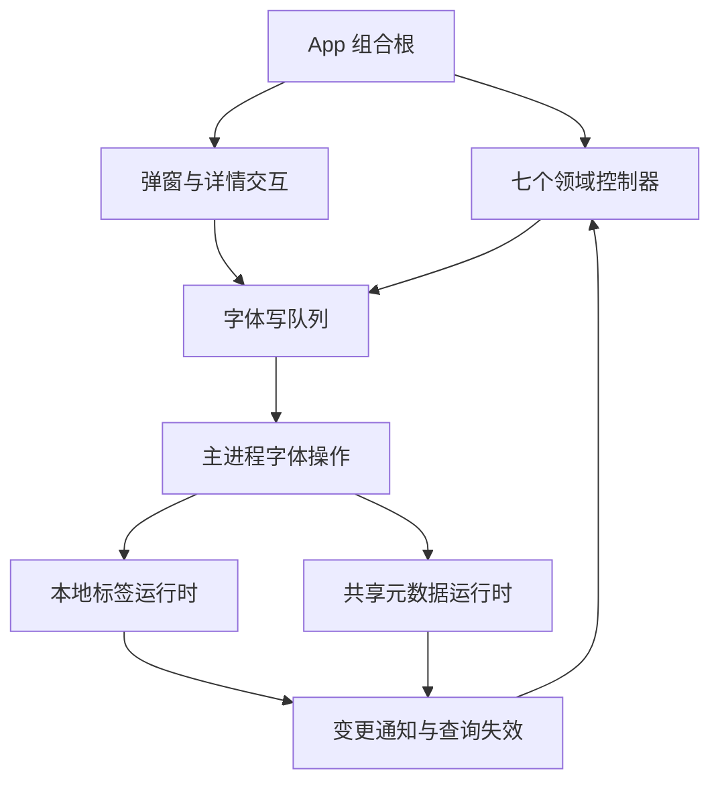

# HanFontManager：预览缓存、本地标签与 App 专项拆分任务书

## 0. 状态、目标与执行边界

- 文档版本：1.2；日期：2026-09-15；软件：3.0.0。
- 状态：规划已完成，所有实施任务尚未开始。本次提交仅新增任务书及文档索引。
- 仓库：uniquenesssta/99；文档分支：stage/07-ipc-security-dependencies。
- 审计代码基线：4cf6c4f20785139def64fa6ba1286764279c81ba。
- 目标文件：previewCacheStorageRuntime.ts（1237 行）、localFontTagsRuntime.ts（821 行）、App.tsx（1062 行）。行数用于追踪，不作为验收指标。
- 用户使用开发模式运行与验收：npm run dev。安装包、NSIS、安装/卸载不属于本专项验收条件；旧任务书中的发布验收属于独立范围。
- 本任务书不代表已授权立即实施所有重构。本轮先提交计划；收到实施指令后按下列 Atomic Task 串行执行。
- 不重编号或覆盖原 Stage 7/8。本专项使用 D-01～D-11 编号；开始代码实施时遵守总任务书的阶段分支规则，以当时最新已接受基线建立一个专项分支，不为每个任务重复建分支。

扩展范围：根据用户追加要求，第 10 节新增监听与已激活展示的 W/A 审计修复任务，继承所有实施约束；属于明确授权的任务书范围扩展，不代表现在开始生产修复。

成功标准：修改本地标签时，不意外覆盖收藏、共享标签、删除保护；预览读写在并发失效下保持一致；根组件能清楚表达协作顺序，领域状态与队列只有一个所有者。

## 1. 审计证据与不能越过的结论

| 编号 | 结论 | 证据与范围 |
| --- | --- | --- |
| F-P1 | 预览写入仅在操作前失效，提交期间读请求能重新缓存旧值 | 隔离执行真实函数、模拟数据库等待：写入后数据库为 ok，紧接读取仍为 missing；TTL 为 1200ms。尚非 Windows 实机复现 |
| F-T1 | Node 标签 hydration 的别名/路径映射为一对一，重复身份会覆盖前项 | 使用真实 identity helper、模拟 SQL 和启用的回退策略：共享 sourceId/path 的 A/B 条目只有 B 得到标签。默认 Rust 路径不在此结论内 |
| A-P1 | 两个批量入口重复构造缓存键、存储分组与查询行 | getPreviewCacheStatus / readCachedPreviewImages 源码确认 |
| A-P2 | 两个批量入口的当前存储工厂返回 local，直接 root/Rust 查询分支不可达 | 当前 tier 工厂与调用点确认；其他单项 root 路径仍有效，不得一并删除 |
| A-T1 | 标签协议、SQL、Rust 适配、事务与通知混合 | 单项、批量、删除流程源码确认；部分 try/catch 跨越提交前后 |
| A-A1 | App 保留大量跨控制器协调与前向回调 | 不是已确认初始化故障；需冻结回调不能在被引用控制器初始化前执行的约束 |
| U-01 | 用户历史上“修改标签影响收藏/共享标签”的根因 | 尚未证明全部来自这三个文件；必须沿字段写入、队列、IPC、合并与回读链查证，不能以拆分代替根因分析 |

前轮审计复跑五组诊断通过：react-composition-controllers、react-composition-domain-controllers、app-root-view-contracts、preview-cache-generation、tag-consistency。前轮没有重跑全量 verify 或 Windows GUI。部分预览/标签旧门禁为源码文字断言，不覆盖 F-P1/F-T1。历史 91/91 是旧验证记录，不得写成本专项结果。

隔离复现脚本不作为永久证据；D-01 必须在仓库重新建立可执行、可审查的故障用例，明确使用真实生产函数及替换的外部依赖。

## 2. 范围与不可破坏契约

允许：三个目标文件、按职责提取的同域模块、必要的直接调用方、诊断及任务记录。

不包含：依赖升级、数据库 schema/缓存协议迁移、Rust/C++ 实现迁移、IPC 改名、preload API 改名、UI/CSS 改版、功能新增、全局 store、通用插件框架、大面积 memo 化、无关大文件治理。

约束：

1. 本地标签、共享标签、favorite、删除保护是独立字段域；任何写入只修改所需字段。共享标签不等于本地标签，两者失败和重试不得串域。
2. 字体身份继续使用现有 id/sourceId/规范化路径规则，不因重构改变持久化主键或历史匹配规则。
3. 保留空标签目录与显式删除标签的区别；清空最后一个字体绑定不自动删除标签目录。
4. Rust 写操作抛错向上传播，不可吞错转 null 后再次 Node 写入；回退仅按现有显式兼容策略允许。
5. 批量事务失败必须回滚，不返回成功 ID；提交后日志/通知失败不能冒充数据库回滚。改变错误返回语义须有独立修复证据。
6. 预览缓存键、尺寸和文本校验、已安装字体路由、本地优先与共享补齐语义保持；missing/failed 已处理状态不等于存在可读取图片。
7. 状态缓存、in-flight、失效 token 必须归同一 owner；预取、补齐、淘汰复用现有实例，不复制队列。
8. 数据库句柄借用/拥有边界不变：本地借用句柄不关闭，自行打开的共享句柄在 finally 关闭。
9. App 七个控制器的状态归属不退回 App；写队列 flush → library 保存 → 关闭确认的顺序保持。
10. 不以放宽断言、重录全部基线、any、无类型万能 options、可变队列外泄换取通过。

## 2A. 强制实施协议（缺项不得判定完成）

本节将原则落实为可审查的交付门槛。当前只新增文档约束，自动门禁尚未实现；不能把本节存在等同于 CI 已经执行检查。若后文建议与本节冲突，以用户当前要求及本节的具体验收要求为准。

### C-01 范围冻结与任务入口

1. 一次仅一个 D/W/A 任务处于“实施中”。未经验证的任务不得作为下一任务基线，不把 D-02/D-03 修复与 D-04～D-10 搬迁合并提交。
2. D-01 开始前登记执行 HEAD、branch、工作树状态和开发依赖准备结果。代码基线需包含 Electron 42 / better-sqlite3 12.11.1 兼容修复；保留审计基线以重放历史故障。
3. 每项开工前填写执行卡的“允许文件清单”，精确到文件路径。新增文件要写所属职责、唯一状态所有者、调用方；不得用“相关 runtime”“其他必要文件”等兜底条目。
4. 发现清单外文件必须改动时，先记录具体证据和扩展理由。范围内必要直接调用方调整可按既有授权更新清单继续；涉及数据格式、公开协议、新功能或其他领域重构则暂停该扩展，不借“修顺手问题”扩大任务。
5. 本次文档修订不启动 D-01。未来用户授权某个 D 任务即可执行其必要工作，不增设重复推送审批；自动验证通过后按长期授权推送当前执行分支。

### C-02 变更分类与基线纪律

- 修复：必须给出旧实现失败、新实现通过的同一行为用例；只改变已登记的问题行为。
- 纯拆分：函数可迁移、参数端口可收窄、依赖可重接，但业务条件、排序、时间参数、SQL、缓存键、错误返回、事件顺序不得顺带改变。
- 清理：死分支、未用 import 或重复逻辑清理须有可达性/使用证据；非迁移直接导致的清理单独提交。
- 上游依赖修正属于单独兼容任务，不得混进专项拆分。类型检查通过不代表原生模块可以加载；已有开发环境错误未解决时，不得标记运行验收完成。
- 不整批重录 snapshot/hash，不删除失败断言，不用跳过用例、更换 fixture 预期或宽泛 catch 掩盖问题。结构性夹具改动必须逐项说明“为何测试对象变了而行为期望未变”。

### C-03 状态与模块所有权硬限制

| 对象 | 唯一所有者要求 | 禁止做法 | 证明方式 |
| --- | --- | --- | --- |
| 预览读状态 | cache、in-flight、generation 同一索引访问实例 | 拆开后互相同步、暴露原始 Map、复制缓存 | 构造次数断言、并发失效行为测试、导出表审查 |
| 预取/补齐/淘汰 | 复用已有各自 runtime | 每个入口重复 new、用全局单例掩盖重复实例 | 两入口交错调用及重复初始化测试 |
| 标签事务 | 对应后端存储 owner | 事务内部 await、把目录更新移到事务外、逐项提交冒充原子批量 | 第 N 项失败后真实隔离 DB 回读 |
| 字体写队列 | 既有 Operations 所有者 | App/新 hook 再建队列、公开可变 queue/ref | 所有权扫描、flush/重试计数与字段隔离测试 |
| React 状态 | 既有七个控制器 | 新建镜像 state、通过 effect 双向同步、移动进万能 hook | state/ref 清单逐项对照、重复订阅与清理测试 |
| DB 句柄 | 显式区分借用与拥有 | 关闭借用句柄、异常路径漏 close、跨 owner 隐式转移所有权 | 正常/失败/取消的 open-close 计数 |

新增模块必须能回答：删除它会失去哪一个独立职责？若答案只是“文件短一点”，不允许创建。新增公共参数必须有实际消费者；不传完整 App 上下文、全部 controller、万能 options。禁止新增 any、ts-ignore 或双重断言绕过新增边界类型；遗留类型逃逸需登记，不要求无关范围全面清理。

D-01 必须冻结公开导出、IPC 名称、五个本地标签方法、六组视图输入和状态所有者清单。后续自动门禁依据此清单检查，禁止复制一套与生产无关的模型代替检查。

### C-04 跨字段不干扰是硬门禁

本地标签、共享标签、favorite、删除保护分别登记实际写入字段与权威数据源。每种操作测试均采用“四个字段都有非默认值”的字体对象，操作后对其余三个域作完整比较，并比较无关字体 B/C。

强制测试同一字体的交错顺序：本地标签 → 收藏 → 共享标签 → 保护；通过手动控制 Promise 完成顺序穷举这四个请求的 24 种返回排列。若真实执行器串行，另行断言它只能产生规定顺序，并在允许并发的回读/状态信号边界重放旧响应；不能为了凑用例绕过生产串行协议。

测试必须穿过真实队列/执行器与结果合并逻辑，外部 IPC/文件系统可以替换；不能 mock 掉被审计的 merge/flush/retry 函数。至少验证：

- 已成功字段不会被旧对象快照覆盖；版本过期结果不覆盖新意图。
- 一个域失败，只保留该域待重试数据；成功域不会重复写入。
- “提交成功、通知失败”与“事务失败”结果可区分；不因日志异常声称回滚。
- 写入完成后回读及关闭重开与最终 UI 一致；单次 UI 看起来正确不足以通过。

若出现任意跨域覆盖，该任务验收失败，停止扩大搬迁并先定位真实写入点。历史故障未重现时标记“未定位”，不得写“已根治”。

### C-05 异步、资源与性能门禁

- 异步用例用可控 Promise/时钟稳定排列，不依赖 sleep 猜测竞态，不访问正式字体库。
- 预览必须覆盖：旧读晚于新写、写中开始读、读晚于删除、失败、超时后底层晚完成，以及下一代新请求。不能以只增加 TTL、延迟读取或全局串行阻塞回避一致性问题。
- local/root、Rust 成功/null/抛错、Node 回退允许/禁止分别列出实际可达用例；不可达分支先证明，不虚构执行覆盖。
- 事务验收使用临时真实 SQLite 数据库；mock 只用于故障注入点与外部依赖，必须回读确认回滚和目录一致性。运行该测试的 Node/Electron ABI 要记录，不能用不匹配原生模块的环境假通过。
- App 保留初始化顺序、effect 注册与清理、关闭 flush 顺序。必须验证重复挂载/卸载不增加事件监听、计时器、队列实例；无法观察的指标记为未覆盖。
- 性能不得只凭文件变小声称改善。沿用真实 10k 场景与卡片引用门禁；同机同样本测量，超过原门禁即失败，耗时异常需复测定位，不以本机历史毫秒数字设跨机器绝对标准。

### C-06 各任务最小改动范围与准入证据

以下是职责边界，不替代执行卡中的具体路径清单。

| 任务 | 允许的生产改动 | 不可缺少的准入/完成证据 |
| --- | --- | --- |
| D-01 | 无 | 三文件清单、跨域写入链、两个隔离复现、字段隔离基线；新自动门禁的具体名称与路径 |
| D-02 | 预览索引失效修复 | F-P1 旧失败/新通过；写/删/失败/晚完成测试；不移动模块 |
| D-03 | 标签身份 hydration（Node/Rust，扩展证据见§19） | 合法输入证据、F-T1 重放、分块与去重、回退政策不变；不移动事务 |
| D-04 | 路由/库快照迁移及窄接线 | 缓存身份与副作用摘要不变、单一 availability、旧 Promise 不污染 |
| D-05 | 索引访问迁移及窄接线 | D-02 全保持、Map 不外泄、句柄所有权及唯一实例 |
| D-06 | 批量行构造/读取收敛 | 键与行结果一致、400 分块、状态/图片语义区分、root 分支处理证明 |
| D-07 | Node SQL/事务迁移 | 真实数据库故障回读；字段隔离；提交前后结果语义 |
| D-08 | Rust 适配/业务门面收敛 | 失败不跨后端重放、五个方法契约、通知与查询失效顺序 |
| D-09 | App 菜单/详情/选择组合 | 七控制器所有权不变、初始化反例、选择/详情/输入/拖放行为锁 |
| D-10 | 六组视图接线整理 | 六组类型反例、UI 接线不变、重复挂载清理与性能门禁 |
| D-11 | 仅验收必要修复与记录 | 全量 verify、Windows dev 和跨域矩阵；发现修复必须另立关联提交 |

D-02/D-03 的遗留故障用例在 D-01 可作为明确预期失败的观察项，不能令默认 verify 长期失败；对应修复完成后立即转为必过门禁。纯拆分阶段不得继续容忍同一故障。

### C-07 完成证据、状态与暂停条件

任务状态仅使用：未开始、实施中、自动验证通过待实机、完成、阻塞。最多一个实施中。需要实机结果的任务可以进入“自动验证通过待实机”，后续任务须记录继承的缺口；D-11 不得带必需实机缺口标为完成。

以下任一情况必须停止当前任务收尾或扩大实施：基线不可确认、未解释的用户改动、必过门禁失败、跨域字段变化、破坏公开协议/数据格式、回退发生重复写入、句柄/队列重复所有权、无法证明纯拆分行为等价。停止的是相关扩展或完成判定；允许继续授权范围内定位和修复，不因此反复询问推送权限。

每项执行卡必须全部填写，不允许用“测试通过”“应该没问题”代替证据：

```text
任务：D-/W-/A-__；状态：__
基线 SHA / 分支：__
允许文件（精确路径）及每项职责：__
变更分类：修复 / 纯拆分 / 独立清理
原 owner → 新 owner；导出/调用方变化：__
新增或调整诊断命令/路径：__
旧实现失败证据或迁移前行为摘要：__
新实现结果、退出码、测试环境：__
跨域 X 用例编号及逐项结果：__
全量验证结果；未运行项及原因：__
开发模式实机结果或待验收项：__
实际 changed files 与允许清单核对：__
提交 SHA / 远端 SHA / 回滚提交：__
遗留风险、是否允许进入下一项及原因：__
```

执行卡追加在本任务书实施记录后，README 仅写简洁用户可见变更。Git diff --check、链接检查、文档检查不能替代代码测试；历史 91/91 不能复用为新任务结果；有未完成项必须明确写出。

### C-08 自动约束的落地责任

D-01 必须在仓库现有 diagnostics 体系中定义或复用以下门禁，登记真实脚本名和 fixture 路径；新测试不得只存在于临时目录或会话文字：

1. 公开契约与状态所有权检查：发现重复 owner、原始可变队列外泄、接口丢失时失败。
2. 预览交错读写检查：从 D-02 起为默认必过门禁。
3. 标签身份及字段隔离检查：从 D-03/后端相应任务起为默认必过门禁。
4. 队列与跨域合并检查：真实执行器、失败重试与旧响应矩阵。
5. App 行为和资源检查：复用现有控制器/视图/性能门禁并补缺失场景。

每个新增行为门禁至少一个真实退化变异被拒绝；文本扫描仅辅助结构检查。D-01 没有交付这些检查的明确实现/复用计划和可执行基线，不得直接开始大规模移动代码。C-01～C-08 的完整执行需要后续代码与实机证据，本次文档修订不宣称已经自动强制执行。

## 3. 当前实际协作关系

以下仅表达基线已有关系；建议提取模块尚未实现。



需追踪收藏和共享标签的实际落点与结果合并，不能只检查 localFontTagsRuntime。直接链路审查允许扩展到字体写队列、写入执行器、IPC、状态信号与 library 合并，但无证据不得顺手重构这些模块。

## 4. 目标职责与依赖方向（提案）

### 4.1 预览缓存

| 所有者 | 职责 | 边界 |
| --- | --- | --- |
| 存储路由 | 库快照缓存、根目录识别、目录准备、本地/共享映射 | 持有库 generation；复用 tier/rootAvailability，不拥有索引状态缓存 |
| 索引访问 | 单项读写删除、DB/Rust 后端、读缓存与失效 | cache/in-flight/token 集中；仅提供命令，不暴露 Map |
| 批量读取 | 统一构建查询行与分组、状态判断、图片读取 | 状态入口和图片入口保留不同 acceptedStatuses、文件检查和 touch 时机 |
| 原门面 | 建立唯一实例、连接 hydration/prefetch/eviction、保留公开 API | 显式工厂顺序，禁止不必要的循环 import |

优先检查已有模块能否接收职责，再决定新增文件。建议同目录职责命名，不设目标文件数量或硬性行数。共享 I/O deadline 包装的归属需保证 rootAvailability 唯一实例；不把有副作用的路径准备伪装为纯函数。

### 4.2 本地标签

| 所有者 | 职责 | 边界 |
| --- | --- | --- |
| Node 持久化 | 标签目录与绑定 SQL、读取与事务 | SQL 和事务边界一起移动；不发送 UI 通知 |
| Rust 适配 | 输入转换、执行调用、回退资格及错误传播 | 区分不可用和已执行失败；无静默二次写入 |
| 原业务门面 | 单项/批量/删除协调、统一结果与变更通知 | 保持原五个公开方法和调用方契约 |

身份 helper 继续唯一复用。类型只在有实际跨模块消费时提取到一个契约文件；不复制已有 Rust contracts。可复用标签清洗与生命周期计算，但避免引入无消费者的策略体系。

### 4.3 App

按真实依赖提取交互组合：菜单/弹窗、详情/选择。每块只消费必需的只读视图和命令端口，不拿全部七个 controller 对象。

视图模型沿 topbar/sidebar/content/detail/overlays/developer 六组类型组织。优先同一模块内的命名 builder；只有职责和消费者独立时再分文件。禁止把 1062 行原封不动搬进 useAppController。

App 保留：bridge 检查、controller 创建顺序、跨域接线、最终视图组合。不得为追求更短隐藏初始化时序；不预设所有 callback 必须稳定，性能改动需测量支持。

## 5. Atomic Task 实施清单

统一流程：核对基线与干净工作树 → 固定成功条件 → 新用例先证明问题/锁定契约 → 最小改动 → 定向验证 → 必要全量验证 → README/本表回填 → 原子提交并推送。修 bug 与纯搬迁分开提交。

### D-01 审计基线与跨域行为锁

- 阅读三个文件及直接消费者，记录函数、公开类型、状态/ref、队列、DB 生命周期清单。
- 仓库中重建 F-P1/F-T1 隔离用例；先使当前代码稳定复现，不依赖真实字体或用户数据库。
- 顺着实际写队列/执行器跟踪 localTags/sharedTags/favorite/protection，记录字段写集、重试队列与状态合并点。
- 建立第 6 节跨域矩阵的关键自动测试，真实调用生产函数，不复制一份逻辑作为测试对象。
- 判断多个运行时 ID 共享路径/sourceId 是否在生产输入合法；记录来源与去重契约。如果被上游严格禁止，则将 F-T1 明确为防御性修复，而非默认业务回归。
- 通过条件：基线可重复；故障测试失败原因精确；已有行为锁通过；没有生产代码改动。预期失败诊断暂不加入默认全量入口。

### D-02 修复预览提交与缓存失效时序

- 覆盖写入/删除前已有读、操作中开始读、完成后读以及 A/B 请求反向完成。
- 修复成功提交后的失效，明确失败/超时的处理，防止旧任务回填覆盖新状态。
- local 与 root/Rust 分支分别验证；超时可能不取消底层 I/O，不能把“超时返回”断言为“底层未提交”。
- 通过条件：成功写/删后新读取不命中旧状态；旧请求不得回填污染；失败保持可重试，不产生未处理 rejection；DB close 次数正确。
- 将稳定通过的故障测试纳入长期诊断；独立提交，不搬模块。

### D-03 修复或明确标签多身份 hydration 契约

- 对合法共享身份输入采用 alias/path → ID 集合，去重并给所有关联项分配标签；保持路径规范化规则。
- 覆盖同路径不同 ID、共享 sourceId、重复标签、空输入、缺少路径、同 ID 重复输入、超过 500 项分块。
- Rust 正常返回、Rust 读取失败、回退允许/禁止分别验证；不改变默认回退政策。
- 通过条件：每个合法关联项都获得预期标签；独立字体不串标签；Rust 路径不退化；原输入对象不被意外修改。
- 独立修复提交。若证据证明输入非法，记录约束与测试，不能伪称修好了用户历史故障。

### D-04 提取预览存储路由与共享准备

- 提取 loadLibraryShellCached/invalidateLibraryShellCache 及存储选择；同步与异步入口的副作用差异保留。
- 库失效期间旧 Promise 完成不能覆盖新快照；根目录不可达时本地行为保持。
- 通过条件：缓存身份、目录路径、manifest、deadline 行为及库 generation 用例不变；只存在一个 availability owner。

### D-05 提取索引访问所有者

- 单项读/写/删、缓存键、cache/in-flight/token、DB 打开关闭一并迁移。
- hydration 只接收窄读写命令；eviction 的触发时机保持。
- 通过条件：D-02 全通过；Rust 返回 null、抛错、超时分支被覆盖；公开门面及调用方不变；缓存仍有容量边界。

### D-06 收敛批量预览查询与门面

- 提取共享的行构建/分组，避免两套缓存键生成逻辑；保留 invalid item、无 stat 的返回语义。
- 状态查询和图片读取独立策略，不能把 missing/failed 当可读图片，不能误改 touch 与补齐顺序。
- 对当前不可达 root/Rust 批量分支记录调用路径证明；确认无合法入口后才可独立删除，否则保留并补可达入口测试，不与缓存键更改混提交。
- 通过条件：400 项分块、并发读取上限、共享补齐、预取取消、图片缺失均与基线一致；原门面仅负责组合与兼容导出。

### D-07 提取标签 Node 持久化

- 将目录/绑定读写及 SQL helper 收入同一 owner，保留事务内所有字段更新。
- 对事务第 N 项失败、目录写失败、提交成功后日志或通知失败注入故障，核实结果与真实提交状态一致。
- 如发现提交后异常被报告为回滚，先另立修复用例与提交；纯拆分不静默改变结果语义。
- 通过条件：失败无部分绑定，无成功 ID；清空绑定保留空标签；显式删除移除目录；收藏/共享标签/保护字段不变。

### D-08 提取 Rust 标签适配与收敛业务门面

- 集中 row 转换、回退准入、调用结果边界；复用唯一身份工具。
- 单项/批量/删除保留不同返回信息；通知与日志复用仅限真实共同逻辑。
- 通过条件：Rust 写抛错绝不调用 Node；禁用回退不写数据库；提交后通知和查询失效语义不变；五个公开方法保持兼容。

### D-09 收敛 App 交互组合

- 先整理 context action → dialog → detail → selection 的真实依赖，再分离菜单/弹窗与详情/选择组合。
- 不移动七个 controller 的底层状态，不新建共享全局状态。
- 前向 callback 在初始化期不得被同步执行；补故意提前调用的反例或显式初始化断言。
- 通过条件：单击/Ctrl/Shift/框选、双击详情、重命名/删除确认、标签输入、目录拖放、详情异步竞态与原行为一致。

### D-10 收敛 App 视图接线与性能复核

- 六组视图输入沿现有类型复用，不复制大接口、不使用 any、不透传全部 controller。
- 保持 Hook 调用顺序、effects 清理、严格模式行为及开发诊断开关。
- 复测原 10k 字体数据、滚动相邻窗口卡片引用、详情开关、500 项选择；只优化实测回归。
- 通过条件：六组强类型反例与视图冻结门通过；卡片事件引用仍稳定且读取最新参数；无多余订阅、计时器或队列实例。

### D-11 全链路回归与开发模式验收

- 执行全量 npm run verify，记录实际诊断数量、运行环境和结果；不得沿用 91/91 数字。
- 按第 6 节完成 Windows npm run dev 的实际验收，保存操作步骤与结果，不把编译成功当作业务通过。
- 审查三个门面、依赖方向、状态唯一性、无循环导入、无无用转发层；记录最终行数但不作为完成条件。
- 更新 README、专项任务表、总任务书入口状态；写清已关闭/未关闭问题以及回滚提交。
- 全部必需用例通过才标记专项完成；没有 GUI 结果时写“实现与自动验证完成，GUI 待验收”。

## 6. 防止标签、收藏、共享标签相互破坏的矩阵

测试数据：独立字体 A/B、共享根字体 C、具有相同路径或别名的合法重复视图项、空标签目录；每个字体预设互不相同的本地标签、共享标签、收藏与保护值。测试库必须独立，禁止写用户真实数据。

| 编号 | 操作/故障 | 必须验证的结果 |
| --- | --- | --- |
| X-01 | A 改本地标签 | A 收藏/共享标签/保护不变，B/C 全字段不变 |
| X-02 | A 切换收藏 | 本地/共享标签与保护不变，计数和页面一致 |
| X-03 | C 改共享标签 | 本地标签/收藏/保护不变；共享结果及冲突语义正确 |
| X-04 | 同字体快速依次改本地标签、收藏、共享标签 | 三个域各自保留最后意图；旧对象快照不能覆盖新字段 |
| X-05 | 不同域异步请求反向完成 | 结果按字段合并，旧响应不回滚其他域的新结果 |
| X-06 | 本地标签失败、收藏成功 | 收藏持久化；仅失败域进入重试，不能重放已成功域 |
| X-07 | 共享冲突/离线后恢复 | 本地标签/收藏可保持正确；共享重试与冲突提示不覆盖其他字段 |
| X-08 | 批量第 N 项 SQL 或目录保存失败 | 事务回滚；无虚假成功 ID；所有其他字段保留 |
| X-09 | 删除最后一项绑定、显式删除空标签 | 前者保留目录，后者删除目录；计数与下拉同步 |
| X-10 | 编辑后立即关闭，再开发模式启动 | flush/save/关闭确认顺序正确；四个字段域持久化一致 |
| X-11 | 快速筛选、目录切换、滚动、详情开关 | 老请求不覆盖新页面；标签/收藏显示、预览与选中项匹配 |
| X-12 | 预览写入/删除与读取交错 | 提交后不读取过期缓存；旧任务不污染新 generation |
| X-13 | Node 回退允许/禁止与 Rust 写失败 | 准入一致；写失败无第二后端重放；重复身份读取正确 |

自动测试优先覆盖字段级快照、数据库回读、队列内容、IPC 次数、信号与查询 revision。GUI 重点覆盖 X-01～X-05、X-07、X-09～X-11；故障注入 X-06/X-08/X-12/X-13 使用隔离测试，不能让用户破坏正式库。

## 7. 验证命令与执行要求

```bash
npm run verify
npm run dev
```

依赖未变化不要求重复 npm ci。Electron 二进制缺失时按已确认的安装入口补齐，然后重新执行 dev；这属于环境前置，不计为重构业务验收。

沿用已有 diagnostics 命名和 run-all 发现方式。新增测试必须能在旧错误实现上失败、修复后通过，并至少有一个退化变异能被拒绝。不要仅以源码包含函数名或 token hash 证明事务、异步与字段隔离正确。

涉及源码文本的门禁同时覆盖 LF/CRLF。只在结构确实迁移时调整模块加载夹具，不整体重新生成行为期望。每个纯搬迁任务跑相关旧门禁；跨模块收尾及修复验收跑全量 verify。记录真实执行命令与退出码。

## 8. 回滚、暂停与变更控制

- 每项独立原子提交；已发布变更使用 revert 回滚，不强推或重写已共享历史。
- 修复提交和搬迁提交分离，回滚结构时尽可能保留已验证的正确性修复。
- 数据格式不变，回滚无需数据迁移；若实际需要迁移，停止本任务并单独评估。
- 测试发现其他域被覆盖时，暂停扩大拆分，保留复现与字段差异，先定位真正写入点。
- 发现必须改变旧行为时，记录问题编号、用户影响、测试和独立修复任务，不能悄悄更改冻结基线。
- 远端前进时重新核对差异与基线；推送只允许正常快进，不覆盖别人提交。

## 9. 实施记录

| 任务 | 状态 | 提交 | 自动验证 | 开发模式/遗留 |
| --- | --- | --- | --- | --- |
| D-01 | 完成基线（未修复生产故障） | 本节同一提交 | verify 92/92；独立观察 2 项 | 无生产变更；下一项 W-01 |
| D-02 | 自动验证通过待实机 | §18 同一提交 | typecheck / 97项 / 三端构建通过 | Windows开发模式待复验 |
| D-03 | 阻塞 | §19 同一提交 | typecheck、98项诊断、三端构建通过；修复已实现 | 当前环境无Cargo，Rust定向门与Windows实机待验 |
| D-04 | 未开始 | — | — | — |
| D-05 | 未开始 | — | — | — |
| D-06 | 未开始 | — | — | — |
| D-07 | 未开始 | — | — | — |
| D-08 | 未开始 | — | — | — |
| D-09 | 未开始 | — | — | — |
| D-10 | 未开始 | — | — | — |
| D-11 | 未开始 | — | — | — |

D-01 基线已落地；下一项按第 10 节执行 W-01，不直接搬动三个文件。

## 10. 扩展审计：文件夹监听与“已激活”展示

### 10.1 范围与证据边界

用户已明确开发窗口正常打开后由本人关闭，原生依赖准备成功；Stage 8 暂缓。该回执只关闭启动问题，不等于以下监听、停用与状态一致性用例通过。

审计基于当前分支 b4bdeb5 对应源码。本次只审计并修订任务书，未修改生产代码。监听目录 src/main/watcher 共 12 个 TypeScript 文件，核心 folderWatcherRuntime.ts 337 行、watchedFolderIndexRuntime.ts 332 行，最大 manualFolderIndexApplyRuntime.ts 463 行；无需仅因体积再拆分。

“已激活”复用字体列表，不是独立页面：侧栏 AppSidebarLibraryPage/AppSidebarCollapsedRail 设置 active 筛选；fontQueryWorkerRouteRuntime 对 active 排除 merged-index worker 页面路径；fontMemoryQueryMatcherRuntime 按 font.active 筛选；FontCard/fontDisplay/FontDetailPanel 展示状态。主进程安装状态覆盖还可能从 managed/both 推导 active，必须在测试中区分此来源与渲染端乐观状态，不能擅自改变业务定义。

| 编号 | 审计结果 | 证据等级与影响 |
| --- | --- | --- |
| F-W1 | startWatchingFolders 没有在异步根目录检查/stat 后校验启动代次 | 真实函数+受控 I/O 复现：A 启动等待，B 启动完成，A 恢复后仍注册；最终同时监听 B/A，而期望只保留 B |
| F-W2 | currentFolderWatchSignature 在建立实际句柄前设置，失败根未触发同签名重试 | 真实函数复现：根离线，首次启动跳过；恢复后再次传相同目录，availability 只被调用一次、句柄仍为 0。返回值却为 true |
| F-A1 | 渲染端单项 deactivateFontByCard 不检查 resolved result.ok | 真实函数注入 ok:false：active 从 true 变 false，计数 1 变 0；仅 Promise reject 才恢复 |
| F-A2 | 主进程 deactivateFontSession 在清理失败后仍返回 ok:true | 真实函数注入 removeTemporaryActiveRecord=false：保存记录仍有 1 项，却返回成功。实际 IPC fonts:deactivateFont 直接调用该方法 |
| R-W1 | applyWatchedFolderChangesToIndex 的广义 catch 将 stat/解析等异常转成删除索引 | 源码风险：未区分不存在与 EACCES/网络/解析异常；需故障注入确认，不宣称已实机误删。指索引删除，不是磁盘文件删除 |
| R-W2 | flush 先清空 pending，处理失败后只记日志；合并索引失败也只记日志 | 源码恢复缺口：未看到此层重入队/dirty-root 对账；需核对其他恢复路径，不能直接宣称永久丢事件 |
| R-A1 | 增量索引合并用 incoming favorite/protection，active 使用 old OR incoming | 可发生旧快照覆盖或旧 active 保留的条件性风险；必须追踪 payload 权威性、revision 与实际通知顺序，未作为已确认业务故障 |
| R-A2 | 批量停用仅恢复明确 ok:false，结果缺项默认保留乐观停用 | 注入不完整结果的待验收契约；正常主进程是否保证完整映射必须核实 |

F-W1/F-W2/F-A1/F-A2 为隔离执行生产函数的可重复证据，外部文件系统、窗口、原生资源操作被替换；未在 Windows 正式库执行故障。实现前必须把复现移入正式 diagnostics，不能依赖 /tmp 脚本。

本轮复跑：check-merged-index-mutation-serialization.cjs、check-font-activation-transaction.cjs --case=A2、check-query-protocol.cjs 均通过；说明已有 flush 串行与主进程批量停用门禁不覆盖上述启动交错和单项端到端问题。本轮没有重跑全量 verify 或新增生产门禁。

### 10.2 必读直接链路

| 链路 | 文件/目录 |
| --- | --- |
| 监听登记与生命周期 | src/main/watcher/folderWatcherRuntime.ts；src/main/bootstrap/mainScanCompositionRuntime.ts；src/renderer/src/runtime/app/effects/useWatchedFoldersRuntime.ts |
| 增量预判、应用与恢复 | src/main/watcher/watchedFolderIndexRuntime.ts；src/main/watcher/watched-folder-index/；现有 merged-index 同步及 manual-refresh 实现 |
| 通知落入界面 | src/renderer/src/runtime/app/effects/useFontIndexChangedEventRuntime.ts；src/renderer/src/library-normalize/libraryIndexChangeRuntime.ts |
| 单项/批量结果 | src/main/activation/runtime/fontActivationSessionRuntime.ts；fontDeactivationBatchRuntime.ts；fontDeactivationSettlementRuntime.ts；src/main/ipc/handlers/fontSystemIpcHandlers.ts |
| 乐观更新与回滚 | src/renderer/src/runtime/system/actions/fontActivationActionRuntime.ts；fontSystemStateRuntime.ts；src/renderer/src/fontInstallStateRuntime.ts |
| 筛选、计数与标识 | src/main/library/fontQueryWorkerRouteRuntime.ts；fontQueryFacadeRuntime.ts；fontMemoryQueryMatcherRuntime.ts；src/renderer/src/fontFilteringMetrics.ts；components/app/AppSidebarLibraryPage.tsx、AppSidebarCollapsedRail.tsx、FontListPanel.tsx、FontDetailPanel.tsx；components/FontCard.tsx；fontDisplay.ts |

以上是允许审查范围，不是允许整批改动清单。每个任务仍须按 C-01 登记精确修改文件。

### 10.3 新增原子任务（继承 C-01～C-08）

新增 W-01～W-03、A-01～A-02，全部未开始。原 D 编号不变；一次仅一个任务实施；第 10 节顺序补充并优先于原 D 顺序。开发环境正常后先完成 D-01，并依次执行 W-01 → W-02 → A-01 → W-03 → A-02，再继续剩余 D 拆分任务。D-11 为本专项统一收尾，必须同时覆盖 W/A；这不是启动 Stage 8。

#### W-01 固定监听与激活跨层基线

生产改动：无。交付可执行 F-W1/F-W2/F-A1/F-A2 重放和启动/暂停/恢复/关闭状态清单；记录 active 的原生记录、安装覆盖、内存字段、查询计数四种来源。

冻结现有 fs.watch 事件过滤、startup grace、扫描期间延迟和手动刷新行为。新问题先作明确的预期失败观察，不混入必过门禁。把旧状态合并、批量缺项、广义 catch 列为待验证项；不得修改期望以掩盖未知语义。

通过：每个复现能控制失败时点，输出实际句柄、保存记录、返回结果和 UI/count；基线测试对象为生产函数。

#### W-02 修复监听启动代次与同根恢复

范围：folderWatcherRuntime 与必要测试，确需调用方变化须单列。启动操作采用单一代次或等效串行协调；await 后和注册前均确保请求仍有效；过期句柄立即关闭，回调不能在 stop 后重新入队。

区分期望目录与实际监听成功目录。同签名只能在实际句柄健康时跳过；离线根恢复后必须可重试。监听 error 后健康标记与再次建立方式要明确，不新增无限重试、重复监听或日志风暴。保持 boolean 接口兼容，若需要新健康状态接口，先作为独立协议变更评估。

必测：A/B 启动反序完成；start 中 stop；相同请求重复进入；部分根失败；全部根失败；根恢复；error 后恢复；重复 start/stop；旧回调延迟到达。断言句柄数/关闭次数、代次、通知与排队数量。

通过：最终仅监听当前有效根；健康同签名不重复建句柄；恢复重试可成功；旧 generation 不发送通知。

#### A-01 修复单项停用的主进程与界面结果一致性

范围：fontActivationSessionRuntime、fontActivationActionRuntime 及真实结果协议直接消费者和测试。不改标签、收藏、共享字段；不移动模块。

明确“没有临时记录”“全部清理成功”“部分清理失败”“全部失败”结果。保留失败记录与重试信息；不能仅把文字改成警告仍返回无条件成功。先核对 partial success 下安装状态更新，避免有记录尚存却把权威状态全部清空。

渲染端对 ok:false 与 reject 均做相应保守恢复/权威重查，恢复激活标识、时间和计数且只恢复一次；不得以再次执行停用代替状态核对。主进程与渲染端分别独立修复提交，关联同一 A-01 执行卡；仅完成一侧不得标为完成。

必测：底层失败但 Promise resolve、Promise reject、同字体多个记录部分失败、无记录幂等、成功、重复点击、计数刷新与响应倒序。保留批量 A2 原门禁，补单项端到端用例。

通过：结果、保留记录、安装状态、列表与计数一致；失败不会伪装成功，不会影响其他字段。

#### W-03 监听增量错误与界面合并一致性

先验证 R-W1/R-W2/R-A1，确认异常码、读取完整性、恢复链和 payload 权威性。只有证据明确的不存在/删除事件才生成删除记录；访问拒绝、网络超时、元数据失败不得直接被视为文件已删除。目录枚举不完整时，缺项不能直接证明删除。

验证 root index 已提交但 merged sync 失败、通知失败、扫描与监听重叠、grace 内真实变动、启动重启期间旧写完成。优先复用现有 dirty-root/手动差异恢复入口，设计有界恢复，不在异步失败时盲目重复非幂等写入。

界面合并必须有字段来源与新旧判定证据；测试激活/停用及收藏刚完成时旧 upsert 到达。不得将所有字段简单取旧值或新值，也不得无证据删除 active OR 兼容逻辑。

通过：临时错误不造成错误索引删除；恢复后 root/merged/UI 收敛；新标签/收藏/保护/激活意图不被旧索引事件覆盖。若分属多个根因，使用 W-03a/b 关联独立修复提交，禁止整链重写。

#### A-02 已激活筛选、计数与卡片统一回归

不新增独立“已激活页面”。复用原列表，验证 active 筛选路由与权威状态、activeCount、卡片标识、详情时间一致。

必测：单项成功/失败；批量部分失败与缺项；激活中切换筛选；停用当前详情字体；快速多次操作；索引 upsert 与计数回读反序；系统安装与临时激活区分；关闭重开按现有会话恢复策略展示。计数若为全库值、列表另有搜索筛选，不要求二者数字相等，必须先固定统计范围。

通过：确定状态下各展示不互相矛盾；pending 可乐观显示但必须正确结算；无当前会话/持久化状态混淆；原列表虚拟化与样式保持。

##### A-02 新增必过用例（用户实机反馈，2026-09-16）

以下三项为 A-02 关闭前的硬门禁，不得以 IPC 成功、数据库写入成功或增加刷新频率替代验收。

| 编号 | 操作与故障条件 | 必过标准 |
| --- | --- | --- |
| A-02-R1 收藏跨页稳定性 | 收藏后立即反复切换全部/收藏；覆盖后台尚未落库、空分页返回、取消收藏、连续反向点击、写入失败后重试，并带搜索条件重复 | 收藏即时进入匹配列表，切页不消失再出现；取消收藏即时移除；旧结果不反弹；搜索/筛选仍生效；失败有反馈且按原队列结算，不伪报已保存 |
| A-02-R2 激活展示一致性 | 同一字体先收藏再激活，切换全部/收藏/已激活并打开详情；停用后重复，覆盖操作中切页与执行失败 | 成功结算后列表成员、卡片激活标识、详情时间一致；停用后收藏卡片不得仍显示已激活；失败正确恢复；系统安装状态与临时激活分开判断。计数只比较相同统计范围 |
| A-02-R3 旧结果晚到 | 可控延迟使操作前的分页/索引结果在收藏或停用后返回；再注入旧收藏写入完成晚于后一次反向点击 | 旧结果不覆盖新操作；旧写入确认不结算新意图；有拒绝/结算证据；新权威结果最终可更新，不能靠永久冻结字段掩盖问题 |

证据要求：R1/R2 使用 Windows `npm run dev`，记录提交号、操作顺序及界面结果，附对应启动日志；R3 使用自动乱序注入并核对拒绝与结算。日志不能证明界面未闪动，自动用例不能替代 Windows 页面验收。任一反弹、显示矛盾或无法最终收敛均阻止 A-02 标记完成。

当前证据：修复提交 `1a459291a0fc09aa39ea5bb8a3792d3b1ad25020`；`diagnostics:user-intent-consistency`、四项退化变异与全量 95 项诊断已通过，详见 §16。自动覆盖并非此表所有组合；Windows R1/R2 待用户回执，R3 全部索引通知乱序组合及 A-02 原有批量/计数/重启用例继续补齐。A-02 保持未完整验收。本次仅补任务书约束，没有新增生产代码或重复执行构建。

### 10.4 扩展联动验收与停止条件

| 用例 | 操作 | 硬判定 |
| --- | --- | --- |
| Y-01 | 增删、重命名、移动字体与子目录 | 索引最终与目录一致；无重复条目、错误删除 |
| Y-02 | 离线共享根恢复、同目录再次监听 | 实际句柄建立，事件进入索引；不只检查返回 true |
| Y-03 | 扫描中改目录、切监听列表、旧请求晚完成 | 只保留有效代次；不重复写入、通知或漏掉后续对账 |
| Y-04 | 单项停用失败/部分失败 | 保留记录、结果、UI 标识与计数一致；数据库未被清空 |
| Y-05 | 激活/收藏/标签更新后旧索引事件到达 | 各字段按权威与版本合并，不回滚新意图 |
| Y-06 | 已激活筛选+搜索+详情+折叠侧栏 | 同范围数据正确；系统安装/临时激活语义不混淆 |
| Y-07 | 停用/激活后关闭重开 | 按既有会话恢复协议显示，不把本机旧缓存当真实系统状态 |

Windows 仅使用 npm run dev，在隔离测试目录执行 Y-01/Y-02/Y-03，GUI 执行 Y-04 的安全成功路径及 Y-05～Y-07；资源清理失败、权限/网络错误使用自动故障注入，不要求用户破坏真实系统字体。

任一 false-success、过期监听残留、错误索引删除、字段被旧事件覆盖均阻断相应任务完成。不得为了“拆分完成”跳过 W/A 验收。新任务首先定位与修复；只有出现独立职责且重构能降低复杂度才提取模块，不设新的行数门槛。

| 任务 | 状态 | 提交 | 自动验证 | 开发模式/遗留 |
| --- | --- | --- | --- | --- |
| W-01 | 基线完成（四故障未修复） | 第 12 节同一提交 | typecheck / 93 项通过 | 隔离测试；下一项 W-02 |
| W-02 | 完成 | 第 13 节同一提交 | 93/93；三端构建通过 | Windows 开发模式待复验 |
| A-01 | 完成 | 第 14 节两笔独立提交 | 两侧联合 93/93，构建通过 | Windows 开发模式待复验 |
| W-03 | 自动验证完成，Windows 待回执 | §15，a/b/c 独立提交 | typecheck / 94 项通过 | 下一项 A-02 |
| A-02 | 实现及自动验证完成，Windows硬验收待回执 | §17同一提交 | typecheck / 96项 / 三端构建通过 | R1/R2/R3及重开实机待验，不标完整通过 |


## 11. D-01 执行卡（2026-09-15）

- 任务：D-01，已完成可执行基线；不代表 F-P1/F-T1 已修复或专项完成。
- 基线：`d310b668943ad0b7529c8927406107606b86b3e9`；专项分支 `stage/09-preview-tags-app`，从最新 Stage 7 基线建立；开始时工作树干净。沿用可执行的本地依赖，未修改依赖或锁文件。用户已提供该兼容依赖体系的 Windows `setup:dev` 成功和手动关闭应用说明。
- 分类：基线诊断与文档；生产 owner、导出、调用方、DB 格式均不变。
- 范围纪律偏差：具体文件清单在收尾时补录，未满足 C-01 要求的开工前登记；本次如实记录，不能把事后核对当成事前登记。后续任务必须先提交执行卡范围再实施。

### 11.1 精确允许文件与职责

| 文件 | 职责、所有者与调用方 |
| --- | --- |
| `build/diagnostics/check-decomposition-baseline.cjs` | 新增基线诊断；隔离实例拥有测试状态，仅 diagnostics/显式观察命令调用 |
| `build/diagnostics/fixtures/decomposition-baseline.fixture.json` | 新增静态基线清单；无运行时可变状态，仅该诊断读取 |
| `package.json` | 注册默认门禁与独立观察命令 |
| `README.md` | 用户可见变更记录 |
| `docs/plans/HFM_PREVIEW_TAG_APP_DECOMPOSITION_TASKBOOK.md` | 本执行卡、范围、证据和后续验收边界 |

实际 changed files 为以上 5 项；无 src、Rust、锁文件、构建产物变化。

### 11.2 生产链与所有权清单

fixture 冻结三目标文件及七控制器的函数、具名导出、直接返回对象键、state/ref、AppRootView 六组输入及 token 基线；另冻结 `fontTagIpcHandlers.ts`、`fontSystemIpcHandlers.ts` 注册的 IPC 名称和接线。允许 LF/CRLF 等价，不把 token 相同当作行为证明。后续纯迁移须逐项转移 owner 证据，不能直接重算全部 hash 绕过门禁。

七控制器 hook 站点：Browse 23、Selection 17、Folder 6、Preview 17、Library 11、Operations 22、Developer 9，共 105。App 目标文件自身没有 useState/useRef 站点；这不表示其他自定义 hook 没有内部状态。保持六组视图 `topbar/sidebar/content/detail/overlays/developer`。本地标签门面五方法保留在 fixture 的 `createLocalFontTagsRuntime` 返回清单中。

| 域 | 真实路径及写集 |
| --- | --- |
| 本地标签 | `fontWriteQueueRuntime.ts` → `fontWriteQueue.ts` 的 localTags → `fontTagIpcHandlers.ts` → `localFontTagsRuntime.ts`；本机标签绑定和目录，由既有 DB opener 管理句柄 |
| 共享标签 | 同一执行器 sharedTags → 标签 IPC → `sharedFontMetadataMutations.ts` → `sharedMetadataMutationRuntime.ts`；按 tags 策略合并共享元数据 |
| 收藏 | 同一执行器 favorite → `fontSystemIpcHandlers.ts` → `setSharedFontFavoriteInIndex`；按 favorite 策略合并 |
| 删除保护 | 同一执行器 protection → 系统 IPC → `setFontDeleteProtectionInIndex`；按 deleteProtected 策略合并 |

执行器顺序为 localTags → sharedTags → favorite → protection；四个 Map 独立，失败只回填失败域，回填不得覆盖排队中的更新意图。成功后由原队列运行时触发查询失效；renderer 标签乐观权威由 `fontTagStateAuthorityRuntime.ts` 管理。共享写入仍走原锁、后端准入和字段合并，本次未新建第二队列或数据库句柄所有者。

预览门面仍拥有现有索引状态缓存及库壳缓存；DB 由注入的 opener/既有存储生命周期管理。F-P1 复现只替换 DB I/O 和未使用的外部服务，不新建生产 DB。标签复现使用真实身份算法及 hydration，仅替换 SQL 数据与回退准入。两者均无用户字体或数据库依赖。

### 11.3 新增可执行证据

- `npm run diagnostics:decomposition-baseline`：退出 0。真实四域串行执行器、提前解决后三域 gate、首域失败后其他域成功、参数隔离、仅失败域重试、新意图优先、真实乐观标签合并、24 种字段操作排列通过。
- 两个生产行为变异被拒绝：重试无条件覆盖新意图；共享字段策略退化为全字段 replace。所有权新增镜像 state 变异也被结构基线识别。最终 fixture 加入 IPC 与公开返回清单后定向复跑通过。
- `npm run baseline:decomposition-observe`：退出 0 表示旧问题仍可复现，不表示正确性通过。F-P1：数据库已写 ok，最终缓存仍返回 missing；F-T1：同 sourceId/path 的两个不同运行时 ID，预期两个都得到 tag，实际首项空、末项有 tag。
- `node build/diagnostics/check-decomposition-baseline.cjs --probe` 是预期正确性的失败探针；现状应因 F-P1 非零退出。观察入口不使用 diagnostics 前缀，不纳入默认 verify。D-02/D-03 必须将对应观察提升为默认必过断言，并补各自完整失败/晚完成矩阵。
- F-T1 的重复输入在隔离的兼容路径中可进入函数；当前 merged 索引有规范化路径去重，尚未证明正常生产入口会生成该组合。故将其限定为兼容输入/防御性风险，不能据此断言用户历史收藏或共享标签故障根因已确诊。D-03 仍须核对上游身份契约。

### 11.4 X 矩阵结果及未完成边界

| 用例 | 本次证据/后续任务 |
| --- | --- |
| X-01/02/03 | 字段层通过：真实乐观标签与共享字段 merge 保留其他域；多字体持久化、计数和 GUI 尚未覆盖 |
| X-04 | 四域真实执行器及 24 种字段合并排列通过；不是跨进程端到端测试 |
| X-05 | 真实执行器拒绝域间乱序，旧 base 的字段级排列通过；独立 IPC 响应/索引通知乱序留 W-03 与后续 D 任务 |
| X-06 | 本地失败、其余成功、仅本地重试及新意图优先通过；未声称真实 DB 回读通过 |
| X-07 | 复用 `check-shared-tag-conflicts.cjs`、`check-shared-tag-ops-replay.cjs`；跨根离线/GUI 场景待后续任务 |
| X-08/09 | 新增基线未扩展 SQL 故障和空标签目录语义；留标签后端/事务任务，不算完成 |
| X-10 | 复用 `check-font-write-queue-durability.cjs`、`check-library-persistence-order.cjs`；Windows 四域关闭重开实机待验收 |
| X-11 | 复用 `check-app-root-view-contracts.cjs`、两组 react-composition 控制器门、`check-react-render-performance.cjs`；GUI 留后续 App 任务 |
| X-12 | F-P1 观察复现，正确性未通过；D-02 修复并转默认门禁 |
| X-13 | F-T1 仅覆盖 Node 允许回退的 hydration；复用已有后端准入门，Rust 实库和完整重复身份矩阵留 D-03/后端任务 |

全量 `npm run verify`：本轮 TypeScript 与 92/92 诊断通过，退出 0；最终结构清单增强后新增门禁再次通过。Linux 本地 VM 隔离测试，未运行 Windows GUI/原生 SQLite。无生产变更，不重复安装依赖或打包；用户后续仅需开发模式验收，不提供 build:win。

提交：本执行卡随 D-01 原子提交发布，以 `git log -1 --format=%H -- docs/plans/HFM_PREVIEW_TAG_APP_DECOMPOSITION_TASKBOOK.md` 查询实际 SHA；远端发布后核对同一文件树。回滚使用该 D-01 发布提交的 revert，不重写历史。

Mermaid Chart 已输出真实四域写入关系图。Create State 返回“无 active world model”，未获得项目持久化成功证据；Git、fixture 与任务书为权威交接。

下一项允许进入 W-01：本项基线可重复且未改生产逻辑；不宣称监听/激活故障已修复，不启动 Stage 8，不直接进入 D-04 等大规模迁移。


## 12. W-01 执行卡（范围已于实施前登记）

- 任务：W-01；状态：基线完成；分类：基线诊断与文档，无生产改动。
- 基线 SHA：`0b783bcf58192f67ef91e9ed7b26296546e2ac15`；分支 `stage/09-preview-tags-app`；开工工作树干净，远端 fetch 后基线一致。
- 精确允许文件与职责如下；新增诊断只拥有隔离测试状态，由 npm scripts 调用，fixture 无运行时可变状态。

| 允许路径 | 职责 |
| --- | --- |
| `build/diagnostics/check-watcher-activation-baseline.cjs` | 真实监听/激活函数的行为基线和四项独立故障观察 |
| `build/diagnostics/fixtures/watcher-activation-baseline.fixture.json` | 监听/激活直接链路的公开契约和源码基线 |
| `package.json` | 注册默认基线门禁和独立已知故障观察入口 |
| `README.md` | 本轮简洁变更记录 |
| `docs/plans/HFM_PREVIEW_TAG_APP_DECOMPOSITION_TASKBOOK.md` | 本执行卡、生命周期及 active 来源、测试结果、遗留边界 |

- 原 owner → 新 owner：全部生产所有者保持不变；不新增生产队列、句柄或状态镜像。
- 实施计划：真实函数加载与受控 I/O/时钟；四故障各自控制失败时点并输出句柄/记录/结果/UI/count；健康行为及真实退化变异进入默认门禁；已知问题观察不进入默认 verify。
- 验证、提交、实机边界：实施后按实测补齐；不提供 build:win，不启动 W-02/A-01 修复。


### 12.1 生命周期与状态所有者（当前行为，不是修复方案）

| 阶段 | 生产状态与调用链 | W-01 证据 |
| --- | --- | --- |
| 启动 | `useWatchedFoldersRuntime` 目录变化调用 watchFolders，经主进程接线进入 `folderWatcherRuntime`；该 runtime 独占句柄数组、timer、signature、ignoreUntil、pending Map、延迟日志时间、generation、flushInFlight、flushRequested | healthy 去重注册；F-W1 控制 availability Promise，反序完成后 A/B 两句柄并存 |
| 宽限/事件 | 默认 grace 15000ms、debounce 900ms，由 `appRuntimeConfig.ts` 注入；真实 `cachePaths.ts` 过滤内部目录/缓存文件/非字体扩展；缺文件名转换为根 rescan，同根/文件/事件去重 | 测试注入 grace=100ms、debounce=10ms，验证宽限内忽略、过滤、重复 rename 合并、无文件名 rescan；不修改默认配置 |
| 扫描暂停 | 扫描只推迟 timer flush，并未关闭句柄；pending 保留，再次等待至少 2500ms | 受控时钟先断言零 apply，再解除扫描，顺序 apply→merged sync→通知 |
| 恢复 | 健康同签名跳过重复注册；当前同签名也会跳过离线失败根，缺少健康状态区分 | F-W2 先 availability=false，再 true；探测仍 1 次，句柄 0，两个调用均 true |
| 停止/重启 | stop 增 generation、关闭已登记句柄、清空 signature/pending/timer；之后同根可新建句柄。generation 保护既有 flush，但启动 await 后没有对应校验 | healthy stop 清空待处理，重复启动建立新句柄；F-W1 为启动代次缺口。start 中 stop/旧 callback 在 W-02 扩展 |
| 关闭 | `mainProcessLifecycleRuntime.ts` 退出清理最终调用 stopFolderWatchers；数据库关闭命令由 `mainScanCompositionRuntime.ts` 注入，句柄仍属原模块 | 实际 stop 行为通过；真实应用关闭流程复用原门禁，不声称新 Windows GUI 验收 |
| 手动刷新 | `manualFolderRefreshRuntime` 组合 repair/apply/background；`manualWatchedFolderRefreshRuntime` 返回 background，后台选择 cache-read/incremental/repair-rebuild | 冻结门面/调度源；执行真实 background runtime 验证同 key 合并、失败清理、再次调度。未在本项重测完整磁盘扫描/repair 分支 |

### 12.2 active 的四种来源与消费边界

| 来源 | 权威/消费者 | 注意事项 |
| --- | --- | --- |
| 临时激活记录与原生资源 | `fontActivationTransactionRuntime` 激活事务保存临时记录；`fontActivationSessionRuntime` 单项停用调用清理并保存 remaining；安装状态由原 status runtime 排队保存 | 记录仍存不等于资源已清理；F-A2 实际验证 remaining=1，但 session 返回成功，不能只看返回布尔值 |
| 安装状态覆盖 | `fontQueryFacadeRuntime`、`fontMetricsRuntime` 将 item.active 与 installed by=managed/both 合成 active；managed 单独不标成系统安装 | 不能将系统安装一概视为临时激活；来源是安装索引覆盖，不是 renderer 乐观状态 |
| renderer 内存字段 | `fontActivationActionRuntime` 经 `fontSystemStateRuntime`/`fontInstallStateRuntime` 修改 active、activeSince、managed 路径/名称；busy Set 防重复点击 | 单项 reject 会恢复字段和计数；resolved ok:false 当前不会。标签、收藏、保护不得随 active 修改 |
| 查询/显示计数 | 主进程 metrics 统计其加载字体范围；renderer `fontFilteringMetrics` 统计传入 fonts；databaseActiveCount 有乐观增减，随后由原查询刷新校正 | active 筛选走内存匹配并排除 merged worker 页；卡片/详情复用列表。全库 count 不必等于带搜索筛选的可见数，W-01 未声称完成 A-02 |

真实 `fontDisplay.installLabel` 的系统安装/激活区别、active worker 路由、单项成功和 reject 回滚均有新断言；主进程覆盖与全部计数分支本项只核对来源，完整展示一致性留 A-02。

### 12.3 可复现证据与门禁分工

- 默认入口：`npm run diagnostics:watcher-activation-baseline`；fixture 为第 12 节允许清单路径，冻结 11 个直接生产文件的导出/函数与 LF/CRLF 等价源码。结构指纹仅防未经审查的漂移，不替代行为断言；后续修复需要显式迁移对应证据。
- 独立观察：`npm run baseline:watcher-activation-observe`；不使用 diagnostics 前缀，默认 verify 不执行历史失败观察。可追加 `-- --case=F-W1` 等选择单项。
- 正确性探针：`node build/diagnostics/check-watcher-activation-baseline.cjs --probe --case=F-W1`；四个 case 分别执行均以对应 AssertionError 退出 1。观察入口退出 0 只表示旧问题仍存在，W-02/A-01 必须转为默认必过正确性用例。

| 故障 | 控制点与实际输出 |
| --- | --- |
| F-W1 | A 的 availability 暂停、B 完成、A 放行；期望仅 B，实际 B/A 均存活，closed 均 0；两个返回 true |
| F-W2 | 第一次不可用、第二次恢复；期望句柄 1/探测 2，实际句柄 0/探测 1；两个返回 true |
| F-A1 | renderer IPC Promise 延迟后 resolve ok:false；期望 active=true/count=1，实际 false/0，busy 最终释放；输出结果与完整 UI 字段 |
| F-A2 | 真实 `fontSystemIpcHandlers` → session → 清理 Promise=false → 保存 remaining → renderer action/state；saved.records=1、未写清空安装状态、返回 ok:true、UI active=false/count=0；清理前断言未保存 |

模拟边界明确限定为 fs.watch/stat、根可用性、时钟、BrowserWindow 通知、IPC 传输、原生清理和记录持久化；生产函数直接 transpile 执行。没有调用真实 Windows 字体资源或用户数据库；因此是跨层隔离证据，不是 Windows 原生端到端验收。

三项真实退化变异均被必过门禁拒绝：取消扫描延迟、停用 reject 不恢复 count、手动刷新取消同 key 合并。初版诊断有一处对象括号错误，在生成 fixture/运行前即报 SyntaxError，已修正；未以放宽断言解决。

### 12.4 范围与后续门禁

- R-W1 广义 catch 是否错误产生删除、R-W2 pending 失败后的其他对账路径、R-A1 旧字段合并，保持待验证，留 W-03；W-01 没有改变这些期望或声称已修复。
- R-A2 批量结果缺项的上游完整性保证保持待验证，留 A-01/A-02；新增单项测试不替代原 `check-font-activation-transaction.cjs --case=A2`。
- 复用全量中的 `check-merged-index-mutation-serialization.cjs`、`check-font-activation-transaction.cjs`、`check-query-protocol.cjs` 等现有回归；本轮结果在收尾记录。
- X-01～X-05：本项仅确认单项激活状态更新保留本地/共享标签、收藏、保护；原 D-01 跨域门继续运行。X-06～X-13 不因本次基线扩大认定完成。
- Y-01～Y-03：事件过滤、扫描延迟、故障启动基线可执行，真实目录与网络恢复留 W-02/W-03；Y-04：单项 success/reject 和 resolved 失败观察通过基线要求；Y-05～Y-07 旧通知、完整展示与重启留 W-03/A-02。
- 下一项 W-02 修复监听启动代次与同根恢复；当前不实施修复、不拆模块、不启动 Stage 8。


### 12.5 收尾验证与交接

- 本轮 `npm run verify`：退出 0，TypeScript 与 `diagnostics:all` 93/93 通过；新观察入口独立退出 0，四项 `--probe --case=…` 各自退出 1 且失败 ID 正确；三项行为退化变异被拒绝。
- 环境：Linux / Node v24.19.0 / npm 11.9.0，沿用已有依赖，无依赖版本或锁文件变化。测试不使用真实 Windows 原生字体/数据库；Windows GUI 未重跑，用户后续仅使用 `npm run dev`。
- 精确范围核对：实际 5 个变更文件与实施前清单一致，src 零修改；`git diff --check` 通过，未带入依赖或构建产物。
- 提交 SHA：本卡随 W-01 独立原子提交发布，使用 `git log -1 --format=%H -- build/diagnostics/check-watcher-activation-baseline.cjs` 查询；发布核对同一文件树，失败不得声称已推送。回滚使用该发布提交的 revert。
- Mermaid Chart 已记录真实链路；Create State 本轮返回 Context Captured。Git 与任务书仍为权威记录。
- 可进入 W-02，理由为必过行为基线与四个旧故障观察均可重复；该完成状态不意味着四个故障已修复，不扩大为 W-03/A-02 或完整 GUI 验收。


## 13. W-02 执行卡（实施前登记）

基线 `f628b8ea86740be85e7265b9d9f5a1830f28a8e0`，分支 `stage/09-preview-tags-app`，开工工作树干净。分类：修复，不搬迁模块。

精确允许文件：

| 文件 | 职责 |
| --- | --- |
| `src/main/watcher/folderWatcherRuntime.ts` | 启动代次、实际监听健康判断、失效句柄及旧回调清理；仍为唯一监听状态所有者 |
| `build/diagnostics/check-watcher-activation-baseline.cjs` | F-W1/F-W2 转为必过；补启动/停止/恢复/错误矩阵及变异 |
| `build/diagnostics/fixtures/watcher-activation-baseline.fixture.json` | 只迁移监听文件的已审查基线，其他条目不变 |
| `docs/plans/HFM_PREVIEW_TAG_APP_DECOMPOSITION_TASKBOOK.md` | 本执行卡、验证与接口语义说明 |
| `README.md` | 修复结果记录 |

不改调用方、IPC、依赖、激活逻辑或增量索引处理。boolean 接口保留；同签名仅在当前句柄全部健康时跳过，无无限重试。先以受控 I/O 建立失败门，再改生产实现。测试/提交结果收尾补录。


### 13.1 实施与兼容边界

- 沿用 `watcherGeneration`，新启动在停止旧监听后捕获代次；根 availability、stat await 后检查，注册返回后再保护一次。过期请求不再注册；注册过程中失效的句柄立即关闭。
- 新增健康标志仍由原 runtime 唯一持有；仅同签名且全部根建立成功时跳过。部分/全部根失败保留不健康，下一次相同请求重新建立，旧句柄先关闭，不叠加监听。
- error 回调将对应句柄标为失效、关闭并从数组移除，健康标志变 false。事件回调同时检查代次及句柄有效性，stop 后、error 后和旧代次晚到事件均不能入队。
- boolean 返回保持既有“请求已处理”语义，包括被后续请求取代或根不可用时返回 true；不将其冒充所有目录健康的证明，不新增 IPC 健康接口。恢复由下一次 watchFolders 请求触发，不新增自动轮询/无限重试。部分根恢复采用全请求重建，因此会沿用原启动宽限期。
- 公开导出、五项方法、事件过滤、默认 grace/debounce、扫描延迟、增量索引/手动刷新算法不变。未拆文件、未新增第二状态 owner。

### 13.2 失败先行与门禁迁移

- 新正确性门在原实现先失败：F-W1 实际 B/A，期望仅 B。修复后 F-W1/F-W2 均以实际结果等于正确期望进入默认 `diagnostics:watcher-activation-baseline`。
- `baseline:watcher-activation-observe` 从本提交起仅观察 F-A1/F-A2，二者仍可复现；第 12 节四项 probe 是 W-01 的历史证据，不是当前命令的可用 case 清单。W-02 不修改停用逻辑。
- fixture 仅迁移 watcher 一项 hash，并记录 parent/理由；其余十项原样保持，导出/函数清单不变。没有整体重建基线掩盖变化。

| 场景 | 实际断言 |
| --- | --- |
| A/B 反序完成 | availability/stat 分别受控暂停；最终只有 B，过期 A 不调用 fs.watch |
| start 中 stop | 两个 await 边界取消均为零句柄、零旧注册；注册中失效则新句柄关闭一次 |
| 同请求重复进入 | 交错完成只留一个有效句柄；完成后同签名顺序改变不重复注册 |
| 部分根/全部根失败 | 离线、stat 抛错、watch 抛错后原请求可重试；恢复后两个根均存活，旧句柄关闭一次 |
| error 后恢复 | 错误句柄关闭、旧 callback 不入队，同根再次请求成功 |
| 重复 start/stop | 原健康路径和新矩阵均检查句柄关闭次数、pending timer 清空 |
| 旧 callback 晚到 | error 后、重启后、stop 后无旧排队；新句柄事件正常 apply/通知 |

六项退化变异被拒绝：原扫描延迟、停用 reject 计数恢复、手动刷新合并三项继续通过；新增移除健康判断、移除启动 await 代次检查、移除回调有效性保护三项被拒绝。初始变异检查暴露“只看最终存活句柄”的测试盲点，已加实际注册次数断言，未放宽正确性期望。

### 13.3 验证与交接

- `npm run verify`：退出 0，TypeScript / 93 项诊断全部通过；最终定向门禁也通过。真实 watcher 状态机使用受控 fs/时钟，既有合并索引序列化、队列/控制器、激活事务门继续通过。
- Electron/Vite 三端构建通过：354/1/190 模块。未打安装包、未重编未变的 Rust；Linux 不等于 Windows 原生 fs.watch 实机通过。
- Windows 可在 `npm run dev` 下复验目录切换、离线恢复后重新发起相同监听请求、正常字体文件事件；未要求操作正式系统字体或构建安装包。自动测试覆盖错误注入，不以 UI 手动失败制造为前提。
- X 跨域矩阵沿用 D-01，不扩张为停用或共享字段修复；Y-02/Y-03 启动/重试/旧代次行为已自动锁定，真实网络/目录事件仍待 Windows 回执。增量广义 catch、失败对账和旧字段合并保持 W-03 范围。
- 实际变更为实施前允许的 5 个文件；无 package/依赖/IPC/数据库变化，`git diff --check` 通过。
- 提交随本卡原子发布；以 `git log -1 --format=%H -- src/main/watcher/folderWatcherRuntime.ts` 查询最终发布 SHA；核对远端同树，回滚用该提交 revert。
- 下一项 A-01：修复单项停用主进程与界面结果一致性；不启动 Stage 8。Mermaid 已更新为真实状态流，项目状态保存结果另按实际回执记录。

Create State 本轮返回无 active world model，未取得项目级持久化确认；Git、任务书和诊断为权威交接。


## 14. A-01 执行卡（实施前登记）

基线 `8a4eddfe828fe22b927e811cd3df07009b178905`，分支 `stage/09-preview-tags-app`，开工工作树干净。按任务要求主进程、renderer 分别独立修复提交，二者联合通过才完成 A-01。

| 精确允许文件 | 职责/所属提交 |
| --- | --- |
| `src/main/activation/runtime/fontActivationSessionRuntime.ts` | 主进程：部分/全部清理失败语义与保留记录、安装状态保护 |
| `src/renderer/src/runtime/system/actions/fontActivationActionRuntime.ts` | renderer：单项 resolved 失败/reject 恢复与计数重查 |
| `build/diagnostics/check-watcher-activation-baseline.cjs` | 两侧真实函数测试、失败先行、跨 IPC 组合与变异 |
| `build/diagnostics/fixtures/watcher-activation-baseline.fixture.json` | 分别迁移两个目标条目，不动其他契约 |
| `docs/plans/HFM_PREVIEW_TAG_APP_DECOMPOSITION_TASKBOOK.md` | 本执行卡与两提交验证证据 |
| `README.md` | 各提交用户可见修复记录 |

状态 owner/调用方保持；不改批量停用协议、标签/收藏/保护、依赖或数据库格式。失败记录保留以便后续重试，计数响应倒序通过既有查询失效入口协调，不能通过再次停用核对状态。测试及最终 SHA 收尾记录。


### 14.1 主进程独立修复

正常返回 false 的记录保留；只有 cleaned 等于全部 targets 时才返回 ok:true 并清空安装状态。部分失败保留旧安装状态，避免尚有临时记录却整体写 none；消息包含保留数量和重试提示。无目标记录仍幂等成功，不处理其他字体。原生清理 reject 和持久化失败维持原异常传播，不返回成功、不清空安装状态。

新增主进程矩阵：全部成功、全部 false、原生 reject、多记录部分成功、无记录、重复停用、保存失败；检查 saved records、安装状态写次数、实际清理目标。两个变异分别拒绝“无条件成功”和“部分成功清空状态”。F-A2 转默认必过；F-A1 仍独立观察，A-01 尚未完成。

失败先行证据：旧实现返回 true 而预期 false。初次尝试捕获清理 reject 被原 `font-resource-session-result` 门拒绝，已撤销该尝试，保留原异常契约；没有调整旧门禁。真实批量 A2 门继续通过。主进程提交的全量结果见下方收尾记录。

主进程独立提交验证：TypeScript 与全量 93/93 通过；新主进程矩阵、两个变异及原事务 A1/A2 通过。改动 5 个已允许文件；renderer 尚未改动，A-01 仍实施中。


### 14.2 renderer 独立修复与跨层结算

主进程独立提交远端对象：`098ac5b87e1c897b335c2b1f10620926f33e8f11`（对应本地 `29f8873`，同一文件树）。renderer 基于此继续；两笔提交联合验证后统一快进发布。

单项 `deactivateFontByCard` 将 ok:false 转入既有失败恢复分支，恢复 active/activeSince/managedInstallPath/managedRegistryName 与一次计数增量；finally 释放 busy 后调用既有 `refreshDatabaseDerivedState`。成功也触发权威重查，不重复执行停用。无新增 owner、IPC 或状态镜像。

刷新入口真实行为：清空旧 page/query/metrics，递增 page/metrics 请求序号并更新 refresh token。计数随后重新查询，旧请求通过已有序号检查被拒绝；不将累计的乐观增减当最终权威计数。默认单项隔离测试保留可观察的即时恢复计数；乱序测试额外执行真实刷新函数和真实 metrics effect，验证刷新期间 metrics=null、新结果恢复正确 count、旧响应不覆盖。

| 必测项 | 证据 |
| --- | --- |
| resolve ok:false / reject | 两者恢复四个激活字段、计数，busy 释放；标签/收藏/保护保持 |
| 多记录部分失败 | 真实 IPC handler→session→renderer，保留一个失败记录、返回失败、不清空安装状态，界面恢复 |
| 全部成功 / 无记录幂等 | 主进程全部成功保存 remaining，正确清空状态；再次调用不重复清理；无目标不触碰其他记录 |
| 保存失败 | 原异常传播，不先清空安装状态；不得返回成功 |
| 重复点击 | pending 中只一次 IPC、一次乐观扣减、一次恢复/查询刷新 |
| 计数与停用响应乱序 | 旧计数先于结果和晚于新计数两种顺序，结算失效后新 count=1；旧返回不覆盖 |
| 原批量 A2 | 保留原门禁和生产批量路径；未把缺项语义改成新协议 |

metrics 隔离测试运行实际 hook 的第一个 effect，仅替换 React 调度、IPC Promise、时钟与指标格式化；后续页面布局 hook 以显式哨兵终止，不冒充完整 React 挂载。第一次夹具缺 viewport 参数导致 TypeError，已补齐输入，不放宽断言。

新增两项 renderer 变异：删除 result.ok 检查、删除结算查询失效，均必须失败；加上主进程两项和原六项，共十项变异。F-A1/F-A2 均为默认必过用例；历史 `baseline:watcher-activation-observe` 名称为命令兼容保留，现在输出修复后的正确结果并断言相等；两项 probe 也应退出 0。F-W1/F-W2 的 W-02 门继续保持。

原 X 跨字段与 Y-04 单项结果路径由本轮自动门加强；Y-05 全索引事件权威合并留 W-03，Y-06/07 完整筛选/计数/重启 GUI 留 A-02。不宣称旧合并或批量缺项风险已解决。部分原生清理抛错沿用保守保留已持久化记录；没有擅自重写资源清理事务。


### 14.3 联合验证与收尾

- 主进程独立版、最终联合版各自 `npm run verify` 退出 0，TypeScript / 93 项全量诊断通过；原生清理 A1 和批量 A2 旧门保持，新门十项变异被拒绝。F-A1/F-A2 正确性 probe 均退出 0。
- Electron/Vite 354/1/190 模块构建通过。Linux 隔离测试使用真实业务函数和可控边界，不等于 Windows 原生资源/正式字体库验收；未重编未变的 Rust，未提供安装包流程。
- Windows 仅以 `npm run dev` 检查安全的单项激活/停用、详情时间、计数与列表；清理拒绝/资源错误由自动注入覆盖，不要求损坏系统字体。W-02 的 Windows 回执仍未在本轮补验。
- 两个独立提交各 5 文件、合并共实施前允许的 6 文件。生产仅 main session 与 renderer action，fixture 分别迁移这两个条目；无标签/收藏/保护写入、接口或依赖变化，`git diff --check` 通过。
- 主进程提交 `098ac5b87e1c897b335c2b1f10620926f33e8f11`；renderer 随本执行卡提交，可用 `git log -1 --format=%H -- src/renderer/src/runtime/system/actions/fontActivationActionRuntime.ts` 查询发布 SHA。发布按主进程→renderer 两提交快进并核对文件树；回滚按逆序 revert，不重写历史。
- Mermaid 已更新真实结果/结算链路。Create State 返回无 active world model，未取得项目级保存确认；Git 与任务书为权威交接。
- A-01 完成，可进入 W-03：监听增量错误与界面合并一致性。不启动 Stage 8，不将完整已激活页面/计数展示回归 A-02 冒充本轮完成。


## 15. W-03 执行卡（实施前登记）

基线 `7be4d81370be50164f885e44a90640a41ac3bc66`，分支 `stage/09-preview-tags-app`，工作区干净。上轮环境中断前未修改；本轮恢复后登记如下精确允许范围。

| 文件 | 职责 |
| --- | --- |
| `src/main/watcher/watchedFolderIndexRuntime.ts` | 删除证据、枚举完整性、重新读取增量 |
| `src/main/watcher/folderWatcherRuntime.ts` | 原 owner 内的有界恢复、旧代次隔离、grace 事件保留 |
| `src/main/bootstrap/mainScanCompositionRuntime.ts` | 注入既有根快照同步能力 |
| `src/main/watcher/manual-refresh/manualWatchedFolderRefreshRuntime.ts` | 文件扫描通知标注既有 watcher 来源 |
| `src/renderer/src/library-normalize/libraryIndexChangeRuntime.ts` | 按文件系统来源限制覆盖字段 |
| `build/diagnostics/check-watcher-index-consistency.cjs` | 新真实函数异常/恢复/字段隔离门禁 |
| `build/diagnostics/check-watcher-activation-baseline.cjs` | 迁移 grace 断言，保持 W/A 既有门禁 |
| `build/diagnostics/fixtures/watcher-activation-baseline.fixture.json` | 仅迁移实际变化的冻结条目 |
| `package.json` | 注册新门禁 |
| `docs/plans/HFM_PREVIEW_TAG_APP_DECOMPOSITION_TASKBOOK.md` | 本执行卡与分项验证 |
| `README.md` | 各笔提交结果 |

W-03a 删除证据、W-03b 失败恢复、W-03c 字段来源分别原子提交；生产可变状态仍归原模块，不增加第二队列 owner。失败注入先行；测试、变异、验证、实机限制和提交后续据实回填。


### 15.1 W-03a 删除证据

新真实函数诊断在旧代码稳定复现 EACCES 导致删除；修复将删除限定为目标 stat 的 ENOENT/ENOTDIR 且根 stat 仍确认目录。解析阶段 ENOENT 不作为删除证据，离线根、权限/超时、目录签名读取失败均保留索引并报告 errors。枚举 errors 或行 error 时不按缺项删除，存在错误时不提交目录签名，避免失败扫描被标记为完整。

正常更新、真实缺失和完整空目录删除通过；两项变异（取消缺失证据保护、取消枚举完整性检查）被拒绝。此笔仅索引运行时、新诊断、package 注册、README/任务书 5 文件。后续恢复/字段合并尚未实施，不将 W-03a 当整项完成。

W-03a TypeScript / 全量 94/94 通过，退出 0；独立提交后再推进 W-03b。

实施前范围补充：`src/main/watcher/manual-refresh/manualFolderIndexApplyRuntime.ts`。原因：W-03b 明确保留手动刷新作为自动恢复耗尽后的入口，审查发现其同样会在枚举错误时按缺项删除；必须同步保护该恢复入口。只修删除/目录签名判定并新增真实函数用例，不重写解析与扫描。


### 15.2 W-03b 有界恢复与安全回退

原 watcher owner 保留失败路径并只重读一次；恢复跳过 unchanged 快路，调用已有根快照同步，再通知 renderer。覆盖根写入、merged 同步、通知抛错、部分 errors、scan overlap、grace 和 stop/start 旧代次。恢复再次失败记录 exhausted，修复权限/连接后可手动刷新，不无限循环。grace 事件延迟处理而非丢弃。

索引缓存采用工作副本，持久化成功后才发布；写入可能已提交再抛错时，保留删除路径供重新 stat，恢复不重放旧数据库写入。未变化字体重新输出供界面修复。手动刷新枚举出错同样不删缺项、不提交目录签名。

新门调用真实生产函数、控制 I/O 与时间边界；根写入、同步、通知失败分别注入，恢复期间扫描阻塞后续能继续，永久错误仅尝试两次。手动刷新旧实现已复现误删，修复后通过；累计五项变异被拒绝。TypeScript / 全量 94/94 通过（最终含工作副本与手动刷新保护），未声称 Windows SQLite/GUI 实机通过。W-01 只迁移 watcher 变化条目与 grace 断言。


### 15.3 W-03c 文件来源的字段权限

真实索引增量读取文件/根缓存，不能确认新的用户元数据或激活结果。旧实现通过真实 applyFontIndexChangeToLibrary 稳定复现 incoming favorite 覆盖现值；改为监听与手动文件刷新显式携带既有 source=watcher，renderer 仅对这一来源保留收藏、保护、集合、系统安装状态、激活状态及其时间/路径，以及本地/共享标签与 revision。文件信息仍更新，新字体仍可加入。

未标来源与 shared-metadata 保持既有行为，未全局删除 active OR；没有新增协议字段或用整对象旧值覆盖整对象新值。字段门分别覆盖 true/false 两方向、过期/无 dirty 保护的标签、无关字体引用、新字体与共享标签更新。用例调用真实合并/应用函数，文件夹树重建以边界替身隔离；不将其写成整页 GUI 验收。新增来源分支变异必败，累计六项变异。冻结 fixture 只迁移手动刷新实际变化条目。

### 15.4 W-03 验收与交接

W-03a 本地提交 a32d40e、W-03b 本地提交 a611151；W-03c 随本执行卡提交。发布时各笔文件树必须与本地一致，允许 GitHub 接口产生不同提交 SHA；回滚依次 revert c、b、a，不改写历史。总允许范围为 §15 的 11 文件加实施前登记的手动刷新 apply 文件，共 12 文件；不改依赖、原生源码、App 或控制器，不启动 A-02/Stage 8/D 拆分。

Windows 待验收：npm run dev，在隔离监听目录新增/修改/删除测试字体，快速重复事件后确认列表收敛；改收藏、本地/共享标签、保护，激活再停用后触发文件更新，确认新状态不反弹。网络/权限/提交/通知失败由自动注入覆盖，不要求破坏系统或真实字体库。完整已激活页筛选/计数/重启仍是下一项 A-02。

最终验证：`npm run verify` 退出 0，TypeScript 与 94/94 全量诊断通过；Electron/Vite 354/1/190 模块构建通过，`git diff --check` 通过。新增诊断六项变异及 W/A 原十项变异通过，原生/Windows GUI 未在本机执行。Mermaid 已按真实恢复与字段权限链更新。

## 16. A-02 实机反馈修复执行卡

基线 7d041f0。用户复现：收藏切页消失再出现；停用后收藏卡片仍显示已激活。限定先修这一反馈，不将完整 A-02（重启/计数/全部批量场景）提前标为完成。
允许文件：fontUserIntentRuntime.ts（新增会话内字段合并，无持久化/新队列）、fontInstallStateRuntime.ts、runtime/system/actions/fontFavoriteActionRuntime.ts、fontWriteQueue.ts、library-normalize/libraryNormalizeStateRuntime.ts、library-normalize/libraryIndexChangeRuntime.ts、fontViewRuntime.ts、runtime/database/useRendererDatabasePageRuntime.ts（均 renderer）；build/diagnostics/check-user-intent-consistency.cjs、package.json、实际受影响的既有诊断/fixture、README 与本任务书。先复现后修复，保留队列失败重试、分页/筛选/样式和系统安装语义。

### 16.1 实施与证据

新增真实函数用例先复现：停用后 libraryWithMergedFonts 接收旧 active=true，实际恢复为 true。收藏旧页/空页分别造成字段覆盖与成员缺失。修复以字体对象上的 Symbol 保存会话意图，随 renderer 不可变对象传播，不新增全局字体 Map/写队列；JSON/IPC 不携带，重启不恢复该临时标记。激活字段按本会话明确操作结算，收藏仅在既有队列确认成功且查询回读匹配后解除保护；失败仍由原队列重试，旧操作完成不确认新 token。

分页请求捕获操作代次，跨代次返回拒绝并记录 db-query-rejected/user-intent-changed；保留既有请求序号与 refresh 调度。收藏/已激活页统一以当前字体字段筛选，补待确认收藏；对候选项重新计算筛选索引，避免数据库空页缺少派生索引时仍隐藏刚收藏字体。普通页/其他标签页面沿用原列表逻辑。保护中的对象不会因分页 LRU 丢失意图；本会话操作过的激活对象需保留至退出，未增加持久化数据。

新诊断覆盖真实状态补丁、分页合并、可见列表、队列成功/失败，以及真实 useRendererDatabasePageRuntime 旧 Promise 晚返回；测试边界替换 React 调度、IPC 与索引计算，不等同 Windows GUI。四项退化变异（取消激活保护/收藏保护/补成员/请求代次）均拒绝；搜索、取消收藏、连续反向操作、外部收藏更新、JSON/structuredClone 会话边界与系统安装状态区分通过。

原 W/A 十项变异、D-01 两项变异和写队列 durability 继续通过。只迁移 fontInstallStateRuntime 一项源哈希；两个旧诊断仅补真实新模块加载。最终 TypeScript / 全量95项通过，新增真实 hook 场景定向通过，Electron/Vite354/1/191模块构建通过（新增 renderer 模块1个），git diff --check 通过。依赖、原生源码、CSS与IPC协议不变。

Windows 待回执：收藏后连续切换全部/收藏，确认即时且不消失；取消收藏即时移除；在已激活页停用同一字体后切收藏/全部/详情，确认激活标识与时间一致；搜索仍能限制待确认收藏。此轮是 A-02 中这两项实机反馈修复，完整批量/计数/重启验收不据此宣称完成。Mermaid 已更新真实链路，结果随后保存交接。

## 17. A-02 执行卡（2026-09-16）

基线 dc0fe44；用户反馈比之前快但仍慢。本轮从真实等待/异步结算链入手：收藏360ms写前等待、成功后520ms刷新及持续用户活动导致的空闲延期；批量停用缺项误结算；计数异步回读覆盖更新。实施前范围：renderer 的 fontWriteQueueRuntime.ts、databaseDerivedStateRuntime.ts、runtime/database/useRendererDatabasePageRuntime.ts、runtime/app/useLibraryController.ts、runtime/system/actions/fontActivationActionRuntime.ts；build/diagnostics/check-active-view-consistency.cjs（新增）、受影响的既有诊断与精确fixture迁移；package.json、README、本任务书。需要额外范围必须先说明具体证据。复用会话意图模块与原队列，不引入第二状态owner，不改CSS、依赖、原生激活事务。R1/R2/R3及A-02既有矩阵均记录证据边界，Windows实机不以Linux测试替代。

实施前补充范围：fontUserIntentRuntime.ts 仅增加“收藏尚未成功写入”只读判定，供计数查询阻止提交前旧值覆盖乐观计数；复用原 Symbol token，不建立新状态。

实施前诊断补充：扩展既有 check-user-intent-consistency.cjs 的 R3 覆盖，直接调用真实索引通知合并，确认 watcher/shared-metadata 旧通知不会覆盖未确认的新收藏和停用状态。


### 17.1 修复与范围

- 收藏复用原串行写队列立即开始，不再等待 WRITE_BEHIND_DELAY_MS=360；写入成功安排 delay=0 的派生刷新，跳过520ms与空闲/持续操作延期。其他标签、保护的节流与失败重试保持。该结论是移除固定等待，不宣称 Windows/NAS 的总延迟为0。
- 批量激活/停用结束刷新派生状态；停用只接受逐项 ok=true，失败、缺项、缺 results 均恢复对应字体与计数，并显示未确认数量。不修改主进程原生资源事务。
- 自动和手动计数请求均检查请求序号/操作代次；收藏未确认写入期间不允许旧计数覆盖乐观数。旧成功与旧异常都不能覆盖当前状态，自动路径记录 db-metrics-rejected。
- 原所有者、筛选/虚拟化/CSS、数据库与IPC协议不变。精确迁移四处冻结证据：D-01 Library控制器 token；AT-6.4写队列/派生刷新 token；W-01激活动作 source。原单项刷新变异改为精确定位，分页请求变异改为覆盖实际分页保护，未移除反例。

### 17.2 A-02 自动证据矩阵

| 必测范围 | 自动证据 | 外部限制 |
| --- | --- | --- |
| R1收藏切页、快速反向、搜索 | user-intent-consistency 的真实列表/合并/队列；active-view-consistency 确认无写前timer且成功刷新不等待用户空闲 | Windows实际切页感受待回执 |
| R2单项成功/拒绝、重复点击、详情时间 | 新门真实动作+状态函数，pending时间/乐观数/最终回滚；原A-01停用成功失败继续执行 | 详情窗口与折叠侧栏显示需实机 |
| 批量部分失败/缺项/抛错 | 新门逐项核对active字段、计数、activeSince、busy释放与最终刷新；原原生事务门继续执行 | 不用伪造故障破坏系统字体 |
| R3查询、索引、计数乱序 | user-intent-consistency 调真实 watcher/shared-metadata通知合并；真实分页Promise晚到；新门自动计数旧成功/旧异常/未提交收藏；控制器门验证手动计数旧请求 | 有拒绝日志；不以IPC成功替代页面验收 |
| 搜索/统计范围、系统安装区分 | 新门真实筛选/计数/列表函数，2个激活全库计数与1个搜索命中并存，系统安装字体不等于临时激活 | 样式不修改，折叠侧栏沿原属性契约 |
| 关闭重开 | 核对真实生命周期 startup/quit cleanup入口；新门执行原cleanup并经真实session store序列化后重读；此前Symbol跨JSON测试保留 | 模拟I/O不等于Windows原生重开；既有协议为清理临时激活，不应自动恢复旧缓存标志 |

新增门四项变异：恢复360ms等待、恢复空闲延期、缺项默认成功、去掉计数代次保护，均应失败。此前user-intent四项与W/A十项等门继续保留。统计范围在fixture中明确，不要求带搜索列表长度等于全库计数。

### 17.3 Windows开发模式验收

拉取后仅 `npm run dev`：收藏后立即连续切全部/收藏，取消收藏再反向；对同一字体激活/停用并切收藏/已激活/详情；选择几个非系统测试字体批量操作；搜索缩小列表并核对全库计数含义；折叠侧栏重复，正常关闭重开确认临时激活清理。记录提交、操作顺序、界面结果与启动日志。任一反弹/矛盾/未收敛仍阻止A-02完整关闭；本轮自动验证和实现完成不能替代此回执。


### 17.4 最终验证与交接

`npm run verify` 退出0，TypeScript与96/96诊断通过；Electron/Vite354/1/191模块通过；git diff --check通过。新增A-02四项变异、原user-intent四项、W/A十项与其他既有门保持。范围16文件（6生产、7诊断/fixture、package及README/任务书），不含构建输出与依赖目录。Git/任务书为权威交接；Create State返回无active world model，未取得本项目级保存确认。Mermaid已更新实际链路。

回滚本轮提交即可恢复此前dc0fe44行为，数据库格式无变化；R1/R2实际体验、折叠侧栏、Windows真实退出/启动资源清理必须取得回执后才可标记A-02完整通过。本轮不启动后续D拆分或Stage8。

## 18. D-02 执行卡

- 状态：自动验证通过待实机；基线 `f46dd010001975f9deda0e920ddaf603af8681e7`，分支 `stage/09-preview-tags-app`。
- 用户反馈 A-02 暂时 OK；不替代尚未执行的 Windows 完整矩阵。下一任务 D-03，本轮不合并。
- 精确白名单：`src/main/preview/runtime/previewCacheStorageRuntime.ts`（唯一生产文件，提交后失效）；`build/diagnostics/check-preview-index-commit.cjs`（真实存储行为与变异）；`build/diagnostics/check-decomposition-baseline.cjs`（提升 F-P1、复用加载器）；`build/diagnostics/fixtures/decomposition-baseline.fixture.json`（仅预览文件指纹）；`package.json`（新增门禁）；`README.md`；本任务书。
- 类型：故障修复，不搬模块；readStatusCache/InFlight/Generation 所有者和公开接口不变。
- 基线证据：`--observe` F-P1 expected=ok、actual=missing；F-T1 仍复现，留 D-03。
- 验收：local/root、写/删、操作前/中/后读取、反向完成、失败重试、超时后实际完成、关闭次数和真实失效变异；对应 X-12。X-01～X-11、X-13 不扩大完成声明。

### 修复与证据

- 仅在原索引所有者内修改写/删：开始时失效同 previewKey 的所有输出路径；Node 在 SQL 调用 finally 中失效，早于共享 presence 的异步维护；Rust 在真正 worker Promise 的 finally 中失效，独立于外层 deadline 返回。
- 复用原 generation/in-flight 隔离，不新增状态副本，不修改接口、数据库 schema、TTL/容量、Rust 回退准入或共享 presence 策略。
- 基线 F-P1 missing → 修复后 ok，已提升到默认 decomposition 门；`--observe` 仍明确 F-T1 未修复，`--probe` 仍会因 F-T1 失败，不能用它宣称 D-03 已通过。
- 新门真实加载生产存储模块和 ioDeadline 实现，仅控制外部 I/O。覆盖三后端写删前/中/后读，读请求在操作前或操作中开始并反向完成，真实100ms超时后的成功及拒绝、失败重试、Rust null 回退、DB初始化失败及close次数、presence失败、输出路径变更。三个变异分别移除Rust完成失效、Node提交失效、读generation保护，均被拒绝。
- 限制：测试使用受控 DB/worker I/O，不等于真实 Windows SQLite/Rust 或共享盘验收；超时不保证底层未提交，也不提供旧调用者返回值的追溯修改，只保证其不污染新缓存。
- Windows沿用 `npm run dev`，检查快速滚动/筛选/详情切换及预览生成后再次进入；不要求打安装包。A-02实机矩阵缺口继承。
- 提交与回滚：本节与生产修复同一原子提交；`git log -1 --format=%H -- build/diagnostics/check-preview-index-commit.cjs` 定位提交，按该SHA执行revert，不改写历史。下一项 D-03。

- 自动验证：`npm run verify` 退出0（typecheck、97/97）；Vite 354/1/191 模块构建退出0；仅七个白名单文件。冻结基线只更新 previewCacheStorageRuntime 的 tokenHash，其余所有权/公开面未变。Mermaid 已记录实际链路。
- Create State 返回无 active world model，未取得项目级保存确认；Git、README与本执行卡为交接依据。

## 19. D-03 执行卡

- 状态：阻塞（修复已实现，Rust门缺执行环境）；基线 `1cda3a6ca0cd48ac8bffd399fa19d1bc07ba645c`，分支 `stage/09-preview-tags-app`，开工与远端一致且工作树干净。
- 范围：修复身份关联读取，不搬模块，不改写入事务/持久化主键/路径规范化/默认回退准入。
- 精确白名单：`src/main/library/runtime/localFontTagsRuntime.ts`（Node一对多关联）；`native-src/hfm-core-worker/src/local_tags/read_state.rs`（审计发现Rust同源缺陷，一对多读取及原地单元测试）；`build/diagnostics/check-local-tag-hydration.cjs`（新真实Node用例、Rust边界、变异）；`build/diagnostics/check-decomposition-baseline.cjs`（F-T1转必过）；`build/diagnostics/fixtures/decomposition-baseline.fixture.json`（仅标签文件tokenHash）；`package.json`；`README.md`；本任务书。
- 范围扩展证据：Rust read_state.rs alias_to_item/path_to_item 也是 HashMap<String,String>，insert覆盖前项；仅修Node不能满足Rust路径同一契约。Rust测试实际执行依赖Cargo，缺失必须标明，不能将边界mock宣称原生通过。
- 身份证据：rootIndexCoordinator 与 dbQueryWorkerSharedSource 从原字体保留sourceId、重新生成runtime id；hydration本身没有唯一sourceId/path输入断言。共享身份读取采用关联集合，不推断传递关系、不把A专属标签分给仅共享另一别名的B。同路径多ID是防御契约，尚无用户实库样本证明普遍出现；不宣称历史收藏/共享标签故障都由此造成。
- 基线：F-T1 expected=[[tag],[tag]], actual=[[],[tag]]；F-P1已通过。
- 验收对应X-13的身份读取和回退准入，覆盖共享path/sourceId、独立字体隔离、去重、空输入/缺路径/重复ID、500项分块、Rust正常/null/失败及允许/禁止回退、输入不变和真实变异。

### 实现与验证边界

- Node使用alias/path → Set<runtimeId>，Rust使用alias/path → BTreeSet<itemId>；按数据库行的直接关联逐项添加、按每个结果ID去重。查询键仍去重并每500项分块，排序规则和身份规范化保持原样。
- 不新增状态所有者，映射均为单次hydration局部变量；公开方法、Rust协议、DB schema、标签写入与通知链均不变。
- F-T1从观察失败提升为默认必过；`baseline:decomposition-observe` 和 `--probe` 现在都要求F-P1/F-T1通过，历史§11/§18记录仍代表当时证据。
- 新JS门真实加载生产Node运行时与identity helper，SQL I/O受控；Rust成功返回测试仅证明TS适配请求/结果及禁止Node回退，不证明Rust内部行为。两项真实变异分别恢复alias/path最后一项覆盖，均被拒绝。
- Rust新增两个原地单元测试，调用真实read_local_tags与隔离临时SQLite，覆盖共享别名/路径、不传递串标签、缺路径、重复输入、空输入、1001项分块。当前`cargo test --manifest-path native-src/hfm-core-worker/Cargo.toml local_tags::read_state::tests`因缺Cargo退出127，测试未执行，原生编译未确认。
- Windows拉取后执行上述定向cargo test，再`npm run dev`重编Rust并检查标签跨页与收藏/共享标签保持；不要求安装包。Rust测试失败必须先修复，不能将本轮作为D-04已验收基线。D-02/A-02未覆盖的Windows矩阵继续继承。
- 回滚以本节同一提交SHA执行revert；可通过`git log -1 --format=%H -- build/diagnostics/check-local-tag-hydration.cjs`查询发布提交。下一项D-04仅在原生门补齐后进入。

- 提供`npm run test:local-tag-hydration-rust`作为定向Rust门入口；不混入不依赖Cargo的diagnostics:all计数。

- 自动证据：`npm run verify`退出0，TypeScript和98/98诊断通过；Electron/Vite 354/1/191模块通过。D-02门及已有标签事务/回退政策门保持。冻结fixture仅改变标签生产文件tokenHash；共八个白名单文件，生产改动两文件，无依赖/锁文件变更。
- Create State返回无active world model，未取得项目级保存确认；以Git、README与本执行卡交接。此次为原有两个读取函数的局部集合修复，无新复杂生命周期，未新增架构图。
