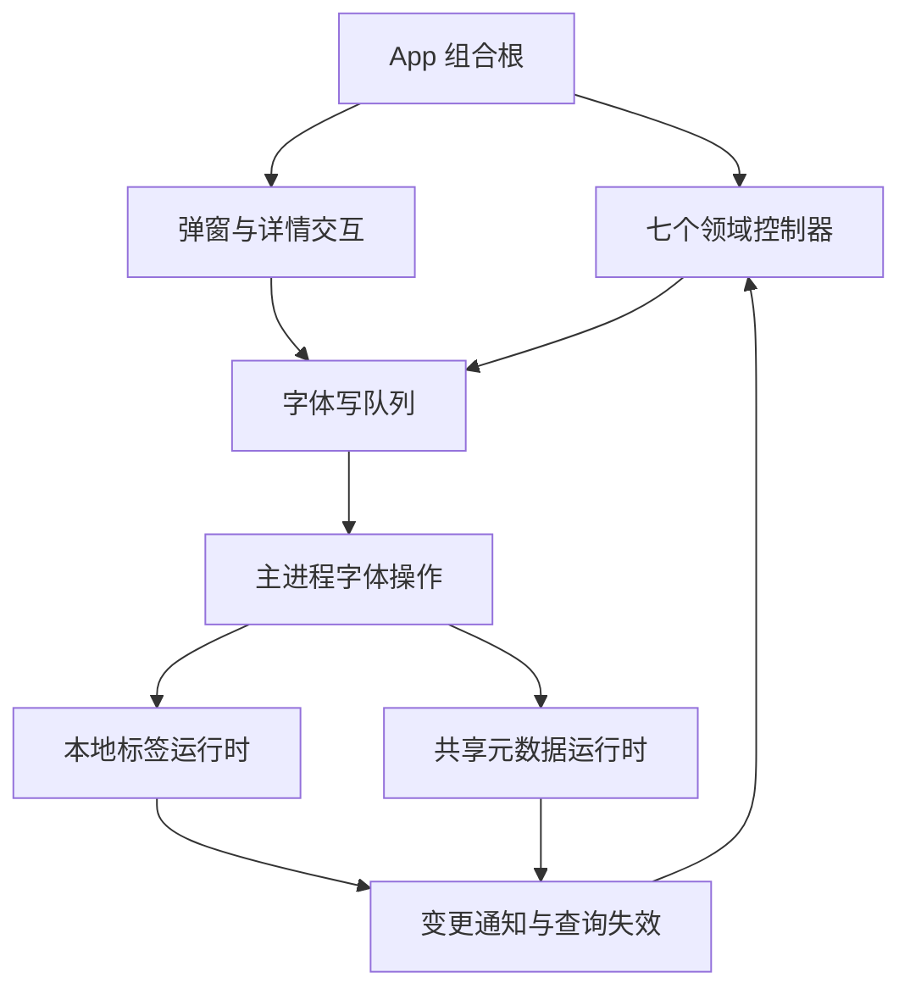

# HanFontManager：预览缓存、本地标签与 App 专项拆分任务书

## 0. 状态、目标与执行边界

- 文档版本：1.1；日期：2026-09-15；软件：3.0.0。
- 状态：规划已完成，所有实施任务尚未开始。本次提交仅新增任务书及文档索引。
- 仓库：uniquenesssta/99；文档分支：stage/07-ipc-security-dependencies。
- 审计代码基线：4cf6c4f20785139def64fa6ba1286764279c81ba。
- 目标文件：previewCacheStorageRuntime.ts（1237 行）、localFontTagsRuntime.ts（821 行）、App.tsx（1062 行）。行数用于追踪，不作为验收指标。
- 用户使用开发模式运行与验收：npm run dev。安装包、NSIS、安装/卸载不属于本专项验收条件；旧任务书中的发布验收属于独立范围。
- 本任务书不代表已授权立即实施所有重构。本轮先提交计划；收到实施指令后按下列 Atomic Task 串行执行。
- 不重编号或覆盖原 Stage 7/8。本专项使用 D-01～D-11 编号；开始代码实施时遵守总任务书的阶段分支规则，以当时最新已接受基线建立一个专项分支，不为每个任务重复建分支。

成功标准：修改本地标签时，不意外覆盖收藏、共享标签、删除保护；预览读写在并发失效下保持一致；根组件能清楚表达协作顺序，领域状态与队列只有一个所有者。

## 1. 审计证据与不能越过的结论

| 编号 | 结论 | 证据与范围 |
| --- | --- | --- |
| F-P1 | 预览写入仅在操作前失效，提交期间读请求能重新缓存旧值 | 隔离执行真实函数、模拟数据库等待：写入后数据库为 ok，紧接读取仍为 missing；TTL 为 1200ms。尚非 Windows 实机复现 |
| F-T1 | Node 标签 hydration 的别名/路径映射为一对一，重复身份会覆盖前项 | 使用真实 identity helper、模拟 SQL 和启用的回退策略：共享 sourceId/path 的 A/B 条目只有 B 得到标签。默认 Rust 路径不在此结论内 |
| A-P1 | 两个批量入口重复构造缓存键、存储分组与查询行 | getPreviewCacheStatus / readCachedPreviewImages 源码确认 |
| A-P2 | 两个批量入口的当前存储工厂返回 local，直接 root/Rust 查询分支不可达 | 当前 tier 工厂与调用点确认；其他单项 root 路径仍有效，不得一并删除 |
| A-T1 | 标签协议、SQL、Rust 适配、事务与通知混合 | 单项、批量、删除流程源码确认；部分 try/catch 跨越提交前后 |
| A-A1 | App 保留大量跨控制器协调与前向回调 | 不是已确认初始化故障；需冻结回调不能在被引用控制器初始化前执行的约束 |
| U-01 | 用户历史上“修改标签影响收藏/共享标签”的根因 | 尚未证明全部来自这三个文件；必须沿字段写入、队列、IPC、合并与回读链查证，不能以拆分代替根因分析 |

前轮审计复跑五组诊断通过：react-composition-controllers、react-composition-domain-controllers、app-root-view-contracts、preview-cache-generation、tag-consistency。前轮没有重跑全量 verify 或 Windows GUI。部分预览/标签旧门禁为源码文字断言，不覆盖 F-P1/F-T1。历史 91/91 是旧验证记录，不得写成本专项结果。

隔离复现脚本不作为永久证据；D-01 必须在仓库重新建立可执行、可审查的故障用例，明确使用真实生产函数及替换的外部依赖。

## 2. 范围与不可破坏契约

允许：三个目标文件、按职责提取的同域模块、必要的直接调用方、诊断及任务记录。

不包含：依赖升级、数据库 schema/缓存协议迁移、Rust/C++ 实现迁移、IPC 改名、preload API 改名、UI/CSS 改版、功能新增、全局 store、通用插件框架、大面积 memo 化、无关大文件治理。

约束：

1. 本地标签、共享标签、favorite、删除保护是独立字段域；任何写入只修改所需字段。共享标签不等于本地标签，两者失败和重试不得串域。
2. 字体身份继续使用现有 id/sourceId/规范化路径规则，不因重构改变持久化主键或历史匹配规则。
3. 保留空标签目录与显式删除标签的区别；清空最后一个字体绑定不自动删除标签目录。
4. Rust 写操作抛错向上传播，不可吞错转 null 后再次 Node 写入；回退仅按现有显式兼容策略允许。
5. 批量事务失败必须回滚，不返回成功 ID；提交后日志/通知失败不能冒充数据库回滚。改变错误返回语义须有独立修复证据。
6. 预览缓存键、尺寸和文本校验、已安装字体路由、本地优先与共享补齐语义保持；missing/failed 已处理状态不等于存在可读取图片。
7. 状态缓存、in-flight、失效 token 必须归同一 owner；预取、补齐、淘汰复用现有实例，不复制队列。
8. 数据库句柄借用/拥有边界不变：本地借用句柄不关闭，自行打开的共享句柄在 finally 关闭。
9. App 七个控制器的状态归属不退回 App；写队列 flush → library 保存 → 关闭确认的顺序保持。
10. 不以放宽断言、重录全部基线、any、无类型万能 options、可变队列外泄换取通过。

## 2A. 强制实施协议（缺项不得判定完成）

本节将原则落实为可审查的交付门槛。当前只新增文档约束，自动门禁尚未实现；不能把本节存在等同于 CI 已经执行检查。若后文建议与本节冲突，以用户当前要求及本节的具体验收要求为准。

### C-01 范围冻结与任务入口

1. 一次仅一个 D 任务处于“实施中”。未经验证的任务不得作为下一任务基线，不把 D-02/D-03 修复与 D-04～D-10 搬迁合并提交。
2. D-01 开始前登记执行 HEAD、branch、工作树状态和开发依赖准备结果。代码基线需包含 Electron 42 / better-sqlite3 12.11.1 兼容修复；保留审计基线以重放历史故障。
3. 每项开工前填写执行卡的“允许文件清单”，精确到文件路径。新增文件要写所属职责、唯一状态所有者、调用方；不得用“相关 runtime”“其他必要文件”等兜底条目。
4. 发现清单外文件必须改动时，先记录具体证据和扩展理由。范围内必要直接调用方调整可按既有授权更新清单继续；涉及数据格式、公开协议、新功能或其他领域重构则暂停该扩展，不借“修顺手问题”扩大任务。
5. 本次文档修订不启动 D-01。未来用户授权某个 D 任务即可执行其必要工作，不增设重复推送审批；自动验证通过后按长期授权推送当前执行分支。

### C-02 变更分类与基线纪律

- 修复：必须给出旧实现失败、新实现通过的同一行为用例；只改变已登记的问题行为。
- 纯拆分：函数可迁移、参数端口可收窄、依赖可重接，但业务条件、排序、时间参数、SQL、缓存键、错误返回、事件顺序不得顺带改变。
- 清理：死分支、未用 import 或重复逻辑清理须有可达性/使用证据；非迁移直接导致的清理单独提交。
- 上游依赖修正属于单独兼容任务，不得混进专项拆分。类型检查通过不代表原生模块可以加载；已有开发环境错误未解决时，不得标记运行验收完成。
- 不整批重录 snapshot/hash，不删除失败断言，不用跳过用例、更换 fixture 预期或宽泛 catch 掩盖问题。结构性夹具改动必须逐项说明“为何测试对象变了而行为期望未变”。

### C-03 状态与模块所有权硬限制

| 对象 | 唯一所有者要求 | 禁止做法 | 证明方式 |
| --- | --- | --- | --- |
| 预览读状态 | cache、in-flight、generation 同一索引访问实例 | 拆开后互相同步、暴露原始 Map、复制缓存 | 构造次数断言、并发失效行为测试、导出表审查 |
| 预取/补齐/淘汰 | 复用已有各自 runtime | 每个入口重复 new、用全局单例掩盖重复实例 | 两入口交错调用及重复初始化测试 |
| 标签事务 | 对应后端存储 owner | 事务内部 await、把目录更新移到事务外、逐项提交冒充原子批量 | 第 N 项失败后真实隔离 DB 回读 |
| 字体写队列 | 既有 Operations 所有者 | App/新 hook 再建队列、公开可变 queue/ref | 所有权扫描、flush/重试计数与字段隔离测试 |
| React 状态 | 既有七个控制器 | 新建镜像 state、通过 effect 双向同步、移动进万能 hook | state/ref 清单逐项对照、重复订阅与清理测试 |
| DB 句柄 | 显式区分借用与拥有 | 关闭借用句柄、异常路径漏 close、跨 owner 隐式转移所有权 | 正常/失败/取消的 open-close 计数 |

新增模块必须能回答：删除它会失去哪一个独立职责？若答案只是“文件短一点”，不允许创建。新增公共参数必须有实际消费者；不传完整 App 上下文、全部 controller、万能 options。禁止新增 any、ts-ignore 或双重断言绕过新增边界类型；遗留类型逃逸需登记，不要求无关范围全面清理。

D-01 必须冻结公开导出、IPC 名称、五个本地标签方法、六组视图输入和状态所有者清单。后续自动门禁依据此清单检查，禁止复制一套与生产无关的模型代替检查。

### C-04 跨字段不干扰是硬门禁

本地标签、共享标签、favorite、删除保护分别登记实际写入字段与权威数据源。每种操作测试均采用“四个字段都有非默认值”的字体对象，操作后对其余三个域作完整比较，并比较无关字体 B/C。

强制测试同一字体的交错顺序：本地标签 → 收藏 → 共享标签 → 保护；通过手动控制 Promise 完成顺序穷举这四个请求的 24 种返回排列。若真实执行器串行，另行断言它只能产生规定顺序，并在允许并发的回读/状态信号边界重放旧响应；不能为了凑用例绕过生产串行协议。

测试必须穿过真实队列/执行器与结果合并逻辑，外部 IPC/文件系统可以替换；不能 mock 掉被审计的 merge/flush/retry 函数。至少验证：

- 已成功字段不会被旧对象快照覆盖；版本过期结果不覆盖新意图。
- 一个域失败，只保留该域待重试数据；成功域不会重复写入。
- “提交成功、通知失败”与“事务失败”结果可区分；不因日志异常声称回滚。
- 写入完成后回读及关闭重开与最终 UI 一致；单次 UI 看起来正确不足以通过。

若出现任意跨域覆盖，该任务验收失败，停止扩大搬迁并先定位真实写入点。历史故障未重现时标记“未定位”，不得写“已根治”。

### C-05 异步、资源与性能门禁

- 异步用例用可控 Promise/时钟稳定排列，不依赖 sleep 猜测竞态，不访问正式字体库。
- 预览必须覆盖：旧读晚于新写、写中开始读、读晚于删除、失败、超时后底层晚完成，以及下一代新请求。不能以只增加 TTL、延迟读取或全局串行阻塞回避一致性问题。
- local/root、Rust 成功/null/抛错、Node 回退允许/禁止分别列出实际可达用例；不可达分支先证明，不虚构执行覆盖。
- 事务验收使用临时真实 SQLite 数据库；mock 只用于故障注入点与外部依赖，必须回读确认回滚和目录一致性。运行该测试的 Node/Electron ABI 要记录，不能用不匹配原生模块的环境假通过。
- App 保留初始化顺序、effect 注册与清理、关闭 flush 顺序。必须验证重复挂载/卸载不增加事件监听、计时器、队列实例；无法观察的指标记为未覆盖。
- 性能不得只凭文件变小声称改善。沿用真实 10k 场景与卡片引用门禁；同机同样本测量，超过原门禁即失败，耗时异常需复测定位，不以本机历史毫秒数字设跨机器绝对标准。

### C-06 各任务最小改动范围与准入证据

以下是职责边界，不替代执行卡中的具体路径清单。

| 任务 | 允许的生产改动 | 不可缺少的准入/完成证据 |
| --- | --- | --- |
| D-01 | 无 | 三文件清单、跨域写入链、两个隔离复现、字段隔离基线；新自动门禁的具体名称与路径 |
| D-02 | 预览索引失效修复 | F-P1 旧失败/新通过；写/删/失败/晚完成测试；不移动模块 |
| D-03 | Node 标签身份 hydration | 合法输入证据、F-T1 重放、分块与去重、回退政策不变；不移动事务 |
| D-04 | 路由/库快照迁移及窄接线 | 缓存身份与副作用摘要不变、单一 availability、旧 Promise 不污染 |
| D-05 | 索引访问迁移及窄接线 | D-02 全保持、Map 不外泄、句柄所有权及唯一实例 |
| D-06 | 批量行构造/读取收敛 | 键与行结果一致、400 分块、状态/图片语义区分、root 分支处理证明 |
| D-07 | Node SQL/事务迁移 | 真实数据库故障回读；字段隔离；提交前后结果语义 |
| D-08 | Rust 适配/业务门面收敛 | 失败不跨后端重放、五个方法契约、通知与查询失效顺序 |
| D-09 | App 菜单/详情/选择组合 | 七控制器所有权不变、初始化反例、选择/详情/输入/拖放行为锁 |
| D-10 | 六组视图接线整理 | 六组类型反例、UI 接线不变、重复挂载清理与性能门禁 |
| D-11 | 仅验收必要修复与记录 | 全量 verify、Windows dev 和跨域矩阵；发现修复必须另立关联提交 |

D-02/D-03 的遗留故障用例在 D-01 可作为明确预期失败的观察项，不能令默认 verify 长期失败；对应修复完成后立即转为必过门禁。纯拆分阶段不得继续容忍同一故障。

### C-07 完成证据、状态与暂停条件

任务状态仅使用：未开始、实施中、自动验证通过待实机、完成、阻塞。最多一个实施中。需要实机结果的任务可以进入“自动验证通过待实机”，后续任务须记录继承的缺口；D-11 不得带必需实机缺口标为完成。

以下任一情况必须停止当前任务收尾或扩大实施：基线不可确认、未解释的用户改动、必过门禁失败、跨域字段变化、破坏公开协议/数据格式、回退发生重复写入、句柄/队列重复所有权、无法证明纯拆分行为等价。停止的是相关扩展或完成判定；允许继续授权范围内定位和修复，不因此反复询问推送权限。

每项执行卡必须全部填写，不允许用“测试通过”“应该没问题”代替证据：

```text
任务：D-__；状态：__
基线 SHA / 分支：__
允许文件（精确路径）及每项职责：__
变更分类：修复 / 纯拆分 / 独立清理
原 owner → 新 owner；导出/调用方变化：__
新增或调整诊断命令/路径：__
旧实现失败证据或迁移前行为摘要：__
新实现结果、退出码、测试环境：__
跨域 X 用例编号及逐项结果：__
全量验证结果；未运行项及原因：__
开发模式实机结果或待验收项：__
实际 changed files 与允许清单核对：__
提交 SHA / 远端 SHA / 回滚提交：__
遗留风险、是否允许进入下一项及原因：__
```

执行卡追加在本任务书实施记录后，README 仅写简洁用户可见变更。Git diff --check、链接检查、文档检查不能替代代码测试；历史 91/91 不能复用为新任务结果；有未完成项必须明确写出。

### C-08 自动约束的落地责任

D-01 必须在仓库现有 diagnostics 体系中定义或复用以下门禁，登记真实脚本名和 fixture 路径；新测试不得只存在于临时目录或会话文字：

1. 公开契约与状态所有权检查：发现重复 owner、原始可变队列外泄、接口丢失时失败。
2. 预览交错读写检查：从 D-02 起为默认必过门禁。
3. 标签身份及字段隔离检查：从 D-03/后端相应任务起为默认必过门禁。
4. 队列与跨域合并检查：真实执行器、失败重试与旧响应矩阵。
5. App 行为和资源检查：复用现有控制器/视图/性能门禁并补缺失场景。

每个新增行为门禁至少一个真实退化变异被拒绝；文本扫描仅辅助结构检查。D-01 没有交付这些检查的明确实现/复用计划和可执行基线，不得直接开始大规模移动代码。C-01～C-08 的完整执行需要后续代码与实机证据，本次文档修订不宣称已经自动强制执行。

## 3. 当前实际协作关系

以下仅表达基线已有关系；建议提取模块尚未实现。



需追踪收藏和共享标签的实际落点与结果合并，不能只检查 localFontTagsRuntime。直接链路审查允许扩展到字体写队列、写入执行器、IPC、状态信号与 library 合并，但无证据不得顺手重构这些模块。

## 4. 目标职责与依赖方向（提案）

### 4.1 预览缓存

| 所有者 | 职责 | 边界 |
| --- | --- | --- |
| 存储路由 | 库快照缓存、根目录识别、目录准备、本地/共享映射 | 持有库 generation；复用 tier/rootAvailability，不拥有索引状态缓存 |
| 索引访问 | 单项读写删除、DB/Rust 后端、读缓存与失效 | cache/in-flight/token 集中；仅提供命令，不暴露 Map |
| 批量读取 | 统一构建查询行与分组、状态判断、图片读取 | 状态入口和图片入口保留不同 acceptedStatuses、文件检查和 touch 时机 |
| 原门面 | 建立唯一实例、连接 hydration/prefetch/eviction、保留公开 API | 显式工厂顺序，禁止不必要的循环 import |

优先检查已有模块能否接收职责，再决定新增文件。建议同目录职责命名，不设目标文件数量或硬性行数。共享 I/O deadline 包装的归属需保证 rootAvailability 唯一实例；不把有副作用的路径准备伪装为纯函数。

### 4.2 本地标签

| 所有者 | 职责 | 边界 |
| --- | --- | --- |
| Node 持久化 | 标签目录与绑定 SQL、读取与事务 | SQL 和事务边界一起移动；不发送 UI 通知 |
| Rust 适配 | 输入转换、执行调用、回退资格及错误传播 | 区分不可用和已执行失败；无静默二次写入 |
| 原业务门面 | 单项/批量/删除协调、统一结果与变更通知 | 保持原五个公开方法和调用方契约 |

身份 helper 继续唯一复用。类型只在有实际跨模块消费时提取到一个契约文件；不复制已有 Rust contracts。可复用标签清洗与生命周期计算，但避免引入无消费者的策略体系。

### 4.3 App

按真实依赖提取交互组合：菜单/弹窗、详情/选择。每块只消费必需的只读视图和命令端口，不拿全部七个 controller 对象。

视图模型沿 topbar/sidebar/content/detail/overlays/developer 六组类型组织。优先同一模块内的命名 builder；只有职责和消费者独立时再分文件。禁止把 1062 行原封不动搬进 useAppController。

App 保留：bridge 检查、controller 创建顺序、跨域接线、最终视图组合。不得为追求更短隐藏初始化时序；不预设所有 callback 必须稳定，性能改动需测量支持。

## 5. Atomic Task 实施清单

统一流程：核对基线与干净工作树 → 固定成功条件 → 新用例先证明问题/锁定契约 → 最小改动 → 定向验证 → 必要全量验证 → README/本表回填 → 原子提交并推送。修 bug 与纯搬迁分开提交。

### D-01 审计基线与跨域行为锁

- 阅读三个文件及直接消费者，记录函数、公开类型、状态/ref、队列、DB 生命周期清单。
- 仓库中重建 F-P1/F-T1 隔离用例；先使当前代码稳定复现，不依赖真实字体或用户数据库。
- 顺着实际写队列/执行器跟踪 localTags/sharedTags/favorite/protection，记录字段写集、重试队列与状态合并点。
- 建立第 6 节跨域矩阵的关键自动测试，真实调用生产函数，不复制一份逻辑作为测试对象。
- 判断多个运行时 ID 共享路径/sourceId 是否在生产输入合法；记录来源与去重契约。如果被上游严格禁止，则将 F-T1 明确为防御性修复，而非默认业务回归。
- 通过条件：基线可重复；故障测试失败原因精确；已有行为锁通过；没有生产代码改动。预期失败诊断暂不加入默认全量入口。

### D-02 修复预览提交与缓存失效时序

- 覆盖写入/删除前已有读、操作中开始读、完成后读以及 A/B 请求反向完成。
- 修复成功提交后的失效，明确失败/超时的处理，防止旧任务回填覆盖新状态。
- local 与 root/Rust 分支分别验证；超时可能不取消底层 I/O，不能把“超时返回”断言为“底层未提交”。
- 通过条件：成功写/删后新读取不命中旧状态；旧请求不得回填污染；失败保持可重试，不产生未处理 rejection；DB close 次数正确。
- 将稳定通过的故障测试纳入长期诊断；独立提交，不搬模块。

### D-03 修复或明确标签多身份 hydration 契约

- 对合法共享身份输入采用 alias/path → ID 集合，去重并给所有关联项分配标签；保持路径规范化规则。
- 覆盖同路径不同 ID、共享 sourceId、重复标签、空输入、缺少路径、同 ID 重复输入、超过 500 项分块。
- Rust 正常返回、Rust 读取失败、回退允许/禁止分别验证；不改变默认回退政策。
- 通过条件：每个合法关联项都获得预期标签；独立字体不串标签；Rust 路径不退化；原输入对象不被意外修改。
- 独立修复提交。若证据证明输入非法，记录约束与测试，不能伪称修好了用户历史故障。

### D-04 提取预览存储路由与共享准备

- 提取 loadLibraryShellCached/invalidateLibraryShellCache 及存储选择；同步与异步入口的副作用差异保留。
- 库失效期间旧 Promise 完成不能覆盖新快照；根目录不可达时本地行为保持。
- 通过条件：缓存身份、目录路径、manifest、deadline 行为及库 generation 用例不变；只存在一个 availability owner。

### D-05 提取索引访问所有者

- 单项读/写/删、缓存键、cache/in-flight/token、DB 打开关闭一并迁移。
- hydration 只接收窄读写命令；eviction 的触发时机保持。
- 通过条件：D-02 全通过；Rust 返回 null、抛错、超时分支被覆盖；公开门面及调用方不变；缓存仍有容量边界。

### D-06 收敛批量预览查询与门面

- 提取共享的行构建/分组，避免两套缓存键生成逻辑；保留 invalid item、无 stat 的返回语义。
- 状态查询和图片读取独立策略，不能把 missing/failed 当可读图片，不能误改 touch 与补齐顺序。
- 对当前不可达 root/Rust 批量分支记录调用路径证明；确认无合法入口后才可独立删除，否则保留并补可达入口测试，不与缓存键更改混提交。
- 通过条件：400 项分块、并发读取上限、共享补齐、预取取消、图片缺失均与基线一致；原门面仅负责组合与兼容导出。

### D-07 提取标签 Node 持久化

- 将目录/绑定读写及 SQL helper 收入同一 owner，保留事务内所有字段更新。
- 对事务第 N 项失败、目录写失败、提交成功后日志或通知失败注入故障，核实结果与真实提交状态一致。
- 如发现提交后异常被报告为回滚，先另立修复用例与提交；纯拆分不静默改变结果语义。
- 通过条件：失败无部分绑定，无成功 ID；清空绑定保留空标签；显式删除移除目录；收藏/共享标签/保护字段不变。

### D-08 提取 Rust 标签适配与收敛业务门面

- 集中 row 转换、回退准入、调用结果边界；复用唯一身份工具。
- 单项/批量/删除保留不同返回信息；通知与日志复用仅限真实共同逻辑。
- 通过条件：Rust 写抛错绝不调用 Node；禁用回退不写数据库；提交后通知和查询失效语义不变；五个公开方法保持兼容。

### D-09 收敛 App 交互组合

- 先整理 context action → dialog → detail → selection 的真实依赖，再分离菜单/弹窗与详情/选择组合。
- 不移动七个 controller 的底层状态，不新建共享全局状态。
- 前向 callback 在初始化期不得被同步执行；补故意提前调用的反例或显式初始化断言。
- 通过条件：单击/Ctrl/Shift/框选、双击详情、重命名/删除确认、标签输入、目录拖放、详情异步竞态与原行为一致。

### D-10 收敛 App 视图接线与性能复核

- 六组视图输入沿现有类型复用，不复制大接口、不使用 any、不透传全部 controller。
- 保持 Hook 调用顺序、effects 清理、严格模式行为及开发诊断开关。
- 复测原 10k 字体数据、滚动相邻窗口卡片引用、详情开关、500 项选择；只优化实测回归。
- 通过条件：六组强类型反例与视图冻结门通过；卡片事件引用仍稳定且读取最新参数；无多余订阅、计时器或队列实例。

### D-11 全链路回归与开发模式验收

- 执行全量 npm run verify，记录实际诊断数量、运行环境和结果；不得沿用 91/91 数字。
- 按第 6 节完成 Windows npm run dev 的实际验收，保存操作步骤与结果，不把编译成功当作业务通过。
- 审查三个门面、依赖方向、状态唯一性、无循环导入、无无用转发层；记录最终行数但不作为完成条件。
- 更新 README、专项任务表、总任务书入口状态；写清已关闭/未关闭问题以及回滚提交。
- 全部必需用例通过才标记专项完成；没有 GUI 结果时写“实现与自动验证完成，GUI 待验收”。

## 6. 防止标签、收藏、共享标签相互破坏的矩阵

测试数据：独立字体 A/B、共享根字体 C、具有相同路径或别名的合法重复视图项、空标签目录；每个字体预设互不相同的本地标签、共享标签、收藏与保护值。测试库必须独立，禁止写用户真实数据。

| 编号 | 操作/故障 | 必须验证的结果 |
| --- | --- | --- |
| X-01 | A 改本地标签 | A 收藏/共享标签/保护不变，B/C 全字段不变 |
| X-02 | A 切换收藏 | 本地/共享标签与保护不变，计数和页面一致 |
| X-03 | C 改共享标签 | 本地标签/收藏/保护不变；共享结果及冲突语义正确 |
| X-04 | 同字体快速依次改本地标签、收藏、共享标签 | 三个域各自保留最后意图；旧对象快照不能覆盖新字段 |
| X-05 | 不同域异步请求反向完成 | 结果按字段合并，旧响应不回滚其他域的新结果 |
| X-06 | 本地标签失败、收藏成功 | 收藏持久化；仅失败域进入重试，不能重放已成功域 |
| X-07 | 共享冲突/离线后恢复 | 本地标签/收藏可保持正确；共享重试与冲突提示不覆盖其他字段 |
| X-08 | 批量第 N 项 SQL 或目录保存失败 | 事务回滚；无虚假成功 ID；所有其他字段保留 |
| X-09 | 删除最后一项绑定、显式删除空标签 | 前者保留目录，后者删除目录；计数与下拉同步 |
| X-10 | 编辑后立即关闭，再开发模式启动 | flush/save/关闭确认顺序正确；四个字段域持久化一致 |
| X-11 | 快速筛选、目录切换、滚动、详情开关 | 老请求不覆盖新页面；标签/收藏显示、预览与选中项匹配 |
| X-12 | 预览写入/删除与读取交错 | 提交后不读取过期缓存；旧任务不污染新 generation |
| X-13 | Node 回退允许/禁止与 Rust 写失败 | 准入一致；写失败无第二后端重放；重复身份读取正确 |

自动测试优先覆盖字段级快照、数据库回读、队列内容、IPC 次数、信号与查询 revision。GUI 重点覆盖 X-01～X-05、X-07、X-09～X-11；故障注入 X-06/X-08/X-12/X-13 使用隔离测试，不能让用户破坏正式库。

## 7. 验证命令与执行要求

```bash
npm run verify
npm run dev
```

依赖未变化不要求重复 npm ci。Electron 二进制缺失时按已确认的安装入口补齐，然后重新执行 dev；这属于环境前置，不计为重构业务验收。

沿用已有 diagnostics 命名和 run-all 发现方式。新增测试必须能在旧错误实现上失败、修复后通过，并至少有一个退化变异能被拒绝。不要仅以源码包含函数名或 token hash 证明事务、异步与字段隔离正确。

涉及源码文本的门禁同时覆盖 LF/CRLF。只在结构确实迁移时调整模块加载夹具，不整体重新生成行为期望。每个纯搬迁任务跑相关旧门禁；跨模块收尾及修复验收跑全量 verify。记录真实执行命令与退出码。

## 8. 回滚、暂停与变更控制

- 每项独立原子提交；已发布变更使用 revert 回滚，不强推或重写已共享历史。
- 修复提交和搬迁提交分离，回滚结构时尽可能保留已验证的正确性修复。
- 数据格式不变，回滚无需数据迁移；若实际需要迁移，停止本任务并单独评估。
- 测试发现其他域被覆盖时，暂停扩大拆分，保留复现与字段差异，先定位真正写入点。
- 发现必须改变旧行为时，记录问题编号、用户影响、测试和独立修复任务，不能悄悄更改冻结基线。
- 远端前进时重新核对差异与基线；推送只允许正常快进，不覆盖别人提交。

## 9. 实施记录

| 任务 | 状态 | 提交 | 自动验证 | 开发模式/遗留 |
| --- | --- | --- | --- | --- |
| D-01 | 未开始 | — | — | — |
| D-02 | 未开始 | — | — | — |
| D-03 | 未开始 | — | — | — |
| D-04 | 未开始 | — | — | — |
| D-05 | 未开始 | — | — | — |
| D-06 | 未开始 | — | — | — |
| D-07 | 未开始 | — | — | — |
| D-08 | 未开始 | — | — | — |
| D-09 | 未开始 | — | — | — |
| D-10 | 未开始 | — | — | — |
| D-11 | 未开始 | — | — | — |

本任务书建立后的下一步：收到实施指令后从 D-01 开始，先固定跨域行为与复现证据，不直接搬动三个文件。
