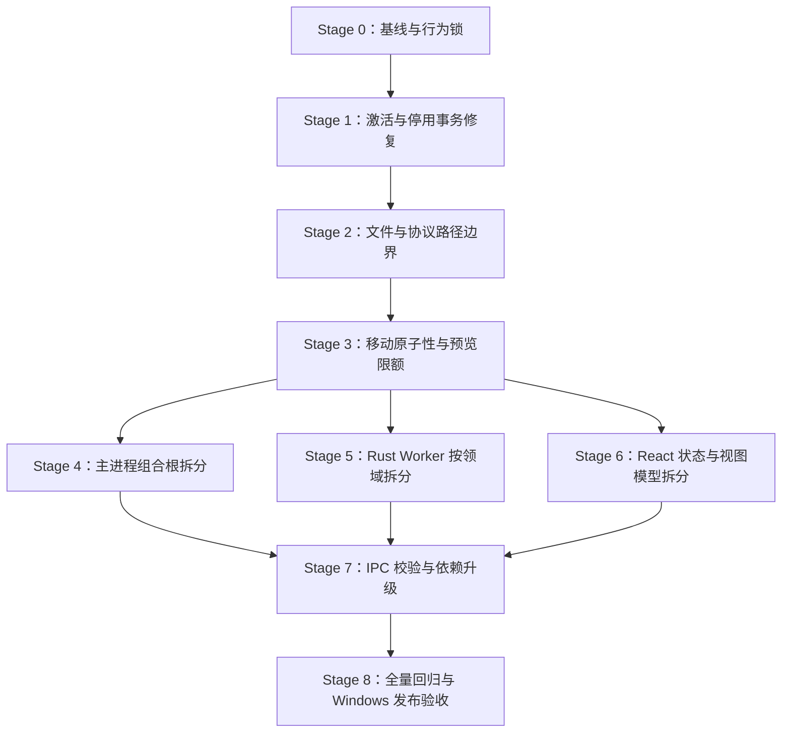

# HanFontManager 修复与编排重构总任务书

## 0. 文档状态

- 文档版本：1.0
- 建立日期：2026-09-01
- 代码基线：`9e6eab51384f63804b1bb04e27e83c8bed18dc31`
- 当前阶段：Stage 0「基线与行为锁」
- 当前阶段任务书：[`HFM_STAGE_00_BASELINE_TASKBOOK.md`](HFM_STAGE_00_BASELINE_TASKBOOK.md)
- 适用平台：Windows 10/11 x64；本地字体库与 NAS/共享字体库
- 本任务书是修复顺序、拆分边界和阶段门禁的唯一主文档。阶段执行细节放入对应阶段任务书，不在多个文档重复维护。

## 1. 目标与不可妥协项

本轮工作同时解决已确认的正确性、安全性和可维护性问题，但严格分阶段执行，禁止把行为修复、全文件搬迁和依赖升级混在同一个原子任务中。

最终目标：

1. 激活、停用、安装、卸载和文件移动必须真实反映底层成功或失败，不允许“界面成功、系统失败”。
2. 渲染进程不能借字体协议、预览或破坏性 IPC 读取、删除、移动任意本地文件。
3. Rust、C++、PowerShell 预览路径使用同一输入限额和同一结果语义。
4. `src/main/index.ts` 只保留应用组合与启动注册；不拥有领域算法。
5. `src/main/rust-core/rustCoreWorkerRuntime.ts` 只保留稳定门面；协议、传输和领域命令各自归位。
6. `src/renderer/src/App.tsx` 只组合有明确状态所有权的控制器，并向视图传递分组、强类型的视图模型。
7. 每个 Atomic Task 独立验证、独立提交、可单独回退。前一硬门禁失败时，禁止进入下一任务。

不可妥协项：

- 不以“文件变短”代替职责拆分。
- 不创建只转发参数、没有稳定职责的空壳模块。
- 不用 `any`、全局状态或一个新的巨型 Hook 掩盖原有耦合。
- 不降低现有诊断强度，不删除失败用例，不用静态文本匹配冒充行为验证。
- 不在未确认前增加生产依赖；本计划默认使用现有 TypeScript、React 和 Node 能力。
- 不因重构改变缓存键、数据库格式、IPC channel、Rust CLI 参数或用户可见行为；确需改变时先写兼容与迁移方案。
- 每个 Stage 使用一个独立分支，命名为 `stage/NN-<scope>`；当前阶段通过并被接受后，再以其完成基线创建下一阶段分支。一个阶段内仍按 Atomic Task 独立提交。

## 2. 本次 `git pull` 的本地影响

从清理提交之前的 `main` 拉取到本基线时，Git 只处理仓库内受版本控制的内容：

| 类别 | 拉取后的变化 | 不受影响的内容 |
| --- | --- | --- |
| 已跟踪私钥 | 两把仓库内私钥被删除 | Git 历史中的旧副本不会因普通 pull 消失；必须轮换密钥 |
| 构建输出 | `out/`、Rust `target/`、预编译 `hfm-core-worker.exe` 被删除并忽略 | 已安装在仓库外的软件不会被卸载 |
| 保留的原生文件 | `hfm-font-helper.exe`、`hfm-preview-renderer.exe` 继续保留 | 其运行链路不因本次 pull 中断 |
| 项目文本 | README、`.gitignore`、安全说明和 `package-lock.json` 更新 | 字体库、NAS 内容、用户数据库、日志和仓库外文件不会被 Git 主动改动 |
| 依赖目录 | `node_modules/` 不由 Git 管理 | pull 不等于 `npm ci`，不会自动重装依赖 |

安全拉取前置检查：

```bash
git status --short
git fetch origin
git diff --name-status HEAD..origin/main
git pull --ff-only
```

如果 `git status --short` 显示本地改动与远端同路径重叠，先提交、暂存或人工备份；Git 通常会拒绝覆盖或要求解决冲突。不要把旧私钥继续用于正式签名，即使为了留档将其复制到了仓库外。

## 3. 已确认问题与优先级

| ID | 级别 | 问题 | 主要证据位置 | 修复阶段 |
| --- | --- | --- | --- | --- |
| F-01 | P0 | 单个资源停用忽略底层 `ok: false`，可能返回假成功 | `fontResourceSessionRuntime.ts` | Stage 1 |
| F-02 | P0 | 批量停用忽略资源移除结果，失败数固定为 0，并可能提前丢弃激活状态 | `fontDeactivationBatchRuntime.ts` | Stage 1 |
| F-03 | P0 | 单字体激活在复制、注册表或资源添加中途失败时缺少逆序回滚 | `fontActivationSessionRuntime.ts` | Stage 1 |
| F-04 | P0 | `hfm-font://` 与预览数据接口可按渲染进程传入的路径读取本地文件 | `windowRuntime.ts`、`previewFontDataRuntime.ts`、`fontPathResolverRuntime.ts` | Stage 2 |
| F-05 | P0 | 物理文件夹操作和托管卸载的主进程路径边界不足 | `physicalFolders.ts`、`currentUserManagedInstallRuntime.ts` | Stage 2 |
| F-06 | P1 | 跨卷移动采用 copy 后 unlink；unlink 失败时留下重复文件且结果语义不足 | `physicalFolders.ts` | Stage 3 |
| F-07 | P1 | Rust 预览限制最大尺寸，C++/PowerShell 回退路径只限制最小值 | 原生预览链路 | Stage 3 |
| F-08 | P1 | Electron/electron-builder 打包链存在已知高危依赖；生产依赖审计为 0 | `package.json`、`package-lock.json` | Stage 7 |
| F-09 | P2 | 少数窗口控制 IPC 未走统一来源校验 | `windowRuntime.ts` | Stage 7 |
| F-10 | P2 | 打包 URL 校验使用字符串前缀，边界不如 URL 结构比较明确 | `appSecurityRuntime.ts`、`ipcSenderValidation.ts` | Stage 7 |
| A-01 | 架构 | 主进程组合根同时承担初始化顺序、适配器、延迟绑定和注册参数汇总 | `src/main/index.ts` | Stage 4 |
| A-02 | 架构 | Rust Worker 文件同时拥有约 80 个公开类型、传输、诊断和 38 个命令门面 | `rustCoreWorkerRuntime.ts` | Stage 5 |
| A-03 | 架构 | React 根组件拥有大量领域状态/Ref，并向 `AppRootView(props: any)` 传递约 170 项属性 | `App.tsx`、`AppRootView.tsx` | Stage 6 |

## 4. 总体执行顺序



Stage 4、5、6 在 Stage 3 完成后可以分别推进，但同一工作区仍按原子提交串行落地，避免交叉修改 `index.ts`、共享类型和调用方造成不可审查的大提交。

## 5. 通用 Atomic Task 规则

每个任务必须依次完成：

1. **范围确认**：列出允许修改的文件与明确不修改的相邻模块。
2. **失败用例**：修 Bug 前先建立能在旧实现上失败的行为测试或诊断；纯搬迁任务先建立 API/行为快照。
3. **最小实现**：只实现本任务目标，不顺手扩修。
4. **受影响门禁**：运行类型检查、定向诊断和相关构建。
5. **全量门禁**：运行 `npm run verify`；门禁失败立即停止后续任务。
6. **差异审查**：确认没有锁文件漂移、意外生成物、私钥、调试日志或无关格式化。
7. **提交与记录**：一个 Atomic Task 一个可回退提交；更新主任务书状态和 README 变更记录。

默认验证矩阵：

| 任务类型 | 最低验证 | 额外要求 |
| --- | --- | --- |
| 行为修复 | `npm run typecheck`、新增定向诊断、`npm run diagnostics:all` | Windows 实机故障注入或可重复替身 |
| 主进程重构 | 上述全部 + Electron/Vite build | 启动、退出、数据库关闭和 watcher 生命周期烟测 |
| Rust 门面重构 | 上述全部 + `npm run rust:build` | 协议版本、能力表、daemon/fallback 路由一致 |
| React 重构 | 上述全部 + renderer build | 选择、滚动、筛选、详情、批量操作手工烟测 |
| 依赖升级 | `npm ci`、`npm audit`、完整 build | Windows 打包、安装、启动、卸载烟测 |

## 6. 分阶段任务

### Stage 0：基线与行为锁

目标：先把真实行为与错误语义锁住，防止后面的修复和拆分互相掩盖。具体执行清单见当前阶段任务书。

#### AT-0.1 固化环境与审计基线

- 记录 Node/npm/Rust/Cargo/Windows SDK/VS Build Tools 版本。
- 记录 `npm ci`、`npm run verify`、Electron/Vite build、Rust build 的结果。
- 记录当前三大文件的职责、公开接口、行数和依赖方向；行数只作趋势指标。
- 保存 `npm audit` 与 `npm audit --omit=dev` 的分离结果。

硬门禁：基线信息可复现；环境缺失必须明确标记，不能写成代码失败或验证通过。

#### AT-0.2 建立激活事务故障注入诊断

- 为复制失败、注册表写失败、资源添加返回 `ok: false`、回滚失败建立可控替身。
- 断言返回值、激活状态文件、临时文件、注册表操作和删除队列的最终状态。
- 为批量部分失败定义逐项结果和总计规则。

硬门禁：基线观察命令在旧实现上能精确复现 F-01/F-02/F-03，且不会修改真实系统字体或注册表；该命令不进入 `diagnostics:all`，Stage 1 修复时再转成长期硬门禁。

#### AT-0.3 建立路径边界与协议诊断

- 覆盖合法字体、非字体文件、目录、相似前缀目录、`..`、符号链接/联接点和不存在路径。
- 覆盖开发 URL、打包 URL、伪造来源和协议编码差异。
- 为读取操作与破坏性操作分别定义授权根，不共用过宽策略。

硬门禁：基线观察命令能证明旧实现至少接受一项越界路径；该命令不进入 `diagnostics:all`，Stage 2 修复时再转成长期拒绝门禁。

#### AT-0.4 建立拆分契约快照

- 锁定主进程最终注册 payload 的能力键集合。
- 锁定 Rust Worker 门面的公开方法、命令参数、能力检查、空值回退和错误日志语义。
- 为 `AppRootView` 建立强类型目标契约和关键用户流程清单。

硬门禁：快照检查验证接口集合与必需行为，而不是匹配源文件行号或大段文本。

### Stage 1：激活、停用与托管安装事务正确性

#### AT-1.1 修复字体资源单项结果传播

范围：`fontResourceSessionRuntime.ts` 与其定向诊断。

- Rust/native helper 返回条目时必须检查条目 `ok`。
- 失败原因原样向上返回；只有明确成功才更新会话状态。
- Rust 不可用与 Rust 已执行但失败必须区分，后者不能静默走 fallback 重复操作。

硬门禁：资源移除 `ok: false` 时上层收到失败，状态不被误删。

#### AT-1.2 修复批量停用的逐项结算

范围：`fontDeactivationBatchRuntime.ts`、必要的结果类型与诊断。

- 消费批量资源移除结果，逐项累计成功/失败。
- 注册表删除、资源移除、临时文件清理分别记录，不以一个布尔值覆盖全部阶段。
- 只有达到既定“已停用”条件的项才能删除持久状态。
- 清理失败进入持久删除队列；资源仍活动时不得报告停用成功。

硬门禁：混合成功/失败批次的 `success`、`failed`、逐项消息和持久状态完全一致。

#### AT-1.3 为单项激活加入逆序补偿

范围：`fontActivationSessionRuntime.ts` 及已有 copy/cleanup/runtime 类型。

- 将步骤建模为复制 -> 注册表 -> 资源添加 -> 状态提交。
- 任一步失败时按资源移除 -> 注册表删除 -> 临时文件删除逆序补偿。
- 补偿本身失败时返回复合错误并进入持久清理队列，禁止吞错。
- 状态提交是最后一步；状态写失败同样触发补偿。

硬门禁：每个故障点都没有无记录的孤儿文件、注册表项或资源会话。

#### AT-1.4 批量激活复用单项事务语义

- 批量编排只控制并发、取消和汇总，不复制事务算法。
- 单项失败不污染其他项；取消后已提交项与未提交项边界清晰。
- 保存队列在退出前仍遵守耐久性门禁。

硬门禁：批量故障注入、取消和重试均不产生假成功。

### Stage 2：字体读取与破坏性操作的路径边界

#### AT-2.1 建立中央路径授权策略

目标文件：扩展 `src/main/path/fontPathPolicy.ts`，必要时增加同目录的窄职责模块。

- 使用规范化后的绝对路径与真实路径进行边界判断，避免字符串前缀误判。
- 字体读取至少要求：允许扩展名、普通文件、文件大小上限、处于当前授权根或能由主进程索引身份解析。
- 破坏性操作要求更窄：必须属于当前 watched root 或应用自有目录，并按操作类型限制源/目标。
- 明确 Windows 大小写、UNC、长路径、junction/symlink 的处理规则。

硬门禁：所有合法根与越界变体通过数据驱动测试；策略不依赖 renderer 提供“我已授权”的标志。

#### AT-2.2 收紧 `hfm-font://` 与预览数据读取

- 协议和预览 IPC 共用中央字体读取授权器。
- 优先使用主进程维护的字体 ID/授权令牌解析路径；兼容期若仍接收路径，也必须经主进程授权根与真实文件校验。
- 拒绝非字体、目录、过大文件和越界真实路径。
- 对响应设置准确 MIME；不把任意本地数据暴露为可跨域读取资源。

硬门禁：正常字体卡片、详情预览、系统字体和临时激活字体仍可显示；文本/数据库/私钥路径全部拒绝。

#### AT-2.3 收紧物理文件夹和字体移动 IPC

- 主进程重新解析当前 watched roots，不信任 renderer 传入的根集合。
- 创建/重命名目标必须位于授权根下；移动源必须是已索引的允许字体，目标必须是授权目录。
- 操作前后均校验真实路径；对竞态中的替换/junction 变化返回失败。

硬门禁：相似前缀目录、跨根越界、非字体源和目录替换均不能产生写操作。

#### AT-2.4 收紧托管字体卸载

- 同时验证规范化真实路径位于应用自有字体目录，文件名满足应用生成规则，并能与注册表记录对应。
- 任何一项不满足时拒绝删除，不以 basename 前缀作为唯一所有权证明。
- 失败必须向 UI 返回真实结果。

硬门禁：无法卸载同名但不属于应用管理的系统/用户字体。

### Stage 3：文件移动一致性与预览资源限额

#### AT-3.1 重写跨卷移动提交协议

- 在目标目录写入唯一临时文件，完成 copy、flush/close 和尺寸/必要摘要校验后原子 rename。
- 目标提交成功后再删除源文件。
- 源删除失败时返回“目标已提交、源仍存在”的部分成功状态，触发索引对账；禁止报告完全成功。
- 任何预提交失败清理临时文件；已存在目标文件不得静默覆盖。

硬门禁：复制失败、目标 rename 失败、源 unlink 失败和进程中断场景都有可恢复结果。

#### AT-3.2 统一所有预览后端输入限额

- 在进入 Rust/C++/PowerShell 之前统一 clamp 或拒绝 width、height、fontSize、text length。
- Rust 侧保留第二道防线；C++ 和 PowerShell 回退路径采用同一常量契约。
- 记录被修正或拒绝的异常请求，避免无限日志。

硬门禁：三条后端对边界值给出一致结果，超大请求不分配不可控位图。

### Stage 4：拆分 `src/main/index.ts`

#### 二次审计结论

该文件是合法的应用组合根，但当前还拥有四类可独立职责：基础设施构建、数据/索引服务构建、写操作服务构建、生命周期与 IPC 注册适配。真正需要拆的是这些“组合阶段”，不是把每一段 const 机械搬到单独文件。

目标形态：

| 模块 | 唯一职责 | 明确不做 |
| --- | --- | --- |
| `index.ts` | 读取应用入口环境，创建顶层 runtime，注册主进程 | 不实现查询、标签、安装、预览或 watcher 算法 |
| `mainCoreCompositionRuntime.ts` | 日志、路径、授权、Rust、Windows 能力和性能基础设施 | 不打开业务数据库，不注册 IPC |
| `mainDataCompositionRuntime.ts` | SQLite、library、cache、root/merged index、preview 数据服务 | 不拥有字体安装与文件写事务 |
| `mainMutationCompositionRuntime.ts` | 标签、安装、激活、文件夹等写服务的强类型组装 | 不拥有窗口生命周期 |
| `mainOperationsCompositionRuntime.ts` | watcher、后台任务、维护、安装状态刷新 | 不改变领域结果语义 |
| `mainApplicationRuntime.ts` | 组合上述窄接口，生成注册 payload 与 shutdown hooks | 不重新导出所有内部实现 |

#### AT-4.1 定义组合层强类型契约

- 为上述每个 runtime 定义最小返回接口与显式生命周期所有权。
- 消除新增边界上的 `any`；先不搬实现。
- 对当前延迟绑定 Ref 和回调环建立依赖图，区分真正循环与初始化顺序问题。

硬门禁：TypeScript 能阻止遗漏注册能力和 shutdown hook。

#### AT-4.2 提取 Core 与 Data 组合阶段

- 先 Core、后 Data；每次只搬迁已有初始化，不重写算法。
- 数据库句柄的创建/关闭保持同一所有者；不得跨层复制 close 调用。
- 公开窄接口，禁止把整个依赖对象继续向下透传。

硬门禁：导入模块不产生额外副作用；启动日志、数据库路径和 schema audit 顺序一致。

#### AT-4.3 提取 Mutation 与 Operations 组合阶段

- mutation 层只接受需要的查询/基础设施端口。
- watcher/background/maintenance 的 start/stop/flush 由 operations 层显式返回。
- 将可避免的 late-binding Ref 改为显式两阶段绑定；保留的循环必须写明原因和单一赋值点。

硬门禁：启动、索引、刷新、退出、异常退出路径与基线一致。

#### AT-4.4 收敛入口和注册 payload

- `index.ts` 最终只显示组合顺序和应用注册，读者能在一屏内理解启动拓扑。
- 注册 payload 按 `lifecycle/query/mutation/maintenance/preview` 分组并保持 channel 兼容。
- 删除仅为旧文件搬迁存在的转发函数和无用 import。

验收以职责和依赖方向为准；行数只作为提示，不把“低于某个数字”设为通过条件。

### Stage 5：拆分 `rustCoreWorkerRuntime.ts`

#### 二次审计结论

该文件的耦合源不是单个超长算法，而是把约 80 个公开类型、约 30 个 payload 类型、worker 诊断、daemon/scheduler 传输、临时 JSON 文件协议、结果归一化和 38 个领域命令放在同一门面中。可以稳定拆分，因为大多数命令已通过 `runRustCoreScheduledCommand` 汇合；必须先固定错误与 fallback 语义。

目标形态：

| 模块组 | 内容 |
| --- | --- |
| `rustCoreWorkerContracts.ts` | 供主进程其他领域消费的稳定公开 Input/Result/Status 类型 |
| `rustCoreWorkerPayloadTypes.ts` | Rust stdout JSON 的私有宽松 payload 类型 |
| `rustCoreWorkerTransportRuntime.ts` | path/handshake/capability、daemon/scheduler、abort、超时、临时输入文件生命周期 |
| `clients/rustIndexingClientRuntime.ts` | 列表、解析、root/merged index、watcher preflight |
| `clients/rustMetadataClientRuntime.ts` | local tags、shared metadata、install status |
| `clients/rustPreviewClientRuntime.ts` | preview cache 与 DirectWrite render |
| `clients/rustWindowsClientRuntime.ts` | resource、registry、notify、activation files、system fonts、folder tree |
| `clients/rustMaintenanceClientRuntime.ts` | health check 与 backup |
| `rustCoreWorkerRuntime.ts` | 组合 transport 与各 client，保留兼容门面 |

#### AT-5.1 提取公开契约与私有 payload

- 更新所有只需要类型的调用方改从 contracts 导入。
- payload 类型不得被领域外部消费。
- 无运行时代码改动。

硬门禁：公开方法和类型集合快照不变；无循环依赖。

#### AT-5.2 提取 transport

- transport 统一拥有 worker 诊断缓存、scheduler/daemon、abort 合并、命令执行和临时文件清理。
- 明确区分：能力不可用、命令未提交、daemon 已提交后失败、Rust 返回 `ok: false`。
- 领域 client 不能自行调用 `execFile` 或复制临时文件模板。

硬门禁：超时、取消、daemon/fallback、日志节流行为与基线一致。

#### AT-5.3 按领域逐个提取 client

- 提取顺序：maintenance -> preview -> Windows -> metadata -> indexing。
- 每个提交只迁移一个 client 组，门面的方法名和调用签名保持不变。
- 归一化函数与其 payload 同领域放置；真正跨领域的纯函数才进入 shared。

硬门禁：每组迁移后运行其定向诊断、Rust build 与全量 verify。

#### AT-5.4 收敛兼容门面

- facade 只创建 transport、创建 clients、组合公开方法。
- 禁止出现新的“万能 options”或把所有领域依赖塞回一个类型。
- 记录未来协议升级入口，但本阶段不更改协议版本。

### Stage 6：拆分 `App.tsx` 与 `AppRootView`

#### 二次审计结论

`App.tsx` 已经提取了大量 effect 和 runtime，但状态与 Ref 仍集中在根组件；随后把约 170 个平铺属性交给 `AppRootView(props: any)`，使严格 TypeScript 在最关键的 UI 边界失效。若直接继续提 Hook，只会形成新的 God Hook。正确顺序是先给视图分组建模，再按状态所有权提控制器。

目标状态所有权：

| 控制器 | 独占状态/职责 | 输出 |
| --- | --- | --- |
| `useLibraryController` | library shell、持久化、数据库派生刷新、共享元数据同步 | library model、刷新命令 |
| `useBrowseController` | sidebar、toolbar、filters、database page、family groups、virtual layout | sidebar/content view model |
| `useSelectionController` | 单选/多选、锚点、框选、详情显示、上下文菜单和对话框目标 | selection/detail/overlay model |
| `usePreviewController` | 字体预览队列、native detail、失败集合、滚动暂停/恢复 | preview model 与请求命令 |
| `useFontOperationsController` | 安装、卸载、激活、停用、删除、标签写队列与 install status | 受忙状态保护的操作命令 |
| `useFolderController` | 物理目录树、展开、拖放和写操作 | folder model 与命令 |
| `useDeveloperController` | 仅开发态诊断与日志 | developer view model |

#### AT-6.1 消除 `AppRootView(props: any)`

- 定义 `AppRootViewProps`，按 `topbar/sidebar/content/detail/overlays/developer` 分组。
- 子组件只接收自己的强类型 props，不允许把根 props 整包下传。
- 删除 App.tsx 中已经不再使用的旧组件 import。

硬门禁：strict TypeScript 能在属性遗漏、错名和类型错误时失败；UI 行为不变。

#### AT-6.2 提取只读派生与 Browse 控制器

- 先移动纯派生计算与查询参数建模，再移动其最小状态。
- 保持 deferred search、数据库分页、family view、虚拟布局和滚动恢复时序。
- 不引入新的全局 store。

硬门禁：搜索、组合筛选、排序、列表/网格/家族视图和滚动定位通过烟测。

#### AT-6.3 提取 Selection、Folder 与 Preview 控制器

- 每一份 state/ref 只能有一个所有者；跨控制器通过窄命令或只读值协作。
- preview 队列不得依赖整个 App 状态对象。
- selection 与详情 hydration 的竞态序号保持不变。

硬门禁：单击、Ctrl/Shift 多选、框选、双击详情、拖放目录和快速滚动预览无回归。

#### AT-6.4 提取 Operations、Library 与 Developer 控制器

- 写队列、autosave、unload flush 和数据库 refresh 的生命周期不能分散到多个所有者。
- 开发诊断必须在生产构建中保持惰性。
- `App.tsx` 最终只检查 preload、组合 controllers/view models、渲染 `AppRootView`。

硬门禁：写后刷新、关闭窗口 flush、共享标签冲突提示、批量系统操作全部通过。

#### AT-6.5 渲染性能复核

- 记录关键控制器返回对象的稳定性；避免每次 render 重建导致子树全量刷新。
- 对 1 万字体数据执行搜索、滚动、详情开关和批量选择对比。
- 只有测量证明需要时才加入 memo；禁止先验式大面积 memo 化。

### Stage 7：IPC 收口与依赖治理

#### AT-7.1 统一全部 IPC 来源校验

- 窗口控制 channel 也通过中央 sender validation。
- 使用解析后的 protocol/origin/path 精确比较开发与打包页面，不使用宽松字符串前缀。
- 为导航和新窗口拒绝策略补充测试。

#### AT-7.2 制定并执行依赖升级矩阵

- 执行时查询 Electron、electron-builder、Vite 等官方兼容信息，不在任务书中冻结未经验证的“最新版”。
- 先升级直接依赖，一次一个兼容组；禁止 `npm audit fix --force`。
- 每次升级记录解决的 CVE、剩余风险、运行时/仅构建时暴露面和回退版本。
- 若必须增加或替换生产依赖，先向用户说明收益、大小、安全与维护成本并取得决定。

硬门禁：`npm audit --omit=dev` 保持 0；构建链高危项被消除或有明确、限期、可验证的风险接受记录。

### Stage 8：全量回归与发布验收

#### AT-8.1 干净环境可重复构建

- 新目录 clone，执行 `npm ci`、`npm run verify`、`npm run rust:build`、Electron/Vite build。
- 确认锁文件只使用可公开访问的 registry，仓库无私钥和可重建输出。

#### AT-8.2 Windows 安装包与系统能力烟测

- 未签名测试包：安装、启动、退出、卸载。
- 本地/UNC/NAS 字体库：扫描、分页、预览、标签、文件夹和 watcher。
- 字体：安装/卸载、临时激活/停用、混合批量失败、重启清理。
- 维护：备份、健康检查、缓存清理、异常退出恢复。

#### AT-8.3 发布安全门禁

- 使用从未进入 Git 的生产私钥，在仓库外安全注入。
- 轮换所有曾提交的密钥，并验证旧签名/许可证策略。
- 对产物执行完整性、公钥同步和 Windows 安装包验证。

## 7. “拆得完美”的可验收定义

绝对意义上的“完美”无法在重构前承诺，但可以把你希望的结果变成客观门禁。三个巨型文件只有同时满足下列条件才算完成，而不是仅看行数：

1. 每个状态、句柄、队列和生命周期只有一个明确所有者。
2. 模块名能准确说明业务职责，公开接口是窄类型，不透传万能依赖对象。
3. 依赖方向单向；不存在隐式初始化顺序、重复关闭、重复 fallback 或新增循环依赖。
4. `AppRootView` 等关键边界不使用 `any`；Rust 私有 payload 不泄漏给业务层。
5. 入口/门面只组合，不实现领域算法；领域模块不反向注册应用入口。
6. 所有修复前失败用例、既有 63 项诊断、构建与 Windows 烟测通过。
7. 同等数据规模下，启动、查询、滚动、预览、写入和退出性能不劣于基线；任何退化都有测量与决定记录。
8. 拆分后删除旧转发层和废弃 import，不保留“双架构长期并存”。

参考性趋势（不是硬性通过数字）：`index.ts`、Rust facade、`App.tsx` 应大幅缩短；若文件仍长但只表达一项复杂而内聚的职责，可以接受。反之，即使文件很短，只要状态所有权模糊或靠 `any` 串联，也视为拆分失败。

## 8. 回滚与停止条件

出现以下任一情况立即停止当前阶段，不继续叠加修改：

- 前一阶段门禁失败或只能通过降低诊断强度来通过。
- Windows 实机结果与替身测试不一致。
- 路径授权误伤合法系统字体、UNC/NAS 或临时激活路径，且无法明确解释。
- 重构引入数据库双重所有权、重复 watcher、重复 daemon 或 shutdown 卡死。
- 依赖升级要求未批准的生产依赖、协议迁移或数据迁移。
- Git 差异出现私钥、许可证、字体资产、缓存、`out/`、Rust `target/` 或无关用户改动。

回滚单位始终是当前 Atomic Task 的提交；不得用破坏性 reset 清除用户已有工作。回滚后把失败原因、复现命令和下一决策写回阶段任务书。

## 9. 阶段完成记录

| 阶段 | 状态 | 完成提交 | 验证摘要 | 备注 |
| --- | --- | --- | --- | --- |
| Stage 0 | 进行中 | - | AT-0.1 通过；AT-0.2 复现 7 个事务缺陷并锁定 1 个安全行为 | 分支 `stage/00-baseline-behavior-locks`；Rust/Windows 实机待验证 |
| Stage 1 | 阻塞于 Stage 0 | - | - | - |
| Stage 2 | 阻塞于 Stage 1 | - | - | - |
| Stage 3 | 阻塞于 Stage 2 | - | - | - |
| Stage 4 | 阻塞于 Stage 3 | - | - | - |
| Stage 5 | 阻塞于 Stage 3 | - | - | - |
| Stage 6 | 阻塞于 Stage 3 | - | - | - |
| Stage 7 | 阻塞于 Stage 4/5/6 | - | - | - |
| Stage 8 | 阻塞于 Stage 7 | - | - | - |
