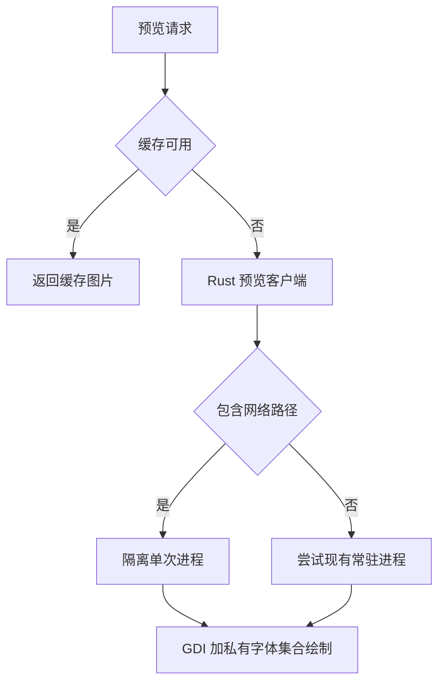
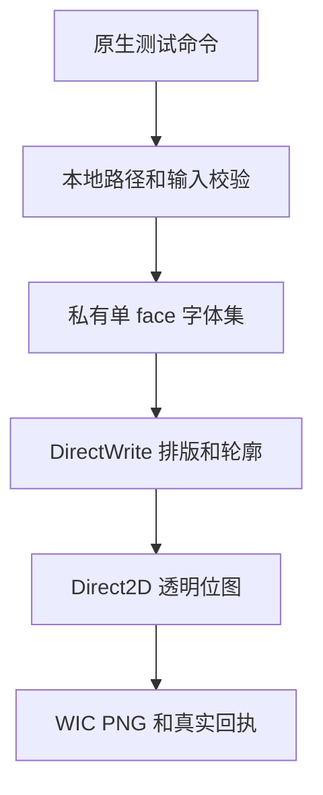
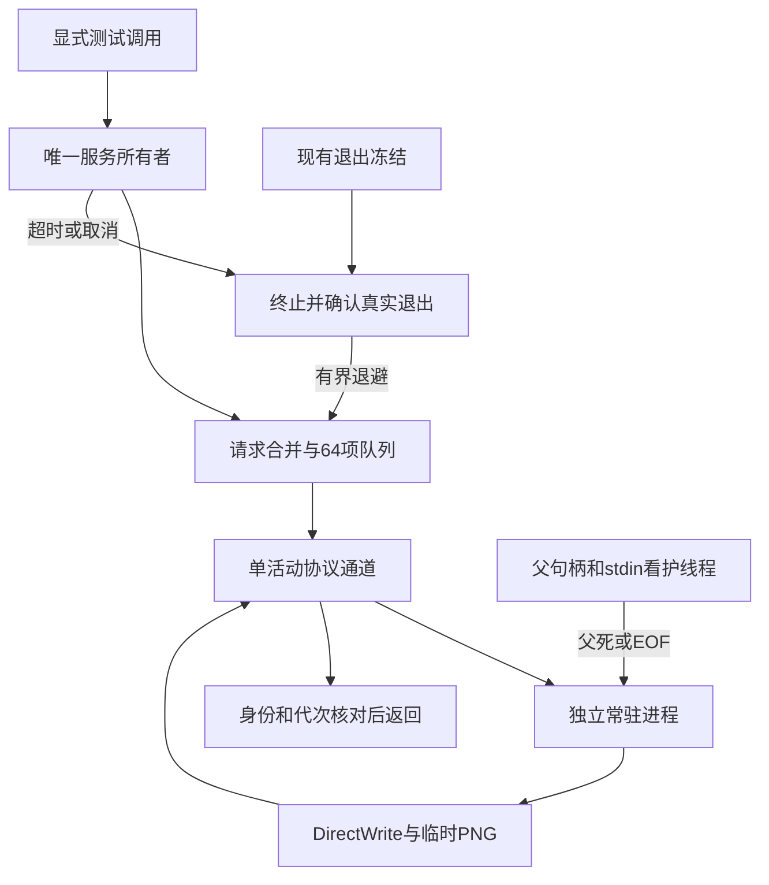
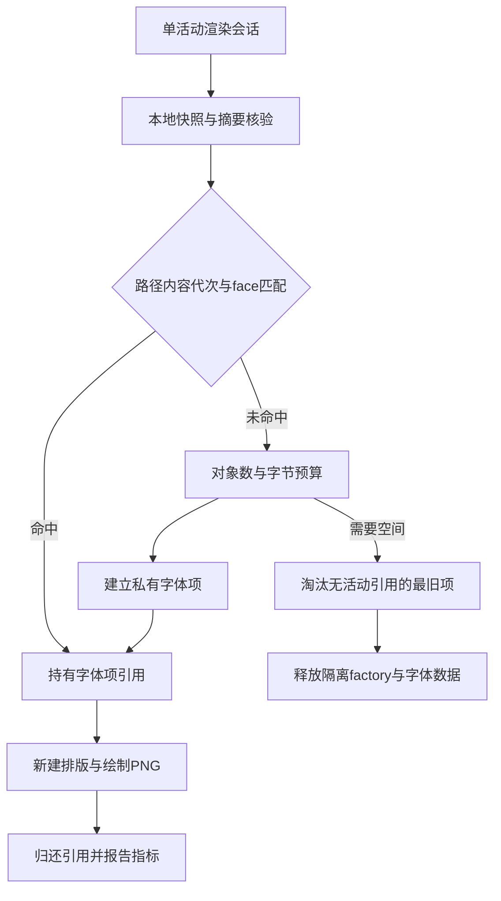

# HFM 常驻 DirectWrite 预览试验任务书

## 0. 状态、授权与执行入口

- 文档版本：1.3；日期：2026-09-26；软件版本：3.0.0。
- 仓库：`uniquenesssta/99`；试验分支：`stage/dw-resident-directwrite-preview`（用户已明确授权新建）；起点：`7d220c3d041291d4480210303ceae5dc3731145e`（渲染代码沿用此前版本，扫描修复为 `ecaf8ab`）。
- 当前状态：**DW-00 实机基线待验；DW-01～DW-03 实现及独立 Windows 自动验收通过；DW-04～DW-08 未实施**。用户已授权完成 DW-03；默认预览不切换，界面试用入口仍由 DW-05 提供。
- 用户目标：尝试常驻 DirectWrite 是否能改善未安装字体预览，特别是连续浏览、修改文字与字号；没有要求全面重做预览系统。
- 用户已接受剩余一般延迟，其他性能优化暂停。本试验不借机扩展为扫描、全库缓存、标签、收藏、激活或数据库重构。
- 继续遵守 [总任务书](HFM_REMEDIATION_MASTER_TASKBOOK.md)、[共享离线与本地退出](HFM_SHARED_OFFLINE_LOCAL_EXIT_TASKBOOK.md)、[索引与 Shared I/O 专项](HFM_INDEX_IO_ACTIVATION_SHUTDOWN_REPAIR_TASKBOOK.md)、[Stage 3 文件与预览边界](HFM_STAGE_03_FILE_PREVIEW_TASKBOOK.md) 及项目规则。
- 已知独立问题：55 个字体解析未解决、Windows CIM 1500ms 自动门失败、扫描外大量 stat 的来源尚未归因。保持记录；本试验不宣称解决这些问题，不自动启用旧 fontkit 兜底。C-09/O-07 不因本试验通过而自动完成。

## 1. 基线事实与待验证假设

### 1.1 已核实的实现

| 位置 | 当前行为 | 对试验的约束 |
| --- | --- | --- |
| `src/main/preview/native-renderer/previewNativeRendererRuntime.ts` | 优先调用 Rust；其他后端有兼容策略门 | 不绕过输入验证或重新打开全局兼容兜底 |
| `src/main/rust-core/clients/rustPreviewClientRuntime.ts` | `--preview-render-image` 返回结果被标为 `rust-directwrite` | 标签不是实际后端证据；新诊断必须报告真实引擎 |
| `native-src/hfm-core-worker/src/preview_render/mod.rs`、`windows.rs` | 实际为 GDI+ 私有字体集合，返回 `rust-private-gdi` | 更换 DirectWrite 与进程常驻是两项变化，不能混为已完成 |
| `src/main/rust-core/rustCoreWorkerTransportRuntime.ts` | 网络路径进入隔离 one-shot；本地任务尝试现有 daemon | 不能声称现有所有预览都重新启动进程；新渲染服务必须保留网络隔离 |
| `native-src/preview-renderer/hfm-preview-renderer.cpp` | helper 也包含私有 GDI+ 路径 | 不能只改名称就算迁移 DirectWrite |

当前默认预览链路（DW-02 独立试验链见 §12，尚未接入 UI）：



### 1.2 实机证据及其边界

日志 `startup-2026-09-26_08-18-53-060-26548.log`：扫描 5625 文件，17.6 秒完成，接口含后续同步共 20.6 秒，无 Shared I/O timeout；扫描修复已生效。

多个新生成预览的 worker 内部约 60～80ms、客户端约 100～140ms；被慢日志记录的完整预览请求为 1.5～4.6 秒。上述样本并非逐请求配对，慢日志也不是全部请求的无偏样本，**不能相减推算固定网络耗时，不能作为 DirectWrite 提速承诺**。DW-00 必须补齐同一 requestId 的完整时间线。

待验证假设：保留 DirectWrite factory、字体对象及本地字体副本，可能减少重复初始化和读取；完整预览仍可能受缓存校验、排队及 UI 交付限制。若实际收益不足，应保留当前后端并结束试验。

## 2. 目标、范围与非目标

### 2.1 必须达到

1. 不安装、不临时激活字体，也能准确绘制指定文件及集合中的指定 face。
2. 渲染对象跨请求复用；重复文本、改文字、改字号的命中与重建可观察。
3. 试验可显式开启/关闭，默认仍用当前后端，关闭后不启动新服务。
4. 网络断开、文件替换、请求取消、worker 崩溃、退出均有确定的结算和清理结果。
5. 与当前版本在同机同库同操作序列下比较完整可见时间，而非只测绘制函数。

### 2.2 禁止扩大范围

- 不改收藏/本地标签/共享标签、安装/激活/卸载、扫描索引 schema、离线展示策略。
- 不为预览全量复制字体库，不做离线同步，不为每个字体或每个根创建常驻进程。
- 不在 Electron 主进程/renderer 加载原生字体解析器；不直接在主进程读 NAS 字体。
- 不迁移或清空现有 `.hfm-cache`，不要求用户重建全部索引、打包安装或执行 build:win。
- 不因理论上的性能收益删除当前可靠路径；不承诺解决 55 个未解析字体。
- 默认不增加生产依赖。若不可避免，先列用途、许可证、体积、构建成本和替代方案，并按已有项目约束取得决定。

## 3. 拟实施边界与唯一所有者

以下均为设计约束，不代表已实现。DW-00 应核对可复用模块，避免另建第二套缓存、队列或根状态系统。

| 职责 | 唯一所有者/接入点 | 禁止行为 |
| --- | --- | --- |
| 前台请求与过期取消 | 现有 preview request scheduler | 新建独立无界 UI 请求队列、旧文字覆盖新文字 |
| 网络准入、根代次及网络读取 | 现有 Shared I/O owner + root availability | 新服务自建根在线状态、取消代次检查、普通慢请求标整根离线 |
| 按需字体副本 | 窄的本地预览字体存储模块，复用已有本地缓存清理基础设施 | 复用临时激活目录、写注册表、持久持有 NAS 文件句柄 |
| 原生服务生命周期 | 一个专用预览服务 owner，接入现有 shutdown coordinator | 与通用 Rust daemon 共用可被预览超时杀死的进程、每次调用重复创建 owner |
| factory、loader、字体/布局对象 | 专用原生预览服务内部 | 将 COM 指针或原生句柄跨 IPC 暴露，模块各自释放同一对象 |
| 图片缓存与发布 | 现有 preview cache owner | 新建另一套图片数据库、失败或旧代次结果写共享缓存 |

服务只接收已授权的本地字体副本和本地输出目标。NAS 路径、映射盘以及最终落到网络目标的 junction/symlink 均不得进入常驻服务。原文件的根身份和代次随请求保留用于结果准入，不作为服务直接打开路径。

### 3.1 路径、字体副本及身份

- 授权从现有字体路径边界取得；校验真实目标，不只判断字符串是否以盘符开头。拒绝 NUL、越界路径和任意输出路径。
- 通过已有可终止 Shared I/O 在本地独占临时文件写副本，完成校验后原子发布；取消/超时/退出不得把半文件标记成功。
- 副本身份包含受信源身份与内容摘要；生成内容摘要不得阻塞主进程。大小/mtime 可用于候选复用，不能单独证明复制期间内容未变；复制前后身份校验和强校验策略在 DW-00 冻结并用并发替换反例验证。
- 源文件删除、更新、重命名、根代次变化均使对应字体对象和结果失效。离线根保持现有灰显/不可用规则，即使本地有副本也不擅自提供离线使用功能。
- 使用按需、有容量限制的 LRU；活跃请求持有引用期间不得删除副本。对象释放后再删文件；遇占用记录待清理并重试，不强删源文件。应用崩溃后只能清理本服务拥有、身份可验证的临时文件。

### 3.2 进程、协议与取消

- 首版最多 **1 个独立常驻渲染子进程、1 个执行中绘制任务**，按需启动；不修改既有 Shared I/O 的全局额度。
- 请求包含 protocolVersion、requestId、serviceGeneration、源代次/字体身份、faceIndex、完整渲染参数、受控输出目标。回执必须匹配 ID/代次/引擎和输出身份；缺失、重复、乱序或非法回执均不能冒充成功。
- 握手声明真实 `directwrite` 能力及兼容版本；不得仅沿用 `rust-directwrite` 名字宣称实际调用了 DirectWrite。原生代码和构建产物都必须验证真实 API 路径。
- 已入队且未执行的旧请求立即取消；运行中的旧请求不发布结果。若原生调用不能安全中断，超过独立请求期限后终止专用进程，确认退出后释放资源，再按退避策略重启。
- 进程超时不得杀通用 Rust daemon，不能影响标签、索引和激活。取消/过期不自动回退重画。崩溃或协议错误不能无限重试；相同请求最多一次受控回退。
- stdin 关闭、父进程死亡、应用退出均终止服务；Windows 父进程强杀必须验证没有孤儿服务（例如通过受控 Job Object，具体实现先查对应 API）。关闭时 freeze 禁止新请求，不等待 NAS 恢复。

### 3.3 初始资源预算

以下是首版设计上限，**不是现有测量结果**。DW-00 应记录真实峰值、字体大小分布并冻结可执行常量；若需调整，必须在实施前记录理由，不得为了通过测试临时调大。

| 资源 | 首版预算/行为 |
| --- | --- |
| 常驻进程/活动绘制 | 1 / 1 |
| 服务待执行请求 | 最多 64；相同键合并，过期请求先取消；满队列明确拒绝，不能静默丢任务 |
| 字体对象 | 最多 128 个，同时受 256MiB 可计量缓存预算限制；TTC face 引用也计数 |
| 本地字体副本 | 合计 512MiB；单文件上限初值 64MiB，超限走明确的现有后端策略，不静默截断 |
| 原生进程私有内存 | 验收暂定不超过 512MiB；必须测量解析器/COM/位图未计入缓存的内存，超限停止准入并安全回收 |
| 图片尺寸/文本长度 | 沿用现有 preview input policy，DirectWrite 路径也必须执行；不得扩大边界 |
| 服务任务期限 | 不长于现有对应渲染请求期限；网络读取仍受现有 Shared I/O 预算约束 |
| 应用退出 | 接入现有 15 秒总预算，不能再叠加一个 15 秒服务等待；父进程退出不得留孤儿 |

## 4. 绘制正确性与兼容约束

- Win10/Win11 x64 为目标，使用系统可用的 DirectWrite API；先核实最低系统版本与构建 SDK。新 API 不可用时明确回退，不假设用户一定有较新 Windows App SDK。
- TTF、OTF/CFF、TTC 指定 face；中英文、组合字符、代理对、连字、RTL、空白、换行、缺字、可变字体均列入样本。无法支持的格式/轴能力要显式报告，禁止替换为系统同名字体后假报成功。
- 不需要管理员权限、symlink 权限、安装字体或写注册表。不能依赖系统字体已安装来掩盖私有字体加载失败。
- 保持现有尺寸、DPI、字号、布局、前景/背景、透明度、baseline/ink bounds、空白文本语义。绘制不得裁切上下沿；透明输出不得出现错误预乘黑边。
- DirectWrite 与 GDI+ 抗锯齿可能不同，不要求逐像素相等；必须同时检查指定字体/face、文字内容、缺字行为、边界、透明度和人工可见质量。不能只比较文件存在或像素总数。
- 图片键使用实际后端及渲染语义版本，包含源字体内容身份、face/轴、文本与完整绘制参数。旧缓存保持可读；新后端不误命中旧 GDI+ 图片。首次切换缓存冷启动成本单独计量。
- 试验期间新增后端图片仅写本地缓存；不向共享预览缓存发布 DirectWrite 新产物，避免影响未升级客户端。读取既有共享图片仍按现有策略，并明确标记命中来源；不得计入新后端绘制收益。
- 私有字体对象注册和卸载仅限服务内部；服务退出应按引用依赖顺序释放布局、face、collection/loader、factory 和副本引用。必须验证释放后文件可移动/删除。

## 5. 开关、回退与上线决定

拟新增单一开发试验选择：`HFM_PREVIEW_BACKEND=current|directwrite-resident`，默认 `current`；仅定义于本任务书，尚未实现。不得混用或更改现有全局 fallback 开关。

- 未选择新后端：现有行为不变，不启动新进程、不建字体副本缓存。
- 新后端明确不可用、格式不支持或可恢复失败：经既有授权重新校验后最多一次回退当前后端，日志分别记原始失败和回退结果，不能统计为 DirectWrite 成功。
- 网络离线、无授权、旧代次、用户取消、应用 closing：直接按原语义结束，不尝试绕过安全边界的回退。
- DW-05 接入后提供开发模式显式试用入口；DW-06/07 继续完成故障与实机 A/B 验收。DW-08 决定继续保持可选、终止试验或提议默认启用；**默认切换须用户明确决定**，不能由一次微基准自动决定。

## 6. 原子任务与验收顺序

每项独立、可逆提交；当项先建立可失败的回归用例，再实现，再验证/记录。不得把“接口占位、只有 mock、未接通调用方”记为完成。

| 任务 | 范围与交付 | 当项通过条件 |
| --- | --- | --- |
| DW-00 基线与行为锁 | 关联完整请求时间线；核对旧后端/daemon/缓存实际路径；固定样本、资源预算、API 版本与所有者 | 当前版重复测量可复现；冷热/网络/图片缓存命中分组；没有实际新后端代码冒充收益 |
| DW-01 DirectWrite 原生最小实现 | 在原生预览职责内实现真正的 DirectWrite 私有字体绘制，先使用本地夹具 | Windows 真实 API 测试、TTF/OTF/TTC face 与图像正确性通过；真实引擎回执、能力握手与构建集成通过 |
| DW-02 常驻服务与有界协议 | 专用服务 owner、启动/握手/队列/取消/超时/重启/父死退出；复用 DW-01 绘制 | 真实进程取消、乱序/非法回执、崩溃、队列满和强杀父进程用例通过；其他业务进程不受影响 |
| DW-03 字体对象复用与释放 | 有界 factory/loader/face 缓存、引用计数、LRU 与内存指标 | 相同字体不重复创建解析对象；不同 face/修改文件不会串用；淘汰后可删除文件；压力下不持续增长 |
| DW-04 网络字体按需本地化 | 隔离复制、本地副本身份、代次准入、异常残留恢复；不接触激活存储 | 断网/复制中断/同尺寸同 mtime 替换/路径别名/越界/junction 反例通过；常驻服务没有网络文件句柄 |
| DW-05 现有预览链接入 | 显式试验开关、请求去重/过期取消、后端版本键、本地图片发布、受控回退 | 默认路径行为锁不变；快速改字不显示旧结果；新旧缓存隔离；前台选择/滚动/文字更新正确 |
| DW-06 故障与退出收口 | lifecycle 接线、总退出预算、文件占用和崩溃后清理 | 正常关闭、NAS 永久断开、渲染挂起、父进程崩溃均无孤儿服务；无激活/注册表副作用 |
| DW-07 自动门与 Windows/NAS 对照 | 完整诊断、真实原生测试、构建/混淆；端到端 A/B 与长期稳定性 | 正确性、资源、性能矩阵全有证据；不把受控端口、Linux 或绘制微基准当 Win/NAS 验收 |
| DW-08 试验决策与收尾 | 写出采用/保持可选/放弃结论、未达标项及回滚办法 | 收益达标且用户实际体验认可才提议默认切换；否则保留当前默认，不追加无关重构追求数字 |

### 6.1 文件边界

允许优先修改：`src/main/preview/native-renderer/`、`src/main/preview/runtime/` 中有关请求/缓存/字体数据模块、`src/main/rust-core/clients/rustPreviewClientRuntime.ts`、原生 `preview_render/`、对应诊断和原生构建入口。

协议、transport、shutdown coordinator、主组合根只能作窄接线；新增模块按“服务生命周期”“字体副本存储”等真实职责划分，不新建万能 manager、不复制已有调度器。DW-00 必须列当项精确文件清单；超出清单先补任务书解释必要性。禁止无关移动/格式化及修改既有诊断指纹来掩盖行为变化。

## 7. 验证矩阵与硬门

### 7.1 正确性和故障矩阵

| 场景 | 必须证明 |
| --- | --- |
| 同一未安装字体连续改字/改字号 | 对象复用；最新请求可见；输入未串用 |
| 不同字体同名、TTC 多 face、可变轴 | 内容身份/face/轴分别匹配，不偷用系统字体 |
| 缓存命中、淘汰、文件修改/删除 | 命中快且有效；旧图不发布；释放后不占用文件 |
| UNC 与映射盘别名、根代次切换 | 使用现有身份和状态 owner，拒绝旧代次结果 |
| 网络读超时、断开且不恢复 | 前台可取消；常驻服务不挂在网络 I/O；退出正常 |
| 复制中断、磁盘满、文件替换 | 不发布半副本/错误版本；不损坏源文件和原索引 |
| 非法/超大输入、错误路径、恶意回执 | 与已有授权和输入限额一致，拒绝并可诊断 |
| 服务启动失败、崩溃、运行超时、队列满 | 有界结算/重启/回退，不能无限重试或重复发布 |
| 父进程强杀、正常关闭、退出期间新请求 | 不留孤儿；拒绝新任务；临时文件所有权清晰 |
| 收藏/标签/激活/扫描正常操作 | 无字段串扰、无新增全库刷新、无系统字体安装副作用 |

反例至少覆盖：去掉代次检查、去掉 face 身份、把网络路径直接送常驻服务、取消后仍发布、去掉队列/内存上限、去掉父死清理。每个 mutant 必须实际改变源码并导致对应测试失败，不能只 grep 一段文本当行为验证。

### 7.2 性能实验方法

- 固定同一机器、同一份字体库、同样可视区域及操作脚本；本地/映射盘/UNC 分组，分别记录磁盘、网络、字体数量与大小、进程/系统冷暖状态。
- 同 requestId 记录：请求进入、图片缓存检查、网络准入与排队、字体副本获取、服务排队、字体加载、布局绘制、编码、IPC 交付、renderer 真正显示。聚合 p50/p95 和失败率；禁止从慢日志单独推总体分位数。
- 当前后端 A、新后端 B 交替至少各 3 轮，每组至少 100 个有效请求；首个请求、首屏最后一张可见时间、滚动换页、同字体连续改字分别报告。样本不足则标“未验收”，不得外推。
- 至少分开：图片缓存命中；图片未命中且字体对象热；字体副本热但对象冷；新进程/新字体冷；NAS 首次获取。不得拿 B 热缓存与 A 冷启动相比。
- DW-00 的诊断夹具分别测量同一绘制器的进程/对象复用成本，以及当前与 DirectWrite 的绘制差异；控制实验不增加永久生产后端。无法分离时只报告整套方案收益，不归功于某一个组件。
- 同时记录 CPU 时间、主/子进程私有内存、缓存字节、请求/子进程数、网络读取量。连续运行至少 30 分钟、1000 次切换，验证淘汰和引用释放，不以 RSS 短时回落证明没有泄漏。

默认启用的提议门槛：主要热字体连续预览场景完整可见 p95 相比 A 降低至少 **20% 且绝对降低至少 100ms**；其余主要场景 p95 退化不超过 **10% 或 50ms（取较大允许量）**，正确性/失败率不能退化，资源满足 §3.3。阈值为试验决策标准而非性能承诺；若 DW-00 显示目标场景已接近下限，应先记录并重新决定试验价值，不能事后降低门槛包装成功。

### 7.3 自动门与已有失败的处理

- 各项运行受影响诊断和 typecheck；集成后执行 `npm run verify`、现有 Electron/Vite 构建与混淆、Windows 原生测试。不得修改已有安全断言、增加生产超时或关闭失败路径来刷绿。
- 已知 CIM 1500ms 失败应独立报告并保留原门；允许本专项独立定向验证，不因它重复阻断试验实现，但完整 Windows 门失败时不能宣称全量验证通过。
- 新失败必须定位到本项或独立基线。基线已知失败不能成为忽略新回归的理由；真实 Windows 渲染/隔离测试失败则停止下一原子项。
- NAS 实机证据必须来自实际 NAS，Linux/模拟延迟/替身端口不替代。日常用户验收使用 `npm run dev`，不要求安装包。

## 8. 停止、回滚与交付

立即停止条件：断网拖住退出；进程/内存持续增长；字体文件被长时间占用；绘制错字体、错 face、裁切或旧请求覆盖新图；改动波及标签/收藏/激活；必须依赖绕过授权/取消/代次才能运行。

回滚分两层：关闭试验开关并重启后恢复 current 路径；需要撤销代码时按原子提交 revert，不强制 reset 覆盖用户工作。试验字体副本仅清理自身可验证目录，已生成的后端专属本地图片由原清理规则回收；不得删除用户字体或共享索引。

每项交付记录：代码提交、实际修改文件、测试命令/退出码、Windows/NAS 证据、样本条件、资源峰值、失败/未测项、下一入口。更新根 README 变更记录和本书状态；不另建散落 fix log。严禁把“已编译”“已有接口”“只验证了本地字体”写成专项完成。

## 9. 文档建立记录与参考

- 2026-09-26：仅建立任务书及导航，冻结默认不开启、网络读取隔离、按需本地副本、常驻进程/缓存预算、图像正确性、回退和 A/B 门槛。运行代码未改，未启动 DW-00。
- 最新日志已确认扫描修复生效，其他一般延迟按用户决定暂停；55 字体解析和 CIM 问题仍单列待查。
- 已核对 Microsoft DirectWrite factory 文档：factory 可保存字体 loader 注册和缓存数据，支持状态复用；文档不证明本项目的实际收益。DW-00/DW-01 使用新增 API 前须按 AGENTS 用 Context7 核对目标 SDK/系统支持，必要时补官方文档。
- Mermaid Chart 已展示当前真实链路；新服务实施后再更新架构图，不能提前画作已落地。
- Create State 建立任务书时曾返回 UNAUTHORIZED；DW-00 交付时已恢复并成功保存。Git 与任务书仍为主要恢复依据。

参考：[DWriteCreateFactory](https://learn.microsoft.com/en-us/windows/win32/api/dwrite/nf-dwrite-dwritecreatefactory)、[DWRITE_FACTORY_TYPE](https://learn.microsoft.com/en-us/windows/win32/api/dwrite/ne-dwrite-dwrite_factory_type)。

## 10. DW-00 首批执行边界

本批范围为主进程入口 → 缓存/全局 I/O 排队 → 原生客户端 → 主进程返回。先接通可重复的关联日志和行为门；renderer 排队、图片解码/可见性、原生字体加载/绘制/编码细分、真实 Windows/NAS 样本和资源峰值仍待补，**不把主进程耗时称为端到端可见耗时，不将 DW-00 标为验收通过**。

精确文件清单及扩展理由：
- `src/main/logging/previewBaselineTrace.ts`：复用现有 operation-chain 与 AsyncLocalStorage，只管理可关闭的预览测量。
- `src/main/ipc/ipcTraceRuntime.ts`：为三个预览入口创建关联 ID，保持 IPC 参数与返回值不变。
- `src/main/preview/previewRuntime.ts`：记录内存/合并/图片来源和队列等待，保持缓存与调度所有者不变。
- `src/main/rust-core/clients/rustPreviewClientRuntime.ts`：记录原生回执中的真实引擎及实际 transport，不改兼容标签/结果协议。
- `build/diagnostics/check-rust-worker-clients.cjs`：旧提取期函数指纹保持原值；仅对本批精确诊断包装作可审计归一化，再比较原函数体，并用新行为门检查诊断本身。不放宽超时、异常或结果断言。
- `build/diagnostics/check-orchestration-contracts.cjs`：原诊断使用明确的 TS 模块装载白名单，新增诊断模块后补齐真实模块加载；不修改原行为断言或指纹。
- `build/diagnostics/check-preview-baseline.cjs`、`build/performance/preview-baseline-report.cjs`、`package.json`：行为门和日志分组报告，不加入生产依赖。
- `.github/workflows/native-offline-verification.yml`：新分支继续执行既有门，并先运行本批定向诊断，不跳过已知 CIM 门。
- 本书、根 `README.md`：状态、操作方式、证据与未测项。

不冻结未经测量的内存预算，不猜测最低 DirectWrite API/SDK 版本；沿用 §3.3 设计上限，在后续 DW-00 实测与 API 核对后再确认。

### 10.1 本批诊断的使用与判读

开发 PowerShell（当前后端不变）：

```powershell
$env:HFM_PREVIEW_BASELINE='1'
$env:HFM_LOG_DETAIL='debug'
npm run dev
```

结束采样后关闭应用，恢复这两个变量原值（原先未设置则移除），下次正常 `npm run dev` 不产生本批关联诊断。必须同时开启详细日志；诊断复用原有 16MiB operation-chain 会话预算，出现 dropped/截断需换新一轮采集，不允许从残缺日志宣称性能通过。A/B 必须使用相同日志配置，详细日志的额外成本不忽略。

```powershell
npm run baseline:preview-report -- '实际 startup 日志路径'
```

报告仅含同 `sessionId + operationId` 的主进程处理耗时，按入口、缓存来源、真实原生引擎和 transport 分组。`preview-native-result` 是原生回执计时，`preview-native-command-result` 含调度/传输；缺少回执则为 `not-observed`，不按兼容标签猜成 DirectWrite。保留 `rust-directwrite` 旧返回别名仅为兼容，真实观测当前是 `rust-private-gdi`。

`coalesced` 只记录等待已有请求；不会复制首次请求的内部阶段冒充第二次绘制。调度回调显式恢复创建它的 trace，不能继承上一请求的队列完成上下文。计时均使用同进程单调时钟，原生内部时间单列；阶段可能嵌套，禁止相加或相减各组分位数。

缓存单项/批量读取入口本批只有处理总耗时，不将一个批量耗时算成每张图片耗时；图片/字体对象冷热、UNC/映射盘位置需实验记录确认，不能由 `daemon`/`shared-one-shot` 标签直接推导。内存命中可能是既有缺失占位图；`returned` 不是字体绘制正确性验收。

报告对重复/缺失终态、坏行和 dropped 记录标记不可用；零样本不可用。小于 100 个请求的组标明不足；即使日志完整，`endToEndAccepted` 始终为 false，本工具不能确认屏幕可见性、三轮 A/B 或真实 NAS。

### 10.2 固定采样卡（实测尚未执行）

采用用户现有可合法使用的字体，记录固定匿名样本编号、格式、文件摘要/大小、TTC face、是否安装；不提交字体文件或私有路径。相同样本分别放在本地、映射盘、UNC 实验根，各轮使用同一个映射关系。禁止清空用户共享缓存制造冷启动。

| 组 | 固定操作 | 需另行记录 |
| --- | --- | --- |
| 图片热 | 同样本、同文字、同字号重复请求 | 真正命中层；批量请求单列 |
| 图片冷/同字体 | 同字体按固定序号更换文字 100 次 | 不把进程常驻假设为字体对象已复用 |
| 修改字号 | 同文字按预先确定的字号序列切换 | 完整尺寸/DPI/布局参数保持 |
| 首次请求/首屏 | 重启后首次进入固定页，至少 3 轮 | 进程冷不等于系统文件缓存冷；首屏可见终点待接线 |
| 滚动/快速改字 | 固定页序、停留间隔、文字序列 | 过期取消数、最终显示正确性 |
| NAS 首次获取 | 在线实验根首次读取未用过的固定样本 | 真实位置、网络条件、读取量；不与本地混组 |

覆盖 TTF、OTF/CFF、TTC face、中英文、组合字符、RTL、缺字/空白/换行/可变字体；具体样本编号与机器配置随 Windows 采样补齐。§3.3 仍是设计预算，API/SDK 最低版本、字体大小分布、私有内存峰值和复制身份反例尚未冻结，禁止提前进入 DW-01 或声称收益。

### 10.3 本批验证记录

- 先运行行为门，缺少实现时失败（ENOENT）；实现后通过真实 IPC 包装、实际 I/O scheduler、Rust 客户端调用，操作系统/原生执行为受控端口。
- 覆盖默认关闭、并发 trace 隔离、排队恢复、原返回别名保持、真实引擎、daemon/shared-one-shot、零耗时合法、原异常对象和临时文件释放、日志失败无重放。
- 两项源码变异：把真实引擎改回错误别名、去掉排队 trace 恢复，都导致行为门失败。报告覆盖坏行/丢日志/重复终态/无样本/小样本，不宣称端到端验收。
- `npm run verify` 退出 0：typecheck + 148/148 诊断通过。首次完整门因诊断白名单缺失失败，已补真实模块加载；旧 Rust 客户端指纹仍保留原值，仅精确归一化本批诊断包装，并新增生产超时改动会失败的反例。
- Electron/Vite 构建退出 0（main 384 / preload 1 / renderer 204 模块），混淆退出 0（3/3）；`git diff --check` 通过。输入边界 190 个 JS 行为用例及 68 个 C++ 策略用例通过，后者不执行 GDI+。
- 对原实机日志运行报告得到 0 个关联样本、不可验收，未伪造或补算旧日志数据。
- Windows CI 随新分支推送触发，结果待收；本环境无 Rust/Cargo/Windows，Windows/NAS 与 GUI 实机均未执行。DW-00 保持进行中，下一入口为 renderer 关联终点、真实样本/API/预算确认。

## 11. DW-01 执行卡

2026-09-26 用户明确要求开始 DW-01，授权在 DW-00 实机基线未完成时先实现原生最小验证；这覆盖 §10.2 的推进顺序，不代表 DW-00 已验收。当前唯一分支保持不变。本项不切换 Electron 默认后端，不开始 DW-02 常驻服务。

范围：新增 `native-src/preview-renderer/directwrite/`，分别承载原生绘制和独立命令入口；复用原有 `preview-input-policy.h` 数值限额。用系统 DirectWrite + Direct2D/WIC，MSVC/Windows SDK 编译，无生产第三方依赖；生成物不进 Git。命令只用于本地测试，尚不接受 UI 请求。新增真实原生诊断、原创轮廓字体夹具及独立 Windows CI，保留原有完整门。修改 `.gitignore`、`package.json`、本书、主任务书入口和 README 用于构建与验收接线。

API 决定：系统 `IDWriteFactory3`（Windows 10 起），单 face 的 `IDWriteFontSetBuilder` → 私有 collection → `IDWriteTextLayout2`；不使用 Windows App SDK。自定义 glyph renderer 校验实际 run 的文件引用及 faceIndex；禁用系统 fallback，缺字回报缺失 glyph 数。变量字体 fvar 明确返回不支持，不冒充默认实例正确。RGBA 透明图、96 DPI、现有前景色；居中与必要缩放。最终 UI 视觉兼容待 DW-05/07，不以原创几何字体测试代替真实字体人工检查。

参考：https://learn.microsoft.com/en-us/windows/win32/api/dwrite_3/nf-dwrite_3-idwritefactory3-createfontcollectionfromfontset 、https://learn.microsoft.com/en-us/windows/win32/directwrite/custom-font-sets-win10 。Context7 已查询私有字体集及自定义 glyph renderer，结合 Microsoft Win32 文档确认 Windows 10 接口，不采用 Windows App SDK 文档的不同最低版本。

DW-00 CI `36231611578`：Windows 预览基线诊断通过；Windows/Linux directory-metadata-native 两组通过；完整 Windows 门在 mapped-drive-unicode 的已知本地 CIM 1500ms 门失败（1518ms/SIGKILL），不提高超时，不归为 DirectWrite 成功或无关已修复。

### 11.1 原生接口与验收边界

构建入口 `npm run native:directwrite`（仅原生开发/CI，需要 x64 MSVC 环境）；测试入口 `npm run test:directwrite-native`。用户正常开发仍用 `npm run dev`，不自动启用本实验二进制。

命令协议 v1：`hfm-directwrite-preview.exe --probe` 返回实际 DirectWrite factory 能力；`--render <本地字体绝对路径> <faceIndex> <文字> <字号> <宽> <高> <新 PNG 绝对路径>` 执行一次渲染。回执含 `engine=directwrite`、faceIndex、glyphRuns、missingGlyphs、elapsedMs；非零退出/ok=false 是失败，不能算成功图片。输出使用 CREATE_NEW，不覆盖现有文件；编码完成后才创建输出，写入失败删除本次拥有的文件。独立 CLI 不作为 IPC 授权边界，未来接 UI 仍须既有授权与受控输出目录。

绘制通过 DirectWrite 排版后的 GetGlyphRunOutline 获取真实轮廓，校验文件引用和 face 后用 Direct2D 软件光栅化，再由 WIC 编码直通 alpha PNG。布局与字体对象全在原生进程；图像透明、前景 #f2f4f8、96 DPI，以真实轮廓 bounds 居中并按需缩小，避免 overhang/重音裁切。轮廓光栅化和旧 GDI+ hinting/抗锯齿不同，真实字体视觉仍待验。仅本地固定/可移动盘，拒绝 UNC、映射网络盘与 reparse 路径；没有新增共享缓存发布或字体安装行为。

夹具轮廓为项目原创 CC0，固定字体名相同但几何不同，包含 TTF、CFF、TTC 两 face、连字、组合字符、代理对、中英文/RTL、缺字、空白/换行与 fvar 拒绝；不用系统已安装字体掩盖私有加载。生成器仅开发重建需要 fontTools 4.61.1；提交的 base64 夹具及 Windows 诊断只用 Python 标准库，无运行依赖。两项源码变异重新编译真实 exe：强制 TTC face=0、移除输入限制；编译失败不得当作测试有效，最后恢复源码并重建/重验正确 exe。

首轮 Windows CI `36233697917`：MSVC 编译通过，图像用例在空字符串断言处失败；已确认旧语义为空串使用默认文字，修正测试期待，不更改生产语义。修正后的 Windows 原生 CI 已通过，证据见 §11.2。本项完成原生独立调用不代表 DW-02 常驻/DW-05 UI 已接通，也不关闭 DW-00 实机性能缺口。

### 11.2 验证结果与交付

- 原生实现提交 `eb25c1d`，空串语义/变异补强提交 `6030bc6`。Windows 原生 CI [36233853827](https://github.com/uniquenesssta/99/actions/runs/36233853827) 全部通过：MSVC 真正编译、27 个真实 API/PNG 用例、2 项真实源码变异拒绝、恢复源码后重建并重跑 27 项。产物为该 CI 的 `directwrite-native-proof`，不是默认运行时更新。
- 验证了相同 family 名的两份私有文件不会串用；TTC face 0/1 与对应独立 TTF 图像匹配且互不相同；同轮廓 CFF/TTF 像素一致；连字轮廓比例、上下沿/居中、前景 straight-alpha、空白/空串默认、缺字回执及输入限额通过。变量字体明确拒绝，源文件可在进程完成后改名/删除，已有输出保留。
- `npm run verify` 退出 0（typecheck、148/148），Electron/Vite 构建退出 0，混淆退出 0（3/3），`git diff --check` 通过。本地 Linux 没有 MSVC/DirectWrite；其原生测试明确退出并提示 Windows required，没有假报通过。
- 完整 Windows 旧门仍在 `mapped-drive-unicode` 的 CIM 1500ms 查询失败；该门未删除或加时。DW-01 有独立真实原生门，但不能称完整 Windows 门全绿。
- 本次 Windows 原生 CI 使用托管 runner 的 VS 2026 v18.10.1；接口按系统 Win10 API 设计，用户 Win10/VS2022 本机、真实商业字体和字体集合视觉质量仍待实测。中文/RTL 夹具只证明码点、排版通路和边界，不替代真实复杂字体视觉验收。
- 仍未实现/未验收：持久进程与对象复用、网络字体本地化、UI/图片缓存接入、父死/有界退出、真实 NAS 与端到端性能。没有提速结论，没有默认切换。下一项 DW-02 从现有原生绘制职责复用，不新建第二套渲染实现。

当前独立链路：



该链路尚未连接 Electron 前台，Mermaid Chart 已同步展示；Context7/API 核对见 §11。

## 12. DW-02 执行卡

本项实现独立常驻进程和有界 transport；现有默认预览不接入，实际原生调用由 Windows 集成诊断验收，界面开关仍属于 DW-05。取消直接终止专用进程；等待真实 close 后才释放活动槽，后续请求按有上限的退避重新启动，不重试失败请求。

精确文件清单：`native-src/preview-renderer/directwrite/resident.{h,cpp}`（父进程句柄看护、stdin 生命周期、受限二进制协议）、该目录 `cli.cpp`/`build-win.cmd`（服务入口与编译）；`src/main/preview/native-renderer/directwriteProtocol.ts`（跨进程格式/回执验证）、`directwriteProcess.ts`（单进程管道与关闭确认）、`directwriteService.ts`（唯一服务 owner、64 项队列/合并/取消/关闭、受控临时输出）；`build/diagnostics/check-directwrite-service.cjs`、`fixtures/directwrite/process.cjs`（真实进程故障协议）、`check-directwrite-resident.py`（Windows 原生服务与父死验证）、`check-directwrite-mutants.py`（实际移除父死清理必须失败）；`.github/workflows/directwrite-native.yml`、`package.json`（自动门）；本书、根 README 及总任务书顶部状态导航（只同步执行入口）。

服务 owner 构造时接入现有 shutdown coordinator 的 freeze/resume 订阅，不添加新的退出等待预算。固定渲染语义沿用 DW-01（96 DPI、透明底、既有前景/布局）；协议仅允许该语义版本。字体对象缓存、源副本授权/摘要、UI 图片发布分别留给 DW-03/04/05，不把身份回显当内容校验。


### 12.1 协议、生命周期与边界

- `DirectwriteService` 是主进程中的唯一实例；第二次构造被拒绝，实际退出后 dispose 才释放所有权。惰性启动，当前生产 UI 不构造/调用该服务；Windows 自动诊断通过真实 owner → exe → DirectWrite → PNG 验收完整专用链，非接口占位。
- 请求使用小端长度前缀，单帧最多 65536 字节；版本、渲染语义版本、ID、服务代次、源代次、64 字符十六进制字体身份、32 字符输出身份及全部绘制参数必须匹配。回执为受限规范 JSON，拒绝重复字段、超长输出、错误引擎/代次/ID/身份、缺失及乱序/重复回执。
- 1 个活动任务、64 个等待任务；完整输入键合并，合并订阅者总量另限 256。所有订阅者取消才终止该活动任务；队列取消立即移除，源 owner 可调用 invalidate 清退旧代次。请求总期限默认 30 秒（含排队），只允许缩短；启动握手另受 3 秒上限，不能延长请求总期限。
- 超时、取消、协议错误仅杀本服务；请求不自动重试/回退。保留活动槽直到真实 `close`，失败后续请求按 100/200/400/800/1600/2000ms 封顶退避。输出位于独占目录，仅在身份与最终源代次验证后返回 PNG 字节；文件读取上限 40MiB。清理失败停止 owner 准入，保留其独占目录，避免反复积累；跨启动残留恢复属于 DW-06。
- freeze 订阅现有 shutdown coordinator，立即拒绝新请求并终止服务，不新增退出等待预算；用户取消退出后复用原 owner 按需重启。专用 C++ 进程核对实际父 PID 与创建时间，持有父进程 SYNCHRONIZE 句柄独立看护；stdin 读取也独立于绘制线程，父死或 EOF 均直接终止本进程。
- DW-02 交付时原生绘制复用 DW-01 实现，每次重建字体/COM 对象；该项只证明进程常驻，**不宣称 DW-03 的对象复用、DW-04 的内容授权副本或性能收益已实现**。不打开 NAS 字体，网络/reparse 拒绝沿用 DW-01；实际 NAS、本地路径并发替换及 Win10 GUI 矩阵仍待后续阶段。



### 12.2 验证记录

- 代码初版 `52449b0`；测试校正 `70ca826`。Windows Actions `36235481324` / job `108386353563` 全通过：真实 DirectWrite 27 项图像检查、常驻 TTC 三次 face 切换、6 种非法协议、绘制主线程挂起时 stdin EOF、保持 stdin 打开的父进程单独强杀、真实 TS owner 原生绘制/取消/重启，以及移除父死终止后必须失败的实际 C++ 源码变异。原 DW-01 错 face/输入限额变异仍通过。
- 初次 `36235303248` 常驻 TTC 断言失败：选用 AB 时夹具会形成两 face 相同的 fi 连字，不能区分 face；改为轮廓不同的 A 并复用既有 PNG 解码器比较像素，未放松不同 face 必须不同的断言，未改生产绘制。
- `diagnostics:directwrite-service` 使用生产队列/协议/退出协调器和真实子进程，覆盖合并、满队列、取消/过期、12 类崩溃/恶意回执、期限、退出取消恢复；控制 kill 端口保持真实子进程存活，证明 kill 返回不等于 close。4 个 TS 源码变异（去代次、加队列上限、去发布前过期检查、跳过退出确认）必须失败。夹具的合成 PNG 只验证 transport，不代替真实 Windows 图像门。
- 本地 `npm run verify`：typecheck + 149/149 诊断通过；Electron/Vite 构建 main 384 / preload 1 / renderer 204，通过最终混淆（3/3，退出 0）；最终唯一 owner/清理失败边界已有定向测试与 typecheck；代码 `4b105b7` 的 Windows 最终门 `36235681240` / job `108386887368` 全通过，最终代码本地完整门复跑退出 0，仍为 typecheck + 149/149 通过；三端构建与混淆重新通过。
- Context7 核对 OpenProcess/WaitForSingleObject/TerminateProcess/GetProcessTimes/Toolhelp API；Mermaid Chart 更新真实实现链。用户仍通过正常 `npm run dev` 使用原预览；不要求现在手动切后端。下一原子项 DW-03 字体对象复用与释放，须用户明确开始后实施。

- 最终代码 `4b105b750086b51420a3487b372c6188e19b67af`，Windows Actions [36235681240](https://github.com/uniquenesssta/99/actions/runs/36235681240) 全绿，包含最终 owner 边界、4 个 TS 变异、3 个 C++ 变异及恢复生产源码后重测。后续记录提交只改文档。Windows/NAS 用户实机、早期 Win10、长期内存/对象预算和端到端收益未验；本项完成不代表 DW-00/03～08 完成。

- 独立基线门仍失败：最终代码对应 `36235681162` 的 `diagnostics:mapped-drive-unicode` 实测 CIM 1517ms / 限额 1500ms，未放宽或跳过；不把本专项全绿称为完整 Windows 全部门禁通过。

## 13. DW-03 执行卡

用户于 2026-09-26 明确授权开始 DW-03，继续唯一试验分支。本项不切换默认后端、不接 UI、不复制 NAS 字体。

实现边界及决定：
- 新增 `native-src/preview-renderer/directwrite/fontCache.{h,cpp}`：按本地规范路径、实际 SHA-256、源代次和 face 缓存私有字体对象；每项持有隔离 DirectWrite factory/custom memory loader/face/collection，活跃绘制持 shared_ptr 租约，LRU 只淘汰无外部租约的项。采用每项隔离 factory，使淘汰可连同 DirectWrite 内部缓存一起释放；相同项连续绘制复用这些对象。文本 layout/位图不缓存。
- 新增 `localFontFile.{h,cpp}`：从 DW-01 移入既有本地路径过滤，短暂独占写入共享权限的读取句柄取得不可变内存快照，计算 SHA-256；读取结束即释放文件句柄。当前每次请求仍重新读取并校验内容，不以 mtime/size 或调用方自报身份证明内容不变。DW-04 再决定受控不可变副本的读取复用。
- 新增 `memoryBudget.{h,cpp}`：512MiB 进程提交内存 Job 限额及真实 PrivateUsage/峰值指标；无法设置限额则不宣告服务就绪。字体项上限 128、可计量缓存上限 256MiB、单文件 64MiB 不变；可计量字节不冒充 COM 全部内存。
- `preview.{h,cpp}`：渲染会话保持 COM/D2D/WIC 生命周期，调用字体缓存并保留原图像规则；原 CLI 单次入口继续有效。`resident.cpp`：持有一个会话，报告缓存命中、实际对象 ID、加载/淘汰/引用释放和内存计数。
- 常驻协议升为 2，字体身份收紧为预期内容 SHA-256，新增必需 cacheVersion/指标；`src/main/preview/native-renderer/directwriteProtocol.ts` 及真实子进程夹具同步，拒绝混用旧 worker。CLI 单次协议保持 1。调用方只是传入预期摘要，本项不冒充 DW-04 的源授权实现。
- 测试/构建范围：`build-win.cmd`、现有 `check-directwrite-{native,resident,service,mutants}` 与 `fixtures/directwrite/process.cjs`；新增 `check-directwrite-cache.py` 验证真实对象复用、同名/多 face/同 size+mtime 替换、删除/淘汰释放、计数/字节预算和压力，直接使用原创字体夹具；`package.json`、`.github/workflows/directwrite-native.yml` 加入 Windows 门。更新本书、总任务书导航与根 README；其他业务职责不改。

先建立可失败的缓存检查，再实现。至少用实际源码变异证明：停用复用、忽略 face、放宽对象数/字节限额不能通过；原 DW-01/02 图像、取消、父死清理及全部回执验证继续保留。


### 13.1 已实现行为与资源含义

- 缓存保存真正的 DirectWrite factory、file、face、私有 collection、空 fallback 及其不可变字体字节。命中复用同一 `fontObjectId`；改文字/字号/图片尺寸仍新建 format/layout/位图，防止复用旧排版。缓存键含规范路径、实际 SHA-256、源代次和 face；变量字体仍明确拒绝。
- 每项隔离 factory 随 LRU 项一起释放，避免全局 factory 内部引用让已淘汰字体数据继续存活。绘制使用 shared_ptr 租约，无外部引用的最旧项才可淘汰；COM loader/stream 自身使用原子引用计数，内存片段必须在文件范围内。释放顺序为 fallback/collection/face/file → 注销 loader → factory → loader/字体数据。
- 128 项 / 256MiB 为硬缓存准入边界，TTC 每个 face 单独计数并保守计入整份字体内存。`cache.bytes` 包含持有的字节缓冲区和自有元数据计量，不代表 DirectWrite 全部内存；`liveEntries/liveBytes` 独立跟踪真实引用释放。Job Object 对整个专用进程设置 512MiB 提交内存限额，另读取 PrivateUsage 与 PeakPagefileUsage；无法安装限额或读取指标则失败，不伪造数值。
- 当前每次请求都在**专用子进程**读取本地字体并算 SHA-256，然后判断对象命中；预期摘要不符即 `FONT_IDENTITY_MISMATCH`，不能以同 size/mtime 或自报身份继续使用旧对象。读取期间禁止写入共享，读完释放句柄；缓存没有长期源文件句柄。该措施保证对象正确复用，但尚未消除重复读文件成本；DW-04 的授权本地副本机制仍未实现。
- 常驻请求/回执协议 2，握手要求 cacheVersion=1；旧协议进程必须被拒绝。新增回执字段 cacheHit/fontObjectId/contentHash/cache 及计数/内存指标，TS 同时校验实际摘要与资源上限。原单次 CLI 协议 1、固定图像语义和当前 UI 后端未变，无数据库/原缓存迁移、无新第三方依赖。



### 13.2 自动验收记录与下一入口

- 实现代码 `434271e0638a0d9bd4e175eb5222207017192c28`，测试补强 `57ff09ce869f9a7bb1de8d5cf6762cf721108755`；Windows Actions [36238266759](https://github.com/uniquenesssta/99/actions/runs/36238266759) / job `108393932865` 全通过。初版 Actions `36238084679` 同样通过，无原生编译或图像修复绕过门禁。
- 真实 Windows：原 27 项图像检查；DW-02 取消/父死/EOF/6 种非法请求及真实 TS owner 集成继续通过；服务诊断覆盖 16 类恶意回执/故障、旧 worker 握手拒绝、队列/取消/退出确认及 4 个 TS 源码变异。
- 缓存检查共 **1153 次请求**：重复文字/改字/改字号复用真实对象，同名不同文件、TTC face、源代次、同 size+mtime 文件替换、陈旧摘要拒绝、源文件移动/删除、128 项 LRU、1000 次切换、40MiB 字体触发 256MiB 字节淘汰均通过。向真实子进程尝试提交 600MiB 额外内存被 OS 拒绝，随后仍能绘制。
- 最终运行两次正常缓存测试（变异前/恢复源码后）：私有内存峰值 **322748416 / 322576384 bytes**（约 308MiB）；1000 次切换采样约 26.8～27.8MiB，无按请求线性增长。大文件阶段最终 6 项、计量 **251662284 bytes**、累计 1130 次对象创建 / 1124 次淘汰，存活引用/字节与缓存项一致。仅代表本次原创夹具和短时压力，**不能替代 DW-07 的 30 分钟实机、复杂商用字体和 NAS 验收**。
- 7 个实际 C++ 源码变异全部被行为门拒绝：错 TTC face、移除输入上限、移除父死终止、停用对象复用、忽略缓存 face、移除 128 项限额、移除 256MiB 限额；恢复真实生产源码后重新跑 27 项图像、常驻生命周期和全部缓存检查通过。错 face 变异随职责迁入 `fontCache.cpp`，未删除原断言。
- 本地 `npm run verify` 退出 0：typecheck + **149/149**；协议补测退出 0；Electron/Vite **384/1/204**、混淆 **3/3**、Python 语法和 diff 检查通过。Windows/Linux 原有目录属性/native 回归在 `36238266863` 均通过。
- 独立综合 Windows 门：`36238084685` 仍停在原 CIM 检查；`36238266863` 初次在未修改的 Shared I/O 集成夹具 timeout=2000ms 处失败（queued58ms / execution2001ms）。两提交间仅改四个 DirectWrite 测试文件，该夹具及执行链字节相同，上一轮同生产代码通过；已申请只重跑失败 job 复核，不增加生产或测试期限。复跑 job `108394513251` 的 Shared I/O 集成门已通过，随后仍停在原 CIM 1500ms 门；两个目录属性/native jobs 复跑也均通过。未改源码、期限或断言，不能宣称整个综合 Windows 门全绿。
- Context7 核对 DirectWrite 自定义 loader/stream 与注销生命周期、BCryptHash（Win10+）、Job/PrivateUsage API；Mermaid Chart 更新已实现链。下一项 **DW-04 网络字体按需本地化**，须用户明确开始；GUI 显式试用仍在 DW-05，不自动切后端或宣称预览提速。
