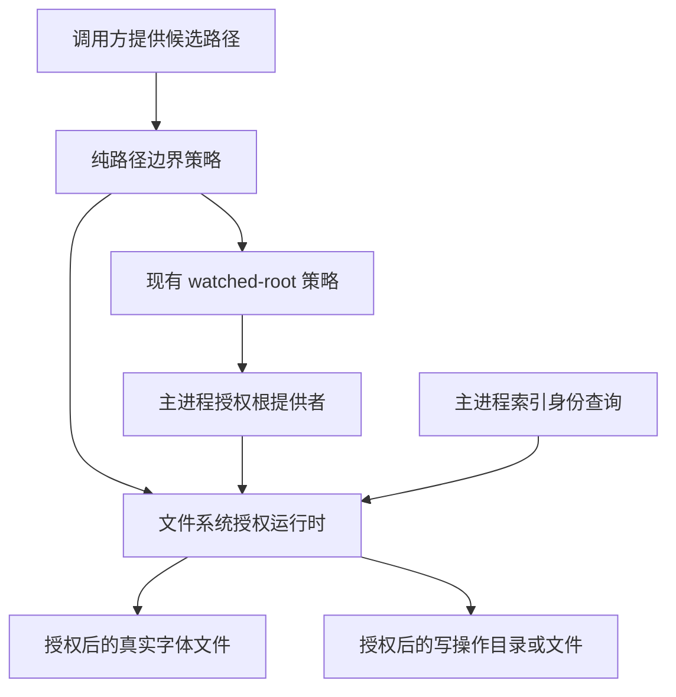
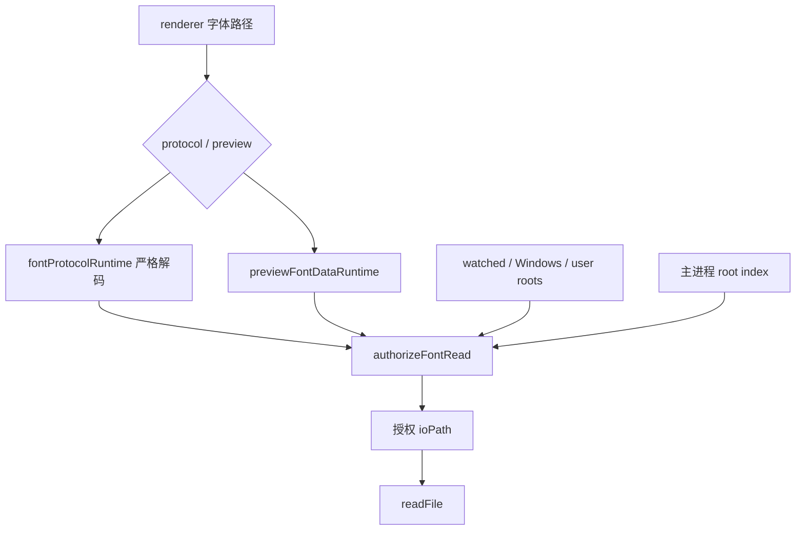

# HanFontManager Stage 2：字体路径授权任务书

## 0. 文档状态

- 文档版本：1.2
- 建立日期：2026-09-02
- Stage 分支：`stage/02-font-path-boundaries`
- 起始提交：`0c62b2ef49934e2d5aca2b040353b8e09b972618`
- 当前 Atomic Task：AT-2.1 至 AT-2.2 已完成；AT-2.3 待开始
- 前置阶段：Stage 1 自动门禁已完成；Windows 系统集成矩阵仍是外部验收项
- 上级任务书：[`HFM_REMEDIATION_MASTER_TASKBOOK.md`](HFM_REMEDIATION_MASTER_TASKBOOK.md)

本文档只维护 Stage 2 的详细实施顺序、信任边界、逐项门禁和执行记录。跨阶段顺序、停止条件与三大编排文件最终拆分标准以总任务书为准。

## 1. 阶段目标与非目标

Stage 2 解决两个已确认的 P0 问题：字体协议/预览可读取任意本地文件，以及物理文件操作/托管卸载只凭 renderer 路径或 basename 前缀产生破坏性副作用。

必须达成：

1. 所有字体读取先经过同一主进程授权策略，再接触文件内容。
2. 授权同时验证候选绝对路径、真实路径、允许扩展名、普通文件、大小上限和主进程权威来源。
3. 目录创建、重命名、字体移动和托管卸载各自使用窄权限入口，不把“可读”等同于“可移动/可删除”。
4. watched roots、系统/用户字体目录、应用自有目录和索引身份全部由主进程提供；renderer 不能随调用附加根集合或授权布尔值。
5. Stage 0 的 P1-P8 观察按 AT-2.1 至 AT-2.4 逐步反转为长期正确性门禁，未接入的消费者不提前伪报安全。

本阶段明确不做：

- 不重写跨卷 copy/unlink 提交协议；该问题属于 Stage 3。
- 不统一 Rust/C++/PowerShell 预览位图输入限额；该问题属于 Stage 3。
- 不升级 Electron、Node 依赖或打包链；该问题属于 Stage 7。
- 不借路径修复机械拆分 `index.ts`、Rust Worker 或 React 根组件；正式拆分属于 Stage 4/5/6。
- 不修改数据库格式、缓存键、IPC channel、Rust CLI 或用户字体库数据结构。

## 2. 威胁模型与信任边界

以下输入一律视为不可信：

- renderer 传给 `path:toFontUrl`、预览、物理文件夹和字体移动 IPC 的路径或 `FontItem`。
- `hfm-font://local/` URL 内经过百分号或 base64url 编码的路径。
- renderer 自报的 watched root、目标根、`authorized` 标志、受管文件名或注册表名。
- 文件系统中的 symlink、junction、映射盘别名、大小写变化、`..`、相似前缀目录和操作间被替换的目录项。

可以作为授权来源的只有：

- 主进程当前 library/watcher 状态解析出的 watched roots。
- 主进程提供的 Windows Fonts、当前用户 Fonts、临时激活和应用自有目录。
- 主进程索引查询返回的字体身份；调用方不能用一个布尔参数替代该查询。
- 文件系统在授权时返回的 `realpath` 与 `stat` 结果。

## 3. 路径授权不变量

| 编号 | 不变量 | 可验证结果 |
| --- | --- | --- |
| PTH-1 | 候选必须是无 NUL/控制字符的绝对路径 | 相对路径、盘符相对路径和畸形输入在文件系统调用前拒绝 |
| PTH-2 | 路径边界按组件计算 | `C:\Fonts-Backup` 不属于 `C:\Fonts`，不同 UNC share 不互相包含 |
| PTH-3 | Windows 路径大小写不敏感，POSIX 测试路径大小写敏感 | 盘符/目录大小写变化不误拒绝；可移植夹具保持宿主语义 |
| PTH-4 | 只接受盘符绝对路径、UNC 或受支持的长路径形式 | `\\?\C:\...`、`\\?\UNC\...` 可规范化；`\\.\` 和其他设备命名空间拒绝 |
| PTH-5 | 候选路径和真实目标都必须是允许字体扩展名 | `.txt/.db/.pem/.woff/.woff2` 以及伪装 symlink 目标拒绝 |
| PTH-6 | 读取目标必须是普通文件且不超过统一上限 | 字体名目录和超过 80 MiB 的字体在 `readFile` 前拒绝 |
| PTH-7 | symlink/junction 授权以真实目标为准 | 根内链接指向根外时拒绝；根内链接指向根内普通字体可接受 |
| PTH-8 | 字体读取只认授权根或主进程索引身份 | 未授权路径和 renderer 自报授权均不能通过 |
| PTH-9 | 破坏性权限按操作拆分 | watched 目录、已索引移动源、移动目标和应用自有删除目标不能互相替代 |
| PTH-10 | 根提供者/索引查询失败时 fail closed | 异常不会降级为接受 renderer 路径 |
| PTH-11 | 修改前后都重新确认真实边界 | AT-2.3 对目录替换竞态在副作用前后复核，失败进入索引对账 |
| PTH-12 | 授权结果是一次主进程判断，不是长期能力票据 | 消费者不能缓存授权布尔值跨文件变化复用 |

## 4. 中央策略架构

职责分配：

| 模块 | 唯一职责 | 不拥有 |
| --- | --- | --- |
| `pathBoundaryPolicy.ts` | 绝对路径规范化、Windows/POSIX 语义、组件边界和扩展名解析 | 文件系统 I/O、业务根、索引、IPC |
| `fontPathAuthorizationRuntime.ts` | `realpath/stat`、权威根解析、索引身份和按操作授权结果 | URL 解码、文件读取/移动/删除副作用、注册表所有权 |
| `fontPathPolicy.ts` | 现有 watched-folder 策略入口并复用中央组件边界 | 不再反向依赖物理文件操作模块 |
| 消费者模块 | 解码请求、调用窄授权入口、使用授权后的 `ioPath` 执行自己的副作用 | 不复制路径边界算法，不接受 renderer 根集合 |

授权运行时公开的是窄能力：

- `authorizeFontRead`：普通字体、大小上限、read roots 或主进程索引身份。
- `authorizePhysicalFolderParent`：已存在的 watched 目录，可等于 watched root。
- `authorizePhysicalFolderRename`：watched root 内部目录，不允许直接重命名根。
- `authorizeFontMoveSource`：watched root 内、允许扩展名、普通文件且有主进程索引身份。
- `authorizeFontMoveTarget`：已存在的 watched 目标目录。
- `authorizeManagedFontDelete`：应用自有目录中的普通字体；文件命名和注册表身份仍由 AT-2.4 叠加验证。

## 5. 权威根与操作矩阵

| 路径来源 | 字体读取 | 文件夹创建/重命名 | 移动源 | 移动目标 | 托管删除 |
| --- | ---: | ---: | ---: | ---: | ---: |
| 当前 watched root | 是 | 是 | 是，且必须已索引 | 是 | 否 |
| Windows Fonts | 是 | 否 | 否 | 否 | 否 |
| 当前用户 Fonts | 是 | 否 | 否 | 否 | 仅应用所有权证明完整时 |
| 临时激活/应用自有字体目录 | 是 | 否 | 否 | 否 | 仅应用所有权证明完整时 |
| 主进程已索引但不在读取根的字体 | 是 | 否 | 否 | 否 | 否 |
| renderer 自报根或授权标志 | 否 | 否 | 否 | 否 | 否 |
| 相似前缀、其他盘符或其他 UNC share | 否 | 否 | 否 | 否 | 否 |

根提供者必须在每次操作时读取主进程当前状态，不能在 renderer 初始化时固化一份随后失真的授权集合。性能优化只能缓存已验证的根身份，并必须有失效代数或短 TTL；Stage 2 默认优先正确性，不新增此缓存。

## 6. Windows、UNC 与真实路径规则

| 输入形态 | 策略 |
| --- | --- |
| `C:\Fonts\A.ttf` / `c:\fonts\a.TTF` | Windows 组件比较大小写不敏感，扩展名大小写不敏感 |
| `\\server\share\Fonts` | server/share 和后续组件按 Windows 规则比较；不同 share 永不互相包含 |
| `\\?\C:\...` | 只去除比较用长路径前缀，保留可供 I/O 使用的长路径形式 |
| `\\?\UNC\server\share\...` | 转为标准 UNC 比较键，保留 I/O 路径 |
| `\\.\PhysicalDrive0`、`\\?\GLOBALROOT\...` | 设备命名空间拒绝 |
| 映射盘与 UNC 别名 | watched root 仍先走既有映射盘规范化；最终授权以 root 与目标各自 `realpath` 为准 |
| symlink/junction | 候选路径不能决定授权；真实目标必须仍位于操作对应的真实根 |
| `..`、重复分隔符 | 先规范化再按路径组件比较，不做字符串前缀判断 |
| 尾随空格/点、保留设备名 | 文件系统无法稳定解析时 fail closed；Windows 实机矩阵补充验证 |

## 7. Atomic Task 清单

### AT-2.1 建立中央路径授权策略

状态：已完成。

允许修改：

- `src/main/path/pathBoundaryPolicy.ts`
- `src/main/path/fontPathAuthorizationRuntime.ts`
- `src/main/path/fontPathPolicy.ts`
- `build/diagnostics/check-font-path-authorization.cjs`
- `package.json`
- 两级任务书与 README

明确不修改：协议、预览读取、物理文件操作、托管卸载、三大巨型编排文件和 Rust 源码。

实现要求：

- [x] 用 `win32/posix.relative` 的组件语义替代授权相关字符串前缀判断。
- [x] 将纯路径语义与异步文件系统授权拆成两个独立职责模块。
- [x] 支持盘符、UNC、受支持的长路径形式；拒绝设备命名空间、相对路径、NUL 和控制字符。
- [x] 对候选与真实路径同时检查字体扩展名，并验证普通文件和读取大小上限。
- [x] 对每个授权根执行 `realpath + stat(directory)`，单个根不可达时跳过，全部不可用时 fail closed。
- [x] 只通过构造时注入的主进程索引查询接受索引身份；每次调用不接受 `authorized` 或 roots 参数。
- [x] 为读取、文件夹父目录、文件夹重命名、移动源、移动目标、托管删除暴露窄入口。
- [x] 删除 `fontPathPolicy -> physicalFolders` 的反向依赖。
- [x] 新增长期数据驱动诊断，并保留 P1-P8 基线模式供未接入消费者逐步反转。

红绿门禁：旧实现运行 `--case=POLICY` 因中央模块不存在失败；实现后 P0.1-P0.5 全部通过并进入 `diagnostics:all`。

提交：`security: 建立中央字体路径授权策略`

### AT-2.2 收紧 `hfm-font://` 与预览数据读取

状态：已完成。

预期范围：

- `src/main/app/windowRuntime.ts`
- `src/main/preview/runtime/previewFontDataRuntime.ts`
- `src/main/windows/runtime/fontPathResolverRuntime.ts` 的安全解析边界
- 必要的 path/bootstrap 组合模块与类型
- 同一路径诊断、两级任务书和 README

执行要求：

- [x] 协议只做一次明确的 base64url 或百分号解码；畸形、双重编码、NUL/控制字符在 resolver/read 前拒绝。
- [x] 协议和预览都调用 `authorizeFontRead`，并且只读取返回的 `ioPath`。
- [x] read roots 由主进程组合 watched roots、Windows Fonts、当前用户 Fonts 和应用实际拥有的字体目录。
- [x] 索引例外必须调用主进程查询验证真实路径身份，不直接信任 `FontItem.path`。
- [x] `unsupported/unauthorized` 返回不泄露具体文件内容的 403/404 语义；超限使用明确的 413 或等价应用错误。
- [x] 授权前不调用 `readFile`；Content-Type 只按已授权字体扩展名设置。
- [x] P1-P5 反转为正确性锁并进入长期门禁；P6-P8 保留明确的阶段观察，不伪报完成。

实际落地链路：

实施记录：

- 新增 `fontProtocolRuntime.ts`，独立拥有严格解码、拒绝状态映射、字体 MIME 和授权后读取；`windowRuntime.ts` 只保留 Electron 协议注册。
- `mainWindowAndFontRuntimeBootstrap.ts` 每次读取主进程当前 watched roots，并组合 Windows Fonts、当前用户 Fonts 与 root index 身份查询；未将根集合下发 renderer。
- 预览将整个 `realpath + stat + roots/index` 授权包在既有 I/O deadline 中，不恢复重复 `stat`，且仅读取授权 `ioPath`。
- 已复审 `fontPathResolverRuntime.ts`：它仍作为安装/原生预览等旧链路的定位器；本任务的两个读取消费者不再将它的返回值当作授权，因此不扩大修改面。
- 红色门禁先因独立协议运行时缺失而失败；实现后 P1-P5 全部转绿并成为第 70 项长期诊断。

硬门禁：正常 watched/system/current-user/temporary 字体仍可预览；PEM、数据库、目录、超限文件和真实路径逃逸在读取前停止。

提交建议：`security: 收紧字体协议与预览读取边界`

### AT-2.3 收紧物理文件夹与字体移动 IPC

状态：阻塞于 AT-2.2。

预期范围：

- `src/main/folders/physicalFolders.ts`
- 物理文件夹 IPC 的主进程组合与必要类型
- 索引对账的既有窄接口
- 同一路径诊断、两级任务书和 README

执行要求：

- `create` 的 parent 与 `move` 的 target 必须调用对应 watched-directory 授权入口。
- `rename` 只允许 watched root 内部目录，不允许直接重命名 root；新名称继续走 Windows 名称校验。
- 移动源必须由主进程索引身份解析，且真实普通字体仍在 watched root 内。
- 不读取 renderer 自报的根集合；目标不能落入相似前缀、其他盘符或其他 UNC share。
- 在取得 lease lock 后、执行 rename/copy/unlink 前重新授权 source/target；操作后对新真实路径复核并触发既有索引对账。
- symlink/junction 或目录替换导致边界变化时停止副作用并返回可重试失败。
- 本任务只收紧边界；跨卷部分成功语义留给 Stage 3，不混入本提交。
- P6/P7 反转为正确性锁并进入长期门禁。

硬门禁：任意 renderer parent、未索引源、非字体源、相似前缀目标、越界 junction 均不能产生 mkdir/rename/copy/unlink。

提交建议：`security: 收紧物理字体操作路径边界`

### AT-2.4 收紧托管字体卸载

状态：阻塞于 AT-2.3。

预期范围：

- `src/main/install/currentUserManagedInstallRuntime.ts`
- 必要的托管所有权验证模块/类型
- 同一路径诊断、两级任务书和 README

执行要求：

- `managedInstallPath` 必须先通过应用自有目录真实路径授权。
- basename 必须等于本应用生成规则的权威结果，不能只检查 `startsWith(appName + "_")`。
- `managedRegistryName` 必须与本应用保存/推导的记录身份一致；路径、文件名、注册表三项缺一即拒绝。
- 所有验证在 registry delete、unlink 和 broadcast 前完成；拒绝时三类副作用调用数均为 0。
- registry 与文件清理的部分失败返回真实结果，不再无条件成功。
- P8 反转为正确性锁；删除 Stage 0 基线观察语义，P1-P8 全部成为 `diagnostics:all` 长期门禁。

硬门禁：同名系统字体、根外前缀文件、伪造 registry name 和缺少受管身份均不能被删除。

提交建议：`security: 校验托管字体卸载所有权`

## 8. 诊断逐步转换表

| 用例 | AT-2.1 后 | AT-2.2 后 | AT-2.3 后 | AT-2.4 后 |
| --- | --- | --- | --- | --- |
| P0.1-P0.5 中央策略 | 长期正确性锁 | 保持 | 保持 | 保持 |
| P1 合法字体读取 | 基线观察 | 正确性锁 | 保持 | 保持 |
| P2 非字体读取 | 已知缺陷观察 | 正确性锁 | 保持 | 保持 |
| P3 非普通文件读取 | 已知缺陷观察 | 正确性锁 | 保持 | 保持 |
| P4 realpath 逃逸读取 | 已知缺陷观察 | 正确性锁 | 保持 | 保持 |
| P5 URL/超限停止 | 基线观察 | 正确性锁 | 保持 | 保持 |
| P6 任意目录创建 | 已知缺陷观察 | 观察 | 正确性锁 | 保持 |
| P7 未授权字体移动 | 已知缺陷观察 | 观察 | 正确性锁 | 保持 |
| P8 前缀式托管卸载 | 已知缺陷观察 | 观察 | 观察 | 正确性锁 |

`diagnostics:all` 只能包含已转绿的长期正确性 selector。阶段观察 selector 退出成功只表示已知旧行为被精确复现，不能在 README 或交付中写作安全通过。

## 9. 每个 Atomic Task 的验证顺序

1. 范围确认并运行旧实现失败用例或现有 Stage 0 观察。
2. 实现本任务最小完整链路并运行定向诊断。
3. 运行 `npm run typecheck`。
4. 运行 `npm run diagnostics:orchestration-contracts`，确认三大编排公开契约未漂移。
5. 运行 `npm run diagnostics:all` 和 `npm run verify`。
6. 运行 Electron/Vite main、preload、renderer build；本阶段不改 Rust 源码，Rust/Windows 构建按真实环境记录。
7. 检查 `git diff --check`、锁文件漂移、私钥标记、生成物和无关格式化。
8. 更新本文档、总任务书和 README；一个 Atomic Task 一个可回退提交。
9. 推送到 `stage/02-font-path-boundaries`，不直接改 `main`。

## 10. Windows 实机验收矩阵

自动可移植诊断不能替代以下 Windows 10/11 x64 验收：

- 本地 watched root、盘符大小写变化、空格/Unicode 文件名的四种允许字体格式。
- UNC share 和映射盘指向同一 NAS 根时的正常预览与文件夹操作。
- 不同 UNC share、相似 share 名和掉线 share 的 fail-closed 行为与可理解错误。
- `\\?\C:\...` 与 `\\?\UNC\...` 长路径的预览、stat 和真实路径比较。
- NTFS junction/symlink 根内、根外和操作中替换三种场景。
- Windows Fonts、当前用户 Fonts 和临时激活字体仍可通过协议与 FontFace 预览。
- 伪造 PEM/DB/目录/设备命名空间 URL 不触发文件内容读取。
- 物理移动和托管卸载的 registry/file/index 最终状态与 UI 返回一致。

## 11. 巨型编排文件再审计门禁

Stage 2 起点快照：

| 文件 | 行数 | 本阶段允许变化 | 本阶段禁止新增 |
| --- | ---: | --- | --- |
| `src/main/index.ts` | 2036 | AT-2.2/2.3 必要的窄 runtime 组合参数；优先落入 bootstrap | 扩展名、realpath、根判断、授权错误映射等领域算法 |
| `rustCoreWorkerRuntime.ts` | 2994 | 无 | 路径授权分支、renderer 路径判断、新命令门面 |
| `App.tsx` | 1397 | 原则上无；若需错误展示只接收既有强类型结果 | 新路径状态 owner、平铺授权 props、`any` |
| `AppRootView.tsx` | 386/169 个平铺属性 | 无 | 为本阶段添加新的平铺路径/授权属性 |

“拆得理想”不以文件降到某个行数为标准。后续 Stage 4/5/6 只有同时满足以下条件才算干净拆分：

- 每个模块只有一个可命名的状态/生命周期/领域所有者。
- 组合根只构造依赖和注册能力，不包含授权、事务、索引或 UI 领域分支。
- 依赖方向单向，无循环 import、重复状态和纯转发空壳。
- 原公开能力、IPC/Rust 协议、缓存键和十条 UI 流程由结构化契约证明未漂移。
- 拆分后的任务可以独立故障注入和回退，而不是把同一巨型参数包移动到另一文件。

每个 Stage 2 Atomic Task 都必须记录是否触碰这些文件、是否新增耦合以及编排契约结果。发现本任务引入的新耦合必须当场收回；既有拆分机会只更新 Stage 4/5/6 审计，不在安全修复中机械搬迁。

## 12. Stage 2 退出条件

- [ ] AT-2.1 至 AT-2.4 各有独立提交并全部通过硬门禁。
- [ ] `hfm-font://` 与预览只读取中央策略授权后的真实普通字体。
- [ ] 文件夹创建/重命名、字体移动和托管卸载均按窄操作权限执行。
- [ ] P1-P8 全部反转为长期正确性门禁，Stage 0 路径缺陷观察模式删除。
- [ ] Windows 实机矩阵完成，或逐项保留为明确外部验收项而不伪报通过。
- [ ] 三大巨型编排文件没有新增领域耦合，结构化公开契约保持通过。
- [ ] 差异中没有锁文件漂移、私钥、字体资产、构建输出或无关修改。

## 13. 执行记录

| 日期 | Atomic Task | 提交 | 自动验证 | Windows 实机 | 结论/阻塞 |
| --- | --- | --- | --- | --- | --- |
| 2026-09-02 | AT-2.1 | 本提交 | 红色诊断已复现；P0.1-P0.5、TypeScript、69/69 长期诊断、编排契约和 Electron/Vite 三端 build/混淆通过 | 当前环境非 Windows；真实 UNC、长路径和 junction 矩阵待补 | 中央策略已完成；未接入的协议/预览、物理操作和托管卸载仍由 AT-2.2 至 AT-2.4 处理，P1-P8 阶段观察保留 |
| 2026-09-02 | AT-2.2 | 本提交 | 红色诊断已复现；P1-P5、TypeScript、70/70 长期诊断、I/O deadline、编排契约和 Electron/Vite 三端 build/混淆通过 | 当前环境非 Windows；系统/用户/临时字体以可移植夹具验证，真实 UNC、长路径和 junction 矩阵待补 | 协议与预览读取已收紧；P6-P8 仍是明确观察，物理操作和托管卸载由 AT-2.3/2.4 处理 |
