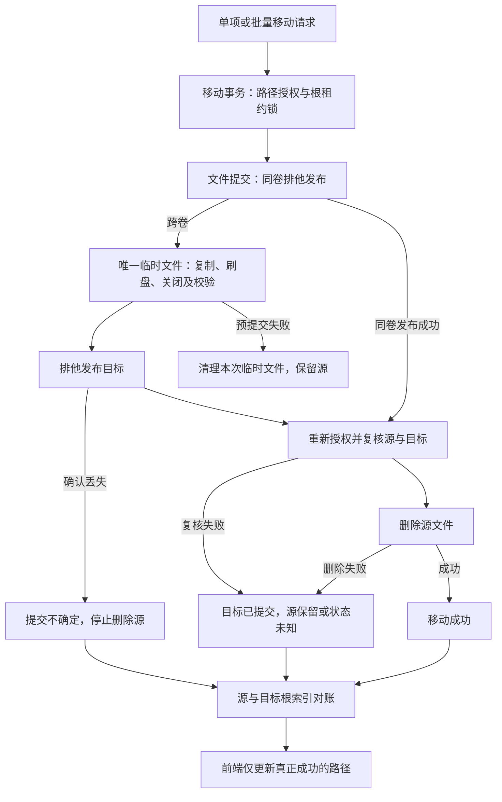
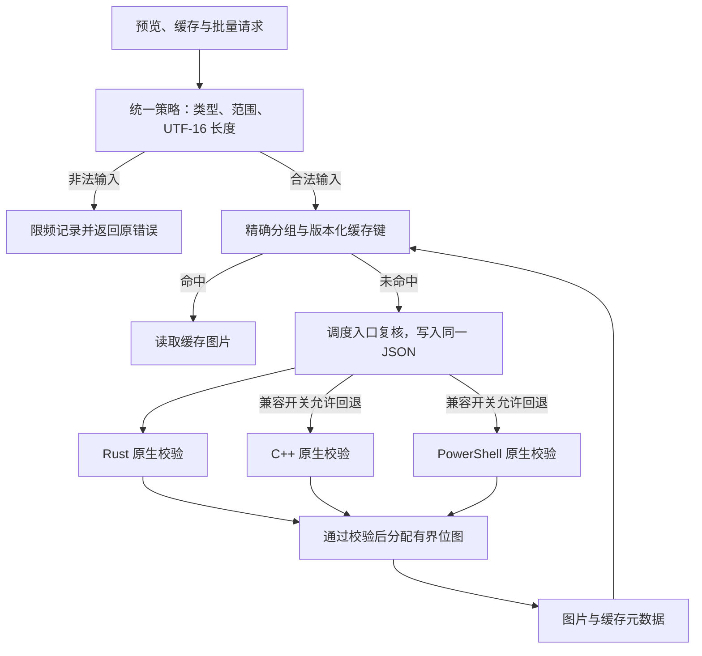

# HanFontManager Stage 3：文件移动一致性与预览限额任务书

## 0. 状态与基线

- 日期：2026-09-07；文档版本：1.1；应用版本保持 3.0.0。
- 分支：`stage/03-file-preview-consistency`；每个 Atomic Task 独立提交，不直接修改 main。
- Stage 2 完成基线：远端 `a2b9ef95a957d9ddf1ef72599572166036769beb`；本地 `cc001eb3770675ca1c6bdfb33d10388b3ee3f934`。
- 两个基线提交的代码树相同：`7d14bc2999155dc8cf36a3d9ecf59fdce38bec5b`。提交 ID 不同来自既有 GitHub 连接发布方式，不代表代码差异。
- 当前：AT-3.1 自动验证完成；AT-3.2 实现和本环境门禁完成，Rust/PowerShell 原生校验执行及 Windows 位图验收待补；Stage 3 不标为完整验收通过。
- AT-3.2 起点：远端 `e5f8d131786875b2bba591b2d01cf5c81b29a0ca`、本地 `cba6e011ce98496031dc673f56917b1402f42fd1`，同树 `e814ea2981bde6db5096ccf4fb562af4371f2be4`。
- 上级：[修复与编排重构总任务书](HFM_REMEDIATION_MASTER_TASKBOOK.md)。

## 1. 阶段目标与范围

| 原子任务 | 目标 | 状态 |
| --- | --- | --- |
| AT-3.1 | 跨卷移动先完成可验证的目标提交，再删除源；如实结算部分失败 | 自动验证完成，前一独立提交 |
| AT-3.2 | Rust/C++/PowerShell 预览入口统一 width、height、fontSize、text 长度边界 | 实现及本环境门禁通过，原生完整验收待补 |

AT-3.1 修改字体移动领域、文件提交协议、其主进程接线、共享结果类型、直接前端消费者和相应诊断；目录树读取及 create/rename 留在原模块。AT-3.2 只修改预览输入策略、其缓存/调度/IPC 日志消费者、直接相关原生校验与诊断。两个原子任务独立提交；不混入数据库迁移、Rust 命令、新生产依赖、通用 PowerShell 回退或 Stage 4/5/6 全文件搬迁。

## 2. AT-3.1 修复前证据

原 `physicalFolders.ts` 共 614 行，同时包含目录树、目录修改、字体移动、授权和批量结算。旧跨卷路径是直接复制到最终名称后 unlink 源：

- copy 期间不完整字体可能以最终扩展名可见。
- 无显式 flush/close、尺寸及摘要验证。
- 源删除失败时虽然返回失败，但 destination 赋值尚未完成，单项可能丢失已提交目标路径；批量失败项也不含完整状态。
- 单纯“检查不存在后 rename”无法排除其他进程在检查与 rename 之间创建目标。

可重现的旧树红灯：

```bash
node build/diagnostics/check-font-move-transaction.cjs --baseline=cc001eb
```

结果为预期退出 1：`cross-device copy was published directly: copy:font.ttf:none`。该 selector 只读取 Git 对象，不切换或修改工作树；长期门禁默认执行当前代码。

## 3. 已实现的职责边界

| 模块 | 唯一主要职责 | 不承担 |
| --- | --- | --- |
| `physicalFolders.ts` | 目录树读取、物理目录 create/rename 及其授权/对账 | 字体 copy/link/unlink、移动结果汇总 |
| `fontMoveTransactionRuntime.ts` | 字体移动预授权、根锚定租约锁、锁内重授权、单项/批量结算、根索引对账 | 临时文件生命周期与磁盘提交算法 |
| `fontFileMoveCommitRuntime.ts` | 目标选名、排他发布、跨卷临时文件、刷盘校验、删源顺序、提交失败状态 | renderer 身份、watched roots、IPC、UI 或批量统计 |
| `fontFolderTreeRuntime.ts` | 成功项保存、部分/不确定提交的索引刷新和状态提示 | 文件系统授权和删除源 |
| `fontFolderMutationRuntime.ts` | 仅将成功结果应用到库中的路径与物理文件夹分配 | 将部分失败解释为成功 |

文件提交模块只有一份执行状态；移动领域层通过 `revalidate` 和 `verifyDestination` 两个窄回调插入已有中央授权。单项和批量共用同一提交实现，没有复制业务状态、反向 import 或只转发万能依赖的兼容 facade。

## 4. 文件提交协议与必要调整

原任务书用“原子 rename”表达完整目标一次可见的目标。本实现使用 `link` 原子排他发布再移除旧名称：Node 普通 rename 会覆盖已存在目标，而 link 在目标已存在时拒绝，避免检查后覆盖的竞态。依据为 [Node 22 文件系统文档](https://nodejs.org/docs/latest-v22.x/api/fs.html#fsrenameoldpath-newpath-callback) 和 [link 系统调用语义](https://man7.org/linux/man-pages/man2/link.2.html)。

这是明确的兼容边界：要求目标文件系统支持硬链接。NTFS/NAS 的实际支持情况必须实机验证；不支持、权限不足或 NAS 拒绝该能力时安全失败，不回退到覆盖式 rename 或非原子最终路径复制。FAT/exFAT 等不支持硬链接的卷不能用本协议完成移动。未增加依赖、原生二进制或 PowerShell 路径。

执行顺序：

1. 主进程恢复移动源身份、授权目标目录；原有同目录不动与同名自动编号行为保留。
2. 授权 roots 锚定共享租约锁，锁内重新授权源/目标。
3. 同卷采用排他 link 发布；仅 EXDEV 进入跨卷复制，不把其他失败当成跨卷。
4. 跨卷在目标目录生成唯一 `.hfm-move-<UUID>.tmp`，COPYFILE_EXCL 创建；碰撞时不覆盖也不清理他人的文件。
5. 复制完成后使用可写文件句柄 sync，显式 close；两者失败都停止提交。
6. 验证普通文件、尺寸、源前后 dev/ino/mtime/size 快照与流式 SHA-256；摘要使用有界流，不整文件载入内存。
7. 再授权并排他发布目标；重新验证目标权限、内容与源身份。只有确认目标完整且源未变化后才 unlink 源。
8. 失败时清理本次拥有的临时文件。清理失败保留原错误、追加清理错误并返回精确 recoveryPath。
9. 已提交或提交不确定的操作均安排源/目标根索引对账；批量按授权根去重。
10. 前端只保存真正成功项，部分成功/状态不确定不改源记录路径，但仍刷新两侧索引。

## 5. 返回契约与兼容

IPC channel、方法名和既有 `ok/message/oldPath/newPath` 均保留。新增可选 outcome/recoveryPath 以及批量 failed[].result，不需要历史库数据迁移。旧消费者仍以 ok 判断是否成功，新消费者读取具体状态。

| outcome | ok | 可确认的状态 | 消费者动作 |
| --- | --- | --- | --- |
| unchanged | true | 已在目标目录，无磁盘变更 | 保持路径 |
| moved | true | 目标提交且源移除 | 更新成功项路径 |
| not-moved | false | 没有确认目标提交，未执行删源 | 保留源记录；如有 recoveryPath 提示清理 |
| target-committed-source-retained | false | 目标已提交，源路径仍存在 | 保留源记录、对账，提示不要直接重复移动 |
| target-committed-source-removed | false | 源已移除，但后续验证失败 | 通过索引对账恢复实际视图，不伪报完全成功 |
| target-committed-source-unknown | false | 目标已提交，但源当前无法读取确认 | 对账，恢复连接后核对 |
| commit-uncertain | false | I/O/传输错误使目标提交确认不可靠，未继续删源 | 对账两侧，禁止自动重试删源 |

批量 moved/movedCount 不包含部分失败。failed 行保留 id、fileName、message 及完整 result；锁冲突仍保留真实原因，已结算项目不会再次加入失败行。

## 6. 已实现链路图



## 7. AT-3.1 验收与诊断

长期诊断：`npm run diagnostics:font-move-transaction`，共 29 个场景：

- 跨卷正常完成；验证临时复制、COPYFILE_EXCL、sync、close、排他发布、unlink 顺序。
- 复制中途失败、flush 失败、close 失败、尺寸不符、摘要不符、提交失败、文件系统能力不支持。
- 源 unlink 失败、同名自动编号、同卷与跨卷提交时外部同名文件竞态。
- 提交后源内容变化、目标内容变化、临时文件清理失败、临时名字碰撞。
- 同卷不复制、同卷删源失败、租约冲突零副作用。
- 源被并发移除、源状态不可读取、NAS 已提交但确认响应丢失。
- 混合批量成功/部分失败、去重、路径与结果保留、两侧根一次对账。
- 六个真实子进程立即退出点：copy 过程中、copy 后、flush 后、目标发布后、删源前、删源后。

子进程中断不运行 finally。父进程检查真实临时目录的文件内容与名称，不能用普通异常代替进程退出；跨卷边界由 EXDEV 替身触发，实际文件 I/O 和发布由操作系统执行。

既有门禁：

- P6/P7 保留原 create/rename、未索引源、非字体、越界链接、锁内身份变化等行为测试；目标验证失败的断言增强为保留源及返回两条路径。
- 既有 lease 静态检查只按真实 owner 更新位置，锁约束不删减。
- 物理索引诊断增加实际 renderer 单项/混合批量调用：部分项不写库，成功项只保存一次，涉及的所有根均刷新；库变换函数也直接拒绝失败结果。
- `npm --offline run verify`：类型检查及 73/73 长期诊断通过。
- Electron/Vite main、preload、renderer 构建及 3/3 混淆通过。
- 编排契约：115 个注册键、7/2 生命周期 hooks、Rust 45 方法/38 命令、React 10 条关键流程保持通过。

## 8. 中断恢复与外部验收

进程中断后的恢复规则：

| 中断位置 | 磁盘上可恢复内容 | 恢复办法 |
| --- | --- | --- |
| 目标发布前 | 原源文件完整，可能留下非字体 .tmp；最终字体不可见 | 停止相关操作，确认源后清理确属该次中断的 .tmp，再重试 |
| 目标发布后、删源前 | 完整目标与原源共存；可能仍有临时名称 | 对账并比较两份内容/身份，确认后再决定保留或清理源；不要直接重复移动产生第三份 |
| 删源后 | 完整目标保留 | 正常扫描/刷新恢复索引，不以旧 renderer 路径重放删除 |
| NAS 确认丢失 | 源未被本事务继续删除，目标可能存在 | 恢复连接后核对目标与源，再人工决定后续操作 |

没有新增自动清理整个临时目录、盲目删除旧源或重放任意路径的恢复机制；避免把遗留名字当成删除授权。copy/sync 等可捕获失败会自动清理本次临时文件；真正进程退出留下的遗留物按上表恢复。

本轮非 Windows 环境，以下不是“已通过”：

- Windows 10/11 NTFS 同卷和实际不同盘符；中文、空格、长路径、UNC 与映射盘。
- NAS 服务端硬链接、权限和多客户端行为；不支持的卷必须清晰拒绝且保留源。
- Windows 占用文件、关闭句柄、刷盘、源删除失败及 UI 最终状态。
- NAS 断线/恢复、确认响应丢失后的实物状态，以及大批量文件移动时延。
- 机器断电、内核崩溃和设备/网络存储缓存持久性。文件 sync 不是目录元数据、控制器缓存或 NAS 断电持久性的保证。
- AT-3.1 未修改或重建 Rust；AT-3.2 的原生变更验收见第 10 节。

## 9. 巨型编排文件再审计

| 文件 | Stage 2 结束 | AT-3.1 后 | 判断 |
| --- | ---: | ---: | --- |
| src/main/index.ts | 2068 | 2075 | 净增 7 行，只拆成两个明确 runtime 构造与窄依赖接线；没有复制/摘要/失败状态算法 |
| rustCoreWorkerRuntime.ts | 2994 | 2994 | 未修改，Stage 5 边界不变 |
| App.tsx | 1397 | 1397 | 未修改，没有新增全局状态或巨型 Hook |
| AppRootView.tsx | 386 / 169 平铺属性 | 386 / 169 平铺属性 | 未修改，Stage 6 的强类型 view model 任务仍待执行 |
| physicalFolders.ts | 614 | 280 | 移动事务整体移出，目录树及 create/rename 保留 |
| fontMoveTransactionRuntime.ts | 无 | 348 | 移动领域授权、租约、结算与对账 owner |
| fontFileMoveCommitRuntime.ts | 无 | 251 | 临时文件及文件提交状态 owner；可单独注入 I/O 故障 |

拆分依据是状态、副作用及变化原因，不是行数。目录代码不导入移动 owner；磁盘 owner 不知道 FontItem、watched roots 或 UI；前端不解释底层文件副作用。该结果不等于已完成三大编排文件拆分，更不能承诺“完美”或无回归；Stage 4/5/6 仍必须沿既定契约审计后实施。

## 10. AT-3.2 执行与验收记录

1. 读取三条真实预览调用链与现有 Rust/C++/PowerShell 尺寸限制，确认当前常量、默认值及缓存键关系。
2. 先建立三个后端的可执行输入边界测试，覆盖最小/最大、上下越界、NaN/Infinity、非整数、空文本和超长文本；在旧实现上复现不一致。
3. 根据当前支持范围确定统一输入策略：有限数值、整数像素、width/height/fontSize 上下限和 text 长度；明确 clamp 与拒绝的分工，禁止任意静默截断字体内容。
4. 在进入任一后端前由单一 owner 规范化请求；不把各后端内部对象作为共享输入契约。
5. Rust 保留第二道校验；C++/PowerShell 使用一致常量。只改直接受影响的脚本/类型，不借机改 daemon、缓存存储或 Rust facade 架构。
6. 验证非法请求不进入不可控位图分配；错误/被修正请求日志有边界，不造成循环日志。
7. 跑定向输入边界、预览缓存/布局/调度门禁、typecheck、完整 diagnostics 与可用构建；需 Rust 构建而环境不可用时明确保留外部验证。
8. 重审 index.ts、Rust facade、App.tsx 的职责变化，补充本任务书、总任务书、README；单独提交在本 Stage 3 分支，不新建子任务分支。

### 10.1 修复前证据与统一契约

旧 Rust 会 clamp width 64–4096、height 32–2048、fontSize 8–320；C++ 仅下限保护，且在检查前转 unsigned；PowerShell 直接转型后分配。三者均无文本长度上限。旧 C++ 数值扫描会误读 null、指数形式和后续字段；Rust 将纯空白文本替换为默认文字，而其他后端保留空白。

新增真实调度模块行为测试后，旧实现首先复现非法 NaN width 被送入 Rust；可重复的三路旧树验证如下（均应退出 1，超长 text 进入后端）。测试只替换后端执行器，不启动 Windows 程序：

```bash
node build/diagnostics/check-preview-input-boundary.cjs --baseline=cba6e01 --engine=rust-directwrite
node build/diagnostics/check-preview-input-boundary.cjs --baseline=cba6e01 --engine=directwrite
node build/diagnostics/check-preview-input-boundary.cjs --baseline=cba6e01 --engine=powershell-gdi
```

从 GitHub 拉取者可将 baseline 换成同树远端提交 `e5f8d131`。

| 字段 | 统一策略 |
| --- | --- |
| width | number、有限整数，64–4096，含边界 |
| height | number、有限整数，32–2048，含边界 |
| fontSize | number、有限值，8–320，保留合法小数字号 |
| text | 字符串，最多 4096 个 UTF-16 code units；一个补充平面字符占两个单位；拒绝孤立代理项 |
| 空文本 | 仅空字符串转换为 `字体预览 AaBb 123`；空格、换行及其他实际内容保留，不截断 |
| 非法输入 | NaN/Infinity、错误类型、越界、非整数尺寸、超长文本明确拒绝，错误前缀 `PREVIEW_INPUT_INVALID` |
| 默认参数 | 保留公开运行时原默认值：即时预览 44/720/260，缓存 34/520/150；原生内部 JSON 必须显式提供上述四字段 |

选择拒绝而不是 clamp：缓存、任务参数与实际位图维持一致，不把超限输入静默变成另一请求。Rust 使用 `encode_utf16()` 计数，依据 [Rust 标准库文档](https://doc.rust-lang.org/std/primitive.str.html#method.encode_utf16)，不能用 UTF-8 字节数替代 Windows 文本长度。Context7 未检索到匹配片段，已使用该官方文档核对。

### 10.2 真实落位与错误链路

- `previewInputPolicy.ts` 是应用输入策略 owner；TS 常量由 PowerShell 脚本直接引用，Rust/C++ 镜像由长期诊断逐项锁定。
- 即时生成、单项/批量缓存读、缓存状态与调度入队都在写文件、建缓存键或创建任务前校验；非法请求不会写 failed 字体索引或污染 miss cache。
- 原生调度入口复核并写入同一 UTF-8 JSON；Rust 回调接到的对象与 C++/PowerShell 文件载荷相同。原生校验位于位图分配前，数值检查先于窄化转换。
- C++ 输入策略头文件独立于 Windows，可编译执行真实数字/文本解析与边界函数；JSON 转义、UTF-16 代理对及指数数字正确解析，数字 token 长度也有界。
- 合法小数字号不被调度器 Math.round 合并。组键改用精确参数数组 JSON，避免旧组键冲突。
- 策略日志按 sink 合并，每 5 秒最多一条并带已抑制数，不记录请求文本/路径；IPC 保留原异常但不重复展开该类错误。其他 IPC 错误日志保持原行为，显式开启的详细性能跟踪仍按原设置运行。
- 不新增缓存存储层、daemon、Rust facade、全局 React 状态或生产依赖；回退开关 `HFM_NODE_BRIDGE_FALLBACK=1` 的政策未改。

### 10.3 缓存与位图兼容影响

统一文本语义修复了 Rust 纯空白替换和 C++ JSON 转义误读。为避免命中旧语义生成的图，渲染版本提升为 PowerShell `center-v7`、DirectWrite/private GDI `inkbox-v8`；legacy 和 strict 两套 key 公式、schema 与存储格式不变。旧缓存不原地删除，新请求按新版本键读取并按需生成；首次浏览可能变慢并暂时占用更多缓存空间，旧文件继续由现有清理机制处理。共享元数据版本校验沿用原机制。

输出位图最多 4096×2048，32bpp 原始像素约 32 MiB。C++ 保留原 scratch 画布算法和正常布局，最大 scratch 为 12288×6144，约 288 MiB；两张原始位图合计最多约 320 MiB/请求，不代表整个进程 RSS 上限。现有并发限制继续生效，Windows 峰值内存仍需实测；本任务没有通过降低既有可用尺寸来伪造性能改善。

### 10.4 门禁、外部补验与 pull 后操作

- `npm --offline run verify`：typecheck 与 74/74 长期诊断通过。
- `diagnostics:preview-input-boundary`：175 个 JS 行为用例，包括三条分派路径、输入 JSON 一致、非法请求零后端调用、缓存读拦截、小数字号并发、100 次 IPC 拒绝的日志限频与缓存版本隔离。
- C++17 实际输入策略已通过 g++ 编译，59 个用例通过；不是 Windows GDI+ 渲染测试。
- Rust 与 PowerShell 共用输入 fixture，诊断会在工具可用时执行真实校验。当前缺 Cargo/PowerShell，明确打印 `EXTERNAL VERIFICATION REQUIRED`；不得解释为这两条原生测试已通过。
- 既有预览缓存/发布/元数据/布局/调度/并发门禁与编排契约通过；Electron/Vite main、preload、renderer 构建及混淆通过。

pull 后不需迁移字体库或更改依赖版本；**运行/打包前必须重建这次改动的 Rust 与 C++ 原生程序**，不要继续使用仓库中旧 C++ exe 来验收新文本语义。在已安装 VS 2022 C++ 工具链、Rust/Cargo 和依赖的 Windows 终端执行：

```bat
call native-src\preview-renderer\build-win.cmd
npm run rust:build
node build/diagnostics/check-preview-input-boundary.cjs --require-native
npm run verify
npm run build
```

原 C++ 构建脚本新增 `/utf-8`，避免编译默认代码页改变中文默认文本。严格诊断要求 C++ 编译器、PowerShell 与 Cargo 全部可执行；缺任何一项退出失败。Cargo 测试使用已有离线依赖。

Windows 后续还需分别以 Rust、显式允许的 C++/PowerShell 路径渲染边界尺寸、中文/emoji/空白/转义文本，检查非法输入没有输出 PNG，合法输出尺寸准确，失败不伪报成功，以及最大尺寸时的内存与关闭释放；旧/新缓存及共享缓存首次重建也需实机检查。缺少这些结果前，三条原生后端硬门禁和 Stage 3 完整验收仍待完成。

### 10.5 编排再审计与链路图

AT-3.2 未修改 `index.ts`（2075 行）、`rustCoreWorkerRuntime.ts`（2994 行）、`App.tsx`（1397 行）或 `AppRootView.tsx`（386 行、169 平铺属性）。115 注册键、7/2 生命周期、45 方法/38 命令及 10 条 UI 流程仍通过。输入规则放入独立 64 行策略模块，现有预览 runtime 仅调用该策略；跨后端依赖未倒灌进组合根。Stage 4/5/6 的拆分目标与验收要求保留，本任务不宣称巨型文件已拆完或达到“完美”。



## 11. 退出、回滚与记录

- AT-3.1 和 AT-3.2 均通过各自硬门禁后才可结束 Stage 3。
- Windows/NAS 矩阵逐项验收或明确留作外部项，不用替身成功冒充实机。
- 每个原子任务一个可回退提交。回滚 AT-3.1 时同时回滚两个 owner、组合、结果消费者及对应门禁，不保留半套协议。
- 没有数据库或持久配置迁移；回退代码不会自动删除磁盘上已经移动的字体或清理中断遗留文件。
- 本任务不删除用户字体资产、私钥或无关文件，不改 package-lock.json。
- AT-3.1 提交说明：`fix: 建立可恢复的字体移动提交协议`。
- AT-3.2 提交说明：`fix: 统一原生预览输入边界与缓存语义`。回滚时整组回滚策略、原生源码、调用方、缓存版本与门禁，并重建原生程序；不要只回退单一后端。
