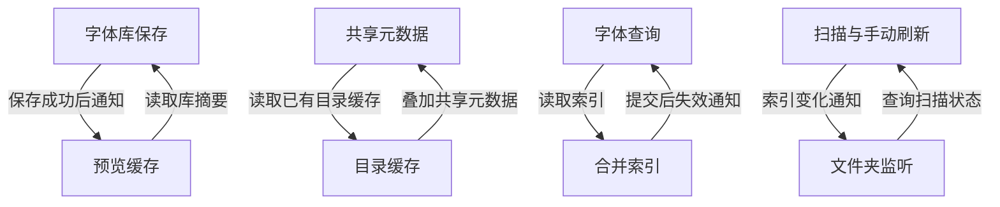

# HanFontManager Stage 4：主进程组合根拆分任务书

## 0. 状态与执行边界

- 版本：1.0；日期：2026-09-08；软件：HanFontManager 3.0.0。
- 分支：`stage/04-main-composition`，由 Stage 3 验收提交 `c8a6c39cc47059a42704003e00fe28ee4bc450a8` 创建；不合并到 main。
- 共同基线树：`e7db517757b201f9bea0313cf9b64d2395f55973`。连接器发布与本地提交的 SHA 可不同，以树一致性核对内容。
- 当前任务：AT-4.1 已完成，typecheck、76 项长期诊断及 Electron 三端构建/混淆通过；AT-4.2 至 AT-4.4 尚未开始。
- 前置证据：用户 Windows 拉取 `476c5d6` 后完整 build 成功，详见 [Stage 3 第 10.9 节](HFM_STAGE_03_FILE_PREVIEW_TASKBOOK.md#109-windows-完整构建通过与阶段交接)。没有 AT-3.3。
- 本文是 Stage 4 的执行记录；阶段顺序和不可妥协项以[总任务书](HFM_REMEDIATION_MASTER_TASKBOOK.md)为准。每个 Atomic Task 单独提交、单独回退，一个 Stage 共用一个分支。

拆分的判断标准是职责、依赖方向、资源单一所有权和行为等价。不能承诺所有循环都能消失，也不能用文件行数证明“完美拆分”。真实回调循环需要窄端口和明确绑定时机；初始化顺序问题才适合通过重排组合消除。

## 1. 原子任务与修复顺序

| 任务 | 最小交付 | 硬门禁 | 当前状态 |
| --- | --- | --- | --- |
| AT-4.1 | 四个组合阶段和 Application 的返回契约、生命周期归属、延迟绑定审计；接入现有注册适配器 | 真实 TypeScript 编译拒绝遗漏任一注册能力或 shutdown hook；运行时输出等价 | 完成 |
| AT-4.2 | 在 `src/main/bootstrap` 提取 Core、Data 工厂，按实际依赖定义输入端口 | 导入不新增副作用；路径、日志、DB/schema audit 顺序一致；句柄创建/关闭单一所有者 | 未开始 |
| AT-4.3 | 提取 Mutation、Operations；给必要循环建立显式绑定点 | 绑定完成前不启任务；启动、索引、刷新、退出/取消退出及异常退出保持原义 | 未开始 |
| AT-4.4 | 收敛 `index.ts` 和 Application；按 lifecycle/query/mutation/maintenance/preview 分组注册 | 115 项能力、7 个 app 事件、2 个 process 事件和完整行为门禁不丢失 | 未开始 |

## 2. AT-4.1 实际变更与契约边界

新增 `src/main/bootstrap/mainCompositionContracts.ts`，现有 `mainRuntimeRegistrationPayload.ts` 改用 `MainApplicationRegistration`。契约只通过 `import type` 引用真实类型；不创建实例，不执行数据库操作、定时器、IPC 注册或 shutdown。

组合表面由 `Required<Omit<MainProcessRuntimeRegistrationOptions, 'appendLog'>>` 派生。原有 IPC consumer 的可选钩子保持兼容，但主应用已经提供的能力在组合入口全部必填。`appendLog` 仍由 registrar 从 `appendStartupLog` 注入，不增加第 116 项输入。

| 返回契约 | 注册能力数 | 生命周期能力数 | 私有资源接口 | 所有权 |
| --- | ---: | ---: | --- | --- |
| `MainCoreCompositionRuntime` | 23 | 12 | 无业务 DB 句柄 | 日志、数据路径/启动标记、授权基础设施、Rust、Windows、性能采样、窗口与协议 |
| `MainDataCompositionRuntime` | 23 | 3 | `MainDataResourceLifecycle` 的 5 项关闭/检查点操作 | 字体库、查询、目录缓存、root/merged index、预览、应用缓存与查询 worker |
| `MainMutationCompositionRuntime` | 23 | 5 | 不重复暴露 DB 句柄 | 标签、安装/卸载、激活/停用、文件写操作及其持久化结算 |
| `MainOperationsCompositionRuntime` | 22 | 4 | `MainOperationsResourceLifecycle` 的 2 项操作 | 扫描、watcher、后台任务、维护与安装状态刷新；tasks DB |
| `MainApplicationRuntime` | 组合前四项，共 115 项 | 已包含在 115 项中 | 无新增资源所有者 | 只向注册方输出 `registration`，不重新导出全部内部服务 |

各阶段输出使用 `capabilities`、`lifecycle`，Data/Operations 另有 `resources`。24 项 lifecycle 与 91 项其他注册能力不交叠；编译期检查组合表面没有遗漏或多出的键。AT-4.4 才改变注册分组和入口组装形式。

这里固定的是应用对注册方的最小输出，不是所有工厂的内部互调接口。AT-4.2/4.3 提取时必须按实际消费者补充窄输入/协作端口，禁止返回整个依赖对象或重造巨型 context。现有 IPC 的 `unknown` 结果边界保留；本项不宣称已经消除旧数据库/IPC 内部的全部 `any`。新契约不引入 `any`，tasks 关闭接口直接表达真实 `() => void`，不沿用旧 bootstrap 中的 `(...args: any[]) => any`。

## 3. 资源与生命周期的单一所有权

| 资源/操作 | 创建及状态所有者 | 已有调用方与约束 |
| --- | --- | --- |
| library DB | `createLibraryDbConnectionRuntime`，归 Data | 暴露 `closeLibraryDb`，Operations 的 watcher 停止回调调用它；不复制句柄或关闭实现 |
| preview DB | `createPreviewDbRuntime`，归 Data | `closePreviewDb` 与 `clearLocalPreviewDbHandle` 保持各自语义，维护/恢复不可混用 |
| kvs/events/hash/metrics DB | `createCacheArchitectureRuntime`，归 Data | `checkpointOpenCacheDbs`、`closeCacheDb(label)`；label 保持既有四项，不把 tasks 偷塞进来 |
| tasks DB | `createBackgroundTaskRuntime`，归 Operations | `closeTasksDb`、`checkpointTasksDb`；Data 不声明第二份 tasks 所有权 |
| 查询 worker | Data | 保持 `dbQueryWorkerShutdown` 的 will-quit 调用 |
| 临时激活及删除/安装状态队列 | Mutation | 保留 cleanup、flush、pending/in-flight 查询；失败和取消退出语义不变 |
| watcher/后台调度 | Operations | 单个 start/stop 所有者；不因组合工厂导入就启动任务 |
| Rust daemon、性能采样、启动日志/标记 | Core | 保持 daemon stop、sampler stop/flush、clean marker、日志 async/sync flush 的阶段 |
| Electron 生命周期注册 | Application 调用既有 `mainProcessLifecycleRuntime` | 唯一注册点；不让各组合阶段各自注册第二份 app/process 钩子 |

现有 watcher 的 `closeRuntimeDatabases` 回调按 preview → tasks → library 顺序关闭，并分别捕获错误；AT-4.1 没有新建一次额外关闭调用。资源接口表示所有权和可调用能力，不代表每项都应在退出时追加执行。

正常退出先处理 renderer 的关闭/flush 与取消，再停止后台调度、清理临时字体并 flush 持久删除和安装状态；之后停止 watcher、采样并 flush 日志。will-quit 继续负责 query worker、Rust、clean marker 和同步日志。失败时恢复窗口/调度、用户选择继续退出等分支保持原状；异常退出钩子也不等价于正常退出流程。后续测试必须覆盖这些分支，不能只断言函数名存在。

## 4. 巨型编排文件与延迟绑定再审计

AT-4.1 基线及本次结果：`index.ts` 2075 行，`rustCoreWorkerRuntime.ts` 2994 行，`App.tsx` 1397 行；三者内容均未修改。`AppRootView` 仍 386 行/169 个 props。此项建立拆分边界，实际搬迁从 AT-4.2 开始。

### 4.1 八处顶层可变绑定

下列八项均来自当前 `index.ts` 的实际定义与赋值；本次保持赋值点、空值/空操作和调用时间不变。

| 绑定 | 读取方与唯一正式赋值点 | 性质 | 后续处理 |
| --- | --- | --- | --- |
| `backgroundTaskSchedulerRuntimeRef` | Core 性能统计读取活动数；赋值 `backgroundRuntime.schedulerRuntime` | Core 观察 Operations 运行状态，含跨阶段反馈 | AT-4.3 暴露只读活动状态回调，绑定一次后才能启动采样 |
| `folderCacheRuntimeRef` | library/shared metadata 的目录读取桥；赋值 `createFolderCacheRuntime` | 目录缓存叠加共享元数据，共享元数据又读已有缓存，存在真实 Data 内部循环 | AT-4.2 同一 Data 所有者保留窄缓存读端口；不得复制缓存实例 |
| `installStatusRefreshStarterRuntimeRef` | Core 查询活动刷新任务；赋值 `createInstallStatusRefreshStarterRuntime` 的结果 | 运行状态反馈与初始化顺序交叉 | AT-4.3 与性能状态端口一并显式绑定，保持无任务时的默认值 |
| `scanOrchestratorRuntime` | 性能、后台任务和刷新通过 `scanFoldersRuntime()` 查询；赋值 `createScanOrchestrator` | Core/Operations 状态反馈；消费者先构造 | AT-4.3 固定扫描唯一实例与未初始化保护，禁止提前执行回调 |
| `fontQueryFacadeRuntimeRef` | query 包装器与缓存失效回调；赋值 `createFontQueryFacadeRuntime` | 查询读 merged index，索引提交后清查询缓存，存在运行时反馈 | AT-4.2 以 query/invalidation 两个窄方向描述，保持同一缓存所有者 |
| `notifyPreviewLibraryShellChanged` | `saveLibrary` 成功后通知；赋值 `invalidatePreviewLibraryShellCache` | library 写成功 → preview 失效；preview 又读取 library shell | AT-4.2 保留 Data 内通知循环与成功后通知时序 |
| `syncMergedIndexAfterInstallStatusRefreshRuntime` | 激活持久化保存早于 root/merged index 构造；赋值同名实际同步函数 | 主要是 Mutation → Data 的前向初始化依赖 | AT-4.2/4.3 确立 Data 同步端口后再组装保存队列，或明确两阶段绑定 |
| `sendFontIndexChanged` | 扫描、手动刷新与元数据同步发通知；赋值 `folderWatcherRuntime.sendFontIndexChanged` | watcher 查询 scan 状态，scan/refresh 回调 watcher 通知，存在 Operations 内部反馈 | AT-4.3 明确单一通知绑定，禁止重复 watcher 或另造事件总线 |

### 4.2 不表现为 Ref 的前向回调

- 日志的 `logsDir: () => dataPath('logs')` 在路径 runtime 前构造，必须保持延迟读取，不能改为构造时求值。
- Rust daemon 事件先接到标签状态信号，再清查询缓存；信号与 Rust 构造早于全部缓存/facade 就绪。绑定完成前是否可能触发回调是 AT-4.2/4.3 的行为检查点。
- window/字体授权通过 watched folders 和 `mainProcessFontIndexContains` 查询后建的 library/root index。这是真实 Core → Data 查询依赖，不能为得到单向导入而放宽授权。
- 性能回调引用后建的 storage profile；merged page 回调引用后建的 root coordinator，主要受初始化顺序约束。
- background runtime 在 preview/scan/maintenance 之前拿到延迟函数；构造与实际启动必须分开，不能搬迁后在未绑定时执行任务。
- 共享标签启动刷新定时器已有 1500 ms 延迟和 `unref`。后续搬迁必须审计其 Mutation 工作和 Operations 调度的边界；本项没有移除或重设定时器。

### 4.3 已实现回调关系图

图只描述现有调用方向，不把尚未提取的组合工厂画成现有实现。



## 5. AT-4.2 至 AT-4.4 实施约束

AT-4.2 先清点 Core/Data 的构造输入、同步副作用、回调首次调用点，再迁移工厂。Core 不打开业务 DB；Data 创建和持有 library/cache/index/preview。授权查索引、日志查路径和缓存失效等跨向端口必须单独命名。不能为了使 Core 在 Data 前完整执行而提前打开库或删除校验。为导入、创建、绑定、启动分别记录行为轨迹，比较日志路径、缓存路径、DB 打开/关闭次数、schema audit 排程。

AT-4.3 在既有 Data 查询/同步端口上组装 Mutation，再组装 Operations。保持事务失败传播、补偿、批量结算和数据刷盘等待。确有循环时先创建服务，再绑定窄回调，最后才允许 start；绑定只能有一个所有者和一次正式赋值。为扫描取消、索引提交/失效、watcher 通知、后台暂停/恢复和退出失败分支增加真实调用轨迹用例；旧 A/P/移动/预览门禁继续全部执行。

AT-4.4 才使 `index.ts` 集中显示环境和顶层组合顺序，并让 Application 生成分组 payload。调整既有 AST 位置断言时必须保留原来的 115 项能力及行为锁，并证明遗漏、重复注册、重复 start/stop 的反例会失败，不能仅修改 fixture 迎合搬迁结果。删除无职责的转发层和旧 import，不以包装器层数增加替代解耦。

## 6. AT-4.1 验证设计与结果

新增长期门禁 `diagnostics:main-composition-contracts`，使用项目真实 TypeScript 5.9.3 和 tsconfig 的 strict 设置，运行编译器，不靠搜索源码关键字代替类型检查。

| 检查 | 覆盖内容 | 结果 |
| --- | --- | --- |
| 正向编译 | 四组能力/lifecycle 合并后进入真实适配器；实际 library/preview/cache/tasks 工厂的 close/checkpoint 与资源契约兼容 | 已通过专项检查 |
| 115 项逐项遗漏 | 每次从真实注册类型删除一项，向真实适配器提交，逐项核对编译错误位置与缺失键；涵盖所有 shutdown hooks | 已拒绝全部遗漏 |
| 资源与错误签名 | 7 项资源接口逐项遗漏、async flush 被改成同步空函数、shutdown 被替换成字符串、错误 cache DB label，共 10 项 | 已拒绝全部错误 |
| 旧适配器对照 | 用编译器内存源替身还原旧参数类型；证明遗漏原本可选的批量移动能力能被旧入口接受 | 通过，旧问题稳定复现 |
| 类型与运行时边界 | 115 项不重复/不漂移、退出钩子归属明确、新契约无显式 any/公开参数直接 any；契约擦除为无操作模块；适配器 JS token 等价且返回冻结原对象 | 通过 |
| 全量门禁 | `npm --offline run verify`：typecheck + 全部 76 项长期诊断 | 通过，exit 0 |
| 应用构建 | Electron/Vite main、preload、renderer 与混淆 | 通过，337/1/181 个模块构建；三份新 JS 产物混淆成功，日志 3/5，另两份前轮产物因已有标记跳过 |

原有编排诊断继续锁定 115 项注册键、7 个 app 事件、2 个 process 事件、Rust 45 项门面/38 条命令和 React 10 条流程；不修改其冻结 fixture。本次测试输入只在编译器内存中生成，不往源码树或用户字体目录写故障样本。

本轮审查环境的预览门禁通过 JS 190、C++ 输入策略 68 场景；PowerShell/Rust 明确输出 `EXTERNAL VERIFICATION REQUIRED`，没有把它解释成本轮两后端已执行。原生源码未变，Stage 3 Windows 成功记录继续保留；本轮只执行 Electron/Vite build 与混淆，未声称在本环境完成含 Cargo 的 `npm run build`。

插件记录：Context7 查询项目实际 TypeScript 5.9.3 的 Required/Pick 类型语义并用编译器验证；Mermaid Chart 已渲染第 4.3 节的真实回调关系图。Git 与本文承担正式验收记录。

## 7. pull 后操作、外部项与回退

Stage 4 是新分支。先检查 `git status --short`，保存自己对受跟踪文件的改动。首次切换可运行：

```bat
cd /d F:\Electron+Rust\HanFontManager_Electron_rust
git fetch origin
git switch --track origin/stage/04-main-composition
npm run verify
```

若本地已经有同名分支，改用 `git switch stage/04-main-composition`，再 `git pull --ff-only origin stage/04-main-composition`。不要在 Stage 3 分支上用 pull 代替切换 Stage 4。路径 symlink 诊断仍要求有相应 Windows 权限；保持前轮验证成功的终端环境。

AT-4.1 只更改 TypeScript 类型与诊断/文档，不改依赖版本、数据库/schema、缓存键、字体文件或原生源码。无需为本项迁移字体库或额外重建 C++/Rust；要运行新版应用仍按通常流程构建。Linux 审查环境不能代替 Windows 安装包、GDI+ 实际位图/峰值内存、NAS 多客户端/断电、真实跨卷和字体占用验收；这些项仍承接 Stage 1–3 记录，未勾选为通过。

回退使用当前 Atomic Task 提交的独立 revert，并重新执行 verify；不执行破坏性 reset，不清理用户本地数据。出现注册遗漏、初始化提前执行、双重资源所有权或退出语义改变时，停止当前搬迁并修复，不进入下一 Atomic Task。
