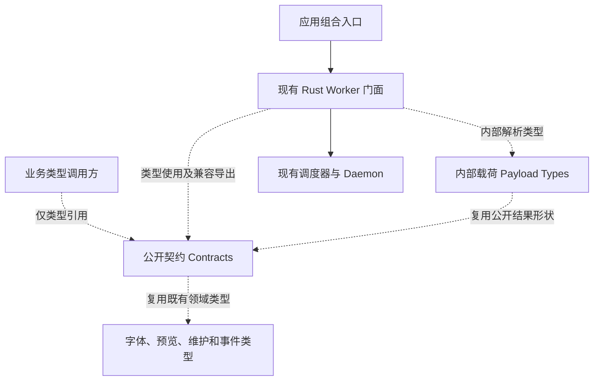

# HanFontManager Stage 5：Rust Worker 门面拆分任务书

## 0. 状态与执行边界

- 版本：1.0；日期：2026-09-10；软件：HanFontManager 3.0.0。
- 分支：`stage/05-rust-worker-composition`，由 Stage 4 远端提交 `d316b44dc8561876bab277ecc8b886f925b7c6b8` 创建；基线树 `52ac20e65d2a960eee5b255c3d5a80072d857308`。
- 当前任务：AT-5.1 公开契约与内部 payload 提取实现及自动验证完成，typecheck、81/81 项诊断、三端构建和混淆通过；AT-5.2 至 AT-5.4 未实施。
- 进入依据：用户明确要求开始 5.1，Stage 4 自动验证已通过。最后收到的 Windows 完整 build 回执是 `c981777`；`d316b44` 的 Windows 复验回执尚未提供，继续记为外部待验，不将其写成通过，也没有已知新失败被跳过。
- 本文是 Stage 5 执行明细，上级与顺序以[总任务书](HFM_REMEDIATION_MASTER_TASKBOOK.md)为准。每个 Atomic Task 独立提交和回退，Stage 内沿用本分支；不修改 main。

## 1. 目标与兼容约束

从 `rustCoreWorkerRuntime.ts` 分离公开契约、内部协议载荷、传输和领域 client，最后使门面只负责组合及兼容导出。按状态和职责划分，不按目标行数拆文件。

必须保持：

1. 45 项返回方法和 38 条领域命令的名称、签名、capability、CLI 参数和返回语义。
2. 89 个原公开类型的字段、必填性、联合类型、字面量与外部领域类型身份；旧 import 路径继续可用。
3. worker 不可用、未提交失败、已提交失败、主动取消、Rust `ok: false` 的不同处理；不能因拆分新增重复写或静默 fallback。
4. scheduler/daemon、诊断缓存、日志节流状态只有一个实例所有者；启动和停止顺序不变。
5. 临时 JSON 文件创建、读取和清理与命令生命周期对应；取消监听必须清理。
6. 不更改依赖版本、数据库/缓存格式、协议版本、IPC、Rust/C++ 源码、字体数据或安装流程。

## 2. AT-5.1 前的二次审计

### 2.1 真实类型数量与所有权

| 范围 | 本次确认 | AT-5.1 归属 |
| --- | --- | --- |
| 原门面文件 | 2994 行 | 类型搬迁后 2195 行，运行时函数文本保留 |
| 公开类型 | 89 个 `export type`，包含 Input/Result/Status、行数据、提示、协议结果和工厂 options | `rustCoreWorkerContracts.ts`，781 行；一个权威声明来源 |
| 内部 JSON 类型 | 38 个私有命名类型，包含握手、scheduler profile 和领域 payload | `rustCoreWorkerPayloadTypes.ts`，283 行；仅 rust-core 内部消费 |
| 执行选项 | `RustCoreExecOptions` | 仍是门面私有传输类型，随 AT-5.2 一起审计，不能混入 stdout payload |
| 原类型调用方 | shared metadata 的 3 个模块、watcher 类型、protocol 兼容检查，共 5 个 | 改用显式 `import type` 从 contracts 引用 |
| 原运行时调用方 | `mainCoreCompositionRuntime.ts` | 仍从旧门面创建 worker，导入不变 |

contracts 继续以类型引用复用 `CachedFontStatLike`、共享字体模型、`FontParseJob`、预览缓存行、维护报告和 daemon domain event。没有复制这些既有声明，也没有把领域模块或 daemon 实例加载到运行时。旧扫描模块中原本存在的相似 hint 定义不属于本项搬迁范围，本项不另外统一它们。

### 2.2 仍在门面内的实际运行时职责

| 职责 | 当前状态/调用链 | 后续归属与限制 |
| --- | --- | --- |
| worker 探测 | path resolution → 开发自动构建 → handshake/兼容检查 → `cachedStatus`；scheduler profile 单独加载 | AT-5.2 transport；保持 required/enabled、重试、错误和日志行为 |
| 调度与 daemon | 每个门面工厂创建一个 scheduler、一个 daemon，事件回调来自 options | AT-5.2 transport；业务 client 不得各建一套 |
| 命令路由 | 先 `daemon.tryRun`；主动取消/已提交错误上抛；未提交失败或不可用再走 scheduler + execFile | AT-5.2 固定 submitted 与 fallback 边界 |
| 取消合并 | scheduler signal 与外部 signal 合并，exec 在 finally 中解绑 | AT-5.2 保持取消原因及清理时机 |
| 失败日志 | daemon 与 preview 各有一个 Map，归一化键、8000 ms 节流和 suppressed 计数 | 搬迁前后保持相同状态所有者与语义，不新增全局缓存 |
| JSON 文件协议 | 各领域命令使用临时输入/输出文件并清理 | AT-5.2 统一生命周期，领域序列化/归一化仍由对应 client 负责 |
| 38 条领域命令 | maintenance、preview、Windows、metadata、indexing 共享命令入口 | AT-5.3 每次只迁移一个领域组，禁止一次性搬完 |

类型提取尚未完成运行时职责拆分，2195 行的门面仍同时拥有以上职责；不能以已减少 799 行宣称 Stage 5 完成。

## 3. Atomic Task 与验收顺序

### AT-5.1 公开契约与内部 payload

- [x] 在基线提取前运行原编排门禁，锁定 115 项主进程能力、45 项 Rust 方法、38 条命令及 unavailable/null、submitted/throw 语义。
- [x] 从原 AST 建立 89 个公开类型、38 个内部类型和既有依赖身份快照；只忽略注释、空白和换行，不忽略类型字段。
- [x] 新建两个仅类型模块，将原声明迁入；只为内部跨文件使用增加 payload 的模块导出，不通过公共门面导出。
- [x] 原门面显式 `export type` 兼容原 89 个公开名称；实现只导入实际使用的类型。
- [x] 5 个生产类型调用方改从 contracts 引用；原编排类型 fixture 保留旧路径，持续验证兼容。
- [x] 验证 6 个既有生产文件的编译后 JavaScript token 与 `d316b44` 相同；门面从首个运行时函数起的源文本逐字相同。
- [x] 加入长期门禁，验证公开身份/形状、payload 隔离、类型擦除、依赖方向和反例。
- [x] 全量 verify、三端构建、混淆和最终差异复核。
- [x] README/总任务书记录已更新；本项以独立提交交付，提交和树身份以阶段分支 Git 记录为准。

允许修改：两个类型模块、门面类型定义/导入导出、5 个类型引用方、诊断及必要任务书。不得迁移、重排或修改可执行逻辑。

### AT-5.2 提取 transport（未开始）

1. 先为实际门面补齐可控 worker/daemon/scheduler/时钟/临时文件替身，记录基线行为。
2. 定义窄 transport 接口，覆盖诊断、命令执行、缓存失效、scope 取消、交互活动、daemon 状态和停止；类型以已实现需求为准。
3. 搬迁唯一状态所有者和临时文件生命周期；保留不同领域的校验、payload 归一化与返回组装。
4. 覆盖 worker 缺失、required 失败、握手不兼容、profile 失败、daemon 不可用、提交前失败、提交后失败、取消、超时、JSON 失败及清理失败。
5. 对比原命令调用顺序、fallback 次数、临时文件清理和 8000 ms 日志节流；保持当前 45/38 门禁、全量 verify 和 build。

### AT-5.3 按领域提取 client（未开始）

顺序：maintenance → preview → Windows → metadata → indexing。每组独立提交、独立验证，工厂与文件名按总任务书约定落位。

- client 通过 transport 执行命令，不直接 execFile、另建 daemon 或复制传输状态。
- 领域归一化函数与本领域 payload 使用一同审计；只有已确认跨领域且纯粹的转换才能共享。
- 每组必须保留 null/throw/`ok: false` 行为、CLI/capability 和结果字面量，不能在搬迁时顺便“统一”不同语义。
- 每组运行定向诊断、完整 verify、Rust build 与 Electron build；实际无法运行的环境门禁明确保留，不写成通过。

### AT-5.4 收敛兼容门面（未开始）

- 门面只创建 transport、创建各 client、组合原有方法，保留公开类型兼容导出。
- 删除本阶段失去用途的旧声明、实现和导入；禁止创建整包透传 options 或第二套状态。
- 审计全部所有者、依赖图、方法签名、错误/fallback 与退出行为；记录将来的协议升级入口，不在本阶段升级协议。
- 完整自动门禁和 Windows 实机验收完成后再接受 Stage 5，进入 Stage 6 时新建分支。

## 4. 已实现的类型依赖关系

实线为运行时调用，虚线为类型依赖；图中不包含尚未实现的 transport/client 文件。



## 5. AT-5.1 验证记录

### 5.1 新增长期诊断

`npm run diagnostics:rust-worker-contracts`：

- 89 个公开类型的名称、字段形状与外部依赖身份快照不变；编译器同时证明新旧入口类型相等，旧导出实际 alias 指向同一声明。
- 38 个命名 payload 形状不变，不能进入旧门面公共导出；38 个非法公开访问和 3 个错误字段/缺少必填项由真实 TypeScript 编译器拒绝。
- contracts/payload 模块只允许类型声明和显式类型导入；实际编译并运行后的模块无导出值、不触发 require。
- 扫描生产源码的 import、export-from、import type 查询、动态 import 和字面量 require；内部 payload 不被 rust-core 外部消费，也不能经门面重导出。
- 类型消费者不得重新依赖门面；从两个新模块追踪既有源码的传递依赖，拒绝回到自身的循环或反向依赖门面实现。
- 9 个反例：公开必填变可选、删除公开 export、缩窄 payload、引入值 import、运行时加载副作用、间接循环、业务层引用 payload、门面重导出 payload、业务退回旧类型 import。
- 两个类型模块和门面使用 CRLF 时，形状、边界和擦除断言同样通过；编译器覆盖层使用正反斜杠统一的宿主路径身份。

### 5.2 原门禁与运行时代码

- 原 `orchestration-contracts.fixture.json` 和 `orchestration-contract-types.fixture.ts` 不修改，继续锁定 45 个方法、38 条 CLI/capability 路线和返回签名。
- `check-shared-metadata-field-merge.cjs` 的 TS 类型检查路径改到新 contracts，原 `baseTagNamesJson` / `mergePolicy` 及 Rust 字段/状态机断言全部保留。
- 以 TypeScript 5.9.3 将变更前后 6 个现有生产文件编译为 ES2022/ESNext，去除注释和空白后比较全部 JS token 的 SHA-256：逐文件一致。类型模块新增的声明不会加载 fontkit、worker_threads、daemon 或数据库模块。
- 新门禁已加入现有 `diagnostics:*` 自动发现机制：`npm --offline run verify` 退出码 0，typecheck 与 **81/81** 项诊断全部通过；包含既有 125 项编译反例、正反斜杠/混合路径六组用例及原生命周期/事务/预览门禁。
- `electron-vite build` 退出码 0，main/preload/renderer 分别构建 348/1/181 个模块；`obfuscate-dist.cjs` 退出码 0，本轮 3 个新 JS 完成混淆，2 个已有标记的输出保持原状（日志 3/5）。

查证与交接：Context7 查询了 TypeScript 5.9.3 的类型导入/重导出擦除行为，结合实际编译器验证；Mermaid Chart 已呈现第 4 节的真实依赖图。阶段状态通过 Create State 交接，Git 与任务书仍为权威记录。

### 5.3 环境边界

本项未改变 Rust/C++ 源码、依赖版本、锁文件、数据库结构、缓存键或字体资产。当前 Linux 审查环境缺少 Cargo/PowerShell，不能在这里证明 Windows 完整 build、GUI/退出、NAS 多客户端、实际预览位图/峰值内存或安装包通过。上一版 Windows 回执仅作为已有证据保留。

## 6. 拉取、复验与回退

在已有依赖的 Windows VS 2022 x64 开发者终端、项目目录执行：

```bat
git status --short
git fetch origin
git switch stage/05-rust-worker-composition
git pull --ff-only origin stage/05-rust-worker-composition
npm run build
```

首次切换时，Git 可从唯一的同名远端分支建立本地跟踪分支；如出现同名分支歧义，使用 `git switch --track origin/stage/05-rust-worker-composition`。本项无额外依赖安装或数据迁移要求。保留用户此前在本机重建的原生 exe；如 Git 报本地改动冲突，按实际文件处理，不使用 hard reset、clean 或丢弃用户改动。

回退单位是 AT-5.1 独立提交的 `git revert`。后续 AT-5.2 沿用本 Stage 5 分支；不为每个原子任务再开分支。
