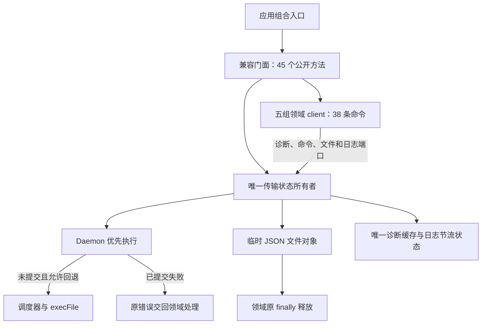

# HanFontManager Stage 5：Rust Worker 门面拆分任务书

## 0. 状态与执行边界

- 版本：1.6；日期：2026-09-11；软件：HanFontManager 3.0.0。
- 分支：`stage/05-rust-worker-composition`，由 Stage 4 远端提交 `d316b44dc8561876bab277ecc8b886f925b7c6b8` 创建；基线树 `52ac20e65d2a960eee5b255c3d5a80072d857308`。
- 当前任务：AT-5.3 已完成 5/5 组领域 client（38/38 条命令），各组独立提交；typecheck、83/83 项诊断、Electron 三端构建及混淆通过。AT-5.3 实现及自动验证完成，AT-5.4 未开始。
- 进入依据：用户提供 5.2 流程的 Windows 成功日志（Cargo 1.97.1 release、worker 复制、公钥同步、Vite 349/1/181 与混淆 3/3）并明确要求开始 5.3；该片段没有 diagnostics 汇总或 HEAD，不额外声称核验这些内容。本项源码基线已核实为 `dd6f8d7ef4536bfbaa52a9f2b5180d5e4f422e5b`，树 `9877b50295efc481fdcc1dc237fdb0cb2fcfb1b0`。
- 本文是 Stage 5 执行明细，上级与顺序以[总任务书](HFM_REMEDIATION_MASTER_TASKBOOK.md)为准。每个 Atomic Task 独立提交和回退，Stage 内沿用本分支；不修改 main。

## 1. 目标与兼容约束

从 `rustCoreWorkerRuntime.ts` 分离公开契约、内部协议载荷、传输和领域 client，最后使门面只负责组合及兼容导出。按状态和职责划分，不按目标行数拆文件。

必须保持：

1. 45 项返回方法和 38 条领域命令的名称、签名、capability、CLI 参数和返回语义。
2. 89 个原公开类型的字段、必填性、联合类型、字面量与外部领域类型身份；旧 import 路径继续可用。
3. worker 不可用、未提交失败、已提交失败、主动取消、Rust `ok: false` 的不同处理；不能因拆分新增重复写或静默 fallback。
4. scheduler/daemon、诊断缓存、日志节流状态只有一个实例所有者；启动和停止顺序不变。
5. 临时 JSON 文件创建、读取和清理与命令生命周期对应；取消监听必须清理。
6. 不更改依赖版本、数据库/缓存格式、协议版本、IPC、Rust/C++ 源码、字体数据或安装流程。

## 2. AT-5.1 前的二次审计

### 2.1 真实类型数量与所有权

| 范围 | 本次确认 | AT-5.1 归属 |
| --- | --- | --- |
| 原门面文件 | 2994 行 | 类型搬迁后 2195 行，运行时函数文本保留 |
| 公开类型 | 89 个 `export type`，包含 Input/Result/Status、行数据、提示、协议结果和工厂 options | `rustCoreWorkerContracts.ts`，781 行；一个权威声明来源 |
| 内部 JSON 类型 | 38 个私有命名类型，包含握手、scheduler profile 和领域 payload | `rustCoreWorkerPayloadTypes.ts`，283 行；仅 rust-core 内部消费 |
| 执行选项 | `RustCoreExecOptions` | 仍是门面私有传输类型，随 AT-5.2 一起审计，不能混入 stdout payload |
| 原类型调用方 | shared metadata 的 3 个模块、watcher 类型、protocol 兼容检查，共 5 个 | 改用显式 `import type` 从 contracts 引用 |
| 原运行时调用方 | `mainCoreCompositionRuntime.ts` | 仍从旧门面创建 worker，导入不变 |

contracts 继续以类型引用复用 `CachedFontStatLike`、共享字体模型、`FontParseJob`、预览缓存行、维护报告和 daemon domain event。没有复制这些既有声明，也没有把领域模块或 daemon 实例加载到运行时。旧扫描模块中原本存在的相似 hint 定义不属于本项搬迁范围，本项不另外统一它们。

### 2.2 AT-5.2 开始前的实际运行时职责

| 职责 | 当前状态/调用链 | 后续归属与限制 |
| --- | --- | --- |
| worker 探测 | path resolution → 开发自动构建 → handshake/兼容检查 → `cachedStatus`；scheduler profile 单独加载 | AT-5.2 transport；保持 required/enabled、重试、错误和日志行为 |
| 调度与 daemon | 每个门面工厂创建一个 scheduler、一个 daemon，事件回调来自 options | AT-5.2 transport；业务 client 不得各建一套 |
| 命令路由 | 先 `daemon.tryRun`；主动取消/已提交错误上抛；未提交失败或不可用再走 scheduler + execFile | AT-5.2 固定 submitted 与 fallback 边界 |
| 取消合并 | scheduler signal 与外部 signal 合并，exec 在 finally 中解绑 | AT-5.2 保持取消原因及清理时机 |
| 失败日志 | daemon 与 preview 各有一个 Map，归一化键、8000 ms 节流和 suppressed 计数 | 搬迁前后保持相同状态所有者与语义，不新增全局缓存 |
| JSON 文件协议 | 各领域命令使用临时输入/输出文件并清理 | AT-5.2 统一生命周期，领域序列化/归一化仍由对应 client 负责 |
| 38 条领域命令 | maintenance、preview、Windows、metadata、indexing 共享命令入口 | AT-5.3 每次只迁移一个领域组，禁止一次性搬完 |

类型提取尚未完成运行时职责拆分，2195 行的门面仍同时拥有以上职责；不能以已减少 799 行宣称 Stage 5 完成。

## 3. Atomic Task 与验收顺序

### AT-5.1 公开契约与内部 payload

- [x] 在基线提取前运行原编排门禁，锁定 115 项主进程能力、45 项 Rust 方法、38 条命令及 unavailable/null、submitted/throw 语义。
- [x] 从原 AST 建立 89 个公开类型、38 个内部类型和既有依赖身份快照；只忽略注释、空白和换行，不忽略类型字段。
- [x] 新建两个仅类型模块，将原声明迁入；只为内部跨文件使用增加 payload 的模块导出，不通过公共门面导出。
- [x] 原门面显式 `export type` 兼容原 89 个公开名称；实现只导入实际使用的类型。
- [x] 5 个生产类型调用方改从 contracts 引用；原编排类型 fixture 保留旧路径，持续验证兼容。
- [x] 验证 6 个既有生产文件的编译后 JavaScript token 与 `d316b44` 相同；门面从首个运行时函数起的源文本逐字相同。
- [x] 加入长期门禁，验证公开身份/形状、payload 隔离、类型擦除、依赖方向和反例。
- [x] 全量 verify、三端构建、混淆和最终差异复核。
- [x] README/总任务书记录已更新；本项以独立提交交付，提交和树身份以阶段分支 Git 记录为准。

允许修改：两个类型模块、门面类型定义/导入导出、5 个类型引用方、诊断及必要任务书。不得迁移、重排或修改可执行逻辑。

### AT-5.2 提取 transport（实现及自动验证完成）

- [x] 使用实际门面和边界替身，先从 `e7b3d8a` 固化 369 个命令用例及 7 组状态/生命周期序列；基线 fixture 不随新实现更新。
- [x] 提取 10 项内部 transport 端口；公开门面保持原 45 个方法，领域仍有 38 条命令。
- [x] 搬迁唯一 scheduler、daemon、诊断缓存和两组失败日志 Map；握手/重试、required/enabled、事件、8000 ms 节流和取消监听行为不变。
- [x] 28 处临时文件统一由 transport 创建文件对象，领域在原 try 中读写、原 finally 中释放；领域参数、结果、异常/fallback 判断保留。
- [x] 对比未提交/已提交失败、主动取消、超时、maxBuffer、JSON/文件故障、失败清理、并发释放时序及缓存状态；真实 Node 子进程与 10 个退化反例通过。
- [x] 完整 verify、三端构建、混淆、差异复审、README 与任务书更新；独立提交和回退，沿用 Stage 5 分支。

### AT-5.3 按领域提取 client（实现及自动验证完成）

顺序：maintenance → preview → Windows → metadata → indexing。每组独立提交、独立验证，工厂与文件名按总任务书约定落位。

- client 通过 transport 执行命令，不直接 execFile、另建 daemon 或复制传输状态。
- 领域归一化函数与本领域 payload 使用一同审计；只有已确认跨领域且纯粹的转换才能共享。
- 每组必须保留 null/throw/`ok: false` 行为、CLI/capability 和结果字面量，不能在搬迁时顺便“统一”不同语义。
- 每组运行定向诊断、完整 verify、Rust build 与 Electron build；实际无法运行的环境门禁明确保留，不写成通过。

### AT-5.4 收敛兼容门面（未开始）

- 门面只创建 transport、创建各 client、组合原有方法，保留公开类型兼容导出。
- 删除本阶段失去用途的旧声明、实现和导入；禁止创建整包透传 options 或第二套状态。
- 审计全部所有者、依赖图、方法签名、错误/fallback 与退出行为；记录将来的协议升级入口，不在本阶段升级协议。
- 完整自动门禁和 Windows 实机验收完成后再接受 Stage 5，进入 Stage 6 时新建分支。

## 4. 已实现的传输与状态关系

图中只包含已实现的调用；公开契约与私有 payload 仍为仅类型依赖。AT-5.3 已提取的 client 与门面共用唯一 transport。



领域继续决定如何处理 transport 抛出的错误；transport 不统一各领域的 null、throw 或 `ok: false` 返回。

## 5. AT-5.1 验证记录

### 5.1 新增长期诊断

`npm run diagnostics:rust-worker-contracts`：

- 89 个公开类型的名称、字段形状与外部依赖身份快照不变；编译器同时证明新旧入口类型相等，旧导出实际 alias 指向同一声明。
- 38 个命名 payload 形状不变，不能进入旧门面公共导出；38 个非法公开访问和 3 个错误字段/缺少必填项由真实 TypeScript 编译器拒绝。
- contracts/payload 模块只允许类型声明和显式类型导入；实际编译并运行后的模块无导出值、不触发 require。
- 扫描生产源码的 import、export-from、import type 查询、动态 import 和字面量 require；内部 payload 不被 rust-core 外部消费，也不能经门面重导出。
- 类型消费者不得重新依赖门面；从两个新模块追踪既有源码的传递依赖，拒绝回到自身的循环或反向依赖门面实现。
- 9 个反例：公开必填变可选、删除公开 export、缩窄 payload、引入值 import、运行时加载副作用、间接循环、业务层引用 payload、门面重导出 payload、业务退回旧类型 import。
- 两个类型模块和门面使用 CRLF 时，形状、边界和擦除断言同样通过；编译器覆盖层使用正反斜杠统一的宿主路径身份。

### 5.2 原门禁与运行时代码

- 原 `orchestration-contracts.fixture.json` 和 `orchestration-contract-types.fixture.ts` 不修改，继续锁定 45 个方法、38 条 CLI/capability 路线和返回签名。
- `check-shared-metadata-field-merge.cjs` 的 TS 类型检查路径改到新 contracts，原 `baseTagNamesJson` / `mergePolicy` 及 Rust 字段/状态机断言全部保留。
- 以 TypeScript 5.9.3 将变更前后 6 个现有生产文件编译为 ES2022/ESNext，去除注释和空白后比较全部 JS token 的 SHA-256：逐文件一致。类型模块新增的声明不会加载 fontkit、worker_threads、daemon 或数据库模块。
- 新门禁已加入现有 `diagnostics:*` 自动发现机制：`npm --offline run verify` 退出码 0，typecheck 与 **81/81** 项诊断全部通过；包含既有 125 项编译反例、正反斜杠/混合路径六组用例及原生命周期/事务/预览门禁。
- `electron-vite build` 退出码 0，main/preload/renderer 分别构建 348/1/181 个模块；`obfuscate-dist.cjs` 退出码 0，本轮 3 个新 JS 完成混淆，2 个已有标记的输出保持原状（日志 3/5）。

查证与交接：Context7 查询了 TypeScript 5.9.3 的类型导入/重导出擦除行为，结合实际编译器验证；Mermaid Chart 已呈现第 4 节的真实依赖图。阶段状态通过 Create State 交接，Git 与任务书仍为权威记录。

### 5.3 环境边界

本项未改变 Rust/C++ 源码、依赖版本、锁文件、数据库结构、缓存键或字体资产。当前 Linux 审查环境缺少 Cargo/PowerShell，不能在这里证明 Windows 完整 build、GUI/退出、NAS 多客户端、实际预览位图/峰值内存或安装包通过。上一版 Windows 回执仅作为已有证据保留。

## 6. AT-5.2 实施与验证记录

### 6.1 状态与文件所有权

| 模块 | 已落实的职责 | 保持的边界 |
| --- | --- | --- |
| `rustCoreWorkerTransportRuntime.ts`（283 行） | 路径探测、自动构建/握手/兼容判断、scheduler profile、命令路由、取消合并、诊断缓存、daemon/scheduler、两组日志节流 Map、临时文件 API | 每个门面只创建一个 transport；每个 transport 只创建一套状态；不解释领域结果 |
| `rustCoreWorkerRuntime.ts`（2195→1985 行） | 38 条领域命令、领域输入/输出归一化、原失败与 fallback 语义、45 项公开方法、89 个兼容类型导出 | 仍是中间状态，不能把本项称为纯组合门面或 Stage 5 已全部完成 |
| `RustCoreJsonFile` 文件对象 | `path`、`writeJson`、`readText`、`dispose`；路径生成、UTF-8 JSON 和 best-effort 删除只有一个实现 | 命令保留原 finally 释放点；并发请求不共享文件，删除失败不覆盖原结果或根因 |

transport 的 10 个端口是原有 7 个状态/控制入口，加上命令执行、preview 失败日志与临时文件对象创建。JSON 首行解析和 capability 判断为无状态函数；执行选项随 transport 搬迁，未混入 payload。`RustCoreWorkerTransportRuntime` 为内部推导类型，不扩展公共门面。

原状态缓存行为（包括 required 首次失败后读取已缓存状态）、domain event 接线、daemon poll/stop、日志归一化键与 suppressed 计数均保留。没有因搬迁增加失败重试或第二次有副作用的执行。

### 6.2 行为基线与反例

新增 `diagnostics:rust-worker-transport`，使用真实编译后的门面和 transport，只替换进程/文件/时钟以及既有 daemon/scheduler 边界：

- 369 个冻结命令用例：38 条命令分别执行 one-shot、daemon、提交前失败、已提交失败、两路 `ok:false`、非法 JSON、写入失败、清理失败；另覆盖 worker 缺失、required/enabled、兼容重建、握手/profile 故障、缺 capability、domain event、空输出、超时、maxBuffer、调度失败及取消/读取错误。
- 7 组连续或并发序列：诊断缓存、required 缺失缓存、控制与事件、8000 ms 节流临界点、并发临时文件、序列化失败和 health `ok:false` 行为。逐项比较结果、错误形状、完整有序调用轨迹的 SHA-256 和残留文件数。
- 同前缀并发文件对象的读写/释放互不覆盖；28 处文件对象创建和原 finally 释放点由 AST 与行为共同约束。并发测试有期限，避免回归后等待未进入的 exec 而导致 Node 提前以成功状态退出。
- 实际启动 Node 子进程验证成功、timeout、maxBuffer、AbortError 四条路径和取消监听解绑；这是实际 execFile 验证，不等同于 Windows Rust worker/GDI+ 集成验证。
- 10 个退化反例必须被拒绝：已提交后 fallback、取消后 fallback、漏解绑、丢诊断缓存、重复 scheduler、提前/遗漏清理、清理错误覆盖结果、改变节流阈值、丢执行选项。
- 使用独立 fixture，不提供自动重录入口。原 45/38/115/10 编排与类型 fixture 保持不变；旧编排诊断仅增加新 transport 的真实模块加载路径，原断言保留。
- 新诊断读取源码时统一 LF 后生成反例，同时在真实 CRLF 门面/transport 上重放 76 个 one-shot/已提交失败用例；不依赖宿主 Windows 路径分隔符或 V8 非法 JSON 错误措辞。

### 6.3 拆分审计与失败尝试

最初尝试 `withTemporaryJsonFile(prefix, async callback)`，个别并发请求的清理与日志先后因新增 Promise 交接发生变化。冻结序列检出后放弃该结构，改用文件对象，在命令原 finally 位置调用 `dispose`。未修改基线 fixture 迁就新实现。

差异复核将 28 处文件 API 适配机械还原后，**58 个领域/辅助函数声明的全部 token 与基线一致**；另 **14 个搬迁的 transport 函数声明 token 一致**（忽略新增模块 export）。状态变量初始化顺序、执行选项、日志和 catch/finally 边界保持。没有混入领域行为修复、公开类型修改或原生协议升级。

### 6.4 门禁、构建与外部验收

- `npm --offline run verify`：typecheck 与 **82/82** 项诊断通过，包括原 Stage 0–5.1 契约、事务、路径、预览、索引及退出门禁。
- `electron-vite build`：main/preload/renderer 分别 **349/1/181** 个模块构建通过；混淆成功处理 3 份新输出，另外 2 份已有标记的输出保留（日志 3/5）。
- 用户本轮 Windows 回执：81 checks、Cargo 1.97.1 release 成功且 worker 已复制、public keys 同步、Vite 348/1/181、混淆 3/3；可支持推进 5.2，不能替代本次改动后的复验。
- 本项未改 Rust/C++、依赖版本、锁文件、数据库、缓存、IPC 或字体数据。当前审查环境缺少 Cargo/PowerShell；5.2 的 Windows 完整 build、GUI/退出、实际 NAS 与位图/峰值内存验证仍需本机执行。pull 后执行现有 `npm run build`，无额外迁移步骤。

Context7 结合项目 Electron 35.7.5 / Node 22 类型环境查证 promisified execFile 的取消、超时与输出错误契约，并用实际 Node 子进程验证；Mermaid Chart 已呈现第 4 节真实架构。阶段决定及验证通过 Create State 保存，Git/README/任务书仍为权威记录。

下一项为 AT-5.3 的 maintenance client，必须单独提交、单独验证，然后按 preview → Windows → metadata → indexing 顺序推进。AT-5.4 最后收敛门面，本轮均未启动。

## 7. AT-5.3 实施与验证记录

### 7.1 分组交付与职责

按 maintenance → preview → Windows → metadata → indexing 顺序迁移。每组在前一组完整自动门禁通过并独立提交后开始，未把五组塞进一次提交。

| 已完成 client | 命令数 | 原函数/辅助函数数 | 输入端口数 | 行数 | 验证 |
| --- | --- | --- | --- | --- | --- |
| Maintenance | 2 | 3 | 4 | 87 | 83/83，定向诊断与三端 build/混淆通过 |
| Preview | 8 | 10 | 5 | 240 | 83/83，定向诊断与三端 build/混淆通过 |
| Windows | 8 | 10 | 4 | 311 | 83/83，定向诊断与三端 build/混淆通过 |
| Metadata | 11 | 14 | 4 | 672 | 83/83，定向诊断与三端 build/混淆通过 |
| Indexing | 9 | 20 | 4 | 624 | 83/83，定向诊断与三端 build/混淆通过 |

当前门面 **1985→219 行**；共迁出 38/38 条命令。所有 client 只接收明确列出的传输方法及日志函数，使用 `Pick` 复用既有权威类型；没有传入整包 options、daemon、scheduler、停止/取消权限或其他领域 client。45 个公开方法按原顺序显式组合，复用 client 方法引用，不增加 async 包装层。

领域归一化与本领域 payload 使用随命令移动；不复制公开类型、状态或原生协议。跨领域 `markRustCoreDaemonSubmittedError` 原样归入已有 `rustCoreDaemonWriteBoundaryRuntime.ts`，与现有 submitted 错误识别/重抛配合；没有额外新建通用工具包。transport 本身未改动，原 28 处文件生命周期、缓存/取消/日志 owner 保持。

### 7.2 行为与所有权验证

- 原 369 个冻结命令用例、7 组状态/生命周期序列、真实 Node execFile 四条路径及 10 个 transport 退化反例持续通过；原 fixture 不修改。
- 新增 `diagnostics:rust-worker-clients`：每组迁移前固化实际领域函数与 helper 的 token SHA-256；验证搬迁后内容一致、函数仅归属于对应 client、禁止反向依赖门面/其他 client，禁止直接 I/O 或另建 transport。
- 使用真实门面和真实 transport、仅替换 client 出口，逐项确认构造输入键、共享方法身份、公开方法引用和无构造副作用。当前覆盖 5 个 client、38 个方法、15 个反例（函数变化、反向依赖、门面包装/错接）；LF/CRLF 等价。
- 新增真实运行时的 maintenance 边界用例：health `ok:false` 仍保留每项失败明细；backup `ok:false` 且 daemon 已提交时抛出原消息与 submitted 标记，清理文件且不进入 one-shot scheduler。
- 原 orchestration 诊断改为加载实际 client/transport/共享错误边界；transport 所有权扫描扩展至实际 client，28 处创建/释放断言保留；边界替身按模块解析路径匹配，避免嵌套目录使替身失效。诊断定位随职责迁移，原能力/CLI/类型/失败断言不删减。

复审额外以 `git show dd6f8d7:src/main/rust-core/rustCoreWorkerRuntime.ts` 核对全部 57 个迁出的领域/辅助函数：冻结指纹逐一一致，38 条公开领域方法无重复；transport 源文件与 5.2 基线逐字节一致。共享 submitted 标记 helper 也保持原函数文本，只增加模块 export。

indexing 第一次全量 verify 在 `scan-fallback` 停止：其 fixture 的 `runtimeFile` 仍指向原门面。仅将该定位改为 `clients/rustIndexingClientRuntime.ts`，原三种模式、策略开关和 requires 断言不变，修正后重新执行完整 verify 并通过 83/83。该定位变更不涉及 369+7 冻结行为 fixture 或原公开类型/编排 fixture。

### 7.3 本次验证与环境边界

每个表内已完成组均单独运行 `npm --offline run verify`（typecheck + **83/83**）、定向 client/transport 行为门禁及 Electron/Vite 三端构建/混淆。main 每新增一个实际 client 模块增加 1，当前为 **354/1/181** 个模块；混淆成功，实际日志为 3/3 files。

`npm --offline run rust:build` 实际尝试后因 **cargo is not installed or not in PATH** 被环境阻塞；不将其描述为通过。本次 Rust/C++、依赖版本/锁文件、数据库/缓存格式、IPC 未改，5.2 Windows 成功回执仅是进入依据，5.3 后的完整 Windows build、GUI/退出、NAS、位图/峰值内存仍需本机验收。

任务书与 README 保留 Git 权威状态；本项只复用前项已查证的 TypeScript/Node API，没有新增第三方或系统 API。按项目要求更新实际 Mermaid 架构并通过 Create State 保存阶段交接。

下一项：AT-5.4。5.4 将继续审计并收敛兼容门面；本轮未执行 5.4，也未宣称 Stage 5 全部验收完成。

## 8. 拉取、复验与回退

在已有依赖的 Windows VS 2022 x64 开发者终端、项目目录执行：

```bat
git status --short
git fetch origin
git switch stage/05-rust-worker-composition
git pull --ff-only origin stage/05-rust-worker-composition
npm run build
```

首次切换时，Git 可从唯一的同名远端分支建立本地跟踪分支；如出现同名分支歧义，使用 `git switch --track origin/stage/05-rust-worker-composition`。本项无额外依赖安装或数据迁移要求。保留用户此前在本机重建的原生 exe；如 Git 报本地改动冲突，按实际文件处理，不使用 hard reset、clean 或丢弃用户改动。

回退单位是对应领域组独立提交的 `git revert`。AT-5.3 起点为 `dd6f8d7`，逐组提交身份以分支 Git 记录为准；本轮继续使用 `stage/05-rust-worker-composition`。
