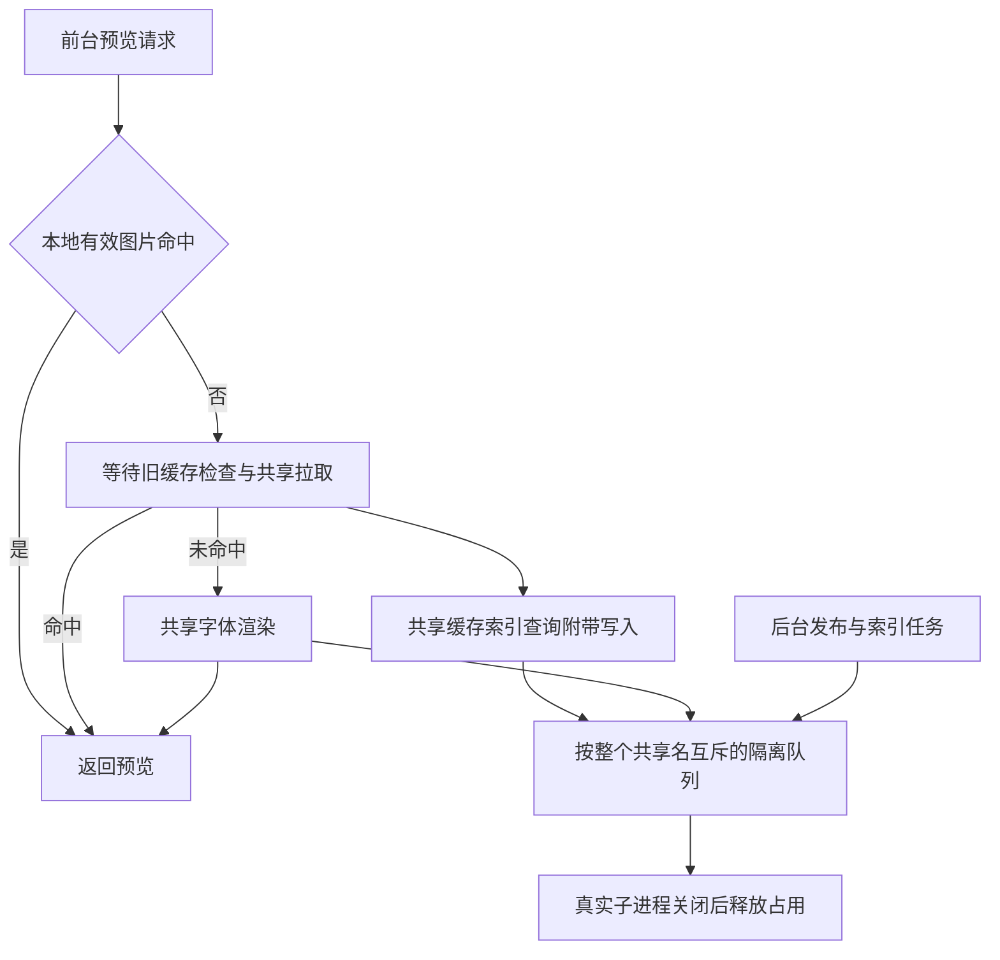

# Stage 10：预览性能与独立修复回移

## 0. 范围与基线

- 日期：2026-09-27；软件版本：3.0.0；文档版本：1.7。
- 唯一分支：`stage/10-preview-performance`，从 Stage 9 `7d220c3d041291d4480210303ceae5dc3731145e` 建立。
- 用户授权记录：建立 Stage 10，先带回 CIM 等独立修复；2026-09-26 追加审计并补齐执行任务书，当时未启动生产修复；随后用户依次授权 S10-01 至 S10-05 实施。常驻 DirectWrite 试验停止推进，原分支保留；本分支保持原预览路径。
- 遵守根目录 AGENTS.md、ALL_AI_CODE.md、AI_PROJECT_RULES.md 和总任务书。无新依赖、无数据库迁移，不变更激活/收藏/标签行为。
- 当前入口：第 19 节 `S10-06`。`S0-05.5` 仍按用户指定编号保留为 S10-05 后、S10-06 前的共享预览专项；代码、自动化、原生 CI 及首轮 Windows/NAS 前置检查已有回执。用户于 22:43 明确取消固定 24 卡片首张/整屏、连续滚动/改字/字号专项人工验收及冷热至少各 5 次同条件对照，直接推进 06。按第 19.1 节收尾，不再把这组人工测试转移成其他阻塞项；既有自动化和正确性约束保持。

## 1. S10-00：独立修复回移

从 DW 最终代码 `56227d0` 按文件差异回移，禁止整提交 cherry-pick 混入试验接线。

1. `pathCanonicalizer.ts` 与 Rust `mapped_drives.rs`/命令入口：使用本机 WNetGetConnectionW 查询，UTF-8 JSON 严格校验；1500ms、30 秒缓存、请求合并、5 秒失败冷却不变。未知/断开映射及缺失/旧 worker 拒绝身份确认，不静默冒充本地盘。原开发启动负责重编译 worker。
2. mapped-drive-unicode / shared-root-retention 诊断适配实际 worker 查询，保留 Unicode、别名、失败冷却与共享根状态断言。
3. operation-chain 诊断等待独立 stderr 诊断帧后再停止，并等真实 close，保留原内容断言；shared-action-admission 变异匹配统一路径分隔符并要求锚点；user-intent-consistency 模块缓存统一路径并检查别名实例相同。三项只改测试，不改 daemon/收藏/共享准入生产逻辑。
4. 既有 Windows/Linux 工作流增加 Stage 10 触发，真实映射查询前构建 Rust worker。

排除：DW helper、常驻服务、字体副本、图片键/缓存接线、试验启动入口、UI、preload、预览埋点、DW 专项和冻结摘要调整。CIM 源实现已在 DW Windows 综合门 `36244288794` 成功（36ms/27ms），但此历史结果不替代新分支验证。

## 2. 验证

- 当前本地：mapped-drive-unicode、shared-root-retention（18场景）、operation-chain（7变异）、shared-action-admission（40组）、user-intent-consistency（4变异）及 typecheck 全通过。
- 本地完整 `npm run verify` 退出 0：typecheck + 147/147 诊断；Electron/Vite 构建及 3/3 混淆通过，diff 检查通过。
- 代码提交 `237998144009a41885089fb286879ed1f8055477`；该回移提交的 Windows/Linux CI `36246802044` 已全部通过（含 Windows 全量诊断与原生目录回归）。
- 复用已核对的 WNet API 实现；Mermaid 更新实际查询链，Create State 保存当前分支与回移边界。
- 开发运行：`npm run dev`；不需要 build:win。新分支不提供 dev:dw。

## 3. 后续预览研究（历史建议，执行顺序以第 7–10 节为准）

按用户高频改字目标，先处理可见队列等待整批图片缓存的阻塞，再区分 FontFace 超时与真正格式失败，保留已加载字体跨文字/字号复用；随后研究单请求授权/元数据/读取重复调用。不得绕过路径授权、根代次、离线或取消边界，不以无限并发或增大期限替代修复。

分别测量首次一屏、同屏连续改字、滚回热字体；记录首张/整屏耗时、实际调用次数及过期工作。当前无实机提速结论。55字体解析、C-09/O-07及此前待验事项不在 S10-00 关闭。

## 4. 用户追加：共享依赖下载目录

2026-09-26 授权将依赖下载放到项目上一级，禁止写死机器绝对路径。统一 `../.hfm-deps/{npm,electron,electron-builder,cargo}`，运行时按项目目录解析；`npm run deps:install` 将环境传入 npm 及依赖安装子进程，setup/rebuild/打包入口沿用同一策略；Rust构建使用该 Cargo home。安装目录与编译产物各项目独立，Rust工具链与已有全局Electron headers缓存不迁移。旧下载缓存不自动搬迁/删除。

已验证同级项目共享、中文/空格路径、从其他目录启动、退出码传播、真实npm缓存路径、typecheck及release gate；真实Windows下载与原生重建待运行验证。此项不改字体预览代码或依赖版本。


## 5. 预览缺失与延迟审计（2026-09-26，未修复）

审计基线 `fa9637535ac373322f5292ad60c6b1245bf1c2ec`。本轮只分析、受控验证和记录，不修改生产代码。对照 Stage 9，卡片/预览队列/预览主进程/派生预取代码无差异；没有证据将问题归因于共享依赖下载目录改动。运行日志为 `startup-2026-09-26_14-42-34-344-31120.log`。

### 5.1 P1：图片清空后，可见卡片缺少重新请求

- `usePreviewTextResetRuntime.ts` 在文字或字号变化时调用 reset；`fontPreviewStateRuntime.ts` 清空图片、队列与失败状态，保留已加载字体。
- `useAppFontDerivedRuntime.ts` 预取 effect 只依赖预取字体 ID/early 状态串及文字，不依赖字号；范围只覆盖虚拟项前 18 项。
- `FontCard.tsx` 首次可见后 disconnect，effect 仅依赖 onVisible；`FontCardRenderer.tsx` 使用 WeakMap 保持同一字体对象的回调身份。因此同一批已挂载卡片不会因文字/字号变化重新观察。
- 触发条件：字体对象、虚拟项身份保持稳定，图片预览被重置，且没有其他索引刷新或重新挂载等事件救回。改字号可清空后不补排；改文字时前 18 项之外的已显示图片可能不恢复。已加载 WebFont 保留，通常不受此缺口影响。
- 受控验证：转译并执行真实 reset/derived hooks，以简化 hooks runner 保留依赖与 ref，固定 24 项。首次请求 18 项，改字号 reset 后请求 0 项，改文字请求 18 项（第 19 项未请求）。卡片观察器与稳定回调通过源码核对。此验证不是 Windows GUI 复现；日志没有 UI 操作轨迹，不能断言本次用户空白唯一由此触发。

### 5.2 P2：整批缓存查询阻挡前台加载

`fontVisiblePreviewQueueRuntime.ts` 的 processPreviewQueue 在批量缓存检查未完成时直接返回，ensurePreviewFont 尚不能启动。日志三次 scheduler deadline dropped：12/31/53 项，约 2004/2004/2001ms。此链路能解释明显等待，但有期限退出，不能单独解释永久不显示。

日志有 62 条原生渲染成功，耗时中位数 10ms、最大 110ms；44 条被记录的 renderPreviewImage IPC 结束样本中位数 1819.5ms、最大 3783ms，含一次退出期间失败。IPC 日志受阈值/抑制影响，不能当作所有请求的耗时分布；前后样本也不能直接相减算开销。成功返回 data URL 不等于 DOM 已显示。

### 5.3 P2：超时只结束等待，未取消底层工作

`ioDeadlineRuntime.ts` 使用 Promise.race，未向 operation 传入取消信号。scheduler 等待结束会释放逻辑槽位，原来的缓存操作可能继续；不等于 Shared I/O 自身物理并发限制失效。执行真实 deadline helper 的受控未完成 Promise：100ms 后返回 timedOut，手动释放后旧操作仍完成，确认超时不取消。实际多占多少资源需进一步测量。

### 5.4 P2：短时 WebFont 超时进入失败分支

URL FontFace 的 180ms 期限、总快速预算 300ms 与格式失败共用失败状态；默认关闭二进制备用，普通加载超时也会转向原生图片。该失败状态会在预览重置时清除，不是永久认定字体损坏。FontFace 超时也没有取消，迟到结果不会执行 document.fonts.add。对于实时改字，这会减少字体加载后复用的机会，并增加图片请求；本次日志不能确认具体有多少字体走过此分支。

### 5.5 其他发现与排除

- FontDetailPanel 声明 nativeDetailImage 等参数但 JSX 未消费；详情 hook 仍可能请求图片。登记为未消费的工作，不擅自新增详情预览 UI，也不将既有布局认作 Stage 10 回归。
- 日志 worker 握手 64ms，协议 42，存在成功原生图片回执；没有“整个渲染后端不可用”的证据。
- 唯一 native failure 在 shutdown freeze 之后；退出阶段共享根不可用不能倒推为此前 NAS 故障。
- 既有 scheduler 8 项诊断通过，但不能覆盖上述可见卡片 reset/requeue 缺口。本轮未重新宣称全量构建或 Windows GUI 已通过。

修复顺序建议：先统一预览代次变化与当前可见卡片补排（含第 19 项以后、稳定挂载和字号变化），再解除整批缓存对首屏的阻挡；接着处理过期工作收敛与超时/格式失败分类。不得通过无限并发、单纯延长期限、移除授权或重新引入 DW 试验代替修复。验收至少覆盖图片字体改字/改字号、24 项稳定列表、快速连续修改、滚回，以及已加载 WebFont 复用。

Mermaid 已记录真实重置/补排链；Create State 保存审计边界。生产代码未修改，问题保持未关闭。


## 6. 扩展审计与结论修正（2026-09-26）

用户指出第 5 节审计片面。本节优先于上一轮的排序判断：改字/字号后补排缺口真实存在，但不足以解释首次加载、滚动或当前日志对应的实际空白；没有证据将其指定为本次唯一根因。未进行修复或 Windows GUI 验收。

### 6.1 首次显示与滚动：优先级提升被准入检查拦截（P1，受控复现）

`fontVisiblePreviewQueueRuntime.ts:requestPreviewFont` 先调用 canRequestPreviewFont；其真实实现经 `fontPreviewStateRuntime.ts:canQueuePreviewFont` 对 queuedPreviewFontIds 中已有项返回 false。因此后面的“已入队 normal 提升 high”分支不可达。普通预取先入队、随后卡片可见请求 high 时仍为 normal；用户活跃或滚动时 normal 请求继续被推迟。停止交互可以恢复，不能称永久死锁。

转译并执行真实队列与真实准入函数，模拟 normal -> high，结果 priority 仍为 normal；用户活跃时处理后加载数为 0、队列保留 1 项。依赖计时器/缓存后端使用受控端口，不替代 GUI 验证。

### 6.2 失败恢复：不确定结果被转换为文件缺失并缓存（P1，受控复现）

`previewRuntime.ts:ensureFontPreviewImageFile` 在 stat 超时/错误时返回 null；未安装字体遇到索引 failed 也返回 null。renderFontPreviewImage 把所有 null 转成 missingFontPreviewDataUri 并放进 160 项内存 LRU，没有时效；同键下次先返回该占位图。前端 fontPreviewLoadRuntime 以 SVG 前缀识别 missing 并写入 previewDisabled/路径失效；后续相应分支会跳过请求。失败索引还会阻止同键的正常生成路径，不能只等前端 30 秒冷却来解决。

真实 previewRuntime + 真实 memory runtime 注入 stat 超时后得到 missing SVG；恢复 stat 后第二次请求仍返回同图且 stat 总调用仅 1 次。另验证 failed 索引返回 null。此处模拟的是 I/O 结果，并非真实 NAS 故障；本次日志未出现 native preview skipped missing/slow 消息，不能据此断言该用户运行发生了 stat 误判。

### 6.3 冷缓存、热缓存与共享存储：准备工作阻挡读取（P2，源码及日志证据）

`previewStorageRoutingRuntime.ts:previewCacheStorageForFont` 对监视根逐次 await 根可用性、共享图片目录 mkdir、数据库目录 mkdir、隐藏目录、写 manifest，随后才返回 localStorageForRoot。单张缓存查询与原生生成均会调用该路径；本地已有图片并不保证该入口完全不碰共享盘。批量路径另有 fromIndex 分组，不能把所有缓存入口混为一谈。

日志总计 1,709 条 shared io started；access 295、mkdir 245、root-probe(-e) 239、directoryMetadata 238、readFile 150、preview-cache-read-status 133。包含索引、元数据等非预览工作，不能全归预览，也不能据此计算每张图片进程次数。确有大量分散操作，与源码中前置共享准备叠加；各阶段占比还没有统一请求 ID 来关联。

前台缓存整批屏障与三次约 2s 超时仍成立；原生绘制中位 10ms 只描述绘制阶段。不能把所有其他耗时一概叫 IPC 通信开销。

### 6.4 其他范围的复核

| 场景 | 审计结果与边界 |
| --- | --- |
| 改字/改字号 | 保留第 5.1 节条件性缺陷；已加载 WebFont 通常可复用，图片字体风险较大 |
| 过期请求 | renderer 有 token/generation 拒绝过期提交，主进程 deadline 未取消底层工作；不能说完全没有取消/隔离保护 |
| 字体加载及回退 | 180ms WebFont 超时与格式失败共用失败分支；默认二进制备用关闭，实际命中次数日志不足 |
| 渲染失败重试 | 30s failedPreviewUntil 到期只允许下次请求，没有自动重新入队计时器；稳定可见卡片不保证自动恢复，需与入口修复共同覆盖 |
| 映射盘与 UNC | renderer 的 networkAwarePreviewLimit 仅识别 UNC 前缀，日志存在 O: 字体路径；与主进程共享路径识别不同，需统一语义，但不能断言主进程网络并发限制被绕过 |
| 图片到界面 | Card 使用 lazy/async img，无 onLoad/onError 显示回执；网格裁剪失败回退原图、有过期回调保护，resize 有 settled 更新。没有证据确认是裁剪/冻结/CSS 故障，也不能用 data URL 返回证明图片已显示 |
| 详情 | 图片参数未消费是既有实现，列为无效工作/需求核对项，不擅自恢复 UI |
| Stage 9→10 | src 差异仅 pathCanonicalizer；无预览源码改动不能排除路径识别的间接影响。日志无明确 CIM 超时，需同机同数据对照才能判定性能回归 |
| 退出 | 本日志 native failure 在 freeze 后，排除其作为此前空白证据；保留共享操作隔离和退出约束 |

### 6.5 修复及验收顺序修正

先解决“请求是否能开始、失败后能否恢复”：优先级提升、可见项重排、超时/failed/真实缺失的结果区分与占位缓存恢复应分别有回归用例。随后优化共享目录准备和缓存批量屏障，最后收敛过期工作及 WebFont 回退策略。不先重启 DW、不无限并发、不把 2 秒改大作为解决方案。

观测缺口：没有从可见 fontId/预览代次到排队、缓存、文件读取、绘制、返回、img decode/error 的完整关联。因此本轮确认的是多个真实机制缺陷和高频开销，并未完成用户这次空白事件的唯一归因。验收矩阵须含首次冷/热一屏、持续滚动/停滚、24 项同屏改字/字号、瞬时失败后同键恢复、本地/UNC/映射盘、成功返回但图片解码失败，以及退出取消。保留已存在的授权、共享根代次及离线保护。

## 7. 执行总表与统一约束

本节及第 8–10 节取代第 3、5、6 节中的建议顺序；审计证据保留，不将待验证风险写成已确认根因。文档补齐不代表启动生产实现。仅使用 `stage/10-preview-performance`，阶段内部不得另建实施分支；初次补齐执行卡的生产基线为 `fa9637535ac373322f5292ad60c6b1245bf1c2ec`，最新专项基线及追加约束见第 18 节。

| 阶段 | 目标 | 依赖 | 当前状态 |
| --- | --- | --- | --- |
| S10-00 | CIM 与独立验证修复回移 | Stage 9 | 已完成，见第 2 节 |
| S10-01 | 建立复现、关联观测与性能基线 | S10-00 | 自动化通过，实机基线待验；见第 11 节 |
| S10-02 | 修复优先级与可见项重新请求 | S10-01 自动化基线 | 代码与自动化完成，实机待验；见第 12 节 |
| S10-03 | 区分失败结果并闭合恢复链路 | S10-02 | 代码与自动化完成，实机待验；见第 13 节 |
| S10-04 | 缩短缓存读取关键路径 | S10-03 | 本地自动化与 Windows CI 通过，实机待验；见第 14–15 节 |
| S10-05 | 收敛过期工作与 WebFont 回退 | S10-04 | 代码、自动化和 Windows CI 通过，实机待验；见第 15–17 节 |
| S0-05.5 | 缩小共享冲突范围，解除缓存对前台出图的不必要等待 | S10-05 及第 16–17 节补修 | 实施、自动化/原生 CI 与首轮实机检查已完成；指定专项人工性能门按用户要求取消，不宣称量化性能收益；见第 19.1 节 |
| S10-06 | 全链路回归与工程收尾 | S10-01 至 05、S0-05.5 自动化门 | 工程核查与交付完成；复用同代码完整 CI，不宣称全面 GUI 或量化性能验收；见第 19.1 节 |

统一约束：

- 沿用现有 renderer、preload、IPC、预览缓存和 Rust owner；不另建平行调度系统，不恢复已停止的常驻 DW 试验，不增加字体本地副本方案。
- 保留字体路径授权、共享动作准入、共享根身份/代次、隔离 I/O、离线灰显与可恢复、退出冻结及现有资源并发上限。缓存命中也不得绕过授权或根撤销。
- 不用无限并发、无限重试、整体加大期限、关闭校验或清空用户缓存作为修复。可恢复失败不写成字体永久损坏；真缺失不触发无限重试。
- 不改变安装、激活、收藏、标签、扫描业务语义或详情面板布局；共享依赖仍使用项目上级相对位置，不新增机器绝对路径配置。
- 默认不升级依赖、不迁移数据库、不改缓存键格式或公开 IPC 契约。若结果分类确需接口调整，必须同提交覆盖类型、主进程、preload、renderer、兼容测试和回退说明；无证据不得扩大为存储重构。
- 第 5、6 节临时脚本仅为审计证据，阶段实施须把相应受控复现纳入仓库既有诊断体系，不能依赖 `/tmp` 文件或仅做源码字符串匹配。已有全量门禁不得降级。
- 后续阶段可在自动化前置门通过、实机项明确登记待验的情况下继续；不得将实机待验阶段标为全面完成，不将基线无法复现当作用户问题不存在。

## 8. 分阶段执行卡

### S10-01：复现、关联观测与基线

**范围**：现有 rendererPerformance、FontCard/可见队列、预览 IPC trace、previewRuntime、缓存 scheduler 与既有诊断。先记录实际入口，不优化业务行为。

**交付**：

1. 将优先级提升、稳定 24 项改字/字号、stat 超时转缺失、failed 索引、同键占位复用等反例固化；缺陷观察模式应准确检出旧行为，后续修复阶段改为成功行为断言，不把旧 bug 固定成最终契约。
2. 关联 fontId、预览代次/请求 ID 与可见、入队、启动、缓存结果、授权/读取、绘制、IPC 返回、图片 load/error、过期丢弃。分开队列等待与执行耗时；对合并请求保留调用者关系。
3. 使用既有诊断开关及有界记录，不默认逐帧刷日志，不记录字体二进制、完整 data URL 或完整预览文字。新增关联字段不能依赖记录敏感路径；同进程单调计时，跨进程不用不同时间原点直接相减。
4. img load 只证明加载/解码回执，不能单独证明可见像素正确；实机另核对字体、文字、字号和裁切。WebFont 路径记录加载/应用，不强求图片回执。
5. 记录 Stage 10 当前基线；条件允许时同机同字体同配置测 Stage 9。缺少 Stage 9 对照只能评价 Stage 10 修复前后，不宣布 Stage 9 回归归因。

**验收**：受控失败与迟到结果能追溯到对应卡片代次；关闭诊断时不产生新增日志流；失败样本、成功样本和未验证路径分列。记录各场景首个有效预览、当前视口完成时间、失败/缺失数、请求数、实际底层操作数及资源峰值。不得以只有成功请求的统计掩盖一直没显示的卡片。

### S10-02：优先级与可见项重新请求

**范围**：fontVisiblePreviewQueueRuntime、fontPreviewStateRuntime、usePreviewController、usePreviewTextResetRuntime、useAppFontDerivedRuntime、FontCardRenderer/FontCard 及对应诊断。

**交付**：允许已有 normal 队列项合法提升 high，保持每字体每代次去重；明确一个可见项补排 owner，文字/字号代次变更后覆盖实际可见卡片，不受前 18 项预取上限限制。预取保持有界，不把整个字体库入队。已加载 WebFont 跨文字/字号复用；原生图片按正确文本/字号重取。检查 reset、effect、observer 时序，避免“先排后清”及双重触发。

**验收用例**：普通预取后可见提升；持续滚动与停滚；同一 FontItem 对象、24 项稳定挂载及第 19–24 项；快速连续输入/字号变化；虚拟卡片卸载重挂；earlyVisible 转 ready；离开视口/换页；已加载 WebFont 不重新读取字体。旧代次结果不能覆盖新图；已加载、坏记录、真缺失及正在加载的去重保护不被优先级修复绕过。受控释放阻塞操作后，每个仍可见且可预览的项都有完成或明确失败，不允许无请求的永久等待。

### S10-03：结果分类、缓存与恢复

**范围**：previewRuntime、previewImageMemoryRuntime、cachedPreviewReadRuntime、previewIndexAccessRuntime、fontPreviewLoadRuntime/可见队列，以及必要的现有共享类型/IPC 接线。

**交付**：

1. 区分缓存未命中、确认文件缺失、超时/暂不可达、生成失败、取消/过期；检查单张、批量、原生生成及后台缓存路径的同根问题。不得继续以任意 null 或 SVG 类型作为所有失败的文件缺失依据。
2. 暂态结果不进入成功图片缓存或持久路径失效标记；确认缺失有受控复核/失效条件。同键恢复必须能重新检查，不能一直命中错误占位图。
3. failed 索引有明确可恢复策略，重试遵守上限、退避、可见性及根状态；单纯 elapsed 30s 不能替代重新入队。页面离开、根撤销、退出时停止重试。
4. 核查已有错误标志、旧失败索引与内存占位的恢复入口；只修正具备有效来源证据的误判，不批量清除真实缺失/坏字体记录，不删除用户库。

**验收用例**：一次 stat 超时后恢复；共享断开/恢复；索引 failed 后成功；真实 ENOENT；权限拒绝；坏字体；PNG 已删除/损坏；同键再次请求；重启后旧 failed 记录；退出中失败。超时不能写入“路径失效”；真缺失有明确状态且不产生重试风暴；正常字体在受控恢复后无需用户清缓存即可显示。保留已安装/已激活字体的系统路径与文件回退语义。

### S10-04：缓存关键路径与共享准备

**范围**：previewStorageRoutingRuntime、previewCacheRootAvailabilityRuntime、previewBatchReadRuntime、previewRequestSchedulerRuntime、fontVisiblePreviewQueueRuntime、缓存 hydration/publish 相关入口。

**交付**：

1. 在有效授权/根代次内，让本地命中无需等待无关共享目录创建、隐藏属性和 manifest 准备；目录准备按现有 owner 合并复用，失败/根切换后正确失效，不缓存永久“已准备”。共享发布仍有准备和写入顺序保证。
2. 缓存探测不阻挡整队可见字体开始加载；采用有界探测/推进，避免一个慢缓存项拖住其他项。同一请求缓存与原生回退竞速时去重、明确胜出结果和迟到处理。
3. 核对 UNC 与映射盘的调度身份来源，复用主进程可靠分类，未知身份保持保守；不得在 renderer 新增探盘或靠字符串猜测绕过主进程限制。

**验收用例**：本地热缓存、共享冷缓存、共享目录首次创建、单个缓存项慢/拒绝、重复同键请求、目录被删除、根代次变化、映射盘与 UNC 同源。注入一个未完成的缓存操作，其余可见可加载项必须在释放它之前取得进展；热缓存读取不因非必要共享准备等待。记录操作调用数下降，且目录准备失败不会造成写坏文件或授权绕过。

### S10-05：过期工作与 WebFont 回退

**范围**：previewRequestSchedulerRuntime、ioDeadlineRuntime 的预览调用方、fontPreviewLoadRuntime/QuickFallbackRuntime、现有取消 owner、详情预览触发链。

**交付**：过期/离屏请求在未启动时丢弃；已启动可取消工作沿既有 owner 取消，不误杀同进程其他调用者；不可取消的 FontFace/共享工作保持实际在途计数和有界上限，迟到结果不提交旧状态。不得把 Promise.race 当作物理取消。超时与格式失败分开，字体迟到成功是否可复用按字体身份、授权和有效代次判定；不能只延长 180ms/300ms。关闭窗口时释放订阅、计时器和本任务资源。

详情参数未消费先核实实际消费者；确认无人消费的请求在原 owner 停止或门控，不新增详情 UI、不扩展为全面死代码清理。

**验收用例**：连续改字/字号、快速换页、可见性撤销、缓存与渲染迟到、两个调用者共享同键且一个取消、FontFace 超时后成功/真实失败、卸载详情/退出。记录逻辑结束与物理结束，实际资源不随编辑次数无界增长；最终文字正确，旧结果不覆盖；成功加载字体后改字不重复下载；不可取消工作不得重复启动到突破限额。

### S0-05.5：共享资源冲突与预览等待专项

完整审计、资源冲突契约、实施步骤、行为验收、兼容和回退要求统一放在第 18 节。本卡插入 S10-06 之前；不得将本轮文档提交当作生产修复完成。

### S10-06：回归与最终关闭

**范围**：上述完整链路及直接受影响的授权、根恢复、退出、已安装/已激活字体路径；不顺带关闭其他任务书遗留问题。

**交付/门禁**：通过既有行为回归、`npm run verify`、受影响构建及现有 Windows/Linux CI；结合已有 Windows 开发模式日志和用户反馈核查原场景。第 9 节说明证据覆盖范围，不再要求用户补做已取消的专项人工序列。构建通过与 GUI 通过分列。出现失败按所属阶段回修，不以继续下一阶段覆盖失败。

**关闭条件**：已确认审计缺陷有修复提交与行为回归证据，完整自动化/构建/原生 CI 无失败，已有实机日志未显示阻塞性回归。固定卡片数、专项人工滚动/编辑、重复冷热性能统计及超过自然波动的提速指标不再作为关闭门。工程收尾与实机覆盖分列：未观察场景不写通过，缺少量化证据不宣称性能收益；已确认的授权、根恢复、数据一致性或退出回归仍必须修复。

## 9. 验收矩阵与性能判定

2026-09-27 22:43 修订：下表保留现有自动化及已有实机证据的正确性覆盖范围，不是要求用户额外逐项执行的人工测试清单。取消固定 24 卡片首张/整屏显示、连续滚动/改字/字号专项人工测试及冷热至少各 5 次同条件对照；不删除既有自动化夹具、断言或诊断入口。历史回执中的旧要求以此和第 19.1 节为准。

| 场景组 | 回归覆盖范围 | 正确性要求 |
| --- | --- | --- |
| 首屏 | 冷缓存/热缓存，未安装/已安装/已激活 | 正确字体与文字显示，无静默空白；热缓存不重复生成 |
| 交互 | 既有可见项重排、滚动准入自动回归 | 可见项优先并有进展；离屏工作有界；超出预取上限的项也能恢复 |
| 编辑 | 既有文字/字号代次与迟到结果自动回归 | 最新代次显示；WebFont 复用；图片键正确；无旧图覆盖 |
| 存储 | 本地、UNC、映射盘，共享根切换/撤销 | 身份一致、授权保持、离线状态可恢复，不访问已撤销根 |
| 故障 | 单次超时、持续断开、真缺失、权限、坏字体 | 分类正确，恢复可重试，不误写永久缺失、不无限重试 |
| 缓存 | failed 旧记录、占位、PNG 丢失/损坏、同键并发 | 可以受控恢复，坏缓存不永久阻挡，同键不重复生成风暴 |
| 显示 | 图片 load/error、网格裁剪、resize、虚拟卸载 | 解码错误可观测；裁剪失败回退；恢复后内容正确 |
| 生命周期 | 编辑中退出、排队中退出、共享 I/O 在途退出 | 原退出预算/隔离保持，无迟到状态提交及本任务资源泄漏 |

性能数据仅按实际取得的证据描述，不再要求固定样本数、首张/整屏计时、同条件冷热基线对照或改善超过自然波动才能推进/关闭。已有日志可用于确认回退、错误与资源收敛；不把不同操作会话的耗时比较当作严格性能结论，不以原生绘制或 IPC 返回冒充 GUI 实际显示。不得为了验收清空用户缓存；未测场景及量化性能收益明确保留证据边界。

## 10. 审计追踪、回滚与执行回执

| 审计项 | 实施归属 | 关闭所需证据 |
| --- | --- | --- |
| 5.1 补排遗漏、6.1 优先级 | S10-02 | 旧行为反例 + 既有可见项/滚动自动回归；专项人工序列按 §19.1 取消 |
| 6.2 缺失误判、6.4 重试 | S10-03 | 分类/旧状态/同键恢复故障注入 + 实机恢复 |
| 5.2 整批阻挡、6.3 共享准备 | S10-04 | 慢项隔离 + 调用数/耗时对照 |
| 6.4 映射盘分类 | S10-04 | UNC/盘符同源与未知身份测试 |
| 5.3 过期工作、5.4 WebFont | S10-05 | 实际在途计数、迟到/取消/复用回归 |
| 6.4 详情未消费请求 | S10-05 | 消费者核对与无需求请求停止证据；不变更布局 |
| 18.2 A–G 共享根锁、查询写副作用、共享拉取屏障、重复访问、负缓存与发布所有权 | S0-05.5 | 第 18.7 节行为门及 §18.10 已有实机回执；重复性能对照按 §19.1 取消 |
| 用户本次空白、图片显示证据不足 | S10-01、S10-06 | 原场景链路关联 + 实际显示验证，不自动归因 |
| Stage 9 性能回归归因 | S10-01、S10-06 | 同机对照；缺失则明确未知 |

每阶段在本任务书追加执行回执：开始/结束提交、实际文件与接口变化、复现与修复后结果、测试命令及结果、Windows/GUI 证据、剩余问题、下一项和回退点。状态采用“未开始/实施中/自动化通过实机待验/完成/阻塞”，不能用文档存在或阶段编号代替完成。

阶段提交保持可独立回退，回退必须涵盖同阶段关联接线和测试，不将新旧结果协议混用；保留 S10-00 独立修复及共享依赖目录设置。涉及旧错误记录纠正时记录精确修正条件，不能通过整库覆盖恢复。任何根身份、授权、退出或数据一致性回归立即停止推进并回修；不得删除用户文件或强制重置分支处理失败。

此前文档交付：补齐 S10-01 至 06、审计映射和验收门，当时未改生产代码；S10-01 后续实施结果见第 11 节。


## 11. S10-01 执行回执（2026-09-26）

开始提交 `d108c590589f411d6d678bb2ee1a25d2dc420c2e`，沿用唯一 Stage 10 分支。本项只增加诊断与基线，五个已确认缺陷保持开放，不把观测通过称为修复通过。

### 11.1 实现范围

- 新增 renderer/main 预览观测模块，复用已有 operation-chain、AsyncLocalStorage、字段白名单、日志 16MiB 会话预算和 renderer 256 在途发送限制；不新建业务调度器。诊断状态最多 512 项，图片关联包含字体身份，避免相同图片串线；图片回调捕获旧 trace，迟到回执不冒充新代次。
- 在已有详细日志开关下暴露只读 previewTraceEnabled；关闭时不建立诊断 viewport observer、不创建预览 trace、不发送新增 renderer 事件。观测走现有 operation-chain 分支，不触发 renderer 活跃状态延长。
- 卡片记录实际视口 enter/leave/unmount、状态应用和 img load/error；原有 rootMargin 预取/可见回调独立记录。load 回执不等于可见像素验收，CSS/裁切结果仍需实机核对。
- 记录请求/拒绝/入队/等待/加载尝试、缓存命中、过期结果、WebFont 加载/回退/物理完成；同一字体代次的重试有独立 attemptId。批次最多内嵌 16 个成员，额外逐成员事件保留第 17 项以后的关系并报告 omitted。
- 两套 preload 为三项预览方法增加可选 trace 尾参；五个业务参数和返回值不变，旧调用不携带 envelope。既有 IPC 包装器在正常来源校验后剥离 metadata 并设置上下文，正常特性准入和处理器不变。
- 主进程记录缓存批次各调用者与物理批次关系、调用者 deadline 和实际 settlement；原生同键合并记录 owner。记录 I/O 排队、共享存储准备、路径解析/stat、索引读取、原生调用和图片读取；不改变现有期限、并发和结果语义。
- FontFace 使用 canonical b64 URL 的可选 hfmTrace 查询参数传递观测身份。协议端只剥离该诊断后缀、白名单清洗并设置上下文，随后执行原路径解码、authorizeFontRead 和读取；未携带 metadata 的旧 URL 不变。坏 metadata 不授予权限，仍必须正常授权。物理 FontFace 迟到完成仅记录，不提前实施 S10-05 的复用策略。

### 11.2 复现、专项与兼容验证

- `diagnostics:preview-observation-baseline`：真实 reset/derived hooks、可见队列+准入、previewRuntime+内存缓存，受控替代 UI/操作系统端口，稳定复现五项缺陷。`--observe` 通过仅表示复现成功；`--strict` 按预期非零，明确缺陷未修复。S10-02/03 必须把对应用例转换为健康行为断言，不能长期保留已修复缺陷的旧断言。
- `diagnostics:preview-trace`：关闭开关无事件、512 项有界、代次和重试身份、24 项成员关联、相同图片不同字体、真实 Card load/error 回调、两套 preload 旧/新参数、真实 IPC 上下文及不可信来源拒绝、并发上下文隔离和原异常透传、缓存合并及超时后实际完成、FontFace 超时后迟到成功、协议 metadata 与授权拒绝。
- 原 scheduler 八项检查仅增加观测依赖端口；font-path-authorization READ 保留所有权限/恶意路径断言。React composition 只更新三个已增加观测调用的源码摘要，40 个状态 owner、行为与变异断言不变。Context7 已核对 Node 22 AsyncLocalStorage Promise 上下文语义。
- 本地 `npm run verify` 通过：typecheck + 149/149 诊断；最终新增观测/授权专项及 operation-chain 七项变异复核通过；Electron/Vite 三端构建与 3/3 混淆通过，diff 检查通过。原生源码未变，本轮未重新执行 Windows 原生构建。提交后 Windows CI 单独记状态，不用之前回移阶段 CI 代替。Windows/NAS GUI 与五次重复性能样本本环境未执行。

### 11.3 已有日志基线及缺失值

`build/diagnostics/fixtures/preview-observation-baseline.fixture.json` 保存旧日志文件名、SHA-256、代码基线与去路径统计：62 条原生回执（中位 10ms）、44 条筛选后的图片 IPC 样本（中位 1819.5ms，含退出失败）、1,709 次共享 I/O 启动、3 次缓存 deadline。原始日志含用户路径，未复制进仓库。没有视口分母、首个可见完成或整屏完成证据，因此对应字段为 null；Windows 重复样本和 Stage 9 配对样本均为 0。

不得将这些筛选日志样本当作全请求统计，也不得把新埋点/受控测试耗时当作 Windows 性能基线。新增事件只记录白名单身份/阶段/结果/本进程 elapsed 与 monotonicMs，不记录完整文字、图片或字体二进制；原有详细日志的内容策略不在此项扩展。

### 11.4 开发运行与实机回执

Windows PowerShell 临时开启已有详细日志开关后启动：

```powershell
$env:HFM_LOG_DETAIL = 'debug'
npm run dev
```

关闭本次应用后使用 `Remove-Item Env:HFM_LOG_DETAIL` 恢复默认日志。无需 build:win。按第 9 节记录视口、模式、字体集合、文字/字号、冷热条件与操作时间，每组至少五次；开启日志的前后对照使用相同开关，避免诊断开销混入比较。

优先复现“首次进入就不显示”或用户实际触发步骤，再测试稳定同屏改字/字号和滚动；提供当前 startup 日志及对应操作说明/截图。沿 target、rendererGeneration、operationId、attemptId、batchId/jobId 关联各层；跨进程只做身份关联，不直接相减不同时间原点。若遇到 dropped/omitted、日志容量耗尽或图片关联被淘汰，该轮链路不完整，不能默认为显示成功。

本阶段不宣布用户空白已解决，也不宣布提速。自动化门通过后可进入 S10-02，S10-06 仍须补齐原场景和实机性能回执。


## 12. S10-02 执行回执（2026-09-26）

### 实现与边界

- `canRequestPreviewFont` 新增内部 `allowQueued` 参数，仅请求入口开启，使已有 normal 项可到达 high 提升分支；加载、已加载 WebFont、坏记录等原有准入仍生效，队列保持单项去重，执行入口默认不放宽 queued 检查。
- `FontCard` 是可见项补排的唯一 owner：文字、字号、字体身份、earlyVisible 状态以及图片/字体就绪状态改变时重新观察。图片清空提交后的第二次观察覆盖“参数已变、旧图尚在、首次请求被拒绝”的时序。18 项预取策略不扩张，reset/controller 不另建补排列表。
- 清理标记阻止旧观察与 resize 回调请求；resize 延迟期间离开观察区域撤销待补排。保留原 260px 预取边界、并发上限、WebFont 复用及加载代次保护。
- S10-03 暂态失败/占位图、S10-04 缓存阻挡、S10-05 物理过期工作仍未修复；本阶段不宣称所有空白已解决或性能提升。

### 验证

- 新增 `diagnostics:preview-visible-requeue`，执行真实准入/队列与 FontCard effects，以受控 hooks、IntersectionObserver 和图片端口验证：normal→high 去重、准入保护、24 个稳定字体对象改字/字号后全覆盖、旧图清空时序、滚动后恢复、resize 离屏、卸载迟到回调、重挂、earlyVisible→ready、WebFont 复用及并发上限；另以真实加载模块验证旧成功在新图片之后返回也不能覆盖。撤掉提升、依赖重建或 cleanup 失效保护的三项反向变体均被新回归拒绝。
- S10-01 已修复的三项缺陷观察已移入健康回归；观察脚本仅保留两项 S10-03 缺陷及 deadline 非物理取消证据。历史 fixture 保留原始基线，不改写历史数据。
- 完整验证：`npm run verify` 通过（typecheck + 150/150 诊断）；最终专项回归复跑通过，三端 Vite 构建和 3/3 混淆通过，`git diff --check` 通过。前置 S10-01 Windows C-08.1 validation（Actions 36252979164）已成功。
- 这些是受控自动化，不等同 Windows GUI。使用 `npm run dev` 验收同屏 24 项、连续改字/字号、滚动/停滚/滚回；检查第 19–24 项最终文字与字号正确，已加载 WebFont 无重复读取。Windows 原场景、首张/整屏时间及性能对照仍待 S10-06 回执。

### 插件与后续

Context7 核对 React 18 的 effect 依赖与 cleanup；Mermaid 记录真实可见补排/准入链路；Create State 保存阶段状态。下一项 S10-03，禁止将暂态失败误判问题标为本阶段已修复。


## 13. S10-03 执行回执（2026-09-27）

### 实现

- 新增共享 `previewFailure` 分类：missing、timeout、unavailable、failed、cancelled。沿用字符串图片成功值和 Electron 错误通道，用稳定消息码跨 IPC；后台结果提供中文说明，未修改数据库结构或 preload 调用形状。
- `previewSourceRuntime` 在现有 deadline 内核验字体源。旧 resolver 的 undefined 不再代表缺失；只有源文件 stat 的 ENOENT/ENOTDIR 才确认 missing。权限、网络、超时和过期分别处理，保留已安装/已激活的系统字体与文件回退。
- `previewRuntime` 不再把 null/失败转成 SVG 并缓存；原生失败按键退避 30 秒、上限 512 项，取消不进入失败退避。历史 failed/missing 索引允许重新核验，暂态/取消不写永久缺失或 failed 索引。
- PNG 校验覆盖签名、块长度、CRC、IHDR/IDAT/IEND 完整性，单张、批量和新生成结果均不能把截断/损坏文件作为成功。验证后的字节随内部结果复用，避免显示阶段再次读取。检查缓存索引命中时分批核验 PNG（400 项、6 路），已删/坏图不会继续被后台当成已完成缓存；该后台核验增加实际文件读取，性能收益不在本阶段宣称。
- renderer 不再按 SVG 或普通异常持久化路径失效。只对旧版本精确写入的“字体文件不存在或路径已失效。”标记开放重新核验，结构性坏字体检查保留；跳过旧缓存捷径，成功读取/生成后才清除对应旧标记，前台与后台均接通。没有批量清库或无证据清标记。
- FontCard 继续作为唯一可见补排 owner，保持观察以撤销离屏重试；每个观察生命周期最多三次重试，间隔 31/61/121 秒，复用原加载去重、30 秒失败退避和并发上限。根离线/未知时不自动重试，恢复后重新观察；离屏、卸载、参数变化清理定时器。接入原 rendererClosingLifecycle，关闭即取消，取消关闭后恢复仍可见项。已启动物理工作取消仍属于 S10-05。

### 验证与限制

- `npm run verify`：typecheck 和 151/151 诊断通过；最终后台核验与退出接线另复跑受影响的恢复、队列/控制器、结构、批量/索引、实际 SQLite/PNG 回归。最终三端 Vite 构建与 3/3 混淆通过，`git diff --check` 通过。前置 S10-02 Actions 36253884291 已成功。
- 新增 `diagnostics:preview-recovery`：源 stat 超时后同键恢复、确定缺失、权限拒绝、resolver 模糊失败、过期分类、历史 failed/missing 索引、重启、坏 PNG、失败退避、旧标记仅成功后清除、后台源复核及结构性坏字体保护。
- 可见回归增加三次退避、离屏、根离线/恢复、退出/取消退出的实际生命周期断言。S10-01 五个旧缺陷观察均已迁移成健康行为回归；`--strict` 不再以这些旧缺陷故意失败。deadline 不等于物理取消的观察保留给 S10-05。
- 保留原有变异测试；批量状态旧失败视作成功的变体现在应被拒绝。更新直接受影响的 token/function 基线，并把旧 PNG 测试样本替换为 CRC 正确的真实 PNG，不放宽校验。
- 自动化不能替代 Windows/NAS/真实权限与退出 GUI。仍需以 `npm run dev` 验收断开/恢复、真实缺失和坏字体、旧记录、连续改字等原场景。耗尽三次重试后不无限轮询；重新进入/参数变化或根恢复可建立新的可见生命周期。

### 后续

S10-04 处理缓存关键路径和共享准备，S10-05 处理已启动的过期物理工作。Stage 10 未全面关闭，不宣布所有空白或实机性能已解决。Mermaid 已更新真实失败/恢复链路，阶段状态保存到 Create State。


## 14. S10-04 执行回执（2026-09-27）

### 实现与边界

- 本地预览 storage 路由仅创建本地目录，不再等待共享根探测、共享 images/db 目录、隐藏属性和根 manifest。共享准备迁到原 storage owner 的发布入口；hydration 读取不创建共享目录。授权仍由原 IPC/文件读取入口执行，未开放离线共享写入。
- 共享准备按主进程 rootId/代次合并在途任务，每一步检查根状态、library shell 代次和退出 epoch。失败、库失效或根切换不留下准备成功标记。只复用正在进行的准备，不永久缓存已准备状态；下一次发布重新建立目录和 manifest，覆盖目录在两次发布间被删除的情况。顺序仍为准备→发布 mkdir→锁→临时文件/rename→meta 校验→发布 manifest→索引。
- 可见队列给缓存批次 120ms **UI 等待预算**，与现有主进程 I/O deadline 分开。预算内优先采用缓存；预算耗尽或缓存拒绝后，按原有内存/滚动/索引/并发上限推进加载，队列回退不再重复单张缓存 IPC。超预算批次失去结果提交资格，其迟到图片不能覆盖加载结果。
- renderer 保留在途缓存 IPC 槽直到 Promise 真正结算，reset/改字/关闭不提前释放它并派生更多批次；清理等待计时器和代次保护同步生效。主进程批次合并、真实在途统计、队列上限与 deadline 未更改。120ms 到期不是取消物理 I/O；已启动 WebFont/原生工作跨代次的完整处理仍属于 S10-05。
- `SharedAvailability` 增加可选 `resourceKeys`，由现有 `sharedIoResourceKeys` owner 分类，复用 WNet 映射/配置根身份；没有新探盘器。renderer 仅消费原 availability 轮询，快照最多保留 6 秒；只有明确本地且在线的根使用本地并发，UNC、映射共享、隔离根、未知/过期快照保持保守。字段可选，旧返回形状仍有效。该提示只参与调度，不能作为授权凭据。
- 无新依赖、数据库迁移、清缓存、扩大物理并发、延长 I/O timeout 或重启 DW；依赖缓存继续放在相对上级 `../.hfm-deps`。

### 验证

- 新增 `diagnostics:preview-cache-progress`，加载真实 routing/queue/load/root availability/publish/resource classification 模块，以受控 I/O、时钟和窗口端口验证：共享准备挂住时 24 次本地路由完成且新增共享操作为 0；两个同根别名并发准备仅执行一次四步准备；后续发布重新准备、失败/恢复、根代次变化、shell 失效和关闭检查。
- 缓存请求未释放时 8 个可见项在预算结束后完成加载；同键重复请求不重复生成、不重入单张缓存 IPC；缓存拒绝可继续、快命中优先、改字/reset 保留在途缓存槽、迟到结果丢弃、dispose 清理计时器。生产发布的准备失败零写入以及成功写入顺序另有执行断言。
- 执行主进程真实资源分类函数验证映射盘/UNC 得到同一键，分类失败保持 unknown；renderer 检查明确本地、共享别名、未知与过期快照。根 availability 的旧成功缓存不能跨代次或离线继续命中。
- 调用数说明：原 routing 每次访问均依次执行四项共享准备；改后 24 次本地 routing 产生 0 次共享准备，同根两个并发发布准备合并为 4 次操作。此为受控调用数证据，不是 Windows 首屏耗时或 NAS 吞吐实测。
- 最终 typecheck 通过；按原 `run-all` 列表分段执行累计 **152/152** 诊断通过（94 + 12 + 46，无缺项）。前段完整 `npm run verify` 在旧 routing 冻结断言处停止；迁移该断言后，继续执行余段，又将旧 controller“reset 立即新增缓存 IPC/拒绝后只重试缓存”的预期改为本阶段的保留槽/加载推进，随后剩余全部通过。这是同一最终生产代码的分段完整覆盖，不声称单次 `npm run verify` 全绿；两套回归仍保留 LF/CRLF、Windows 路径、代次与因果变异检查。最终三端 Vite 构建、3/3 混淆和 `git diff --check` 通过。
- 本地验证不代替 Windows CI。提交后由 Windows C-08.1 validation 重新执行单次完整门禁；Windows GUI/NAS 和实测性能仍待验。

### S10-03 CI 补正与后续

S10-03 的 Actions `36255648776` 最终失败在 Windows 完整门的 `app-root-view-contracts`：卡片新增 closing 接线后，旧断言仍要求恰好三个入口，且旧生命周期前缀基线未剥离这条已批准接线。Windows/Linux 原生专项及构建通过不代表整门通过。本轮修正为三个 controller 加卡片入口，并显式检查卡片接线，再归一化这一处已知变化比较其余生命周期；不刷新整个 App 前缀、不放宽其他 lifecycle 变异检查。第 13 节的 151 项通过是末次接线前的检查点，不能作为该最终提交完整通过的回执。

下一项 S10-05；S10-06 继续要求 Windows `npm run dev` 的本地热/共享冷、连续改字、映射盘/UNC、断开恢复及退出验收。120ms 预算的真实缓存命中率、首张/整屏耗时和额外回退成本须实测，不宣布实机提速。Mermaid 已记录真实链路；阶段状态在结束时保存到 Create State。


## 15. S10-05 执行回执（2026-09-27）

### 授权与前置状态

用户授权“开始05”。开始提交 `8b5c86cc754f3669a655e89ae82d9ad899cae387`；结束版本为本节所属 S10-05 提交，沿用 `stage/10-preview-performance`。S10-04 Windows Actions `36257397373` 已 completed/success，补正第 14 节提交时的待验状态。本阶段不恢复常驻 DirectWrite，不修改依赖下载目录、数据库或公开 IPC 参数。

### 实际修改

- 主进程缓存 scheduler 在真正开始批次前再次剔除已结束调用者的项目；调用者独立超时/撤销，不连带结束同键其他调用者。队列仍按原上限裁剪。关闭时清除合并定时器和等待队列，并结算调用者。
- `ioDeadlineRuntime` 新增仅由预览 owner 使用的物理完成作用域，跟踪内部 deadline 背后的 Promise；若隔离共享 I/O 先拒绝，再等待其既有 `closed` 回执。缓存批次、前台原生和后台生成不因逻辑 deadline 提前释放并发槽。普通 deadline 返回语义不变，缓存调用者仍可按原预算返回。
- PNG 读取 worker 将 AbortSignal 传给 readFile；共享适配器转交既有隔离执行器。带信号的独占读取不进入无信号的共享读取去重，避免撤销其他调用者。文件读取超时请求撤销后仍等待真实 Promise/隔离退出结算才释放 worker；不把 Node 的 AbortSignal 宣称为立即中止底层 OS 请求。
- renderer 前台/后台的 active 计数不再在改字、字号 reset 或退出时清零；旧任务结束只释放自身占用。加载身份与文字代次分开，旧代次 finally 不能删除同字体的新加载 owner。卡片/18 项预取传入各自有效期，启动前和提交前检查；离屏、换页、卸载的需求失效，同字体另一有效需求继续。取消退出后重新请求仍可见项。
- WebFont owner 保留实际加载计数（上限 5）和最多 128 个已完成复用项；180/120/300ms 预算不延长。超时或达到在途上限只触发原生回退，不标成字体格式失败。迟到成功不直接加入 document.fonts；后续有效请求核对字体 ID、路径、大小、mtime、主进程可用性快照中的根身份/代次，再复用已由字体协议读取的结果。未知身份不跨文字代次复用；根代次变化不复用。首次读取仍沿原协议授权，未新增旁路文件读取。
- WebFont 与 native IPC 分别受物理上限约束，并非两类工作合计只能有 5 个。不可取消的 FontFace 和已提交原生 IPC 不伪装成取消成功；结果过期丢弃，实际槽位保留。关闭清理 WebFont 等待计时器、后台重试、滚动 idle 和 controller 订阅；加载 Promise 本身等结算或窗口销毁。
- 后台缓存核验保留单个在途状态请求和最后一次待启动需求，旧核验拒绝不再回填旧队列；重试仅保留一个计时器，reset/dispose 清理。
- 已核对 `FontDetailPanel`：nativeDetailImage 只有 props 声明与解构，没有 JSX 消费。原详情生产 hook 默认关闭且 App 显式传 false，移除详情选择额外发起列表预览的 effect；保留组合契约和原布局。hook 的显式启用路径也补齐卸载序列失效，迟到缓存不能继续发起 native 或提交状态。

### 验证与门禁

新增 `diagnostics:preview-work-lifetime` 运行真实 TS owner：12 个过期缓存代次保持一个实际批次、nested deadline 与 shared child closed、同键两调用者撤销一个、owned read abort 后仍保留 worker、14 次 WebFont 编辑和 15 次 native 编辑保持各自上限、超时后成功复用/真实失败/根代次隔离、同字体新旧 owner 重叠、详情无需求/卸载、后台最新需求/重试释放，以及预取 effect cleanup。三个故意破坏物理等待/计数/FontFace 上限的变异均被行为断言拒绝。

本地 typecheck、153 项诊断分段完整覆盖通过，三端 Electron/Vite 构建及混淆通过。`npm run verify` 初次执行在旧基线失败；修正受影响的 hash、VM 系统 API 注入与 deadline mock 后，对同一完整脚本清单分段补跑并复核失败项，不将初次失败称为通过。原 runtime-feedback 的 4 条实际链、LF/CRLF 与 8 个因果变异继续通过；新增退出接线显式断言后只归一化已批准的两处 App 接线，不刷新整个旧生命周期基线。构建保留原有静态/动态导入提示，没有新增构建错误。

Context7 核对 FontFace 不支持取消，以及 Node 22 readFile AbortSignal 只停止内部缓冲、不保证立即取消 OS 请求；Mermaid 记录实际需求撤销/物理释放/迟到复用链路。原生源码未改，本地未重新编译 Windows 原生组件。S10-05 推送后 Windows CI 单列状态，不能用 S10-04 的成功代替。

### 剩余与回退

状态：代码及本地自动化完成，Windows CI、Windows/NAS GUI 与性能对照待验。保留槽位意味着底层迟迟不结束时新工作会等候，这是有界退化，不是提速证据。下一项 S10-06 按第 9 节用 Windows `npm run dev` 检查连续改字/字号、滚动换页、根断开恢复、退出/取消退出及同机缓存冷热对照；Stage 10 不全面关闭。

回退须整项回退本提交的主进程计数、renderer 生命周期接线与关联诊断，不单独还原 reset 清零或结果代次检查。回退点为上述 S10-04 开始提交；保留 S10-00 独立修复及 `../.hfm-deps/` 设置。


## 16. S10-06 前置调整：滚动与并发（2026-09-27）

### 授权与原因

用户要求在开始 06 前，将预览并发增加到 10，滚动即停止当前预览加载，停止超过 150ms 后加载当前页面全部字体。本节明确覆盖前文保持旧并发/18 项预取/160ms 的限制；“当前页面”指当前可见视口，所有可见卡片均参与，不是后台遍历整个字体库。S10-06 尚未开始。

可核对的旧分支代码为本地 5、滚动/索引时 1、停滚 160ms；S10-04 对共享及未知身份保持 1。主进程存储队列还有用户活跃期间的降档，Rust daemon 原先每条 lane 只有一个线程，因此单改 renderer 常量不能得到 10 路原生执行。此证据不能证明用户在其他历史版本中没有使用过 150ms。

### 实现与约束

- 可见队列、WebFont 实际在途上限、主进程前台 `preview:render` 执行位与 Rust 图片渲染执行位调整为 10；Rust scheduler 默认全局预算 11，保留其他命令机会，显式环境变量设置仍有效。前台渲染使用原 I/O scheduler 的专用预算，后台网络、SQLite 及缓存查询串行限制不放宽；后台本地自动缓存仍最多 5。
- 第一条滚动事件使当前加载代次失效，撤销等待队列并保留卡片有效期登记；滚动期间不启动缓存探测/WebFont/native 新工作。每次滚动重置 150ms 定时器，期满筛除离屏/卸载需求，重新请求所有仍可见卡片。关闭时清理定时器及 scrolling 标志，取消退出后不会永久暂停。
- 卡片 IntersectionObserver 使用实际视口（rootMargin 0），移除派生层前 18 项预取。停滚恢复不再被前台 user-active、索引冷却或共享路径单并发降档；可用性、授权、坏字体分类、关闭与代次检查仍保留。150ms 是开始处理的时间，不是整屏全部完成的保证；缓存原有 120ms UI 等待预算不变。
- 无法取消的 FontFace、已提交的原生 IPC 仍占实际执行位至结算，旧结果不提交，也不继续派生旧请求的后续加载。不能把逻辑撤销表述成底层磁盘/NAS/GDI+ 已立即停止；新视口可能等待旧任务释放槽位。
- Rust 仅 `--preview-render-image` 进入 10 线程池；preview cache/index 命令继续使用原来的单线程。共用原 job 状态、取消检查、stdout 锁和 shutdown/join，不新建进程或 DW 服务。接收锁在执行前释放，防止表面 10 线程仍串行。
- 不改公开 IPC 形状、数据库、字体授权或 `../.hfm-deps`。回退需一并还原本节的 renderer/主进程/Rust 调度及诊断，不还原 S10-05 的物理计数保护。回退基线 `26e1ea5b8ee973d4724732f58914d3325900003d`。

### 验证状态

- `diagnostics:preview-scroll-admission` 使用真实 queue/load/controller/I/O scheduler：24 个共享字体在 user-active/indexing 状态填满 10 个实际 Promise；滚动零新加载、旧结果不回填，恢复后 24 个当前字体全部完成；连续事件重新计时，149ms 不启动，150ms 恢复，关闭取消 timer 并解除滚动标志。原 S10-05 物理计数与三个回归变异继续通过。
- 新增 Rust 真实线程池测试：10 个工作在首次释放前均启动，第 11 个必须等待，24 个任务最终排空并 join；已加入 Windows/Linux CI。当前本地没有 Cargo，`rust:build --required` 报 cargo 不在 PATH，原生编译及该测试不得标记为本地通过。
- 仅迁移本轮已改变的派生预取/队列行为摘要及并发基线，不修改冻结的选择、事务、权限或状态初始化。本地 typecheck、154 项诊断分段完整覆盖、三端 Vite 构建、3/3 混淆及 diff 检查通过。初次完整门在旧预取摘要处停止，迁移已批准的行为基线后补跑剩余项目，并复核最后修改涉及的诊断；不将初次运行称为全绿。新提交的 Windows/Linux CI 待完成；Windows/NAS 的首屏、连续改字与滚动实测留给 S10-06，不预报性能提升比例。
- 补正 S10-05：提交 `26e1ea5` 的 Actions `36293858291` 已 completed/success，Windows 综合门及 Windows/Linux 原生专项全部通过；第 15 节的待 CI 为当时状态，实机验收仍开放。


## 17. 共享预览隔离层补修（2026-09-27）

### 实机反馈与前次结论补正

用户运行 `cec091e` 后提供 `startup-2026-09-27_06-30-15-886-21008.log` 并授权修补。日志记录 28 次成功和 8 次失败的预览 IPC，失败耗时 539～1033ms；同根隔离请求排队可超过 500ms，部分成功预览约 3～4s 而渲染子进程仅约 90ms。前台 `preview` lane 已为 10，但共享路径在 transport 中优先分流到 `shared-one-shot`，没有进入 daemon 线程池；同共享根原先禁止任何任务重叠。第 16 节的“共享路径并发完成”结论不成立，前次测试的 native Promise 替身没有覆盖这层。此问题与用户是否重新构建 Rust 无关，重新编译不改变主进程路由。`cec091e` 的 CI `36299990911` 已全部通过，但不替代这次实机缺口。

### 修改与约束

- 复用原隔离进程 owner，新增 `preview-read` 调度类别，最多 10 个真实子进程；每个进程仍在真实 close 后释放槽位。普通任务仍维持总量 2 和同根互斥，根探测保留独立执行位。预览读不能与同根普通任务重叠，后来的预览读不能越过更早排队的普通任务，避免写入饥饿。新类别拒绝 write=true，并设 128 个等待项上限。
- 前台生成范围通过 AsyncLocalStorage 标记文件只读请求，transport 仅对 `--shared-file-io` 且 write=false 的请求应用预览读预算。没有改变公开 IPC 或 native JSON 参数。写入、SQLite 修改、共享发布和普通扫描不获得这一并发豁免。
- `--preview-render-image` 读取共享字体但写入已确认本地的绝对图片路径时，按共享只读请求调度。共享或相对输出路径仍保留原互斥写入路由；绝不将共享字体绕回不可隔离的常驻 daemon。仍检查输入租约、根代次、关闭状态和失败回执，超时不重放写入。
- 共享源文件直接走隔离 stat；移除该分支外层 500ms 总等待计时及旧本地 resolver 的直接文件访问。执行器原有排队预算 3000ms、stat 执行预算 500ms 分开计时，均未延长。属性查询被取消/超时后仍等待 closed 再释放上层占用；本地字体保留原路径解析及 deadline。
- 排队超时归类 timeout、执行器 stopping 归类 cancelled、队列满归类 unavailable，避免将临时拥塞或退出误记为坏字体。真实缺失、权限失败与根代次检查保留。其他缓存 UI 等待期限没有统一放宽。
- 前台并发 10、停滚 150ms、旧结果作废策略不变；不新增 DW 服务、字体副本或数据库迁移，依赖仍复用 `../.hfm-deps`。本次无 Rust 源码修改，更新后重新启动 `npm run dev`，不要求额外打安装包。

### 验证与后续

新增 `diagnostics:preview-shared-admission`：运行真实 preview client、transport、隔离队列及 Node 子进程，以受控子进程替代原生渲染内容；验证 10 个同时执行、共享路径零 daemon 调用、同根写入等待且后续预览不插队、共享输出仍互斥、源查询排队 650ms 后成功且旧 resolver 零调用、真实缺失/权限分类、排队撤销零副作用、执行超时和 close 计数收敛。它不是 Windows/NAS 吞吐测量，也不测试真实字形质量。原共享进程与共享传输集成（含 LF/CRLF、根离线和禁止回退变异）继续通过。

验证完成：类型检查通过；155 项诊断完整覆盖，首次全量执行仅 orchestration-contracts 因路由判断字符串被误收集为 CLI 参数失败，修正检查后单独复跑通过；共享预览新诊断与原有共享隔离测试通过；最终构建及 3/3 混淆通过。本次提交的 CI 以推送后的运行结果为准，尚不代表真实 Windows/NAS 性能验收。S10-06 仍未开始，待本补丁实机复验预览错误数、首张/整屏耗时及连续滚动。回退点为 `cec091e9d24b6ca3cddd894559a8599f0d35fcf1`，不得通过回退 S10-05 物理计数或关闭隔离来“提速”。Context7 核对异步上下文传播，Mermaid 更新隔离路由，Create State 保存本次纠正及验证边界。


## 18. S0-05.5：共享资源冲突与预览等待专项（2026-09-27）

### 18.1 基线、授权和证据边界

- 审计建立时状态：**分析审计完成，任务已创建，生产实施未开始**（后续实施见第 18.9 节）。用户授权“针对这个问题 分析并审计完之后创建任务S0-05.5”；编号按原文保留，属于 Stage 10 的插入任务。完成本执行卡后再进入 S10-06，不恢复常驻 DirectWrite 试验。
- 生产基线：`5c97bf4315e3a01856b626091312905246099564`，唯一分支 `stage/10-preview-performance`。该提交的 Actions `36301125834` 已 completed/success；补正第 17 节当时待 CI 的状态，不代表共享盘性能通过。
- 实机日志：`startup-2026-09-27_07-11-57-789-32996.log`，SHA-256 为 `9496a158454671144f5d32f0adc2e8af9a0fed5c50b07b41eea5220b8517664a`。日志只作审计输入，不提交含用户路径的原始日志。
- 日志中共享预览读取实际峰值为 10；记录到的 renderPreviewImage 成功 IPC 共 53 条，耗时最小/中位/最大 1782/2954/8307ms，其中 10 条不少于 6s。45 个原生渲染隔离子进程从 started 到 closed 为 94/108/169ms，排队中位 12ms、最大 1871ms；此时间包含进程生命周期，不能称为纯绘制耗时，也不能与不匹配的 IPC 样本直接相减。
- 没有记录到 renderPreviewImage timeout；3 条失败均为 shutdown freeze 后的 cancelled。退出 forced=false、cleanupTimedOut=false，startedTotal=closedTotal=1533。仍有 4 条批量缓存 scheduler 的 2000ms deadline dropped，不能把“渲染未超时”说成“缓存无超时”。
- 1533 个隔离子进程包含全应用工作：access 253、directoryMetadata 238、readFile 197、stat 177、root-probe 167、preview-cache-read-status 76 等；不得全部归到预览或据此计算每张图片的开销。该日志无 operation-chain 关联记录，不能把每段等待唯一归给某个写任务，亦不能证明 DOM 已正确显示或相比 Stage 9 更慢。

### 18.2 审计结论与修复归属

| 编号 / 优先级 | 已核实的机制与源码依据 | 影响及本任务要求 |
| --- | --- | --- |
| A / P1 | `rustSharedIoCommandRuntime.ts:sharedIoResourceKeys` 将已确认的 UNC、映射盘及注册根归到服务器/共享名；`sharedIoProcessRuntime.ts:canStart` 让 default 与同根任何在途任务互斥，即使双方 write=false。preview-read 也等待更早排队的同根 default；drain 优先选 default。 | 不同监视子目录、不同文件仍会互相阻挡；公平性按共享根扩大到了无关任务。必须分离可用性身份和冲突身份，并让公平性作用于真正冲突的资源。default 总上限 2 是容量约束，不能与数据冲突混为一谈。 |
| B / P1 | Rust `preview_cache/status.rs` 的 read-status 会 create_dir_all、Connection::open、initialize_preview_cache_db，并 UPDATE accessed_at/updated_at。`schema.rs` 含建表、补列、建索引及 INSERT OR REPLACE meta。query 与 `batch.rs` 同样先初始化，touchMatched=false 也不等于纯读。 | 日志中的 write=true 有真实副作用支撑，不是一个错误布尔值。必须建立可验证的只读查询模式，把初始化、迁移和 touch 留在写路径；同时覆盖单项、query、batch，不能只修命令名为 read 的入口。 |
| C / P1 | `previewRuntime.ts:ensureFontPreviewImageFile` 在本地未命中后依次等待 legacy access/copy、hydratePreviewCache，之后才启动 renderRequest。`previewBatchReadRuntime.ts` 对本地 miss 也 await hydratePreviewCacheRows。 | 前端 120ms 结束缓存等待后，单张渲染仍可能加入同一个未完成的共享拉取 Promise。批量、单张、预取共用同键去重，但共用不等于解除等待。前台必须有可检验的有界选择，不被未知耗时的共享缓存拉取再次阻挡。 |
| D / P1 | `ioDeadlineRuntime.ts` 用 Promise.race 结束等待，withPhysicalIoCompletion 在 finally 等真实底层完成；scheduler 同样保留实际在途。cache scheduler 日志的 queueWaitMs 实为结算时刻减入队时刻，混入执行和物理收尾。 | 不能删除物理计数换取表面提速；需要明确前台结果、共享拉取、发布各自的生命周期 owner，取消未启动的无需求工作，已启动工作保持限额与真实 close，分别观测排队、执行、等待收尾。 |
| E / P2 | `previewCacheHydrationRuntime.ts` 将索引异常 catch 为 null，并把所有非 ok 写入 missing presence 和 negative；negative 默认 10 分钟，内存 presence missing 10 分钟，持久 presence missing 30 分钟。 | 超时/不可达可能压成“共享缓存不存在”，恢复后仍跳过共享命中并重复渲染。此处是图片缓存状态，不是字体文件永久缺失；须保留未知/暂不可用与确认 miss 的区别，并约束根恢复、发布、迟到结果和旧负缓存失效。 |
| F / P2 | 共享源已 stat 后仍 access；meta 校验读完整 PNG，随后 copy 又读同 PNG；共享到本地 copyFile 因操作名统一标 write；默认路径的 access/realpath/directoryMetadata/sqliteSnapshot 即使只读仍串行。`sharedIoPathsInInput` 的通用回退还会收集仅作为记录字段的路径。 | 核实并合并同请求的冗余 I/O；copy 需按源读/目标写描述；资源描述只覆盖真正访问的对象，不能把数据库里的 sourcePath 文本当作文件写入。保留权限、根代次、字节校验及未知操作的保守回退，不能为了减调用而移除必要校验。 |
| G / P1 保护缺口 | `previewCachePublishRuntime.ts:acquirePublishLock` 以 wx 建锁，释放和过期回收用普通 unlink，没有核对当前锁是否仍属于自己；publishOne 的 deadline 返回后仍执行清理，而原操作 Promise 可能继续。 | 缩小互斥后必须覆盖迟到 copy/rename 与清理、TTL 过期后其他机器接锁等交错；优先复用现有文件身份/owned-file 机制，禁止旧持有者删除新锁。该风险由源码确认，本次日志无锁误删或图片损坏证据，不宣称已复现数据损坏。 |

结论补正：共享发布已经由 `previewCachePublishRuntime.ts` 延迟后台执行（默认 7000ms、并发 1），S10-04 也已将共享 mkdir/manifest 准备移出本地 storage routing。不能再次把“改成后台发布”当作新修复。剩余问题是前台共享拉取仍被等待、后台多步操作仍参与粗粒度排队，以及查询附带写入。共享隔离选择由主进程决定，重新编译 Rust 不会自动改变该路由。

当前真实关系（省略授权和本地源检查细节；图不表示待实现设计）：



### 18.3 本轮受控验证与未验证项

1. 使用真实 sharedIoResourceKeys 和 SharedIoProcessRuntime，将同一共享下不同子目录的字体、缓存路径求键，结果相同；持有一个 default **只读** Node 子进程时，同共享 preview-read 不启动，另一个共享的读取完成；释放后预览才运行，最终 active=0。验证的是实际队列与真实子进程，不是 Windows SMB 文件锁。
2. 转译执行真实 previewRuntime，缓存和渲染端口受控：本地 miss，hydrate Promise 未结束时 render 次数为 0；释放 hydrate 并返回未命中后，render 次数为 1，返回有效 PNG。确认前台屏障，不声称测量了真实 NAS 耗时。
3. 转译执行真实 hydration runtime，注入一次索引查询异常：内存和持久 presence 端口均收到 missing；紧接第二次同键调用没有再查询，两个调用共查询一次。确认错误与 miss 混淆；不能据此断言用户这份日志已出现该分支。
4. 本轮既有 `diagnostics:preview-shared-admission`、`diagnostics:preview-storage-routing`、`diagnostics:preview-work-lifetime` 通过。它们证明第 17 节 10 并发、写公平性、真实关闭和本地 routing 边界仍在，但目前把同共享互斥当成既定行为，没有证明细粒度资源冲突正确。
5. Rust 查询写副作用由源码核实，本轮未执行 Rust 新行为测试、未改生产代码，未重新跑全量构建。Context7 仅返回上游 master 说明，另核对 [rusqlite v0.32.1 源码](https://github.com/rusqlite/rusqlite/blob/v0.32.1/src/lib.rs) 的 open 默认读写/创建及 READ_ONLY 标志；项目依赖保持 0.32.1。Mermaid 已展示当前链路，Create State 保存审计与待实施状态。

上述临时受控脚本不构成永久门禁。实施第 1 步必须将三个反例纳入仓库现有诊断，使用真实 owner 和行为断言；不得依赖本次临时目录。

### 18.4 目标、范围和不可突破的约束

**目标**：共享缓存/索引对无关字体读取不再施加共享范围的独占等待；前台可见预览不等待可选缓存维护完成；真正冲突的读写仍受保护。正确性与性能收益分别验收，不承诺未经实测的“整屏 100ms”。

- 维持前台 10 路、滚动暂停新加载和旧结果提交、连续停稳 150ms 后覆盖全部当前可见字体；不扩大为整个库预加载。不可取消工作继续真实计数，不宣称立即停止 OS I/O。
- 继续用现有隔离进程、调度器、请求合并及缓存 owner。不得把共享路径重新送入常驻 daemon，不增加平行进程池、字体本地副本或新缓存层；不靠扩并发、整体加超时、关校验、清空用户缓存解决。
- 可用性根身份、映射身份可信度、授权范围、根代次、退出 epoch 保留；冲突键仅用于调度，不能授予路径权限。共享身份未知时保持保守，不能当成本地或绕过隔离。
- 保留 preview-read 10、default 2、root-probe 1、原等待队列上限与退出预算。队列/执行期限分开；容量受限、真实冲突、未知身份保守等待必须能区分。有限的等待不冒充根离线。
- 数据库文件与其 journal/WAL/SHM 作为同一逻辑资源；同一数据库的写入仍排他。本机调度不替代 SQLite 事务、现有跨机器发布锁或原子 rename；不引入 SMB WAL/immutable 等未经验证的存储策略。
- 同一键只有一个最终图片提交者。取消/超时的旧拉取、旧渲染、清理不得覆盖新图、删除新临时文件、删除后来者的锁或写入旧代次的状态。发布涉及 PNG、meta、manifest、索引，不能把每条 fs 调用的锁误当成整个发布事务。
- 不改字体安装、激活、收藏、标签、扫描的业务语义；共享调度被共同使用的读写仍纳入回归。依赖版本、缓存键、数据库 schema 版本、公开 IPC 形状及 `../.hfm-deps/` 不变。若原生只读模式扩展协议，须符合第 18.6 节兼容门。
- 既有本地热缓存路径保持不依赖非必要共享准备；仍通过现有授权/可用性边界，不因“缓存本地”绕过撤销。保留历史缓存可读取、PNG/meta 校验及真实缺失的有界恢复。

### 18.5 资源冲突契约与模块归属

**两种身份分开**：现有根身份负责断网状态与撤销；新增/扩展的内部访问描述负责冲突判定，包含可信规范路径、read/write、文件/数据库/目录子树范围。不得直接把 sharedIoResourceKeys 改为逐文件键，让所有依赖它的共享判定、根取消或代次检查一起变义。

| 实际操作 | 必须声明的访问范围 | 允许并行与必须互斥的边界 |
| --- | --- | --- |
| stat/access/readFile、字体渲染到本地图片 | 对实际共享输入的读；本地输出由现有同键 owner 管理 | 读/读可并行；不受旁边缓存 DB 写入阻挡；输入文件写/删/替换及祖先目录删除必须冲突 |
| realpath、目录枚举、directoryMetadata/treeSnapshot、根探测 | 按实际解析或遍历范围声明只读；无法确定别名/目录范围时保守处理 | 保留探测独立容量；仅检查根目录本身的探测不扩大为子树读取，会遍历子树的调用也不能伪装成无范围点读 |
| 经能力确认的 preview read-status/query/batch 只读模式、sqliteSnapshot | DB 逻辑资源的读；batch checkFiles=true 时还包括被检查的文件；snapshot 本地输出受 transfer owner 管理 | DB 读/读可并行，同 DB 写入仍互斥；无关字体文件读不冲突 |
| 初始化、schema 补齐、touch、apply/delete、共享标签/索引更新 | 真正写入的 DB、必要父目录及其他实际副作用 | 同 DB/相关目录冲突；纯记录字段 sourcePath/outputPath 不自动变成被写文件 |
| copyFile/link/rename、文件替换 | 原子准入完整访问集合；copy 源读/目标写，rename 源和目标均为修改，link 按原生真实语义声明 | 必须同时保护两端及相关命名空间，跨根操作不得持有半套锁等待另一半 |
| 缓存发布/维护、递归删除/移动 | 发布对象与锁、meta/manifest/DB；维护实际删除的目录子树和 DB | 与同对象、后代、DB 副作用冲突；对范围外字体放行；旧任务不得清理新所有者资源 |
| 未分类命令、无法确认别名的操作 | 明确的共享范围保守屏障 | 不能静默降成只读；记录保守原因并在本任务热路径清单内补齐描述，不能把高频工作全部留在兜底而宣称完成 |

所有资源一次准入，排序/去重/别名归一，真实 close 后整体释放；公平性只对相交且模式冲突的访问成立，早来的同资源写不能被连续新读饿死，无关旧 default 也不能挡前台读。每个类别仍计入对应真实容量；跨共享、跨数据库、同共享不同目录都要有行为用例。未知命令保持兼容与保守性，不进行无关领域重构。

职责分配：

- `rustSharedIoCommandRuntime.ts` / 路径身份 owner：复用已确认的映射表和规范路径，分开根身份与对象身份；不在主线程 stat/realpath 共享路径。UNC/盘符别名、大小写、分隔符、目录边界必须一致。
- 领域 client、sharedFileSystem 适配器：声明真实访问集合；transport 只验证/传递描述、保守兜底、保留临时输入租约与结果回执，不继续堆叠预览业务判断。
- `sharedIoProcessRuntime.ts`：唯一物理准入与冲突判定 owner。若资源描述规范化/比较构成独立职责，按现有目录建立一个明确模块；不再造第二个调度器，不机械拆成每函数一文件。
- Rust `preview_cache/{status,batch,schema,write}.rs`、preview client/contracts/payload/握手：只读查询及旧协议兼容；写初始化/touch 仍归现有写 owner。
- `previewRuntime.ts`、cached/batch read、hydration/prefetch/publish、index access、presence、ioDeadline/scheduler：前台选择、后台工作所有权和错误状态，各自负责已有生命周期；renderer 仅在必要接线处修改需求与结果接受规则。
- 授权、源校验、后台索引/标签及退出代码作为受影响调用方核查；变更限定于本问题所需接线，不顺带重写业务。

### 18.6 实施顺序与兼容要求

| 步骤 | 必须交付 | 进入下一步的证据 |
| --- | --- | --- |
| 1. 固化反例和关联观测 | 将第 18.3 节三个反例收入诊断；列出前台/批量/预取/发布实际读写清单。补齐 rootId、脱敏 resourceId、operationId、阻挡请求及原因、排队/执行/真实收尾阶段；沿用详细日志开关和日志预算。 | 旧实现稳定检出同共享无关读阻挡、hydrate 屏障、异常被记为 missing；关闭诊断时无新增日志流。 |
| 2. 分离查询和写副作用 | 在既有 read-status/query/batch 请求中设计显式只读模式，并以独立 capability 确认；缺省保留旧语义。只读打开已存在 DB，绝不 mkdir/建库/建表/补列/更新 meta 或 touch；初始化和合并 touch 放入现有有界写流程。 | 真实 Rust/SQLite 测试确认查询前后 schema、meta、业务行及目录无写变化；缺库、旧 schema、busy/权限/损坏结果分别处理；未初始化时前台可降级生成，不能等待维护。 |
| 3. 接入精确资源准入 | 实现第 18.5 节契约，覆盖本日志热路径、共享准备、缓存查询及直接竞争的索引/标签操作；保留未知命令屏障。旧 read-status 无新能力时仍按写操作排队。 | 无关资源有进展，同资源读写/目录冲突不重叠；映射别名、复合操作、公平性、物理关闭和根撤销通过。 |
| 4. 解除前台可选等待 | 本地有效图片优先；共享查询/拉取仅在有界机会内参与前台决策，复用现有 120ms 等待意图，不重置预算逐层串行等待。已知共享命中允许受限拉取；未确认/慢/失败时尽快走现有渲染，不再次 await 同一无界 hydrate。审计单项、批量、预取的重复请求和源 stat/access、meta/PNG 重读。 | 保留未完成的缓存/维护任务时，无关可见预览在释放该任务前已完成。成功回传不等待无关后台工作；实际后台槽位仍直到完成/close 才释放。 |
| 5. 收敛所有权和恢复 | 明确每个异步工作的消费者、取消信号、临时输出及最终提交者。共享错误保持 unknown/unavailable，不能写长时 missing；根代次变更、发布成功、缓存替换和旧负记录分别有失效规则。合并 touch 有界、去重、可退出，不因读产生一任务一写风暴。 | 连续滚动/改字/同键双消费者、超时后恢复、拉取与渲染争用、发布中取消/锁过期、删除重建后迟到结果均正确。 |
| 6. 回归与性能验收 | 按第 18.7 节执行针对性、全量、原生 CI 和 Windows 开发模式对照；更新 README、执行回执和 Create State。 | 自动化与实机状态分列；缺实机证据只能登记自动化完成，不能关闭性能问题。 |

步骤 4 的有界回退不得仅增加 Promise.race：先取消仍排队的可选工作；已启动的共享读必须由原 owner 持有到真实结束。若暂不能停止，给它独立临时输出并保留同键唯一提交判定，禁止两个路径同时写最终 PNG；不得直接删除 S10-05 的 withPhysicalIoCompletion 保护。同键多消费者中一个撤销不能误取消仍有需求的工作。若对结果返回与资源释放做分离，先有行为测试证明新旧 owner 的全部计数收敛。

只读能力的安全兼容：旧 worker 可能忽略新 JSON 字段，不能“传了 readOnly 就认作只读”。主进程必须先验证新增 capability 再使用新模式和读描述；旧/缺失能力维持原保守路径或有界略过可选共享缓存。同步更新 worker 能力声明、客户端类型和原生诊断，不改变旧调用默认值；不能让旧二进制执行写操作却拿读锁。实际实施若修改 Rust，则由既有 `npm run dev` 构建入口生成对应 worker 并核验握手，不能沿用第 17 节“无需 Rust 修改”的说明。

数据库兼容不等于偷偷迁移：只读路径遇到旧/缺表 schema 不升级、不删库，只返回可区分的不可用/不兼容并允许前台继续；写 owner 在原先允许的写流程中执行现有初始化。权限/busy/断网/损坏均不得伪造为字体 missing，不重放结果 unknown 的写入。保持缓存文件/键兼容；历史 presence 的 missing 无法证明来源时，作为可重新确认的提示处理，不整库清空用户数据。

### 18.7 验收矩阵与关闭门

| 验收组 | 注入或操作 | 必须证明 |
| --- | --- | --- |
| 无关资源并发 | 同共享内持有缓存 DB 写/后台查询，读取另一个字体；不同监视子目录、不同 DB；反向同时读取图片并更新无关标签 DB | 无数据冲突且容量可用时，前台在后台释放之前进展；不能仍因相同服务器/共享名等待 |
| 必要互斥 | 同 DB read/write、同文件 read/write、PNG 替换、祖先目录递归删/移、子目录名称相似但不相交、SQLite sidecar | 真冲突不重叠、同资源读/读可并发；不误把相似前缀当父目录 |
| 复合与别名 | copy/rename 两端跨根，UNC 与映射盘同源，Unicode、大小写、映射变化、身份未知 | 全集合原子准入，无死锁、漏锁或身份降级；保守路径有明确原因 |
| 公平与限额 | 连续读、较早写、无关排队 default、队列溢出、双共享同时繁忙 | 冲突写最终执行，无关旧任务不形成屏障；preview 10/default 2/root-probe 1 及等待上限不突破，容量等待单独记录 |
| 查询纯度与兼容 | 真实 Rust 的单项/query/batch；touchMatched=false；缺库、旧表、busy、权限、损坏；旧 worker 无新能力 | 只读模式无业务/schema/目录写副作用；旧接口仍兼容；读锁绝不运行旧写实现；不可用共享缓存不阻断生成 |
| 前台关键路径 | 本地热/冷、共享命中/未命中/慢项、legacy 文件、持续 2s 以上共享查询，批次内有热项也有慢项 | 本地热项和无关可见项不等整批共享拉取；批量回退后单项不再重走同一等待；真正共享命中仍可复用 |
| 图片与发布一致性 | 同键 hydrate/render 并发、PNG/meta 校验、发布/目录删除/维护交错、超时后迟到 rename、锁过期后新持有者接手 | 不读半成品、不回填错图、不删除后来者的临时文件/锁；事务、字节校验和发布结果一致，unknown 写不盲目重试 |
| 恢复与生命周期 | 索引一次超时后恢复、持久旧 missing、根离线/恢复/重映射/撤销、一个消费者取消、退出/取消退出 | 不确定结果不长时压成 miss；旧代次不提交；输入租约和资源锁保留到 close；最终 started=closed、队列/计时器归零 |
| UI 与既有行为 | 保留现有可见项、滚动准入、文字/字号代次、已安装/激活/WebFont、共享标签/索引与本地热缓存自动回归；不追加专项人工序列 | 所有当前可见项重新加载，旧结果不覆盖，字体/文本正确；不退回 18 项，原业务语义与离线灰显不变 |

验证要求：

- 扩展既有 shared-io-process/integration、preview-shared-admission、shared-filesystem、preview-cache-hydration/tier/publish/meta/manifest/presence-index、preview-index-owner/batch-read/trace/recovery/work-lifetime/scroll-admission 等相关诊断；同时覆盖 shared-root-retention、共享标签/索引事务及退出门。只改本次明确变化的粗粒度互斥断言，不删除原有取消、unknown 写、输入租约、权限和代次断言。
- 用真实 worker 和 SQLite 验证只读及事务，用真实子进程验证并发和 close，用真实调用链和受控慢端口验证前台进展；不能仅用源码字符串或模拟计数宣称通过。受影响 CLI 契约、握手/版本、Rust atomicity 测试一并更新，避免旧 worker 与新调度混用。
- 生产实施的最终门为 `npm run verify`、受影响 Rust 测试/release、Electron/Vite 构建与混淆、Windows/Linux CI；若当前环境无 Rust/Windows，将该项明确交由 CI/实机验证，不能用文档或 JS 假端口代替原生通过。
- Windows 入口仍为 `npm run dev`。使用已有首轮日志和用户反馈记录实际覆盖范围；专项人工卡片/滚动/编辑及重复冷热对照按第 9、19.1 节取消，不要求追加这组操作。
- 打开现有详细日志关联 fontId/代次、操作、资源冲突、排队/执行/收尾及图片 load/error。未完成卡片计入分母；原生 108ms 或“10 路已跑满”不作为整屏验收。不能把 cache scheduler 的旧 queueWaitMs 当作纯排队时长。
- 关闭条件：A–G 均有对应修复或经验证不需变更的明确证据；关键自动化、原生及生命周期门通过，已有实机证据未发现阻塞回归。用户已取消同口径重复性能对照，不再因此阻塞工程收尾；未测 GUI 场景不记为已验证，不宣称速度问题全部解决。

### 18.8 回退、交付和当前状态

- 生产回退点为本节基线 `5c97bf4315e3a01856b626091312905246099564`；本轮只新增文档，尚无生产修复可回退。
- 实施提交可分步，但每步须保持运行兼容；资源描述/准入、只读 capability/原生实现、前台选择/后台所有权及对应测试必须配套回退。不得只保留“读锁标记”却回退到会写的旧 Rust 查询；不可只回退物理计数或根代次保护。
- 只读模式未就绪时保守回到旧写路径或跳过可选缓存；保留用户字体、数据库、缓存与依赖目录，不删库、不强推、不重置用户改动。授权、数据一致性、根撤销或退出出现回归，停止 S10-06 并按所属步骤回修。
- 实施回执必须记录开始/结束提交、实际 owner/协议变化、反例修复证据、完整门与 CI、实机结果、剩余问题及回退点，README 保持唯一变更摘要。
- **本轮交付**：更新现有任务书、执行总表、审计映射、主任务书入口和 README；未修改 src、Rust、依赖或既有诊断源码。下一项为用户授权后开始 S0-05.5；S10-06 继续未开始。

### 18.9 实施回执（2026-09-27）

用户已追加授权“开始05.5”。沿用 `stage/10-preview-performance`，未进入 S10-06；实施提交为 `faa77eca5d55d387807b760b15a5b68510970b94`，父基线为 `c28f20c`（生产回退基线仍为 `5c97bf4`）。

| 审计项 | 实施与实际边界 |
| --- | --- |
| A 共享范围互斥 | 保留 `sharedIoResourceKeys` 的可用性身份，新增规范化对象访问描述；文件/DB/子树冲突一次准入，公平性只等待真正冲突的较早请求。preview/default/root-probe 仍为 10/2/1，队列上限、执行/排队期限及 close 后释放不变。未知命令保持屏障，未确认物理身份的配置根保守阻挡其他共享访问。 |
| B 查询写副作用 | read-status/query/batch 增加缺省 false 的 `readOnly`，只读打开既有 DB，检查 schema/meta/列，不创建目录、建库、补表、迁移或 touch。只有握手含 `preview-cache-read-only-v1` 才提交只读请求并给读描述；旧 worker 的显式只读可选请求略过，旧调用仍按写资源准入。成功预取由既有有界批次合并 touch，不新增写池或一读一写任务。 |
| C 前台拉取屏障 | 批量读取立即返回本地命中，未命中交给既有有界预取；前台单项不再 await 共享 hydrate/legacy，而直接检查本地结果并走原渲染。保留 renderer 原有 120ms 缓存预算，不在主进程逐层重置等待。已完成共享拉取仍成为本地热命中；legacy 图片由后台验证和迁入。 |
| D 生命周期与观测 | 保留 `withPhysicalIoCompletion`，预取/发布各自持有物理工作到结束；渲染接管会撤销旧拉取的排队/在途共享请求，子进程槽和输入租约仍等 close。详细日志复用原开关/预算，增加脱敏根/资源 ID、阻挡请求、准入原因、排队/执行/关闭时间；原误称 queueWaitMs 的总耗时改为 totalLifetimeMs。 |
| E 负缓存与恢复 | 共享查询异常抛出不可用，不再当作 missing 持久化；历史 missing 仅作待复查提示。仅成功确认的短时内存 miss 可抑制重复，最长 1s，并带根代次；正向发布记录及索引写入使查询失效。取消/队列压力不打开根缓存熔断，根代次变更清除旧熔断。 |
| F 冗余 I/O 与描述 | 已有源 stat 后移除重复 access；共享 PNG 只读一次，meta 校验和本地写入使用同一缓冲区并验证完整 PNG。copy/link 源读目标写、rename 两端写，DB sidecar 归逻辑 DB；共享目录读取、根探测、缓存查询/写入及直接竞争的索引/标签接入描述，记录字段不充当文件写路径。任意 realpath 和未分类操作仍保守。 |
| G 发布和图片所有权 | hydrate/render 使用独立 UUID 临时图，通过同键 owner 串行最终提交；旧拉取不能覆盖渲染，清理仅触及自己的临时文件。发布期限到达后先等实际收尾再清理/释放。共享锁释放/过期回收使用原生对象身份；新增 `shared-owned-rename-v1` 在 Windows/SMB 持有已验证锁对象期间执行重命名，旧持有者不能提交或删除替代锁。发布仍是既有 7s 延迟/1 活动任务，不宣称这是本轮新增的后台化。 |

实际资源清单：前台读字体、写本地临时图及最终 PNG；可选预取读共享索引/PNG/meta、写本地临时图/索引；合并 touch 写共享索引；发布写唯一临时图、最终 PNG、lock/meta/manifest/索引。目录枚举/快照声明遍历范围，根探测仅声明目录对象。共享 DB 写入的父目录准备与数据库对象分别描述；祖先递归删除仍与后代读写冲突。

验证记录：

- 新增 `preview-resource-admission`：真实 Node 子进程证明同共享无关字体在缓存 DB 写入释放之前进展；验证 DB sidecar、目录边界、原子多资源和写公平性，最终 started=closed。
- 新增 `preview-optional-cache`：真实 previewRuntime 配受控缓存/原生端口，未释放慢缓存时前台已返回 PNG；同键多消费者共享一次实际渲染；查询失败不写 missing，第二次重试和历史 missing 复查有效。
- 新增 `preview-image-ownership`：真实本地文件验证迟到拉取、render 接管取消、唯一提交、临时文件清理、PNG 单次读取、旧 worker 能力门、取消不熔断和根恢复。
- 原有峰值 10、650ms 排队、500ms 实际检查、取消/退出/输入租约、24 项及 149/150ms、授权、事务及 unknown 写不重放门继续保留。只迁移本卡明确变更的等待/互斥/失败状态断言与冻结摘要。独立并发命令的一处 trace 顺序变化已对照旧源码确认：activation 的 exec 可早于 preview 的 daemon 提交，结果及各自生命周期不变。
- 本地 `npm run verify` 通过（158/158 诊断），最终 typecheck、受影响图片/恢复/生命周期/共享文件行为门复核通过；Electron/Vite main、preload、renderer 构建和混淆通过。新增 Rust/SQLite 测试覆盖三种只读命令的 DB 字节/schema/meta/业务行/目录不变、缺库/旧 schema/损坏/busy 及恢复、旧默认 touch；原生锁测试覆盖锁被替换后的拒绝提交/拒绝删除。Windows/Linux workflow 已执行这些真实测试和 release build，结果见下方 CI 回执。

开发入口仍为 `npm run dev`。本轮有 Rust 修改：启动构建会复用 `../.hfm-deps/`，并在复制 worker 前检查 `preview-cache-read-only-v1` 和 `shared-owned-rename-v1`；应看到 “Rust preview read-only and owned publication capabilities verified”。不得沿用第 17 节“未修改 Rust”的旧结论。

CI 回执：实施提交的 [Actions 36306610050](https://github.com/uniquenesssta/99/actions/runs/36306610050) 已 completed/success，3 个任务全部通过。Windows 综合门的 `npm run verify` 完整通过（158/158），Rust 构建及新增能力握手核验、Electron/Vite 三端构建、混淆和 diff 检查通过；Windows/Linux `directory-metadata-native` 均通过。两平台的 SQLite 只读测试各 2 项、daemon lane 测试各 1 项通过；共享文件测试 Windows 5 项/Linux 6 项通过，包含锁替换后的所有权校验；两平台 release 构建、真实目录 worker 回执及后续回归/构建/混淆通过。

**当前边界**：上述专项人工性能验收已由用户于 22:43 取消，不再转入 S10-06 作为阻塞项。05.5 实施和已有验证可收拢，量化性能收益及未观察 GUI 场景不宣称通过；06 继续工程回归与收尾。仍不清用户缓存、不恢复 DW 常驻渲染。代码回退以第 18.8 节为准，不能单独留下新调度却拿掉能力门或所有权保护。


### 18.10 Windows/NAS 首轮实机回执与 S10-06 放行（2026-09-27）

本节保留 22:37 的首轮证据与当时决定；其中转入 06 的专项人工性能要求已由后续第 19.1 节明确取消，不再生效。

用户在更新后的开发模式完成一轮真实操作后反馈“好像还不错”，并授权“检查一下日志没什么问题可以进入06”。本轮日志为 `startup-2026-09-27_14-28-16-800-23808.log`，SHA-256 `aaa39c370c0a1eeff4e4f9fdac29c97e10cf8251a9b589d61efa18ec2b5e7c5a`；原始日志不提交仓库。

- Worker 握手为 0.42.0 / protocol 42，实际能力包含 `preview-cache-read-only-v1` 与 `shared-owned-rename-v1`，确认本次不是旧 worker 误跑。
- 本日志记录到 17 条慢路径 `fonts:renderPreviewImage` 成功 IPC，最小/中位/最大 1529/2109/4673ms，0 条达到 6s；对比第 18.1 节修复前日志中记录到的 53 条成功样本 1782/2954/8307ms、其中 10 条不少于 6s，长尾明显收缩。两次会话的操作序列和日志抑制样本数不同，因此该对比只作为进入 06 的趋势证据，不替代第 9 节同条件至少 5 次正式性能判定。
- 31 条 Rust 预览完成样本的 workerElapsed 最小/中位/最大为 62/67/84ms；27 个 `preview-render-image` 隔离进程的准入 queuedMs 为 32/272/621ms，started-to-closed 为 86/93/111ms。仍存在应用层 1.5–4.7s 外层耗时，留给 S10-06 继续拆分首张、整屏和阶段等待，不把单次原生绘制耗时冒充用户可见完成时间。
- 共 5 条 `preview cache io deadline dropped` 均伴随 `Shared I/O cancelled` 或 `closed or cancelled`，未出现 timeout；后续同键直接进入现有 render 路径并成功完成。它们符合 05.5 的“可选共享缓存让路、前台渲染接管”生命周期，不是新的永久缺失或根离线证据。prefetch/tier 汇总仍出现 `sharedUnavailable/failed`，但 `deadlineDropped=0` 且前台有 renderQueued/成功回传；S10-06 继续观察其日志噪声与缓存命中率。
- 同一会话中批量激活 3/3 成功，随后停用 3/3 成功；收藏/取消收藏也返回成功，未观察到本专项对这些邻接业务造成串扰。
- 退出前共享 I/O 收敛到 startedTotal=closedTotal=1146；freeze 时新进入的 request 1150 被 stopping 取消并立即 close，最终 1147/1147。退出结果 `processExitClean=true`、`cleanupRemaining=0`、`cleanupTimedOut=false`、`forced=false`，符合生命周期门。

判定：**未发现阻塞 S10-06 的 05.5 正确性回归，允许进入 S10-06。** 05.5 的实现、自动化/原生 CI 与首轮 Windows/NAS 前置实机检查记为通过；正式 5 次冷热样本、24 卡片完整显示和连续滚动/改字的最终性能结论转入 S10-06，不单独宣称“性能问题彻底关闭”。

## 19. S10-06 启动回执（2026-09-27）

用户已授权在上述日志无阻塞问题时进入 06。继续使用唯一分支 `stage/10-preview-performance`，启动基线为 `4a2c202adc4af63c33f5fe117ee12425886dd88b`；本节启动只更新验收状态和证据，不修改生产代码、依赖、数据库或缓存格式。

S10-06 按修订后的第 9 节执行工程收尾；以下第 1–2 项已按 22:43 用户要求更新：

1. 取消首张/整屏及至少 5 次冷热同条件性能采样，不新增替代次数或固定耗时门；已有日志中的耗时仅描述该会话，不作量化提速承诺。
2. 取消固定 24 项同屏、连续滚动与改字/字号专项人工验收；保留现有可见项重排、149/150ms、代次拒绝及有界并发自动回归，产品行为保持。
3. 覆盖已安装/已激活/WebFont、批量激活/停用、收藏等直接受影响邻接行为；只验证本阶段可能造成的回归，不扩大关闭其他任务书遗留问题。
4. 覆盖共享根撤销/恢复、UNC/映射身份、瞬时缓存不可用与真实断开；可选缓存失败允许前台回退，但不得写成长时 missing、不得把单次压力误标整根离线。
5. 覆盖编辑中退出、共享 I/O 在途退出和取消退出；started/closed、输入租约、发布锁、临时文件和后台计时器最终收敛。
6. 最终复核 `npm run verify`、受影响 Rust/release、Electron/Vite 构建/混淆及 Windows/Linux CI。若任一硬门失败，按所属 S10-02～05/S0-05.5 回修，不以文档继续推进覆盖失败。

当前状态见第 19.1 节；不再以已取消的采样数量或专项人工操作作为 06 阻塞项。

### 19.1 用户取消专项人工验收并推进 S10-06（2026-09-27）

用户原话：“24 张卡片的首张/整屏显示、连续滚动和改字/字号，以及冷热条件至少各 5 次的同条件对照。这个约束太夸张了 取消掉，直接开始推进06”。本次从 `7e56b00` 继续唯一分支，工作区初始干净。

- 取消范围：上述整组专项人工验收和重复性能采样，不移交其他阶段，不改写成新的次数/耗时要求。第 9、18.7 节和历史回执中的对应旧要求由本节取代。
- 保留范围：既有自动化诊断、类型检查、原生/构建/混淆及 Windows/Linux CI；授权、正确性、恢复、物理生命周期、真实互斥与所有权约束保持，已知失败仍须处理。
- 实机证据复用第 18.10 节；未观察场景不写通过，未执行的正式性能对照记为“用户取消”，不是“通过”或“继续待补”。其他任务书的验收状态不变。
- 执行状态：修订范围内的工程核查完成；用户已于 22:54 明确授权推送，本回执随 GitHub 提交完成交付。没有新增生产代码缺陷或补丁，不将工程完成写成未执行 GUI/量化性能验收通过。

本次核查范围与证据：

| 链路 | 源码/诊断依据 | 验证边界 |
| --- | --- | --- |
| 可选共享缓存与前台渲染 | `previewRuntime` 前台只调度预取、后台完成后重查本地图；`preview-optional-cache` | 慢缓存未释放时前台有进展，同键共享一次实际渲染；不是 GUI 显示计时 |
| 无关资源并发与必要互斥 | `sharedIoAccessRuntime`、`sharedIoProcessRuntime`；`preview-resource-admission` | 真实 Node 子进程覆盖无关读进展、DB sidecar、目录边界、公平性、复合准入及 started/closed 收敛 |
| 图片提交、恢复与能力门 | `previewImageCommitRuntime`、`previewCacheHydrationRuntime`；`preview-image-ownership`、`preview-recovery` | 迟到拉取、同键所有权、临时图清理、只读 capability 和恢复；原生 Windows/SMB 行为另由 CI/已有实机记录列证 |
| 可见项、交互与退出 | 既有 visible-requeue、scroll-admission、work-lifetime、shared-root-retention、bounded-local-exit 等诊断 | 保留现有行为断言，不删除 24 项自动夹具，不把受控端口或 hooks runner 写成真实 GUI |

- 本地 Node 24.19.0：依赖按现有锁文件安装（`npm run deps:install -- --ignore-scripts --no-audit --no-fund`）；该环境用于 JS/TS 验证和构建，不将跳过安装脚本解释为已验证 Electron 原生 ABI。没有 Cargo/Windows/NAS，因此本地原生与 GUI 不冒充执行。
- `node node_modules/electron-vite/bin/electron-vite.js build` 已通过 main/preload/renderer 三端构建；`node build/obfuscate-dist.cjs` 已通过 3/3。
- 基线 `7e56b00` 的 [CI 36326571128](https://github.com/uniquenesssta/99/actions/runs/36326571128) 已 completed/success；另已核对 `4a2c202` 的 [CI 36325843290](https://github.com/uniquenesssta/99/actions/runs/36325843290) 三个任务及步骤全部 success。它们覆盖 Windows 完整 verify、Rust 能力握手、Windows/Linux 共享文件/SQLite 只读/daemon lane 原生测试、release、目录 worker、构建和混淆。
- 已通过 `git diff` 确认本次与上述通过 CI 的基线之间仅 README 和两份任务书不同，生产源码、原生源码、诊断、依赖锁及 workflow 均一致，复用其对应原生证据。本轮没有额外生产修复，不用新增空壳代码代表“推进”。
- Create State 未找到与 `uniquenesssta/99` 匹配的项目，本次续接以本节和 Git 为准，未写入其他项目。

最终回执：

- 本地 `npm run verify` 的 TypeScript 检查通过，完整诊断运行到第 53 项时尚无失败输出。此时已核实同代码基线 `7e56b00` 的 Windows 完整 verify 和两平台原生 CI 全部通过，因此主动停止本地重复全量执行（退出码 130）；本地全量结果明确为“未跑完”，不记为 158/158 通过。完整门证据来自上述基线 CI，其生产/诊断/锁文件/workflow 与本次完全一致。
- 本地三端构建、3/3 混淆和文档差异检查通过。未修改或移除任何自动化用例、断言、并发/超时上限、授权边界、缓存及数据格式。
- 05.5 实施和修订范围内的 06 工程核查可收拢；被取消的人工要求不再挂为下一步。已有实机证据范围见 §18.10，量化提速及未观察场景不作结论。下一阶段不在本次授权范围。
- 交付：此前本地提交 `21f33b7`、`77b6cef` 被自动审批阻塞。用户于 2026-09-27 22:54 明确回复“允许推送”后恢复交付；命令行无 GitHub 凭据，改用已连接的 GitHub 接口，以 `7e56b00` 为基线原子更新同一分支，不强推。两次文档修改按原顺序重新创建提交（因此远端 SHA 与本地 SHA 不同），并在本回执更新已解除的阻塞状态；第一项远端提交为 `23b086b`，最终提交以本节所在 Git 记录为准。
- 恢复方式：文档变更可按本轮提交逆向恢复；生产回退仍沿用 §18.8，不删除用户缓存、不回退已验证的生产保护。本地工作树和提交为后续续接依据。
